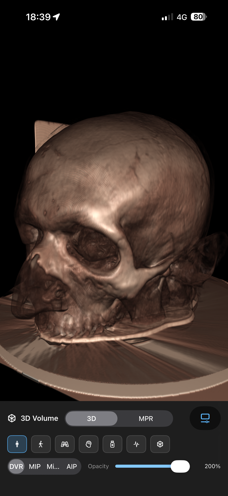

# MTK — Metal Toolkit for volumetric rendering


Swift Package with Metal/SceneKit/SwiftUI helpers used by the Metal-MPR-VR stack. The code currently ships the rendering pipelines, materials, SwiftUI overlays, and DICOM loader bridge used by the demo app—no legacy migration notes or placeholder APIs.



## Package layout
- `MTKCore` — Domain types (`VolumeDataset`, orientation/spacing models), Metal helpers (`MetalRaycaster`, `VolumeTextureFactory`, `ShaderLibraryLoader`), transfer function models (`AdvancedToneCurveModel`, `VolumeTransferFunctionLibrary`), runtime availability guards, and the `DicomVolumeLoader` that wraps an injected `DicomSeriesLoading` bridge.
- `MTKSceneKit` — SceneKit materials and camera helpers (`VolumeCubeMaterial`, `MPRPlaneMaterial`, `VolumeCameraController`, SceneKit node extensions).
- `MTKUI` — SwiftUI-friendly controllers and overlays (`VolumetricSceneController`, `VolumetricSceneCoordinator`, `VolumetricDisplayContainer`, gesture modifiers, overlays like `CrosshairOverlayView`, `WindowLevelControlView`, and `MPRGridComposer` for tri-planar layouts).

## Requirements
- Swift 5.10, Xcode 16
- iOS 17+ / macOS 14+
- Metal-capable device (tests skip when Metal is unavailable)
- Metal Performance Shaders unlock histogram/gaussian paths but the stack falls back when MPS is absent

## Intended use and safety
MTK is a rendering and UI toolkit for research, education, and prototype applications involving volumetric medical-image data on Apple platforms. It is **not** a medical device, has **not** been validated for clinical decision-making, and should not be the sole basis for diagnosis, treatment, or patient triage.

If you load real DICOM studies, keep PHI handling, local security, and institutional review requirements in mind. The repository demonstrates rendering infrastructure and loading patterns; it does not claim regulatory clearance, dataset-wide clinical validation, or diagnostic performance.

## Add via Swift Package Manager
Point Xcode/SwiftPM at the `MTK` directory (local checkout or Git URL) and depend on the library products you need:

```swift
.package(path: "../MTK"), // or the Git URL that points to this directory
.target(
    name: "YourApp",
    dependencies: [
        .product(name: "MTKCore", package: "MTK"),
        .product(name: "MTKSceneKit", package: "MTK"),
        .product(name: "MTKUI", package: "MTK")
    ]
)
```

## Reproducible local setup
`Package.swift` currently declares `DICOM-Decoder` as a local path dependency (`../DICOM-Decoder`). For a clean checkout, place the repositories side by side before resolving dependencies:

```bash
mkdir mtk-workspace
cd mtk-workspace
git clone https://github.com/ThalesMMS/DICOM-Decoder.git
git clone https://github.com/ThalesMMS/MTK.git
cd MTK
swift package resolve
swift build
```

Minimal smoke test that does not require private fixtures:

```bash
swift test --filter DicomVolumeLoaderSecurityTests
```

For broader testing on a Metal-capable Mac:

```bash
swift test
```

Some DICOM-oriented tests rely on optional local fixtures from `MTK-Demo/DICOM_Example` that are **not** committed to this repository. Those suites skip when fixtures or the native bridge are unavailable, so a passing run may still be partial on a fresh machine.

## Shaders and resources
- Build-tool plugin `MTKShaderPlugin` compiles `Sources/MTKCore/Resources/Shaders/*.metal` into `MTK.metallib` during the build. At runtime `ShaderLibraryLoader` first looks for a bundled `VolumeRendering.metallib`, then falls back to the module’s default library or runtime compilation of the shader sources.
- CI/manual fallback: `bash Tooling/Shaders/build_metallib.sh Sources/MTKCore/Resources/Shaders .build/MTK.metallib`
- Sample RAW datasets referenced by `VolumeTextureFactory(preset:)` are not shipped; presets will fall back to a 1³ placeholder unless you add zipped RAW assets to `Sources/MTKCore/Resources`.

## Quick start (SwiftUI)
Minimal SwiftUI viewer that applies a volume and overlays UI controls:

```swift
import MTKCore
import MTKUI
import SwiftUI

struct VolumePreview: View {
    @StateObject private var coordinator = VolumetricSceneCoordinator.shared

    var body: some View {
        VolumetricDisplayContainer(controller: coordinator.controller) {
            OrientationOverlayView()
            CrosshairOverlayView()
        }
        .task {
            // Build a dataset from your own voxel buffer
            let voxelCount = 256 * 256 * 128
            let voxels = Data(repeating: 0, count: voxelCount * VolumePixelFormat.int16Signed.bytesPerVoxel)
            let dataset = VolumeDataset(
                data: voxels,
                dimensions: VolumeDimensions(width: 256, height: 256, depth: 128),
                spacing: VolumeSpacing(x: 0.001, y: 0.001, z: 0.0015),
                pixelFormat: .int16Signed,
                intensityRange: (-1024)...3071
            )

            coordinator.apply(dataset: dataset)
            coordinator.applyHuWindow(min: -500, max: 1200)
            await coordinator.controller.setPreset(.softTissue)
        }
    }
}
```

Add gesture handling with `volumeGestures(controller:state:configuration:)` and multi-plane layouts with `MPRGridComposer` when you need synchronized axial/coronal/sagittal slices.

## Loading DICOM volumes
`DicomVolumeLoader` orchestrates ZIP extraction and dataset construction but expects a `DicomSeriesLoading` implementation to feed slice data (see `LegacyDicomSeriesLoader` in MTK-Demo for a GDCM-backed bridge). Progress updates can be mapped to UI with `DicomVolumeLoader.uiUpdate(from:)`.

## Expected inputs and outputs
**Typical inputs**
- A synthetic or programmatically generated voxel buffer wrapped in `VolumeDataset`
- A DICOM directory, ZIP archive, or individual file routed through `DicomVolumeLoader`
- 16-bit scalar volume data with spatial metadata available for reconstruction

**Typical outputs**
- An in-memory `VolumeDataset` ready for rendering
- `DicomImportResult` metadata such as `sourceURL` and `seriesDescription`
- SwiftUI / SceneKit rendering surfaces, MPR views, overlays, and transfer-function-driven visualization

MTK does **not** produce segmentation masks, classification labels, radiology reports, or treatment recommendations by itself. In other words, the package is a visualization/loading substrate, not a diagnostic model.

## Runtime checks and diagnostics
- `BackendResolver` and `MetalRuntimeAvailability` gate Metal usage before creating controllers.
- `CommandBufferProfiler`, `MetalRuntimeGuard`, and `VolumeRenderingDebugOptions` help surface GPU/runtime capabilities during development.

## Testing notes
- `swift test` requires a Metal-capable host; GPU-dependent suites skip automatically when no device is available.
- DICOM-related tests expect fixtures under `MTK-Demo/DICOM_Example` (not committed). Tests will skip when fixtures or the native bridge are missing.
- Security coverage includes ZIP path-traversal regression tests for `DicomVolumeLoader`; visual-quality checks compare accelerated and non-accelerated rendering paths on synthetic datasets.

## Limitations and evaluation caveats
- The package targets Apple-platform rendering workflows; it is not a cross-platform PACS, archive, or viewer.
- Clean reproducibility currently depends on a sibling checkout of `DICOM-Decoder` because the dependency is path-based.
- Public examples and tests mostly exercise synthetic datasets, renderer behaviors, and optional local fixtures rather than a versioned benchmark corpus committed in this repository.
- Rendering correctness checks and visual-regression tests are useful engineering signals, but they are **not** the same thing as clinical validation or reader-study evidence.
- DICOM import support depends on the available loader implementation and metadata quality; malformed studies, unsupported encodings, missing tags, or non-16-bit inputs may fail or degrade gracefully rather than producing a clinically usable view.

## Documentation

DocC documentation covers the three modules (MTKCore, MTKSceneKit, MTKUI) with API reference, conceptual guides, and a Getting Started tutorial. Runnable examples are in the `Examples/` directory.

Generate documentation locally:

```bash
bash Tooling/build_docs.sh
```

This creates `.doccarchive` files in the `docs/` directory that can be opened in Xcode or hosted as static HTML.

## License
Apache 2.0. See `LICENSE`.
