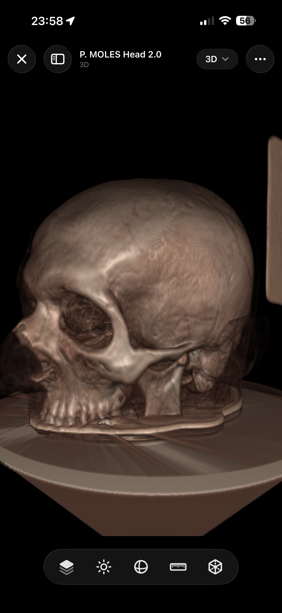
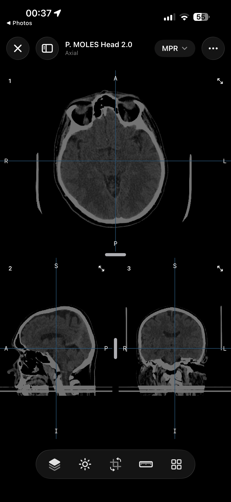

# MTK — Metal Toolkit for volumetric rendering


Swift Package with Metal-native volume rendering, SwiftUI overlays, and companion DICOM integration through separate public packages. Metal is the only official clinical renderer. Interactive clinical frames are `MTLTexture` outputs presented through `MTKView` or `CAMetalLayer`; `CGImage` is allowed only for explicit export, snapshot, debug, and test readback use cases behind `SnapshotExporting`/`TextureSnapshotExporter`.

<table align="center">
  <tr>
    <td align="center"><b>3D Volume Rendering</b></td>
    <td align="center"><b>MPR View</b></td>
  </tr>
  <tr>
    <td></td>
    <td></td>
  </tr>
</table>

## Package layout
- `MTKCore` — Domain types (`VolumeDataset`, orientation/spacing models), Metal helpers (`MetalRaycaster`, `VolumeTextureFactory`, `ShaderLibraryLoader`), serializable clinical transfer function models (`TransferFunction`, `ClinicalTransferFunctionPreset`, `AdvancedToneCurveModel`, `VolumeTransferFunctionLibrary`), and runtime availability guards. MTKCore does not parse DICOM.
- `MTKUI` — SwiftUI-friendly public viewport contracts (`StackViewport`, `VolumeViewport`, `VolumeViewport3D`, `ClinicalViewportSession`) plus containers, overlays, and compatibility controllers. MTKUI is the UI layer over MTKCore Metal volume/MPR adapters. `MetalViewportSurface` is the official clinical `MTKView` presentation surface.
- `MTKFixtures` — Optional synthetic datasets generated by code. The public package does not ship `.raw.zip` fixture presets.

## Related repositories
- [MTK](https://github.com/ThalesMMS/MTK) — Metal rendering core, SwiftUI viewports, and synthetic fixtures.
- [DICOM-Swift](https://github.com/ThalesMMS/DICOM-Swift) — Swift DICOM parsing, ZIP loading, metadata extraction, and decoded series assembly.
- [MTKDicomBridge](https://github.com/ThalesMMS/MTKDicomBridge) — Separate SwiftPM package that converts `DicomCore.DicomDecodedSeries` into MTK `VolumeDataset` values.
- [MTK-Demo](https://github.com/ThalesMMS/MTK-Demo) — Public demo app that consumes MTK, MTKDicomBridge, and DICOM-Swift by release tag.

## Architecture
The public app-facing API contract is documented in [Architecture/PublicAPI.md](Architecture/PublicAPI.md). The accepted clinical rendering architecture is documented in [Architecture/ClinicalRenderingADR.md](Architecture/ClinicalRenderingADR.md). Multi-volume registration and resampling follow the staged plan in [Architecture/MultiVolumeRegistration.md](Architecture/MultiVolumeRegistration.md).

```text
DICOM / VolumeDataset
        |
        v
VolumeResourceManager
        |
        v
GPU volume texture / transfer texture / auxiliary textures
        |
        v
MTKRenderingEngine
        |
        v
ViewportRenderGraph
        |
        v
VolumeRaycastPass / MPRReslicePass / MIPPass / OverlayPass
        |
        v
PresentationPass
        |
        v
MTKView / CAMetalLayer drawable
```

Metal-native rendering is the only official clinical backend. The target interactive presentation surface is `MTKView`/`CAMetalLayer`, with `MTLTexture` as the frame result handed to the presentation pass. Viewports are expected to share GPU resources through handles owned by a resource manager, so synchronized volume, MPR, projection, and overlay views consume the same volume textures, transfer textures, and auxiliary textures instead of duplicating them per surface.

Bounding geometry can be a valid internal implementation detail for ray entry and ray exit inside a specialized pass. It does not change the public clinical rendering architecture.

`MetalViewportSurface` is the official MTKUI surface for drawable-backed clinical presentation. It presents completed 2D `MTLTexture` frames through `PresentationPass` into an `MTKView` drawable without `CGImage` conversion. The primary flow is `compute/render pass -> persistent outputTexture -> PresentationPass -> drawable -> present`; compute directly into the drawable is not the main path because drawables are ephemeral presentation targets, acquisition can be display-paced, and presented drawables cannot be reused for scheduling, inspection, export, or overlay composition.

For application code, prefer the stable public wrappers: `VolumeDataset`/`ImageData3D`, `StackViewport`, `VolumeViewport`, `VolumeViewport3D`, `ClinicalViewportSession`, clinical transfer functions, `VolumeLayer`, `SurfaceMeshLayer`, and `MetalViewportSurface`/`MetalViewportView`. `MTKRenderingEngine`, `ViewportRenderGraph`, `VolumeResourceManager`, `RenderPassNode`, and output texture pools are implementation details behind those wrappers, not the recommended product API.

## Volume input boundary
MTKCore owns the renderer-ready volume DTOs used at the package boundary: `VolumetricDimensions`,
`VolumetricSpacing`, `VolumetricOrientation`, `VolumetricPixelFormat`, `VolumetricSeriesData`, and
`VolumetricSeriesDataProvider`. App-side loaders that use GDCM, DICOM-Swift, or custom ingestion keep responsibility
for DICOM parsing, PHI handling, decompression, slice ordering, rescale, and window metadata, then hand MTKCore a
decoded scalar volume through `VolumetricSeriesData`, a provider adapter, or a manually constructed `VolumeDataset`.
The main rendering path does not require `MTKDicomBridge`.

## Segmentation surfaces
MTKCore exposes a `SurfaceMesh` contract with vertices, normals, indices, coordinate space, bounds, and segment metadata. `MarchingCubesExtractor` provides deterministic CPU extraction from `LabelmapVolume` labels or scalar `VolumeDataset` thresholds. Extracted labelmap meshes carry the same label/segment id that MPR labelmap overlays use. Extracted meshes default to `.worldMillimeters` coordinates through the source volume affine; `.textureNormalized` is available for callers that need texture-space geometry.

`MTKDicomBridge` can convert parsed DICOM SEG objects into `VolumeLayer` labelmaps aligned to a base `VolumeDataset`, preserving segment labels for MPR and 3D overlay review.

The render path is `labelmap 3D -> SurfaceMesh -> SurfaceMeshLayer -> volume3D viewport`. `SurfaceMeshProcessor` provides deterministic CPU topology repair, Laplacian smoothing, and ratio-based triangle decimation before rendering. `SurfaceMeshMaterial` carries clinical, matte, glossy, and unlit shading defaults, and `MetalSurfaceMeshRenderer` draws indexed triangles into the existing Metal output texture after volume raycasting. Opaque surfaces write mesh-local depth first, semi-transparent surfaces render afterward with stable layer-level back-to-front ordering, and volume crop/clip settings are applied to the surface fragments. True raycast-volume depth occlusion and GPU extraction remain explicit follow-ups because the raycast pass does not yet publish a reusable depth texture.

## Multi-volume fusion
MTKCore and MTKUI support v1 scalar volume fusion for registered layer stacks in a 3D viewport. `VolumeLayer` can carry scalar volume content with its own `VolumeDataset`, `VolumeTransferFunction`, opacity, visibility, and blend mode. `VolumeLayerBlendMode.sourceOver` is the default alpha-over mode, and `.additive` is available for PET-like heat or dose overlays.

The existing single-volume `VolumeRenderRequest(dataset:transferFunction:...)`, `VolumeViewport3D.applyDataset`, and `ClinicalViewportSession` setup paths remain source-compatible. Multi-layer rendering keeps the one-layer fast path; additional visible scalar layers are raycast separately and composited through a Metal pass, so cost scales with the number of visible scalar layers. `VolumeResourceManager` shares layer resources by handle across viewports and reports layer memory in GPU resource metrics.

MTK does not implement automatic or deformable registration. Scalar layers can be supplied either pre-resampled into the base volume texture space or with an externally supplied axis-aligned scale/translation `baseWorldToLayerWorld` transform. Supported registered scalar overlays are CPU-resampled into the base geometry before the 3D fusion fast path; unsupported affine, rotation, shear, perspective, and non-finite transforms fail with a structured error. Labelmap/MPR affine overlay support remains unchanged. The registration and resampling contract is documented in [Architecture/MultiVolumeRegistration.md](Architecture/MultiVolumeRegistration.md).

## Requirements
- Swift 5.10, Xcode 16
- iOS 17+ / macOS 14+
- Metal-capable device required for rendering and GPU test coverage. Metal is the runtime contract for rendering; no alternate rendering runtime is provided. GPU-dependent tests require Metal and skip when unavailable.
- Metal Performance Shaders behavior is feature-specific and should be treated as an explicit capability/result contract:
  - Volume rendering (`MetalVolumeRenderingAdapter`, `MetalRaycaster`): Pure Metal ray marching is the required rendering path on Metal-capable devices and has no MPS dependency.
  - Empty-space acceleration (`MPSEmptySpaceAccelerator`): Optional MPS accelerator for supported devices. Shared helpers return `.success`, `.unavailable(reason:)`, or `.failed(error)` instead of `nil`.
  - Histogram calculation (`VolumeHistogramCalculator`): Pure Metal compute. No MPS dependency.
  - Statistics calculation (`VolumeStatisticsCalculator`): Metal compute with explicit GPU setup and execution errors. CPU reference implementations exist only in tests.

## Intended use and safety
MTK is a rendering and UI toolkit for research, education, and prototype applications involving volumetric medical-image data on Apple platforms. It is **not** a medical device, has **not** been validated for clinical decision-making, and should not be the sole basis for diagnosis, treatment, or patient triage.

If you load real DICOM studies, keep PHI handling, local security, and institutional review requirements in mind. The repository demonstrates rendering infrastructure and loading patterns; it does not claim regulatory clearance, dataset-wide clinical validation, or diagnostic performance.

## Add via Swift Package Manager
Point Xcode or SwiftPM at the MTK Git repository and depend on the library products you need:

```swift
.package(url: "https://github.com/ThalesMMS/MTK.git", exact: "1.3.1"),
.target(
    name: "YourApp",
    dependencies: [
        .product(name: "MTKCore", package: "MTK"),
        .product(name: "MTKUI", package: "MTK")
    ]
)
```

`MTKDicomBridge` is published as a separate package, not as an MTK product. Add it only when the app wants MTK's default Swift DICOM parser:

```swift
.package(url: "https://github.com/ThalesMMS/MTK.git", exact: "1.3.1"),
.package(url: "https://github.com/ThalesMMS/MTKDicomBridge.git", exact: "1.0.2"),
.target(
    name: "YourApp",
    dependencies: [
        .product(name: "MTKCore", package: "MTK"),
        .product(name: "MTKDicomBridge", package: "MTKDicomBridge")
    ]
)
```

SceneKit examples may be extracted to a separate experimental package in the future, but they are not part of the main package contract.

### Migration map for former MTKSceneKit consumers
- Replace `MTKSceneKit` volume presentation (`VolumeCubeMaterial`) with `MTKCore` rendering through `MetalVolumeRenderingAdapter` and present the resulting frames with `MTKUI` containers such as `VolumeViewportContainer` and `MetalViewportSurface`.
- Replace `MTKSceneKit` MPR presentation (`MPRPlaneMaterial`) with `MetalMPRAdapter` plus `MTKUI` layouts such as `MPRGridComposer` or `TriplanarMPRComposer`.
- Replace `VolumeCameraController` and `CameraPose`-driven interaction with `StackViewport`, `VolumeViewport`, `VolumeViewport3D`, or `ClinicalViewportSession`.
- Replace node/plane helper usage (`SCNNode+Volumetric`) with geometry and display helpers that stay in the Metal-native path, such as `MPRPlaneGeometryFactory` and `MPRDisplayTransformFactory`.
- If you still need a standalone 3D wrapper for non-clinical experiments, keep that code outside the main package. There is no maintained `SceneKitExamples` package in this repository today.

Recommended vs Legacy:
- Recommended: `MetalVolumeRenderingAdapter` + `VolumeViewportContainer` / Legacy: deprecated `VolumeCubeMaterial`
- Recommended: `MetalMPRAdapter` + `MPRGridComposer` or `TriplanarMPRComposer` / Legacy: deprecated `MPRPlaneMaterial`
- Recommended: `StackViewport`, `VolumeViewport`, `VolumeViewport3D`, or `ClinicalViewportSession` / Legacy: deprecated `VolumeCameraController`, `CameraPose`, `SCNNode+Volumetric`

Compatibility note:
- The current MTK package requires iOS 17+ and macOS 14+. Downstream apps that still need older platform support or a custom 3D wrapper should keep that compatibility layer outside this package.
- Example code for the supported migration path lives in [`Examples/BasicVolumeRendering.swift`](Examples/BasicVolumeRendering.swift), [`Examples/MPRViewer.swift`](Examples/MPRViewer.swift), [`Examples/TriplanarMPRViewer.swift`](Examples/TriplanarMPRViewer.swift), and [`Examples/DicomLoader.swift`](Examples/DicomLoader.swift).

## Shaders and resources
- `ShaderLibraryLoader` requires `MTK.metallib` to be bundled in `Bundle.module`. Missing or invalid artifacts are reported as structured `ShaderLibraryLoader.LoaderError` cases, such as `metallibNotBundled` or `metallibLoadFailed(underlying:)`.
- Precompiled Metal libraries are versioned under `Sources/MTKCore/Resources` so downstream Xcode projects build without shader-generation trust prompts.
- Manual shader rebuild is only needed after changing `.metal` sources: `MTK_METAL_SDK=all METALLIB_STRICT=1 bash Tooling/Shaders/build_metallib.sh Sources/MTKCore/Resources/Shaders Sources/MTKCore/Resources/MTK.metallib`
- Troubleshooting: if shader loading fails, verify that `MTK.metallib`, `MTK-iphonesimulator.metallib`, and `MTK-iphoneos.metallib` are present in the `MTKCore` resource bundle.
- Public `.raw.zip` presets are not bundled. Use `ClinicalSyntheticFixtures` in `MTKFixtures` for sample volumes; `VolumeTextureFactory(preset:)` is deprecated and kept only for compatibility.
- Preset loading now reports `noDataAvailable`; it does not silently return a stub volume.
- Use `VolumeTextureFactory.debugPlaceholderDataset()` only for tests or explicit debug tooling that needs a minimal 1x1x1 volume.

## Quick start (SwiftUI)
Minimal SwiftUI viewer that applies a volume through the public 3D viewport contract:

```swift
import MTKCore
import MTKUI
import SwiftUI

struct VolumePreview: View {
    @StateObject private var viewport = try! VolumeViewport3D()

    var body: some View {
        MetalViewportView(surface: viewport.surface)
            .task {
                let voxelCount = 256 * 256 * 128
                let voxels = Data(repeating: 0, count: voxelCount * VolumePixelFormat.int16Signed.bytesPerVoxel)
                let dataset = VolumeDataset(
                    data: voxels,
                    dimensions: VolumeDimensions(width: 256, height: 256, depth: 128),
                    spacing: VolumeSpacing(x: 1.0, y: 1.0, z: 1.5),
                    pixelFormat: .int16Signed,
                    intensityRange: (-1024)...3071
                )

                await viewport.applyDataset(dataset)
                await viewport.setWindowLevel(window: 1700, level: 350)
                try? await viewport.applyClinicalTransferFunctionPreset(.ctSoftTissue)
            }
    }
}
```

Use `StackViewport` for volume-backed slice scrolling, `VolumeViewport` for MPR/projection, and `VolumeViewport3D` for true 3D volume rendering. Use `ClinicalViewportSession` with `ClinicalViewportGrid(session:)` for the reference axial/coronal/sagittal plus 3D clinical layout.

## Clinical transfer functions
`TransferFunction` is the public JSON contract for clinical presets and user edits. Version 1 keeps existing `.tf` keys (`name`, `min`, `max`, `colourPoints`, `alphaPoints`, `shift`, `colorSpace`) and adds optional `metadata`, `renderingIntent`, and `gradientOpacity` fields. RGB color is represented by `colourPoints`; opacity is represented by the piecewise `alphaPoints` function. `colourValue.a` remains round-tripped for compatibility but does not replace `alphaPoints`.

```swift
let preset = try ClinicalTransferFunctionPreset.ctVRBone.loadTransferFunction()
let data = try JSONEncoder().encode(preset)
let restored = try JSONDecoder().decode(TransferFunction.self, from: data)

let session = try await ClinicalViewportSession.make(dataset: dataset)
try await session.applyTransferFunction(restored)
```

When `gradientOpacity` is present, MTK builds a 2D transfer texture and multiplies scalar opacity by gradient magnitude during DVR. Presets without `gradientOpacity` keep the legacy 1D transfer-texture path.

## Loading DICOM volumes
`DICOM-Swift` owns DICOM source loading, ZIP extraction, slice ordering, geometry validation, rescale slope/intercept, recommended window metadata, and DICOM errors. Use `MTKCore` alone when your app already has a `VolumeDataset`. Import `MTKDicomBridge` when you want to convert the default `DICOM-Swift` result into a renderer-ready dataset:

```swift
import MTKCore
import MTKDicomBridge

let importer = DicomVolumeDatasetImporter()
importer.loadDataset(from: sourceURL, progress: { _ in }) { result in
    let dataset = try? result.get().dataset
    _ = dataset
}
```

Progress and failures are surfaced from `DicomCore`; the bridge does not remap DICOM parser errors into MTKCore-specific error cases.

## Expected inputs and outputs
**Typical inputs**
- A synthetic or programmatically generated voxel buffer wrapped in `VolumeDataset`
- A DICOM directory, ZIP archive, or individual file routed through `DICOM-Swift` and converted by `MTKDicomBridge`
- 16-bit scalar volume data with spatial metadata available for reconstruction

**Typical outputs**
- An in-memory `VolumeDataset` ready for rendering
- `DicomVolumeDatasetImportResult` metadata such as `sourceURL` and `seriesDescription`
- Interactive `MTLTexture` frame outputs for drawable-backed presentation
- SwiftUI rendering surfaces, MPR views, overlays, and transfer-function-driven visualization backed by MTKCore Metal adapters

MTK does **not** produce segmentation masks, classification labels, radiology reports, or treatment recommendations by itself. In other words, the package is a visualization/loading substrate, not a diagnostic model.

## Runtime checks and diagnostics
- `BackendResolver` and `MetalRuntimeAvailability` enforce the Metal rendering requirement before controllers are created. `ensureAvailability()` throws explicit availability errors, and `status()` exposes structured diagnostics plus optional MPS capability flags.
- `MetalRuntimeGuard` exposes structured requirement status, missing required capabilities, and optional MPS feature availability for diagnostics.
- `CommandBufferProfiler` and `VolumeRenderingDebugOptions` help surface GPU runtime behavior during development.

```swift
func makeVolumeViewport() throws -> VolumeViewport3D {
    try MetalRuntimeAvailability.ensureAvailability()
    let status = MetalRuntimeAvailability.status()
    print("MPS available: \(status.supportsMetalPerformanceShaders)")
    return try VolumeViewport3D()
}

do {
    let viewport = try makeVolumeViewport()
    print(viewport.state.presentation)
} catch {
    let status = MetalRuntimeAvailability.status()
    print("Metal requirement failed: \(status.missingFeatures)")
    print("MPS available: \(status.supportsMetalPerformanceShaders)")
}
```

## Testing notes
- `swift test` requires a Metal-capable host for GPU-dependent suites; those tests require Metal and skip when unavailable.
- Hardware or OS capability skips are expected for unavailable Metal, unavailable MPS features, and iOS-only gesture
  overlay coverage when the suite runs on macOS.
- Clinical performance budget coverage uses the committed manifest at
  `Roadmap/ClinicalPerformanceBudgetManifest.json`; local benchmark result files should include the environment fields
  listed there before comparisons are treated as clinical-rendering evidence.
- DICOM geometry tests commit small non-PHI manifest fixtures. Large real DICOM series remain optional local fixtures
  and are intentionally skipped when unavailable.
- The standalone `VolumeRendererComparison` benchmark requires an explicit local DICOM path through `--dicom`. If you want to use the sample data from the demo project, clone or download fixtures from `https://github.com/ThalesMMS/MTK-Demo.git` and pass the local path explicitly.
- DICOM source security coverage lives in `DICOM-Swift`; visual-quality checks compare MPS-accelerated empty-space skipping (feature availability requires MPS) against core Metal ray marching on synthetic datasets.

## Limitations and evaluation caveats
- The package targets Apple-platform rendering workflows; it is not a cross-platform PACS, archive, or viewer.
- Public examples and tests mostly exercise synthetic datasets, renderer behaviors, and optional local fixtures rather than a versioned benchmark corpus committed in this repository.
- Rendering correctness checks and visual-regression tests are useful engineering signals, but they are **not** the same thing as clinical validation or reader-study evidence.
- DICOM import support depends on `DICOM-Swift` metadata coverage and input quality. Unsupported transfer syntaxes, malformed datasets, geometry failures, unsupported scalar formats, empty sources, and unsafe ZIP entries surface as `DicomCore` errors.

## Documentation

DocC documentation covers the two modules (`MTKCore`, `MTKUI`) with API reference, conceptual guides, and a Getting Started tutorial. The clinical rendering decision lives in `Architecture/ClinicalRenderingADR.md`. Runnable examples are in the `Examples/` directory.

Platform-specific viewer UI contracts (which components target compact
iPhone, large-screen iPadOS, and macOS desktop; layout classes; chrome
recipes; MTK-Demo migration) are documented in the MTKUI adaptation guide:
`Sources/MTKUI/MTKUI.docc/ViewerPlatformAdaptation.md`.

Generate documentation locally:

```bash
bash Tooling/build_docs.sh
```

This creates `.doccarchive` files in the `docs/` directory that can be opened in Xcode or hosted as static HTML.

## License
Apache 2.0. See `LICENSE`.
