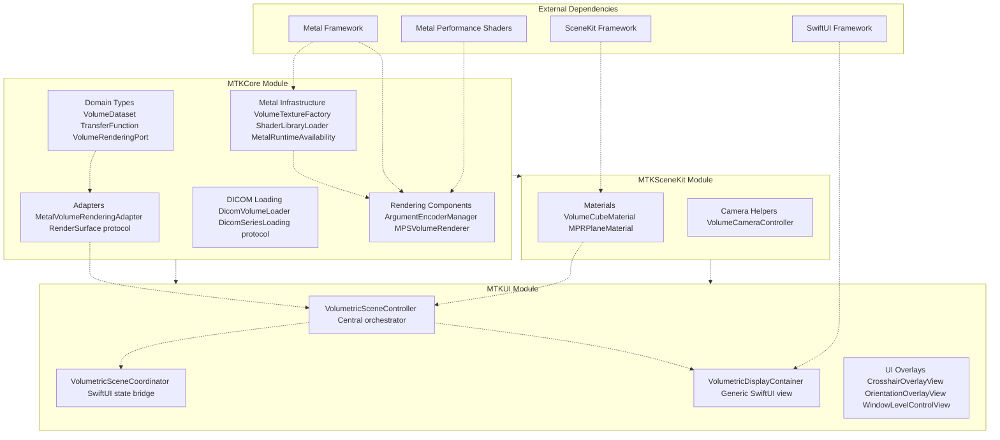
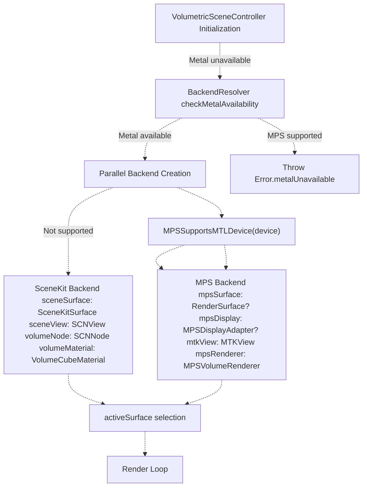
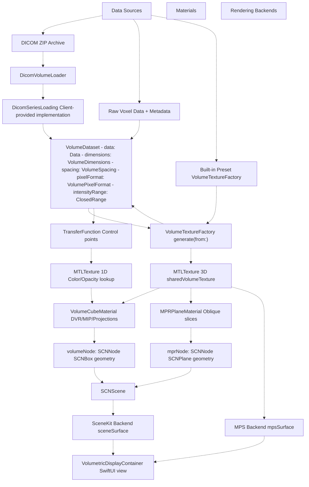

# Overview

> **Relevant source files**
> * [BACKEND_RESOLVER_USAGE.md](https://github.com/ThalesMMS/MTK/blob/eda6f990/BACKEND_RESOLVER_USAGE.md)
> * [DOCUMENTATION_STANDARD.md](https://github.com/ThalesMMS/MTK/blob/eda6f990/DOCUMENTATION_STANDARD.md)
> * [README.md](https://github.com/ThalesMMS/MTK/blob/eda6f990/README.md)
> * [SURFACE_ADAPTER_DELIVERABLES.txt](https://github.com/ThalesMMS/MTK/blob/eda6f990/SURFACE_ADAPTER_DELIVERABLES.txt)
> * [Sources/MTKUI/VolumetricSceneController.swift](https://github.com/ThalesMMS/MTK/blob/eda6f990/Sources/MTKUI/VolumetricSceneController.swift)

MTK (Metal Toolkit) is a Swift Package providing volumetric rendering infrastructure for medical imaging applications on iOS and macOS. It orchestrates Metal-accelerated 3D visualization through a three-tier architecture: **MTKCore** (domain models and Metal abstractions), **MTKSceneKit** (rendering materials and camera controls), and **MTKUI** (SwiftUI integration with reactive state management). The system supports dual rendering backends—SceneKit with custom Metal shaders and Metal Performance Shaders (MPS) for GPU-accelerated operations—with automatic capability detection and runtime switching.

For specific integration patterns, see [Getting Started](1b%20Getting-Started.md). For detailed rendering architecture, see [Rendering Architecture](2%20Rendering-Architecture.md). For the central controller API, see [VolumetricSceneController](3%20VolumetricSceneController.md).

---

## Purpose and Scope

MTK provides the complete pipeline for volumetric medical imaging visualization:

* Loading volumetric datasets from DICOM archives or raw voxel data
* Generating 3D Metal textures from volume data
* Rendering volumes using Direct Volume Rendering (DVR), Maximum Intensity Projection (MIP), or Multi-Planar Reconstruction (MPR)
* Managing transfer functions for intensity-to-color mappings
* Exposing SwiftUI-compatible views with reactive state management
* Supporting both SceneKit-based and MPS-based rendering paths

The toolkit **does not** provide DICOM parsing implementations—clients must supply a `DicomSeriesLoading` bridge (see [DICOM Loading](5b%20DICOM-Loading.md)). It also does not include medical image processing algorithms beyond basic windowing and histogram analysis.

**Sources:** [README.md L1-L9](https://github.com/ThalesMMS/MTK/blob/eda6f990/README.md#L1-L9)

 [Package.swift L1-L50](https://github.com/ThalesMMS/MTK/blob/eda6f990/Package.swift#L1-L50)

---

## Three-Tier Module Architecture

MTK follows a strict dependency hierarchy to enable modular adoption and framework decoupling:



**Tier 1: MTKCore** — Framework-agnostic foundation layer containing:

* `VolumeDataset`: Voxel data container with spatial metadata ([Sources/MTKCore/Models/VolumeDataset.swift L1-L200](https://github.com/ThalesMMS/MTK/blob/eda6f990/Sources/MTKCore/Models/VolumeDataset.swift#L1-L200) )
* `VolumeTextureFactory`: Converts `VolumeDataset` to `MTLTexture` ([Sources/MTKCore/Metal/VolumeTextureFactory.swift L1-L300](https://github.com/ThalesMMS/MTK/blob/eda6f990/Sources/MTKCore/Metal/VolumeTextureFactory.swift#L1-L300) )
* `TransferFunction`: Intensity-to-color mapping with control points ([Sources/MTKCore/Models/TransferFunction.swift L1-L400](https://github.com/ThalesMMS/MTK/blob/eda6f990/Sources/MTKCore/Models/TransferFunction.swift#L1-L400) )
* `VolumeRenderingPort`: Abstract rendering protocol for framework independence ([Sources/MTKCore/Contracts/VolumeRenderingPort.swift L1-L200](https://github.com/ThalesMMS/MTK/blob/eda6f990/Sources/MTKCore/Contracts/VolumeRenderingPort.swift#L1-L200) )
* `RenderSurface`: Display abstraction decoupling rendering from UI frameworks ([Sources/MTKCore/Adapters/RenderSurface.swift L1-L50](https://github.com/ThalesMMS/MTK/blob/eda6f990/Sources/MTKCore/Adapters/RenderSurface.swift#L1-L50) )
* `MetalRuntimeAvailability`: Metal capability detection ([Sources/MTKCore/Support/MetalRuntimeAvailability.swift L1-L100](https://github.com/ThalesMMS/MTK/blob/eda6f990/Sources/MTKCore/Support/MetalRuntimeAvailability.swift#L1-L100) )
* `DicomVolumeLoader`: DICOM loading orchestrator expecting injected `DicomSeriesLoading` implementation ([Sources/MTKCore/Loaders/DicomVolumeLoader.swift L1-L500](https://github.com/ThalesMMS/MTK/blob/eda6f990/Sources/MTKCore/Loaders/DicomVolumeLoader.swift#L1-L500) )

**Tier 2: MTKSceneKit** — SceneKit-specific rendering components:

* `VolumeCubeMaterial`: Custom Metal material for DVR/MIP/projections ([Sources/MTKSceneKit/Materials/VolumeCubeMaterial.swift L1-L800](https://github.com/ThalesMMS/MTK/blob/eda6f990/Sources/MTKSceneKit/Materials/VolumeCubeMaterial.swift#L1-L800) )
* `MPRPlaneMaterial`: Oblique slice rendering material ([Sources/MTKSceneKit/Materials/MPRPlaneMaterial.swift L1-L600](https://github.com/ThalesMMS/MTK/blob/eda6f990/Sources/MTKSceneKit/Materials/MPRPlaneMaterial.swift#L1-L600) )
* `VolumeCameraController`: Patient-oriented camera management ([Sources/MTKSceneKit/Camera/VolumeCameraController.swift L1-L400](https://github.com/ThalesMMS/MTK/blob/eda6f990/Sources/MTKSceneKit/Camera/VolumeCameraController.swift#L1-L400) )

**Tier 3: MTKUI** — SwiftUI integration layer:

* `VolumetricSceneController`: Central orchestrator managing both backends ([Sources/MTKUI/VolumetricSceneController.swift L193-L436](https://github.com/ThalesMMS/MTK/blob/eda6f990/Sources/MTKUI/VolumetricSceneController.swift#L193-L436) )
* `VolumetricSceneCoordinator`: SwiftUI-friendly wrapper with `@StateObject` lifecycle ([Sources/MTKUI/VolumetricSceneCoordinator.swift L1-L300](https://github.com/ThalesMMS/MTK/blob/eda6f990/Sources/MTKUI/VolumetricSceneCoordinator.swift#L1-L300) )
* `VolumetricDisplayContainer`: Generic SwiftUI view with composable overlays ([Sources/MTKUI/VolumetricDisplayContainer.swift L1-L100](https://github.com/ThalesMMS/MTK/blob/eda6f990/Sources/MTKUI/VolumetricDisplayContainer.swift#L1-L100) )
* Built-in overlays: `CrosshairOverlayView`, `OrientationOverlayView`, `WindowLevelControlView`, `MPRGridComposer`

**Sources:** [README.md L5-L9](https://github.com/ThalesMMS/MTK/blob/eda6f990/README.md#L5-L9)

 [Sources/MTKUI/VolumetricSceneController.swift L193-L436](https://github.com/ThalesMMS/MTK/blob/eda6f990/Sources/MTKUI/VolumetricSceneController.swift#L193-L436)

 [SURFACE_ADAPTER_DELIVERABLES.txt L1-L14](https://github.com/ThalesMMS/MTK/blob/eda6f990/SURFACE_ADAPTER_DELIVERABLES.txt#L1-L14)

---

## Dual Rendering Backend System

MTK implements two rendering paths with runtime capability detection and dynamic switching:



### SceneKit Backend (Universal Fallback)

Always initialized during controller creation. Relies on `SCNView` with custom Metal shaders:

* `sceneView: SCNView` configured with Metal rendering API ([Sources/MTKUI/VolumetricSceneController.swift L358-L384](https://github.com/ThalesMMS/MTK/blob/eda6f990/Sources/MTKUI/VolumetricSceneController.swift#L358-L384) )
* `scene: SCNScene` containing `volumeNode` and `mprNode` ([Sources/MTKUI/VolumetricSceneController.swift L386-L404](https://github.com/ThalesMMS/MTK/blob/eda6f990/Sources/MTKUI/VolumetricSceneController.swift#L386-L404) )
* `volumeMaterial: VolumeCubeMaterial` implements DVR/MIP using `volume_vertex` and `volume_fragment` shaders
* `mprMaterial: MPRPlaneMaterial` renders oblique slices with slab blending
* Wrapped in `SceneKitSurface` conforming to `RenderSurface` protocol

**Key files:**

* [Sources/MTKUI/VolumetricSceneController.swift L332-L436](https://github.com/ThalesMMS/MTK/blob/eda6f990/Sources/MTKUI/VolumetricSceneController.swift#L332-L436)  (initialization)
* [Sources/MTKSceneKit/Materials/VolumeCubeMaterial.swift L1-L800](https://github.com/ThalesMMS/MTK/blob/eda6f990/Sources/MTKSceneKit/Materials/VolumeCubeMaterial.swift#L1-L800)  (material implementation)
* [Sources/MTKCore/Resources/Shaders/volume.metal](https://github.com/ThalesMMS/MTK/blob/eda6f990/Sources/MTKCore/Resources/Shaders/volume.metal)  (shader source)

### Metal Performance Shaders Backend (GPU-Accelerated)

Conditionally initialized when `MPSSupportsMTLDevice(device)` returns `true`:

* `mpsDisplay: MPSDisplayAdapter?` nested class managing MPS rendering ([Sources/MTKUI/VolumetricSceneController L29-L273](https://github.com/ThalesMMS/MTK/blob/eda6f990/Sources/MTKUI/VolumetricSceneController+MPS.swift#L29-L273) )
* `mtkView: MTKView` providing drawable surface
* `mpsRenderer: MPSVolumeRenderer` performing histogram analysis, Gaussian filtering, and ray casting ([Sources/MTKCore/Rendering/MPSVolumeRenderer.swift L1-L1000](https://github.com/ThalesMMS/MTK/blob/eda6f990/Sources/MTKCore/Rendering/MPSVolumeRenderer.swift#L1-L1000) )
* Wrapped in `RenderSurface`-conforming adapter

**Capabilities:**

* `MPSImageHistogram` for automatic windowing suggestions
* `MPSImageGaussianBlur` for noise reduction
* Bounding box ray casting with world-space entry point calculation
* Dynamic clear color adjustment based on histogram brightness

**Check logic:**

```css
#if canImport(MetalPerformanceShaders) && canImport(MetalKit)if MPSSupportsMTLDevice(resolvedDevice) {    let display = MPSDisplayAdapter(device: resolvedDevice, commandQueue: queue)    mpsDisplay = display    mpsSurface = display} else {    mpsDisplay = nil    mpsSurface = nil}#endif
```

**Sources:** [Sources/MTKUI/VolumetricSceneController.swift L347-L356](https://github.com/ThalesMMS/MTK/blob/eda6f990/Sources/MTKUI/VolumetricSceneController.swift#L347-L356)

 [Sources/MTKUI/VolumetricSceneController L29-L273](https://github.com/ThalesMMS/MTK/blob/eda6f990/Sources/MTKUI/VolumetricSceneController+MPS.swift#L29-L273)

 [BACKEND_RESOLVER_USAGE.md L1-L57](https://github.com/ThalesMMS/MTK/blob/eda6f990/BACKEND_RESOLVER_USAGE.md#L1-L57)

### Active Surface Pattern

Only one backend renders at a time via `activeSurface: any RenderSurface` property:

* `controller.surface` dynamically returns the active backend ([Sources/MTKUI/VolumetricSceneController.swift L258](https://github.com/ThalesMMS/MTK/blob/eda6f990/Sources/MTKUI/VolumetricSceneController.swift#L258-L258) )
* `setRenderingBackend(_:)` switches backends without recreating the scene ([Sources/MTKUI/VolumetricSceneController L414-L469](https://github.com/ThalesMMS/MTK/blob/eda6f990/Sources/MTKUI/VolumetricSceneController+Interaction.swift#L414-L469) )
* Both backends share `sharedVolumeTexture: MTLTexture?` for data consistency

**Sources:** [Sources/MTKUI/VolumetricSceneController.swift L253-L264](https://github.com/ThalesMMS/MTK/blob/eda6f990/Sources/MTKUI/VolumetricSceneController.swift#L253-L264)

 [Sources/MTKUI/VolumetricSceneController L414-L469](https://github.com/ThalesMMS/MTK/blob/eda6f990/Sources/MTKUI/VolumetricSceneController+Interaction.swift#L414-L469)

---

## Data Pipeline Overview

The complete flow from data source to rendered display:



**Phase 1: Data Acquisition**

* DICOM archives processed by `DicomVolumeLoader` ([Sources/MTKCore/Loaders/DicomVolumeLoader.swift L1-L500](https://github.com/ThalesMMS/MTK/blob/eda6f990/Sources/MTKCore/Loaders/DicomVolumeLoader.swift#L1-L500) )
* ZIP extraction and series loading delegated to `DicomSeriesLoading` protocol implementation
* Raw voxel data loaded directly into `VolumeDataset`
* Built-in presets via `VolumeTextureFactory.generate(from: preset)` ([Sources/MTKCore/Metal/VolumeTextureFactory.swift L150-L200](https://github.com/ThalesMMS/MTK/blob/eda6f990/Sources/MTKCore/Metal/VolumeTextureFactory.swift#L150-L200) )

**Phase 2: Domain Representation**

* All sources converge to `VolumeDataset` struct ([Sources/MTKCore/Models/VolumeDataset.swift L1-L200](https://github.com/ThalesMMS/MTK/blob/eda6f990/Sources/MTKCore/Models/VolumeDataset.swift#L1-L200) ): * `data: Data` — raw voxel buffer * `dimensions: VolumeDimensions` — width × height × depth * `spacing: VolumeSpacing` — mm per voxel * `pixelFormat: VolumePixelFormat` — int16, uint16, etc. * `intensityRange: ClosedRange<Int32>` — HU range for CT

**Phase 3: GPU Resource Generation**

* `VolumeTextureFactory.generate(from: dataset)` creates 3D `MTLTexture` ([Sources/MTKCore/Metal/VolumeTextureFactory.swift L50-L120](https://github.com/ThalesMMS/MTK/blob/eda6f990/Sources/MTKCore/Metal/VolumeTextureFactory.swift#L50-L120) )
* Stored in `sharedVolumeTexture` property shared by both backends ([Sources/MTKUI/VolumetricSceneController.swift L315](https://github.com/ThalesMMS/MTK/blob/eda6f990/Sources/MTKUI/VolumetricSceneController.swift#L315-L315) )
* `TransferFunction.makeTexture(device:)` generates 1D lookup texture ([Sources/MTKCore/Models/TransferFunction.swift L200-L250](https://github.com/ThalesMMS/MTK/blob/eda6f990/Sources/MTKCore/Models/TransferFunction.swift#L200-L250) )

**Phase 4: Material Configuration**

* `VolumeCubeMaterial` binds volume texture and transfer function to Metal shaders ([Sources/MTKSceneKit/Materials/VolumeCubeMaterial.swift L70-L150](https://github.com/ThalesMMS/MTK/blob/eda6f990/Sources/MTKSceneKit/Materials/VolumeCubeMaterial.swift#L70-L150) )
* `MPRPlaneMaterial` binds volume texture for slice rendering ([Sources/MTKSceneKit/Materials/MPRPlaneMaterial.swift L50-L120](https://github.com/ThalesMMS/MTK/blob/eda6f990/Sources/MTKSceneKit/Materials/MPRPlaneMaterial.swift#L50-L120) )

**Phase 5: Scene Graph Integration**

* Materials attached to `SCNNode` geometries (`volumeNode`, `mprNode`) ([Sources/MTKUI/VolumetricSceneController.swift L390-L404](https://github.com/ThalesMMS/MTK/blob/eda6f990/Sources/MTKUI/VolumetricSceneController.swift#L390-L404) )
* Nodes added to `SCNScene` for SceneKit rendering ([Sources/MTKUI/VolumetricSceneController.swift L386-L388](https://github.com/ThalesMMS/MTK/blob/eda6f990/Sources/MTKUI/VolumetricSceneController.swift#L386-L388) )

**Phase 6: Rendering & Display**

* Active backend renders to `RenderSurface` protocol ([Sources/MTKCore/Adapters/RenderSurface.swift L1-L50](https://github.com/ThalesMMS/MTK/blob/eda6f990/Sources/MTKCore/Adapters/RenderSurface.swift#L1-L50) )
* `VolumetricDisplayContainer` displays `controller.surface` in SwiftUI ([Sources/MTKUI/VolumetricDisplayContainer.swift L26-L50](https://github.com/ThalesMMS/MTK/blob/eda6f990/Sources/MTKUI/VolumetricDisplayContainer.swift#L26-L50) )

**Sources:** README.md

 [Sources/MTKUI/VolumetricSceneController.swift L332-L436](https://github.com/ThalesMMS/MTK/blob/eda6f990/Sources/MTKUI/VolumetricSceneController.swift#L332-L436)

 [Sources/MTKCore/Metal/VolumeTextureFactory.swift L1-L300](https://github.com/ThalesMMS/MTK/blob/eda6f990/Sources/MTKCore/Metal/VolumeTextureFactory.swift#L1-L300)

---

## Core Components and Entry Points

### VolumetricSceneController

Central orchestrator split across five extension files:

| Extension | Purpose | Key Methods |
| --- | --- | --- |
| **Core** ([VolumetricSceneController.swift L193-L436](https://github.com/ThalesMMS/MTK/blob/eda6f990/VolumetricSceneController.swift#L193-L436) <br> ) | Initialization, state management, backend coordination | `init(device:sceneView:)` |
| **+Interaction** ([VolumetricSceneController L20-L503](https://github.com/ThalesMMS/MTK/blob/eda6f990/VolumetricSceneController+Interaction.swift#L20-L503) <br> ) | Public API with 42+ methods | `applyDataset(_:)`, `setTransferFunction(_:)`, `setRenderingBackend(_:)`, `rotateCamera(screenDelta:)`, `setHuWindow(_:)` |
| **+Camera** ([VolumetricSceneController L20-L520](https://github.com/ThalesMMS/MTK/blob/eda6f990/VolumetricSceneController+Camera.swift#L20-L520) <br> ) | Camera transforms, patient orientation alignment | `updateInteractiveCameraState(target:up:cameraNode:radius:)`, `computeMprPlaneTransform(axis:voxelIndex:)` |
| **+MPS** ([VolumetricSceneController L29-L273](https://github.com/ThalesMMS/MTK/blob/eda6f990/VolumetricSceneController+MPS.swift#L29-L273) <br> ) | MPS backend coordination | `MPSDisplayAdapter` nested class, histogram-driven clear color |
| **+Helpers** ([VolumetricSceneController L1-L200](https://github.com/ThalesMMS/MTK/blob/eda6f990/VolumetricSceneController+Helpers.swift#L1-L200) <br> ) | Math utilities, type conversions | SIMD ↔ SceneKit conversions |

**Published State Properties:**

* `@Published var cameraState: VolumetricCameraState` — position, target, up vector ([Sources/MTKUI/VolumetricSceneController.swift L277](https://github.com/ThalesMMS/MTK/blob/eda6f990/Sources/MTKUI/VolumetricSceneController.swift#L277-L277) )
* `@Published var sliceState: VolumetricSliceState` — MPR axis and normalized position ([Sources/MTKUI/VolumetricSceneController.swift L278](https://github.com/ThalesMMS/MTK/blob/eda6f990/Sources/MTKUI/VolumetricSceneController.swift#L278-L278) )
* `@Published var windowLevelState: VolumetricWindowLevelState` — HU window min/max ([Sources/MTKUI/VolumetricSceneController.swift L279](https://github.com/ThalesMMS/MTK/blob/eda6f990/Sources/MTKUI/VolumetricSceneController.swift#L279-L279) )
* `@Published var adaptiveSamplingEnabled: Bool` — performance mode flag ([Sources/MTKUI/VolumetricSceneController.swift L280](https://github.com/ThalesMMS/MTK/blob/eda6f990/Sources/MTKUI/VolumetricSceneController.swift#L280-L280) )

See [VolumetricSceneController](3%20VolumetricSceneController.md) for detailed API documentation.

**Sources:** [Sources/MTKUI/VolumetricSceneController.swift L193-L436](https://github.com/ThalesMMS/MTK/blob/eda6f990/Sources/MTKUI/VolumetricSceneController.swift#L193-L436)

 [Sources/MTKUI/VolumetricSceneController L20-L503](https://github.com/ThalesMMS/MTK/blob/eda6f990/Sources/MTKUI/VolumetricSceneController+Interaction.swift#L20-L503)

### VolumetricSceneCoordinator

SwiftUI-friendly wrapper providing simplified API:

* Manages `VolumetricSceneController` lifecycle as `@StateObject`
* Exposes convenience methods: `apply(dataset:)`, `applyHuWindow(min:max:)`
* Singleton pattern via `shared` property for global state
* Located at [Sources/MTKUI/VolumetricSceneCoordinator.swift L1-L300](https://github.com/ThalesMMS/MTK/blob/eda6f990/Sources/MTKUI/VolumetricSceneCoordinator.swift#L1-L300)

See [Coordinator Pattern & State Flow](6b%20Coordinator-Pattern-&-State-Flow.md) for integration patterns.

**Sources:** [Sources/MTKUI/VolumetricSceneCoordinator.swift L1-L300](https://github.com/ThalesMMS/MTK/blob/eda6f990/Sources/MTKUI/VolumetricSceneCoordinator.swift#L1-L300)

### VolumetricDisplayContainer

Generic SwiftUI view displaying any `RenderSurface`:

```
struct VolumetricDisplayContainer<Overlays: View>: View {    let controller: VolumetricSceneController    @ViewBuilder var overlays: () -> Overlays        var body: some View {        GeometryReader { geometry in            ZStack {                RenderSurfaceView(surface: controller.surface)                overlays()            }        }    }}
```

Composes built-in overlays:

* `CrosshairOverlayView()` — center crosshair
* `OrientationOverlayView()` — anatomical labels (Anterior/Posterior, etc.)
* `WindowLevelControlView()` — HU window/level sliders
* `MPRGridComposer` — synchronized tri-planar layout

See [VolumetricDisplayContainer](6a%20VolumetricDisplayContainer.md) for detailed usage.

**Sources:** [Sources/MTKUI/VolumetricDisplayContainer.swift L12-L59](https://github.com/ThalesMMS/MTK/blob/eda6f990/Sources/MTKUI/VolumetricDisplayContainer.swift#L12-L59)

 README.md

---

## Runtime Requirements and Capability Detection

### Metal Availability Check

Before creating `VolumetricSceneController`, verify Metal support:

```sql
import MTKCorelet resolver = BackendResolver(defaults: .standard)do {    try resolver.checkMetalAvailability()    // Safe to create VolumetricSceneController    let controller = try VolumetricSceneController()} catch BackendResolutionError.metalUnavailable {    // Present fallback UI}
```

**Sources:** [BACKEND_RESOLVER_USAGE.md L34-L51](https://github.com/ThalesMMS/MTK/blob/eda6f990/BACKEND_RESOLVER_USAGE.md#L34-L51)

 [Sources/MTKCore/Support/BackendResolver.swift L1-L100](https://github.com/ThalesMMS/MTK/blob/eda6f990/Sources/MTKCore/Support/BackendResolver.swift#L1-L100)

### Platform and Framework Requirements

| Requirement | Minimum Version | Notes |
| --- | --- | --- |
| **Swift** | 5.10 |  |
| **Xcode** | 16 |  |
| **iOS** | 17+ | Metal 3 features |
| **macOS** | 14+ | Metal 3 features |
| **Metal** | Required | Tests skip without Metal device |
| **Metal Performance Shaders** | Optional | MPS backend disabled if unavailable |
| **DICOM Parsing** | External | Client must provide `DicomSeriesLoading` implementation |

**Conditional Compilation:**

* `#if canImport(Metal)` — Metal-dependent code ([Sources/MTKUI/VolumetricSceneController.swift L80-L82](https://github.com/ThalesMMS/MTK/blob/eda6f990/Sources/MTKUI/VolumetricSceneController.swift#L80-L82) )
* `#if canImport(MetalPerformanceShaders)` — MPS features ([Sources/MTKUI/VolumetricSceneController.swift L83-L88](https://github.com/ThalesMMS/MTK/blob/eda6f990/Sources/MTKUI/VolumetricSceneController.swift#L83-L88) )
* Tests skip automatically on non-Metal systems

**Sources:** [README.md L10-L14](https://github.com/ThalesMMS/MTK/blob/eda6f990/README.md#L10-L14)

 [Sources/MTKUI/VolumetricSceneController.swift L70-L88](https://github.com/ThalesMMS/MTK/blob/eda6f990/Sources/MTKUI/VolumetricSceneController.swift#L70-L88)

### Shader Compilation

Shaders compiled during build via `MTKShaderPlugin`:

1. Build-tool plugin processes `Sources/MTKCore/Resources/Shaders/*.metal`
2. Generates `MTK.metallib` in build directory
3. `ShaderLibraryLoader` runtime search order: * Bundled `VolumeRendering.metallib` * Module's default Metal library * Runtime compilation of source files

**Manual fallback:**

```
bash Tooling/Shaders/build_metallib.sh Sources/MTKCore/Resources/Shaders .build/MTK.metallib
```

**Sources:** [README.md L31-L33](https://github.com/ThalesMMS/MTK/blob/eda6f990/README.md#L31-L33)

 [Sources/MTKCore/Support/ShaderLibraryLoader.swift L1-L200](https://github.com/ThalesMMS/MTK/blob/eda6f990/Sources/MTKCore/Support/ShaderLibraryLoader.swift#L1-L200)

---

## Quick Integration Example

Minimal SwiftUI app loading a dataset and displaying volume rendering:

```sql
import SwiftUIimport MTKCoreimport MTKUI@mainstruct VolumeApp: App {    var body: some Scene {        WindowGroup {            ContentView()        }    }}struct ContentView: View {    @StateObject private var coordinator = VolumetricSceneCoordinator.shared        var body: some View {        VolumetricDisplayContainer(controller: coordinator.controller) {            CrosshairOverlayView()            OrientationOverlayView()        }        .task {            // Create synthetic dataset (256³ volume)            let voxelCount = 256 * 256 * 256            let bytesPerVoxel = VolumePixelFormat.int16Signed.bytesPerVoxel            let voxels = Data(repeating: 0, count: voxelCount * bytesPerVoxel)                        let dataset = VolumeDataset(                data: voxels,                dimensions: VolumeDimensions(width: 256, height: 256, depth: 256),                spacing: VolumeSpacing(x: 0.001, y: 0.001, z: 0.001),                pixelFormat: .int16Signed,                intensityRange: (-1024)...3071            )                        coordinator.apply(dataset: dataset)            coordinator.applyHuWindow(min: -500, max: 1200)            await coordinator.controller.setPreset(.softTissue)        }    }}
```

For gesture handling, add `.volumeGestures(controller:)` modifier. For DICOM loading, see [DICOM Loading](5b%20DICOM-Loading.md).

**Sources:** README.md

 [Sources/MTKUI/VolumetricDisplayContainer.swift L12-L59](https://github.com/ThalesMMS/MTK/blob/eda6f990/Sources/MTKUI/VolumetricDisplayContainer.swift#L12-L59)

---

## Key Design Decisions

### Framework-Agnostic Core

`MTKCore` depends only on Metal, not SceneKit or SwiftUI:

* Allows non-SwiftUI apps to use `MTKCore` + `MTKSceneKit` directly
* `VolumeRenderingPort` protocol enables custom rendering implementations
* `RenderSurface` protocol decouples display from UI frameworks

**Sources:** [Sources/MTKCore/Contracts/VolumeRenderingPort.swift L1-L200](https://github.com/ThalesMMS/MTK/blob/eda6f990/Sources/MTKCore/Contracts/VolumeRenderingPort.swift#L1-L200)

 [SURFACE_ADAPTER_DELIVERABLES.txt L1-L14](https://github.com/ThalesMMS/MTK/blob/eda6f990/SURFACE_ADAPTER_DELIVERABLES.txt#L1-L14)

### Dual Backend Strategy

SceneKit provides universal fallback, MPS provides GPU acceleration:

* SceneKit always initialized, MPS conditionally based on device capability
* Shared `sharedVolumeTexture` ensures data consistency
* Runtime switching via `setRenderingBackend(_:)` without scene recreation

**Sources:** [Sources/MTKUI/VolumetricSceneController.swift L347-L356](https://github.com/ThalesMMS/MTK/blob/eda6f990/Sources/MTKUI/VolumetricSceneController.swift#L347-L356)

 [Sources/MTKUI/VolumetricSceneController L414-L469](https://github.com/ThalesMMS/MTK/blob/eda6f990/Sources/MTKUI/VolumetricSceneController+Interaction.swift#L414-L469)

### Reactive State Management

`@Published` properties enable SwiftUI to observe state changes:

* Camera transforms update ~60 FPS during interaction
* Window/level changes propagate to UI controls
* Slice position updates synchronized across MPR views
* Adaptive sampling flag toggles performance mode

**Sources:** [Sources/MTKUI/VolumetricSceneController.swift L277-L280](https://github.com/ThalesMMS/MTK/blob/eda6f990/Sources/MTKUI/VolumetricSceneController.swift#L277-L280)

 [Sources/MTKUI/VolumetricSceneController.swift L92-L106](https://github.com/ThalesMMS/MTK/blob/eda6f990/Sources/MTKUI/VolumetricSceneController.swift#L92-L106)

### Extension-Based Modularity

`VolumetricSceneController` split across five files:

* Reduces cognitive load (each extension ~200-500 lines)
* Separates concerns (interaction API, camera math, MPS coordination)
* Enables focused documentation and testing

**Sources:** [Sources/MTKUI/VolumetricSceneController.swift L193-L436](https://github.com/ThalesMMS/MTK/blob/eda6f990/Sources/MTKUI/VolumetricSceneController.swift#L193-L436)

 [Sources/MTKUI/VolumetricSceneController L20-L503](https://github.com/ThalesMMS/MTK/blob/eda6f990/Sources/MTKUI/VolumetricSceneController+Interaction.swift#L20-L503)

---

## Related Pages

* [Module Structure](1a%20Module-Structure.md) — Detailed dependency graph and module boundaries
* [Getting Started](1b%20Getting-Started.md) — Step-by-step integration guide with code examples
* [Rendering Architecture](2%20Rendering-Architecture.md) — In-depth explanation of dual backend system
* [VolumetricSceneController](3%20VolumetricSceneController.md) — Central orchestrator API reference
* [Materials and Shaders](4%20Materials-and-Shaders.md) — Custom Metal shaders and material system
* [Data Pipeline](5%20Data-Pipeline.md) — DICOM loading and texture generation
* [SwiftUI Integration](6%20SwiftUI-Integration.md) — Reactive UI patterns and state management
* [Metal Rendering Infrastructure](7%20Metal-Rendering-Infrastructure.md) — Low-level Metal abstractions and compute shaders
* [Advanced Topics](9%20Advanced-Topics.md) — Backend resolution, adaptive sampling, coordinate transformations


### On this page

* [Overview](1%20Overview.md)
* [Purpose and Scope](1%20Overview.md)
* [Three-Tier Module Architecture](1%20Overview.md)
* [Dual Rendering Backend System](1%20Overview.md)
* [SceneKit Backend (Universal Fallback)](1%20Overview.md)
* [Metal Performance Shaders Backend (GPU-Accelerated)](1%20Overview.md)
* [Active Surface Pattern](1%20Overview.md)
* [Data Pipeline Overview](1%20Overview.md)
* [Core Components and Entry Points](1%20Overview.md)
* [VolumetricSceneController](1%20Overview.md)
* [VolumetricSceneCoordinator](1%20Overview.md)
* [VolumetricDisplayContainer](1%20Overview.md)
* [Runtime Requirements and Capability Detection](1%20Overview.md)
* [Metal Availability Check](1%20Overview.md)
* [Platform and Framework Requirements](1%20Overview.md)
* [Shader Compilation](1%20Overview.md)
* [Quick Integration Example](1%20Overview.md)
* [Key Design Decisions](1%20Overview.md)
* [Framework-Agnostic Core](1%20Overview.md)
* [Dual Backend Strategy](1%20Overview.md)
* [Reactive State Management](1%20Overview.md)
* [Extension-Based Modularity](1%20Overview.md)
* [Related Pages](1%20Overview.md)

Ask Devin about MTK