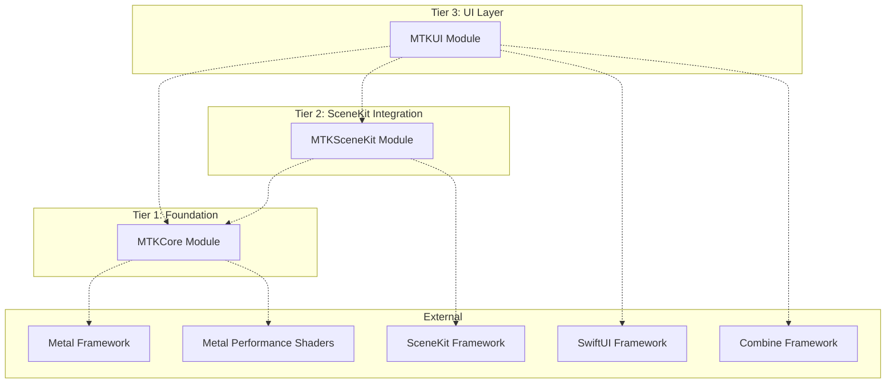
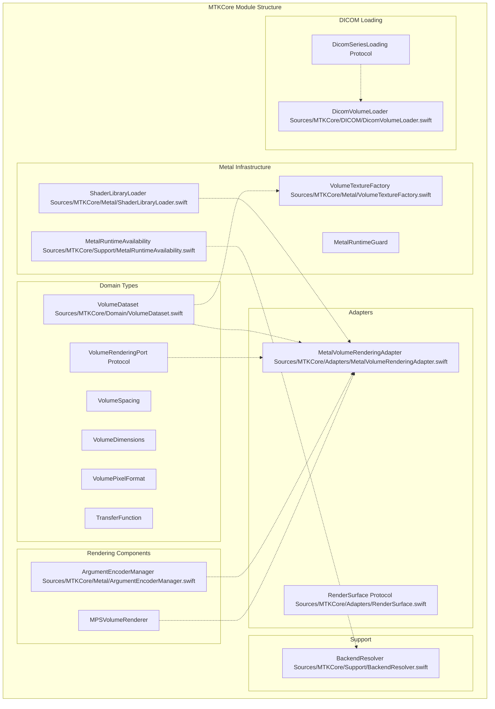
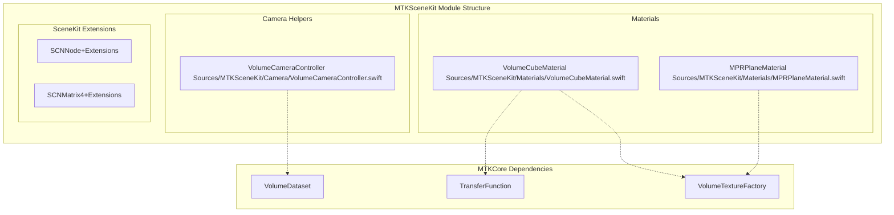

```mermaid
flowchart TD

VolumeGesturesModifier["volumeGestures Modifier"]
VolumetricSceneController["VolumetricSceneController Sources/MTKUI/Controllers/VolumetricSceneController.swift"]
VSCInteraction["+ Interaction Extension Sources/MTKUI/Controllers/VolumetricSceneController+Interaction.swift"]
VSCCamera["+ Camera Extension Sources/MTKUI/Controllers/VolumetricSceneController+Camera.swift"]
VSCMPS["+ MPS Extension Sources/MTKUI/Controllers/VolumetricSceneController+MPS.swift"]
VSCHelpers["+ Helpers Extension Sources/MTKUI/Controllers/VolumetricSceneController+Helpers.swift"]
VolumetricSceneCoordinator["VolumetricSceneCoordinator Sources/MTKUI/Coordinators/VolumetricSceneCoordinator.swift"]
VolumetricDisplayContainer["VolumetricDisplayContainer Sources/MTKUI/Views/VolumetricDisplayContainer.swift"]
RenderSurfaceView["RenderSurfaceView"]
CrosshairOverlayView["CrosshairOverlayView"]
OrientationOverlayView["OrientationOverlayView"]
WindowLevelControlView["WindowLevelControlView"]
MPRGridComposer["MPRGridComposer"]
MTKSceneKitDep["MTKSceneKit VolumeCubeMaterial MPRPlaneMaterial VolumeCameraController"]
MTKCoreDep["MTKCore VolumeDataset TransferFunction RenderSurface MetalVolumeRenderingAdapter"]

VolumetricSceneController -.-> MTKSceneKitDep
VolumetricSceneController -.-> MTKCoreDep

subgraph Dependencies ["Dependencies"]
    MTKSceneKitDep
    MTKCoreDep
end

subgraph subGraph5 ["MTKUI Module Structure"]
    VolumetricSceneCoordinator -.-> VolumetricSceneController
    VolumetricDisplayContainer -.-> VolumetricSceneController
    VolumetricDisplayContainer -.-> CrosshairOverlayView
    VolumetricDisplayContainer -.-> OrientationOverlayView

subgraph subGraph3 ["UI Overlays"]
    CrosshairOverlayView
    OrientationOverlayView
    WindowLevelControlView
    MPRGridComposer
end

subgraph subGraph2 ["SwiftUI Views"]
    VolumetricDisplayContainer
    RenderSurfaceView
    VolumetricDisplayContainer -.-> RenderSurfaceView
end

subgraph Coordinators ["Coordinators"]
    VolumetricSceneCoordinator
end

subgraph Controllers ["Controllers"]
    VolumetricSceneController
    VSCInteraction
    VSCCamera
    VSCMPS
    VSCHelpers
    VolumetricSceneController -.-> VSCInteraction
    VolumetricSceneController -.-> VSCCamera
    VolumetricSceneController -.-> VSCMPS
    VolumetricSceneController -.-> VSCHelpers
end

subgraph subGraph4 ["Gesture Modifiers"]
    VolumeGesturesModifier
end
end
```

# Module Structure

> **Relevant source files**
> * [BACKEND_RESOLVER_USAGE.md](https://github.com/ThalesMMS/MTK/blob/eda6f990/BACKEND_RESOLVER_USAGE.md)
> * [DOCUMENTATION_STANDARD.md](https://github.com/ThalesMMS/MTK/blob/eda6f990/DOCUMENTATION_STANDARD.md)
> * [README.md](https://github.com/ThalesMMS/MTK/blob/eda6f990/README.md)
> * [SURFACE_ADAPTER_DELIVERABLES.txt](https://github.com/ThalesMMS/MTK/blob/eda6f990/SURFACE_ADAPTER_DELIVERABLES.txt)

## Purpose and Scope

This document details MTK's three-tier module architecture: **MTKCore**, **MTKSceneKit**, and **MTKUI**. It explains the dependency flow between modules, the types and responsibilities within each layer, and how to integrate specific modules based on your application's requirements. For information about the rendering backends themselves, see [Rendering Architecture](2%20Rendering-Architecture.md). For SwiftUI integration patterns, see [SwiftUI Integration](6%20SwiftUI-Integration.md).

---

## Three-Tier Architecture Overview

MTK follows a strict layered architecture where each module has a single, well-defined responsibility and dependencies flow in one direction only: upward through the tiers. The foundation layer (MTKCore) has zero dependencies on higher-level frameworks like SceneKit or SwiftUI, enabling flexible integration strategies.

**Dependency Flow Diagram**



**Sources**: [README.md L5-L8](https://github.com/ThalesMMS/MTK/blob/eda6f990/README.md#L5-L8)

---

## MTKCore Module (Foundation Layer)

**MTKCore** is the framework-agnostic foundation that provides domain types, Metal rendering infrastructure, and data loading capabilities. It has no dependencies on SceneKit or SwiftUI, making it suitable for non-UI applications, command-line tools, or custom rendering pipelines.

### Key Components



**Sources**: [README.md L6](https://github.com/ThalesMMS/MTK/blob/eda6f990/README.md#L6-L6)

 [BACKEND_RESOLVER_USAGE.md L5-L7](https://github.com/ThalesMMS/MTK/blob/eda6f990/BACKEND_RESOLVER_USAGE.md#L5-L7)

 [SURFACE_ADAPTER_DELIVERABLES.txt L9](https://github.com/ThalesMMS/MTK/blob/eda6f990/SURFACE_ADAPTER_DELIVERABLES.txt#L9-L9)

### MTKCore Responsibilities

| Category | Types | Purpose |
| --- | --- | --- |
| **Domain Models** | `VolumeDataset`, `VolumeSpacing`, `VolumeDimensions`, `VolumePixelFormat`, `TransferFunction` | Framework-agnostic representation of volumetric data and rendering parameters |
| **Metal Helpers** | `VolumeTextureFactory`, `ShaderLibraryLoader`, `MetalRuntimeAvailability`, `MetalRuntimeGuard` | GPU resource creation, shader compilation, and runtime capability detection |
| **Adapters** | `MetalVolumeRenderingAdapter`, `RenderSurface` protocol | Decouple rendering implementation from UI frameworks via protocol abstraction |
| **Rendering** | `ArgumentEncoderManager`, `MPSVolumeRenderer`, `VolumeRenderingPort` | Low-level Metal compute shader execution and MPS-accelerated operations |
| **DICOM** | `DicomVolumeLoader`, `DicomSeriesLoading` protocol | Orchestrate DICOM ZIP extraction and dataset construction (requires external parser implementation) |
| **Runtime Checks** | `BackendResolver`, `CommandBufferProfiler`, `VolumeRenderingDebugOptions` | Metal availability validation and GPU diagnostics |

**Sources**: [README.md L6](https://github.com/ThalesMMS/MTK/blob/eda6f990/README.md#L6-L6)

 [BACKEND_RESOLVER_USAGE.md L1-L10](https://github.com/ThalesMMS/MTK/blob/eda6f990/BACKEND_RESOLVER_USAGE.md#L1-L10)

### MTKCore Integration Example

Applications that need volumetric rendering without SceneKit or SwiftUI can use MTKCore directly:

```sql
import MTKCore// Check Metal availabilitylet resolver = BackendResolver()try resolver.checkMetalAvailability()// Load volume datasetlet dataset = VolumeDataset(    data: voxelBuffer,    dimensions: VolumeDimensions(width: 512, height: 512, depth: 300),    spacing: VolumeSpacing(x: 0.001, y: 0.001, z: 0.002),    pixelFormat: .int16Signed,    intensityRange: (-1024)...3071)// Generate Metal texturelet device = MTLCreateSystemDefaultDevice()!let factory = VolumeTextureFactory(device: device)let volumeTexture = try factory.generate(from: dataset)// Create rendering adapterlet adapter = MetalVolumeRenderingAdapter(device: device)let result = try await adapter.render(request: renderRequest)
```

**Sources**: [README.md L17-L29](https://github.com/ThalesMMS/MTK/blob/eda6f990/README.md#L17-L29)

 [BACKEND_RESOLVER_USAGE.md L34-L51](https://github.com/ThalesMMS/MTK/blob/eda6f990/BACKEND_RESOLVER_USAGE.md#L34-L51)

---

## MTKSceneKit Module (SceneKit Integration)

**MTKSceneKit** bridges MTKCore's domain types to SceneKit's scene graph and rendering system. It provides custom Metal-based materials for volumetric rendering and camera management utilities specific to SceneKit nodes. This module depends only on MTKCore and has no awareness of SwiftUI.

### Key Components



**Sources**: [README.md L7](https://github.com/ThalesMMS/MTK/blob/eda6f990/README.md#L7-L7)

### MTKSceneKit Responsibilities

| Category | Types | Purpose |
| --- | --- | --- |
| **Materials** | `VolumeCubeMaterial`, `MPRPlaneMaterial` | Custom SceneKit materials that bind Metal shaders for volume rendering (DVR, MIP, projections) and oblique slice visualization |
| **Camera Management** | `VolumeCameraController` | Manage SceneKit camera nodes with volume-specific constraints, patient orientation alignment, and interactive transforms |
| **SceneKit Extensions** | `SCNNode+Extensions`, `SCNMatrix4+Extensions` | Convenience utilities for node manipulation and matrix conversions |

**Sources**: [README.md L7](https://github.com/ThalesMMS/MTK/blob/eda6f990/README.md#L7-L7)

### VolumeCubeMaterial Configuration

`VolumeCubeMaterial` is a SceneKit `SCNMaterial` subclass that manages:

* Binding 3D volume textures to custom Metal fragment shaders
* Transfer function texture binding for intensity-to-color mapping
* Ray marching parameters (sampling step, compositing method)
* HU windowing (min/max intensity thresholds)
* Rendering method selection (DVR, MIP, average, sum projections)

```
// Material initialization (conceptual example)let material = VolumeCubeMaterial(    volumeTexture: volumeTexture,    transferFunction: transferFunction)// Attach to SceneKit geometrylet boxGeometry = SCNBox(width: 1.0, height: 1.0, length: 1.0, chamferRadius: 0)boxGeometry.firstMaterial = materiallet volumeNode = SCNNode(geometry: boxGeometry)scene.rootNode.addChildNode(volumeNode)
```

**Sources**: [README.md L7](https://github.com/ThalesMMS/MTK/blob/eda6f990/README.md#L7-L7)

### MTKSceneKit Integration Example

Applications using SceneKit but not SwiftUI can use MTKCore + MTKSceneKit:

```sql
import MTKCoreimport MTKSceneKitimport SceneKit// Setup SceneKit viewlet sceneView = SCNView(frame: bounds)let scene = SCNScene()sceneView.scene = scene// Create volume material from MTKCore datasetlet volumeMaterial = VolumeCubeMaterial(    volumeTexture: volumeTexture,    transferFunction: transferFunction)// Create volume nodelet volumeNode = SCNNode(geometry: SCNBox(width: 1, height: 1, length: 1, chamferRadius: 0))volumeNode.geometry?.firstMaterial = volumeMaterialscene.rootNode.addChildNode(volumeNode)// Camera managementlet cameraController = VolumeCameraController(cameraNode: cameraNode, dataset: dataset)cameraController.resetCamera(orientation: .axial)
```

**Sources**: [README.md L7](https://github.com/ThalesMMS/MTK/blob/eda6f990/README.md#L7-L7)

---

## MTKUI Module (UI Layer)

**MTKUI** provides SwiftUI-ready components for volumetric visualization. It orchestrates both MTKCore and MTKSceneKit, managing the SceneKit backend, MPS backend, state synchronization, and reactive UI updates via Combine. This is the highest-level module and depends on both lower tiers.

### Key Components



**Sources**: [README.md L8](https://github.com/ThalesMMS/MTK/blob/eda6f990/README.md#L8-L8)

### MTKUI Responsibilities

| Category | Types | Purpose |
| --- | --- | --- |
| **Controllers** | `VolumetricSceneController` (+ 5 extensions) | Central orchestrator managing both SceneKit and MPS rendering backends, camera state, MPR planes, and adaptive sampling |
| **Coordinators** | `VolumetricSceneCoordinator` | SwiftUI `@StateObject` wrapper providing simplified API and state management for `VolumetricSceneController` |
| **Display Views** | `VolumetricDisplayContainer`, `RenderSurfaceView` | Generic SwiftUI view displaying any `RenderSurface` with composable overlay support |
| **UI Overlays** | `CrosshairOverlayView`, `OrientationOverlayView`, `WindowLevelControlView`, `MPRGridComposer` | Built-in SwiftUI components for common visualization needs |
| **Gesture Handling** | `volumeGestures` modifier | SwiftUI view modifier for camera rotation, panning, zooming, and adaptive sampling triggers |

**Sources**: [README.md L8](https://github.com/ThalesMMS/MTK/blob/eda6f990/README.md#L8-L8)

### VolumetricSceneController Architecture

`VolumetricSceneController` is split across **five extension files** for modularity:

| Extension File | Primary Responsibilities | Method Count |
| --- | --- | --- |
| `VolumetricSceneController.swift` | Core initialization, backend management, `@Published` state properties | Core setup |
| `+Interaction.swift` | **42 public methods** for dataset loading, transfer functions, rendering configuration, HU windowing, backend switching | 42 methods |
| `+Camera.swift` | Camera transforms, patient orientation alignment, clipping planes, MPR camera sync | ~15 methods |
| `+MPS.swift` | `MPSDisplayAdapter` nested class, histogram adjustments, MPS rendering coordination | Nested class |
| `+Helpers.swift` | SIMD conversions, matrix utilities, SceneKit node manipulation | Utility functions |

**Sources**: [README.md L8](https://github.com/ThalesMMS/MTK/blob/eda6f990/README.md#L8-L8)

### MTKUI Integration Example

Full SwiftUI application using all three modules:

```
import SwiftUIimport MTKCoreimport MTKSceneKitimport MTKUI@mainstruct VolumeViewerApp: App {    var body: some Scene {        WindowGroup {            ContentView()        }    }}struct ContentView: View {    @StateObject private var coordinator = VolumetricSceneCoordinator.shared        var body: some View {        VolumetricDisplayContainer(controller: coordinator.controller) {            // Composable overlays            CrosshairOverlayView()            OrientationOverlayView()            WindowLevelControlView(controller: coordinator.controller)        }        .volumeGestures(            controller: coordinator.controller,            state: GestureStateHolder()        )        .task {            await loadAndConfigureVolume()        }    }        func loadAndConfigureVolume() async {        let dataset = VolumeDataset(/* ... */)        coordinator.apply(dataset: dataset)        coordinator.applyHuWindow(min: -500, max: 1200)        await coordinator.controller.setPreset(.softTissue)    }}
```

**Sources**: README.md

---

## Dependency Rules and Module Isolation

MTK enforces strict dependency rules to maintain architectural integrity:

### Dependency Matrix

| Module | Can Import | Cannot Import | Rationale |
| --- | --- | --- | --- |
| **MTKCore** | Metal, Metal Performance Shaders | SceneKit, SwiftUI, AppKit, UIKit, MTKSceneKit, MTKUI | Foundation layer must remain framework-agnostic |
| **MTKSceneKit** | MTKCore, SceneKit | SwiftUI, AppKit, UIKit, MTKUI | SceneKit integration should not depend on UI layer |
| **MTKUI** | MTKCore, MTKSceneKit, SwiftUI, Combine | None | Top-level module coordinates all lower layers |

**Sources**: [README.md L5-L8](https://github.com/ThalesMMS/MTK/blob/eda6f990/README.md#L5-L8)

### RenderSurface Protocol Abstraction

The `RenderSurface` protocol in MTKCore enables framework decoupling:

```
// Defined in MTKCorepublic protocol RenderSurface: AnyObject {    var view: any View { get }    var contentScaleFactor: CGFloat { get set }    var bounds: CGRect { get }}// Implemented by MTKSceneKitclass SceneKitSurface: RenderSurface {    let sceneView: SCNView    var view: any View { sceneView }    // ...}// Implemented by MTKUIclass MPSSurface: RenderSurface {    let mtkView: MTKView    var view: any View { mtkView }    // ...}
```

This allows `VolumetricSceneController` (in MTKUI) to expose its active surface without MTKCore knowing about specific view types.

**Sources**: [SURFACE_ADAPTER_DELIVERABLES.txt L9-L16](https://github.com/ThalesMMS/MTK/blob/eda6f990/SURFACE_ADAPTER_DELIVERABLES.txt#L9-L16)

 [README.md L6](https://github.com/ThalesMMS/MTK/blob/eda6f990/README.md#L6-L6)

---

## Module Selection Guide

Choose the appropriate module combination based on your application's requirements:

### Use Case: Command-Line Volume Processing

**Modules**: MTKCore only

**Example**: Batch rendering of volume slices, DICOM conversion pipeline, headless GPU processing

```
// Package.swiftdependencies: [    .product(name: "MTKCore", package: "MTK")]
```

**Why**: No UI framework dependencies, direct Metal access, minimal binary size.

**Sources**: [README.md L17-L29](https://github.com/ThalesMMS/MTK/blob/eda6f990/README.md#L17-L29)

---

### Use Case: Custom SceneKit Application (Non-SwiftUI)

**Modules**: MTKCore + MTKSceneKit

**Example**: AppKit/UIKit app with SceneKit view, custom camera controls, non-reactive rendering

```
// Package.swiftdependencies: [    .product(name: "MTKCore", package: "MTK"),    .product(name: "MTKSceneKit", package: "MTK")]
```

**Why**: Access to SceneKit materials and camera utilities without SwiftUI overhead.

**Sources**: [README.md L17-L29](https://github.com/ThalesMMS/MTK/blob/eda6f990/README.md#L17-L29)

---

### Use Case: SwiftUI Medical Imaging Viewer

**Modules**: MTKCore + MTKSceneKit + MTKUI

**Example**: Full-featured volumetric viewer with gesture controls, HU windowing UI, MPR tri-planar layouts

```
// Package.swiftdependencies: [    .product(name: "MTKCore", package: "MTK"),    .product(name: "MTKSceneKit", package: "MTK"),    .product(name: "MTKUI", package: "MTK")]
```

**Why**: Complete stack with reactive state management, pre-built UI overlays, and gesture handling.

**Sources**: [README.md L17-L29](https://github.com/ThalesMMS/MTK/blob/eda6f990/README.md#L17-L29)

 README.md

---

### Use Case: MTKCore with Custom Rendering Backend

**Modules**: MTKCore only + custom renderer

**Example**: Integrate VolumeDataset with non-SceneKit rendering (e.g., raw Metal compute, WebGPU bridge)

**Implementation Strategy**:

1. Use `VolumeDataset` as data source
2. Implement `VolumeRenderingPort` protocol with custom renderer
3. Generate textures via `VolumeTextureFactory`
4. Implement custom `RenderSurface` for your view type

**Why**: MTKCore's protocol-based design (`RenderSurface`, `VolumeRenderingPort`) enables alternative rendering paths.

**Sources**: [README.md L6](https://github.com/ThalesMMS/MTK/blob/eda6f990/README.md#L6-L6)

 [SURFACE_ADAPTER_DELIVERABLES.txt L9-L16](https://github.com/ThalesMMS/MTK/blob/eda6f990/SURFACE_ADAPTER_DELIVERABLES.txt#L9-L16)

---

## Swift Package Manager Integration

### Single-Module Import

```
// In Package.swiftdependencies: [    .package(path: "../MTK")],targets: [    .target(        name: "MyApp",        dependencies: [            .product(name: "MTKCore", package: "MTK")        ]    )]
```

### Multi-Module Import

```
// In Package.swiftdependencies: [    .package(path: "../MTK")],targets: [    .target(        name: "MyApp",        dependencies: [            .product(name: "MTKCore", package: "MTK"),            .product(name: "MTKSceneKit", package: "MTK"),            .product(name: "MTKUI", package: "MTK")        ]    )]
```

**Sources**: [README.md L16-L29](https://github.com/ThalesMMS/MTK/blob/eda6f990/README.md#L16-L29)

---

## Module Build Requirements

All modules share these base requirements:

| Requirement | Version | Rationale |
| --- | --- | --- |
| Swift | 5.10+ | Actor isolation, async/await patterns |
| Xcode | 16+ | Build-time plugins for shader compilation |
| iOS | 17+ | Metal 3 features, SwiftUI lifecycle |
| macOS | 14+ | Metal 3 features, SwiftUI lifecycle |
| Metal Device | Required | GPU-accelerated rendering (tests skip without) |
| MPS Support | Optional | Histogram/Gaussian optimizations, graceful fallback |

### Shader Compilation

MTK includes a build-time plugin (`MTKShaderPlugin`) that compiles `.metal` shader sources during the build process. This applies to all three modules but is managed centrally:

```
# Manual fallback (if plugin unavailable)bash Tooling/Shaders/build_metallib.sh Sources/MTKCore/Resources/Shaders .build/MTK.metallib
```

At runtime, `ShaderLibraryLoader` searches:

1. Bundled `VolumeRendering.metallib`
2. Module's default Metal library
3. Runtime shader compilation from source

**Sources**: [README.md L31-L33](https://github.com/ThalesMMS/MTK/blob/eda6f990/README.md#L31-L33)

 [DOCUMENTATION_STANDARD.md L31-L32](https://github.com/ThalesMMS/MTK/blob/eda6f990/DOCUMENTATION_STANDARD.md#L31-L32)

---

## Testing Across Modules

Each module includes its own test target:

```markdown
Tests/
├── MTKCoreTests/          # Domain types, Metal helpers, DICOM loading
├── MTKSceneKitTests/      # Materials, camera controllers
└── MTKUITests/            # SwiftUI components, gesture handling
```

**Metal Availability Requirement**: GPU-dependent tests automatically skip when `MTLCreateSystemDefaultDevice()` returns `nil`. Use `BackendResolver` to check Metal availability before instantiating controllers in tests.

**DICOM Test Fixtures**: DICOM-related tests expect fixtures under `MTK-Demo/DICOM_Example` (not committed). Tests skip when fixtures are absent.

**Sources**: README.md

 [DOCUMENTATION_STANDARD.md L26-L28](https://github.com/ThalesMMS/MTK/blob/eda6f990/DOCUMENTATION_STANDARD.md#L26-L28)


### On this page

* [Module Structure](#1.1-module-structure)
* [Purpose and Scope](#1.1-purpose-and-scope)
* [Three-Tier Architecture Overview](#1.1-three-tier-architecture-overview)
* [MTKCore Module (Foundation Layer)](#1.1-mtkcore-module-foundation-layer)
* [Key Components](#1.1-key-components)
* [MTKCore Responsibilities](#1.1-mtkcore-responsibilities)
* [MTKCore Integration Example](#1.1-mtkcore-integration-example)
* [MTKSceneKit Module (SceneKit Integration)](#1.1-mtkscenekit-module-scenekit-integration)
* [Key Components](#1.1-key-components-1)
* [MTKSceneKit Responsibilities](#1.1-mtkscenekit-responsibilities)
* [VolumeCubeMaterial Configuration](#1.1-volumecubematerial-configuration)
* [MTKSceneKit Integration Example](#1.1-mtkscenekit-integration-example)
* [MTKUI Module (UI Layer)](#1.1-mtkui-module-ui-layer)
* [Key Components](#1.1-key-components-2)
* [MTKUI Responsibilities](#1.1-mtkui-responsibilities)
* [VolumetricSceneController Architecture](#1.1-volumetricscenecontroller-architecture)
* [MTKUI Integration Example](#1.1-mtkui-integration-example)
* [Dependency Rules and Module Isolation](#1.1-dependency-rules-and-module-isolation)
* [Dependency Matrix](#1.1-dependency-matrix)
* [RenderSurface Protocol Abstraction](#1.1-rendersurface-protocol-abstraction)
* [Module Selection Guide](#1.1-module-selection-guide)
* [Use Case: Command-Line Volume Processing](#1.1-use-case-command-line-volume-processing)
* [Use Case: Custom SceneKit Application (Non-SwiftUI)](#1.1-use-case-custom-scenekit-application-non-swiftui)
* [Use Case: SwiftUI Medical Imaging Viewer](#1.1-use-case-swiftui-medical-imaging-viewer)
* [Use Case: MTKCore with Custom Rendering Backend](#1.1-use-case-mtkcore-with-custom-rendering-backend)
* [Swift Package Manager Integration](#1.1-swift-package-manager-integration)
* [Single-Module Import](#1.1-single-module-import)
* [Multi-Module Import](#1.1-multi-module-import)
* [Module Build Requirements](#1.1-module-build-requirements)
* [Shader Compilation](#1.1-shader-compilation)
* [Testing Across Modules](#1.1-testing-across-modules)

Ask Devin about MTK