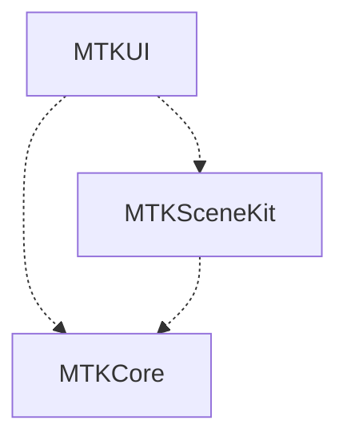
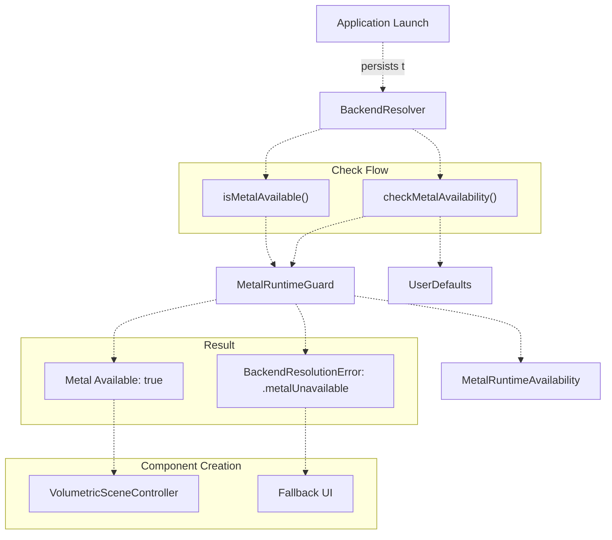
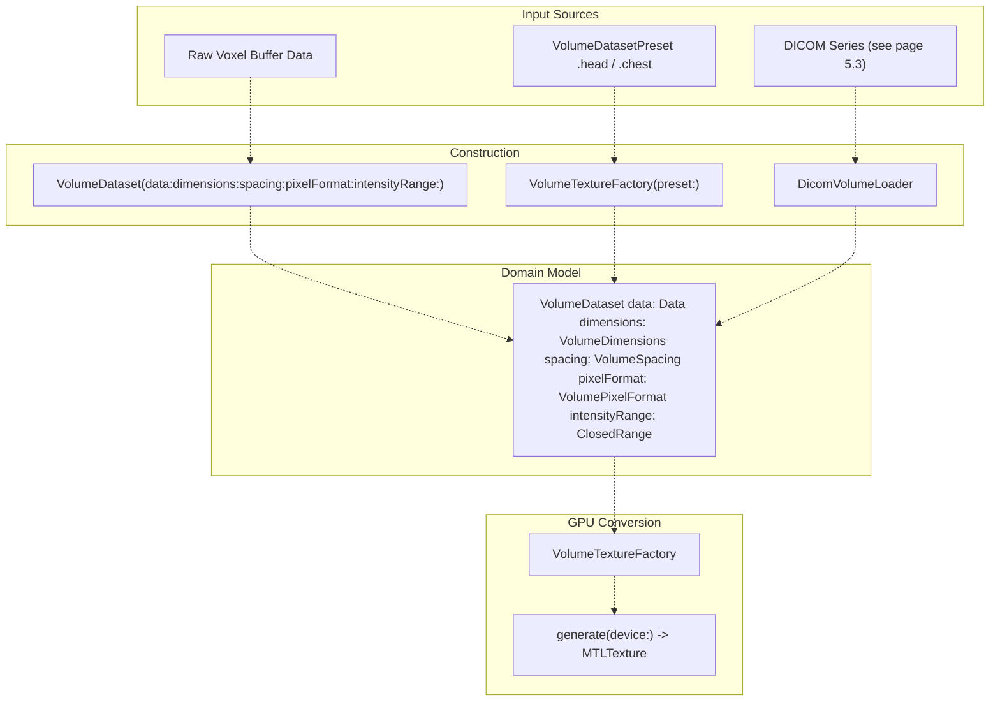
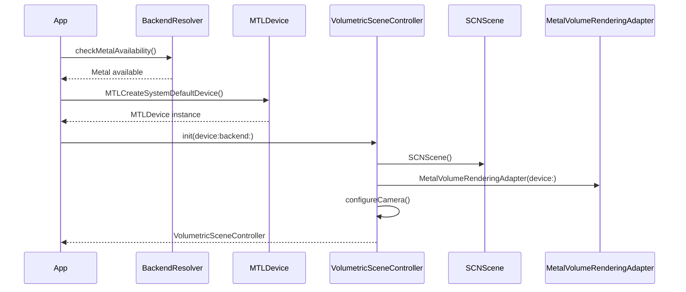
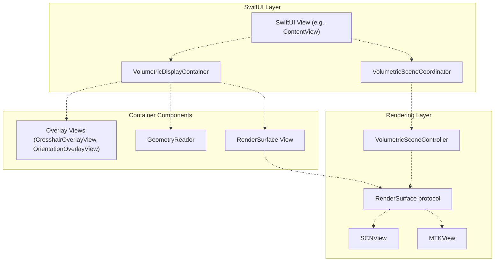
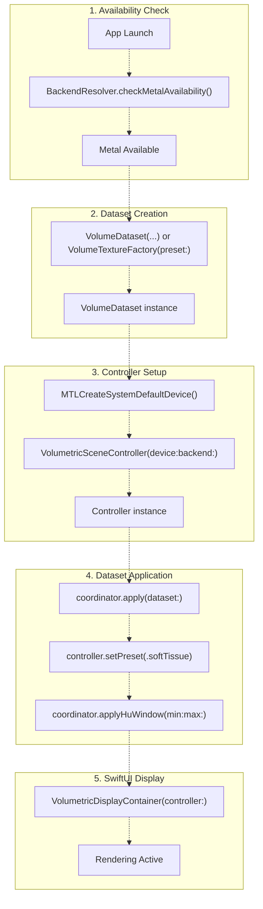

# Getting Started

> **Relevant source files**
> * [BACKEND_RESOLVER_USAGE.md](https://github.com/ThalesMMS/MTK/blob/eda6f990/BACKEND_RESOLVER_USAGE.md)
> * [DOCUMENTATION_STANDARD.md](https://github.com/ThalesMMS/MTK/blob/eda6f990/DOCUMENTATION_STANDARD.md)
> * [README.md](https://github.com/ThalesMMS/MTK/blob/eda6f990/README.md)
> * [SURFACE_ADAPTER_DELIVERABLES.txt](https://github.com/ThalesMMS/MTK/blob/eda6f990/SURFACE_ADAPTER_DELIVERABLES.txt)
> * [Sources/MTKUI/VolumetricDisplayContainer.swift](https://github.com/ThalesMMS/MTK/blob/eda6f990/Sources/MTKUI/VolumetricDisplayContainer.swift)

This page provides a step-by-step guide for integrating MTK into your application. It covers package installation, runtime environment checks, dataset creation, and the minimal setup required to display volumetric data. For advanced rendering configuration, see [Rendering Architecture](2%20Rendering-Architecture.md). For detailed controller API documentation, see [Interaction API](3a%20Interaction-API.md).

---

## Purpose and Scope

This guide walks through:

* Adding MTK as a Swift Package Manager dependency
* Checking Metal runtime availability before creating rendering components
* Creating `VolumeDataset` instances from raw voxel data or built-in presets
* Initializing `VolumetricSceneController` and displaying it in SwiftUI via `VolumetricDisplayContainer`

**What this page does not cover:**

* DICOM file loading (see [DICOM Loading](#5.3))
* Custom transfer functions and rendering parameters (see [Transfer Functions](#4.3))
* Multi-planar reconstruction setup (see [Multi-Planar Reconstruction](3c%20Multi-Planar-Reconstruction-%28MPR%29.md))
* Backend selection and performance tuning (see [Backend Resolution](9a%20Backend-Resolution-&-Metal-Detection.md))

---

## Package Installation

MTK is distributed as a Swift Package with three library products corresponding to the module architecture described in [Module Structure](1a%20Module-Structure.md).

### Adding MTK to Your Project

**Option 1: Xcode**

1. File → Add Package Dependencies
2. Enter the MTK repository URL or local path
3. Select the library products you need: `MTKCore`, `MTKSceneKit`, `MTKUI`

**Option 2: Package.swift**

```yaml
dependencies: [    .package(path: "../MTK") // or Git URL],targets: [    .target(        name: "YourApp",        dependencies: [            .product(name: "MTKCore", package: "MTK"),            .product(name: "MTKSceneKit", package: "MTK"),            .product(name: "MTKUI", package: "MTKUI")        ]    )]
```

### Module Selection Guidelines

| Module | When to Include |
| --- | --- |
| `MTKCore` | Always required. Provides `VolumeDataset`, `VolumeTextureFactory`, `BackendResolver`, transfer function library. |
| `MTKSceneKit` | Required if using SceneKit backend. Provides `VolumeCubeMaterial`, `MPRPlaneMaterial`, `VolumeCameraController`. |
| `MTKUI` | Required for SwiftUI integration. Provides `VolumetricSceneController`, `VolumetricDisplayContainer`, gesture modifiers, UI overlays. |

**Dependency Chain**



**Sources:** [README.md L5-L29](https://github.com/ThalesMMS/MTK/blob/eda6f990/README.md#L5-L29)

---

## Metal Availability Check

Before creating any rendering components, verify that Metal is available on the target device. The `BackendResolver` performs this check and optionally persists the result for subsequent launches.

### BackendResolver Architecture



### Implementation

**Throwing Check with Persistence**

```sql
import MTKCorelet resolver = BackendResolver(defaults: .standard)do {    try resolver.checkMetalAvailability()    // Metal is available - safe to create VolumetricSceneController} catch BackendResolutionError.metalUnavailable {    // Display error UI or disable volumetric features}
```

**Non-Throwing Check**

```
if BackendResolver.isMetalAvailable() {    // Proceed with Metal-backed rendering} else {    // Present alternative UI}
```

**Static Convenience Method**

```
do {    try BackendResolver.checkConfiguredMetalAvailability(defaults: .standard)} catch {    // Handle Metal unavailability}
```

### UserDefaults Keys

| Key | Type | Purpose |
| --- | --- | --- |
| `"volumetric.metalAvailable"` | `Bool` | Cached Metal availability result |
| `"volumetric.preferredBackend"` | `String` | Reserved for user backend preference (not currently used) |

**Sources:** [BACKEND_RESOLVER_USAGE.md L1-L56](https://github.com/ThalesMMS/MTK/blob/eda6f990/BACKEND_RESOLVER_USAGE.md#L1-L56)

 [Sources/MTKCore/Support/BackendResolver.swift](https://github.com/ThalesMMS/MTK/blob/eda6f990/Sources/MTKCore/Support/BackendResolver.swift)

---

## Creating Volume Datasets

`VolumeDataset` is the normalized data model that represents volumetric data before GPU processing. It captures voxel dimensions, spacing, pixel format, and intensity range.

### Dataset Creation Paths



### From Raw Voxel Data

Construct `VolumeDataset` directly when you have a voxel buffer:

```
import MTKCore// Allocate voxel buffer (Int16 in this example)let width = 256, height = 256, depth = 128let voxelCount = width * height * depthlet bytesPerVoxel = VolumePixelFormat.int16Signed.bytesPerVoxellet voxelData = Data(repeating: 0, count: voxelCount * bytesPerVoxel)let dataset = VolumeDataset(    data: voxelData,    dimensions: VolumeDimensions(width: width, height: height, depth: depth),    spacing: VolumeSpacing(x: 0.001, y: 0.001, z: 0.0015), // meters    pixelFormat: .int16Signed,    intensityRange: (-1024)...3071 // CT Hounsfield units)
```

**VolumeDataset Constructor Parameters:**

| Parameter | Type | Description |
| --- | --- | --- |
| `data` | `Data` | Contiguous voxel buffer in native endianness |
| `dimensions` | `VolumeDimensions` | Width, height, depth in voxels |
| `spacing` | `VolumeSpacing` | Physical spacing in meters per voxel axis |
| `pixelFormat` | `VolumePixelFormat` | `.int16Signed` or `.int16Unsigned` |
| `intensityRange` | `ClosedRange<Int32>` | Min/max intensity values for normalization |

### From Built-in Presets

`VolumeTextureFactory` provides two bundled datasets loaded from compressed RAW files:

```
import MTKCore// Load head dataset (512×512×511, spacing 0.449mm × 0.449mm × 0.501mm)let factory = VolumeTextureFactory(preset: .head)let dataset = factory.dataset// Load chest dataset (512×512×179, spacing 0.586mm × 0.586mm × 2.0mm)let chestFactory = VolumeTextureFactory(preset: .chest)
```

**Available Presets:**

| Preset | Dimensions | Spacing (mm) | Format | Intensity Range |
| --- | --- | --- | --- | --- |
| `.head` | 512×512×511 | 0.449×0.449×0.501 | `.int16Signed` | -1024 to 3071 HU |
| `.chest` | 512×512×179 | 0.586×0.586×2.0 | `.int16Signed` | -1024 to 3071 HU |

**Note:** Preset data is loaded from `Sources/MTKCore/Resources/*.raw.zip`. If these files are missing, `VolumeTextureFactory` falls back to a 1×1×1 placeholder dataset.

**Sources:** [Sources/MTKCore/Metal/VolumeTextureFactory.swift L15-L69](https://github.com/ThalesMMS/MTK/blob/eda6f990/Sources/MTKCore/Metal/VolumeTextureFactory.swift#L15-L69)

 [Sources/MTKCore/Metal/VolumeTextureFactory.swift L72-L167](https://github.com/ThalesMMS/MTK/blob/eda6f990/Sources/MTKCore/Metal/VolumeTextureFactory.swift#L72-L167)

---

## Initializing VolumetricSceneController

`VolumetricSceneController` is the central orchestrator that manages scene state, camera, rendering backends, and exposes the interaction API. It is initialized with a Metal device and rendering backend selection.

### Controller Initialization Sequence



### Basic Initialization

```
import MTKUIimport Metal// Option 1: Default device and SceneKit backendlet controller = VolumetricSceneController(    device: MTLCreateSystemDefaultDevice()!,    backend: .sceneKit)// Option 2: MPS backend (requires Metal Performance Shaders)let mpsController = VolumetricSceneController(    device: MTLCreateSystemDefaultDevice()!,    backend: .metalPerformanceShaders)
```

**Backend Selection:**

| Backend | Description | Requirements | Use Case |
| --- | --- | --- | --- |
| `.sceneKit` | SceneKit scene graph with custom Metal shaders | Metal-capable device | General-purpose volume/MPR rendering |
| `.metalPerformanceShaders` | Direct Metal rendering with GPU ray casting | Metal + MPS support | High-performance volume rendering |

For detailed backend comparison, see [Rendering Architecture](2%20Rendering-Architecture.md).

**Sources:** [Sources/MTKUI/VolumetricSceneController.swift](https://github.com/ThalesMMS/MTK/blob/eda6f990/Sources/MTKUI/VolumetricSceneController.swift)

---

## SwiftUI Integration

`VolumetricDisplayContainer` wraps `VolumetricSceneController` in a SwiftUI view hierarchy, supporting optional overlay composition through `@ViewBuilder`.

### Display Container Architecture



### Minimal SwiftUI Example

```sql
import SwiftUIimport MTKCoreimport MTKUIstruct VolumeViewer: View {    @StateObject private var coordinator = VolumetricSceneCoordinator.shared        var body: some View {        VolumetricDisplayContainer(controller: coordinator.controller) {            // Optional overlay views            CrosshairOverlayView()            OrientationOverlayView()        }        .task {            // Load dataset on appear            await loadVolume()        }    }        private func loadVolume() async {        // Create dataset        let factory = VolumeTextureFactory(preset: .head)        let dataset = factory.dataset                // Apply to controller        coordinator.apply(dataset: dataset)                // Configure rendering        await coordinator.controller.setPreset(.softTissue)        coordinator.applyHuWindow(min: -500, max: 1200)    }}
```

### VolumetricDisplayContainer Generic Parameter

`VolumetricDisplayContainer` is generic over the `Overlays` view type:

```
public struct VolumetricDisplayContainer<Overlays: View>: View {    public init(        controller: VolumetricSceneController,        @ViewBuilder overlays: () -> Overlays = { EmptyView() }    )}
```

**No Overlays:**

```
VolumetricDisplayContainer(controller: controller)
```

**With Overlays:**

```
VolumetricDisplayContainer(controller: controller) {    CrosshairOverlayView()    WindowLevelControlView()}
```

**Sources:** README.md

 [Sources/MTKUI/VolumetricDisplayContainer.swift](https://github.com/ThalesMMS/MTK/blob/eda6f990/Sources/MTKUI/VolumetricDisplayContainer.swift)

---

## Complete Initialization Example

This example demonstrates the full initialization flow from Metal availability check through SwiftUI rendering:



### Full Code Example

```python
import SwiftUIimport Metalimport MTKCoreimport MTKUI@mainstruct VolumeApp: App {    var body: some View {        ContentView()            .task {                // Check Metal availability at launch                guard BackendResolver.isMetalAvailable() else {                    print("Metal unavailable - volume rendering disabled")                    return                }            }    }}struct ContentView: View {    @StateObject private var coordinator = VolumetricSceneCoordinator()    @State private var isLoading = true        var body: some View {        Group {            if isLoading {                ProgressView("Initializing...")            } else {                VolumetricDisplayContainer(controller: coordinator.controller) {                    CrosshairOverlayView()                    OrientationOverlayView()                }                .volumeGestures(                    controller: coordinator.controller,                    state: $coordinator.gestureState                )            }        }        .task {            await initializeVolume()        }    }        private func initializeVolume() async {        // 1. Create dataset from raw data        let width = 256, height = 256, depth = 128        let voxelCount = width * height * depth        let voxelData = Data(            repeating: 0,            count: voxelCount * VolumePixelFormat.int16Signed.bytesPerVoxel        )                let dataset = VolumeDataset(            data: voxelData,            dimensions: VolumeDimensions(width: width, height: height, depth: depth),            spacing: VolumeSpacing(x: 0.001, y: 0.001, z: 0.0015),            pixelFormat: .int16Signed,            intensityRange: (-1024)...3071        )                // 2. Apply dataset to controller        coordinator.apply(dataset: dataset)                // 3. Configure rendering parameters        await coordinator.controller.setPreset(.softTissue)        coordinator.applyHuWindow(min: -500, max: 1200)        await coordinator.controller.setDisplayConfiguration(.volume)                isLoading = false    }}
```

**Sources:** README.md

---

## Next Steps

After completing this basic setup, explore:

* **[Rendering Architecture](2%20Rendering-Architecture.md)** — Understand SceneKit vs MPS backend differences
* **[Interaction API](3a%20Interaction-API.md)** — Learn all controller methods for camera control, display configuration, and rendering parameters
* **[Multi-Planar Reconstruction](3c%20Multi-Planar-Reconstruction-%28MPR%29.md)** — Set up synchronized axial/coronal/sagittal slice views
* **[Transfer Functions](#4.3)** — Customize color and opacity mapping
* **[DICOM Loading](#5.3)** — Load volumetric data from DICOM series

---

## Troubleshooting

### Metal Unavailable Error

**Symptom:** `BackendResolutionError.metalUnavailable` thrown during initialization

**Cause:** Device does not support Metal or Metal framework is not available

**Solution:**

* Verify target device meets minimum requirements (iOS 17+, macOS 14+)
* Check device capability with `MTLCreateSystemDefaultDevice() != nil`
* Present fallback UI when Metal is unavailable

### Preset Data Not Found

**Symptom:** Preset datasets render as 1×1×1 placeholder

**Cause:** Missing `head.raw.zip` or `chest.raw.zip` in `Sources/MTKCore/Resources`

**Solution:**

* Verify resource files are included in package
* Use custom `VolumeDataset` construction instead of presets

### Empty Rendering Surface

**Symptom:** `VolumetricDisplayContainer` displays blank view

**Cause:** Dataset not applied or controller not initialized

**Solution:**

* Ensure `coordinator.apply(dataset:)` called before display
* Verify controller initialization with valid `MTLDevice`
* Check console logs for shader compilation errors

**Sources:** README.md

 [BACKEND_RESOLVER_USAGE.md L34-L56](https://github.com/ThalesMMS/MTK/blob/eda6f990/BACKEND_RESOLVER_USAGE.md#L34-L56)


### On this page

- [Getting Started](#getting-started)
  - [Purpose and Scope](#purpose-and-scope)
  - [Package Installation](#package-installation)
    - [Adding MTK to Your Project](#adding-mtk-to-your-project)
    - [Module Selection Guidelines](#module-selection-guidelines)
  - [Metal Availability Check](#metal-availability-check)
    - [BackendResolver Architecture](#backendresolver-architecture)
    - [Implementation](#implementation)
    - [UserDefaults Keys](#userdefaults-keys)
  - [Creating Volume Datasets](#creating-volume-datasets)
    - [Dataset Creation Paths](#dataset-creation-paths)
    - [From Raw Voxel Data](#from-raw-voxel-data)
    - [From Built-in Presets](#from-built-in-presets)
  - [Initializing VolumetricSceneController](#initializing-volumetricscenecontroller)
    - [Controller Initialization Sequence](#controller-initialization-sequence)
    - [Basic Initialization](#basic-initialization)
  - [SwiftUI Integration](#swiftui-integration)
    - [Display Container Architecture](#display-container-architecture)
    - [Minimal SwiftUI Example](#minimal-swiftui-example)
    - [VolumetricDisplayContainer Generic Parameter](#volumetricdisplaycontainer-generic-parameter)
  - [Complete Initialization Example](#complete-initialization-example)
    - [Full Code Example](#full-code-example)
  - [Next Steps](#next-steps)
  - [Troubleshooting](#troubleshooting)
    - [Metal Unavailable Error](#metal-unavailable-error)
    - [Preset Data Not Found](#preset-data-not-found)
    - [Empty Rendering Surface](#empty-rendering-surface)
    - [On this page](#on-this-page)

Ask Devin about MTK