# Rendering Architecture

> **Relevant source files**
> * [Sources/MTKUI/VolumetricSceneController+Interaction.swift](https://github.com/ThalesMMS/MTK/blob/eda6f990/Sources/MTKUI/VolumetricSceneController+Interaction.swift)
> * [Sources/MTKUI/VolumetricSceneController.swift](https://github.com/ThalesMMS/MTK/blob/eda6f990/Sources/MTKUI/VolumetricSceneController.swift)

## Purpose and Scope

This document explains the **dual rendering backend system** in MTK, which supports two distinct rendering paths: a SceneKit-based backend and a Metal Performance Shaders (MPS) backend. The architecture allows runtime selection between backends, sharing core resources while providing different rendering strategies optimized for different use cases and hardware capabilities.

For detailed information about individual backends, see [SceneKit Backend](2a%20SceneKit-Backend.md) and [Metal Performance Shaders Backend](2b%20Metal-Performance-Shaders-Backend.md). For the abstraction layer that decouples rendering from platform views, see [RenderSurface Abstraction](2c%20RenderSurface-Abstraction.md).

---

## Backend Architecture Overview

MTK implements a **switchable dual-backend architecture** coordinated by `VolumetricSceneController`. The controller maintains two independent rendering surfaces but only activates one at a time based on the `VolumetricRenderingBackend` enum state.

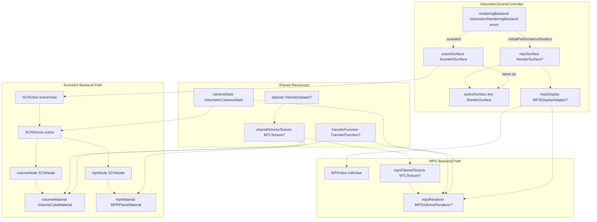

**Sources:** [Sources/MTKUI/VolumetricSceneController.swift L253-L327](https://github.com/ThalesMMS/MTK/blob/eda6f990/Sources/MTKUI/VolumetricSceneController.swift#L253-L327)

 [Sources/MTKUI/VolumetricSceneController L27-L62](https://github.com/ThalesMMS/MTK/blob/eda6f990/Sources/MTKUI/VolumetricSceneController+MPS.swift#L27-L62)

### Backend Enumeration

The system defines two backend options via the `VolumetricRenderingBackend` enum:

| Backend | Enum Value | Display Name | Description |
| --- | --- | --- | --- |
| SceneKit | `.sceneKit` | "SceneKit" | Uses Apple's scene graph with custom Metal shaders |
| MPS | `.metalPerformanceShaders` | "Metal Performance Shaders" | Direct Metal rendering with GPU ray casting |

**Sources:** [Sources/MTKUI/VolumetricSceneController.swift L51-L63](https://github.com/ThalesMMS/MTK/blob/eda6f990/Sources/MTKUI/VolumetricSceneController.swift#L51-L63)

---

## Backend Selection and Switching

### Initialization and Runtime Checks

During controller initialization, the system performs runtime checks to determine MPS availability:

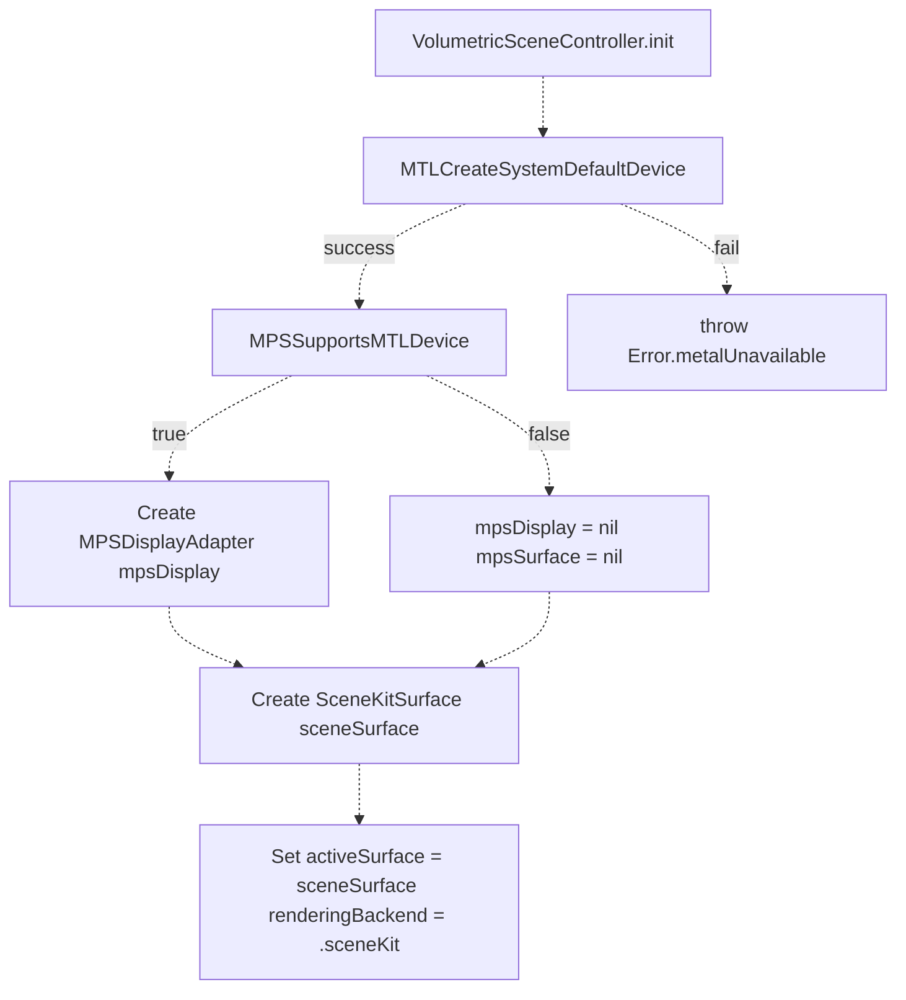

**Sources:** [Sources/MTKUI/VolumetricSceneController.swift L332-L406](https://github.com/ThalesMMS/MTK/blob/eda6f990/Sources/MTKUI/VolumetricSceneController.swift#L332-L406)

The controller always creates the SceneKit backend but only creates the MPS backend if `MPSSupportsMTLDevice` returns true for the Metal device. This ensures graceful degradation on hardware that doesn't support Metal Performance Shaders.

### Backend Switching API

The `setRenderingBackend` method handles runtime backend switching:

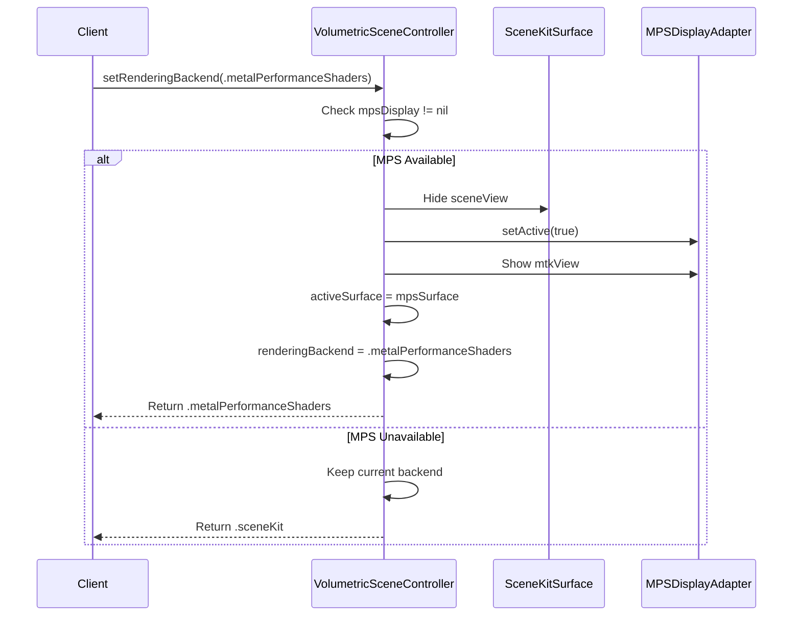

**Sources:** [Sources/MTKUI/VolumetricSceneController+Interaction.swift](https://github.com/ThalesMMS/MTK/blob/eda6f990/Sources/MTKUI/VolumetricSceneController+Interaction.swift)

 (referenced but not provided)

The switching operation is atomic and maintains state consistency by:

1. Hiding the currently active view
2. Activating the new backend's display adapter
3. Showing the new backend's view
4. Updating the `activeSurface` reference
5. Recording the new `renderingBackend` state

---

## SceneKit Backend Path

The SceneKit backend leverages Apple's scene graph infrastructure with custom Metal fragment shaders for volumetric rendering.

### Architecture Components

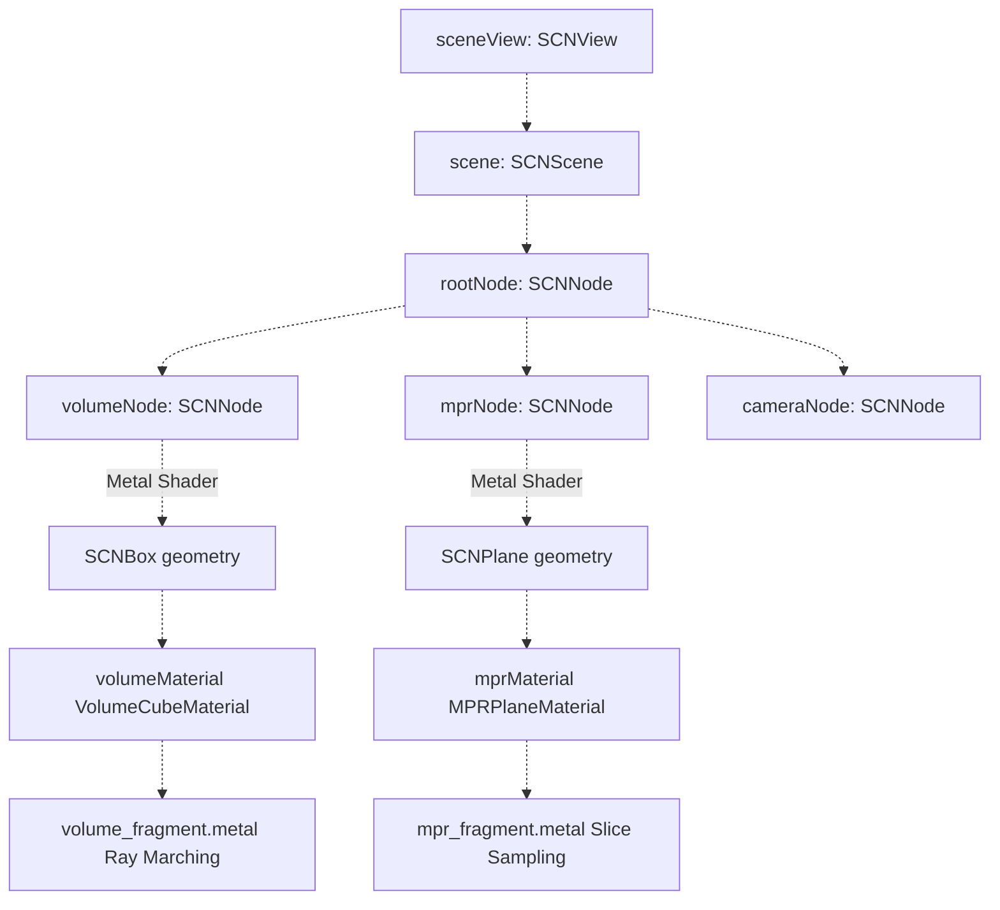

**Sources:** [Sources/MTKUI/VolumetricSceneController.swift L259-L404](https://github.com/ThalesMMS/MTK/blob/eda6f990/Sources/MTKUI/VolumetricSceneController.swift#L259-L404)

### Node Visibility Management

The controller manages node visibility based on the active `DisplayConfiguration`:

| Display Mode | volumeNode | mprNode |
| --- | --- | --- |
| `.volume(method)` | Visible | Hidden |
| `.mpr(axis, index, blend, slab)` | Hidden | Visible |

**Sources:** [Sources/MTKUI/VolumetricSceneController.swift L230-L233](https://github.com/ThalesMMS/MTK/blob/eda6f990/Sources/MTKUI/VolumetricSceneController.swift#L230-L233)

 [Sources/MTKUI/VolumetricSceneController.swift L390-L403](https://github.com/ThalesMMS/MTK/blob/eda6f990/Sources/MTKUI/VolumetricSceneController.swift#L390-L403)

For detailed material implementation and shader architecture, see [Materials and Shaders](4%20Materials-and-Shaders.md).

---

## MPS Backend Path

The Metal Performance Shaders backend bypasses SceneKit entirely, using `MTKView` for direct Metal rendering with GPU-accelerated ray casting.

### MPSDisplayAdapter Architecture

The `MPSDisplayAdapter` class serves as both a `RenderSurface` implementation and an `MTKViewDelegate`:

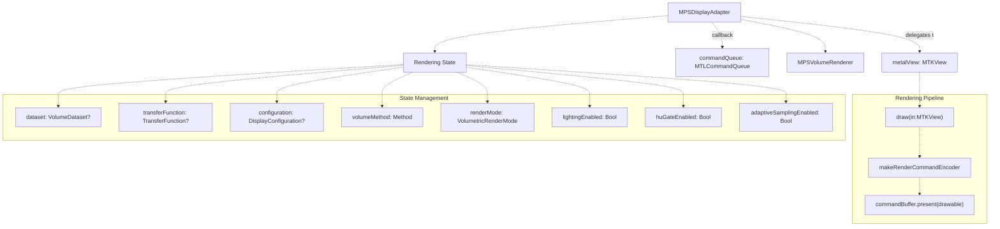

**Sources:** [Sources/MTKUI/VolumetricSceneController L27-L202](https://github.com/ThalesMMS/MTK/blob/eda6f990/Sources/MTKUI/VolumetricSceneController+MPS.swift#L27-L202)

### Clear Color Feedback System

The MPS backend implements a sophisticated **clear color calculation** that provides visual feedback about rendering state through HSB color space manipulation:

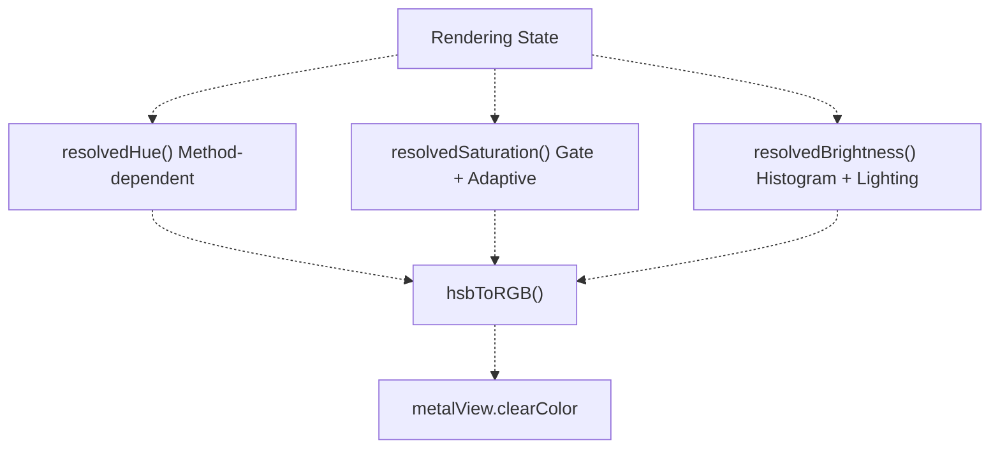

**Brightness Calculation Components:**

| Component | Source | Contribution |
| --- | --- | --- |
| Histogram mean | `histogramMean()` | 0.45 * normalized mean |
| Transfer function shift | `transferFunction?.shift` | 0.25 * normalized shift |
| Lighting | `lightingEnabled` | +0.12 / -0.08 |
| Adaptive interaction | `adaptiveInteractionActive` | +0.2 when active |
| Sampling step impact | `adaptiveSamplingStep` | Up to +0.25 |
| Ray casting contribution | `averageRayEntry()` | Up to +0.15 |

**Sources:** [Sources/MTKUI/VolumetricSceneController L222-L328](https://github.com/ThalesMMS/MTK/blob/eda6f990/Sources/MTKUI/VolumetricSceneController+MPS.swift#L222-L328)

The clear color serves as a **visual debugging tool**, encoding rendering state information into the background color visible when the volume is transparent or during interaction.

---

## Shared Resource Management

Both backends share core resources to ensure rendering consistency and avoid duplication:

### Shared Volume Texture

The `sharedVolumeTexture` is the primary 3D Metal texture containing volumetric data:

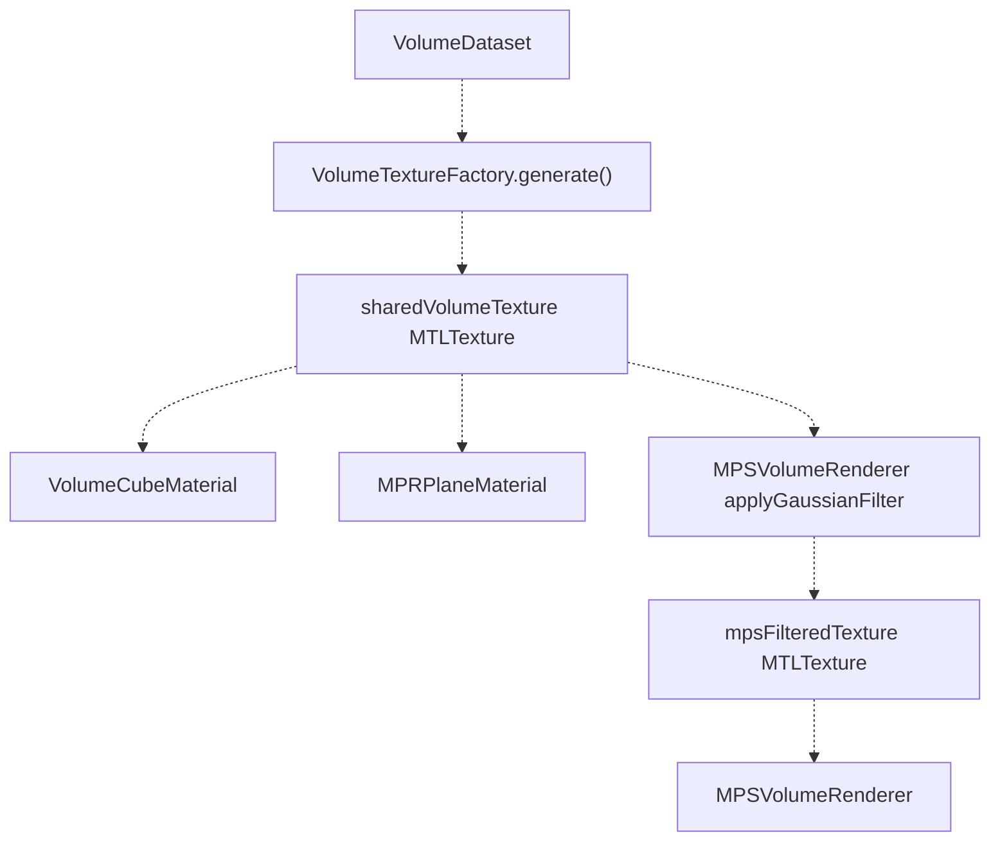

**Sources:** [Sources/MTKUI/VolumetricSceneController.swift L315](https://github.com/ThalesMMS/MTK/blob/eda6f990/Sources/MTKUI/VolumetricSceneController.swift#L315-L315)

 [Sources/MTKUI/VolumetricSceneController.swift L322](https://github.com/ThalesMMS/MTK/blob/eda6f990/Sources/MTKUI/VolumetricSceneController.swift#L322-L322)

### Transfer Function Synchronization

Transfer functions are synchronized across both backends:

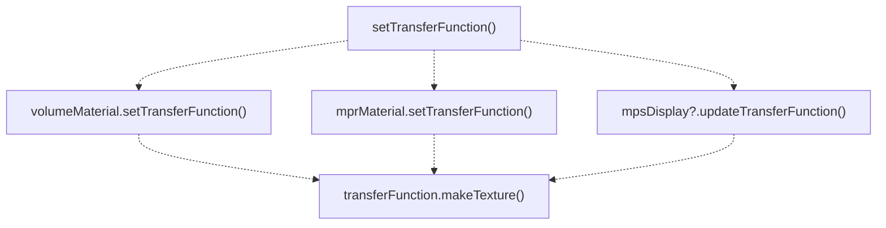

**Sources:** [Sources/MTKUI/VolumetricSceneController.swift L288](https://github.com/ThalesMMS/MTK/blob/eda6f990/Sources/MTKUI/VolumetricSceneController.swift#L288-L288)

 [Sources/MTKUI/VolumetricSceneController L95-L98](https://github.com/ThalesMMS/MTK/blob/eda6f990/Sources/MTKUI/VolumetricSceneController+MPS.swift#L95-L98)

### Camera State Management

The controller maintains a single camera state published to both backends:

| Property | Type | Published |
| --- | --- | --- |
| `cameraState` | `VolumetricCameraState` | Yes (`@Published`) |
| `cameraTarget` | `SIMD3<Float>` | Internal |
| `cameraOffset` | `SIMD3<Float>` | Internal |
| `cameraUpVector` | `SIMD3<Float>` | Internal |

**Sources:** [Sources/MTKUI/VolumetricSceneController.swift L16-L28](https://github.com/ThalesMMS/MTK/blob/eda6f990/Sources/MTKUI/VolumetricSceneController.swift#L16-L28)

 [Sources/MTKUI/VolumetricSceneController.swift L277](https://github.com/ThalesMMS/MTK/blob/eda6f990/Sources/MTKUI/VolumetricSceneController.swift#L277-L277)

 [Sources/MTKUI/VolumetricSceneController.swift L299-L301](https://github.com/ThalesMMS/MTK/blob/eda6f990/Sources/MTKUI/VolumetricSceneController.swift#L299-L301)

The SceneKit backend reads camera state from `SCNNode` transforms, while the MPS backend receives camera parameters directly for ray generation.

---

## Backend Coordination

### Display Configuration Propagation

Display configuration changes must be propagated to both backends to maintain consistency:

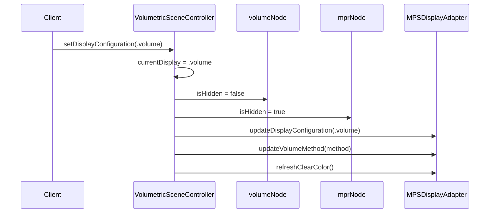

**Sources:** [Sources/MTKUI/VolumetricSceneController.swift L287](https://github.com/ThalesMMS/MTK/blob/eda6f990/Sources/MTKUI/VolumetricSceneController.swift#L287-L287)

 [Sources/MTKUI/VolumetricSceneController L100-L109](https://github.com/ThalesMMS/MTK/blob/eda6f990/Sources/MTKUI/VolumetricSceneController+MPS.swift#L100-L109)

### Render Mode Control

Render mode affects both backends differently:

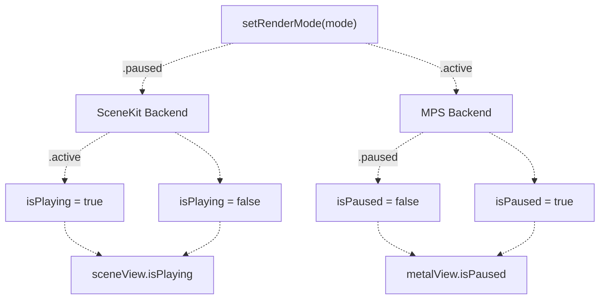

**Sources:** [Sources/MTKUI/VolumetricSceneController.swift L65-L68](https://github.com/ThalesMMS/MTK/blob/eda6f990/Sources/MTKUI/VolumetricSceneController.swift#L65-L68)

 [Sources/MTKUI/VolumetricSceneController L171-L174](https://github.com/ThalesMMS/MTK/blob/eda6f990/Sources/MTKUI/VolumetricSceneController+MPS.swift#L171-L174)

---

## Surface Abstraction Layer

The `RenderSurface` protocol provides a platform-agnostic interface for rendering:

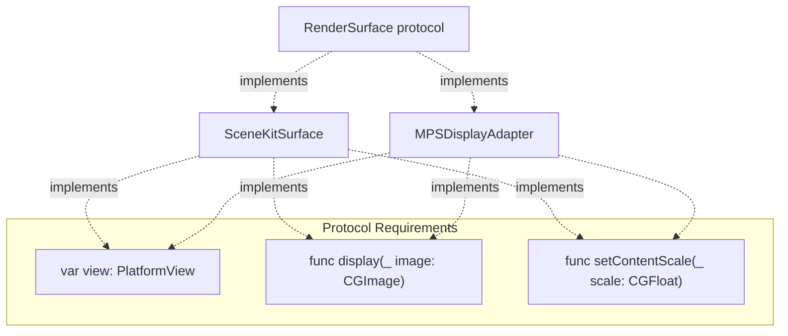

**Sources:** [Sources/MTKUI/VolumetricSceneController.swift L149](https://github.com/ThalesMMS/MTK/blob/eda6f990/Sources/MTKUI/VolumetricSceneController.swift#L149-L149)

 [Sources/MTKUI/VolumetricSceneController L27](https://github.com/ThalesMMS/MTK/blob/eda6f990/Sources/MTKUI/VolumetricSceneController+MPS.swift#L27-L27)

This abstraction allows `VolumetricDisplayContainer` to remain agnostic to the active backend. For complete documentation of the surface abstraction, see [RenderSurface Abstraction](2c%20RenderSurface-Abstraction.md).

---

## Backend-Specific Features

### SceneKit Exclusive Features

* **Scene graph hierarchy**: Automatic transform propagation, frustum culling
* **Built-in camera controls**: SCNView camera controller for fallback interaction
* **Geometry-based rendering**: Volume and MPR represented as SCNNode objects
* **Material system**: Custom Metal shaders integrated via SCNMaterial

**Sources:** [Sources/MTKUI/VolumetricSceneController.swift L259-L404](https://github.com/ThalesMMS/MTK/blob/eda6f990/Sources/MTKUI/VolumetricSceneController.swift#L259-L404)

### MPS Exclusive Features

* **GPU ray casting**: Direct ray marching on GPU via MPS kernels
* **Gaussian filtering**: Pre-filtered texture via `applyGaussianFilter`
* **Histogram computation**: Real-time intensity statistics via `MPSImageHistogram`
* **Ray casting cache**: Optimized ray generation with bounding box intersection
* **Visual state feedback**: Clear color encoding of rendering state

**Sources:** [Sources/MTKUI/VolumetricSceneController.swift L319-L326](https://github.com/ThalesMMS/MTK/blob/eda6f990/Sources/MTKUI/VolumetricSceneController.swift#L319-L326)

 [Sources/MTKUI/VolumetricSceneController L27-L331](https://github.com/ThalesMMS/MTK/blob/eda6f990/Sources/MTKUI/VolumetricSceneController+MPS.swift#L27-L331)

---

## Implementation Notes

### Backend Availability Checks

Always check backend availability before attempting to switch:

```javascript
guard let mpsDisplay = mpsDisplay else {
    // MPS backend unavailable, return current backend
    return renderingBackend
}
```

**Sources:** [Sources/MTKUI/VolumetricSceneController.swift L317](https://github.com/ThalesMMS/MTK/blob/eda6f990/Sources/MTKUI/VolumetricSceneController.swift#L317-L317)

### Thread Safety

All backend operations execute on the main actor:

```python
@MainActor
public final class VolumetricSceneController
```

**Sources:** [Sources/MTKUI/VolumetricSceneController.swift L193](https://github.com/ThalesMMS/MTK/blob/eda6f990/Sources/MTKUI/VolumetricSceneController.swift#L193-L193)

### Resource Lifetime

Both surfaces and their underlying views are created during controller initialization and persist for the controller's lifetime. Backend switching does not recreate views, only toggles visibility and activation state.

**Sources:** [Sources/MTKUI/VolumetricSceneController.swift L332-L406](https://github.com/ThalesMMS/MTK/blob/eda6f990/Sources/MTKUI/VolumetricSceneController.swift#L332-L406)


### On this page

* [Rendering Architecture](2%20Rendering-Architecture.md)
* [Purpose and Scope](2%20Rendering-Architecture.md)
* [Backend Architecture Overview](2%20Rendering-Architecture.md)
* [Backend Enumeration](2%20Rendering-Architecture.md)
* [Backend Selection and Switching](2%20Rendering-Architecture.md)
* [Initialization and Runtime Checks](2%20Rendering-Architecture.md)
* [Backend Switching API](2%20Rendering-Architecture.md)
* [SceneKit Backend Path](2%20Rendering-Architecture.md)
* [Architecture Components](2%20Rendering-Architecture.md)
* [Node Visibility Management](2%20Rendering-Architecture.md)
* [MPS Backend Path](2%20Rendering-Architecture.md)
* [MPSDisplayAdapter Architecture](2%20Rendering-Architecture.md)
* [Clear Color Feedback System](2%20Rendering-Architecture.md)
* [Shared Resource Management](2%20Rendering-Architecture.md)
* [Shared Volume Texture](2%20Rendering-Architecture.md)
* [Transfer Function Synchronization](2%20Rendering-Architecture.md)
* [Camera State Management](2%20Rendering-Architecture.md)
* [Backend Coordination](2%20Rendering-Architecture.md)
* [Display Configuration Propagation](2%20Rendering-Architecture.md)
* [Render Mode Control](2%20Rendering-Architecture.md)
* [Surface Abstraction Layer](2%20Rendering-Architecture.md)
* [Backend-Specific Features](2%20Rendering-Architecture.md)
* [SceneKit Exclusive Features](2%20Rendering-Architecture.md)
* [MPS Exclusive Features](2%20Rendering-Architecture.md)
* [Implementation Notes](2%20Rendering-Architecture.md)
* [Backend Availability Checks](2%20Rendering-Architecture.md)
* [Thread Safety](2%20Rendering-Architecture.md)
* [Resource Lifetime](2%20Rendering-Architecture.md)

Ask Devin about MTK