# SceneKit Backend

> **Relevant source files**
> * [Sources/MTKSceneKit/Materials/VolumeCubeMaterial.swift](https://github.com/ThalesMMS/MTK/blob/eda6f990/Sources/MTKSceneKit/Materials/VolumeCubeMaterial.swift)
> * [Sources/MTKUI/VolumetricSceneController.swift](https://github.com/ThalesMMS/MTK/blob/eda6f990/Sources/MTKUI/VolumetricSceneController.swift)

## Purpose and Scope

The SceneKit Backend provides the primary rendering path for volumetric visualization in MTK. It combines SceneKit's scene graph management with custom Metal shaders to perform GPU-accelerated volume rendering. This backend serves as the universal fallback—it's always available on Metal-capable devices and provides reliable rendering without device capability checks.

This page documents the SceneKit rendering architecture, including `SCNView` configuration, scene graph organization, the `VolumeCubeMaterial` system, custom Metal shaders, and the uniforms buffer structure. For the alternative MPS-accelerated rendering path, see [Metal Performance Shaders Backend](2b%20Metal-Performance-Shaders-Backend.md). For the abstraction layer that unifies both backends, see [RenderSurface Abstraction](2c%20RenderSurface-Abstraction.md).

## Architecture Overview

The SceneKit backend integrates Apple's high-level 3D framework with custom Metal compute shaders to achieve interactive volume rendering. Unlike traditional SceneKit materials that rely on built-in lighting models, `VolumeCubeMaterial` bypasses standard rendering by implementing custom vertex and fragment functions that perform ray marching directly on the GPU.

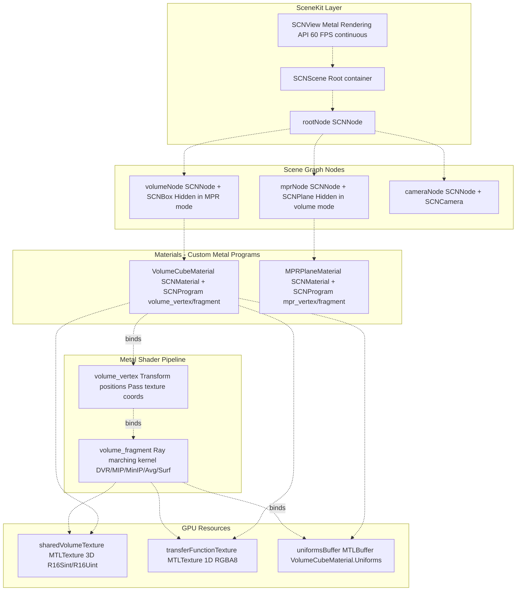

**Sources:**

* [Sources/MTKUI/VolumetricSceneController.swift L259-L427](https://github.com/ThalesMMS/MTK/blob/eda6f990/Sources/MTKUI/VolumetricSceneController.swift#L259-L427)
* [Sources/MTKSceneKit/Materials/VolumeCubeMaterial.swift L143-L175](https://github.com/ThalesMMS/MTK/blob/eda6f990/Sources/MTKSceneKit/Materials/VolumeCubeMaterial.swift#L143-L175)

## Initialization and SCNView Configuration

The SceneKit backend is initialized in `VolumetricSceneController.init()` and configured for Metal rendering with continuous frame updates. The view is set to render at 60 FPS with jittering enabled for temporal anti-aliasing.

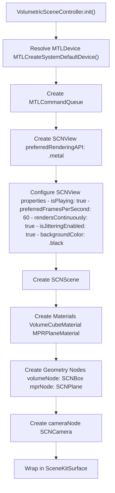

Key configuration options:

| Property | Value | Purpose |
| --- | --- | --- |
| `preferredRenderingAPI` | `.metal` | Force Metal backend (no OpenGL fallback) |
| `isPlaying` | `true` | Enable animation loop |
| `preferredFramesPerSecond` | `60` | Target frame rate |
| `rendersContinuously` | `true` | Render every frame (not on-demand) |
| `isJitteringEnabled` | `true` | Enable temporal anti-aliasing |
| `allowsCameraControl` | `false` | Disable built-in camera (iOS), `true` (macOS fallback) |
| `backgroundColor` | `.black` | Clear color for empty regions |

**Sources:**

* [Sources/MTKUI/VolumetricSceneController.swift L332-L427](https://github.com/ThalesMMS/MTK/blob/eda6f990/Sources/MTKUI/VolumetricSceneController.swift#L332-L427)
* [Sources/MTKUI/VolumetricSceneController.swift L358-L384](https://github.com/ThalesMMS/MTK/blob/eda6f990/Sources/MTKUI/VolumetricSceneController.swift#L358-L384)

## Scene Graph Structure

The SceneKit backend maintains three primary nodes in the scene graph: `volumeNode` for volume rendering, `mprNode` for multi-planar reconstruction, and `cameraNode` for viewpoint management. Only one visualization node is visible at a time, controlled by the `isHidden` property.

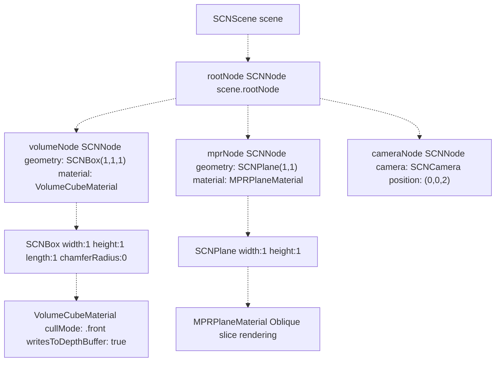

### Node Visibility Management

Display mode is controlled via the `DisplayConfiguration` enum:

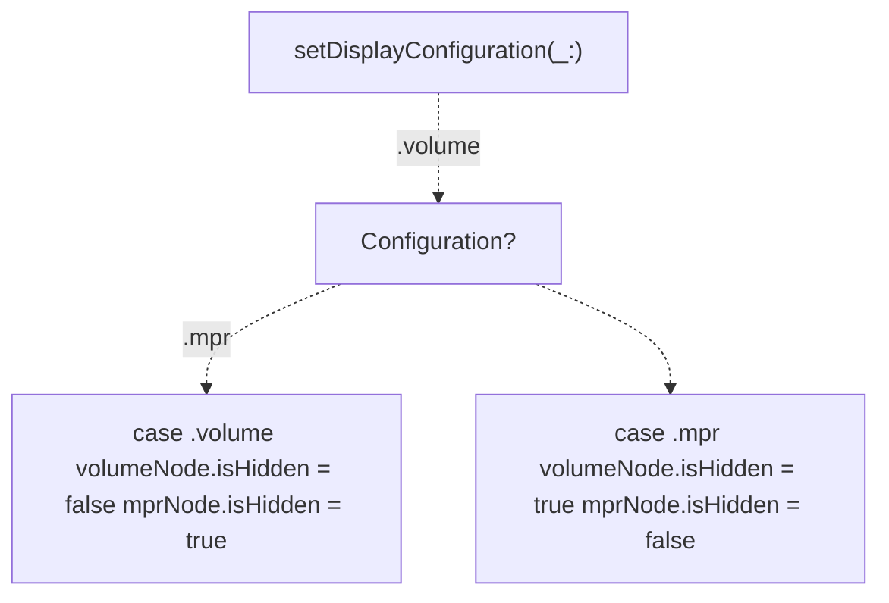

**Node Transform Synchronization:** The `mprNode` inherits its base transform from `volumeNode` to maintain consistent world-space positioning:

```
mprNode.simdTransform = volumeNode.simdTransform
```

**Sources:**

* [Sources/MTKUI/VolumetricSceneController.swift L266-L404](https://github.com/ThalesMMS/MTK/blob/eda6f990/Sources/MTKUI/VolumetricSceneController.swift#L266-L404)
* [Sources/MTKUI/VolumetricSceneController.swift L386-L427](https://github.com/ThalesMMS/MTK/blob/eda6f990/Sources/MTKUI/VolumetricSceneController.swift#L386-L427)

## VolumeCubeMaterial

`VolumeCubeMaterial` is the core material class that encapsulates Metal shaders for volume rendering. It extends `SCNMaterial` and implements `SCNProgramDelegate` to bind custom vertex and fragment functions. The material manages three critical GPU resources: the volume texture, transfer function texture, and uniforms buffer.

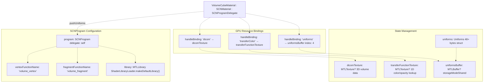

### Material Initialization

The material is initialized with explicit shader function names and a custom delegate for error handling:

| Component | Configuration |
| --- | --- |
| Vertex Function | `"volume_vertex"` |
| Fragment Function | `"volume_fragment"` |
| Metal Library | Loaded via `ShaderLibraryLoader.makeDefaultLibrary()` |
| Cull Mode | `.front` (render back faces first for ray entry points) |
| Depth Writes | `true` (maintain correct depth ordering) |

### Resource Binding Strategy

The material uses `SCNProgram.handleBinding(ofBufferNamed:frequency:)` to manually control resource binding. The uniforms buffer is bound at fragment shader index 4 every frame:

```javascript
program.handleBinding(ofBufferNamed: uniformsKey, frequency: .perFrame) { 
    [weak self] _, _, _, renderer in
    guard let self,
          let encoder = renderer.currentRenderCommandEncoder,
          let buffer = self.uniformsBuffer else { return }
    encoder.setFragmentBuffer(buffer, offset: 0, index: 4)
}
```

**Sources:**

* [Sources/MTKSceneKit/Materials/VolumeCubeMaterial.swift L17-L175](https://github.com/ThalesMMS/MTK/blob/eda6f990/Sources/MTKSceneKit/Materials/VolumeCubeMaterial.swift#L17-L175)
* [Sources/MTKSceneKit/Materials/VolumeCubeMaterial.swift L143-L175](https://github.com/ThalesMMS/MTK/blob/eda6f990/Sources/MTKSceneKit/Materials/VolumeCubeMaterial.swift#L143-L175)
* [Sources/MTKSceneKit/Materials/VolumeCubeMaterial.swift L158-L163](https://github.com/ThalesMMS/MTK/blob/eda6f990/Sources/MTKSceneKit/Materials/VolumeCubeMaterial.swift#L158-L163)

## Uniforms Structure

The `VolumeCubeMaterial.Uniforms` struct is a 48+ byte packed buffer that mirrors the Metal shader's uniform layout. Every field must maintain byte-perfect alignment with the corresponding Metal struct to prevent rendering artifacts.

```mermaid
flowchart TD

UniformsStruct["VolumeCubeMaterial.Uniforms sizeable protocol"]
IsLightingOn["isLightingOn: Int32 Enable diffuse/specular"]
IsBackwardOn["isBackwardOn: Int32 Reverse ray march"]
Method["method: Int32 0:surf 1:dvr 2:mip 3:minip 4:avg"]
Quality["renderingQuality: Int32 Ray marching steps"]
VoxelMin["voxelMinValue: Int32 Window min HU"]
VoxelMax["voxelMaxValue: Int32 Window max HU"]
DatasetMin["datasetMinValue: Int32 Absolute min HU"]
DatasetMax["datasetMaxValue: Int32 Absolute max HU"]
DensityFloor["densityFloor: Float Projection min density"]
DensityCeil["densityCeil: Float Projection max density"]
GateHuMin["gateHuMin: Int32 HU gate lower bound"]
GateHuMax["gateHuMax: Int32 HU gate upper bound"]
UseHuGate["useHuGate: Int32 Enable HU gating"]
DimX["dimX: Int32 Volume width"]
DimY["dimY: Int32 Volume height"]
DimZ["dimZ: Int32 Volume depth"]
UseTFProj["useTFProj: Int32 Apply TF to projections"]
Pad0["_pad0: Int32"]
Pad1["_pad1: Int32"]
Pad2["_pad2: Int32"]

UniformsStruct -.-> IsLightingOn
UniformsStruct -.-> IsBackwardOn
UniformsStruct -.-> Method
UniformsStruct -.-> Quality
UniformsStruct -.-> VoxelMin
UniformsStruct -.-> VoxelMax
UniformsStruct -.-> DatasetMin
UniformsStruct -.-> DatasetMax
UniformsStruct -.-> DensityFloor
UniformsStruct -.-> DensityCeil
UniformsStruct -.-> GateHuMin
UniformsStruct -.-> GateHuMax
UniformsStruct -.-> UseHuGate
UniformsStruct -.-> DimX
UniformsStruct -.-> DimY
UniformsStruct -.-> DimZ
UniformsStruct -.-> UseTFProj
UniformsStruct -.-> Pad0
UniformsStruct -.-> Pad1
UniformsStruct -.-> Pad2

subgraph subGraph4 ["Padding - 12 bytes"]
    Pad0
    Pad1
    Pad2
end

subgraph subGraph3 ["Dataset Geometry - 16 bytes"]
    DimX
    DimY
    DimZ
    UseTFProj
end

subgraph subGraph2 ["Gating Parameters - 20 bytes"]
    DensityFloor
    DensityCeil
    GateHuMin
    GateHuMax
    UseHuGate
end

subgraph subGraph1 ["HU Windowing - 16 bytes"]
    VoxelMin
    VoxelMax
    DatasetMin
    DatasetMax
end

subgraph subGraph0 ["Rendering Control - 16 bytes"]
    IsLightingOn
    IsBackwardOn
    Method
    Quality
end
```

### Uniforms Buffer Update Mechanism

When uniforms are modified (e.g., via `setMethod()`, `setHuWindow()`, `setLighting()`), the material calls `pushUniforms()` to copy the struct into the Metal buffer:

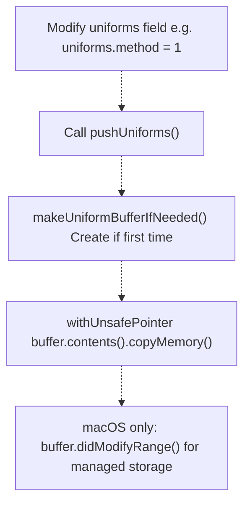

**Platform-Specific Behavior:** On macOS, buffers created with `.managed` storage mode require explicit `didModifyRange()` calls to synchronize CPU→GPU copies. iOS uses `.shared` storage, which does not need this notification.

**Sources:**

* [Sources/MTKSceneKit/Materials/VolumeCubeMaterial.swift L64-L118](https://github.com/ThalesMMS/MTK/blob/eda6f990/Sources/MTKSceneKit/Materials/VolumeCubeMaterial.swift#L64-L118)
* [Sources/MTKSceneKit/Materials/VolumeCubeMaterial.swift L396-L414](https://github.com/ThalesMMS/MTK/blob/eda6f990/Sources/MTKSceneKit/Materials/VolumeCubeMaterial.swift#L396-L414)
* [Sources/MTKSceneKit/Materials/VolumeCubeMaterial.swift L486-L490](https://github.com/ThalesMMS/MTK/blob/eda6f990/Sources/MTKSceneKit/Materials/VolumeCubeMaterial.swift#L486-L490)

## Custom Metal Shaders

The SceneKit backend uses two shader functions defined in the Metal shader library: `volume_vertex` for geometry transformation and `volume_fragment` for ray marching. These functions are referenced by name in `SCNProgram` and loaded from `VolumeRendering.metallib`.

### Shader Loading and Binding

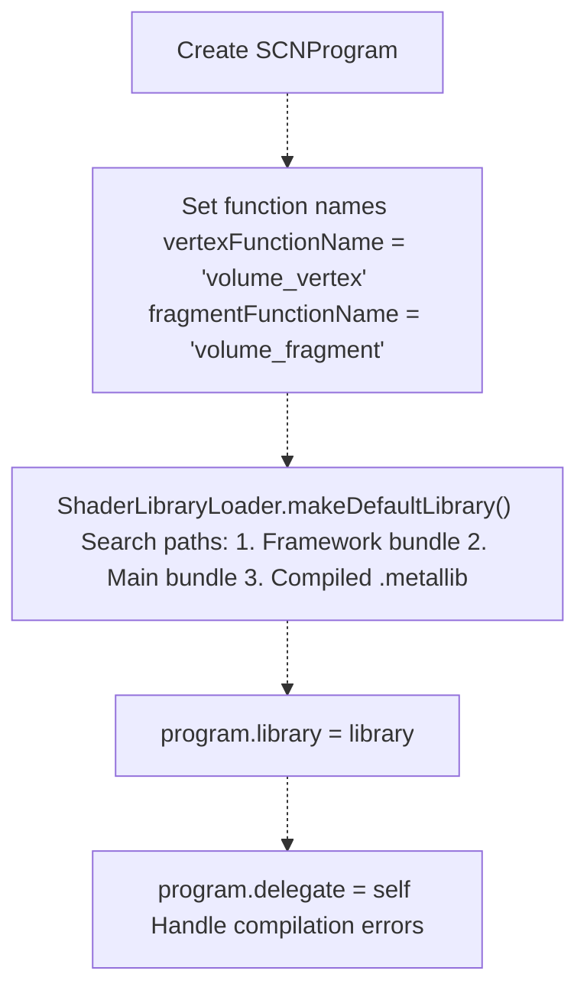

### Vertex Shader: volume_vertex

The vertex shader transforms cube vertices from model space to clip space and passes normalized texture coordinates (0-1 range) to the fragment shader. For a unit cube centered at origin, texture coordinates map directly to world-space positions + 0.5.

**Expected Inputs:**

* Vertex positions from `SCNBox` geometry
* Model-view-projection matrices from SceneKit

**Outputs:**

* `gl_Position`: Clip-space vertex position
* Interpolated texture coordinates for volume sampling

### Fragment Shader: volume_fragment

The fragment shader performs per-pixel ray marching through the volume texture. It reads the `method` field from uniforms to dispatch to specialized kernels:

| Method ID | Kernel Name | Algorithm |
| --- | --- | --- |
| 0 | `surface_rendering` | Isosurface extraction with gradient normals |
| 1 | `direct_volume_rendering` | Opacity-weighted color accumulation (DVR) |
| 2 | `max_intensity_projection` | Maximum voxel intensity along ray |
| 3 | `min_intensity_projection` | Minimum voxel intensity along ray |
| 4 | `average_intensity_projection` | Average voxel intensity along ray |

### Ray Marching Pseudocode

The fragment shader implements front-to-back ray marching:

```javascript
1. Compute ray entry/exit points from texture coordinates
2. Calculate ray direction and march step size
3. Initialize accumulation variables (color, opacity)
4. FOR each sample along the ray:
   a. Sample 3D volume texture at current position
   b. Normalize voxel value using voxelMin/Max from uniforms
   c. Look up color/opacity from transfer function texture
   d. IF useHuGate == 1 AND voxel outside [gateHuMin, gateHuMax]:
      SKIP this sample
   e. IF isLightingOn == 1:
      Compute gradient via central differences
      Apply Phong lighting (diffuse + specular)
   f. Accumulate color using front-to-back compositing:
      color += (1 - opacity) * sample.rgb * sample.a
      opacity += (1 - opacity) * sample.a
   g. IF opacity > 0.95:
      BREAK (early ray termination)
   h. Advance to next sample position
5. RETURN final accumulated color
```

**Sources:**

* [Sources/MTKSceneKit/Materials/VolumeCubeMaterial.swift L143-L152](https://github.com/ThalesMMS/MTK/blob/eda6f990/Sources/MTKSceneKit/Materials/VolumeCubeMaterial.swift#L143-L152)
* [Sources/MTKSceneKit/Materials/VolumeCubeMaterial.swift L423-L438](https://github.com/ThalesMMS/MTK/blob/eda6f990/Sources/MTKSceneKit/Materials/VolumeCubeMaterial.swift#L423-L438)

## Dataset Application and Texture Management

When a new volume dataset is applied, `VolumeCubeMaterial.setDataset()` regenerates the 3D Metal texture and updates uniforms to match the new geometry and intensity range. This operation is expensive and should be called sparingly.

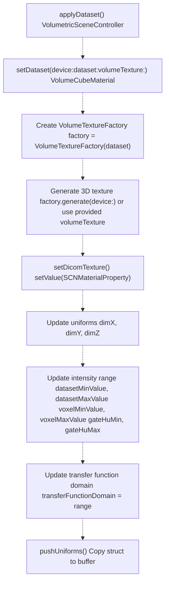

### Shared Volume Texture Pattern

The controller maintains `sharedVolumeTexture` to ensure both SceneKit and MPS backends reference the same 3D texture. When applying a dataset:

1. Generate texture once via `VolumeTextureFactory.generate()`
2. Store in `controller.sharedVolumeTexture`
3. Pass to `volumeMaterial.setDataset(volumeTexture: sharedTexture)`
4. Pass to `mpsRenderer` if MPS backend is active

This eliminates redundant texture uploads and ensures data consistency across backends.

**Sources:**

* [Sources/MTKSceneKit/Materials/VolumeCubeMaterial.swift L220-L227](https://github.com/ThalesMMS/MTK/blob/eda6f990/Sources/MTKSceneKit/Materials/VolumeCubeMaterial.swift#L220-L227)
* [Sources/MTKSceneKit/Materials/VolumeCubeMaterial.swift L440-L484](https://github.com/ThalesMMS/MTK/blob/eda6f990/Sources/MTKSceneKit/Materials/VolumeCubeMaterial.swift#L440-L484)
* [Sources/MTKUI/VolumetricSceneController.swift L315](https://github.com/ThalesMMS/MTK/blob/eda6f990/Sources/MTKUI/VolumetricSceneController.swift#L315-L315)

## Transfer Function Application

Transfer functions map voxel intensities to colors and opacities. The material supports both preset transfer functions and custom functions. When a transfer function changes, a new 1D Metal texture is generated and bound to the fragment shader.

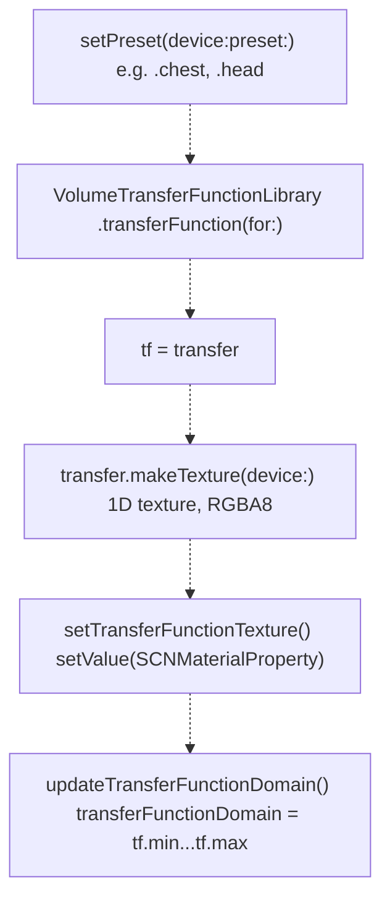

### Transfer Function Domain

The `transferFunctionDomain` property tracks the intensity range covered by the current transfer function. This range is used by `setHuWindow()` to normalize window/level adjustments:

```
HU value → Normalized [0,1] using transferFunctionDomain → TF texture coordinate
```

If no transfer function is set, the domain defaults to the dataset's intensity range.

**Sources:**

* [Sources/MTKSceneKit/Materials/VolumeCubeMaterial.swift L234-L246](https://github.com/ThalesMMS/MTK/blob/eda6f990/Sources/MTKSceneKit/Materials/VolumeCubeMaterial.swift#L234-L246)
* [Sources/MTKSceneKit/Materials/VolumeCubeMaterial.swift L248-L253](https://github.com/ThalesMMS/MTK/blob/eda6f990/Sources/MTKSceneKit/Materials/VolumeCubeMaterial.swift#L248-L253)
* [Sources/MTKSceneKit/Materials/VolumeCubeMaterial.swift L493-L519](https://github.com/ThalesMMS/MTK/blob/eda6f990/Sources/MTKSceneKit/Materials/VolumeCubeMaterial.swift#L493-L519)

## HU Windowing

HU (Hounsfield Unit) windowing controls which intensity range is visible by mapping a subset of the dataset's HU values to the full transfer function. The `HuWindowMapping` struct encapsulates this transformation.

### HU Window Calculation

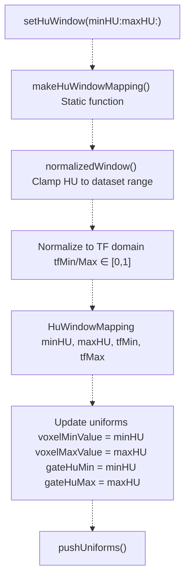

### HuWindowMapping Structure

| Field | Type | Purpose |
| --- | --- | --- |
| `minHU` | `Int32` | Minimum HU value in window (clamped to dataset range) |
| `maxHU` | `Int32` | Maximum HU value in window (clamped to dataset range) |
| `tfMin` | `Float` | Normalized TF coordinate for minHU (0-1) |
| `tfMax` | `Float` | Normalized TF coordinate for maxHU (0-1) |

The shader uses `voxelMinValue` and `voxelMaxValue` to normalize sampled voxels before looking up the transfer function:

```
normalized = (voxel - voxelMinValue) / (voxelMaxValue - voxelMinValue)
tfCoord = clamp(normalized, 0, 1)
color = transferFunctionTexture.sample(sampler, tfCoord)
```

**Sources:**

* [Sources/MTKSceneKit/Materials/VolumeCubeMaterial.swift L293-L314](https://github.com/ThalesMMS/MTK/blob/eda6f990/Sources/MTKSceneKit/Materials/VolumeCubeMaterial.swift#L293-L314)
* [Sources/MTKSceneKit/Materials/VolumeCubeMaterial.swift L316-L394](https://github.com/ThalesMMS/MTK/blob/eda6f990/Sources/MTKSceneKit/Materials/VolumeCubeMaterial.swift#L316-L394)

## Rendering Methods and Quality Control

The material exposes methods to configure rendering parameters dynamically. These methods modify the uniforms struct and push updates to the GPU.

### Method Selection

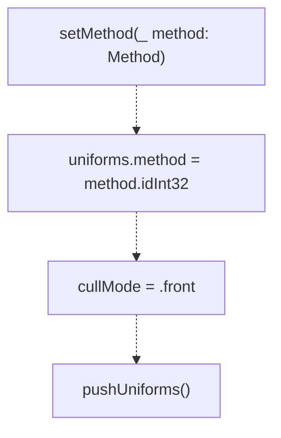

Available methods via `VolumeCubeMaterial.Method` enum:

| Case | Int32 Value | Description |
| --- | --- | --- |
| `.surf` | 0 | Surface rendering (isosurface extraction) |
| `.dvr` | 1 | Direct volume rendering (opacity compositing) |
| `.mip` | 2 | Maximum intensity projection |
| `.minip` | 3 | Minimum intensity projection |
| `.avg` | 4 | Average intensity projection |

### Quality and Sampling

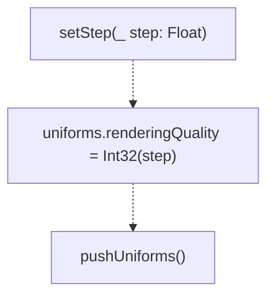

The `renderingQuality` field controls ray marching step count. Higher values produce better image quality at the cost of GPU performance:

* **Low Quality:** 128-256 steps (fast, visible banding)
* **Medium Quality:** 512 steps (default, balanced)
* **High Quality:** 1024+ steps (smooth, slower)

### Lighting Control

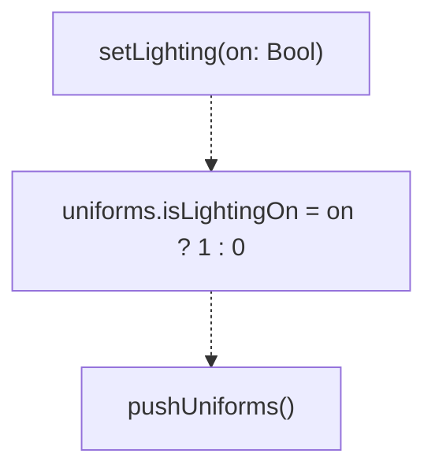

When lighting is enabled (`isLightingOn = 1`), the fragment shader computes gradients via central differences and applies Phong lighting with diffuse and specular components.

**Sources:**

* [Sources/MTKSceneKit/Materials/VolumeCubeMaterial.swift L202-L207](https://github.com/ThalesMMS/MTK/blob/eda6f990/Sources/MTKSceneKit/Materials/VolumeCubeMaterial.swift#L202-L207)
* [Sources/MTKSceneKit/Materials/VolumeCubeMaterial.swift L255-L263](https://github.com/ThalesMMS/MTK/blob/eda6f990/Sources/MTKSceneKit/Materials/VolumeCubeMaterial.swift#L255-L263)
* [Sources/MTKSceneKit/Materials/VolumeCubeMaterial.swift L260-L263](https://github.com/ThalesMMS/MTK/blob/eda6f990/Sources/MTKSceneKit/Materials/VolumeCubeMaterial.swift#L260-L263)

## Rendering Loop and Frame Generation

SceneKit's rendering loop is managed by `SCNView` with continuous rendering enabled. Every frame, SceneKit performs the following steps:

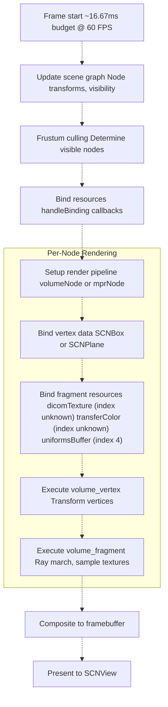

### Node Visibility and Performance

Only visible nodes are rendered. When switching between volume and MPR modes, the controller sets `isHidden` flags:

* **Volume Mode:** `volumeNode.isHidden = false`, `mprNode.isHidden = true`
* **MPR Mode:** `volumeNode.isHidden = true`, `mprNode.isHidden = false`

This prevents both materials from executing their fragment shaders simultaneously, reducing GPU load.

### Continuous vs On-Demand Rendering

The controller configures `rendersContinuously = true`, which forces SceneKit to render every frame regardless of user interaction. This is necessary for:

1. Smooth camera animations during gesture interactions
2. Real-time parameter adjustments (window/level, transfer function shifts)
3. Adaptive sampling transitions (quality degradation during interaction, restoration afterward)

**Sources:**

* [Sources/MTKUI/VolumetricSceneController.swift L377-L383](https://github.com/ThalesMMS/MTK/blob/eda6f990/Sources/MTKUI/VolumetricSceneController.swift#L377-L383)

## Error Handling and Debugging

The material implements `SCNProgramDelegate` to receive shader compilation errors and logs warnings when resources fail to load.

### Program Error Handling

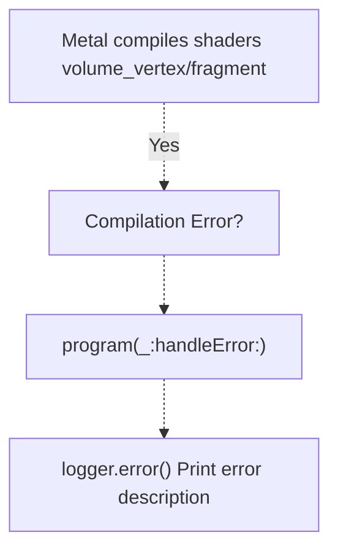

Common error scenarios:

| Scenario | Error Message | Resolution |
| --- | --- | --- |
| Missing metallib | "Failed to load VolumeRendering.metallib" | Ensure shader library is bundled with framework |
| Uniforms misalignment | Silent black screen | Verify struct layout matches Metal shader definition |
| Missing texture | Fragment shader samples nil | Check that `setDataset()` or `setPart()` was called |

### Debug Accessors

The material exposes testing-only accessors via `@_spi(Testing)` for introspection:

* `currentVolumeTexture()`: Returns bound 3D volume texture
* `currentTransferFunctionTexture()`: Returns bound 1D transfer function texture
* `snapshotUniforms()`: Returns current uniforms struct

**Sources:**

* [Sources/MTKSceneKit/Materials/VolumeCubeMaterial.swift L522-L526](https://github.com/ThalesMMS/MTK/blob/eda6f990/Sources/MTKSceneKit/Materials/VolumeCubeMaterial.swift#L522-L526)
* [Sources/MTKSceneKit/Materials/VolumeCubeMaterial.swift L529-L535](https://github.com/ThalesMMS/MTK/blob/eda6f990/Sources/MTKSceneKit/Materials/VolumeCubeMaterial.swift#L529-L535)


### On this page

* [SceneKit Backend](#2.1-scenekit-backend)
* [Purpose and Scope](#2.1-purpose-and-scope)
* [Architecture Overview](#2.1-architecture-overview)
* [Initialization and SCNView Configuration](#2.1-initialization-and-scnview-configuration)
* [Scene Graph Structure](#2.1-scene-graph-structure)
* [Node Visibility Management](#2.1-node-visibility-management)
* [VolumeCubeMaterial](#2.1-volumecubematerial)
* [Material Initialization](#2.1-material-initialization)
* [Resource Binding Strategy](#2.1-resource-binding-strategy)
* [Uniforms Structure](#2.1-uniforms-structure)
* [Uniforms Buffer Update Mechanism](#2.1-uniforms-buffer-update-mechanism)
* [Custom Metal Shaders](#2.1-custom-metal-shaders)
* [Shader Loading and Binding](#2.1-shader-loading-and-binding)
* [Vertex Shader: volume_vertex](#2.1-vertex-shader-object-object)
* [Fragment Shader: volume_fragment](#2.1-fragment-shader-object-object)
* [Ray Marching Pseudocode](#2.1-ray-marching-pseudocode)
* [Dataset Application and Texture Management](#2.1-dataset-application-and-texture-management)
* [Shared Volume Texture Pattern](#2.1-shared-volume-texture-pattern)
* [Transfer Function Application](#2.1-transfer-function-application)
* [Transfer Function Domain](#2.1-transfer-function-domain)
* [HU Windowing](#2.1-hu-windowing)
* [HU Window Calculation](#2.1-hu-window-calculation)
* [HuWindowMapping Structure](#2.1-huwindowmapping-structure)
* [Rendering Methods and Quality Control](#2.1-rendering-methods-and-quality-control)
* [Method Selection](#2.1-method-selection)
* [Quality and Sampling](#2.1-quality-and-sampling)
* [Lighting Control](#2.1-lighting-control)
* [Rendering Loop and Frame Generation](#2.1-rendering-loop-and-frame-generation)
* [Node Visibility and Performance](#2.1-node-visibility-and-performance)
* [Continuous vs On-Demand Rendering](#2.1-continuous-vs-on-demand-rendering)
* [Error Handling and Debugging](#2.1-error-handling-and-debugging)
* [Program Error Handling](#2.1-program-error-handling)
* [Debug Accessors](#2.1-debug-accessors)

Ask Devin about MTK