# Metal Performance Shaders Backend

> **Relevant source files**
> * [Sources/MTKCore/Rendering/MPSVolumeRenderer.swift](https://github.com/ThalesMMS/MTK/blob/eda6f990/Sources/MTKCore/Rendering/MPSVolumeRenderer.swift)
> * [Sources/MTKUI/VolumetricSceneController+MPS.swift](https://github.com/ThalesMMS/MTK/blob/eda6f990/Sources/MTKUI/VolumetricSceneController+MPS.swift)

## Purpose and Scope

The Metal Performance Shaders (MPS) backend provides GPU-accelerated volumetric rendering operations by leveraging Metal Performance Shaders compute kernels. This backend implements three primary GPU-accelerated operations:

1. **Histogram Calculation**: Efficient computation of intensity distribution using `MPSImageHistogram`
2. **Gaussian Filtering**: Volume smoothing using `MPSImageGaussianBlur`
3. **Bounding Box Ray Casting**: Camera ray-volume intersection tests for rendering optimization

The MPS backend consists of two primary components: `MPSVolumeRenderer` (core GPU operations) and `MPSDisplayAdapter` (display surface and state management). This page documents both components and their integration with `VolumetricSceneController`.

For the alternative SceneKit rendering path, see [SceneKit Backend](2a%20SceneKit-Backend.md). For the protocol abstraction that decouples these backends from the UI layer, see [RenderSurface Abstraction](2c%20RenderSurface-Abstraction.md).

**Sources:** [Sources/MTKCore/Rendering/MPSVolumeRenderer.swift L1-L502](https://github.com/ThalesMMS/MTK/blob/eda6f990/Sources/MTKCore/Rendering/MPSVolumeRenderer.swift#L1-L502)

 [Sources/MTKUI/VolumetricSceneController L1-L334](https://github.com/ThalesMMS/MTK/blob/eda6f990/Sources/MTKUI/VolumetricSceneController+MPS.swift#L1-L334)

---

## Architecture Overview

The MPS backend is split across two files and consists of two primary classes:

1. **MPSVolumeRenderer** (`MTKCore`): Core GPU operations using Metal Performance Shaders
2. **MPSDisplayAdapter** (`MTKUI`): Display surface and visual feedback system

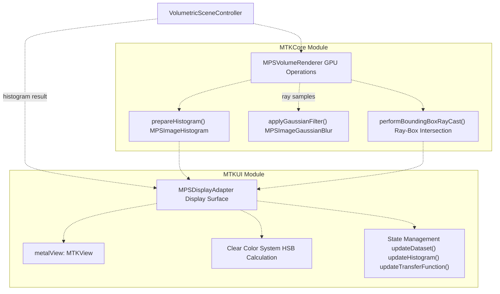

**Diagram: MPS Backend Architecture**

The `MPSVolumeRenderer` operates in the `MTKCore` module and has no UI dependencies. It performs pure GPU operations and returns results as data structures. The `MPSDisplayAdapter` lives in the `MTKUI` module and provides the rendering surface, consuming results from `MPSVolumeRenderer` to drive visual feedback through dynamic clear color calculation.

**Sources:** [Sources/MTKCore/Rendering/MPSVolumeRenderer.swift L17-L79](https://github.com/ThalesMMS/MTK/blob/eda6f990/Sources/MTKCore/Rendering/MPSVolumeRenderer.swift#L17-L79)

 [Sources/MTKUI/VolumetricSceneController L27-L62](https://github.com/ThalesMMS/MTK/blob/eda6f990/Sources/MTKUI/VolumetricSceneController+MPS.swift#L27-L62)

---

## MPSVolumeRenderer Implementation

### Class Structure and Initialization

`MPSVolumeRenderer` is defined in `MTKCore` and provides GPU-accelerated operations for volumetric data processing:

```
public final class MPSVolumeRenderer {    private let device: any MTLDevice    private let commandQueue: any MTLCommandQueue    private let logger: Logger    private var histogramInfo: MPSImageHistogramInfo    private let histogramKernel: MPSImageHistogram}
```

The class is conditionally compiled only when `MetalPerformanceShaders` framework is available.

**Initialization Requirements:**

| Component | Purpose | Failure Condition |
| --- | --- | --- |
| `MPSSupportsMTLDevice(device)` | Verify MPS support | Returns `nil` if device doesn't support MPS |
| `MTLCommandQueue` | Command submission | Returns `nil` if queue creation fails |
| `MPSImageHistogram` | Histogram kernel | Initialized with 4096 bins, range [-1024, 3071] HU |

The initializer fails gracefully by returning `nil` if the device doesn't support MPS operations, allowing fallback to CPU-based implementations.

**Sources:** [Sources/MTKCore/Rendering/MPSVolumeRenderer.swift L17-L79](https://github.com/ThalesMMS/MTK/blob/eda6f990/Sources/MTKCore/Rendering/MPSVolumeRenderer.swift#L17-L79)

### Data Structures

The class defines three primary data structures:

**HistogramResult:**

```
public struct HistogramResult: Equatable {    public let bins: [Float]    public let intensityRange: ClosedRange<Float>}
```

**Ray:**

```
public struct Ray: Equatable {    public var origin: SIMD3<Float>    public var direction: SIMD3<Float>}
```

The `Ray` initializer normalizes the direction vector and falls back to positive Z-axis if normalization produces invalid values.

**RayCastingSample:**

```
public struct RayCastingSample: Equatable {    public var ray: Ray    public var entryDistance: Float    public var exitDistance: Float}
```

**Sources:** [Sources/MTKCore/Rendering/MPSVolumeRenderer.swift L18-L45](https://github.com/ThalesMMS/MTK/blob/eda6f990/Sources/MTKCore/Rendering/MPSVolumeRenderer.swift#L18-L45)

### Error Types

```
public enum RendererError: Swift.Error, Equatable {    case unsupportedDevice    case commandBufferUnavailable    case histogramEncodingFailed    case texturePreparationFailed    case blitEncoderUnavailable    case sliceViewUnavailable    case unsupportedPixelFormat}
```

**Sources:** [Sources/MTKCore/Rendering/MPSVolumeRenderer.swift L47-L55](https://github.com/ThalesMMS/MTK/blob/eda6f990/Sources/MTKCore/Rendering/MPSVolumeRenderer.swift#L47-L55)

---

## Histogram Calculation

The `prepareHistogram(dataset:)` method computes the intensity distribution of a volumetric dataset using GPU or CPU, depending on pixel format compatibility.

### Dispatch Strategy

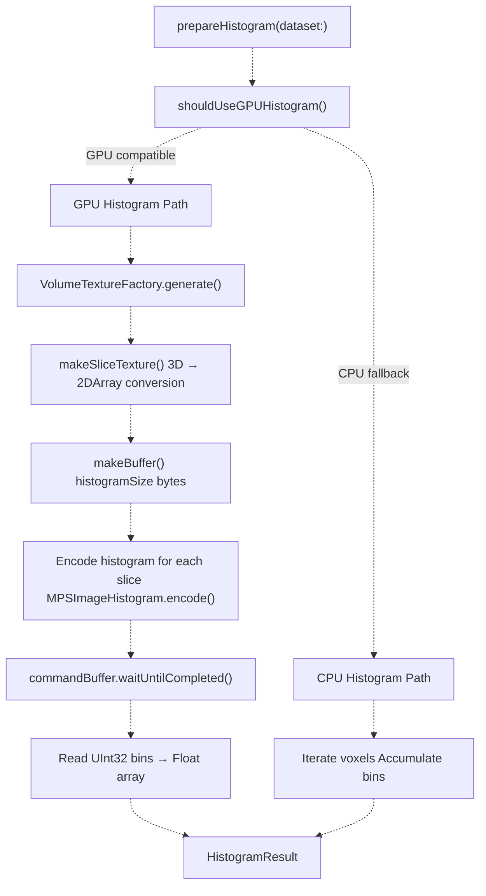

**Diagram: Histogram Calculation Dispatch**

**GPU Path Requirements:**

* Pixel format must be GPU-compatible (currently excludes `.int16Signed` and `.int16Unsigned`)
* Device must support `MPSImageHistogram`
* Sufficient GPU memory for temporary textures

**Sources:** [Sources/MTKCore/Rendering/MPSVolumeRenderer.swift L81-L150](https://github.com/ThalesMMS/MTK/blob/eda6f990/Sources/MTKCore/Rendering/MPSVolumeRenderer.swift#L81-L150)

 [Sources/MTKCore/Rendering/MPSVolumeRenderer.swift L264-L269](https://github.com/ThalesMMS/MTK/blob/eda6f990/Sources/MTKCore/Rendering/MPSVolumeRenderer.swift#L264-L269)

### GPU Histogram Implementation

The GPU histogram implementation performs the following steps:

**1. Texture Generation:**

```
VolumeTextureFactory(dataset: dataset).generate(device: device)
```

Creates a 3D `MTLTexture` from the `VolumeDataset`.

**2. Slice Texture Conversion:**

`MPSImageHistogram` operates on 2D textures, so 3D volumes must be converted to 2D array textures:

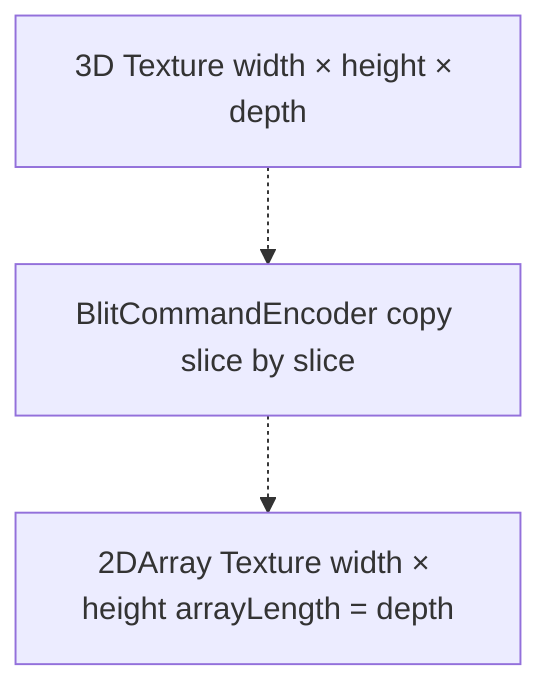

**Diagram: 3D to 2DArray Texture Conversion**

The `makeSliceTexture(from:on:label:)` method creates a 2D array texture and uses a blit encoder to copy each Z-slice from the 3D texture to a corresponding array slice.

**Sources:** [Sources/MTKCore/Rendering/MPSVolumeRenderer.swift L322-L364](https://github.com/ThalesMMS/MTK/blob/eda6f990/Sources/MTKCore/Rendering/MPSVolumeRenderer.swift#L322-L364)

**3. Histogram Encoding:**

For 2D array textures, the histogram kernel is encoded for each array slice:

```
for sliceIndex in 0..<sliceCount {    let sliceView = sliceTexture.makeTextureView(        pixelFormat: sliceTexture.pixelFormat,        textureType: .type2D,        levels: 0..<1,        slices: sliceIndex..<(sliceIndex + 1)    )    histogramKernel.encode(        to: commandBuffer,        sourceTexture: sliceView,        histogram: histogramBuffer,        histogramOffset: 0    )}
```

All slices accumulate into the same histogram buffer (offset 0), producing a unified distribution.

**Sources:** [Sources/MTKCore/Rendering/MPSVolumeRenderer.swift L114-L130](https://github.com/ThalesMMS/MTK/blob/eda6f990/Sources/MTKCore/Rendering/MPSVolumeRenderer.swift#L114-L130)

**4. Buffer Readback:**

After GPU execution completes, the histogram buffer (stored as `UInt32` counts) is read and converted to `Float`:

```
histogramBuffer.contents().withMemoryRebound(to: UInt32.self, capacity: entryCount) { pointer in    for index in 0..<entryCount {        bins[index] = Float(pointer[index])    }}
```

**Sources:** [Sources/MTKCore/Rendering/MPSVolumeRenderer.swift L138-L144](https://github.com/ThalesMMS/MTK/blob/eda6f990/Sources/MTKCore/Rendering/MPSVolumeRenderer.swift#L138-L144)

### CPU Histogram Implementation

The CPU fallback iterates through all voxels and accumulates bin counts:

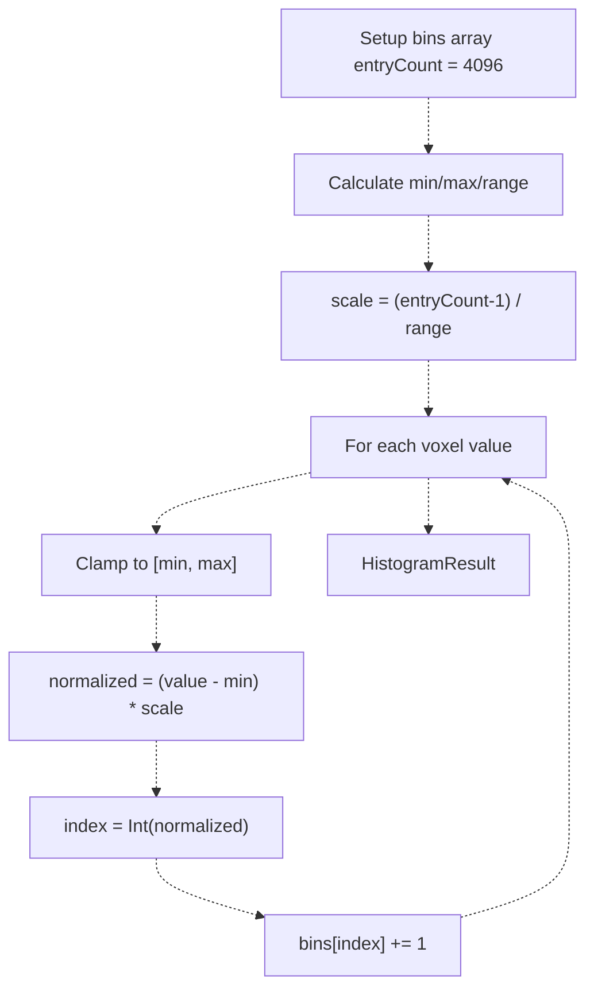

**Diagram: CPU Histogram Algorithm**

The CPU path handles both `.int16Signed` and `.int16Unsigned` pixel formats by binding the data buffer to the appropriate type:

```
dataset.data.withUnsafeBytes { rawBuffer in    switch dataset.pixelFormat {    case .int16Signed:        let values = rawBuffer.bindMemory(to: Int16.self)        // accumulate    case .int16Unsigned:        let values = rawBuffer.bindMemory(to: UInt16.self)        // accumulate    }}
```

**Sources:** [Sources/MTKCore/Rendering/MPSVolumeRenderer.swift L271-L320](https://github.com/ThalesMMS/MTK/blob/eda6f990/Sources/MTKCore/Rendering/MPSVolumeRenderer.swift#L271-L320)

---

## Gaussian Filtering

The `applyGaussianFilter(dataset:sigma:)` method applies a Gaussian blur to volumetric data using `MPSImageGaussianBlur`:

### Processing Pipeline

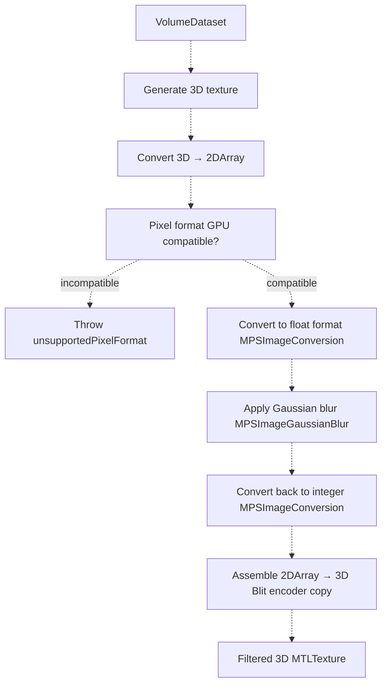

**Diagram: Gaussian Filtering Pipeline**

**Sources:** [Sources/MTKCore/Rendering/MPSVolumeRenderer.swift L152-L237](https://github.com/ThalesMMS/MTK/blob/eda6f990/Sources/MTKCore/Rendering/MPSVolumeRenderer.swift#L152-L237)

### Format Conversion Requirements

`MPSImageGaussianBlur` requires float pixel formats. The pipeline performs three format conversions:

| Stage | Source Format | Target Format | Purpose |
| --- | --- | --- | --- |
| Pre-blur | `.r16Sint` / `.r16Uint` | `.r16Float` | Prepare for Gaussian kernel |
| Blur | `.r16Float` | `.r16Float` | Blur operation |
| Post-blur | `.r16Float` | Original integer format | Restore original format |

The `gaussianCompatibleFloatFormat` extension maps integer formats to their float equivalents:

```
var gaussianCompatibleFloatFormat: MTLPixelFormat? {    switch self {    case .r16Sint:        return .r16Float    case .r16Float, .r32Float:        return self    default:        return nil    }}
```

**Sources:** [Sources/MTKCore/Rendering/MPSVolumeRenderer.swift L476-L485](https://github.com/ThalesMMS/MTK/blob/eda6f990/Sources/MTKCore/Rendering/MPSVolumeRenderer.swift#L476-L485)

### Texture Conversion Process

The `convertTexture(on:source:destination:)` helper uses `MPSImageConversion` to handle format transformations:

```
let conversion = MPSImageConversion(    device: device,    srcAlpha: .alphaIsOne,    destAlpha: .alphaIsOne,    backgroundColor: nil,    conversionInfo: nil)
```

For 2D array textures, conversion is performed slice-by-slice using texture views that reinterpret the pixel format:

```
for slice in 0..<sliceCount {    let srcView = source.makeConversionView(slice: slice)    let dstView = destination.makeConversionView(slice: slice)    conversion.encode(commandBuffer: commandBuffer,                      sourceTexture: srcView,                      destinationTexture: dstView)}
```

The `makeConversionView(slice:)` extension creates 2D texture views with normalized/float formats compatible with `MPSImageConversion`.

**Sources:** [Sources/MTKCore/Rendering/MPSVolumeRenderer.swift L420-L443](https://github.com/ThalesMMS/MTK/blob/eda6f990/Sources/MTKCore/Rendering/MPSVolumeRenderer.swift#L420-L443)

 [Sources/MTKCore/Rendering/MPSVolumeRenderer.swift L488-L500](https://github.com/ThalesMMS/MTK/blob/eda6f990/Sources/MTKCore/Rendering/MPSVolumeRenderer.swift#L488-L500)

### Slice Reassembly

After Gaussian filtering, the 2D array texture slices are copied back into a 3D texture using a blit encoder:

```
for slice in 0..<source.depth {    blit.copy(from: destination,              sourceSlice: slice,              sourceLevel: 0,              sourceOrigin: origin,              sourceSize: size,              to: volumeTexture,              destinationSlice: 0,              destinationLevel: 0,              destinationOrigin: MTLOrigin(x: 0, y: 0, z: slice))}
```

This reconstructs the filtered volume in 3D texture format suitable for volume rendering.

**Sources:** [Sources/MTKCore/Rendering/MPSVolumeRenderer.swift L216-L232](https://github.com/ThalesMMS/MTK/blob/eda6f990/Sources/MTKCore/Rendering/MPSVolumeRenderer.swift#L216-L232)

---

## Bounding Box Ray Casting

The `performBoundingBoxRayCast(dataset:rays:)` method performs CPU-based ray-box intersection tests to determine where camera rays enter and exit the volume bounding box.

### Ray-Box Intersection Algorithm

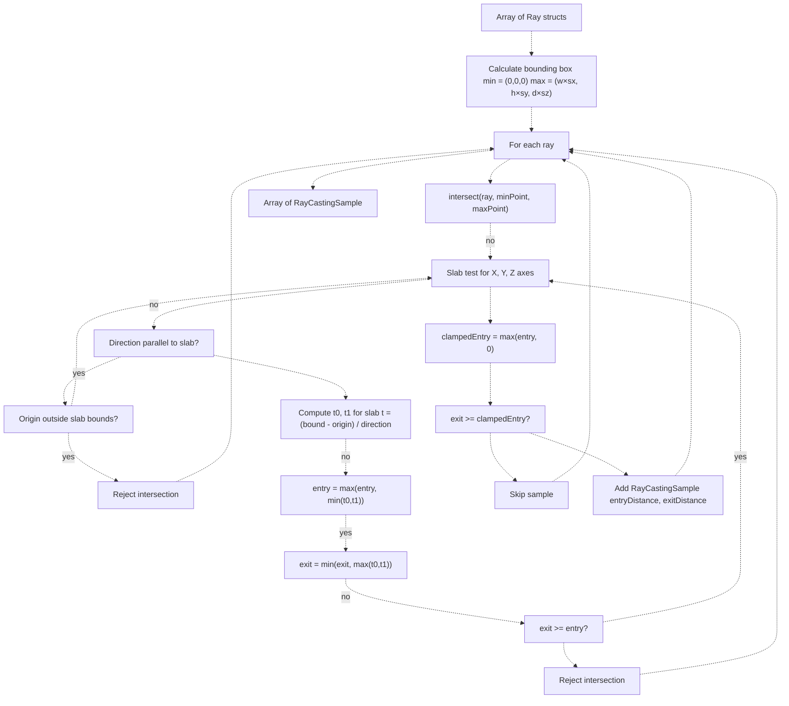

**Diagram: Ray-Box Intersection Algorithm**

**Sources:** [Sources/MTKCore/Rendering/MPSVolumeRenderer.swift L239-L260](https://github.com/ThalesMMS/MTK/blob/eda6f990/Sources/MTKCore/Rendering/MPSVolumeRenderer.swift#L239-L260)

 [Sources/MTKCore/Rendering/MPSVolumeRenderer.swift L366-L401](https://github.com/ThalesMMS/MTK/blob/eda6f990/Sources/MTKCore/Rendering/MPSVolumeRenderer.swift#L366-L401)

### Bounding Box Construction

The bounding box is constructed from dataset dimensions and spacing:

```
let width = Float(dataset.dimensions.width)let height = Float(dataset.dimensions.height)let depth = Float(dataset.dimensions.depth)let spacing = dataset.spacinglet maxPoint = vector_float3(    Float(spacing.x) * width,    Float(spacing.y) * height,    Float(spacing.z) * depth)var box = MPSAxisAlignedBoundingBox()box.min = vector_float3(0, 0, 0)box.max = maxPoint
```

This creates an axis-aligned bounding box in world space with the volume positioned at the origin.

**Sources:** [Sources/MTKCore/Rendering/MPSVolumeRenderer.swift L403-L415](https://github.com/ThalesMMS/MTK/blob/eda6f990/Sources/MTKCore/Rendering/MPSVolumeRenderer.swift#L403-L415)

### Slab Test Implementation

The `intersect(ray:minPoint:maxPoint:)` method implements the slab test algorithm:

```
let slabs: [(Float, Float, Float, Float)] = [    (ray.origin.x, ray.direction.x, minPoint.x, maxPoint.x),    (ray.origin.y, ray.direction.y, minPoint.y, maxPoint.y),    (ray.origin.z, ray.direction.z, minPoint.z, maxPoint.z)]var entry: Float = -.infinityvar exit: Float = .infinityfor (origin, direction, minimum, maximum) in slabs {    if abs(direction) <= Float.ulpOfOne {        // Ray parallel to slab        if origin < minimum || origin > maximum {            return nil  // Ray outside slab, no intersection        }        continue    }        let inverse = 1 / direction    let t0 = (minimum - origin) * inverse    let t1 = (maximum - origin) * inverse    let slabMin = min(t0, t1)    let slabMax = max(t0, t1)        entry = max(entry, slabMin)    exit = min(exit, slabMax)        if exit < entry {        return nil  // No intersection    }}return (entry, exit)
```

The algorithm tests each axis (X, Y, Z) independently. For each axis:

* If the ray direction is parallel (near-zero), check if the ray origin is within bounds
* Otherwise, compute intersection parameters `t0` and `t1` for the slab
* Update global entry/exit distances
* Reject if exit < entry (ray misses the box)

**Sources:** [Sources/MTKCore/Rendering/MPSVolumeRenderer.swift L366-L401](https://github.com/ThalesMMS/MTK/blob/eda6f990/Sources/MTKCore/Rendering/MPSVolumeRenderer.swift#L366-L401)

### Entry Distance Clamping

After intersection, entry distances are clamped to ensure they're non-negative:

```
let clampedEntry = max(entry, 0)guard exit >= clampedEntry else { continue }samples.append(RayCastingSample(ray: ray, entryDistance: clampedEntry, exitDistance: exit))
```

This handles cases where the camera is inside the volume (negative entry distance becomes 0).

**Sources:** [Sources/MTKCore/Rendering/MPSVolumeRenderer.swift L254-L256](https://github.com/ThalesMMS/MTK/blob/eda6f990/Sources/MTKCore/Rendering/MPSVolumeRenderer.swift#L254-L256)

---

## MPSDisplayAdapter Implementation

</old_str>
<new_str>

# Metal Performance Shaders Backend

## Purpose and Scope

The Metal Performance Shaders (MPS) backend provides GPU-accelerated volumetric rendering operations by leveraging Metal Performance Shaders compute kernels. This backend implements three primary GPU-accelerated operations:

1. **Histogram Calculation**: Efficient computation of intensity distribution using `MPSImageHistogram`
2. **Gaussian Filtering**: Volume smoothing using `MPSImageGaussianBlur`
3. **Bounding Box Ray Casting**: Camera ray-volume intersection tests for rendering optimization

The MPS backend consists of two primary components: `MPSVolumeRenderer` (core GPU operations) and `MPSDisplayAdapter` (display surface and state management). This page documents both components and their integration with `VolumetricSceneController`.

For the alternative SceneKit rendering path, see [SceneKit Backend](2a%20SceneKit-Backend.md). For the protocol abstraction that decouples these backends from the UI layer, see [RenderSurface Abstraction](2c%20RenderSurface-Abstraction.md).

**Sources:** [Sources/MTKCore/Rendering/MPSVolumeRenderer.swift L1-L502](https://github.com/ThalesMMS/MTK/blob/eda6f990/Sources/MTKCore/Rendering/MPSVolumeRenderer.swift#L1-L502)

 [Sources/MTKUI/VolumetricSceneController L1-L334](https://github.com/ThalesMMS/MTK/blob/eda6f990/Sources/MTKUI/VolumetricSceneController+MPS.swift#L1-L334)

---

## Architecture Overview

The MPS backend is split across two files and consists of two primary classes:

1. **MPSVolumeRenderer** (`MTKCore`): Core GPU operations using Metal Performance Shaders
2. **MPSDisplayAdapter** (`MTKUI`): Display surface and visual feedback system


**Diagram: MPS Backend Architecture**

The `MPSVolumeRenderer` operates in the `MTKCore` module and has no UI dependencies. It performs pure GPU operations and returns results as data structures. The `MPSDisplayAdapter` lives in the `MTKUI` module and provides the rendering surface, consuming results from `MPSVolumeRenderer` to drive visual feedback through dynamic clear color calculation.

**Sources:** [Sources/MTKCore/Rendering/MPSVolumeRenderer.swift L17-L79](https://github.com/ThalesMMS/MTK/blob/eda6f990/Sources/MTKCore/Rendering/MPSVolumeRenderer.swift#L17-L79)

 [Sources/MTKUI/VolumetricSceneController L27-L62](https://github.com/ThalesMMS/MTK/blob/eda6f990/Sources/MTKUI/VolumetricSceneController+MPS.swift#L27-L62)

---

## MPSVolumeRenderer Implementation

### Class Structure and Initialization

`MPSVolumeRenderer` is defined in `MTKCore` and provides GPU-accelerated operations for volumetric data processing:

```
public final class MPSVolumeRenderer {    private let device: any MTLDevice    private let commandQueue: any MTLCommandQueue    private let logger: Logger    private var histogramInfo: MPSImageHistogramInfo    private let histogramKernel: MPSImageHistogram}
```

The class is conditionally compiled only when `MetalPerformanceShaders` framework is available.

**Initialization Requirements:**

| Component | Purpose | Failure Condition |
| --- | --- | --- |
| `MPSSupportsMTLDevice(device)` | Verify MPS support | Returns `nil` if device doesn't support MPS |
| `MTLCommandQueue` | Command submission | Returns `nil` if queue creation fails |
| `MPSImageHistogram` | Histogram kernel | Initialized with 4096 bins, range [-1024, 3071] HU |

The initializer fails gracefully by returning `nil` if the device doesn't support MPS operations, allowing fallback to CPU-based implementations.

**Sources:** [Sources/MTKCore/Rendering/MPSVolumeRenderer.swift L17-L79](https://github.com/ThalesMMS/MTK/blob/eda6f990/Sources/MTKCore/Rendering/MPSVolumeRenderer.swift#L17-L79)

### Data Structures

The class defines three primary data structures:

**HistogramResult:**

```
public struct HistogramResult: Equatable {    public let bins: [Float]    public let intensityRange: ClosedRange<Float>}
```

**Ray:**

```
public struct Ray: Equatable {    public var origin: SIMD3<Float>    public var direction: SIMD3<Float>}
```

The `Ray` initializer normalizes the direction vector and falls back to positive Z-axis if normalization produces invalid values.

**RayCastingSample:**

```
public struct RayCastingSample: Equatable {    public var ray: Ray    public var entryDistance: Float    public var exitDistance: Float}
```

**Sources:** [Sources/MTKCore/Rendering/MPSVolumeRenderer.swift L18-L45](https://github.com/ThalesMMS/MTK/blob/eda6f990/Sources/MTKCore/Rendering/MPSVolumeRenderer.swift#L18-L45)

### Error Types

```
public enum RendererError: Swift.Error, Equatable {    case unsupportedDevice    case commandBufferUnavailable    case histogramEncodingFailed    case texturePreparationFailed    case blitEncoderUnavailable    case sliceViewUnavailable    case unsupportedPixelFormat}
```

**Sources:** [Sources/MTKCore/Rendering/MPSVolumeRenderer.swift L47-L55](https://github.com/ThalesMMS/MTK/blob/eda6f990/Sources/MTKCore/Rendering/MPSVolumeRenderer.swift#L47-L55)

---

## Histogram Calculation

The `prepareHistogram(dataset:)` method computes the intensity distribution of a volumetric dataset using GPU or CPU, depending on pixel format compatibility.

### Dispatch Strategy


**Diagram: Histogram Calculation Dispatch**

**GPU Path Requirements:**

* Pixel format must be GPU-compatible (currently excludes `.int16Signed` and `.int16Unsigned`)
* Device must support `MPSImageHistogram`
* Sufficient GPU memory for temporary textures

**Sources:** [Sources/MTKCore/Rendering/MPSVolumeRenderer.swift L81-L150](https://github.com/ThalesMMS/MTK/blob/eda6f990/Sources/MTKCore/Rendering/MPSVolumeRenderer.swift#L81-L150)

 [Sources/MTKCore/Rendering/MPSVolumeRenderer.swift L264-L269](https://github.com/ThalesMMS/MTK/blob/eda6f990/Sources/MTKCore/Rendering/MPSVolumeRenderer.swift#L264-L269)

### GPU Histogram Implementation

The GPU histogram implementation performs the following steps:

**1. Texture Generation:**

```
VolumeTextureFactory(dataset: dataset).generate(device: device)
```

Creates a 3D `MTLTexture` from the `VolumeDataset`.

**2. Slice Texture Conversion:**

`MPSImageHistogram` operates on 2D textures, so 3D volumes must be converted to 2D array textures:


**Diagram: 3D to 2DArray Texture Conversion**

The `makeSliceTexture(from:on:label:)` method creates a 2D array texture and uses a blit encoder to copy each Z-slice from the 3D texture to a corresponding array slice.

**Sources:** [Sources/MTKCore/Rendering/MPSVolumeRenderer.swift L322-L364](https://github.com/ThalesMMS/MTK/blob/eda6f990/Sources/MTKCore/Rendering/MPSVolumeRenderer.swift#L322-L364)

**3. Histogram Encoding:**

For 2D array textures, the histogram kernel is encoded for each array slice:

```
for sliceIndex in 0..<sliceCount {    let sliceView = sliceTexture.makeTextureView(        pixelFormat: sliceTexture.pixelFormat,        textureType: .type2D,        levels: 0..<1,        slices: sliceIndex..<(sliceIndex + 1)    )    histogramKernel.encode(        to: commandBuffer,        sourceTexture: sliceView,        histogram: histogramBuffer,        histogramOffset: 0    )}
```

All slices accumulate into the same histogram buffer (offset 0), producing a unified distribution.

**Sources:** [Sources/MTKCore/Rendering/MPSVolumeRenderer.swift L114-L130](https://github.com/ThalesMMS/MTK/blob/eda6f990/Sources/MTKCore/Rendering/MPSVolumeRenderer.swift#L114-L130)

**4. Buffer Readback:**

After GPU execution completes, the histogram buffer (stored as `UInt32` counts) is read and converted to `Float`:

```
histogramBuffer.contents().withMemoryRebound(to: UInt32.self, capacity: entryCount) { pointer in    for index in 0..<entryCount {        bins[index] = Float(pointer[index])    }}
```

**Sources:** [Sources/MTKCore/Rendering/MPSVolumeRenderer.swift L138-L144](https://github.com/ThalesMMS/MTK/blob/eda6f990/Sources/MTKCore/Rendering/MPSVolumeRenderer.swift#L138-L144)

### CPU Histogram Implementation

The CPU fallback iterates through all voxels and accumulates bin counts:

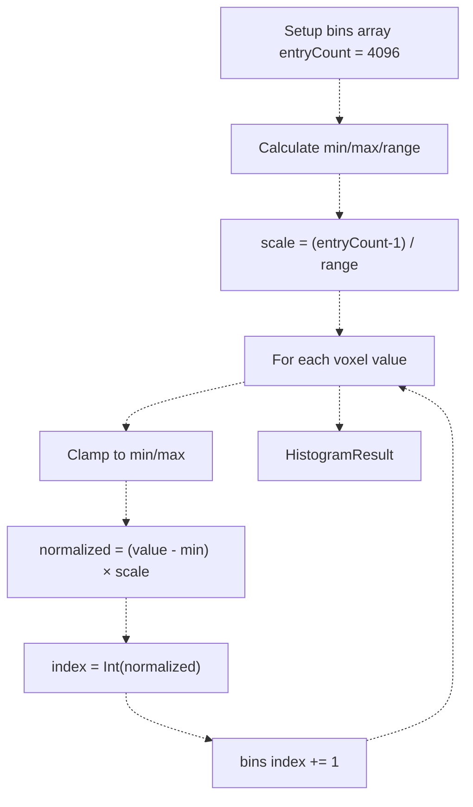

**Diagram: CPU Histogram Algorithm**

The CPU path handles both `.int16Signed` and `.int16Unsigned` pixel formats by binding the data buffer to the appropriate type:

```
dataset.data.withUnsafeBytes { rawBuffer in    switch dataset.pixelFormat {    case .int16Signed:        let values = rawBuffer.bindMemory(to: Int16.self)        // accumulate    case .int16Unsigned:        let values = rawBuffer.bindMemory(to: UInt16.self)        // accumulate    }}
```

**Sources:** [Sources/MTKCore/Rendering/MPSVolumeRenderer.swift L271-L320](https://github.com/ThalesMMS/MTK/blob/eda6f990/Sources/MTKCore/Rendering/MPSVolumeRenderer.swift#L271-L320)

---

## Gaussian Filtering

The `applyGaussianFilter(dataset:sigma:)` method applies a Gaussian blur to volumetric data using `MPSImageGaussianBlur`:

### Processing Pipeline


**Diagram: Gaussian Filtering Pipeline**

**Sources:** [Sources/MTKCore/Rendering/MPSVolumeRenderer.swift L152-L237](https://github.com/ThalesMMS/MTK/blob/eda6f990/Sources/MTKCore/Rendering/MPSVolumeRenderer.swift#L152-L237)

### Format Conversion Requirements

`MPSImageGaussianBlur` requires float pixel formats. The pipeline performs three format conversions:

| Stage | Source Format | Target Format | Purpose |
| --- | --- | --- | --- |
| Pre-blur | `.r16Sint` / `.r16Uint` | `.r16Float` | Prepare for Gaussian kernel |
| Blur | `.r16Float` | `.r16Float` | Blur operation |
| Post-blur | `.r16Float` | Original integer format | Restore original format |

The `gaussianCompatibleFloatFormat` extension maps integer formats to their float equivalents:

```
var gaussianCompatibleFloatFormat: MTLPixelFormat? {    switch self {    case .r16Sint:        return .r16Float    case .r16Float, .r32Float:        return self    default:        return nil    }}
```

**Sources:** [Sources/MTKCore/Rendering/MPSVolumeRenderer.swift L476-L485](https://github.com/ThalesMMS/MTK/blob/eda6f990/Sources/MTKCore/Rendering/MPSVolumeRenderer.swift#L476-L485)

### Texture Conversion Process

The `convertTexture(on:source:destination:)` helper uses `MPSImageConversion` to handle format transformations:

```
let conversion = MPSImageConversion(    device: device,    srcAlpha: .alphaIsOne,    destAlpha: .alphaIsOne,    backgroundColor: nil,    conversionInfo: nil)
```

For 2D array textures, conversion is performed slice-by-slice using texture views that reinterpret the pixel format:

```
for slice in 0..<sliceCount {    let srcView = source.makeConversionView(slice: slice)    let dstView = destination.makeConversionView(slice: slice)    conversion.encode(commandBuffer: commandBuffer,                      sourceTexture: srcView,                      destinationTexture: dstView)}
```

The `makeConversionView(slice:)` extension creates 2D texture views with normalized/float formats compatible with `MPSImageConversion`.

**Sources:** [Sources/MTKCore/Rendering/MPSVolumeRenderer.swift L420-L443](https://github.com/ThalesMMS/MTK/blob/eda6f990/Sources/MTKCore/Rendering/MPSVolumeRenderer.swift#L420-L443)

 [Sources/MTKCore/Rendering/MPSVolumeRenderer.swift L488-L500](https://github.com/ThalesMMS/MTK/blob/eda6f990/Sources/MTKCore/Rendering/MPSVolumeRenderer.swift#L488-L500)

### Slice Reassembly

After Gaussian filtering, the 2D array texture slices are copied back into a 3D texture using a blit encoder:

```
for slice in 0..<source.depth {    blit.copy(from: destination,              sourceSlice: slice,              sourceLevel: 0,              sourceOrigin: origin,              sourceSize: size,              to: volumeTexture,              destinationSlice: 0,              destinationLevel: 0,              destinationOrigin: MTLOrigin(x: 0, y: 0, z: slice))}
```

This reconstructs the filtered volume in 3D texture format suitable for volume rendering.

**Sources:** [Sources/MTKCore/Rendering/MPSVolumeRenderer.swift L216-L232](https://github.com/ThalesMMS/MTK/blob/eda6f990/Sources/MTKCore/Rendering/MPSVolumeRenderer.swift#L216-L232)

---

## Bounding Box Ray Casting

The `performBoundingBoxRayCast(dataset:rays:)` method performs CPU-based ray-box intersection tests to determine where camera rays enter and exit the volume bounding box.

### Ray-Box Intersection Algorithm

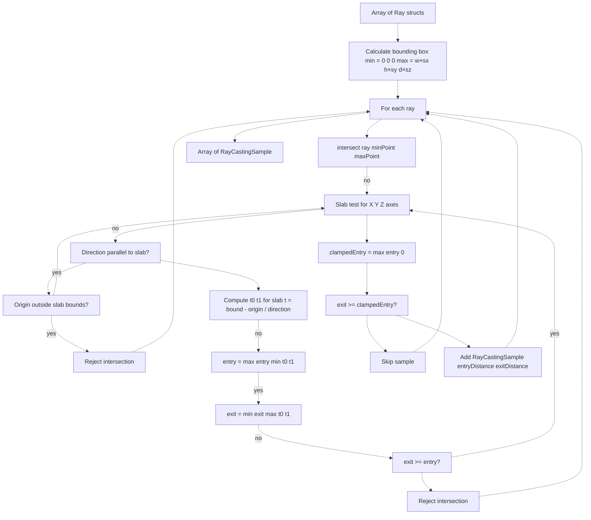

**Diagram: Ray-Box Intersection Algorithm**

**Sources:** [Sources/MTKCore/Rendering/MPSVolumeRenderer.swift L239-L260](https://github.com/ThalesMMS/MTK/blob/eda6f990/Sources/MTKCore/Rendering/MPSVolumeRenderer.swift#L239-L260)

 [Sources/MTKCore/Rendering/MPSVolumeRenderer.swift L366-L401](https://github.com/ThalesMMS/MTK/blob/eda6f990/Sources/MTKCore/Rendering/MPSVolumeRenderer.swift#L366-L401)

### Bounding Box Construction

The bounding box is constructed from dataset dimensions and spacing:

```
let width = Float(dataset.dimensions.width)let height = Float(dataset.dimensions.height)let depth = Float(dataset.dimensions.depth)let spacing = dataset.spacinglet maxPoint = vector_float3(    Float(spacing.x) * width,    Float(spacing.y) * height,    Float(spacing.z) * depth)var box = MPSAxisAlignedBoundingBox()box.min = vector_float3(0, 0, 0)box.max = maxPoint
```

This creates an axis-aligned bounding box in world space with the volume positioned at the origin.

**Sources:** [Sources/MTKCore/Rendering/MPSVolumeRenderer.swift L403-L415](https://github.com/ThalesMMS/MTK/blob/eda6f990/Sources/MTKCore/Rendering/MPSVolumeRenderer.swift#L403-L415)

### Slab Test Implementation

The `intersect(ray:minPoint:maxPoint:)` method implements the slab test algorithm:

```
let slabs: [(Float, Float, Float, Float)] = [    (ray.origin.x, ray.direction.x, minPoint.x, maxPoint.x),    (ray.origin.y, ray.direction.y, minPoint.y, maxPoint.y),    (ray.origin.z, ray.direction.z, minPoint.z, maxPoint.z)]var entry: Float = -.infinityvar exit: Float = .infinityfor (origin, direction, minimum, maximum) in slabs {    if abs(direction) <= Float.ulpOfOne {        // Ray parallel to slab        if origin < minimum || origin > maximum {            return nil  // Ray outside slab, no intersection        }        continue    }        let inverse = 1 / direction    let t0 = (minimum - origin) * inverse    let t1 = (maximum - origin) * inverse    let slabMin = min(t0, t1)    let slabMax = max(t0, t1)        entry = max(entry, slabMin)    exit = min(exit, slabMax)        if exit < entry {        return nil  // No intersection    }}return (entry, exit)
```

The algorithm tests each axis (X, Y, Z) independently. For each axis:

* If the ray direction is parallel (near-zero), check if the ray origin is within bounds
* Otherwise, compute intersection parameters `t0` and `t1` for the slab
* Update global entry/exit distances
* Reject if exit < entry (ray misses the box)

**Sources:** [Sources/MTKCore/Rendering/MPSVolumeRenderer.swift L366-L401](https://github.com/ThalesMMS/MTK/blob/eda6f990/Sources/MTKCore/Rendering/MPSVolumeRenderer.swift#L366-L401)

### Entry Distance Clamping

After intersection, entry distances are clamped to ensure they're non-negative:

```
let clampedEntry = max(entry, 0)guard exit >= clampedEntry else { continue }samples.append(RayCastingSample(ray: ray, entryDistance: clampedEntry, exitDistance: exit))
```

This handles cases where the camera is inside the volume (negative entry distance becomes 0).

**Sources:** [Sources/MTKCore/Rendering/MPSVolumeRenderer.swift L254-L256](https://github.com/ThalesMMS/MTK/blob/eda6f990/Sources/MTKCore/Rendering/MPSVolumeRenderer.swift#L254-L256)

---

## MPSDisplayAdapter Implementation

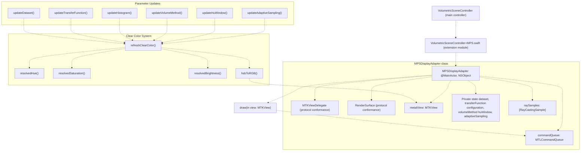

**Diagram: MPSDisplayAdapter Component Structure**

The `MPSDisplayAdapter` is initialized with a Metal device and command queue, creating an `MTKView` configured for 60 FPS rendering with a BGRA8 pixel format. The view is initially hidden and becomes visible only when the MPS backend is activated.

**Sources:** [Sources/MTKUI/VolumetricSceneController L27-L62](https://github.com/ThalesMMS/MTK/blob/eda6f990/Sources/MTKUI/VolumetricSceneController+MPS.swift#L27-L62)

---

## Class Definition and Initialization

### MPSDisplayAdapter Declaration

```
@MainActorpublic final class MPSDisplayAdapter: NSObject, MTKViewDelegate, RenderSurface
```

The class is marked `@MainActor` to ensure all UI interactions occur on the main thread. It conforms to:

* `MTKViewDelegate`: Receives Metal rendering callbacks
* `RenderSurface`: Provides platform-agnostic display surface abstraction
* `NSObject`: Required for Objective-C runtime compatibility with MetalKit

**Private State:**

| Property | Type | Purpose |
| --- | --- | --- |
| `metalView` | `MTKView` | Direct Metal rendering surface |
| `commandQueue` | `MTLCommandQueue` | Metal command submission queue |
| `histogram` | `MPSVolumeRenderer.HistogramResult?` | Dataset intensity distribution |
| `dataset` | `VolumeDataset?` | Current volumetric dataset |
| `transferFunction` | `TransferFunction?` | Intensity-to-color mapping |
| `configuration` | `DisplayConfiguration?` | Display mode (volume/MPR) |
| `raySamples` | `[MPSVolumeRenderer.RayCastingSample]` | Ray casting results |
| `volumeMethod` | `VolumeCubeMaterial.Method` | Rendering technique (DVR/MIP/etc) |
| `renderMode` | `VolumetricRenderMode` | Active/paused state |
| `lightingEnabled` | `Bool` | Lighting toggle |
| `huGateEnabled` | `Bool` | HU windowing toggle |
| `adaptiveSamplingEnabled` | `Bool` | Adaptive sampling toggle |
| `adaptiveInteractionActive` | `Bool` | User interaction state |
| `isBackendActive` | `Bool` | Backend activation state |

**Initialization:**

The initializer configures the `MTKView` with parameters optimized for continuous rendering:

```
metalView.framebufferOnly = false        // Allow texture samplingmetalView.enableSetNeedsDisplay = false  // Continuous renderingmetalView.isPaused = false               // Start rendering immediatelymetalView.preferredFramesPerSecond = 60  // Target frame ratemetalView.colorPixelFormat = .bgra8Unorm // Standard color formatmetalView.clearColor = MTLClearColorMake(0, 0, 0, 1)metalView.isHidden = true                // Hidden until activated
```

**Sources:** [Sources/MTKUI/VolumetricSceneController L27-L62](https://github.com/ThalesMMS/MTK/blob/eda6f990/Sources/MTKUI/VolumetricSceneController+MPS.swift#L27-L62)

### RenderSurface Protocol

The `MPSDisplayAdapter` implements the `RenderSurface` protocol:

| Method | Purpose |
| --- | --- |
| `var view: PlatformView` | Returns `metalView` as platform-agnostic view |
| `display(_: CGImage)` | Displays CGImage directly on layer (CPU fallback) |
| `setContentScale(_: CGFloat)` | Adjusts rendering resolution for display scale |

**Sources:** [Sources/MTKUI/VolumetricSceneController L64-L88](https://github.com/ThalesMMS/MTK/blob/eda6f990/Sources/MTKUI/VolumetricSceneController+MPS.swift#L64-L88)

### MTKViewDelegate

The `draw(in:)` method creates a minimal render pass to present the drawable:

```
public func draw(in view: MTKView) {    guard isBackendActive else { return }    guard        let descriptor = view.currentRenderPassDescriptor,        let drawable = view.currentDrawable,        let commandBuffer = commandQueue.makeCommandBuffer(),        let encoder = commandBuffer.makeRenderCommandEncoder(descriptor: descriptor)    else {        return    }    encoder.endEncoding()    commandBuffer.present(drawable)    commandBuffer.commit()}
```

The actual rendering would be performed by `MPSVolumeRenderer` before this pass. Currently, this serves primarily to present frames and trigger clear color updates.

**Sources:** [Sources/MTKUI/VolumetricSceneController L188-L201](https://github.com/ThalesMMS/MTK/blob/eda6f990/Sources/MTKUI/VolumetricSceneController+MPS.swift#L188-L201)

### State Management

The adapter provides update methods called by `VolumetricSceneController` when parameters change:

| Method | Parameters | Purpose |
| --- | --- | --- |
| `updateDataset` | `VolumeDataset?` | Set current volume dataset |
| `updateHistogram` | `HistogramResult?` | Update intensity distribution |
| `updateTransferFunction` | `TransferFunction?` | Set intensity-to-color mapping |
| `updateVolumeMethod` | `Method` | Set rendering technique |
| `updateHuWindow` | `Int32, Int32` | Set HU window min/max |
| `updateAdaptiveSampling` | `Bool` | Toggle adaptive sampling |
| `updateLighting` | `Bool` | Toggle lighting |
| `setAdaptiveInteraction` | `Bool` | Set user interaction state |
| `setRenderMode` | `VolumetricRenderMode` | Set active/paused state |
| `setActive` | `Bool` | Activate/deactivate backend |
| `updateRayCasting` | `[RayCastingSample]` | Update ray casting results |

Each update method calls `refreshClearColor()` to update the visual feedback.

**Sources:** [Sources/MTKUI/VolumetricSceneController L67-L186](https://github.com/ThalesMMS/MTK/blob/eda6f990/Sources/MTKUI/VolumetricSceneController+MPS.swift#L67-L186)

---

---

## Clear Color Feedback System

The `MPSDisplayAdapter` implements a dynamic clear color system that provides visual feedback about rendering state by calculating the background color in HSB (Hue-Saturation-Brightness) color space.

### Calculation Pipeline

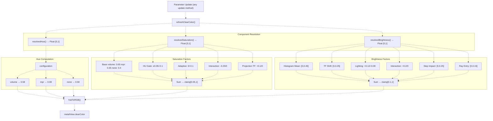

**Diagram: Clear Color HSB Calculation Pipeline**

The `refreshClearColor()` method is called whenever any rendering parameter changes. It computes hue, saturation, and brightness independently, converts to RGB, and updates `metalView.clearColor`.

**Sources:** [Sources/MTKUI/VolumetricSceneController L222-L228](https://github.com/ThalesMMS/MTK/blob/eda6f990/Sources/MTKUI/VolumetricSceneController+MPS.swift#L222-L228)

### Hue Calculation

The hue value (0-1 range) determines the base color and varies by display configuration:

* **Volume mode**: 0.58 (blue-cyan range)
* **MPR mode**: 0.08 (orange-yellow range)
* **None**: 0.58 (default to volume hue)

**Sources:** [Sources/MTKUI/VolumetricSceneController L230-L243](https://github.com/ThalesMMS/MTK/blob/eda6f990/Sources/MTKUI/VolumetricSceneController+MPS.swift#L230-L243)

### Saturation Calculation

The saturation calculation combines multiple factors that adjust the color intensity:

```
base + gateAdjustment + adaptiveAdjustment + interactionAdjustment + projectionAdjustment
```

**Base Saturation:**

* Volume: 0.65
* MPR: 0.35
* None: 0.4

**Adjustments:**

* HU Gate enabled: +0.05, disabled: -0.1
* Adaptive sampling enabled: 0, disabled: -0.1
* Interaction active: -0.25, inactive: 0
* Projection transfer function: +0.1, disabled: 0

Final saturation is clamped to [0.05, 1.0].

**Sources:** [Sources/MTKUI/VolumetricSceneController L245-L263](https://github.com/ThalesMMS/MTK/blob/eda6f990/Sources/MTKUI/VolumetricSceneController+MPS.swift#L245-L263)

### Brightness Calculation

The brightness calculation is the most complex component, incorporating multiple data-driven and state-driven factors:

```
base + lighting + adaptive + stepImpact + rayContribution
```

**Base Brightness:**

```
0.35 + (histogramMean * 0.45) + (tfShift * 0.25)
```

The histogram mean is normalized to [0,1] based on the intensity distribution, and the transfer function shift (normalized from HU range to [0,1]) adjusts for windowing offset.

**Contributions:**

* Lighting enabled: +0.12, disabled: -0.08
* Interaction active: +0.2, inactive: 0
* Step impact: `1 - (adaptiveSamplingStep / samplingStep)`, clamped to [0, 0.25]
* Ray entry: Average entry distance normalized by sampling step, clamped to [0, 0.15]

Final brightness is clamped to [0.1, 1.0].

**Sources:** [Sources/MTKUI/VolumetricSceneController L265-L278](https://github.com/ThalesMMS/MTK/blob/eda6f990/Sources/MTKUI/VolumetricSceneController+MPS.swift#L265-L278)

### Histogram Mean Calculation

The `histogramMean()` method computes a weighted average of the intensity distribution:

```
weighted = Σ(binCenter * binCount)
mean = weighted / totalCount
normalized = (mean - minIntensity) / range
```

This provides a data-driven brightness adjustment that reflects the overall intensity characteristics of the current dataset.

**Sources:** [Sources/MTKUI/VolumetricSceneController L288-L303](https://github.com/ThalesMMS/MTK/blob/eda6f990/Sources/MTKUI/VolumetricSceneController+MPS.swift#L288-L303)

### Ray Entry Distance

The `averageRayEntry()` method calculates the average distance rays travel before entering the volume bounding box:

```
average = Σ(entryDistance) / rayCount
normalized = (average / samplingStep) * 0.5
```

This provides feedback about camera-volume distance, with farther cameras producing lower values.

**Sources:** [Sources/MTKUI/VolumetricSceneController L280-L286](https://github.com/ThalesMMS/MTK/blob/eda6f990/Sources/MTKUI/VolumetricSceneController+MPS.swift#L280-L286)

### HSB to RGB Conversion

The `hsbToRGB(hue:saturation:brightness:)` method implements standard HSB-to-RGB conversion:

```xml
h = (hue - floor(hue)) * 6  // Normalize to <FileRef file-url="https://github.com/ThalesMMS/MTK/blob/eda6f990/0,6)\nc = brightness * saturation\nx = c * (1 - |h mod 2 - 1|)\nm = brightness - c\n```\n\nThe hue value is divided into six sectors, each producing different (r',g',b') primary values. The final RGB components are `(r'+m, g'+m, b'+m)`.\n\n**Sources#LNaN-LNaN" NaN  file-path="0,6)\nc = brightness * saturation\nx = c * (1 - |h mod 2 - 1|)\nm = brightness - c\n```\n\nThe hue value is divided into six sectors, each producing different (r',g',b') primary values. The final RGB components are `(r'+m, g'+m, b'+m)`.\n\n**Sources">Hii</FileRef>

---

---

## Integration with VolumetricSceneController

The MPS backend integrates with `VolumetricSceneController` through several pathways:

### Histogram Integration

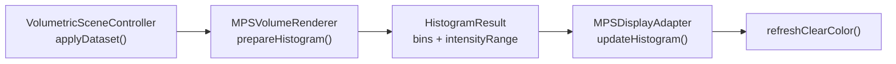

**Diagram: Histogram Integration Flow**

When a dataset is applied, the controller calls `MPSVolumeRenderer.prepareHistogram()` and passes the result to `MPSDisplayAdapter.updateHistogram()`, which uses the histogram mean to adjust clear color brightness.

**Sources:** [Sources/MTKUI/VolumetricSceneController.swift L211-L370](https://github.com/ThalesMMS/MTK/blob/eda6f990/Sources/MTKUI/VolumetricSceneController.swift#L211-L370)

### Ray Casting Integration

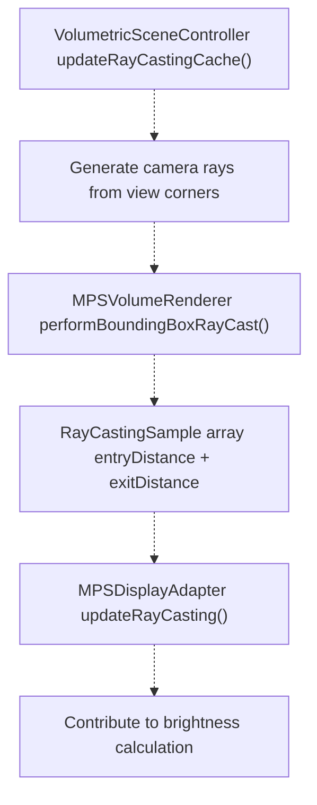

**Diagram: Ray Casting Integration Flow**

The controller generates camera rays corresponding to viewport corners, performs bounding box intersection using `MPSVolumeRenderer`, and passes the results to the adapter. Entry distances contribute to clear color brightness, providing visual feedback about camera-volume distance.

**Sources:** [Sources/MTKUI/VolumetricSceneController L414-L450](https://github.com/ThalesMMS/MTK/blob/eda6f990/Sources/MTKUI/VolumetricSceneController+Camera.swift#L414-L450)

### Gaussian Filter Integration

When MPS resources are prepared, the controller calls `MPSVolumeRenderer.applyGaussianFilter()` to smooth the volume. The filtered texture is then used to update volume materials:

```
let filtered = try mpsRenderer?.applyGaussianFilter(dataset: dataset, sigma: 1.5)volumeMaterial.volumeTexture = filteredmprMaterial.volumeTexture = filtered
```

This provides smoother visualization while maintaining the original dataset for analysis operations.

**Sources:** [Sources/MTKUI/VolumetricSceneController L390-L413](https://github.com/ThalesMMS/MTK/blob/eda6f990/Sources/MTKUI/VolumetricSceneController+Camera.swift#L390-L413)

---

## Testing Interface

The `MPSDisplayAdapter` exposes `@_spi(Testing)` methods for verification:

| Method | Return Type | Purpose |
| --- | --- | --- |
| `debugTransferFunction()` | `TransferFunction?` | Inspect current transfer function |
| `debugClearColor()` | `MTLClearColor` | Inspect current clear color |
| `debugResolvedBrightness()` | `Float` | Inspect calculated brightness value |

**Sources:** [Sources/MTKUI/VolumetricSceneController L207-L220](https://github.com/ThalesMMS/MTK/blob/eda6f990/Sources/MTKUI/VolumetricSceneController+MPS.swift#L207-L220)

---

## Conditional Compilation

The entire MPS backend is conditionally compiled only when Metal Performance Shaders and MetalKit are available:

```
#if canImport(MetalPerformanceShaders) && canImport(MetalKit)
// MPSDisplayAdapter implementation
#endif
```

This ensures the code compiles on platforms without MPS support, falling back to the SceneKit backend automatically through the `BackendResolver` system (see [Backend Resolution](9a%20Backend-Resolution-&-Metal-Detection.md)).

**Sources:** [Sources/MTKUI/VolumetricSceneController L18-L24](https://github.com/ThalesMMS/MTK/blob/eda6f990/Sources/MTKUI/VolumetricSceneController+MPS.swift#L18-L24)

 [Sources/MTKUI/VolumetricSceneController L332-L334](https://github.com/ThalesMMS/MTK/blob/eda6f990/Sources/MTKUI/VolumetricSceneController+MPS.swift#L332-L334)

```

```


### On this page

* [Metal Performance Shaders Backend](#2.2-metal-performance-shaders-backend)
* [Purpose and Scope](#2.2-purpose-and-scope)
* [Architecture Overview](#2.2-architecture-overview)
* [MPSVolumeRenderer Implementation](#2.2-mpsvolumerenderer-implementation)
* [Class Structure and Initialization](#2.2-class-structure-and-initialization)
* [Data Structures](#2.2-data-structures)
* [Error Types](#2.2-error-types)
* [Histogram Calculation](#2.2-histogram-calculation)
* [Dispatch Strategy](#2.2-dispatch-strategy)
* [GPU Histogram Implementation](#2.2-gpu-histogram-implementation)
* [CPU Histogram Implementation](#2.2-cpu-histogram-implementation)
* [Gaussian Filtering](#2.2-gaussian-filtering)
* [Processing Pipeline](#2.2-processing-pipeline)
* [Format Conversion Requirements](#2.2-format-conversion-requirements)
* [Texture Conversion Process](#2.2-texture-conversion-process)
* [Slice Reassembly](#2.2-slice-reassembly)
* [Bounding Box Ray Casting](#2.2-bounding-box-ray-casting)
* [Ray-Box Intersection Algorithm](#2.2-ray-box-intersection-algorithm)
* [Bounding Box Construction](#2.2-bounding-box-construction)
* [Slab Test Implementation](#2.2-slab-test-implementation)
* [Entry Distance Clamping](#2.2-entry-distance-clamping)
* [MPSDisplayAdapter Implementation](#2.2-mpsdisplayadapter-implementation)
* [Metal Performance Shaders Backend](#2.2-metal-performance-shaders-backend-1)
* [Purpose and Scope](#2.2-purpose-and-scope-1)
* [Architecture Overview](#2.2-architecture-overview-1)
* [MPSVolumeRenderer Implementation](#2.2-mpsvolumerenderer-implementation-1)
* [Class Structure and Initialization](#2.2-class-structure-and-initialization-1)
* [Data Structures](#2.2-data-structures-1)
* [Error Types](#2.2-error-types-1)
* [Histogram Calculation](#2.2-histogram-calculation-1)
* [Dispatch Strategy](#2.2-dispatch-strategy-1)
* [GPU Histogram Implementation](#2.2-gpu-histogram-implementation-1)
* [CPU Histogram Implementation](#2.2-cpu-histogram-implementation-1)
* [Gaussian Filtering](#2.2-gaussian-filtering-1)
* [Processing Pipeline](#2.2-processing-pipeline-1)
* [Format Conversion Requirements](#2.2-format-conversion-requirements-1)
* [Texture Conversion Process](#2.2-texture-conversion-process-1)
* [Slice Reassembly](#2.2-slice-reassembly-1)
* [Bounding Box Ray Casting](#2.2-bounding-box-ray-casting-1)
* [Ray-Box Intersection Algorithm](#2.2-ray-box-intersection-algorithm-1)
* [Bounding Box Construction](#2.2-bounding-box-construction-1)
* [Slab Test Implementation](#2.2-slab-test-implementation-1)
* [Entry Distance Clamping](#2.2-entry-distance-clamping-1)
* [MPSDisplayAdapter Implementation](#2.2-mpsdisplayadapter-implementation-1)
* [Class Definition and Initialization](#2.2-class-definition-and-initialization)
* [MPSDisplayAdapter Declaration](#2.2-mpsdisplayadapter-declaration)
* [RenderSurface Protocol](#2.2-rendersurface-protocol)
* [MTKViewDelegate](#2.2-mtkviewdelegate)
* [State Management](#2.2-state-management)
* [Clear Color Feedback System](#2.2-clear-color-feedback-system)
* [Calculation Pipeline](#2.2-calculation-pipeline)
* [Hue Calculation](#2.2-hue-calculation)
* [Saturation Calculation](#2.2-saturation-calculation)
* [Brightness Calculation](#2.2-brightness-calculation)
* [Histogram Mean Calculation](#2.2-histogram-mean-calculation)
* [Ray Entry Distance](#2.2-ray-entry-distance)
* [HSB to RGB Conversion](#2.2-hsb-to-rgb-conversion)
* [Ray Casting Integration](#2.2-ray-casting-integration)
* [Gaussian Filter Integration](#2.2-gaussian-filter-integration)
* [Testing Interface](#2.2-testing-interface)
* [Conditional Compilation](#2.2-conditional-compilation)

Ask Devin about MTK