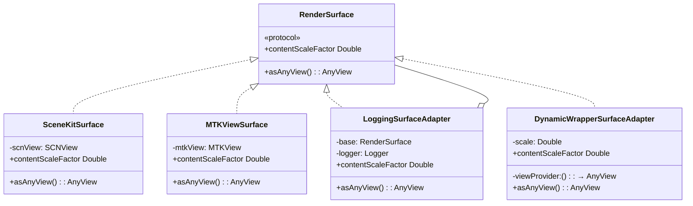
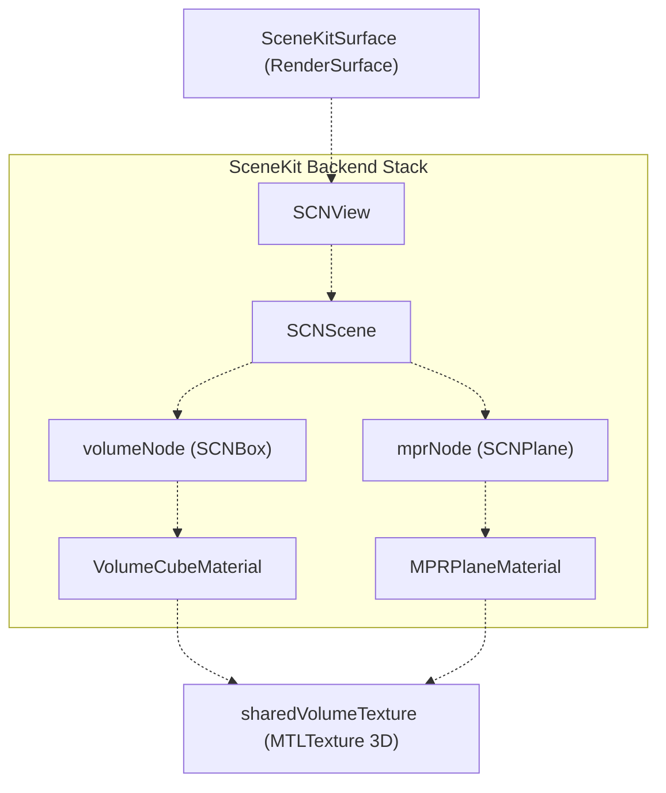
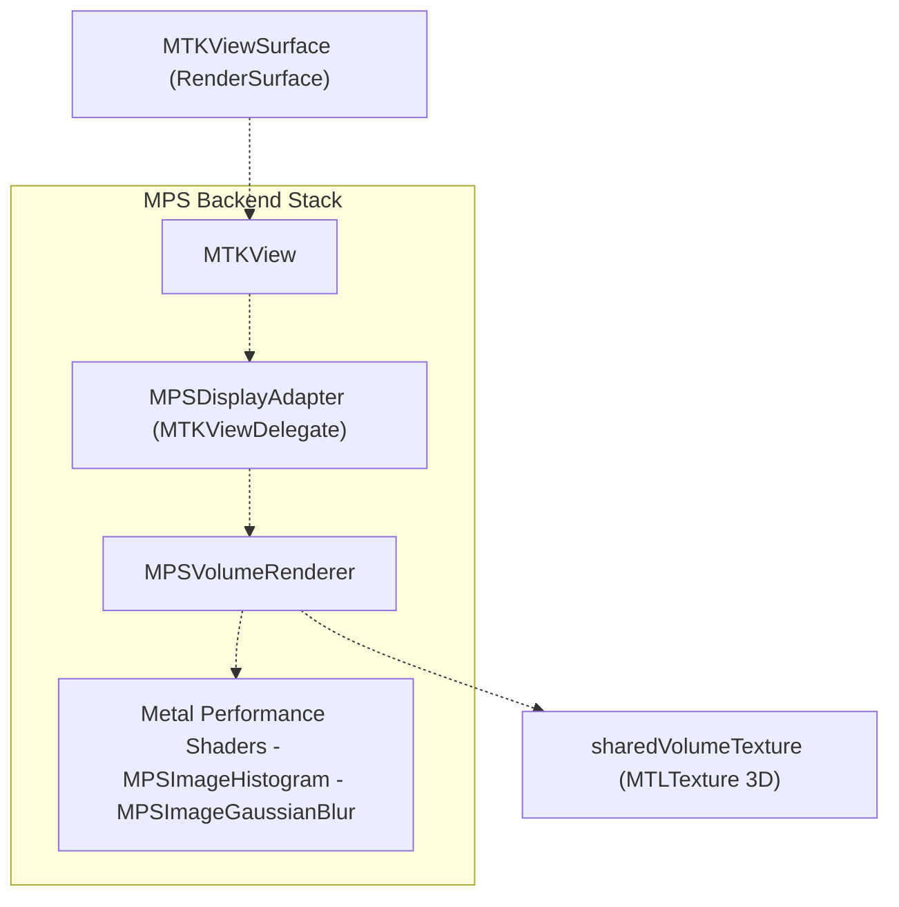
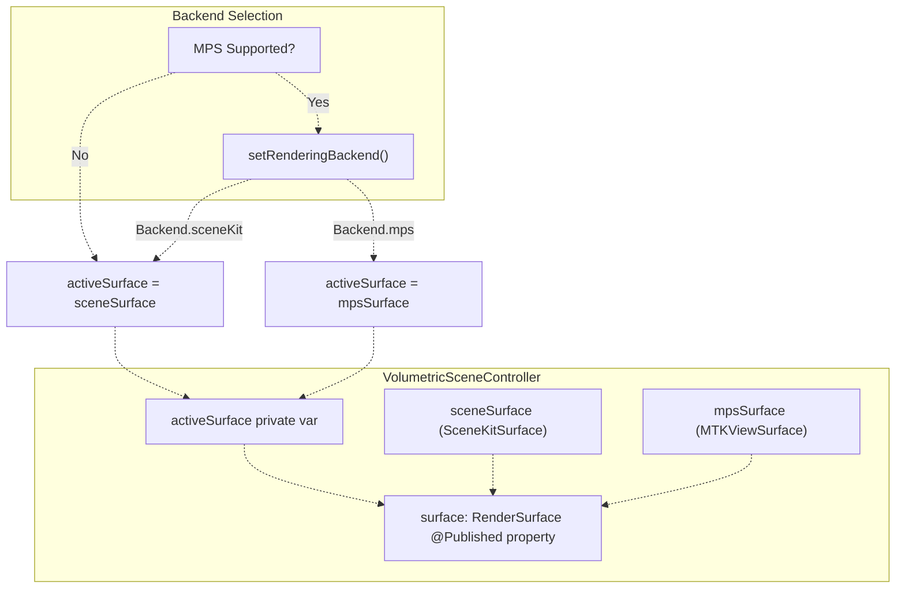
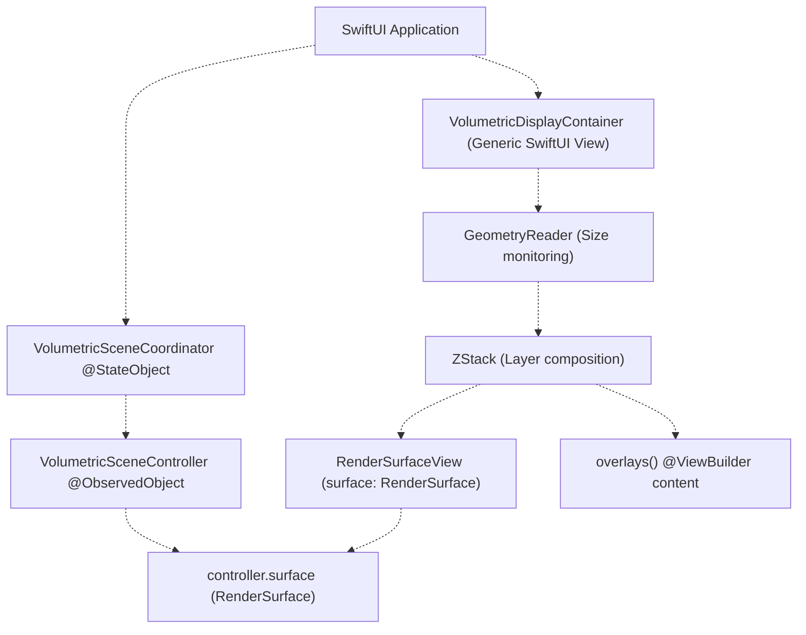
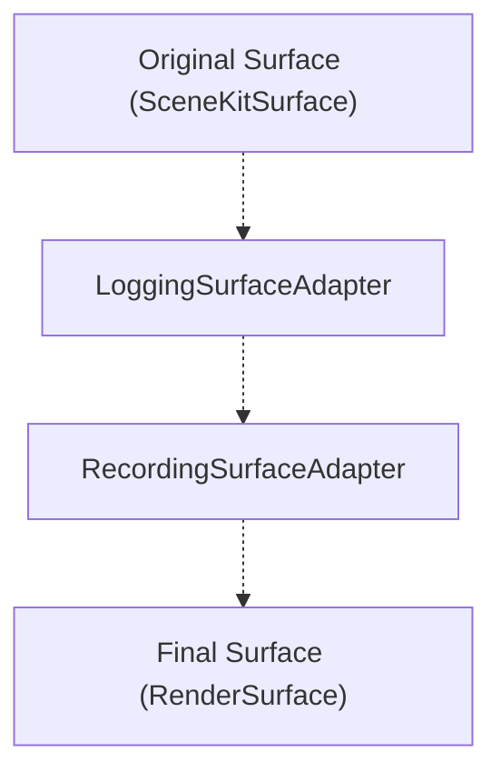
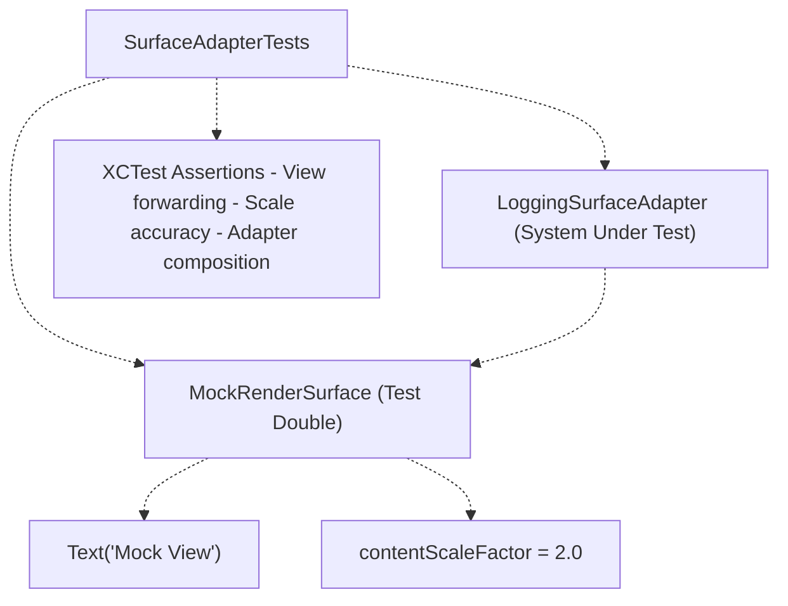
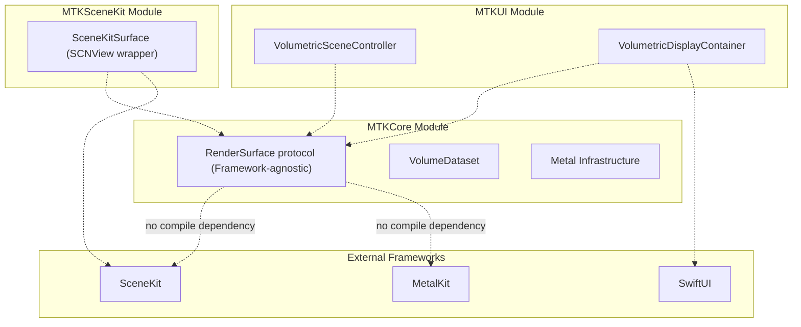

# RenderSurface Abstraction

> **Relevant source files**
> * [BACKEND_RESOLVER_USAGE.md](https://github.com/ThalesMMS/MTK/blob/eda6f990/BACKEND_RESOLVER_USAGE.md)
> * [DOCUMENTATION_STANDARD.md](https://github.com/ThalesMMS/MTK/blob/eda6f990/DOCUMENTATION_STANDARD.md)
> * [README.md](https://github.com/ThalesMMS/MTK/blob/eda6f990/README.md)
> * [SURFACE_ADAPTER_DELIVERABLES.txt](https://github.com/ThalesMMS/MTK/blob/eda6f990/SURFACE_ADAPTER_DELIVERABLES.txt)
> * [Sources/MTKUI/VolumetricDisplayContainer.swift](https://github.com/ThalesMMS/MTK/blob/eda6f990/Sources/MTKUI/VolumetricDisplayContainer.swift)

## Purpose and Scope

The `RenderSurface` protocol decouples MTK's rendering infrastructure from specific UI framework implementations. This abstraction enables `VolumetricSceneController` to expose a unified rendering surface regardless of whether the active backend uses SceneKit's `SCNView` or Metal Performance Shaders with `MTKView`. The protocol allows SwiftUI views, adapter layers, and testing mocks to interact with rendering surfaces through a consistent interface without compile-time dependencies on specific view types.

For information about the dual rendering backends that implement this protocol, see [Rendering Architecture](2%20Rendering-Architecture.md). For details on how SwiftUI integrates with RenderSurface, see [VolumetricDisplayContainer](6a%20VolumetricDisplayContainer.md).

**Sources**: [SURFACE_ADAPTER_DELIVERABLES.txt L1-L14](https://github.com/ThalesMMS/MTK/blob/eda6f990/SURFACE_ADAPTER_DELIVERABLES.txt#L1-L14)

---

## Protocol Definition

The `RenderSurface` protocol defines the minimal contract required for MTK to display volumetric content. It abstracts the underlying view implementation while providing access to essential rendering properties.



**Protocol Requirements**:

| Requirement | Type | Purpose |
| --- | --- | --- |
| `asAnyView()` | `() -> AnyView` | Returns type-erased SwiftUI view for display |
| `contentScaleFactor` | `Double` | Reports pixel density for rendering quality adjustments |

The `asAnyView()` method enables SwiftUI integration without exposing concrete view types. The `contentScaleFactor` property allows rendering systems to adapt resolution based on display characteristics (e.g., Retina displays report 2.0 or 3.0).

**Sources**: [SURFACE_ADAPTER_DELIVERABLES.txt L9](https://github.com/ThalesMMS/MTK/blob/eda6f990/SURFACE_ADAPTER_DELIVERABLES.txt#L9-L9)

 [Sources/MTKCore/Adapters/RenderSurface.swift](https://github.com/ThalesMMS/MTK/blob/eda6f990/Sources/MTKCore/Adapters/RenderSurface.swift)

---

## Built-in Surface Implementations

### SceneKitSurface

Wraps `SCNView` for the SceneKit rendering backend. This implementation is always available on Metal-capable devices and serves as the universal fallback surface.

**Key Characteristics**:

* **View Type**: `SCNView` from SceneKit framework
* **Rendering Method**: Custom Metal shaders for ray marching ([volume_vertex](https://github.com/ThalesMMS/MTK/blob/eda6f990/volume_vertex) /[volume_fragment](https://github.com/ThalesMMS/MTK/blob/eda6f990/volume_fragment)  functions)
* **Scene Graph**: Uses `SCNScene` with `volumeNode` and `mprNode` geometries
* **Materials**: `VolumeCubeMaterial` and `MPRPlaneMaterial` attach to SceneKit nodes
* **Always Available**: No runtime capability checks required beyond Metal availability



**Sources**: [SURFACE_ADAPTER_DELIVERABLES.txt L14-L15](https://github.com/ThalesMMS/MTK/blob/eda6f990/SURFACE_ADAPTER_DELIVERABLES.txt#L14-L15)

 Diagram 2 (Dual Rendering Backend Architecture)

---

### MTKView-based Surface (MPS Backend)

Wraps `MTKView` for the Metal Performance Shaders rendering path. This implementation requires MPS capability checks and provides GPU-accelerated rendering with histogram analysis and Gaussian filtering.

**Key Characteristics**:

* **View Type**: `MTKView` from MetalKit framework
* **Rendering Method**: `MPSVolumeRenderer` with GPU-accelerated ray casting
* **Capability Check**: Requires `MPSSupportsMTLDevice(device)` to return `true`
* **Performance Features**: Histogram calculation, Gaussian blur, bounding box optimization
* **Adapter Class**: `MPSDisplayAdapter` nested within `VolumetricSceneController`



**Sources**: [SURFACE_ADAPTER_DELIVERABLES.txt L14-L15](https://github.com/ThalesMMS/MTK/blob/eda6f990/SURFACE_ADAPTER_DELIVERABLES.txt#L14-L15)

 Diagram 2 (Dual Rendering Backend Architecture), [VolumetricSceneController+MPS.swift](https://github.com/ThalesMMS/MTK/blob/eda6f990/VolumetricSceneController+MPS.swift)

---

## Integration with VolumetricSceneController

`VolumetricSceneController` maintains both surface implementations simultaneously and exposes only the active one through its `surface` property.



**Controller Properties**:

| Property | Type | Visibility | Purpose |
| --- | --- | --- | --- |
| `surface` | `RenderSurface` | `@Published` | Public interface for SwiftUI binding |
| `activeSurface` | `RenderSurface` | `private` | Internal pointer to active backend |
| `sceneSurface` | `SceneKitSurface` | `private` | SceneKit backend implementation |
| `mpsSurface` | `MTKViewSurface` | `private` | MPS backend implementation |

**Backend Switching Flow**:

1. Application calls `setRenderingBackend(.sceneKit)` or `setRenderingBackend(.mps)`
2. Controller validates backend availability (MPS requires capability check)
3. Controller updates `activeSurface` to point to requested backend
4. Published `surface` property triggers SwiftUI view update
5. `VolumetricDisplayContainer` re-renders with new surface

**Sources**: [VolumetricSceneController L414-L469](https://github.com/ThalesMMS/MTK/blob/eda6f990/VolumetricSceneController+Interaction.swift#L414-L469)

 Diagram 2 (Dual Rendering Backend Architecture)

---

## SwiftUI Integration via VolumetricDisplayContainer

`VolumetricDisplayContainer` is a generic SwiftUI view that renders any `RenderSurface` implementation. The view composition pattern separates rendering surface from UI overlays.



**VolumetricDisplayContainer Implementation Details**:

[Sources/MTKUI/VolumetricDisplayContainer.swift L11-L34](https://github.com/ThalesMMS/MTK/blob/eda6f990/Sources/MTKUI/VolumetricDisplayContainer.swift#L11-L34)

* **Generic Type Parameter**: `<Overlays: View>` allows custom overlay composition
* **Controller Observation**: `@ObservedObject` binding triggers re-render when `surface` publishes changes
* **GeometryReader**: Provides viewport size for logging and future size-dependent logic
* **ZStack Composition**: Layers `RenderSurfaceView` beneath custom overlays
* **Accessibility**: Surface tagged with identifier `"VolumetricRenderSurface"`
* **Size Validation**: Logs warnings for degenerate dimensions (width/height ≤ 1 point)

**Convenience Initializer**:

[Sources/MTKUI/VolumetricDisplayContainer.swift L36-L40](https://github.com/ThalesMMS/MTK/blob/eda6f990/Sources/MTKUI/VolumetricDisplayContainer.swift#L36-L40)

For use cases without overlays, the extension provides an initializer that defaults to `EmptyView`:

```
VolumetricDisplayContainer(controller: coordinator.controller)
```

**Sources**: [Sources/MTKUI/VolumetricDisplayContainer.swift L1-L53](https://github.com/ThalesMMS/MTK/blob/eda6f990/Sources/MTKUI/VolumetricDisplayContainer.swift#L1-L53)

 README.md

---

## Adapter Pattern Examples

The codebase includes three adapter templates in `SurfaceAdapterExamples.swift` demonstrating extension patterns for `RenderSurface`.

### LoggingSurfaceAdapter

Wraps an existing `RenderSurface` and logs all property accesses for debugging.

**Use Cases**:

* Diagnosing view hierarchy issues in SwiftUI
* Tracking contentScaleFactor changes during device rotation
* Debugging surface replacement during backend switches

**Pattern**:

```
LoggingSurfaceAdapter → base: RenderSurface
                     ↓
                  Forwards all calls with logging
```

---

### DynamicWrapperSurfaceAdapter

Allows runtime construction of surfaces from closures without concrete type exposure.

**Use Cases**:

* Testing with mock views
* Dynamic surface generation based on runtime conditions
* Wrapping non-standard view hierarchies

**Pattern**:

```
DynamicWrapperSurfaceAdapter → viewProvider: () → AnyView
                             → scale: Double
                             ↓
                          Creates surface on-demand
```

---

### RecordingSurfaceAdapter

Captures frame updates and rendering events for analysis or testing.

**Use Cases**:

* Performance profiling
* Automated UI testing that verifies render cycles
* Recording user interactions for bug reports

**Pattern**:

```
RecordingSurfaceAdapter → base: RenderSurface
                        → recorder: EventRecorder
                        ↓
                     Logs events while forwarding calls
```

**Adapter Composition**:



Adapters compose through protocol conformance, enabling layered functionality without modifying original implementations.

**Sources**: [Sources/MTKCore/Adapters/SurfaceAdapterExamples.swift](https://github.com/ThalesMMS/MTK/blob/eda6f990/Sources/MTKCore/Adapters/SurfaceAdapterExamples.swift)

 [SURFACE_ADAPTER_DELIVERABLES.txt L10](https://github.com/ThalesMMS/MTK/blob/eda6f990/SURFACE_ADAPTER_DELIVERABLES.txt#L10-L10)

---

## Testing Strategy

The `RenderSurface` protocol enables comprehensive testing without requiring GPU resources or real view hierarchies.

### Mock Surface Implementation



### Test Coverage Areas

| Test Category | Coverage | Location |
| --- | --- | --- |
| **Protocol Conformance** | Verify all implementations satisfy requirements | [Tests/MTKCoreTests/SurfaceAdapterTests.swift](https://github.com/ThalesMMS/MTK/blob/eda6f990/Tests/MTKCoreTests/SurfaceAdapterTests.swift) |
| **Adapter Forwarding** | Confirm adapters correctly delegate to base surface | [Tests/MTKCoreTests/SurfaceAdapterTests.swift](https://github.com/ThalesMMS/MTK/blob/eda6f990/Tests/MTKCoreTests/SurfaceAdapterTests.swift) |
| **ContentScale Handling** | Test scale factor accuracy across implementations | [Tests/MTKCoreTests/SurfaceAdapterTests.swift](https://github.com/ThalesMMS/MTK/blob/eda6f990/Tests/MTKCoreTests/SurfaceAdapterTests.swift) |
| **View Type Erasure** | Verify `asAnyView()` produces valid SwiftUI views | [Tests/MTKCoreTests/SurfaceAdapterTests.swift](https://github.com/ThalesMMS/MTK/blob/eda6f990/Tests/MTKCoreTests/SurfaceAdapterTests.swift) |
| **Adapter Composition** | Test multiple adapters wrapping same base surface | [Tests/MTKCoreTests/SurfaceAdapterTests.swift](https://github.com/ThalesMMS/MTK/blob/eda6f990/Tests/MTKCoreTests/SurfaceAdapterTests.swift) |

**Testing Without GPU**:

The protocol abstraction allows tests to run on CI environments without Metal devices:

* Mock surfaces return synthetic views (`Text("Mock")`)
* No actual rendering occurs during protocol conformance tests
* Adapter logic validated independently of GPU state

**Sources**: [Tests/MTKCoreTests/SurfaceAdapterTests.swift](https://github.com/ThalesMMS/MTK/blob/eda6f990/Tests/MTKCoreTests/SurfaceAdapterTests.swift)

 [SURFACE_ADAPTER_DELIVERABLES.txt L11](https://github.com/ThalesMMS/MTK/blob/eda6f990/SURFACE_ADAPTER_DELIVERABLES.txt#L11-L11)

---

## Benefits of the Abstraction

### Framework Independence

The protocol ensures MTKCore has zero compile-time dependencies on specific view frameworks:



### Runtime Backend Switching

The unified interface enables dynamic backend changes without UI hierarchy reconstruction:

**Without RenderSurface**:

```
Backend change → Recreate entire view hierarchy → UI flicker + state loss
```

**With RenderSurface**:

```sql
Backend change → Update activeSurface pointer → SwiftUI re-renders seamlessly
```

### Testing and Mocking

Protocol-based design separates rendering logic from view implementation:

* Unit tests verify controller behavior with mock surfaces
* Integration tests validate adapter composition
* UI tests can inject recording surfaces for frame capture

**Sources**: [SURFACE_ADAPTER_DELIVERABLES.txt L1-L20](https://github.com/ThalesMMS/MTK/blob/eda6f990/SURFACE_ADAPTER_DELIVERABLES.txt#L1-L20)

 [README.md L1-L18](https://github.com/ThalesMMS/MTK/blob/eda6f990/README.md#L1-L18)


### On this page

* [RenderSurface Abstraction](#2.3-rendersurface-abstraction)
* [Purpose and Scope](#2.3-purpose-and-scope)
* [Protocol Definition](#2.3-protocol-definition)
* [Built-in Surface Implementations](#2.3-built-in-surface-implementations)
* [SceneKitSurface](#2.3-scenekitsurface)
* [MTKView-based Surface (MPS Backend)](#2.3-mtkview-based-surface-mps-backend)
* [Integration with VolumetricSceneController](#2.3-integration-with-volumetricscenecontroller)
* [SwiftUI Integration via VolumetricDisplayContainer](#2.3-swiftui-integration-via-volumetricdisplaycontainer)
* [Adapter Pattern Examples](#2.3-adapter-pattern-examples)
* [LoggingSurfaceAdapter](#2.3-loggingsurfaceadapter)
* [DynamicWrapperSurfaceAdapter](#2.3-dynamicwrappersurfaceadapter)
* [RecordingSurfaceAdapter](#2.3-recordingsurfaceadapter)
* [Testing Strategy](#2.3-testing-strategy)
* [Mock Surface Implementation](#2.3-mock-surface-implementation)
* [Test Coverage Areas](#2.3-test-coverage-areas)
* [Benefits of the Abstraction](#2.3-benefits-of-the-abstraction)
* [Framework Independence](#2.3-framework-independence)
* [Runtime Backend Switching](#2.3-runtime-backend-switching)
* [Testing and Mocking](#2.3-testing-and-mocking)

Ask Devin about MTK