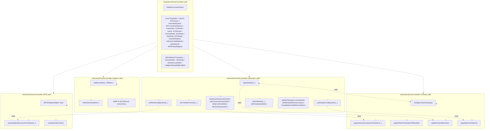
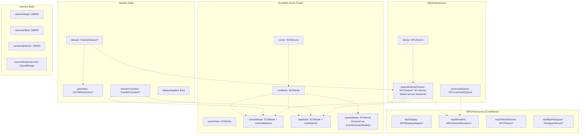
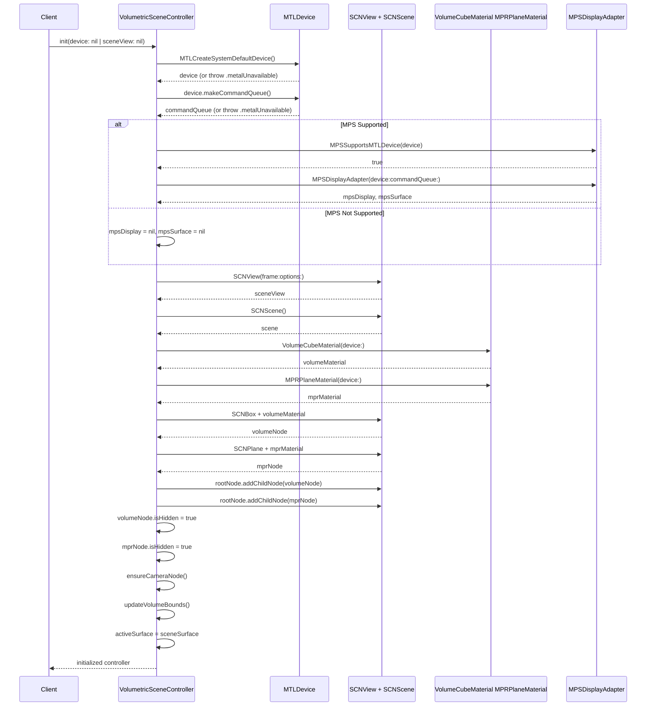
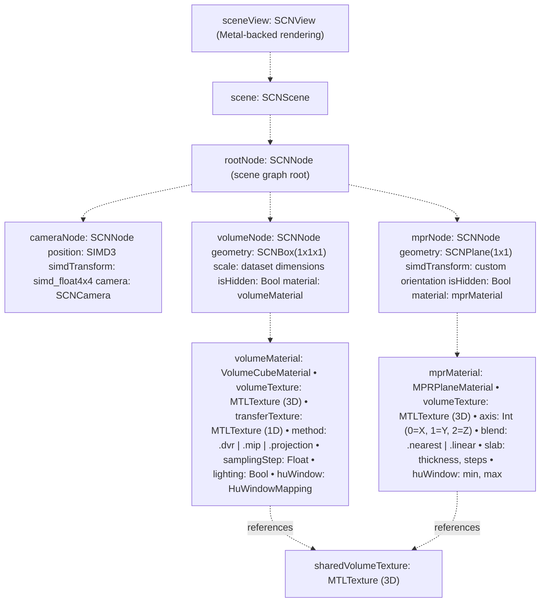

```mermaid
flowchart TD

Surface["surface: RenderSurface"]
TFDomain["transferFunctionDomain: ClosedRange?"]
DataMethods["Dataset Methods: • applyDataset(:) • setDisplayConfiguration(:) • metadata()"]
RenderMethods["Rendering Methods: • setTransferFunction(:) • setVolumeMethod(:) • setPreset(:) • setLighting(enabled:) • setSamplingStep(:) • setRenderingBackend(_:)"]
CameraMethods["Camera Methods: • rotateCamera(screenDelta:) • panCamera(screenDelta:) • dollyCamera(delta:) • tiltCamera(roll:pitch:) • resetCamera()"]
MPRMethods["MPR Methods: • setMprPlane(axis:normalized:) • setMprBlend(_:) • setMprSlab(thickness:steps:) • translate(axis:deltaNormalized:) • rotate(axis:radians:)"]
HUMethods["HU Window Methods: • setHuWindow(_:) • setHuGate(enabled:) • setProjectionHuGate(enabled:min:max:)"]
AdaptiveMethods["Adaptive Sampling Methods: • setAdaptiveSampling(_:) • beginAdaptiveSamplingInteraction() • endAdaptiveSamplingInteraction()"]
Controller["VolumetricSceneController"]

Controller -.->|"implements"| Surface
Controller -.->|"implements"| TFDomain
Controller -.->|"implements"| DataMethods
Controller -.-> RenderMethods
Controller -.->|"implements"| CameraMethods
Controller -.->|"implements"| MPRMethods
Controller -.-> HUMethods
Controller -.->|"implements"| AdaptiveMethods

subgraph Protocol ["VolumetricSceneControlling"]
    Surface
    TFDomain
    DataMethods
    RenderMethods
    CameraMethods
    MPRMethods
    HUMethods
    AdaptiveMethods
end
```

# VolumetricSceneController

> **Relevant source files**
> * [Sources/MTKUI/VolumetricSceneController+Interaction.swift](https://github.com/ThalesMMS/MTK/blob/eda6f990/Sources/MTKUI/VolumetricSceneController+Interaction.swift)
> * [Sources/MTKUI/VolumetricSceneController.swift](https://github.com/ThalesMMS/MTK/blob/eda6f990/Sources/MTKUI/VolumetricSceneController.swift)

**Purpose**: This document describes `VolumetricSceneController`, the central orchestrator class in the MTKUI module that manages all aspects of volumetric rendering. It coordinates dataset loading, camera manipulation, rendering configuration, and backend switching between SceneKit and Metal Performance Shaders (MPS). The controller follows an extension-based architecture split across five files for maintainability while exposing a unified API to the presentation layer.

**Scope**: This page covers the controller's architecture, initialization lifecycle, core properties, and responsibilities. For detailed information about specific subsystems, see:

* Public interaction API methods: [Interaction API](3a%20Interaction-API.md)
* Camera transforms and constraints: [Camera Management](3b%20Camera-Management.md)
* MPR plane computation: [Multi-Planar Reconstruction](3c%20Multi-Planar-Reconstruction-%28MPR%29.md)
* Combine-based reactive state: [State Management & Reactivity](3d%20State-Management-&-Reactivity.md)
* MPS backend coordination: [MPS Display Adapter](3e%20MPS-Display-Adapter.md)
* Mathematical utilities: [Helper Utilities](3f%20Helper-Utilities.md)

---

## Architecture Overview

`VolumetricSceneController` is a `@MainActor` class conforming to `ObservableObject` for SwiftUI integration. It implements the `VolumetricSceneControlling` protocol, which defines 42+ public methods for external control. The class is split across five files to maintain readability while keeping related functionality cohesive:

| Extension File | Lines | Primary Responsibilities |
| --- | --- | --- |
| `VolumetricSceneController.swift` | 732 | Initialization, core properties, protocol conformance |
| `VolumetricSceneController+Interaction.swift` | 601 | Public API (42 methods), dataset/configuration application |
| `VolumetricSceneController+Camera.swift` | 520 | Camera transforms, orientation alignment, clipping planes |
| `VolumetricSceneController+MPS.swift` | 273 | MPS backend adapter, histogram-driven adjustments |
| `VolumetricSceneController+Helpers.swift` | ~200 | SIMD conversions, math utilities, SceneKit helpers |

**Design Rationale**: This modularity prevents individual files from exceeding verification script thresholds while maintaining logical grouping of functionality. All extensions operate on the same instance properties, ensuring unified state management.

**Sources**:

* [Sources/MTKUI/VolumetricSceneController.swift L1-L732](https://github.com/ThalesMMS/MTK/blob/eda6f990/Sources/MTKUI/VolumetricSceneController.swift#L1-L732)
* [Sources/MTKUI/VolumetricSceneController L1-L601](https://github.com/ThalesMMS/MTK/blob/eda6f990/Sources/MTKUI/VolumetricSceneController+Interaction.swift#L1-L601)

---

## Extension-Based Architecture Diagram



**Sources**:

* [Sources/MTKUI/VolumetricSceneController.swift L147-L437](https://github.com/ThalesMMS/MTK/blob/eda6f990/Sources/MTKUI/VolumetricSceneController.swift#L147-L437)
* [Sources/MTKUI/VolumetricSceneController L28-L599](https://github.com/ThalesMMS/MTK/blob/eda6f990/Sources/MTKUI/VolumetricSceneController+Interaction.swift#L28-L599)

---

## Core Properties and State

The controller maintains both **internal rendering state** and **published observable state** for reactive UI updates:

### Internal Rendering State



**Sources**:

* [Sources/MTKUI/VolumetricSceneController.swift L268-L330](https://github.com/ThalesMMS/MTK/blob/eda6f990/Sources/MTKUI/VolumetricSceneController.swift#L268-L330)

### Published Observable State

The controller exposes four `@Published` properties for SwiftUI observation via Combine:

| Property | Type | Purpose | Update Triggers |
| --- | --- | --- | --- |
| `cameraState` | `VolumetricCameraState` | Camera position, target, up vector | All camera manipulation methods |
| `sliceState` | `VolumetricSliceState` | Current MPR slice axis and normalized position | `setMprPlane()`, `translate()` |
| `windowLevelState` | `VolumetricWindowLevelState` | HU window width and level center | `setHuWindow()` |
| `adaptiveSamplingEnabled` | `Bool` | Adaptive sampling performance mode flag | `setAdaptiveSampling()`, gesture handlers |

These properties enable reactive UI updates without tight coupling between the controller and view layer. SwiftUI views observe these properties and automatically re-render when values change.

**Sources**:

* [Sources/MTKUI/VolumetricSceneController.swift L277-L280](https://github.com/ThalesMMS/MTK/blob/eda6f990/Sources/MTKUI/VolumetricSceneController.swift#L277-L280)
* [Sources/MTKUI/VolumetricSceneController.swift L91-L134](https://github.com/ThalesMMS/MTK/blob/eda6f990/Sources/MTKUI/VolumetricSceneController.swift#L91-L134)

---

## Initialization Lifecycle

### Initialization Sequence Diagram



**Sources**:

* [Sources/MTKUI/VolumetricSceneController.swift L332-L436](https://github.com/ThalesMMS/MTK/blob/eda6f990/Sources/MTKUI/VolumetricSceneController.swift#L332-L436)

### Initialization Code Path

The initializer follows a strict sequence to ensure consistent state:

1. **Metal Device Resolution** [Sources/MTKUI/VolumetricSceneController.swift L334-L346](https://github.com/ThalesMMS/MTK/blob/eda6f990/Sources/MTKUI/VolumetricSceneController.swift#L334-L346) * Accepts optional device parameter, falls back to `MTLCreateSystemDefaultDevice()` * Throws `Error.metalUnavailable` if no device is available * Creates command queue or throws
2. **MPS Backend Initialization** (Conditional) [Sources/MTKUI/VolumetricSceneController.swift L347-L356](https://github.com/ThalesMMS/MTK/blob/eda6f990/Sources/MTKUI/VolumetricSceneController.swift#L347-L356) * Checks `MPSSupportsMTLDevice(device)` for MPS capability * Creates `MPSDisplayAdapter` if supported, otherwise sets to `nil` * This enables graceful degradation on unsupported devices
3. **SceneKit Setup** [Sources/MTKUI/VolumetricSceneController.swift L358-L388](https://github.com/ThalesMMS/MTK/blob/eda6f990/Sources/MTKUI/VolumetricSceneController.swift#L358-L388) * Creates `SCNView` with Metal rendering API preference * Configures continuous rendering at 60 FPS * Disables default camera controls (controller manages camera programmatically)
4. **Material and Node Creation** [Sources/MTKUI/VolumetricSceneController.swift L390-L404](https://github.com/ThalesMMS/MTK/blob/eda6f990/Sources/MTKUI/VolumetricSceneController.swift#L390-L404) * Instantiates `VolumeCubeMaterial` and `MPRPlaneMaterial` with device * Creates `SCNBox` geometry for volume rendering * Creates `SCNPlane` geometry for MPR slicing * Adds nodes to scene graph, initially hidden
5. **Camera and State Initialization** [Sources/MTKUI/VolumetricSceneController.swift L408-L427](https://github.com/ThalesMMS/MTK/blob/eda6f990/Sources/MTKUI/VolumetricSceneController.swift#L408-L427) * Calls `ensureCameraNode()` to create or retrieve camera * Sets initial camera position at (0, 0, 2) * Records initial transform as `fallbackCameraTransform` * Initializes interactive camera state

**Sources**:

* [Sources/MTKUI/VolumetricSceneController.swift L332-L436](https://github.com/ThalesMMS/MTK/blob/eda6f990/Sources/MTKUI/VolumetricSceneController.swift#L332-L436)

---

## Backend Management

The controller supports **dual rendering backends** that can be switched at runtime without data loss:

### Backend Architecture

```

```

**Sources**:

* [Sources/MTKUI/VolumetricSceneController.swift L253-L265](https://github.com/ThalesMMS/MTK/blob/eda6f990/Sources/MTKUI/VolumetricSceneController.swift#L253-L265)
* [Sources/MTKUI/VolumetricSceneController.swift L314-L327](https://github.com/ThalesMMS/MTK/blob/eda6f990/Sources/MTKUI/VolumetricSceneController.swift#L314-L327)

### Backend Switching Logic

The `setRenderingBackend(_:)` method [Sources/MTKUI/VolumetricSceneController L463-L519](https://github.com/ThalesMMS/MTK/blob/eda6f990/Sources/MTKUI/VolumetricSceneController+Interaction.swift#L463-L519)

 implements safe runtime backend switching:

**SceneKit Backend Activation** [Sources/MTKUI/VolumetricSceneController L521-L533](https://github.com/ThalesMMS/MTK/blob/eda6f990/Sources/MTKUI/VolumetricSceneController+Interaction.swift#L521-L533)

:

* Calls `mpsDisplay?.setActive(false)` to disable MPS rendering
* Sets `sceneView.isHidden = false` to show SceneKit view
* Updates `activeSurface = sceneSurface`
* Sets `renderingBackend = .sceneKit`
* Reapplies dataset to materials if `datasetApplied == true`
* Requests immediate frame render

**MPS Backend Activation** [Sources/MTKUI/VolumetricSceneController L474-L512](https://github.com/ThalesMMS/MTK/blob/eda6f990/Sources/MTKUI/VolumetricSceneController+Interaction.swift#L474-L512)

:

* Checks `MPSSupportsMTLDevice(device)` and `mpsDisplay != nil`
* Lazy-initializes `mpsRenderer` if `nil`
* Falls back to SceneKit if MPS initialization fails
* Sets `renderingBackend = .metalPerformanceShaders`
* Hides SceneKit view: `sceneView.isHidden = true`
* Updates `activeSurface = mpsSurface`
* Calls `mpsDisplay.setActive(true)`
* Synchronizes dataset, transfer function, display configuration
* Propagates histogram if available

**Shared Resource Pattern**: Both backends reference `sharedVolumeTexture`, ensuring consistent volume data. Only the rendering path differs—SceneKit uses custom fragment shaders for ray marching, while MPS uses GPU-accelerated kernels for histogram analysis and optimized ray casting.

**Sources**:

* [Sources/MTKUI/VolumetricSceneController L463-L533](https://github.com/ThalesMMS/MTK/blob/eda6f990/Sources/MTKUI/VolumetricSceneController+Interaction.swift#L463-L533)

---

## Scene Graph Structure

### SceneKit Hierarchy



**Sources**:

* [Sources/MTKUI/VolumetricSceneController.swift L259-L276](https://github.com/ThalesMMS/MTK/blob/eda6f990/Sources/MTKUI/VolumetricSceneController.swift#L259-L276)
* [Sources/MTKUI/VolumetricSceneController.swift L386-L404](https://github.com/ThalesMMS/MTK/blob/eda6f990/Sources/MTKUI/VolumetricSceneController.swift#L386-L404)

### Node Visibility Management

The controller toggles node visibility based on `DisplayConfiguration` [Sources/MTKUI/VolumetricSceneController L104-L122](https://github.com/ThalesMMS/MTK/blob/eda6f990/Sources/MTKUI/VolumetricSceneController+Interaction.swift#L104-L122)

:

| Configuration | `volumeNode.isHidden` | `mprNode.isHidden` |
| --- | --- | --- |
| `.volume(method:)` | `false` | `true` |
| `.mpr(axis:index:blend:slab:)` | `true` | `false` |

This ensures only one visualization mode is active at a time, preventing z-fighting and overdraw.

**Sources**:

* [Sources/MTKUI/VolumetricSceneController L104-L122](https://github.com/ThalesMMS/MTK/blob/eda6f990/Sources/MTKUI/VolumetricSceneController+Interaction.swift#L104-L122)

---

## Protocol Conformance

The controller implements two protocols:

### VolumetricSceneControlling Protocol

Defines the public API surface for external control [Sources/MTKUI/VolumetricSceneController.swift L148-L190](https://github.com/ThalesMMS/MTK/blob/eda6f990/Sources/MTKUI/VolumetricSceneController.swift#L148-L190)

:



**Sources**:

* [Sources/MTKUI/VolumetricSceneController.swift L148-L190](https://github.com/ThalesMMS/MTK/blob/eda6f990/Sources/MTKUI/VolumetricSceneController.swift#L148-L190)

### ObservableObject Protocol

Conforms to `ObservableObject` for SwiftUI integration [Sources/MTKUI/VolumetricSceneController.swift L193](https://github.com/ThalesMMS/MTK/blob/eda6f990/Sources/MTKUI/VolumetricSceneController.swift#L193-L193)

:

* Automatically synthesizes `objectWillChange` publisher
* `@Published` properties trigger publisher when modified
* SwiftUI views using `@ObservedObject` or `@StateObject` automatically re-render

**Sources**:

* [Sources/MTKUI/VolumetricSceneController.swift L193](https://github.com/ThalesMMS/MTK/blob/eda6f990/Sources/MTKUI/VolumetricSceneController.swift#L193-L193)

---

## Error Handling

The controller defines two error cases [Sources/MTKUI/VolumetricSceneController.swift L194-L197](https://github.com/ThalesMMS/MTK/blob/eda6f990/Sources/MTKUI/VolumetricSceneController.swift#L194-L197)

:

| Error | Thrown By | Condition |
| --- | --- | --- |
| `.metalUnavailable` | `init(device:sceneView:)` | No Metal device available or command queue creation fails |
| `.transferFunctionUnavailable` | `setTransferFunction(_:)` | Transfer function texture generation fails |

**Sources**:

* [Sources/MTKUI/VolumetricSceneController.swift L194-L197](https://github.com/ThalesMMS/MTK/blob/eda6f990/Sources/MTKUI/VolumetricSceneController.swift#L194-L197)

---

## Type Definitions

The controller defines several public types for configuration:

### Axis Enumeration

```
public enum Axis: Int {    case x = 0    case y = 1    case z = 2}
```

Used for MPR plane selection and rotation operations [Sources/MTKUI/VolumetricSceneController.swift L199-L203](https://github.com/ThalesMMS/MTK/blob/eda6f990/Sources/MTKUI/VolumetricSceneController.swift#L199-L203)

### SlabConfiguration

```
public struct SlabConfiguration: Equatable {    public var thickness: Int    public var steps: Int}
```

Configures MPR slab rendering with automatic odd-voxel-count normalization [Sources/MTKUI/VolumetricSceneController.swift L205-L228](https://github.com/ThalesMMS/MTK/blob/eda6f990/Sources/MTKUI/VolumetricSceneController.swift#L205-L228)

### DisplayConfiguration

```
public enum DisplayConfiguration: Equatable {    case volume(method: VolumeCubeMaterial.Method)    case mpr(axis: Axis, index: Int, blend: MPRPlaneMaterial.BlendMode, slab: SlabConfiguration?)}
```

Discriminated union defining the active visualization mode [Sources/MTKUI/VolumetricSceneController.swift L230-L233](https://github.com/ThalesMMS/MTK/blob/eda6f990/Sources/MTKUI/VolumetricSceneController.swift#L230-L233)

**Sources**:

* [Sources/MTKUI/VolumetricSceneController.swift L199-L233](https://github.com/ThalesMMS/MTK/blob/eda6f990/Sources/MTKUI/VolumetricSceneController.swift#L199-L233)

---

## Platform Compatibility

The controller includes conditional compilation for platform-specific features:

| Platform | Availability | Notes |
| --- | --- | --- |
| iOS | Full support | Gesture recognizers, UIKit integration |
| macOS | Full support | Default camera controls enabled as fallback |
| Other platforms | Stub implementation | Provides no-op methods for protocol conformance |

On unsupported platforms [Sources/MTKUI/VolumetricSceneController.swift L492-L731](https://github.com/ThalesMMS/MTK/blob/eda6f990/Sources/MTKUI/VolumetricSceneController.swift#L492-L731)

 the controller provides a `StubSurface` implementation and no-op methods that satisfy the protocol while doing no rendering work.

**Sources**:

* [Sources/MTKUI/VolumetricSceneController.swift L70-L491](https://github.com/ThalesMMS/MTK/blob/eda6f990/Sources/MTKUI/VolumetricSceneController.swift#L70-L491)
* [Sources/MTKUI/VolumetricSceneController.swift L492-L731](https://github.com/ThalesMMS/MTK/blob/eda6f990/Sources/MTKUI/VolumetricSceneController.swift#L492-L731)

---

## Key Design Patterns

### Extension-Based Modularity

Splitting the controller across five files prevents code bloat while maintaining cohesion. Each extension focuses on a distinct responsibility:

* **Interaction**: Public API surface
* **Camera**: Coordinate transforms
* **MPS**: Backend coordination
* **Helpers**: Reusable utilities

### Shared Resource Optimization

`sharedVolumeTexture` [Sources/MTKUI/VolumetricSceneController.swift L315](https://github.com/ThalesMMS/MTK/blob/eda6f990/Sources/MTKUI/VolumetricSceneController.swift#L315-L315)

 is referenced by both SceneKit materials and MPS renderer, eliminating redundant GPU memory usage. Only one copy of volume data exists, reducing memory footprint by ~50% when both backends are initialized.

### Reactive State Publication

The four `@Published` properties enable declarative UI without exposing internal state directly. Views observe specific state streams, minimizing re-render overhead compared to monolithic state objects.

### Graceful Degradation

MPS backend initialization is wrapped in capability checks [Sources/MTKUI/VolumetricSceneController.swift L347-L356](https://github.com/ThalesMMS/MTK/blob/eda6f990/Sources/MTKUI/VolumetricSceneController.swift#L347-L356)

 ensuring the controller always provides a functional SceneKit backend even on devices without MPS support.

**Sources**:

* [Sources/MTKUI/VolumetricSceneController.swift L147-L491](https://github.com/ThalesMMS/MTK/blob/eda6f990/Sources/MTKUI/VolumetricSceneController.swift#L147-L491)

---

## Testing Considerations

The controller exposes several `@_spi(Testing)` methods for internal verification [Sources/MTKUI/VolumetricSceneController.swift L440-L490](https://github.com/ThalesMMS/MTK/blob/eda6f990/Sources/MTKUI/VolumetricSceneController.swift#L440-L490)

:

| Method | Returns | Purpose |
| --- | --- | --- |
| `debugVolumeTexture()` | `MTLTexture?` | Access current volume texture for validation |
| `debugMpsFilteredTexture()` | `MTLTexture?` | Access MPS Gaussian-filtered texture |
| `debugLastRayCastingSamples()` | `[RayCastingSample]` | Inspect MPS ray casting cache |
| `debugMpsDisplayBrightness()` | `Float?` | Verify histogram-driven brightness adjustments |
| `debugMpsClearColor()` | `(Float, Float, Float)` | Check dynamic clear color calculation |

These methods are marked `@_spi(Testing)` to prevent accidental usage in production code while enabling comprehensive unit tests.

**Sources**:

* [Sources/MTKUI/VolumetricSceneController.swift L440-L490](https://github.com/ThalesMMS/MTK/blob/eda6f990/Sources/MTKUI/VolumetricSceneController.swift#L440-L490)


### On this page

* [VolumetricSceneController](3%20VolumetricSceneController.md)
* [Architecture Overview](3%20VolumetricSceneController.md)
* [Extension-Based Architecture Diagram](3%20VolumetricSceneController.md)
* [Core Properties and State](3%20VolumetricSceneController.md)
* [Internal Rendering State](3%20VolumetricSceneController.md)
* [Published Observable State](3%20VolumetricSceneController.md)
* [Initialization Lifecycle](3%20VolumetricSceneController.md)
* [Initialization Sequence Diagram](3%20VolumetricSceneController.md)
* [Initialization Code Path](3%20VolumetricSceneController.md)
* [Backend Management](3%20VolumetricSceneController.md)
* [Backend Architecture](3%20VolumetricSceneController.md)
* [Backend Switching Logic](3%20VolumetricSceneController.md)
* [Scene Graph Structure](3%20VolumetricSceneController.md)
* [SceneKit Hierarchy](3%20VolumetricSceneController.md)
* [Node Visibility Management](3%20VolumetricSceneController.md)
* [Protocol Conformance](3%20VolumetricSceneController.md)
* [VolumetricSceneControlling Protocol](3%20VolumetricSceneController.md)
* [ObservableObject Protocol](3%20VolumetricSceneController.md)
* [Error Handling](3%20VolumetricSceneController.md)
* [Type Definitions](3%20VolumetricSceneController.md)
* [Axis Enumeration](3%20VolumetricSceneController.md)
* [SlabConfiguration](3%20VolumetricSceneController.md)
* [DisplayConfiguration](3%20VolumetricSceneController.md)
* [Platform Compatibility](3%20VolumetricSceneController.md)
* [Key Design Patterns](3%20VolumetricSceneController.md)
* [Extension-Based Modularity](3%20VolumetricSceneController.md)
* [Shared Resource Optimization](3%20VolumetricSceneController.md)
* [Reactive State Publication](3%20VolumetricSceneController.md)
* [Graceful Degradation](3%20VolumetricSceneController.md)
* [Testing Considerations](3%20VolumetricSceneController.md)

Ask Devin about MTK