# Interaction API

> **Relevant source files**
> * [Sources/MTKUI/VolumetricSceneController+Interaction.swift](https://github.com/ThalesMMS/MTK/blob/eda6f990/Sources/MTKUI/VolumetricSceneController+Interaction.swift)

The Interaction API provides the complete public interface for controlling volumetric rendering through `VolumetricSceneController`. This extension-based module exposes approximately 40 methods organized into logical groups: dataset loading, display configuration, camera manipulation, rendering parameters, backend management, MPR plane control, and adaptive sampling. All methods are marked `@MainActor` and asynchronous to ensure thread-safe UI integration.

For camera implementation details and internal transform calculations, see [Camera Management](3b%20Camera-Management.md). For MPR-specific geometry and plane computation, see [Multi-Planar Reconstruction](3c%20Multi-Planar-Reconstruction-%28MPR%29.md). For the underlying state synchronization mechanism, see [State Management](3d%20State-Management-&-Reactivity.md).

---

## API Organization

The Interaction API is implemented as a Swift extension in a single file to achieve modular separation while maintaining cohesive functionality. The extension is structured around distinct operational domains.

```mermaid
flowchart TD

ResetView["resetView()"]
Extension["extension VolumetricSceneController"]
ApplyDataset["applyDataset(_:)"]
SetDisplay["setDisplayConfiguration(_:)"]
ResetCamera["resetCamera()"]
RotateCamera["rotateCamera(screenDelta:)"]
TiltCamera["tiltCamera(roll:pitch:)"]
PanCamera["panCamera(screenDelta:)"]
DollyCamera["dollyCamera(delta:)"]
SetTF["setTransferFunction(_:)"]
SetLighting["setLighting(enabled:)"]
SetSampling["setSamplingStep(_:)"]
SetMethod["setRenderMethod(_:)"]
SetPreset["setPreset(_:)"]
SetShift["setShift(_:)"]
SetBackend["setRenderingBackend(_:)"]
SetRenderMode["setRenderMode(_:)"]
SetMprPlane["setMprPlane(axis:normalized:)"]
SetMprBlend["setMprBlend(_:)"]
SetMprSlab["setMprSlab(thickness:steps:)"]
SetMprHuWindow["setMprHuWindow(min:max:)"]
Translate["translate(axis:deltaNormalized:)"]
Rotate["rotate(axis:radians:)"]
SetHuWindow["setHuWindow(_:)"]
SetHuGate["setHuGate(enabled:)"]
SetProjTF["setProjectionsUseTransferFunction(_:)"]
SetProjDensity["setProjectionDensityGate(floor:ceil:)"]
SetProjHu["setProjectionHuGate(enabled:min:max:)"]
SetAdaptive["setAdaptiveSampling(_:)"]
BeginInteraction["beginAdaptiveSamplingInteraction()"]
EndInteraction["endAdaptiveSamplingInteraction()"]
Metadata["metadata()"]

subgraph VolumetricSceneController+Interaction.swift ["VolumetricSceneController+Interaction.swift"]
    Extension
    Extension -.-> ApplyDataset
    Extension -.-> SetDisplay
    Extension -.-> ResetCamera
    Extension -.-> RotateCamera
    Extension -.-> TiltCamera
    Extension -.-> PanCamera
    Extension -.-> DollyCamera
    Extension -.-> SetTF
    Extension -.-> SetLighting
    Extension -.-> SetSampling
    Extension -.-> SetMethod
    Extension -.-> SetPreset
    Extension -.-> SetShift
    Extension -.-> SetBackend
    Extension -.-> SetRenderMode
    Extension -.-> SetMprPlane
    Extension -.-> SetMprBlend
    Extension -.-> SetMprSlab
    Extension -.-> SetMprHuWindow
    Extension -.-> Translate
    Extension -.-> Rotate
    Extension -.-> SetHuWindow
    Extension -.-> SetHuGate
    Extension -.-> SetProjTF
    Extension -.-> SetProjDensity
    Extension -.-> SetProjHu
    Extension -.-> SetAdaptive
    Extension -.-> BeginInteraction
    Extension -.-> EndInteraction
    Extension -.-> ResetView
    Extension -.-> Metadata

subgraph subGraph8 ["View & Query"]
    ResetView
    Metadata
end

subgraph subGraph7 ["Adaptive Sampling"]
    SetAdaptive
    BeginInteraction
    EndInteraction
end

subgraph subGraph6 ["Projection Controls"]
    SetProjTF
    SetProjDensity
    SetProjHu
end

subgraph subGraph5 ["HU Windowing"]
    SetHuWindow
    SetHuGate
end

subgraph subGraph4 ["MPR Controls"]
    SetMprPlane
    SetMprBlend
    SetMprSlab
    SetMprHuWindow
    Translate
    Rotate
end

subgraph subGraph3 ["Backend Management"]
    SetBackend
    SetRenderMode
end

subgraph subGraph2 ["Rendering Parameters"]
    SetTF
    SetLighting
    SetSampling
    SetMethod
    SetPreset
    SetShift
end

subgraph subGraph1 ["Camera Control"]
    ResetCamera
    RotateCamera
    TiltCamera
    PanCamera
    DollyCamera
end

subgraph subGraph0 ["Dataset & Display"]
    ApplyDataset
    SetDisplay
end
end
```

**Sources:** [Sources/MTKUI/VolumetricSceneController L1-L601](https://github.com/ThalesMMS/MTK/blob/eda6f990/Sources/MTKUI/VolumetricSceneController+Interaction.swift#L1-L601)

---

## Dataset and Display Configuration

These methods initialize the volumetric dataset and configure the rendering mode (volume vs. MPR).

### Dataset Application Flow

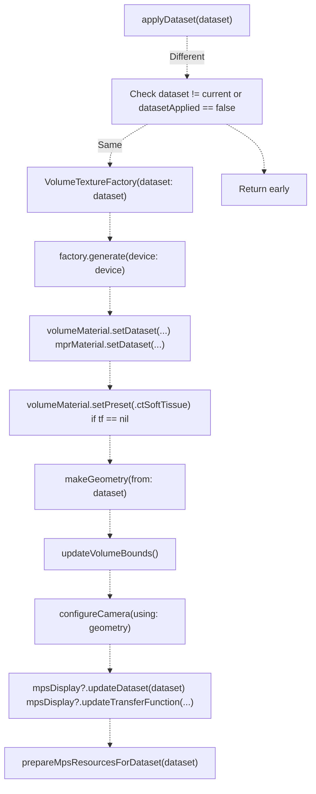

**Key Operations:**

| Step | Description | Code Reference |
| --- | --- | --- |
| Texture Generation | Creates 3D Metal texture from `VolumeDataset` | [Sources/MTKUI/VolumetricSceneController L38-L48](https://github.com/ThalesMMS/MTK/blob/eda6f990/Sources/MTKUI/VolumetricSceneController+Interaction.swift#L38-L48) |
| Material Binding | Binds dataset and texture to `VolumeCubeMaterial` and `MPRPlaneMaterial` | [Sources/MTKUI/VolumetricSceneController L42-L47](https://github.com/ThalesMMS/MTK/blob/eda6f990/Sources/MTKUI/VolumetricSceneController+Interaction.swift#L42-L47) |
| Default Transfer Function | Applies `.ctSoftTissue` preset on first load | [Sources/MTKUI/VolumetricSceneController L50-L54](https://github.com/ThalesMMS/MTK/blob/eda6f990/Sources/MTKUI/VolumetricSceneController+Interaction.swift#L50-L54) |
| Volume Scaling | Adjusts `volumeNode.scale` based on material scale | [Sources/MTKUI/VolumetricSceneController L56-L57](https://github.com/ThalesMMS/MTK/blob/eda6f990/Sources/MTKUI/VolumetricSceneController+Interaction.swift#L56-L57) |
| Geometry Calculation | Creates `VolumeGeometry` from dataset dimensions and spacing | [Sources/MTKUI/VolumetricSceneController L59](https://github.com/ThalesMMS/MTK/blob/eda6f990/Sources/MTKUI/VolumetricSceneController+Interaction.swift#L59-L59) |
| Camera Configuration | Positions camera based on volume bounds | [Sources/MTKUI/VolumetricSceneController L63-L67](https://github.com/ThalesMMS/MTK/blob/eda6f990/Sources/MTKUI/VolumetricSceneController+Interaction.swift#L63-L67) |
| MPS Synchronization | Updates MPS backend with dataset and transfer function | [Sources/MTKUI/VolumetricSceneController L78-L84](https://github.com/ThalesMMS/MTK/blob/eda6f990/Sources/MTKUI/VolumetricSceneController+Interaction.swift#L78-L84) |

**Sources:** [Sources/MTKUI/VolumetricSceneController L33-L88](https://github.com/ThalesMMS/MTK/blob/eda6f990/Sources/MTKUI/VolumetricSceneController+Interaction.swift#L33-L88)

### Display Configuration

The `setDisplayConfiguration(_:)` method switches between volume rendering and MPR modes.

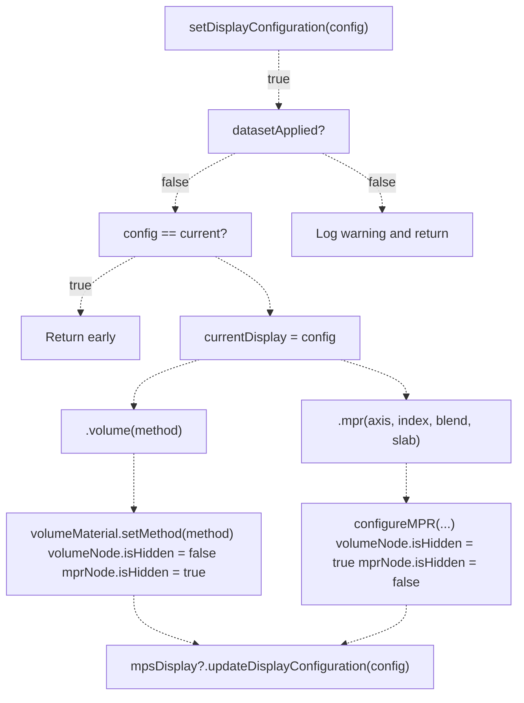

**Configuration Types:**

| Type | Parameters | Effect |
| --- | --- | --- |
| `.volume(method:)` | `VolumeCubeMaterial.Method` | Enables volume node, sets rendering method (DVR, MIP, MinIP, isosurface) |
| `.mpr(axis:index:blend:slab:)` | `Axis`, `Int`, `BlendMode`, `SlabConfiguration?` | Enables MPR node, configures plane position and rendering |

**Sources:** [Sources/MTKUI/VolumetricSceneController L90-L123](https://github.com/ThalesMMS/MTK/blob/eda6f990/Sources/MTKUI/VolumetricSceneController+Interaction.swift#L90-L123)

---

## Camera Control Methods

Camera control methods manipulate the view through interactive transformations. All camera methods operate on `cameraOffset`, `cameraTarget`, and `cameraUpVector` state, then call `applyInteractiveCameraTransform` to update the scene.

### Camera Control API Overview

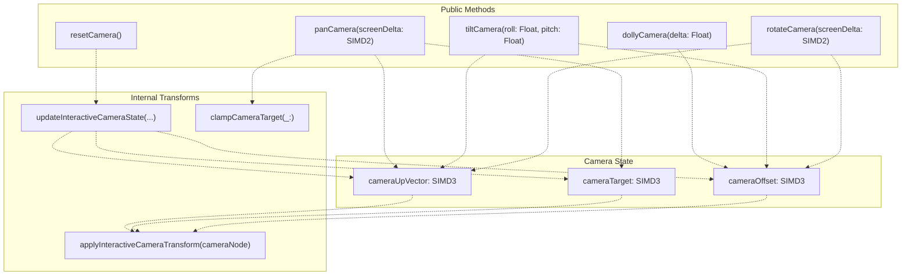

**Sources:** [Sources/MTKUI/VolumetricSceneController L145-L254](https://github.com/ThalesMMS/MTK/blob/eda6f990/Sources/MTKUI/VolumetricSceneController+Interaction.swift#L145-L254)

### Rotation Implementation

The `rotateCamera(screenDelta:)` method applies yaw and pitch rotations around the volume.

| Parameter | Axis | Implementation |
| --- | --- | --- |
| `screenDelta.x` | Yaw (horizontal) | Rotates around `patientLongitudinalAxis` (typically Y-axis) |
| `screenDelta.y` | Pitch (vertical) | Rotates around right vector (perpendicular to forward and up) |

**Rotation Algorithm:**

1. Convert screen delta to radians: `yaw = screenDelta.x * 0.01`, `pitch = screenDelta.y * 0.01`
2. Apply yaw rotation to `cameraOffset` and `cameraUpVector` using quaternion
3. Recompute forward and right vectors from updated offset
4. Apply pitch rotation around right axis
5. Update `cameraOffset` and `cameraUpVector` state
6. Call `applyInteractiveCameraTransform`

**Sources:** [Sources/MTKUI/VolumetricSceneController L165-L196](https://github.com/ThalesMMS/MTK/blob/eda6f990/Sources/MTKUI/VolumetricSceneController+Interaction.swift#L165-L196)

### Tilt Implementation

The `tiltCamera(roll:pitch:)` method provides additional camera roll control.

**Roll vs. Rotation Pitch:**

* **Roll**: Rotates camera around forward axis (line of sight)
* **Pitch**: Same as rotation pitch, but controlled separately for explicit tilt operations

**Sources:** [Sources/MTKUI/VolumetricSceneController L198-L224](https://github.com/ThalesMMS/MTK/blob/eda6f990/Sources/MTKUI/VolumetricSceneController+Interaction.swift#L198-L224)

### Pan Implementation

The `panCamera(screenDelta:)` method translates the camera target in screen space.

**Screen Space Scaling:**

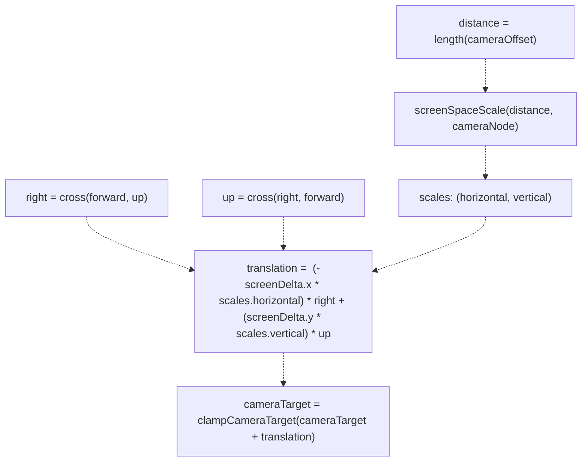

**Sources:** [Sources/MTKUI/VolumetricSceneController L226-L242](https://github.com/ThalesMMS/MTK/blob/eda6f990/Sources/MTKUI/VolumetricSceneController+Interaction.swift#L226-L242)

### Dolly Implementation

The `dollyCamera(delta:)` method moves the camera along the forward axis (zooming).

**Algorithm:**

1. Compute forward direction: `forward = normalize(-cameraOffset)`
2. Update offset: `cameraOffset -= forward * delta`
3. Apply transform to camera node

Positive delta moves camera closer, negative moves further away.

**Sources:** [Sources/MTKUI/VolumetricSceneController L244-L254](https://github.com/ThalesMMS/MTK/blob/eda6f990/Sources/MTKUI/VolumetricSceneController+Interaction.swift#L244-L254)

---

## Rendering Parameters

These methods control the visual appearance and quality of volumetric rendering.

### Transfer Function Management

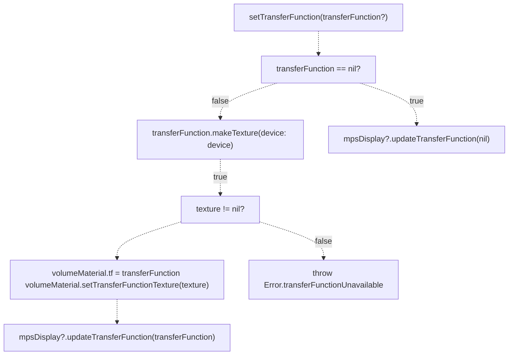

**Related Methods:**

| Method | Purpose | Target |
| --- | --- | --- |
| `setTransferFunction(_:)` | Sets custom transfer function | Both SceneKit and MPS |
| `setPreset(_:)` | Applies preset from library (e.g., `.ctSoftTissue`) | Both backends |
| `setShift(_:)` | Adjusts transfer function intensity shift | Both backends |
| `updateTransferFunctionShift(_:)` | Updates shift while preserving other TF properties | Both backends |

**Sources:** [Sources/MTKUI/VolumetricSceneController L256-L272](https://github.com/ThalesMMS/MTK/blob/eda6f990/Sources/MTKUI/VolumetricSceneController+Interaction.swift#L256-L272)

 [Sources/MTKUI/VolumetricSceneController L394-L430](https://github.com/ThalesMMS/MTK/blob/eda6f990/Sources/MTKUI/VolumetricSceneController+Interaction.swift#L394-L430)

### Lighting and Sampling

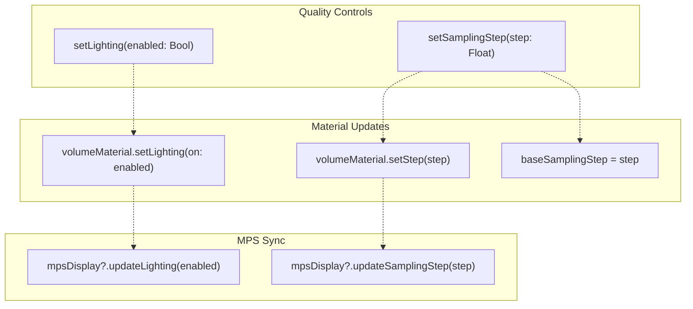

**Sampling Step:** Controls the ray marching step size. Smaller values increase quality but reduce performance. Typical range: 0.5 to 2.0.

**Sources:** [Sources/MTKUI/VolumetricSceneController L274-L287](https://github.com/ThalesMMS/MTK/blob/eda6f990/Sources/MTKUI/VolumetricSceneController+Interaction.swift#L274-L287)

### Rendering Method

The `setRenderMethod(_:)` method switches between different volume rendering algorithms.

**Available Methods:**

| Method | Description | Use Case |
| --- | --- | --- |
| `.directVolumeRendering` | Full ray marching with transfer function | General-purpose volumetric visualization |
| `.maximumIntensityProjection` | Shows maximum intensity along ray | Highlighting bright structures (e.g., vessels) |
| `.minimumIntensityProjection` | Shows minimum intensity along ray | Highlighting dark structures (e.g., airways) |
| `.isosurface` | Surface rendering at specific intensity threshold | 3D surface extraction |

**Sources:** [Sources/MTKUI/VolumetricSceneController L335-L340](https://github.com/ThalesMMS/MTK/blob/eda6f990/Sources/MTKUI/VolumetricSceneController+Interaction.swift#L335-L340)

 [Sources/MTKUI/VolumetricSceneController L406-L414](https://github.com/ThalesMMS/MTK/blob/eda6f990/Sources/MTKUI/VolumetricSceneController+Interaction.swift#L406-L414)

### Projection-Specific Controls

These methods apply only to MIP/MinIP rendering modes:

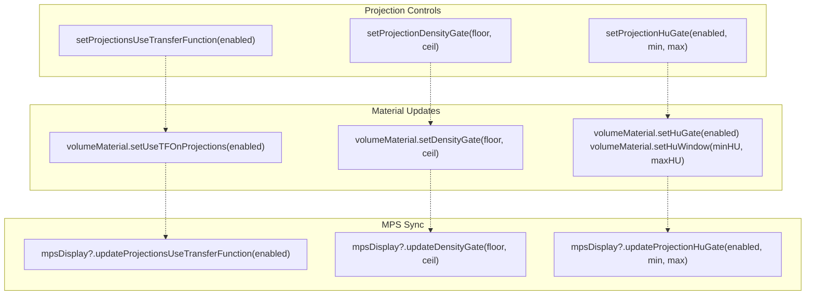

**Sources:** [Sources/MTKUI/VolumetricSceneController L289-L311](https://github.com/ThalesMMS/MTK/blob/eda6f990/Sources/MTKUI/VolumetricSceneController+Interaction.swift#L289-L311)

---

## HU Windowing

HU (Hounsfield Unit) windowing controls the intensity range mapping for CT datasets.

### Window/Level API

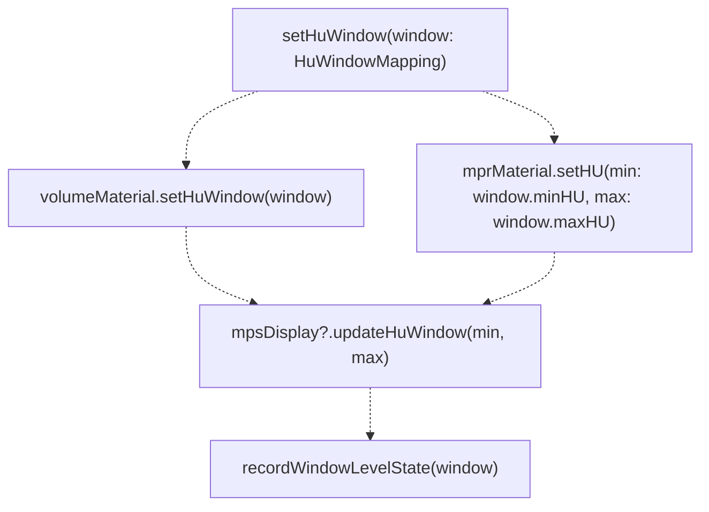

**HuWindowMapping Structure:**

* `minHU: Int32` - Lower bound of intensity window
* `maxHU: Int32` - Upper bound of intensity window
* Voxels outside this range are mapped to minimum/maximum transfer function values

**Gate Control:**

* `setHuGate(enabled:)` toggles whether HU windowing is active
* When disabled, full intensity range is used

**Sources:** [Sources/MTKUI/VolumetricSceneController L432-L446](https://github.com/ThalesMMS/MTK/blob/eda6f990/Sources/MTKUI/VolumetricSceneController+Interaction.swift#L432-L446)

---

## MPR Controls

Multi-planar reconstruction (MPR) provides methods to manipulate slice planes through the volume.

### MPR Plane Positioning

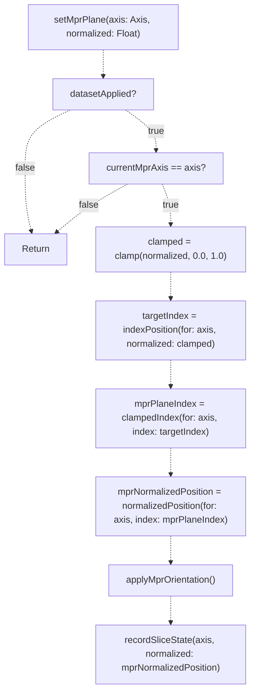

**Normalized Position:** Value in [0.0, 1.0] representing position along the axis.

* 0.0 = one end of volume along axis
* 0.5 = center slice
* 1.0 = opposite end

**Index Round-Trip:** The method converts normalized → index → normalized to ensure SceneKit and MPS backends use the exact same voxel slice.

**Sources:** [Sources/MTKUI/VolumetricSceneController L360-L373](https://github.com/ThalesMMS/MTK/blob/eda6f990/Sources/MTKUI/VolumetricSceneController+Interaction.swift#L360-L373)

### MPR Translation and Rotation

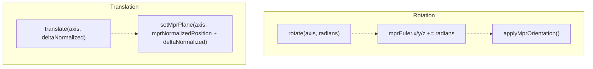

**Translation:** Convenience method for relative plane movement. Delta values are clamped during `setMprPlane` call.

**Rotation:** Adjusts Euler angles for oblique plane orientation. These rotations are applied on top of the axis-aligned base orientation.

**Sources:** [Sources/MTKUI/VolumetricSceneController L375-L392](https://github.com/ThalesMMS/MTK/blob/eda6f990/Sources/MTKUI/VolumetricSceneController+Interaction.swift#L375-L392)

### MPR Rendering Configuration

| Method | Parameters | Purpose |
| --- | --- | --- |
| `setMprBlend(_:)` | `MPRPlaneMaterial.BlendMode` | Sets slice blending mode (e.g., `.mip`, `.average`) |
| `setMprSlab(thickness:steps:)` | `Int`, `Int` | Configures slab thickness in voxels and number of steps |
| `setMprHuWindow(min:max:)` | `Int32`, `Int32` | Sets HU window specifically for MPR slices |

**Slab Configuration:** The method normalizes thickness and steps to odd voxel counts via `SlabConfiguration.snapToOddVoxelCount` to ensure symmetric sampling around the central plane.

**Sources:** [Sources/MTKUI/VolumetricSceneController L342-L358](https://github.com/ThalesMMS/MTK/blob/eda6f990/Sources/MTKUI/VolumetricSceneController+Interaction.swift#L342-L358)

---

## Backend Management

The controller supports switching between SceneKit and Metal Performance Shaders rendering backends at runtime.

### Backend Switching Flow

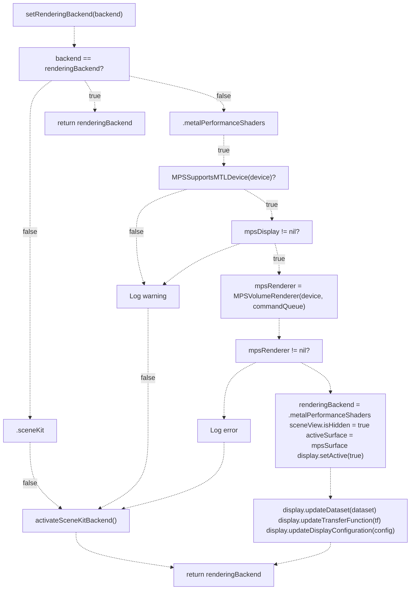

**Backend Capabilities:**

| Backend | Requirements | Features |
| --- | --- | --- |
| `.sceneKit` | Always available | Scene graph-based, automatic culling, higher-level API |
| `.metalPerformanceShaders` | Metal-capable device, MPS support | GPU ray casting, optimized kernels, better performance |

**Graceful Degradation:** If MPS backend is requested but unavailable, the method logs a warning and falls back to SceneKit, returning the actual active backend.

**Sources:** [Sources/MTKUI/VolumetricSceneController L463-L533](https://github.com/ThalesMMS/MTK/blob/eda6f990/Sources/MTKUI/VolumetricSceneController+Interaction.swift#L463-L533)

### Render Mode Control

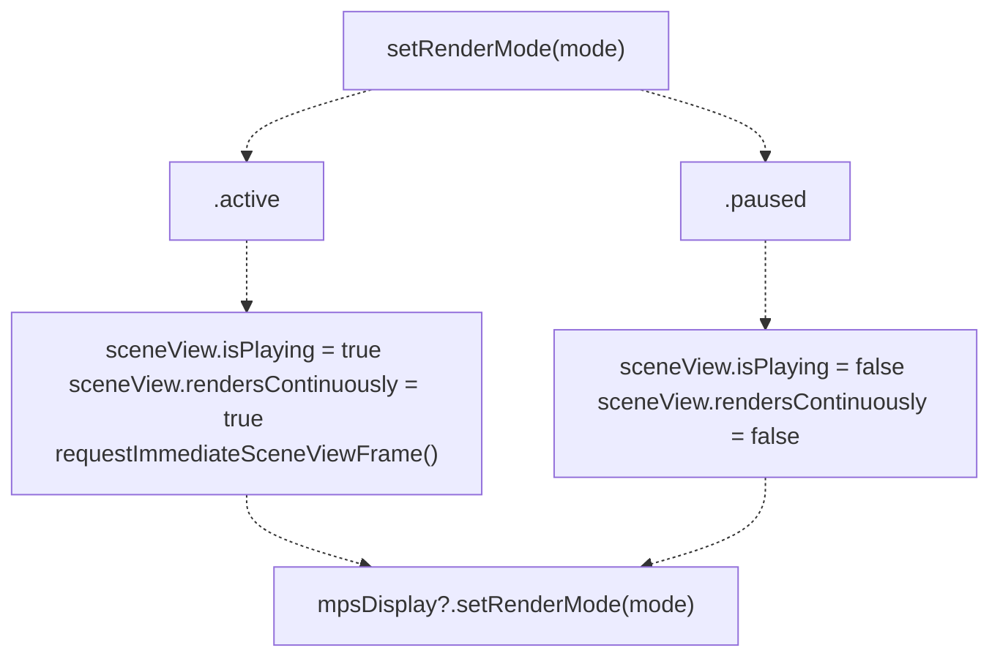

**Render Modes:**

* `.active`: Continuous rendering, responds to all updates
* `.paused`: Rendering halted, useful for saving resources when view is hidden

**Sources:** [Sources/MTKUI/VolumetricSceneController L448-L461](https://github.com/ThalesMMS/MTK/blob/eda6f990/Sources/MTKUI/VolumetricSceneController+Interaction.swift#L448-L461)

---

## Adaptive Sampling

Adaptive sampling reduces rendering quality during user interaction to maintain responsive frame rates, then restores full quality when interaction ends.

### Adaptive Sampling API

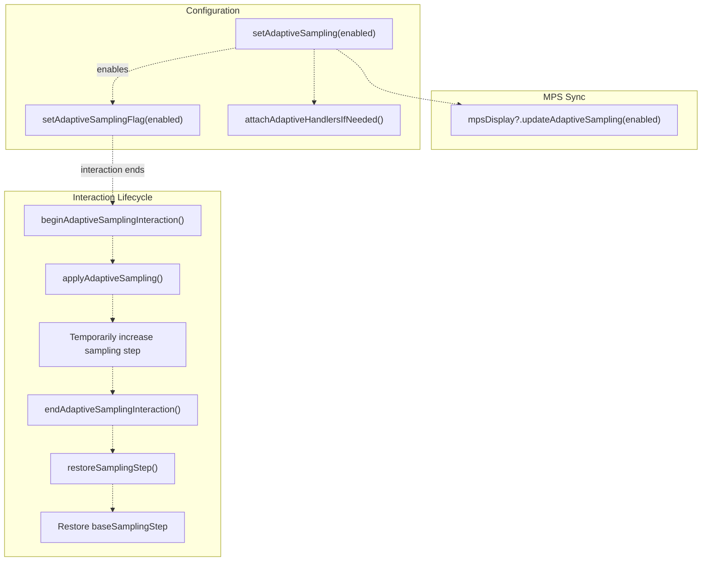

**Implementation Notes:**

* `applyAdaptiveSampling()` increases the sampling step (coarser quality)
* `restoreSamplingStep()` restores `baseSamplingStep` (original quality)
* On iOS, gesture recognizers automatically trigger begin/end lifecycle methods
* Manual control available through `beginAdaptiveSamplingInteraction()` and `endAdaptiveSamplingInteraction()`

**Sources:** [Sources/MTKUI/VolumetricSceneController L313-L332](https://github.com/ThalesMMS/MTK/blob/eda6f990/Sources/MTKUI/VolumetricSceneController+Interaction.swift#L313-L332)

---

## View Management and Queries

### Reset View

The `resetView()` method restores the initial camera position, HU window, and transfer function shift.

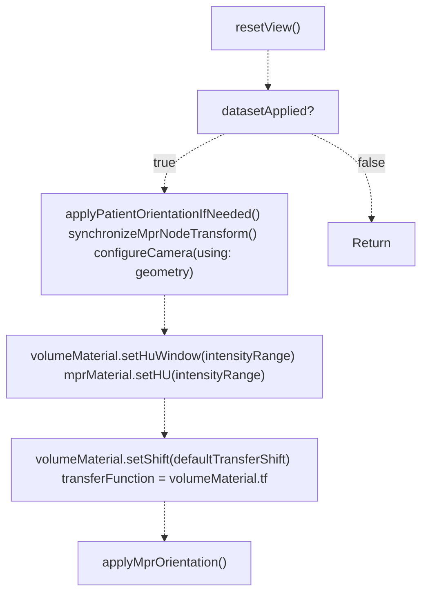

**Sources:** [Sources/MTKUI/VolumetricSceneController L535-L558](https://github.com/ThalesMMS/MTK/blob/eda6f990/Sources/MTKUI/VolumetricSceneController+Interaction.swift#L535-L558)

### Metadata Query

The `metadata()` method returns current dataset dimensions and resolution:

```
public func metadata() -> (dimension: SIMD3<Int32>, resolution: SIMD3<Float>)?
```

Returns `nil` if no dataset is applied. Otherwise, returns a tuple with:

* `dimension`: Voxel dimensions (width, height, depth)
* `resolution`: Physical spacing per voxel (mm/voxel)

This data is retrieved from `volumeMaterial.datasetMeta`.

**Sources:** [Sources/MTKUI/VolumetricSceneController L572-L575](https://github.com/ThalesMMS/MTK/blob/eda6f990/Sources/MTKUI/VolumetricSceneController+Interaction.swift#L572-L575)

---

## Method Summary Table

### Complete API Reference

| Category | Method | Parameters | Returns | Async |
| --- | --- | --- | --- | --- |
| **Dataset** | `applyDataset(_:)` | `VolumeDataset` | `Void` | ✓ |
|  | `setDisplayConfiguration(_:)` | `DisplayConfiguration` | `Void` | ✓ |
| **Camera** | `resetCamera()` | None | `Void` | ✓ |
|  | `rotateCamera(screenDelta:)` | `SIMD2<Float>` | `Void` | ✓ |
|  | `tiltCamera(roll:pitch:)` | `Float`, `Float` | `Void` | ✓ |
|  | `panCamera(screenDelta:)` | `SIMD2<Float>` | `Void` | ✓ |
|  | `dollyCamera(delta:)` | `Float` | `Void` | ✓ |
| **Transfer Function** | `setTransferFunction(_:)` | `TransferFunction?` | `Void` (throws) | ✓ |
|  | `setPreset(_:)` | `VolumeCubeMaterial.Preset` | `Void` | ✓ |
|  | `setShift(_:)` | `Float` | `Void` | ✓ |
|  | `updateTransferFunctionShift(_:)` | `Float` | `Void` | ✓ |
| **Rendering** | `setLighting(enabled:)` | `Bool` | `Void` | ✓ |
|  | `setSamplingStep(_:)` | `Float` | `Void` | ✓ |
|  | `setRenderMethod(_:)` | `VolumeCubeMaterial.Method` | `Void` | ✓ |
|  | `setVolumeMethod(_:)` | `VolumeCubeMaterial.Method` | `Void` | ✓ |
| **Projection** | `setProjectionsUseTransferFunction(_:)` | `Bool` | `Void` | ✓ |
|  | `setProjectionDensityGate(floor:ceil:)` | `Float`, `Float` | `Void` | ✓ |
|  | `setProjectionHuGate(enabled:min:max:)` | `Bool`, `Int32`, `Int32` | `Void` | ✓ |
| **HU Windowing** | `setHuWindow(_:)` | `HuWindowMapping` | `Void` | ✓ |
|  | `setHuGate(enabled:)` | `Bool` | `Void` | ✓ |
| **MPR** | `setMprPlane(axis:normalized:)` | `Axis`, `Float` | `Void` | ✓ |
|  | `setMprBlend(_:)` | `MPRPlaneMaterial.BlendMode` | `Void` | ✓ |
|  | `setMprSlab(thickness:steps:)` | `Int`, `Int` | `Void` | ✓ |
|  | `setMprHuWindow(min:max:)` | `Int32`, `Int32` | `Void` | ✓ |
|  | `translate(axis:deltaNormalized:)` | `Axis`, `Float` | `Void` | ✓ |
|  | `rotate(axis:radians:)` | `Axis`, `Float` | `Void` | ✓ |
| **Adaptive** | `setAdaptiveSampling(_:)` | `Bool` | `Void` | ✓ |
|  | `beginAdaptiveSamplingInteraction()` | None | `Void` | ✓ |
|  | `endAdaptiveSamplingInteraction()` | None | `Void` | ✓ |
| **Backend** | `setRenderingBackend(_:)` | `VolumetricRenderingBackend` | `VolumetricRenderingBackend` | ✓ |
|  | `setRenderMode(_:)` | `VolumetricRenderMode` | `Void` | ✓ |
| **View** | `resetView()` | None | `Void` | ✓ |
| **Query** | `metadata()` | None | `(dimension: SIMD3<Int32>, resolution: SIMD3<Float>)?` | ✗ |

**Sources:** [Sources/MTKUI/VolumetricSceneController L1-L601](https://github.com/ThalesMMS/MTK/blob/eda6f990/Sources/MTKUI/VolumetricSceneController+Interaction.swift#L1-L601)

---

## Internal Helper Methods

The extension includes several private helper methods for internal operations:

| Method | Purpose | Location |
| --- | --- | --- |
| `resumeSceneViewIfNeeded()` | Ensures SceneKit view is actively rendering | [Sources/MTKUI/VolumetricSceneController L125-L132](https://github.com/ThalesMMS/MTK/blob/eda6f990/Sources/MTKUI/VolumetricSceneController+Interaction.swift#L125-L132) |
| `requestImmediateSceneViewFrame()` | Forces immediate frame render on SceneKit view | [Sources/MTKUI/VolumetricSceneController L134-L143](https://github.com/ThalesMMS/MTK/blob/eda6f990/Sources/MTKUI/VolumetricSceneController+Interaction.swift#L134-L143) |
| `activateSceneKitBackend()` | Switches to SceneKit backend and updates state | [Sources/MTKUI/VolumetricSceneController L521-L533](https://github.com/ThalesMMS/MTK/blob/eda6f990/Sources/MTKUI/VolumetricSceneController+Interaction.swift#L521-L533) |
| `formatVector(_:)` | Formats SIMD3 for debug logging | [Sources/MTKUI/VolumetricSceneController L577-L579](https://github.com/ThalesMMS/MTK/blob/eda6f990/Sources/MTKUI/VolumetricSceneController+Interaction.swift#L577-L579) |
| `formatSize(_:)` | Formats CGSize for debug logging | [Sources/MTKUI/VolumetricSceneController L581-L583](https://github.com/ThalesMMS/MTK/blob/eda6f990/Sources/MTKUI/VolumetricSceneController+Interaction.swift#L581-L583) |
| `describe(_:)` | Formats DisplayConfiguration for debug logging | [Sources/MTKUI/VolumetricSceneController L585-L598](https://github.com/ThalesMMS/MTK/blob/eda6f990/Sources/MTKUI/VolumetricSceneController+Interaction.swift#L585-L598) |

**Sources:** [Sources/MTKUI/VolumetricSceneController L125-L598](https://github.com/ThalesMMS/MTK/blob/eda6f990/Sources/MTKUI/VolumetricSceneController+Interaction.swift#L125-L598)

---

## Backend Synchronization Pattern

All rendering parameter methods follow a consistent synchronization pattern to keep SceneKit and MPS backends in sync:

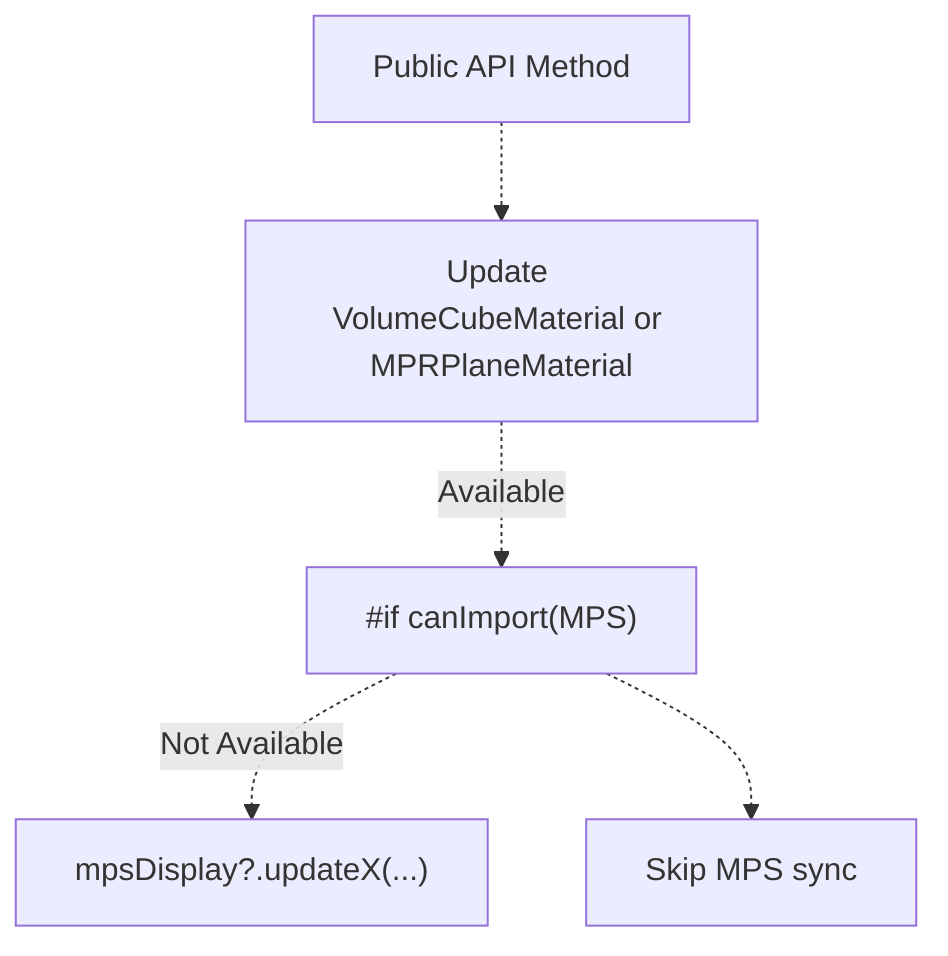

This pattern ensures:

1. SceneKit materials always receive updates (primary backend)
2. MPS backend receives updates conditionally (if available)
3. Platform-specific code is isolated using conditional compilation

**Example Implementation:**

```css
public func setLighting(enabled: Bool) async {    volumeMaterial.setLighting(on: enabled)#if canImport(MetalPerformanceShaders) && canImport(MetalKit)    mpsDisplay?.updateLighting(enabled: enabled)#endif}
```

**Sources:** [Sources/MTKUI/VolumetricSceneController L274-L279](https://github.com/ThalesMMS/MTK/blob/eda6f990/Sources/MTKUI/VolumetricSceneController+Interaction.swift#L274-L279)


### On this page

* [Interaction API](#3.1-interaction-api)
* [API Organization](#3.1-api-organization)
* [Dataset and Display Configuration](#3.1-dataset-and-display-configuration)
* [Dataset Application Flow](#3.1-dataset-application-flow)
* [Display Configuration](#3.1-display-configuration)
* [Camera Control Methods](#3.1-camera-control-methods)
* [Camera Control API Overview](#3.1-camera-control-api-overview)
* [Rotation Implementation](#3.1-rotation-implementation)
* [Tilt Implementation](#3.1-tilt-implementation)
* [Pan Implementation](#3.1-pan-implementation)
* [Dolly Implementation](#3.1-dolly-implementation)
* [Rendering Parameters](#3.1-rendering-parameters)
* [Transfer Function Management](#3.1-transfer-function-management)
* [Lighting and Sampling](#3.1-lighting-and-sampling)
* [Rendering Method](#3.1-rendering-method)
* [Projection-Specific Controls](#3.1-projection-specific-controls)
* [HU Windowing](#3.1-hu-windowing)
* [Window/Level API](#3.1-windowlevel-api)
* [MPR Controls](#3.1-mpr-controls)
* [MPR Plane Positioning](#3.1-mpr-plane-positioning)
* [MPR Translation and Rotation](#3.1-mpr-translation-and-rotation)
* [MPR Rendering Configuration](#3.1-mpr-rendering-configuration)
* [Backend Management](#3.1-backend-management)
* [Backend Switching Flow](#3.1-backend-switching-flow)
* [Render Mode Control](#3.1-render-mode-control)
* [Adaptive Sampling](#3.1-adaptive-sampling)
* [Adaptive Sampling API](#3.1-adaptive-sampling-api)
* [View Management and Queries](#3.1-view-management-and-queries)
* [Reset View](#3.1-reset-view)
* [Metadata Query](#3.1-metadata-query)
* [Method Summary Table](#3.1-method-summary-table)
* [Complete API Reference](#3.1-complete-api-reference)
* [Internal Helper Methods](#3.1-internal-helper-methods)
* [Backend Synchronization Pattern](#3.1-backend-synchronization-pattern)

Ask Devin about MTK