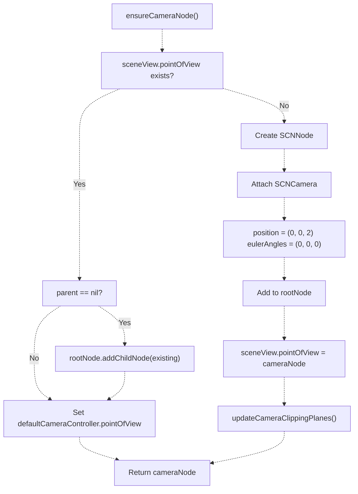
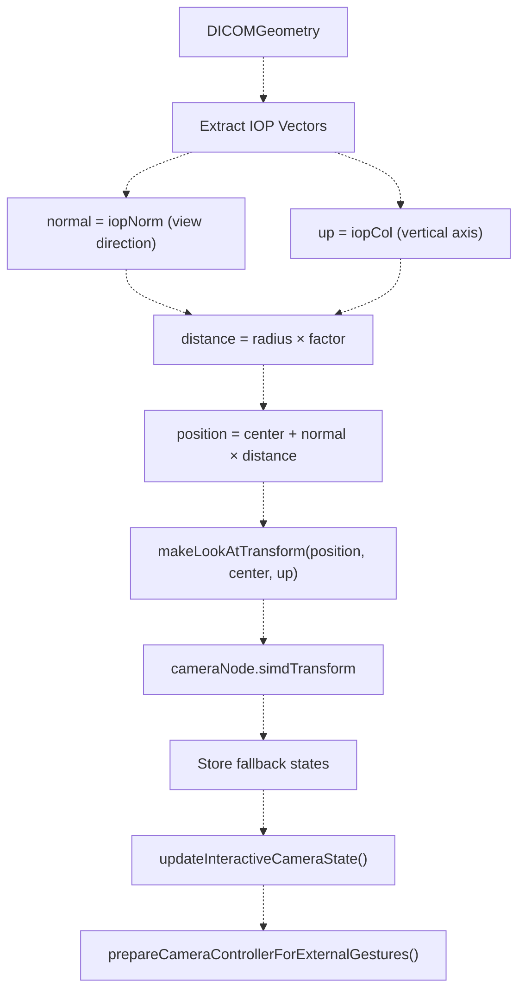
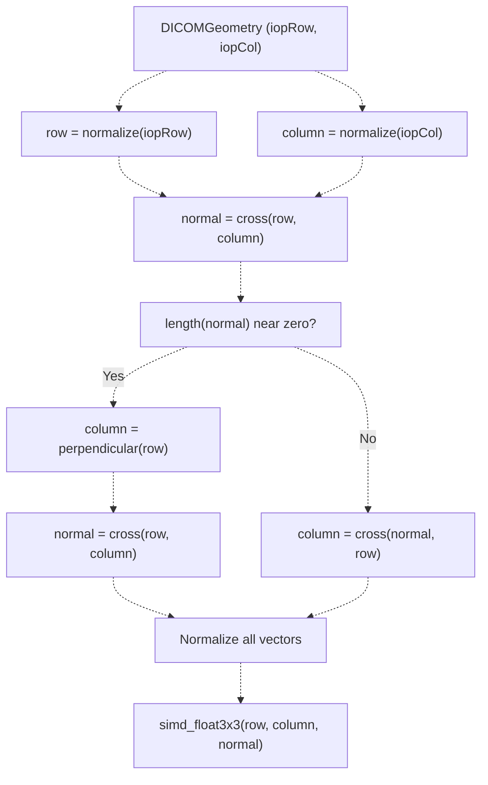
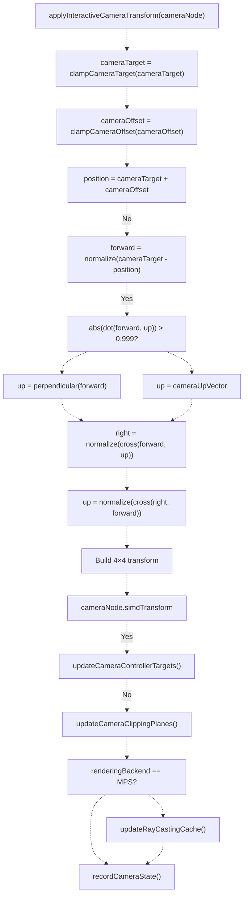
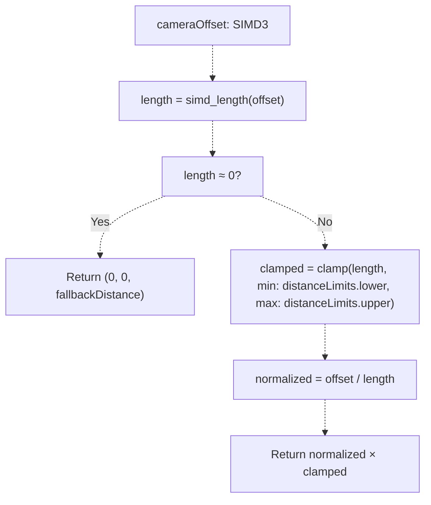
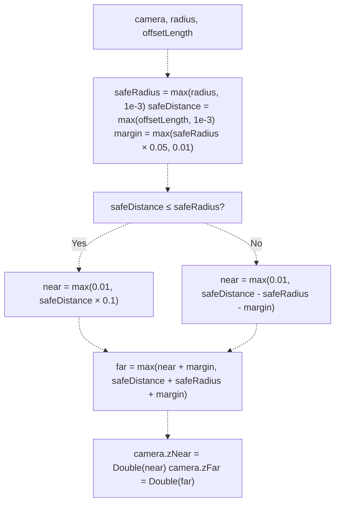
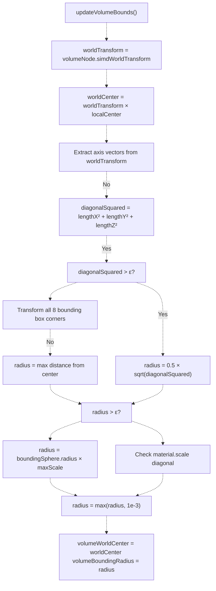
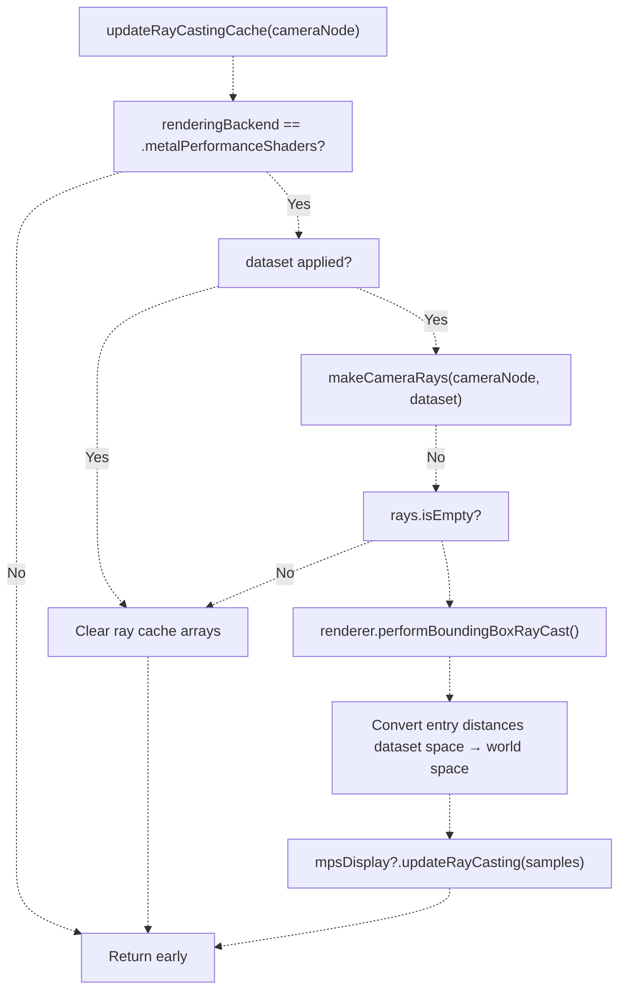
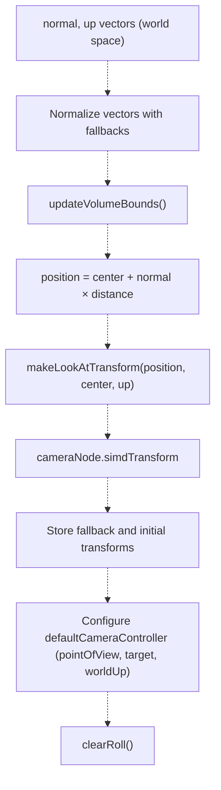
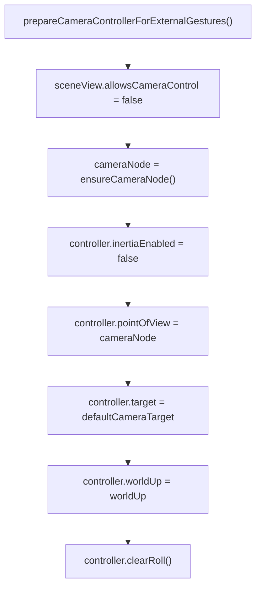

# Camera Management

> **Relevant source files**
> * [Sources/MTKUI/VolumetricSceneController+Camera.swift](https://github.com/ThalesMMS/MTK/blob/eda6f990/Sources/MTKUI/VolumetricSceneController+Camera.swift)

## Purpose and Scope

This document covers the camera management subsystem within `VolumetricSceneController`, responsible for initializing, configuring, and manipulating the 3D camera that views volumetric datasets. The system handles patient orientation alignment from DICOM geometry, interactive camera transformations with constraints, clipping plane computation, and integration with the MPS ray casting pipeline.

For interactive camera manipulation through the public API (rotate, pan, dolly methods), see [Interaction API](3a%20Interaction-API.md). For MPR-specific plane computation and oblique reformatting, see [Multi-Planar Reconstruction](3c%20Multi-Planar-Reconstruction-%28MPR%29.md). For state publication to SwiftUI views, see [State Management & Reactivity](3d%20State-Management-&-Reactivity.md).

**Sources:** [Sources/MTKUI/VolumetricSceneController L1-L722](https://github.com/ThalesMMS/MTK/blob/eda6f990/Sources/MTKUI/VolumetricSceneController+Camera.swift#L1-L722)

---

## Camera State Model

The camera system maintains state through several interconnected properties that define the camera's position, orientation, and behavior:

| Property | Type | Purpose |
| --- | --- | --- |
| `cameraTarget` | `SIMD3<Float>` | World-space point the camera orbits around (typically volume center) |
| `cameraOffset` | `SIMD3<Float>` | Vector from target to camera position, defines distance and direction |
| `cameraUpVector` | `SIMD3<Float>` | World-space up direction, constrained to remain perpendicular to view direction |
| `cameraDistanceLimits` | `ClosedRange<Float>` | Minimum and maximum allowed camera distance from target |
| `fallbackCameraTransform` | `simd_float4x4?` | Saved transform for restoration after backend switches |
| `initialCameraTransform` | `simd_float4x4?` | Original transform from dataset configuration |
| `fallbackWorldUp` | `SIMD3<Float>` | Saved up vector for restoration |
| `defaultCameraTarget` | `SCNVector3` | SceneKit camera controller target position |
| `volumeWorldCenter` | `SIMD3<Float>` | Center of volume in world space, computed from bounds |
| `volumeBoundingRadius` | `Float` | Radius of bounding sphere around volume |

**Interactive Camera Transform Pattern:**

```
camera_position = cameraTarget + cameraOffset
```

The offset vector is clamped to `cameraDistanceLimits` to prevent the camera from getting too close or too far from the volume. The target is clamped within `maximumPanDistanceMultiplier * volumeBoundingRadius` to prevent excessive panning away from the volume.

**Sources:** [Sources/MTKUI/VolumetricSceneController L115-L136](https://github.com/ThalesMMS/MTK/blob/eda6f990/Sources/MTKUI/VolumetricSceneController+Camera.swift#L115-L136)

 [Sources/MTKUI/VolumetricSceneController L138-L169](https://github.com/ThalesMMS/MTK/blob/eda6f990/Sources/MTKUI/VolumetricSceneController+Camera.swift#L138-L169)

---

## Camera Initialization and Configuration

### Camera Node Creation



The `ensureCameraNode()` method [Sources/MTKUI/VolumetricSceneController L37-L59](https://github.com/ThalesMMS/MTK/blob/eda6f990/Sources/MTKUI/VolumetricSceneController+Camera.swift#L37-L59)

 guarantees a camera exists in the scene graph:

* Reuses existing `pointOfView` if present
* Creates new `SCNNode` with `SCNCamera` if missing
* Names node `"Volumetric.Camera"` for debugging
* Sets initial position at `(0, 0, 2)` with neutral orientation
* Configures `defaultCameraController.pointOfView` for SceneKit integration
* Initializes clipping planes based on volume bounds

**Sources:** [Sources/MTKUI/VolumetricSceneController L37-L59](https://github.com/ThalesMMS/MTK/blob/eda6f990/Sources/MTKUI/VolumetricSceneController+Camera.swift#L37-L59)

### DICOM Geometry-Based Configuration

The `configureCamera(using:)` method [Sources/MTKUI/VolumetricSceneController L65-L91](https://github.com/ThalesMMS/MTK/blob/eda6f990/Sources/MTKUI/VolumetricSceneController+Camera.swift#L65-L91)

 positions the camera based on DICOM Image Orientation Patient (IOP) vectors:



**Configuration Steps:**

1. **Extract Orientation:** Normalizes `geometry.iopNorm` (viewing direction) and `geometry.iopCol` (up vector) with fallbacks
2. **Compute Position:** Places camera at `center + normal * distance` where distance = `max(radius * defaultCameraDistanceFactor, radius * 1.25)`
3. **Build Transform:** Constructs look-at matrix from position, target, and up vector
4. **Save States:** Records `fallbackCameraTransform`, `initialCameraTransform`, `fallbackWorldUp`, `patientLongitudinalAxis`
5. **Update Interactive State:** Initializes `cameraTarget`, `cameraOffset`, `cameraUpVector` for gesture handling
6. **Configure Controller:** Prepares `SCNView.defaultCameraController` with target and up vector

**Sources:** [Sources/MTKUI/VolumetricSceneController L65-L91](https://github.com/ThalesMMS/MTK/blob/eda6f990/Sources/MTKUI/VolumetricSceneController+Camera.swift#L65-L91)

---

## Patient Orientation Alignment

### Basis Matrix Construction

The `patientBasis(from:)` method [Sources/MTKUI/VolumetricSceneController L347-L361](https://github.com/ThalesMMS/MTK/blob/eda6f990/Sources/MTKUI/VolumetricSceneController+Camera.swift#L347-L361)

 constructs an orthonormal basis from DICOM IOP vectors:



**Orthonormalization Process:**

1. Normalize input row and column vectors
2. Compute normal via cross product
3. If normal is degenerate (parallel vectors), replace column with perpendicular vector
4. Recompute column as `cross(normal, row)` to ensure orthogonality
5. Return 3×3 rotation matrix representing patient coordinate system

The resulting basis is converted to a quaternion and applied to `volumeNode.simdOrientation` by `applyPatientOrientationIfNeeded()` [Sources/MTKUI/VolumetricSceneController L27-L35](https://github.com/ThalesMMS/MTK/blob/eda6f990/Sources/MTKUI/VolumetricSceneController+Camera.swift#L27-L35)

 aligning the volume geometry with anatomical axes.

**Sources:** [Sources/MTKUI/VolumetricSceneController L347-L361](https://github.com/ThalesMMS/MTK/blob/eda6f990/Sources/MTKUI/VolumetricSceneController+Camera.swift#L347-L361)

 [Sources/MTKUI/VolumetricSceneController L27-L35](https://github.com/ThalesMMS/MTK/blob/eda6f990/Sources/MTKUI/VolumetricSceneController+Camera.swift#L27-L35)

---

## Interactive Camera Transform System

### Transform Application

The `applyInteractiveCameraTransform(_:)` method [Sources/MTKUI/VolumetricSceneController L138-L169](https://github.com/ThalesMMS/MTK/blob/eda6f990/Sources/MTKUI/VolumetricSceneController+Camera.swift#L138-L169)

 recomputes the camera transform from interactive state:



**Transform Construction:**
The method builds a right-handed coordinate system where:

* **Right:** `normalize(cross(forward, up))`
* **Up:** `normalize(cross(right, forward))` (reorthogonalized)
* **Forward:** `normalize(cameraTarget - position)` (negated in matrix)

The final `simd_float4x4` matrix:

```
| right.x    up.x    -forward.x    position.x |
| right.y    up.y    -forward.y    position.y |
| right.z    up.z    -forward.z    position.z |
| 0          0       0             1          |
```

**Sources:** [Sources/MTKUI/VolumetricSceneController L138-L169](https://github.com/ThalesMMS/MTK/blob/eda6f990/Sources/MTKUI/VolumetricSceneController+Camera.swift#L138-L169)

### Look-At Transform

The `makeLookAtTransform(position:target:up:)` method [Sources/MTKUI/VolumetricSceneController L363-L375](https://github.com/ThalesMMS/MTK/blob/eda6f990/Sources/MTKUI/VolumetricSceneController+Camera.swift#L363-L375)

 constructs a camera matrix pointing at a target:

| Parameter | Description |
| --- | --- |
| `position` | Camera location in world space |
| `target` | Point the camera looks at |
| `up` | Desired up direction (orthogonalized) |

**Construction Algorithm:**

1. `forward = normalize(target - position)`
2. `right = normalize(cross(up, forward))`
3. `correctedUp = normalize(cross(forward, right))`
4. Build rotation matrix from (right, correctedUp, -forward)
5. Set translation column to `position`

**Sources:** [Sources/MTKUI/VolumetricSceneController L363-L375](https://github.com/ThalesMMS/MTK/blob/eda6f990/Sources/MTKUI/VolumetricSceneController+Camera.swift#L363-L375)

---

## Camera Constraints

### Distance Clamping

The `clampCameraOffset(_:)` method [Sources/MTKUI/VolumetricSceneController L171-L180](https://github.com/ThalesMMS/MTK/blob/eda6f990/Sources/MTKUI/VolumetricSceneController+Camera.swift#L171-L180)

 enforces distance limits:



**Distance Limit Computation** [Sources/MTKUI/VolumetricSceneController L182-L186](https://github.com/ThalesMMS/MTK/blob/eda6f990/Sources/MTKUI/VolumetricSceneController+Camera.swift#L182-L186)

:

```
minimum = max(radius × 0.25, 0.1)
maximum = max(radius × 12, minimum + 0.5)
```

This allows the camera to zoom in to 25% of the bounding radius and out to 12× the radius.

**Sources:** [Sources/MTKUI/VolumetricSceneController L171-L186](https://github.com/ThalesMMS/MTK/blob/eda6f990/Sources/MTKUI/VolumetricSceneController+Camera.swift#L171-L186)

### Target Clamping

The `clampCameraTarget(_:)` method [Sources/MTKUI/VolumetricSceneController L317-L326](https://github.com/ThalesMMS/MTK/blob/eda6f990/Sources/MTKUI/VolumetricSceneController+Camera.swift#L317-L326)

 prevents excessive panning:

```
offset = target - volumeWorldCenter
limit = max(volumeBoundingRadius × maximumPanDistanceMultiplier, 1.0)
if length(offset) > limit:
    return volumeWorldCenter + normalize(offset) × limit
```

This constrains the target to remain within a sphere of radius `limit` around the volume center.

**Sources:** [Sources/MTKUI/VolumetricSceneController L317-L326](https://github.com/ThalesMMS/MTK/blob/eda6f990/Sources/MTKUI/VolumetricSceneController+Camera.swift#L317-L326)

---

## Clipping Plane Management

The `updateCameraClippingPlanes(_:radius:offsetLength:)` method [Sources/MTKUI/VolumetricSceneController L328-L345](https://github.com/ThalesMMS/MTK/blob/eda6f990/Sources/MTKUI/VolumetricSceneController+Camera.swift#L328-L345)

 computes near and far planes to frame the volume optimally:



**Clipping Plane Logic:**

| Camera Position | Near Plane Formula | Rationale |
| --- | --- | --- |
| Inside volume (`distance ≤ radius`) | `distance × 0.1` | Avoid clipping volume interior |
| Outside volume (`distance > radius`) | `distance - radius - margin` | Clip empty space before volume |

The far plane is always set to `distance + radius + margin` to include the entire volume behind the target point.

**Sources:** [Sources/MTKUI/VolumetricSceneController L328-L345](https://github.com/ThalesMMS/MTK/blob/eda6f990/Sources/MTKUI/VolumetricSceneController+Camera.swift#L328-L345)

---

## Volume Bounds Calculation

The `updateVolumeBounds()` method [Sources/MTKUI/VolumetricSceneController L236-L315](https://github.com/ThalesMMS/MTK/blob/eda6f990/Sources/MTKUI/VolumetricSceneController+Camera.swift#L236-L315)

 computes world-space volume center and bounding radius:



**Fallback Hierarchy for Radius Computation:**

1. **Diagonal Method:** `0.5 × sqrt(scaleX² + scaleY² + scaleZ²)` from world transform axes
2. **Corner Transformation:** Transform all 8 bounding box corners to world space, measure maximum distance from center
3. **Scaled Sphere:** `boundingSphere.radius × max(scaleX, scaleY, scaleZ)`
4. **Material Scale:** `0.5 × length(volumeMaterial.scale)`
5. **Minimum Clamp:** Ensure radius ≥ `1e-3`

The method also updates `patientLongitudinalAxis` to track the volume's Z-axis in world space.

**Sources:** [Sources/MTKUI/VolumetricSceneController L236-L315](https://github.com/ThalesMMS/MTK/blob/eda6f990/Sources/MTKUI/VolumetricSceneController+Camera.swift#L236-L315)

---

## MPS Ray Casting Cache

### Ray Generation and Caching

The MPS backend requires precomputed ray directions for bounding box intersection tests. The `updateRayCastingCache(cameraNode:)` method [Sources/MTKUI/VolumetricSceneController L414-L450](https://github.com/ThalesMMS/MTK/blob/eda6f990/Sources/MTKUI/VolumetricSceneController+Camera.swift#L414-L450)

 generates rays when the camera moves:



### Camera Ray Construction

The `makeCameraRays(cameraNode:dataset:)` method [Sources/MTKUI/VolumetricSceneController L452-L500](https://github.com/ThalesMMS/MTK/blob/eda6f990/Sources/MTKUI/VolumetricSceneController+Camera.swift#L452-L500)

 generates 5 rays in dataset space:

| Ray Index | Direction | Purpose |
| --- | --- | --- |
| 0 | Center (forward) | Primary viewing ray |
| 1 | Top-left corner | FOV boundary |
| 2 | Top-right corner | FOV boundary |
| 3 | Bottom-left corner | FOV boundary |
| 4 | Bottom-right corner | FOV boundary |

**Construction Algorithm:**

1. Compute camera's forward, right, up vectors in world space
2. Calculate half-width and half-height from FOV and aspect ratio: ``` halfHeight = tan(fovRadians / 2) halfWidth = halfHeight × aspect ```
3. Compute 5 direction vectors in world space
4. Transform directions to dataset space using `convertWorldDirectionToDatasetSpace()`
5. Transform camera position to dataset space using `convertWorldPointToDatasetSpace()`
6. Store magnitude scale factors for each ray (used to convert back to world space)

**Sources:** [Sources/MTKUI/VolumetricSceneController L414-L450](https://github.com/ThalesMMS/MTK/blob/eda6f990/Sources/MTKUI/VolumetricSceneController+Camera.swift#L414-L450)

 [Sources/MTKUI/VolumetricSceneController L452-L500](https://github.com/ThalesMMS/MTK/blob/eda6f990/Sources/MTKUI/VolumetricSceneController+Camera.swift#L452-L500)

---

## MPR Camera Alignment

The `alignCameraToMpr(normal:up:)` method [Sources/MTKUI/VolumetricSceneController L609-L630](https://github.com/ThalesMMS/MTK/blob/eda6f990/Sources/MTKUI/VolumetricSceneController+Camera.swift#L609-L630)

 positions the camera to view an MPR plane orthogonally:



**Usage Pattern:**
This method is called by `applyMprOrientation()` after computing the MPR plane's normal and up vectors in world space. It ensures the camera:

* Looks directly at the plane (no oblique angle)
* Maintains the plane's vertical orientation as "up"
* Positions at appropriate distance for framing

**Sources:** [Sources/MTKUI/VolumetricSceneController L609-L630](https://github.com/ThalesMMS/MTK/blob/eda6f990/Sources/MTKUI/VolumetricSceneController+Camera.swift#L609-L630)

---

## Coordinate Space Transformations

### World to Dataset Conversion

Two methods handle coordinate system transformations using `DICOMGeometry.worldToVoxel` matrix:

**Point Transformation** [Sources/MTKUI/VolumetricSceneController L502-L512](https://github.com/ThalesMMS/MTK/blob/eda6f990/Sources/MTKUI/VolumetricSceneController+Camera.swift#L502-L512)

:

```
convertWorldPointToDatasetSpace(_ point: SIMD3<Float>, geometry: DICOMGeometry) -> SIMD3<Float>?
```

1. Convert point to homogeneous coordinates: `SIMD4(point, 1)`
2. Apply `worldToVoxel` matrix to get voxel coordinates
3. Perform perspective division: `voxel / voxel.w`
4. Scale by voxel spacing to get dataset-space millimeter coordinates

**Direction Transformation** [Sources/MTKUI/VolumetricSceneController L514-L525](https://github.com/ThalesMMS/MTK/blob/eda6f990/Sources/MTKUI/VolumetricSceneController+Camera.swift#L514-L525)

:

```
convertWorldDirectionToDatasetSpace(_ direction: SIMD3<Float>, geometry: DICOMGeometry) -> SIMD3<Float>?
```

1. Convert direction to homogeneous vector: `SIMD4(direction, 0)` (w=0 for vectors)
2. Apply `worldToVoxel` matrix
3. Scale by voxel spacing to preserve physical length
4. Validate result is finite

**Key Difference:** Points use `w=1` and require perspective division; directions use `w=0` and do not.

**Sources:** [Sources/MTKUI/VolumetricSceneController L502-L525](https://github.com/ThalesMMS/MTK/blob/eda6f990/Sources/MTKUI/VolumetricSceneController+Camera.swift#L502-L525)

---

## Helper Functions

### Safe Vector Operations

The camera system uses robust vector normalization and perpendicular computation to handle degenerate cases:

**`safeNormalize(_:fallback:)`** [Sources/MTKUI/VolumetricSceneController L377-L381](https://github.com/ThalesMMS/MTK/blob/eda6f990/Sources/MTKUI/VolumetricSceneController+Camera.swift#L377-L381)

:

```
guard simd_length_squared(vector) > Float.ulpOfOne else { return fallback }return vector / sqrt(lengthSquared)
```

Returns fallback if vector is near-zero to prevent NaN propagation.

**`safePerpendicular(to:)`** [Sources/MTKUI/VolumetricSceneController L383-L387](https://github.com/ThalesMMS/MTK/blob/eda6f990/Sources/MTKUI/VolumetricSceneController+Camera.swift#L383-L387)

:

```
let axis = abs(vector.x) < 0.9 ? SIMD3(1, 0, 0) : SIMD3(0, 1, 0)return safeNormalize(cross(vector, axis), fallback: SIMD3(0, 0, 1))
```

Generates perpendicular vector by crossing with X or Y axis depending on input orientation.

### Screen Space Scale

The `screenSpaceScale(distance:cameraNode:)` method [Sources/MTKUI/VolumetricSceneController L199-L218](https://github.com/ThalesMMS/MTK/blob/eda6f990/Sources/MTKUI/VolumetricSceneController+Camera.swift#L199-L218)

 computes world-space size per pixel for pan gestures:

```
verticalScale = 2 × distance × tan(fov / 2) / screenHeight
horizontalScale = verticalScale × aspect
```

**Sources:** [Sources/MTKUI/VolumetricSceneController L199-L218](https://github.com/ThalesMMS/MTK/blob/eda6f990/Sources/MTKUI/VolumetricSceneController+Camera.swift#L199-L218)

 [Sources/MTKUI/VolumetricSceneController L377-L387](https://github.com/ThalesMMS/MTK/blob/eda6f990/Sources/MTKUI/VolumetricSceneController+Camera.swift#L377-L387)

---

## Camera Controller Integration

The `prepareCameraControllerForExternalGestures(worldUp:)` method [Sources/MTKUI/VolumetricSceneController L220-L234](https://github.com/ThalesMMS/MTK/blob/eda6f990/Sources/MTKUI/VolumetricSceneController+Camera.swift#L220-L234)

 configures `SCNView.defaultCameraController` for custom gesture handling:



**Configuration Effects:**

* Disables built-in SceneKit camera control to prevent conflicts with custom gestures
* Disables inertia for immediate response to state changes
* Synchronizes `target` and `worldUp` with interactive camera state
* Clears accumulated roll rotation to maintain proper orientation

This allows `VolumetricSceneController+Interaction` to manually update `cameraTarget`, `cameraOffset`, and `cameraUpVector`, then call `applyInteractiveCameraTransform()` to reflect changes while keeping the SceneKit controller synchronized.

**Sources:** [Sources/MTKUI/VolumetricSceneController L220-L234](https://github.com/ThalesMMS/MTK/blob/eda6f990/Sources/MTKUI/VolumetricSceneController+Camera.swift#L220-L234)


### On this page

* [Camera Management](#3.2-camera-management)
* [Purpose and Scope](#3.2-purpose-and-scope)
* [Camera State Model](#3.2-camera-state-model)
* [Camera Initialization and Configuration](#3.2-camera-initialization-and-configuration)
* [Camera Node Creation](#3.2-camera-node-creation)
* [DICOM Geometry-Based Configuration](#3.2-dicom-geometry-based-configuration)
* [Patient Orientation Alignment](#3.2-patient-orientation-alignment)
* [Basis Matrix Construction](#3.2-basis-matrix-construction)
* [Interactive Camera Transform System](#3.2-interactive-camera-transform-system)
* [Transform Application](#3.2-transform-application)
* [Look-At Transform](#3.2-look-at-transform)
* [Camera Constraints](#3.2-camera-constraints)
* [Distance Clamping](#3.2-distance-clamping)
* [Target Clamping](#3.2-target-clamping)
* [Clipping Plane Management](#3.2-clipping-plane-management)
* [Volume Bounds Calculation](#3.2-volume-bounds-calculation)
* [MPS Ray Casting Cache](#3.2-mps-ray-casting-cache)
* [Ray Generation and Caching](#3.2-ray-generation-and-caching)
* [Camera Ray Construction](#3.2-camera-ray-construction)
* [MPR Camera Alignment](#3.2-mpr-camera-alignment)
* [Coordinate Space Transformations](#3.2-coordinate-space-transformations)
* [World to Dataset Conversion](#3.2-world-to-dataset-conversion)
* [Helper Functions](#3.2-helper-functions)
* [Safe Vector Operations](#3.2-safe-vector-operations)
* [Screen Space Scale](#3.2-screen-space-scale)
* [Camera Controller Integration](#3.2-camera-controller-integration)

Ask Devin about MTK