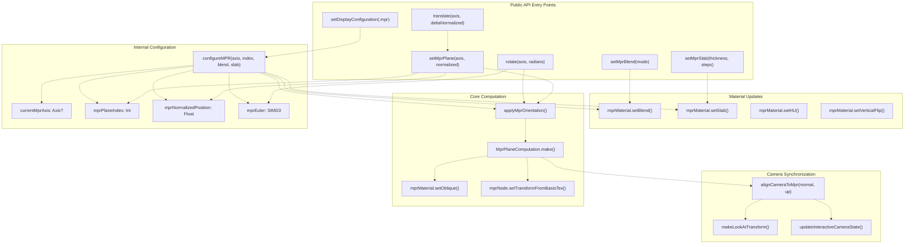
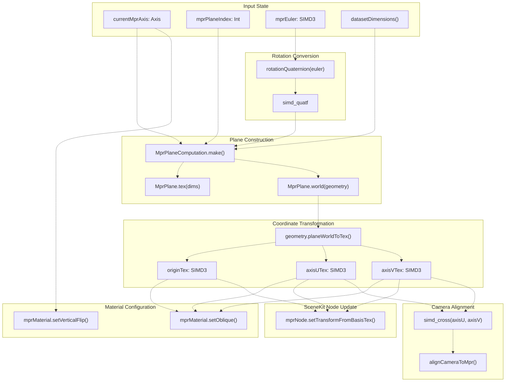
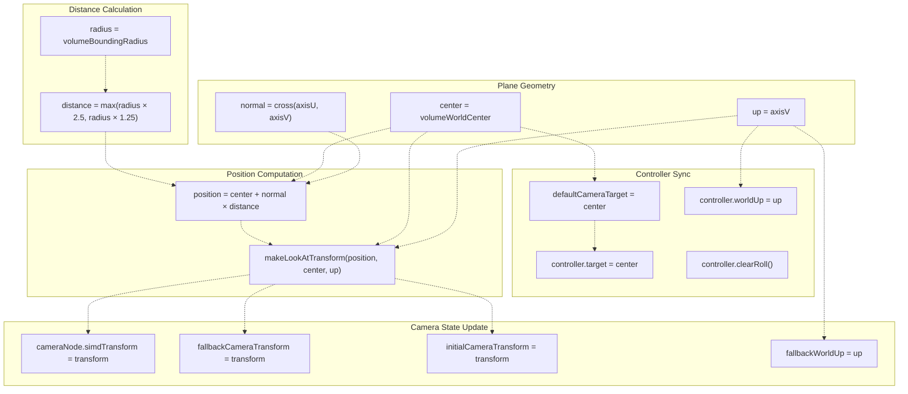

# Multi-Planar Reconstruction (MPR)

> **Relevant source files**
> * [Sources/MTKUI/VolumetricSceneController+Camera.swift](https://github.com/ThalesMMS/MTK/blob/eda6f990/Sources/MTKUI/VolumetricSceneController+Camera.swift)
> * [Sources/MTKUI/VolumetricSceneController+Interaction.swift](https://github.com/ThalesMMS/MTK/blob/eda6f990/Sources/MTKUI/VolumetricSceneController+Interaction.swift)

## Purpose and Scope

This page documents the Multi-Planar Reconstruction (MPR) rendering mode in `VolumetricSceneController`, which allows viewing volumetric datasets as 2D cross-sectional slices. MPR supports orthogonal planes (aligned to dataset axes X, Y, Z), oblique planes (arbitrary rotations), and thick slab projections (multi-slice averaging or maximum intensity projection).

For volume rendering configuration, see [Display Configuration](3a%20Interaction-API.md). For camera control during volume mode, see [Camera Management](3b%20Camera-Management.md). For the material that renders MPR slices, see [MPRPlaneMaterial](4b%20Transfer-Functions.md).

---

## Core Concepts

### Axis and Index Selection

MPR planes are defined by:

* **Axis** (`Axis` enum: `.x`, `.y`, `.z`): Determines which anatomical plane to slice through
* **Index** (integer): Specifies which voxel slice along the chosen axis (0 to dimension-1)
* **Normalized Position** (0.0 to 1.0): Index expressed as a fraction of the total dimension

The controller maintains `mprPlaneIndex` (integer) and `mprNormalizedPosition` (float) in sync, ensuring consistent voxel selection across different interaction modes.

**Sources:** [Sources/MTKUI/VolumetricSceneController L528-L566](https://github.com/ThalesMMS/MTK/blob/eda6f990/Sources/MTKUI/VolumetricSceneController+Camera.swift#L528-L566)

### Blend Modes and Slab Configuration

`MPRPlaneMaterial.BlendMode` controls how slice data is displayed:

* **`.replace`**: Single slice rendering (standard MPR)
* **`.average`**: Average intensity across slab thickness
* **`.mip`**: Maximum Intensity Projection across slab

`SlabConfiguration` defines thick-slice parameters:

* **`thickness`** (voxels): Number of voxels to sample (always odd)
* **`steps`** (sample count): Ray marching steps through the slab (always odd)

**Sources:** [Sources/MTKUI/VolumetricSceneController L342-L353](https://github.com/ThalesMMS/MTK/blob/eda6f990/Sources/MTKUI/VolumetricSceneController+Interaction.swift#L342-L353)

### Oblique MPR

The controller supports arbitrary plane rotations via `mprEuler` (SIMD3), enabling oblique views. Rotations are applied as Euler angles (X, Y, Z) and converted to quaternions before plane computation.

**Sources:** [Sources/MTKUI/VolumetricSceneController L381-L392](https://github.com/ThalesMMS/MTK/blob/eda6f990/Sources/MTKUI/VolumetricSceneController+Interaction.swift#L381-L392)

 [Sources/MTKUI/VolumetricSceneController L632-L637](https://github.com/ThalesMMS/MTK/blob/eda6f990/Sources/MTKUI/VolumetricSceneController+Camera.swift#L632-L637)

---

## MPR Configuration Flow



**Sources:** [Sources/MTKUI/VolumetricSceneController L90-L392](https://github.com/ThalesMMS/MTK/blob/eda6f990/Sources/MTKUI/VolumetricSceneController+Interaction.swift#L90-L392)

 [Sources/MTKUI/VolumetricSceneController L568-L720](https://github.com/ThalesMMS/MTK/blob/eda6f990/Sources/MTKUI/VolumetricSceneController+Camera.swift#L568-L720)

---

## Plane Computation and Orientation

### Computation Pipeline

The `applyMprOrientation()` method orchestrates the transformation from axis/index specification to final plane geometry:



**Sources:** [Sources/MTKUI/VolumetricSceneController L568-L607](https://github.com/ThalesMMS/MTK/blob/eda6f990/Sources/MTKUI/VolumetricSceneController+Camera.swift#L568-L607)

### MprPlaneComputation Utility

The `MprPlaneComputation.make()` static method (referenced but not shown in the provided files) constructs plane basis vectors from:

* Axis selection (determines initial plane normal)
* Voxel index (determines plane position along axis)
* Dataset dimensions (defines plane extent)
* Rotation quaternion (applies oblique transformation)

The result is an `MprPlane` structure with two representations:

* **Texture space** (`tex(dims)`): Origin and basis vectors in normalized [0,1] texture coordinates
* **World space** (`world(geometry)`): Origin and basis vectors in patient/world coordinates using DICOM geometry

**Sources:** [Sources/MTKUI/VolumetricSceneController L572-L604](https://github.com/ThalesMMS/MTK/blob/eda6f990/Sources/MTKUI/VolumetricSceneController+Camera.swift#L572-L604)

### Vertical Flip Handling

Z-axis planes require vertical flipping to maintain correct anatomical orientation. This is applied to the material before texture coordinate computation:

```
mprMaterial.setVerticalFlip(axis == .z)
```

**Sources:** [Sources/MTKUI/VolumetricSceneController L582](https://github.com/ThalesMMS/MTK/blob/eda6f990/Sources/MTKUI/VolumetricSceneController+Camera.swift#L582-L582)

---

## Coordinate Transformations

### World-to-Texture Plane Mapping

When DICOM geometry is available, plane coordinates are transformed from world space to texture space using the geometry's `planeWorldToTex` method:

| Input (World Space) | Output (Texture Space) | Description |
| --- | --- | --- |
| `originW: SIMD3<Float>` | `originTex: SIMD3<Float>` | Plane origin in [0,1] normalized coordinates |
| `axisUW: SIMD3<Float>` | `axisUTex: SIMD3<Float>` | U-axis (horizontal) direction vector |
| `axisVW: SIMD3<Float>` | `axisVTex: SIMD3<Float>` | V-axis (vertical) direction vector |

These texture-space vectors are consumed by:

1. **`MPRPlaneMaterial`**: `setOblique(origin, axisU, axisV)` configures shader sampling
2. **`mprNode`**: `setTransformFromBasisTex()` positions the SceneKit plane geometry

**Sources:** [Sources/MTKUI/VolumetricSceneController L584-L593](https://github.com/ThalesMMS/MTK/blob/eda6f990/Sources/MTKUI/VolumetricSceneController+Camera.swift#L584-L593)

### Fallback to Texture Space

When DICOM geometry is unavailable (e.g., synthetic datasets), the system operates entirely in texture space using the `MprPlane.tex(dims)` representation:

```
mprNode.simdOrientation = rotationlet fallback = plane.tex(dims: dims)mprMaterial.setOblique(origin: fallback.origin, axisU: fallback.axisU, axisV: fallback.axisV)
```

**Sources:** [Sources/MTKUI/VolumetricSceneController L598-L600](https://github.com/ThalesMMS/MTK/blob/eda6f990/Sources/MTKUI/VolumetricSceneController+Camera.swift#L598-L600)

---

## Camera Alignment

### Automatic Perpendicular Positioning

When an MPR plane is configured, the camera automatically aligns perpendicular to the plane's normal vector:



The `alignCameraToMpr(normal, up)` method:

1. Normalizes the plane normal and up vectors
2. Calculates camera distance as `radius × defaultCameraDistanceFactor` (default 2.5)
3. Constructs a look-at transform pointing at the volume center
4. Updates both the camera node and controller state
5. Stores the transform as fallback for reset operations

**Sources:** [Sources/MTKUI/VolumetricSceneController L609-L630](https://github.com/ThalesMMS/MTK/blob/eda6f990/Sources/MTKUI/VolumetricSceneController+Camera.swift#L609-L630)

### Clipping Plane Management

Camera clipping planes are updated after alignment to ensure the MPR plane remains visible. The `updateCameraClippingPlanes()` helper (defined in [Camera Management](3b%20Camera-Management.md)) adjusts near/far planes based on volume bounds and camera distance.

**Sources:** [Sources/MTKUI/VolumetricSceneController L328-L345](https://github.com/ThalesMMS/MTK/blob/eda6f990/Sources/MTKUI/VolumetricSceneController+Camera.swift#L328-L345)

---

## Interaction API

### Primary Configuration Methods

| Method | Parameters | Description |
| --- | --- | --- |
| `setDisplayConfiguration(_:)` | `.mpr(axis, index, blend, slab)` | Switches to MPR mode with full configuration |
| `setMprPlane(axis:normalized:)` | `Axis`, `Float [0,1]` | Sets slice position as normalized coordinate |
| `setMprSlab(thickness:steps:)` | `Int`, `Int` | Configures slab thickness and sampling density |
| `setMprBlend(_:)` | `MPRPlaneMaterial.BlendMode` | Sets blend mode (replace/average/mip) |
| `setMprHuWindow(min:max:)` | `Int32`, `Int32` | Adjusts Hounsfield Unit windowing |

**Sources:** [Sources/MTKUI/VolumetricSceneController L90-L358](https://github.com/ThalesMMS/MTK/blob/eda6f990/Sources/MTKUI/VolumetricSceneController+Interaction.swift#L90-L358)

### Slice Navigation

```
// Translate to next sliceawait controller.translate(axis: .z, deltaNormalized: 0.01)// Rotate plane (oblique MPR)await controller.rotate(axis: .x, radians: Float.pi / 4)
```

The `translate(axis:deltaNormalized:)` method internally calls `setMprPlane()`, ensuring proper index clamping and state synchronization.

The `rotate(axis:radians:)` method accumulates rotation in `mprEuler` and triggers `applyMprOrientation()` to recompute the plane.

**Sources:** [Sources/MTKUI/VolumetricSceneController L375-L392](https://github.com/ThalesMMS/MTK/blob/eda6f990/Sources/MTKUI/VolumetricSceneController+Interaction.swift#L375-L392)

### Index-Normalized Position Conversion

The controller provides bidirectional conversion between integer indices and normalized positions:

```
// Convert normalized [0,1] to voxel indexfunc indexPosition(for axis: Axis, normalized: Float) -> Int// Convert voxel index to normalized [0,1]func normalizedPosition(for axis: Axis, index: Int) -> Float// Clamp index to valid range [0, dimension-1]func clampedIndex(for axis: Axis, index: Int) -> Int
```

These helpers ensure consistent voxel selection when users interact via sliders (normalized) vs. direct index specification.

**Sources:** [Sources/MTKUI/VolumetricSceneController L528-L566](https://github.com/ThalesMMS/MTK/blob/eda6f990/Sources/MTKUI/VolumetricSceneController+Camera.swift#L528-L566)

---

## Scene Graph Integration

### Node Hierarchy

MPR rendering uses a dedicated `mprNode` (SCNNode) that:

* Shares the same parent as `volumeNode`
* Inherits the volume's orientation quaternion via `synchronizeMprNodeTransform()`
* Receives its own transform from `setTransformFromBasisTex()` during plane computation

The node's `SCNGeometry` is a plane primitive with attached `MPRPlaneMaterial`, which performs oblique texture sampling in the fragment shader.

**Sources:** [Sources/MTKUI/VolumetricSceneController L111-L113](https://github.com/ThalesMMS/MTK/blob/eda6f990/Sources/MTKUI/VolumetricSceneController+Camera.swift#L111-L113)

### Visibility Management

When switching display configurations:

* **Volume mode**: `volumeNode.isHidden = false`, `mprNode.isHidden = true`
* **MPR mode**: `volumeNode.isHidden = true`, `mprNode.isHidden = false`

This ensures only one rendering mode is active at a time, preventing overdraw and visual artifacts.

**Sources:** [Sources/MTKUI/VolumetricSceneController L104-L122](https://github.com/ThalesMMS/MTK/blob/eda6f990/Sources/MTKUI/VolumetricSceneController+Interaction.swift#L104-L122)

---

## Slab Rendering Configuration

### Odd Voxel Snapping

Slab thickness and step count are normalized to odd integers via `SlabConfiguration.snapToOddVoxelCount()`. This ensures the center voxel aligns with the specified index, maintaining symmetric sampling around the slice position.

```
let normalizedThickness = SlabConfiguration.snapToOddVoxelCount(thickness)let normalizedSteps = SlabConfiguration.snapToOddVoxelCount(max(1, steps))mprMaterial.setSlab(thicknessInVoxels: normalizedThickness, axis: axis.rawValue, steps: normalizedSteps)
```

**Sources:** [Sources/MTKUI/VolumetricSceneController L347-L353](https://github.com/ThalesMMS/MTK/blob/eda6f990/Sources/MTKUI/VolumetricSceneController+Interaction.swift#L347-L353)

### Material Propagation

Slab parameters are forwarded to `MPRPlaneMaterial.setSlab()`, which configures shader uniforms controlling:

* Ray marching extent (thickness in voxels)
* Sample count (steps)
* Axis-aligned sampling direction

The material's fragment shader uses these parameters to perform multi-sample accumulation or maximum intensity projection across the slab volume.

**Sources:** [Sources/MTKUI/VolumetricSceneController L710-L714](https://github.com/ThalesMMS/MTK/blob/eda6f990/Sources/MTKUI/VolumetricSceneController+Camera.swift#L710-L714)

---

## State Synchronization

### Published State Properties

The controller publishes slice state through reactive properties (documented in [State Management](3d%20State-Management-&-Reactivity.md)):

* `sliceState`: Records axis and normalized position after each MPR update
* `windowLevelState`: Tracks HU windowing changes

Overlays and UI components observe these properties for real-time feedback.

**Sources:** [Sources/MTKUI/VolumetricSceneController L360-L373](https://github.com/ThalesMMS/MTK/blob/eda6f990/Sources/MTKUI/VolumetricSceneController+Interaction.swift#L360-L373)

### MPS Backend Coordination

When the MPS backend is active, MPR configuration updates are propagated to `MPSDisplayAdapter`:

```
#if canImport(MetalPerformanceShaders) && canImport(MetalKit)mpsDisplay?.updateDisplayConfiguration(configuration)#endif
```

This ensures both rendering paths (SceneKit and MPS) maintain identical visual output for the same MPR configuration.

**Sources:** [Sources/MTKUI/VolumetricSceneController L111-L122](https://github.com/ThalesMMS/MTK/blob/eda6f990/Sources/MTKUI/VolumetricSceneController+Interaction.swift#L111-L122)

---

## Implementation Summary

### Key Components

| Component | Responsibility |
| --- | --- |
| `VolumetricSceneController` | Orchestrates MPR state and coordinates updates |
| `configureMPR(axis:index:blend:slab:)` | Internal method that initializes MPR configuration |
| `applyMprOrientation()` | Core computation pipeline for plane geometry |
| `MprPlaneComputation.make()` | Static utility for plane basis calculation |
| `MPRPlaneMaterial` | Renders the slice via oblique texture sampling |
| `mprNode` | SceneKit node hosting the plane geometry |
| `alignCameraToMpr(normal:up:)` | Positions camera perpendicular to plane |

**Sources:** [Sources/MTKUI/VolumetricSceneController L90-L392](https://github.com/ThalesMMS/MTK/blob/eda6f990/Sources/MTKUI/VolumetricSceneController+Interaction.swift#L90-L392)

 [Sources/MTKUI/VolumetricSceneController L568-L720](https://github.com/ThalesMMS/MTK/blob/eda6f990/Sources/MTKUI/VolumetricSceneController+Camera.swift#L568-L720)

### Execution Flow for Slice Change

1. User calls `setMprPlane(axis, normalized)` or `translate(axis, delta)`
2. Controller converts normalized position to integer index via `indexPosition()`
3. Index is clamped to valid range via `clampedIndex()`
4. `mprPlaneIndex` and `mprNormalizedPosition` are updated in sync
5. `applyMprOrientation()` is invoked
6. `MprPlaneComputation.make()` constructs plane basis vectors
7. Plane geometry is transformed to world space if DICOM geometry exists
8. `geometry.planeWorldToTex()` converts plane to texture coordinates
9. `MPRPlaneMaterial.setOblique()` receives texture-space plane definition
10. `mprNode.setTransformFromBasisTex()` positions the SceneKit geometry
11. `alignCameraToMpr()` repositions camera perpendicular to plane
12. `recordSliceState()` publishes state to reactive properties
13. MPS backend receives `updateDisplayConfiguration()` if active

**Sources:** [Sources/MTKUI/VolumetricSceneController L360-L373](https://github.com/ThalesMMS/MTK/blob/eda6f990/Sources/MTKUI/VolumetricSceneController+Interaction.swift#L360-L373)

 [Sources/MTKUI/VolumetricSceneController L568-L607](https://github.com/ThalesMMS/MTK/blob/eda6f990/Sources/MTKUI/VolumetricSceneController+Camera.swift#L568-L607)


### On this page

* [Multi-Planar Reconstruction (MPR)](#3.3-multi-planar-reconstruction-mpr)
* [Purpose and Scope](#3.3-purpose-and-scope)
* [Core Concepts](#3.3-core-concepts)
* [Axis and Index Selection](#3.3-axis-and-index-selection)
* [Blend Modes and Slab Configuration](#3.3-blend-modes-and-slab-configuration)
* [Oblique MPR](#3.3-oblique-mpr)
* [MPR Configuration Flow](#3.3-mpr-configuration-flow)
* [Plane Computation and Orientation](#3.3-plane-computation-and-orientation)
* [Computation Pipeline](#3.3-computation-pipeline)
* [MprPlaneComputation Utility](#3.3-mprplanecomputation-utility)
* [Vertical Flip Handling](#3.3-vertical-flip-handling)
* [Coordinate Transformations](#3.3-coordinate-transformations)
* [World-to-Texture Plane Mapping](#3.3-world-to-texture-plane-mapping)
* [Fallback to Texture Space](#3.3-fallback-to-texture-space)
* [Camera Alignment](#3.3-camera-alignment)
* [Automatic Perpendicular Positioning](#3.3-automatic-perpendicular-positioning)
* [Clipping Plane Management](#3.3-clipping-plane-management)
* [Interaction API](#3.3-interaction-api)
* [Primary Configuration Methods](#3.3-primary-configuration-methods)
* [Slice Navigation](#3.3-slice-navigation)
* [Index-Normalized Position Conversion](#3.3-index-normalized-position-conversion)
* [Scene Graph Integration](#3.3-scene-graph-integration)
* [Node Hierarchy](#3.3-node-hierarchy)
* [Visibility Management](#3.3-visibility-management)
* [Slab Rendering Configuration](#3.3-slab-rendering-configuration)
* [Odd Voxel Snapping](#3.3-odd-voxel-snapping)
* [Material Propagation](#3.3-material-propagation)
* [State Synchronization](#3.3-state-synchronization)
* [Published State Properties](#3.3-published-state-properties)
* [MPS Backend Coordination](#3.3-mps-backend-coordination)
* [Implementation Summary](#3.3-implementation-summary)
* [Key Components](#3.3-key-components)
* [Execution Flow for Slice Change](#3.3-execution-flow-for-slice-change)

Ask Devin about MTK