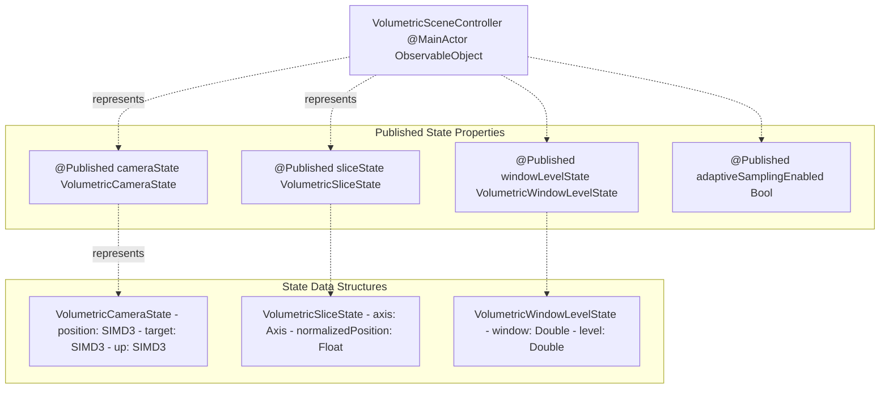
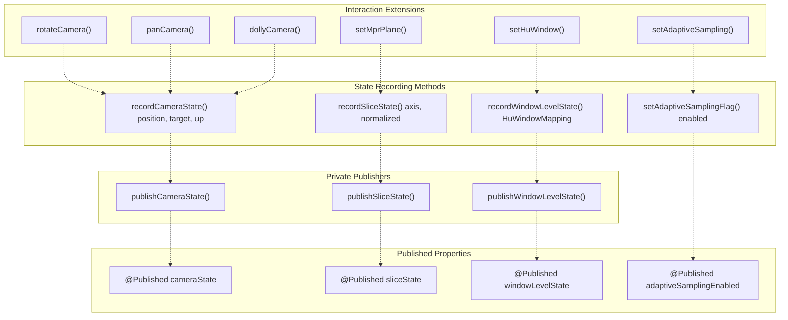
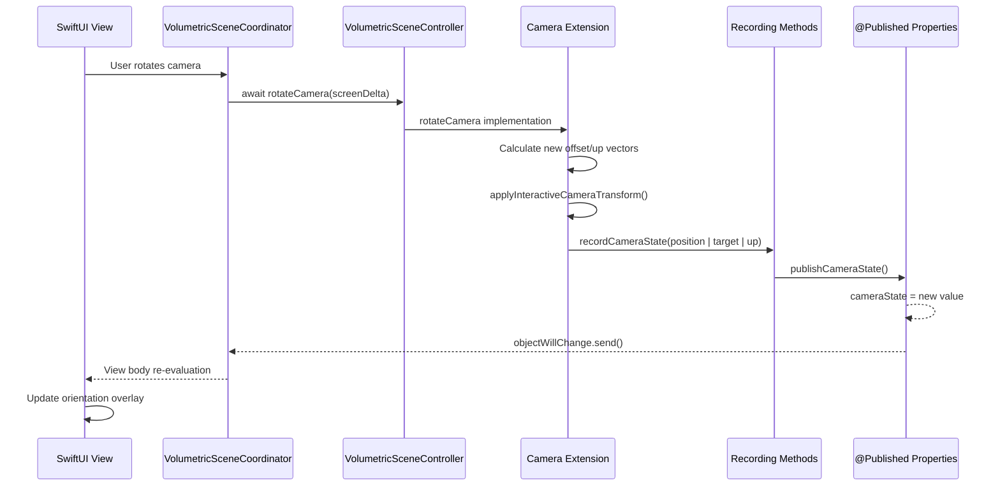
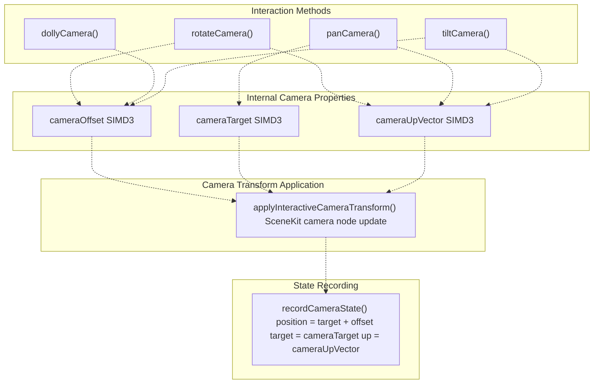
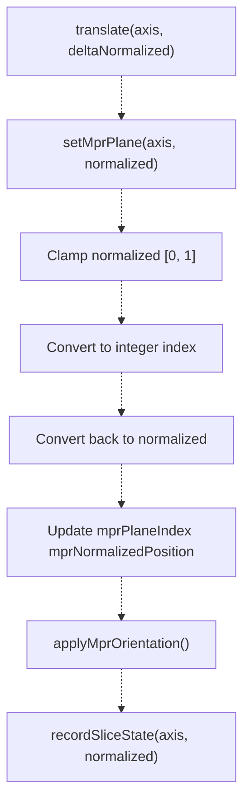
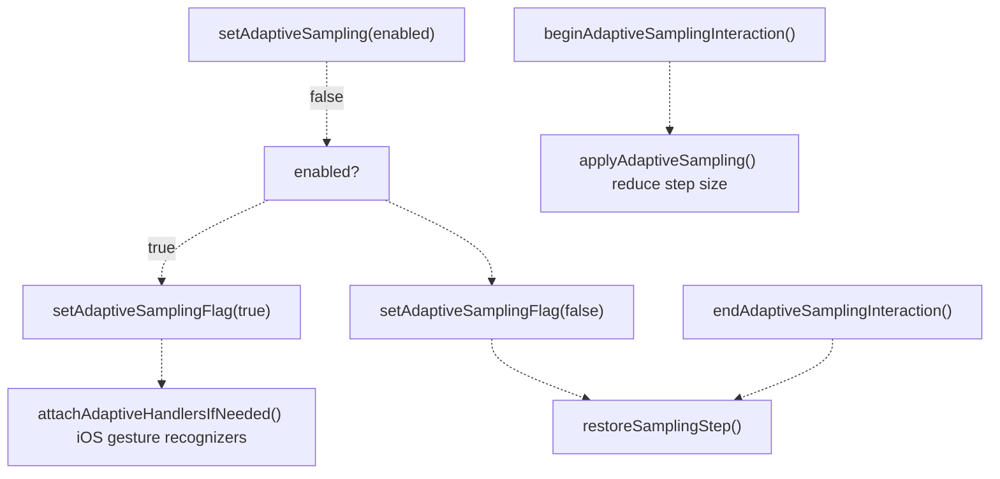
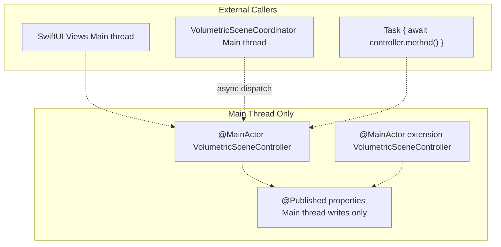
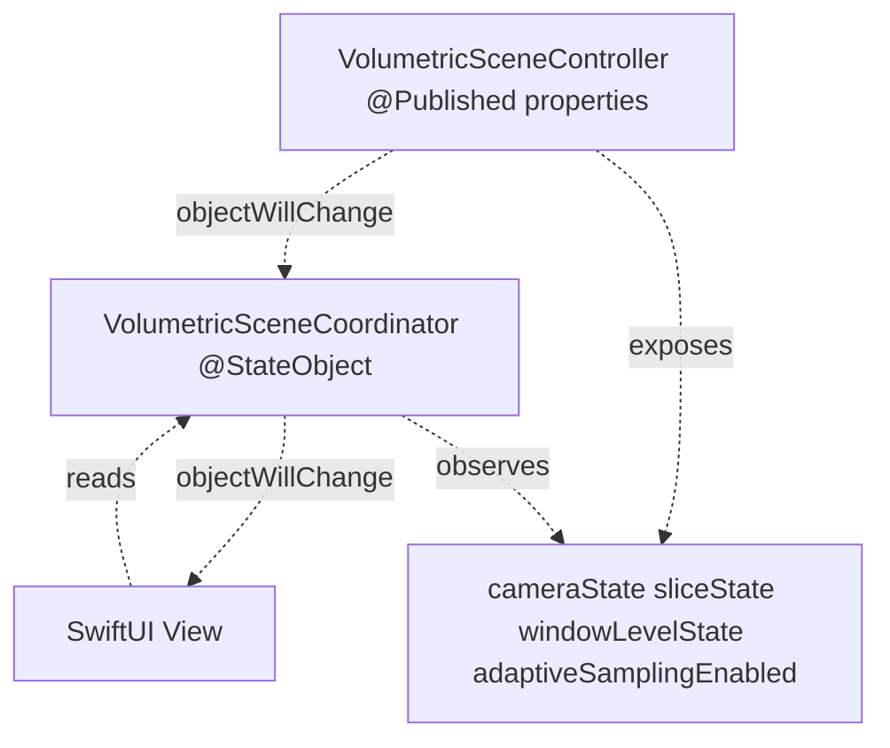
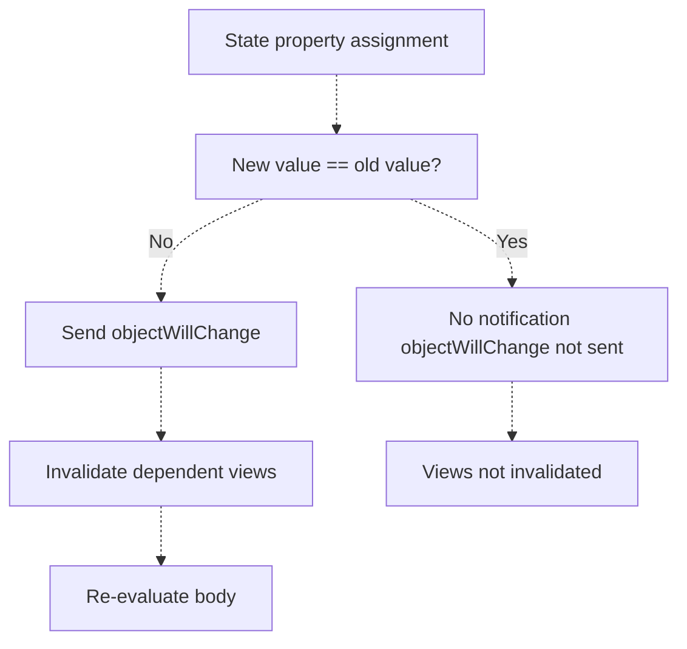
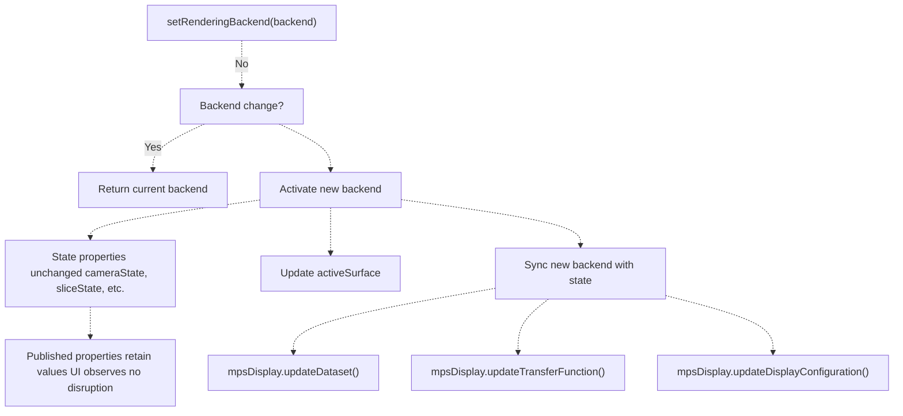

# State Management & Reactivity

> **Relevant source files**
> * [Sources/MTKUI/VolumetricSceneController+Interaction.swift](https://github.com/ThalesMMS/MTK/blob/eda6f990/Sources/MTKUI/VolumetricSceneController+Interaction.swift)
> * [Sources/MTKUI/VolumetricSceneController.swift](https://github.com/ThalesMMS/MTK/blob/eda6f990/Sources/MTKUI/VolumetricSceneController.swift)

## Purpose and Scope

This page documents the reactive state management system in `VolumetricSceneController`, which enables SwiftUI views to observe and respond to changes in camera position, slice navigation, window/level adjustments, and rendering performance modes. The controller publishes four distinct state streams using Combine's `@Published` property wrapper, allowing UI components to automatically update without manual refresh logic.

For the interaction methods that trigger state changes, see [Interaction API](3a%20Interaction-API.md). For how SwiftUI views consume these state streams, see [Coordinator Pattern & State Flow](6b%20Coordinator-Pattern-&-State-Flow.md). For UI components that observe this state, see [UI Overlays and Gestures](6c%20UI-Overlays-and-Gestures.md).

---

## Published State Properties

The `VolumetricSceneController` exposes four `@Published` properties that represent distinct aspects of the rendering system's state. These properties are marked `public private(set)`, allowing external observers to read and subscribe to changes while restricting direct modification to internal controller methods.

### State Property Overview



**Sources**: [Sources/MTKUI/VolumetricSceneController.swift L16-L49](https://github.com/ThalesMMS/MTK/blob/eda6f990/Sources/MTKUI/VolumetricSceneController.swift#L16-L49)

 [Sources/MTKUI/VolumetricSceneController.swift L277-L280](https://github.com/ThalesMMS/MTK/blob/eda6f990/Sources/MTKUI/VolumetricSceneController.swift#L277-L280)

### VolumetricCameraState

Represents the camera's spatial configuration in 3D world space. Updated approximately 60 times per second during interactive camera manipulation.

| Property | Type | Description |
| --- | --- | --- |
| `position` | `SIMD3<Float>` | Camera position in world coordinates |
| `target` | `SIMD3<Float>` | Point the camera is looking at |
| `up` | `SIMD3<Float>` | Camera's up vector for orientation |

**Sources**: [Sources/MTKUI/VolumetricSceneController.swift L16-L28](https://github.com/ThalesMMS/MTK/blob/eda6f990/Sources/MTKUI/VolumetricSceneController.swift#L16-L28)

### VolumetricSliceState

Tracks the current MPR (Multi-Planar Reconstruction) slice position when in slice viewing mode.

| Property | Type | Description |
| --- | --- | --- |
| `axis` | `VolumetricSceneController.Axis` | Slice axis (x, y, or z) |
| `normalizedPosition` | `Float` | Position along axis [0.0, 1.0] |

The `normalizedPosition` is clamped to [0, 1] during recording to ensure valid slice coordinates.

**Sources**: [Sources/MTKUI/VolumetricSceneController.swift L30-L39](https://github.com/ThalesMMS/MTK/blob/eda6f990/Sources/MTKUI/VolumetricSceneController.swift#L30-L39)

### VolumetricWindowLevelState

Represents the current Hounsfield Unit (HU) windowing configuration for CT data visualization, expressed in DICOM's window/level convention.

| Property | Type | Description |
| --- | --- | --- |
| `window` | `Double` | Width of the intensity range (maxHU - minHU) |
| `level` | `Double` | Center of the intensity range (minHU + width/2) |

This state is derived from `VolumeCubeMaterial.HuWindowMapping` and automatically converts between min/max representation and window/level representation.

**Sources**: [Sources/MTKUI/VolumetricSceneController.swift L41-L49](https://github.com/ThalesMMS/MTK/blob/eda6f990/Sources/MTKUI/VolumetricSceneController.swift#L41-L49)

### adaptiveSamplingEnabled

A Boolean flag indicating whether adaptive sampling optimization is currently active. When `true`, the controller reduces sampling step size during user interactions to maintain frame rate, then restores quality when interaction ends.

**Sources**: [Sources/MTKUI/VolumetricSceneController.swift L280](https://github.com/ThalesMMS/MTK/blob/eda6f990/Sources/MTKUI/VolumetricSceneController.swift#L280-L280)

---

## State Recording Mechanisms

The controller provides internal helper methods that enforce encapsulation while allowing interaction extensions to propagate state changes. These methods act as narrow interfaces to the `@Published` properties, ensuring state updates follow consistent patterns.



**Sources**: [Sources/MTKUI/VolumetricSceneController.swift L91-L134](https://github.com/ThalesMMS/MTK/blob/eda6f990/Sources/MTKUI/VolumetricSceneController.swift#L91-L134)

 [Sources/MTKUI/VolumetricSceneController L165-L253](https://github.com/ThalesMMS/MTK/blob/eda6f990/Sources/MTKUI/VolumetricSceneController+Interaction.swift#L165-L253)

### Recording Method Implementations

#### recordCameraState

```
@inline(__always)func recordCameraState(position: SIMD3<Float>, target: SIMD3<Float>, up: SIMD3<Float>) {    publishCameraState(position: position, target: target, up: up)}
```

Called by camera manipulation methods in `VolumetricSceneController+Camera.swift` after applying transformations to the SceneKit camera node. The inline hint ensures zero overhead for this delegation.

**Sources**: [Sources/MTKUI/VolumetricSceneController.swift L118-L121](https://github.com/ThalesMMS/MTK/blob/eda6f990/Sources/MTKUI/VolumetricSceneController.swift#L118-L121)

#### recordSliceState

```
@inline(__always)func recordSliceState(axis: Axis, normalized: Float) {    publishSliceState(axis: axis, normalized: normalized)}
```

Called by `setMprPlane(axis:normalized:)` after updating the MPR slice geometry. The `publishSliceState` implementation clamps the normalized position to [0, 1].

**Sources**: [Sources/MTKUI/VolumetricSceneController.swift L124-L127](https://github.com/ThalesMMS/MTK/blob/eda6f990/Sources/MTKUI/VolumetricSceneController.swift#L124-L127)

 [Sources/MTKUI/VolumetricSceneController L360-L373](https://github.com/ThalesMMS/MTK/blob/eda6f990/Sources/MTKUI/VolumetricSceneController+Interaction.swift#L360-L373)

#### recordWindowLevelState

```
@inline(__always)func recordWindowLevelState(_ mapping: VolumeCubeMaterial.HuWindowMapping) {    publishWindowLevelState(mapping)}
```

Called by `setHuWindow(_:)` after updating the material's HU range. Converts from min/max representation to window/level representation during publication.

**Sources**: [Sources/MTKUI/VolumetricSceneController.swift L130-L133](https://github.com/ThalesMMS/MTK/blob/eda6f990/Sources/MTKUI/VolumetricSceneController.swift#L130-L133)

 [Sources/MTKUI/VolumetricSceneController L439-L446](https://github.com/ThalesMMS/MTK/blob/eda6f990/Sources/MTKUI/VolumetricSceneController+Interaction.swift#L439-L446)

#### setAdaptiveSamplingFlag

```
@inline(__always)func setAdaptiveSamplingFlag(_ enabled: Bool) {    adaptiveSamplingEnabled = enabled}
```

Directly assigns to the published property. This is the only recording method that doesn't delegate to a separate publisher function, as no transformation is required.

**Sources**: [Sources/MTKUI/VolumetricSceneController.swift L112-L115](https://github.com/ThalesMMS/MTK/blob/eda6f990/Sources/MTKUI/VolumetricSceneController.swift#L112-L115)

---

## State Propagation Flow

State changes originate from user interactions processed by the controller's public API, flow through internal recording methods, and propagate to SwiftUI views via Combine publishers.



**Sources**: [Sources/MTKUI/VolumetricSceneController L165-L196](https://github.com/ThalesMMS/MTK/blob/eda6f990/Sources/MTKUI/VolumetricSceneController+Interaction.swift#L165-L196)

 [Sources/MTKUI/VolumetricSceneController L285-L310](https://github.com/ThalesMMS/MTK/blob/eda6f990/Sources/MTKUI/VolumetricSceneController+Camera.swift#L285-L310)

### Combine Integration

The `VolumetricSceneController` conforms to `ObservableObject`, which provides automatic integration with Combine. Each `@Published` property:

1. Generates a Combine `Publisher` accessible via `$propertyName`
2. Triggers `objectWillChange.send()` before value assignment
3. Batches rapid changes within a single run loop iteration
4. Delivers updates on the main thread (enforced by `@MainActor` annotation)

**Sources**: [Sources/MTKUI/VolumetricSceneController.swift L193](https://github.com/ThalesMMS/MTK/blob/eda6f990/Sources/MTKUI/VolumetricSceneController.swift#L193-L193)

---

## State Update Patterns

Different interaction methods follow distinct patterns for state updates based on their operational characteristics.

### Camera State Updates

Camera state updates occur continuously during interactive manipulation. The camera state represents derived values from three internal properties maintained by the controller:



**Update Frequency**: ~60 Hz during interaction
**Update Trigger**: Every camera manipulation method call
**Sources**: [Sources/MTKUI/VolumetricSceneController L285-L310](https://github.com/ThalesMMS/MTK/blob/eda6f990/Sources/MTKUI/VolumetricSceneController+Camera.swift#L285-L310)

 [Sources/MTKUI/VolumetricSceneController L165-L253](https://github.com/ThalesMMS/MTK/blob/eda6f990/Sources/MTKUI/VolumetricSceneController+Interaction.swift#L165-L253)

### Slice State Updates

Slice state updates occur when navigating MPR slices, either through explicit `setMprPlane` calls or delta adjustments via `translate`.



The double conversion (normalized → index → normalized) ensures SceneKit and MPS backends render the identical voxel, preventing sub-pixel discrepancies.

**Update Frequency**: On-demand
**Update Trigger**: User slice navigation or programmatic slice changes
**Sources**: [Sources/MTKUI/VolumetricSceneController L360-L379](https://github.com/ThalesMMS/MTK/blob/eda6f990/Sources/MTKUI/VolumetricSceneController+Interaction.swift#L360-L379)

### Window/Level State Updates

Window/level state updates occur when adjusting HU windowing parameters, either through explicit `setHuWindow` calls or interactive gestures.

| Method | Trigger | State Update |
| --- | --- | --- |
| `setHuWindow(_:)` | Direct window/level change | Immediate |
| `setPreset(_:)` | Transfer function preset load | Via internal `volumeMaterial.tf` update |
| `setShift(_:)` | Transfer function shift adjustment | Via internal `volumeMaterial.tf` update |
| `resetView()` | View reset action | Resets to dataset intensity range |

**Update Frequency**: On-demand
**Update Trigger**: HU windowing configuration changes
**Sources**: [Sources/MTKUI/VolumetricSceneController L439-L446](https://github.com/ThalesMMS/MTK/blob/eda6f990/Sources/MTKUI/VolumetricSceneController+Interaction.swift#L439-L446)

### Adaptive Sampling State Updates

Adaptive sampling state toggles are controlled by explicit API calls and gesture lifecycle events.



**Update Frequency**: Typically 2-4 times per interaction (enable → begin → end → disable)
**Update Trigger**: Gesture lifecycle or explicit enablement changes
**Sources**: [Sources/MTKUI/VolumetricSceneController L313-L332](https://github.com/ThalesMMS/MTK/blob/eda6f990/Sources/MTKUI/VolumetricSceneController+Interaction.swift#L313-L332)

---

## Thread Safety and Actor Isolation

The entire state management system operates on the main thread through Swift's `@MainActor` annotation, ensuring thread-safe access to both internal properties and published state.

### MainActor Enforcement



**Key Points**:

* All interaction methods are marked `@MainActor`, requiring callers to either be on the main thread or use `await` to hop to it
* SceneKit scene graph modifications occur on the main thread
* Published property mutations occur synchronously on the main thread
* No explicit locks or queues are needed

**Sources**: [Sources/MTKUI/VolumetricSceneController.swift L147](https://github.com/ThalesMMS/MTK/blob/eda6f990/Sources/MTKUI/VolumetricSceneController.swift#L147-L147)

 [Sources/MTKUI/VolumetricSceneController.swift L193](https://github.com/ThalesMMS/MTK/blob/eda6f990/Sources/MTKUI/VolumetricSceneController.swift#L193-L193)

 [Sources/MTKUI/VolumetricSceneController L28](https://github.com/ThalesMMS/MTK/blob/eda6f990/Sources/MTKUI/VolumetricSceneController+Interaction.swift#L28-L28)

---

## State Observation Patterns

SwiftUI views and coordinators observe published state through several standard patterns.

### Direct Property Observation

Views can access published properties directly when the controller is an `@ObservedObject` or owned by a `@StateObject` coordinator:

```
struct OverlayView: View {    @ObservedObject var controller: VolumetricSceneController        var body: some View {        Text("Camera: \(controller.cameraState.position)")    }}
```

The view's `body` is automatically re-evaluated when `cameraState` changes.

**Sources**: [Sources/MTKUI/VolumetricSceneController.swift L193](https://github.com/ThalesMMS/MTK/blob/eda6f990/Sources/MTKUI/VolumetricSceneController.swift#L193-L193)

### Coordinator-Mediated Observation

The `VolumetricSceneCoordinator` wraps the controller and can transform or filter state updates before exposing them to views:



**Sources**: See [Coordinator Pattern & State Flow](6b%20Coordinator-Pattern-&-State-Flow.md) for coordinator implementation details.

### Combine Publisher Subscription

Advanced use cases can subscribe to individual property publishers using Combine operators:

```
controller.$cameraState    .debounce(for: .milliseconds(100), scheduler: RunLoop.main)    .sink { newState in        // Handle debounced camera updates    }
```

This pattern is useful for operations that should not execute 60 times per second during camera manipulation.

---

## State Snapshot Structures

All published state types are value types (`struct`) that conform to `Equatable`, enabling SwiftUI's view diffing to minimize unnecessary re-renders.

### Equatable Conformance Benefits



**Performance Implications**:

* Rapid identical assignments (e.g., camera at rest) do not trigger view updates
* Structural equality checks prevent false-positive invalidations
* SwiftUI's view diffing further optimizes which view subtrees re-render

**Sources**: [Sources/MTKUI/VolumetricSceneController.swift L16-L49](https://github.com/ThalesMMS/MTK/blob/eda6f990/Sources/MTKUI/VolumetricSceneController.swift#L16-L49)

---

## Integration with Backend Switching

State is preserved across rendering backend switches (SceneKit ↔ MPS), ensuring UI continuity.



**Key Characteristic**: Backend switching is transparent to state observers. The camera position, slice index, and window/level settings remain unchanged, allowing smooth transitions between rendering paths.

**Sources**: [Sources/MTKUI/VolumetricSceneController L463-L519](https://github.com/ThalesMMS/MTK/blob/eda6f990/Sources/MTKUI/VolumetricSceneController+Interaction.swift#L463-L519)

---

## Stub Implementation for Unsupported Platforms

On platforms without SceneKit support (e.g., watchOS, tvOS), the controller provides a stub implementation that maintains published properties for API compatibility but performs no actual rendering.

The stub implementation:

* Declares all four `@Published` properties with default values
* Implements interaction methods as no-ops that update internal stub state
* Provides `StubSurface` conforming to `RenderSurface` protocol
* Allows UI code to compile and run without platform-specific conditionals

This design enables cross-platform SwiftUI code that references the controller without `#if os(iOS) || os(macOS)` guards at every call site.

**Sources**: [Sources/MTKUI/VolumetricSceneController.swift L492-L731](https://github.com/ThalesMMS/MTK/blob/eda6f990/Sources/MTKUI/VolumetricSceneController.swift#L492-L731)


### On this page

* [State Management & Reactivity](#3.4-state-management-reactivity)
* [Purpose and Scope](#3.4-purpose-and-scope)
* [Published State Properties](#3.4-published-state-properties)
* [State Property Overview](#3.4-state-property-overview)
* [VolumetricCameraState](#3.4-volumetriccamerastate)
* [VolumetricSliceState](#3.4-volumetricslicestate)
* [VolumetricWindowLevelState](#3.4-volumetricwindowlevelstate)
* [adaptiveSamplingEnabled](#3.4-adaptivesamplingenabled)
* [State Recording Mechanisms](#3.4-state-recording-mechanisms)
* [Recording Method Implementations](#3.4-recording-method-implementations)
* [State Propagation Flow](#3.4-state-propagation-flow)
* [Combine Integration](#3.4-combine-integration)
* [State Update Patterns](#3.4-state-update-patterns)
* [Camera State Updates](#3.4-camera-state-updates)
* [Slice State Updates](#3.4-slice-state-updates)
* [Window/Level State Updates](#3.4-windowlevel-state-updates)
* [Adaptive Sampling State Updates](#3.4-adaptive-sampling-state-updates)
* [Thread Safety and Actor Isolation](#3.4-thread-safety-and-actor-isolation)
* [MainActor Enforcement](#3.4-mainactor-enforcement)
* [State Observation Patterns](#3.4-state-observation-patterns)
* [Direct Property Observation](#3.4-direct-property-observation)
* [Coordinator-Mediated Observation](#3.4-coordinator-mediated-observation)
* [Combine Publisher Subscription](#3.4-combine-publisher-subscription)
* [State Snapshot Structures](#3.4-state-snapshot-structures)
* [Equatable Conformance Benefits](#3.4-equatable-conformance-benefits)
* [Integration with Backend Switching](#3.4-integration-with-backend-switching)
* [Stub Implementation for Unsupported Platforms](#3.4-stub-implementation-for-unsupported-platforms)

Ask Devin about MTK