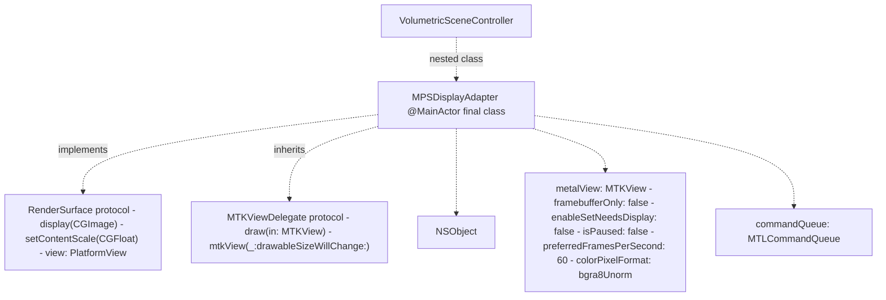
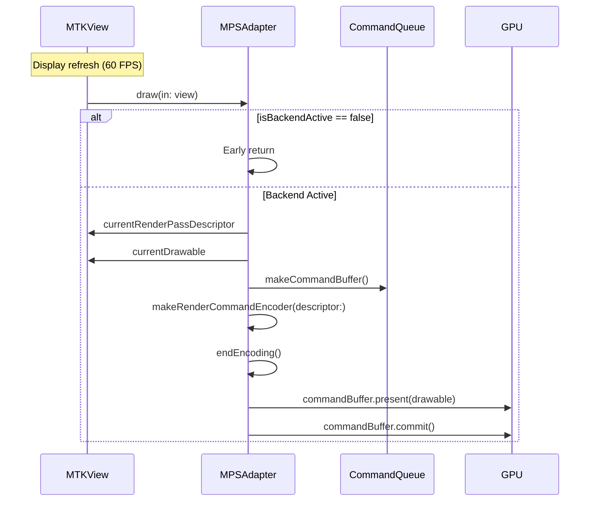
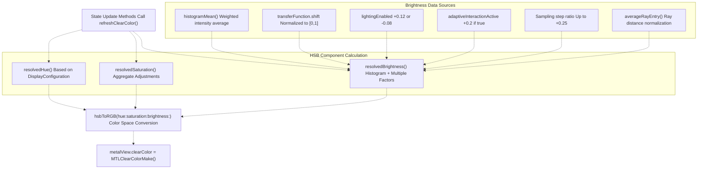
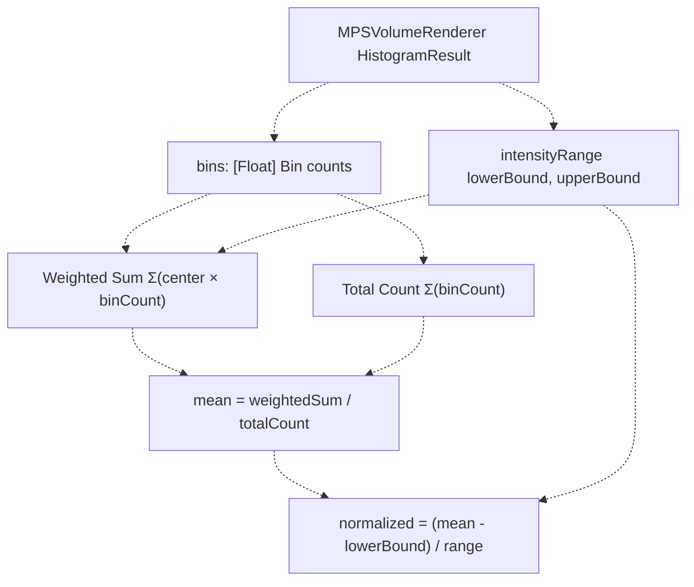
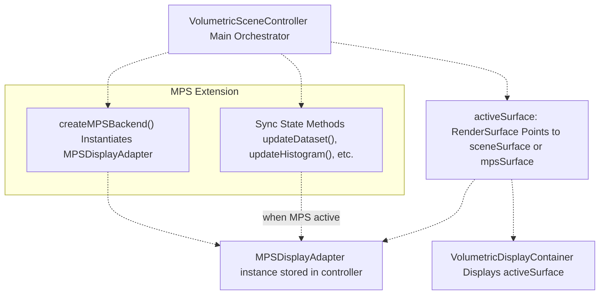

# MPS Display Adapter

> **Relevant source files**
> * [Sources/MTKUI/VolumetricSceneController+MPS.swift](https://github.com/ThalesMMS/MTK/blob/eda6f990/Sources/MTKUI/VolumetricSceneController+MPS.swift)

## Purpose and Scope

The **MPS Display Adapter** is a nested class within `VolumetricSceneController` that manages the Metal Performance Shaders (MPS) rendering backend's display surface. It implements the `RenderSurface` protocol to provide framework-agnostic image display capabilities and the `MTKViewDelegate` protocol to manage Metal rendering lifecycle. The adapter's primary responsibility is calculating **dynamic clear colors** that provide visual feedback about the current rendering state, including histogram analysis, adaptive sampling status, and ray casting cache information.

This document focuses on the `MPSDisplayAdapter` class implementation. For information about the MPS rendering pipeline itself, see [Metal Performance Shaders Backend](2b%20Metal-Performance-Shaders-Backend.md). For the dual-backend architecture that switches between SceneKit and MPS, see [Rendering Architecture](2%20Rendering-Architecture.md). For the broader VolumetricSceneController architecture, see [VolumetricSceneController](3%20VolumetricSceneController.md).

**Sources**: [Sources/MTKUI/VolumetricSceneController L1-L334](https://github.com/ThalesMMS/MTK/blob/eda6f990/Sources/MTKUI/VolumetricSceneController+MPS.swift#L1-L334)

---

## Class Architecture

### Type Declaration and Protocol Conformance



The `MPSDisplayAdapter` is declared as a `@MainActor public final class` nested within `VolumetricSceneController`. This design ensures:

* **Thread Safety**: `@MainActor` isolation guarantees all state mutations occur on the main thread
* **Encapsulation**: As a nested class, it has access to controller internals while remaining organizationally distinct
* **Protocol Conformance**: Implements both `RenderSurface` for framework abstraction and `MTKViewDelegate` for Metal rendering callbacks
* **NSObject Inheritance**: Required for Objective-C protocol conformance (`MTKViewDelegate`)

**Sources**: [Sources/MTKUI/VolumetricSceneController L27-L62](https://github.com/ThalesMMS/MTK/blob/eda6f990/Sources/MTKUI/VolumetricSceneController+MPS.swift#L27-L62)

---

## State Management

### State Properties

The adapter maintains comprehensive rendering state synchronized from the parent controller:

| Property | Type | Purpose |
| --- | --- | --- |
| `metalView` | `MTKView` | Metal-backed rendering surface |
| `commandQueue` | `MTLCommandQueue` | Command buffer submission |
| `histogram` | `MPSVolumeRenderer.HistogramResult?` | Intensity distribution data |
| `dataset` | `VolumeDataset?` | Current volume data |
| `transferFunction` | `TransferFunction?` | Intensity-to-color mapping |
| `configuration` | `DisplayConfiguration?` | Display mode (volume/MPR) |
| `volumeMethod` | `VolumeCubeMaterial.Method` | Rendering technique (DVR/MIP) |
| `renderMode` | `VolumetricRenderMode` | Active/paused state |
| `lightingEnabled` | `Bool` | Lighting contribution flag |
| `huGateEnabled` | `Bool` | HU gating active flag |
| `huWindow` | `(min: Int32, max: Int32)?` | HU window range |
| `adaptiveSamplingEnabled` | `Bool` | Adaptive sampling flag |
| `adaptiveSamplingStep` | `Float` | Reduced sampling step during interaction |
| `samplingStep` | `Float` | Normal sampling step size |
| `projectionsUseTransferFunction` | `Bool` | Projection coloring mode |
| `densityGate` | `(floor: Float, ceil: Float)` | Opacity thresholds |
| `projectionHuGate` | `(enabled: Bool, min: Int32, max: Int32)` | Projection HU filtering |
| `adaptiveInteractionActive` | `Bool` | Gesture interaction status |
| `isBackendActive` | `Bool` | MPS backend activation flag |
| `raySamples` | `[MPSVolumeRenderer.RayCastingSample]` | Ray casting cache data |

**Sources**: [Sources/MTKUI/VolumetricSceneController L28-L47](https://github.com/ThalesMMS/MTK/blob/eda6f990/Sources/MTKUI/VolumetricSceneController+MPS.swift#L28-L47)

### State Synchronization Methods

```mermaid
flowchart TD

Controller["VolumetricSceneController"]
UpdateDataset["updateDataset(_:)"]
UpdateHistogram["updateHistogram(_:)"]
UpdateTransferFunction["updateTransferFunction(_:)"]
UpdateDisplayConfig["updateDisplayConfiguration(_:)"]
UpdateVolumeMethod["updateVolumeMethod(_:)"]
UpdateHuGate["updateHuGate(enabled:)"]
UpdateHuWindow["updateHuWindow(min:max:)"]
UpdateAdaptiveSampling["updateAdaptiveSampling(_:)"]
UpdateSamplingStep["updateSamplingStep(_:)"]
UpdateLighting["updateLighting(enabled:)"]
SetAdaptiveInteraction["setAdaptiveInteraction(isActive:)"]
SetRenderMode["setRenderMode(_:)"]
SetActive["setActive(_:)"]
UpdateRayCasting["updateRayCasting(samples:)"]
RefreshClearColor["refreshClearColor() Recalculates MTKView.clearColor"]

Controller -.->|"calls"| UpdateDataset
Controller -.->|"calls"| UpdateHistogram
Controller -.->|"calls"| UpdateTransferFunction
Controller -.->|"calls"| UpdateDisplayConfig
Controller -.->|"calls"| UpdateVolumeMethod
Controller -.->|"calls"| UpdateHuGate
Controller -.->|"calls"| UpdateHuWindow
Controller -.->|"calls"| UpdateAdaptiveSampling
Controller -.->|"calls"| UpdateSamplingStep
Controller -.-> UpdateLighting
Controller -.->|"calls"| SetAdaptiveInteraction
Controller -.-> SetRenderMode
Controller -.->|"calls"| SetActive
Controller -.-> UpdateRayCasting
UpdateDataset -.-> RefreshClearColor
UpdateHistogram -.-> RefreshClearColor
UpdateTransferFunction -.-> RefreshClearColor
UpdateDisplayConfig -.-> RefreshClearColor
UpdateVolumeMethod -.-> RefreshClearColor
UpdateHuGate -.-> RefreshClearColor
UpdateHuWindow -.-> RefreshClearColor
UpdateAdaptiveSampling -.-> RefreshClearColor
UpdateSamplingStep -.-> RefreshClearColor
UpdateLighting -.-> RefreshClearColor
SetAdaptiveInteraction -.-> RefreshClearColor
SetActive -.-> RefreshClearColor
UpdateRayCasting -.-> RefreshClearColor

subgraph subGraph0 ["MPSDisplayAdapter State Update Methods"]
    UpdateDataset
    UpdateHistogram
    UpdateTransferFunction
    UpdateDisplayConfig
    UpdateVolumeMethod
    UpdateHuGate
    UpdateHuWindow
    UpdateAdaptiveSampling
    UpdateSamplingStep
    UpdateLighting
    SetAdaptiveInteraction
    SetRenderMode
    SetActive
    UpdateRayCasting
end
```



Each state update method follows the same pattern: store the new value and call `refreshClearColor()` to recalculate the dynamic clear color. This ensures the clear color always reflects the current rendering state.

Notable state management behaviors:

* **`setRenderMode()`**: Updates `metalView.isPaused` based on mode and backend activation state
* **`setActive()`**: Controls `metalView.isHidden` and pause state, only allowing rendering when the MPS backend is active
* **`updateDisplayConfiguration()`**: Extracts `volumeMethod` from volume configurations

**Sources**: [Sources/MTKUI/VolumetricSceneController L67-L186](https://github.com/ThalesMMS/MTK/blob/eda6f990/Sources/MTKUI/VolumetricSceneController+MPS.swift#L67-L186)

---

## RenderSurface Protocol Implementation

### Display Methods

```
public func display(_ image: CGImage)public func setContentScale(_ scale: CGFloat)public var view: PlatformView { metalView }
```

The adapter implements the `RenderSurface` protocol to provide platform-agnostic image display:

**`display(_:)`** ([Sources/MTKUI/VolumetricSceneController L74-L80](https://github.com/ThalesMMS/MTK/blob/eda6f990/Sources/MTKUI/VolumetricSceneController+MPS.swift#L74-L80)

):

* Assigns the provided `CGImage` to the `MTKView.layer.contents`
* Platform-specific access: macOS uses optional chaining (`layer?`), iOS uses direct property access
* Allows the MPS renderer to present rendered frames directly to the view layer

**`setContentScale(_:)`** ([Sources/MTKUI/VolumetricSceneController L82-L88](https://github.com/ThalesMMS/MTK/blob/eda6f990/Sources/MTKUI/VolumetricSceneController+MPS.swift#L82-L88)

):

* Sets the view's content scale factor for high-DPI displays
* iOS: `contentScaleFactor` property
* macOS: `layer.contentsScale` property
* Ensures proper pixel density for retina displays

**`view` property** ([Sources/MTKUI/VolumetricSceneController L64](https://github.com/ThalesMMS/MTK/blob/eda6f990/Sources/MTKUI/VolumetricSceneController+MPS.swift#L64-L64)

):

* Returns the underlying `MTKView` as a `PlatformView` (UIView on iOS, NSView on macOS)
* Enables framework-agnostic view hierarchy integration

**Sources**: [Sources/MTKUI/VolumetricSceneController L64-L88](https://github.com/ThalesMMS/MTK/blob/eda6f990/Sources/MTKUI/VolumetricSceneController+MPS.swift#L64-L88)

---

## MTKViewDelegate Implementation

### Rendering Callback



The `draw(in:)` method ([Sources/MTKUI/VolumetricSceneController L188-L201](https://github.com/ThalesMMS/MTK/blob/eda6f990/Sources/MTKUI/VolumetricSceneController+MPS.swift#L188-L201)

) implements the rendering callback:

1. **Backend Check**: Returns immediately if `isBackendActive` is false
2. **Resource Acquisition**: Obtains render pass descriptor, drawable, and command buffer
3. **Encoding**: Creates a render command encoder (currently empty, as actual rendering occurs via `display(_:)`)
4. **Presentation**: Presents the drawable to the screen
5. **Submission**: Commits the command buffer to the GPU

The method `mtkView(_:drawableSizeWillChange:)` ([Sources/MTKUI/VolumetricSceneController L203-L205](https://github.com/ThalesMMS/MTK/blob/eda6f990/Sources/MTKUI/VolumetricSceneController+MPS.swift#L203-L205)

) is a no-op, as the adapter does not currently respond to drawable size changes.

**Note**: The actual MPS rendering occurs through the `MPSVolumeRenderer` which writes to textures displayed via `display(_:)`. The `draw(in:)` callback primarily manages the presentation layer.

**Sources**: [Sources/MTKUI/VolumetricSceneController L188-L205](https://github.com/ThalesMMS/MTK/blob/eda6f990/Sources/MTKUI/VolumetricSceneController+MPS.swift#L188-L205)

---

## Dynamic Clear Color System

### Color Calculation Pipeline



The dynamic clear color system provides **visual feedback** about the current rendering state through background color variations. The color is recalculated whenever any relevant state changes.

**Sources**: [Sources/MTKUI/VolumetricSceneController L222-L328](https://github.com/ThalesMMS/MTK/blob/eda6f990/Sources/MTKUI/VolumetricSceneController+MPS.swift#L222-L328)

### Hue Resolution

**Method**: `resolvedHue()` ([Sources/MTKUI/VolumetricSceneController L230-L239](https://github.com/ThalesMMS/MTK/blob/eda6f990/Sources/MTKUI/VolumetricSceneController+MPS.swift#L230-L239)

)

Hue selection is based on the current display configuration:

| Configuration | Hue Value | Color Region |
| --- | --- | --- |
| `.volume` | 0.58 | Cyan-blue range |
| `.mpr` | 0.08 | Orange-yellow range |
| `.none` (fallback) | 0.58 | Cyan-blue range |

The `hue(for:)` helper method ([Sources/MTKUI/VolumetricSceneController L241-L243](https://github.com/ThalesMMS/MTK/blob/eda6f990/Sources/MTKUI/VolumetricSceneController+MPS.swift#L241-L243)

) currently returns a constant 0.58 regardless of the volume rendering method, but provides an extension point for method-specific hue customization.

**Sources**: [Sources/MTKUI/VolumetricSceneController L230-L243](https://github.com/ThalesMMS/MTK/blob/eda6f990/Sources/MTKUI/VolumetricSceneController+MPS.swift#L230-L243)

### Saturation Resolution

**Method**: `resolvedSaturation()` ([Sources/MTKUI/VolumetricSceneController L245-L263](https://github.com/ThalesMMS/MTK/blob/eda6f990/Sources/MTKUI/VolumetricSceneController+MPS.swift#L245-L263)

)

Saturation is calculated as:

```
saturation = base + gateAdjustment + adaptiveAdjustment + interactionAdjustment + projectionAdjustment
saturation = clamp(saturation, 0.05, 1.0)
```

**Base Saturation**:

* Volume configuration: 0.65
* MPR configuration: 0.35
* No configuration: 0.40

**Adjustments**:

| Factor | Adjustment | Effect |
| --- | --- | --- |
| HU Gate Enabled | +0.05 | Higher color purity with gating |
| HU Gate Disabled | -0.10 | Reduced saturation without gating |
| Adaptive Sampling Enabled | 0 | Neutral |
| Adaptive Sampling Disabled | -0.10 | Less saturated |
| Adaptive Interaction Active | -0.25 | Significantly desaturated during gestures |
| Projections Use Transfer Function | +0.10 | More vibrant for colored projections |

The saturation adjustments provide immediate visual feedback about:

* **Performance mode**: Lower saturation during adaptive interaction indicates reduced quality
* **Feature activation**: HU gating and transfer function usage increase color intensity
* **Rendering complexity**: Disabled adaptive sampling signals full-quality rendering

**Sources**: [Sources/MTKUI/VolumetricSceneController L245-L263](https://github.com/ThalesMMS/MTK/blob/eda6f990/Sources/MTKUI/VolumetricSceneController+MPS.swift#L245-L263)

### Brightness Resolution

**Method**: `resolvedBrightness()` ([Sources/MTKUI/VolumetricSceneController L265-L278](https://github.com/ThalesMMS/MTK/blob/eda6f990/Sources/MTKUI/VolumetricSceneController+MPS.swift#L265-L278)

)

Brightness is the most complex component, incorporating histogram analysis and multiple rendering factors:

```yaml
brightness = base + lighting + adaptive + stepImpact + rayContribution
brightness = clamp(brightness, 0.1, 1.0)

where:
  base = 0.35 + (histogramMean * 0.45) + (transferShift * 0.25)
```

**Base Brightness Calculation**:

1. **Constant offset**: 0.35 (minimum brightness floor)
2. **Histogram contribution**: `histogramMean()` × 0.45 (up to 45% contribution from intensity distribution)
3. **Transfer function shift**: Normalized shift value × 0.25 (up to 25% from viewing window)

**Contributions**:

| Factor | Calculation | Range | Impact |
| --- | --- | --- | --- |
| Lighting | `lightingEnabled ? 0.12 : -0.08` | [-0.08, 0.12] | Brighter with lighting |
| Adaptive Interaction | `adaptiveInteractionActive ? 0.2 : 0` | [0, 0.2] | Brighter during gestures (visibility) |
| Step Impact | `1 - (adaptiveSamplingStep / max(samplingStep, 1))` | [0, 0.25] | Indicates quality reduction |
| Ray Contribution | `averageRayEntry()` | [0, 0.15] | Ray casting depth feedback |

**Sources**: [Sources/MTKUI/VolumetricSceneController L265-L278](https://github.com/ThalesMMS/MTK/blob/eda6f990/Sources/MTKUI/VolumetricSceneController+MPS.swift#L265-L278)

### Histogram Mean Calculation

**Method**: `histogramMean()` ([Sources/MTKUI/VolumetricSceneController L288-L303](https://github.com/ThalesMMS/MTK/blob/eda6f990/Sources/MTKUI/VolumetricSceneController+MPS.swift#L288-L303)

)



The histogram mean calculation:

1. **Validation**: Returns 0.45 (neutral) if histogram is missing, empty, or has invalid range
2. **Step Calculation**: `step = range / binCount`
3. **Weighted Sum**: For each bin, `center = lowerBound + (index + 0.5) × step`, accumulate `center × binCount`
4. **Mean Calculation**: `mean = weightedSum / totalCount`
5. **Normalization**: `normalized = (mean - lowerBound) / range` to [0, 1]

This provides a **data-driven brightness adjustment** based on the actual intensity distribution of the volume dataset.

**Sources**: [Sources/MTKUI/VolumetricSceneController L288-L303](https://github.com/ThalesMMS/MTK/blob/eda6f990/Sources/MTKUI/VolumetricSceneController+MPS.swift#L288-L303)

### Ray Entry Average

**Method**: `averageRayEntry()` ([Sources/MTKUI/VolumetricSceneController L280-L286](https://github.com/ThalesMMS/MTK/blob/eda6f990/Sources/MTKUI/VolumetricSceneController+MPS.swift#L280-L286)

)

Calculates the average entry distance from ray casting samples:

1. **Empty Check**: Returns 0 if no ray samples exist
2. **Sum Entry Distances**: `total = Σ(sample.entryDistance)`
3. **Average**: `average = total / sampleCount`
4. **Normalize**: `normalized = clamp(average / max(1, adaptiveSamplingStep), 0, 1)`
5. **Scale**: `result = normalized × 0.5` (contributes up to 0.15 to brightness)

This provides visual feedback about **ray casting cache depth**, useful for debugging and understanding the volume's spatial extent.

**Sources**: [Sources/MTKUI/VolumetricSceneController L280-L286](https://github.com/ThalesMMS/MTK/blob/eda6f990/Sources/MTKUI/VolumetricSceneController+MPS.swift#L280-L286)

### HSB to RGB Conversion

**Method**: `hsbToRGB(hue:saturation:brightness:)` ([Sources/MTKUI/VolumetricSceneController L305-L328](https://github.com/ThalesMMS/MTK/blob/eda6f990/Sources/MTKUI/VolumetricSceneController+MPS.swift#L305-L328)

)

Standard HSB-to-RGB conversion algorithm:

1. **Hue Normalization**: `h = (hue - floor(hue)) × 6` (maps to [0, 6) range)\n2. **Chroma**](https://github.com/ThalesMMS/MTK/blob/eda6f990/0,%206) range)\n2. **Chroma**#LNaN-LNaN)

---

## MTKView Configuration

### Initialization Settings

The `MTKView` is configured in `init(device:commandQueue:)` ([Sources/MTKUI/VolumetricSceneController L49-L62](https://github.com/ThalesMMS/MTK/blob/eda6f990/Sources/MTKUI/VolumetricSceneController+MPS.swift#L49-L62)

):

```
metalView.translatesAutoresizingMaskIntoConstraints = false  // Enable Auto LayoutmetalView.framebufferOnly = false                             // Allow texture readingmetalView.enableSetNeedsDisplay = false                       // Continuous renderingmetalView.isPaused = false                                    // Active by defaultmetalView.preferredFramesPerSecond = 60                       // 60 FPS targetmetalView.colorPixelFormat = .bgra8Unorm                      // 8-bit BGRA formatmetalView.clearColor = MTLClearColorMake(0, 0, 0, 1)         // Initial blackmetalView.delegate = self                                     // Set delegatemetalView.isHidden = true                                     // Hidden until activated
```

**Key Configuration Decisions**:

| Setting | Value | Rationale |
| --- | --- | --- |
| `framebufferOnly` | `false` | Allows reading texture contents for display via `display(_:)` |
| `enableSetNeedsDisplay` | `false` | Continuous rendering mode (not on-demand) |
| `preferredFramesPerSecond` | `60` | Standard refresh rate for interactive volumetric rendering |
| `colorPixelFormat` | `.bgra8Unorm` | Standard 8-bit BGRA format compatible with Core Graphics |
| `isHidden` | `true` | View hidden until `setActive(true)` is called |

**Sources**: [Sources/MTKUI/VolumetricSceneController L49-L62](https://github.com/ThalesMMS/MTK/blob/eda6f990/Sources/MTKUI/VolumetricSceneController+MPS.swift#L49-L62)

---

## Testing Support

### Debug Methods

The adapter exposes three `@_spi(Testing)` methods for internal testing:

**`debugTransferFunction()`** ([Sources/MTKUI/VolumetricSceneController L207-L210](https://github.com/ThalesMMS/MTK/blob/eda6f990/Sources/MTKUI/VolumetricSceneController+MPS.swift#L207-L210)

):

* Returns the current `TransferFunction?` stored in the adapter
* Allows verification of transfer function synchronization

**`debugClearColor()`** ([Sources/MTKUI/VolumetricSceneController L212-L215](https://github.com/ThalesMMS/MTK/blob/eda6f990/Sources/MTKUI/VolumetricSceneController+MPS.swift#L212-L215)

):

* Returns the current `MTLClearColor` of the `metalView`
* Enables testing of clear color calculation logic

**`debugResolvedBrightness()`** ([Sources/MTKUI/VolumetricSceneController L217-L220](https://github.com/ThalesMMS/MTK/blob/eda6f990/Sources/MTKUI/VolumetricSceneController+MPS.swift#L217-L220)

):

* Returns the result of `resolvedBrightness()` calculation
* Facilitates unit testing of brightness computation

These methods are marked with `@_spi(Testing)` to indicate they are internal APIs used for testing and should not be relied upon by external consumers.

**Sources**: [Sources/MTKUI/VolumetricSceneController L207-L220](https://github.com/ThalesMMS/MTK/blob/eda6f990/Sources/MTKUI/VolumetricSceneController+MPS.swift#L207-L220)

---

## Integration with VolumetricSceneController

### Backend Coordination



The `MPSDisplayAdapter` is created during controller initialization and managed through the MPS extension. When the MPS backend is active:

1. **`setActive(true)`** is called on the adapter
2. **`controller.activeSurface`** points to `mpsSurface` (which wraps the adapter)
3. **`VolumetricDisplayContainer`** displays the adapter's `MTKView`
4. **State updates** from the controller are synchronized to the adapter
5. **`refreshClearColor()`** provides continuous visual feedback

The adapter's clear color serves as a **visual debugging aid** and **user feedback mechanism**, conveying information about histogram distribution, rendering quality, interaction state, and active features through subtle background color variations.

**Sources**: [Sources/MTKUI/VolumetricSceneController L1-L334](https://github.com/ThalesMMS/MTK/blob/eda6f990/Sources/MTKUI/VolumetricSceneController+MPS.swift#L1-L334)

---

## Summary

The `MPSDisplayAdapter` is a sophisticated display management component that:

* **Implements Protocol Abstractions**: Conforms to `RenderSurface` for framework independence and `MTKViewDelegate` for Metal rendering
* **Manages MTKView Lifecycle**: Configures and controls the Metal-backed rendering surface
* **Provides Visual Feedback**: Calculates dynamic clear colors based on histogram data, rendering state, and user interaction
* **Synchronizes State**: Maintains rendering parameters in sync with the parent controller
* **Enables Testing**: Exposes internal state through SPI methods for unit testing

The dynamic clear color system is particularly noteworthy, using **HSB color space adjustments** to encode multiple dimensions of rendering state into a single background color, providing developers and users with immediate visual feedback about the system's operational state.

**Sources**: [Sources/MTKUI/VolumetricSceneController L1-L334](https://github.com/ThalesMMS/MTK/blob/eda6f990/Sources/MTKUI/VolumetricSceneController+MPS.swift#L1-L334)


### On this page

* [MPS Display Adapter](#3.5-mps-display-adapter)
* [Purpose and Scope](#3.5-purpose-and-scope)
* [Class Architecture](#3.5-class-architecture)
* [Type Declaration and Protocol Conformance](#3.5-type-declaration-and-protocol-conformance)
* [State Management](#3.5-state-management)
* [State Properties](#3.5-state-properties)
* [State Synchronization Methods](#3.5-state-synchronization-methods)
* [RenderSurface Protocol Implementation](#3.5-rendersurface-protocol-implementation)
* [Display Methods](#3.5-display-methods)
* [MTKViewDelegate Implementation](#3.5-mtkviewdelegate-implementation)
* [Rendering Callback](#3.5-rendering-callback)
* [Dynamic Clear Color System](#3.5-dynamic-clear-color-system)
* [Color Calculation Pipeline](#3.5-color-calculation-pipeline)
* [Hue Resolution](#3.5-hue-resolution)
* [Saturation Resolution](#3.5-saturation-resolution)
* [Brightness Resolution](#3.5-brightness-resolution)
* [Histogram Mean Calculation](#3.5-histogram-mean-calculation)
* [Ray Entry Average](#3.5-ray-entry-average)
* [HSB to RGB Conversion](#3.5-hsb-to-rgb-conversion)
* [MTKView Configuration](#3.5-mtkview-configuration)
* [Initialization Settings](#3.5-initialization-settings)
* [Testing Support](#3.5-testing-support)
* [Debug Methods](#3.5-debug-methods)
* [Integration with VolumetricSceneController](#3.5-integration-with-volumetricscenecontroller)
* [Backend Coordination](#3.5-backend-coordination)
* [Summary](#3.5-summary)

Ask Devin about MTK