# Helper Utilities

> **Relevant source files**
> * [Sources/MTKUI/VolumetricSceneController+Helpers.swift](https://github.com/ThalesMMS/MTK/blob/eda6f990/Sources/MTKUI/VolumetricSceneController+Helpers.swift)

## Purpose and Scope

This page documents the mathematical and geometric utility functions used throughout `VolumetricSceneController`. These helpers provide safe, reusable operations for vector mathematics, coordinate transformations, and SceneKit integration. They are implemented as extensions and standalone functions across two files: [Sources/MTKUI/VolumetricSceneController+Helpers.swift](https://github.com/ThalesMMS/MTK/blob/eda6f990/Sources/MTKUI/VolumetricSceneController+Helpers.swift)

 and helper functions in [Sources/MTKUI/VolumetricSceneController+Camera.swift](https://github.com/ThalesMMS/MTK/blob/eda6f990/Sources/MTKUI/VolumetricSceneController+Camera.swift)

For information about how these utilities are used in camera operations, see [Camera Management](3b%20Camera-Management.md). For coordinate system concepts and transformations, see [Coordinate Systems](9e%20Coordinate-System-Transformations.md).

---

## Utility Categories

The helper system is organized into several functional categories:

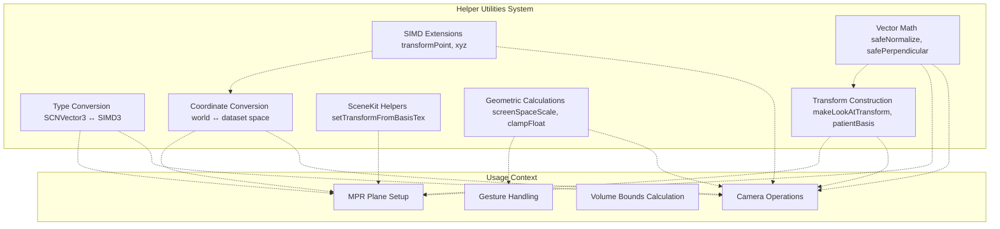

**Sources:** [Sources/MTKUI/VolumetricSceneController L1-L61](https://github.com/ThalesMMS/MTK/blob/eda6f990/Sources/MTKUI/VolumetricSceneController+Helpers.swift#L1-L61)

 [Sources/MTKUI/VolumetricSceneController L1-L723](https://github.com/ThalesMMS/MTK/blob/eda6f990/Sources/MTKUI/VolumetricSceneController+Camera.swift#L1-L723)

---

## Type Conversion Utilities

These utilities bridge between SceneKit's `SCNVector3` type and SIMD vector types, enabling seamless interoperability.

### SCNVector3 SIMD Initialization

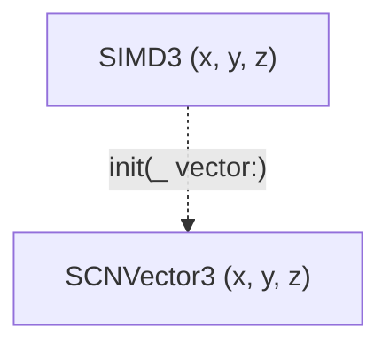

**Implementation:**

| Function | Location | Description |
| --- | --- | --- |
| `SCNVector3.init(_ vector: SIMD3<Float>)` | [Sources/MTKUI/VolumetricSceneController L18-L22](https://github.com/ThalesMMS/MTK/blob/eda6f990/Sources/MTKUI/VolumetricSceneController+Helpers.swift#L18-L22) | Private extension for creating `SCNVector3` from `SIMD3<Float>` |

**Usage Pattern:**

```
let simdVector = SIMD3<Float>(1.0, 2.0, 3.0)let scnVector = SCNVector3(simdVector)  // Converts to SceneKit format
```

### SIMD4 Component Extraction

The `xyz` computed property extracts the first three components from a 4-component vector:

| Extension | Location | Description |
| --- | --- | --- |
| `SIMD4.xyz` | [Sources/MTKUI/VolumetricSceneController L30-L32](https://github.com/ThalesMMS/MTK/blob/eda6f990/Sources/MTKUI/VolumetricSceneController+Helpers.swift#L30-L32) | Returns `SIMD3<Float>` containing x, y, z components |

**Sources:** [Sources/MTKUI/VolumetricSceneController L18-L32](https://github.com/ThalesMMS/MTK/blob/eda6f990/Sources/MTKUI/VolumetricSceneController+Helpers.swift#L18-L32)

---

## SIMD and Matrix Extensions

### Transform Point Operation

The `simd_float4x4` extension provides homogeneous coordinate transformation:

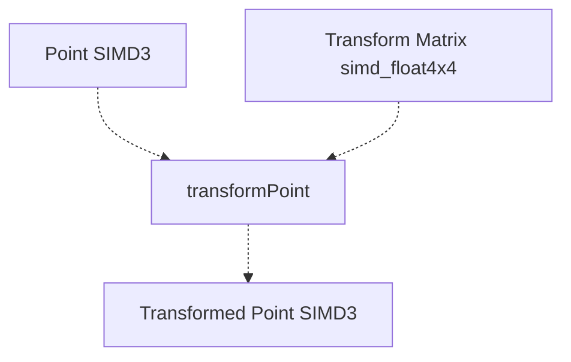

**Implementation Details:**

| Function | Location | Behavior |
| --- | --- | --- |
| `simd_float4x4.transformPoint(_ point: SIMD3<Float>)` | [Sources/MTKUI/VolumetricSceneController L24-L28](https://github.com/ThalesMMS/MTK/blob/eda6f990/Sources/MTKUI/VolumetricSceneController+Helpers.swift#L24-L28) | Converts point to homogeneous coordinates (w=1), multiplies by matrix, extracts xyz |

The transformation follows this pattern:

1. Point promoted to `SIMD4<Float>(point.x, point.y, point.z, 1)`
2. Matrix multiplication performed
3. Result projected back to 3D space via `.xyz` accessor

**Sources:** [Sources/MTKUI/VolumetricSceneController L24-L32](https://github.com/ThalesMMS/MTK/blob/eda6f990/Sources/MTKUI/VolumetricSceneController+Helpers.swift#L24-L32)

---

## Vector Math Utilities

These functions provide numerically stable vector operations with fallback behavior.

### Safe Normalization

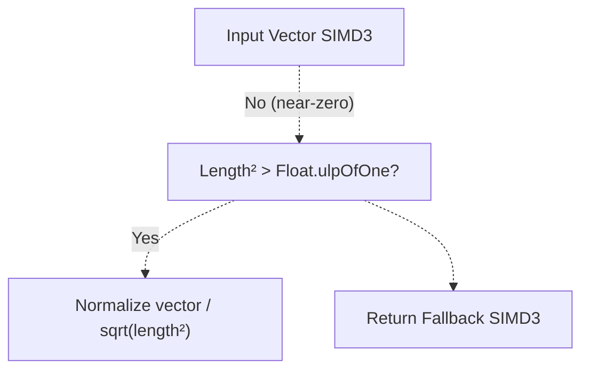

**Function Signature:**

```
func safeNormalize(_ vector: SIMD3<Float>, fallback: SIMD3<Float>) -> SIMD3<Float>
```

**Location:** [Sources/MTKUI/VolumetricSceneController L377-L381](https://github.com/ThalesMMS/MTK/blob/eda6f990/Sources/MTKUI/VolumetricSceneController+Camera.swift#L377-L381)

**Behavior:**

* Checks if `simd_length_squared(vector) > Float.ulpOfOne`
* If true: returns normalized vector
* If false: returns fallback to avoid division by zero

**Common Fallback Values:**

| Context | Fallback Value | Usage |
| --- | --- | --- |
| Camera up vector | `fallbackWorldUp` | When computed up vector is degenerate |
| Camera forward | `SIMD3<Float>(0, 0, -1)` | When look direction is undefined |
| Patient normal | `SIMD3<Float>(0, 0, 1)` | When DICOM orientation is invalid |

### Safe Perpendicular Vector

Generates a perpendicular vector using cross product with a suitable axis:

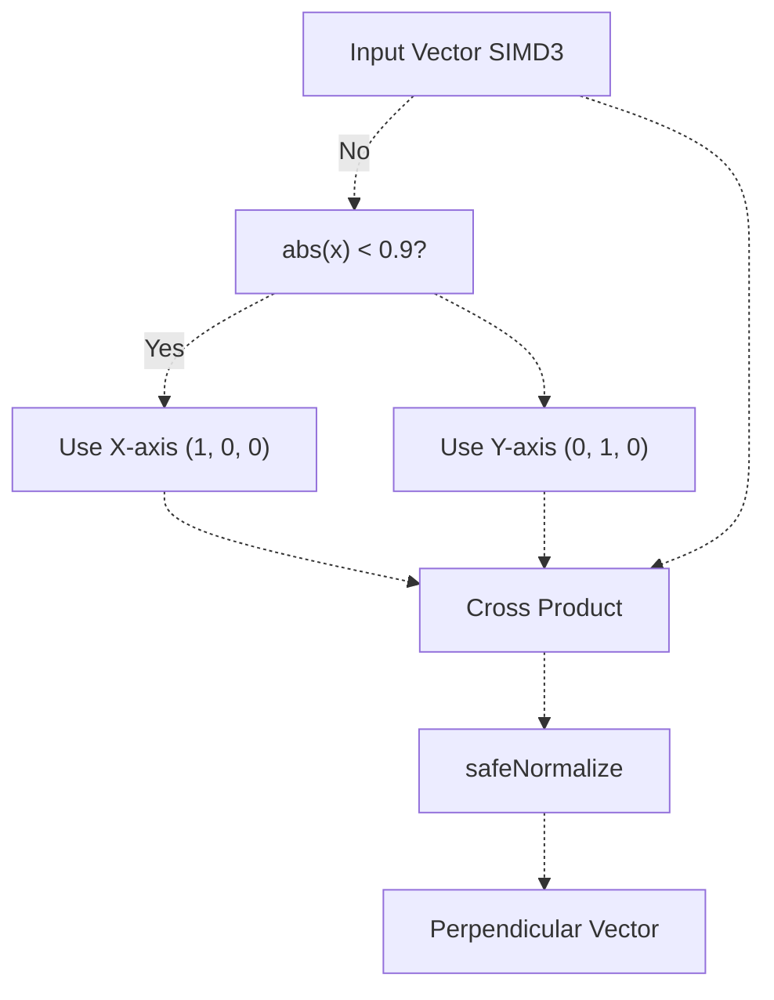

**Function Signature:**

```
func safePerpendicular(to vector: SIMD3<Float>) -> SIMD3<Float>
```

**Location:** [Sources/MTKUI/VolumetricSceneController L383-L387](https://github.com/ThalesMMS/MTK/blob/eda6f990/Sources/MTKUI/VolumetricSceneController+Camera.swift#L383-L387)

**Algorithm:**

1. Choose reference axis: X-axis if `abs(vector.x) < 0.9`, otherwise Y-axis
2. Compute cross product: `simd_cross(vector, axis)`
3. Normalize result with fallback `SIMD3<Float>(0, 0, 1)`

### Float Clamping

Simple value clamping utility:

| Function | Location | Description |
| --- | --- | --- |
| `clampFloat(_ value: Float, lower: Float, upper: Float)` | [Sources/MTKUI/VolumetricSceneController L57-L59](https://github.com/ThalesMMS/MTK/blob/eda6f990/Sources/MTKUI/VolumetricSceneController+Helpers.swift#L57-L59) | Returns `min(upper, max(lower, value))` |

**Sources:** [Sources/MTKUI/VolumetricSceneController L377-L387](https://github.com/ThalesMMS/MTK/blob/eda6f990/Sources/MTKUI/VolumetricSceneController+Camera.swift#L377-L387)

 [Sources/MTKUI/VolumetricSceneController L57-L59](https://github.com/ThalesMMS/MTK/blob/eda6f990/Sources/MTKUI/VolumetricSceneController+Helpers.swift#L57-L59)

---

## Transform Construction

### Look-At Transform Matrix

Constructs a view matrix from position, target, and up vector:

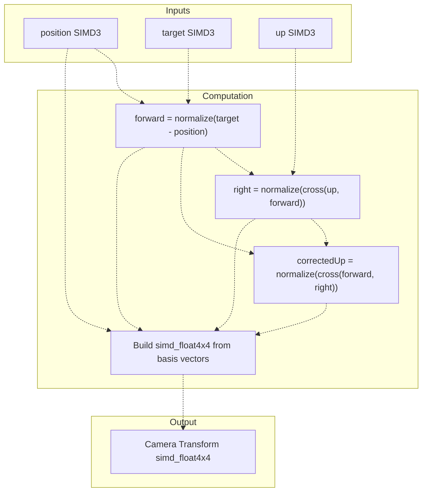

**Function Signature:**

```
func makeLookAtTransform(position: SIMD3<Float>,                         target: SIMD3<Float>,                         up: SIMD3<Float>) -> simd_float4x4
```

**Location:** [Sources/MTKUI/VolumetricSceneController L363-L375](https://github.com/ThalesMMS/MTK/blob/eda6f990/Sources/MTKUI/VolumetricSceneController+Camera.swift#L363-L375)

**Matrix Construction:**
The function builds a 4×4 transform matrix with:

* **Column 0:** Right vector (normalized cross product of up and forward)
* **Column 1:** Corrected up vector (orthogonalized)
* **Column 2:** Negative forward vector (camera looks down -Z)
* **Column 3:** Camera position in homogeneous coordinates

### Patient Coordinate Basis

Extracts and orthogonalizes DICOM Image Orientation Patient vectors:

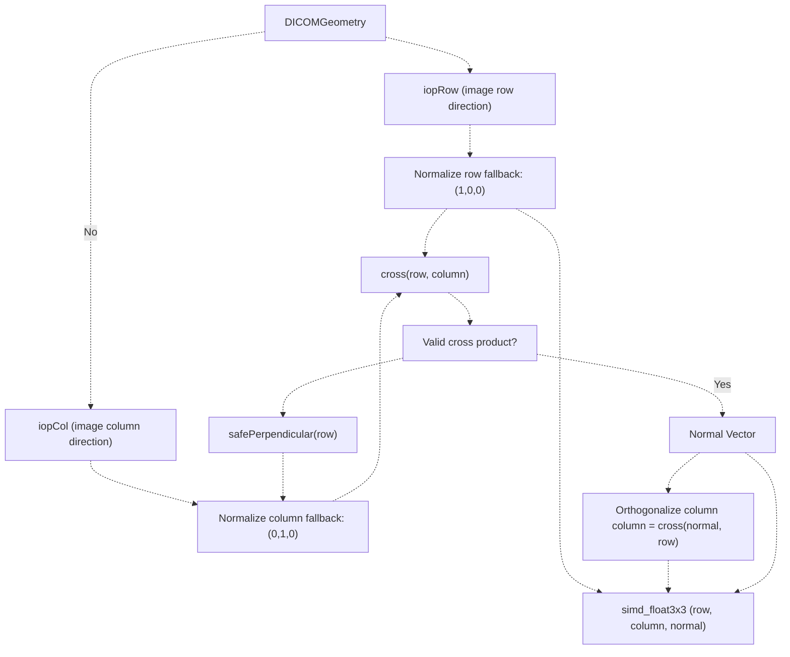

**Function Signature:**

```
func patientBasis(from geometry: DICOMGeometry) -> simd_float3x3
```

**Location:** [Sources/MTKUI/VolumetricSceneController L347-L361](https://github.com/ThalesMMS/MTK/blob/eda6f990/Sources/MTKUI/VolumetricSceneController+Camera.swift#L347-L361)

**Usage:**

* Converts DICOM orientation to scene coordinate system
* Ensures orthonormal basis even with malformed DICOM data
* Used in [Sources/MTKUI/VolumetricSceneController L27-L35](https://github.com/ThalesMMS/MTK/blob/eda6f990/Sources/MTKUI/VolumetricSceneController+Camera.swift#L27-L35)  for patient orientation application

### Euler to Quaternion Conversion

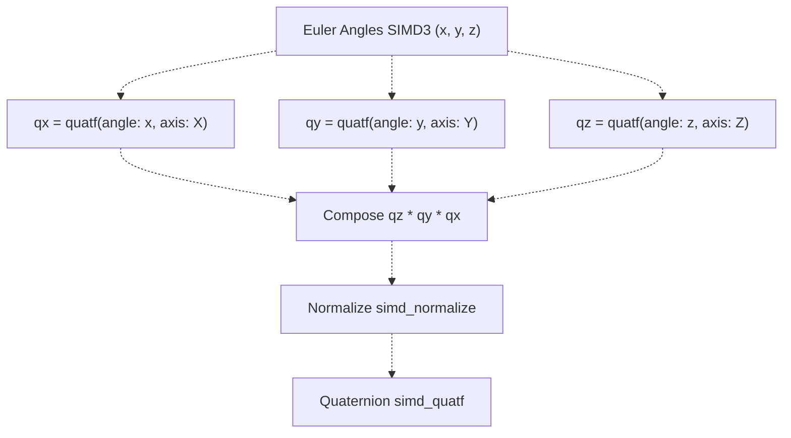

**Function Signature:**

```
func rotationQuaternion(for euler: SIMD3<Float>) -> simd_quatf
```

**Location:** [Sources/MTKUI/VolumetricSceneController L632-L637](https://github.com/ThalesMMS/MTK/blob/eda6f990/Sources/MTKUI/VolumetricSceneController+Camera.swift#L632-L637)

**Rotation Order:** Z → Y → X (standard extrinsic rotation sequence)

**Sources:** [Sources/MTKUI/VolumetricSceneController L347-L375](https://github.com/ThalesMMS/MTK/blob/eda6f990/Sources/MTKUI/VolumetricSceneController+Camera.swift#L347-L375)

 [Sources/MTKUI/VolumetricSceneController L632-L637](https://github.com/ThalesMMS/MTK/blob/eda6f990/Sources/MTKUI/VolumetricSceneController+Camera.swift#L632-L637)

---

## SceneKit Transform Helpers

### Texture Basis to SceneKit Transform

Converts MPR plane texture-space basis vectors to a SceneKit node transform:

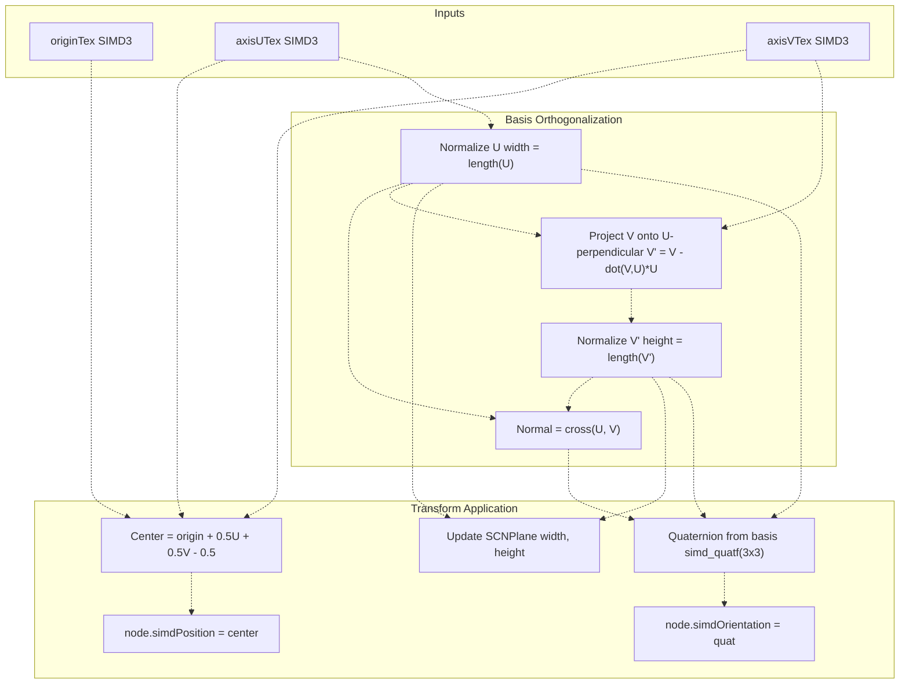

**Extension Function:**

```
extension SCNNode {    func setTransformFromBasisTex(originTex: SIMD3<Float>,                                    axisUTex: SIMD3<Float>,                                    axisVTex: SIMD3<Float>)}
```

**Location:** [Sources/MTKUI/VolumetricSceneController L34-L54](https://github.com/ThalesMMS/MTK/blob/eda6f990/Sources/MTKUI/VolumetricSceneController+Helpers.swift#L34-L54)

**Key Operations:**

| Step | Operation | Purpose |
| --- | --- | --- |
| 1. Extract dimensions | `width = simd_length(axisUTex)` | Plane width in texture space |
| 2. Orthogonalize V | `vProjection = axisVTex - dot(axisVTex, uHat) * uHat` | Ensure perpendicular axes |
| 3. Compute normal | `nHat = normalize(cross(uHat, vHat))` | Plane normal direction |
| 4. Build quaternion | `simd_quatf(3x3(uHat, vHat, nHat))` | Orientation from basis |
| 5. Compute center | `origin + 0.5*U + 0.5*V - 0.5` | Center plane at texture origin |
| 6. Update geometry | `plane.width/height = width/height` | Scale visual representation |

**Usage Context:**
This function is called during MPR plane updates in [Sources/MTKUI/VolumetricSceneController L593](https://github.com/ThalesMMS/MTK/blob/eda6f990/Sources/MTKUI/VolumetricSceneController+Camera.swift#L593-L593)

 to position the MPR display plane based on oblique texture coordinates.

**Sources:** [Sources/MTKUI/VolumetricSceneController L34-L54](https://github.com/ThalesMMS/MTK/blob/eda6f990/Sources/MTKUI/VolumetricSceneController+Helpers.swift#L34-L54)

---

## Geometric Calculations

### Screen Space Scale Computation

Calculates pixel-to-world-space scaling factors based on camera projection:

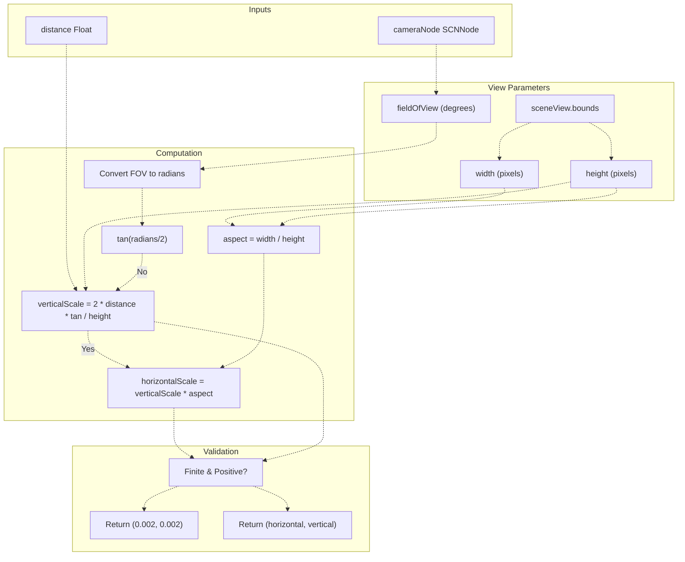

**Function Signature:**

```
func screenSpaceScale(distance: Float,                      cameraNode: SCNNode) -> (horizontal: Float, vertical: Float)
```

**Location:** [Sources/MTKUI/VolumetricSceneController L199-L218](https://github.com/ThalesMMS/MTK/blob/eda6f990/Sources/MTKUI/VolumetricSceneController+Camera.swift#L199-L218)

**Return Values:**

* `horizontal`: World units per pixel in horizontal direction
* `vertical`: World units per pixel in vertical direction
* Fallback: `(0.002, 0.002)` if calculation fails

**Usage:**
Used in gesture handling to convert screen-space deltas to world-space camera movements.

### Dataset Dimensions Helper

Converts integer volume dimensions to SIMD3 format:

| Function | Location | Description |
| --- | --- | --- |
| `datasetDimensions()` | [Sources/MTKUI/VolumetricSceneController L639-L642](https://github.com/ThalesMMS/MTK/blob/eda6f990/Sources/MTKUI/VolumetricSceneController+Camera.swift#L639-L642) | Reads `mprMaterial.dimension` and delegates to `MprPlaneComputation.datasetDimensions` |

**Sources:** [Sources/MTKUI/VolumetricSceneController L199-L218](https://github.com/ThalesMMS/MTK/blob/eda6f990/Sources/MTKUI/VolumetricSceneController+Camera.swift#L199-L218)

 [Sources/MTKUI/VolumetricSceneController L639-L642](https://github.com/ThalesMMS/MTK/blob/eda6f990/Sources/MTKUI/VolumetricSceneController+Camera.swift#L639-L642)

---

## Coordinate System Utilities

### Geometry Construction from Dataset

Creates a `DICOMGeometry` structure from `VolumeDataset`:

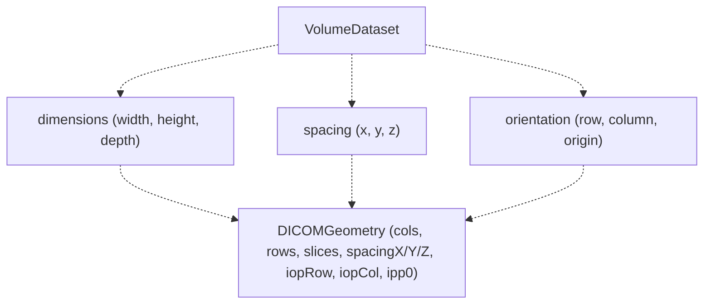

**Function Signature:**

```
func makeGeometry(from dataset: VolumeDataset) -> DICOMGeometry
```

**Location:** [Sources/MTKUI/VolumetricSceneController L644-L657](https://github.com/ThalesMMS/MTK/blob/eda6f990/Sources/MTKUI/VolumetricSceneController+Camera.swift#L644-L657)

**Field Mapping:**

| `VolumeDataset` Field | `DICOMGeometry` Field | Type |
| --- | --- | --- |
| `dimensions.width` | `cols` | `Int32` |
| `dimensions.height` | `rows` | `Int32` |
| `dimensions.depth` | `slices` | `Int32` |
| `spacing.x` | `spacingX` | `Float` |
| `spacing.y` | `spacingY` | `Float` |
| `spacing.z` | `spacingZ` | `Float` |
| `orientation.row` | `iopRow` | `SIMD3<Float>` |
| `orientation.column` | `iopCol` | `SIMD3<Float>` |
| `orientation.origin` | `ipp0` | `SIMD3<Float>` |

### World-to-Dataset Space Conversions

Two complementary functions transform coordinates between world and dataset spaces:


**Function Signatures:**

| Function | Location | Purpose |
| --- | --- | --- |
| `convertWorldPointToDatasetSpace(_ point: SIMD3<Float>, geometry: DICOMGeometry)` | [Sources/MTKUI/VolumetricSceneController L502-L512](https://github.com/ThalesMMS/MTK/blob/eda6f990/Sources/MTKUI/VolumetricSceneController+Camera.swift#L502-L512) | Transforms point from world to dataset coordinates |
| `convertWorldDirectionToDatasetSpace(_ direction: SIMD3<Float>, geometry: DICOMGeometry)` | [Sources/MTKUI/VolumetricSceneController L514-L525](https://github.com/ThalesMMS/MTK/blob/eda6f990/Sources/MTKUI/VolumetricSceneController+Camera.swift#L514-L525) | Transforms direction vector (w=0) to dataset space |

**Key Differences:**

| Aspect | Point Conversion | Direction Conversion |
| --- | --- | --- |
| Homogeneous w | 1 (translation applies) | 0 (translation ignored) |
| W-division | Required | Not applicable |
| Use case | Camera position, ray origins | Camera forward, ray directions |

**Usage Context:**
These functions are used in [Sources/MTKUI/VolumetricSceneController L452-L500](https://github.com/ThalesMMS/MTK/blob/eda6f990/Sources/MTKUI/VolumetricSceneController+Camera.swift#L452-L500)

 (`makeCameraRays`) to prepare ray casting data for MPS rendering backend.

**Sources:** [Sources/MTKUI/VolumetricSceneController L502-L525](https://github.com/ThalesMMS/MTK/blob/eda6f990/Sources/MTKUI/VolumetricSceneController+Camera.swift#L502-L525)

 [Sources/MTKUI/VolumetricSceneController L644-L657](https://github.com/ThalesMMS/MTK/blob/eda6f990/Sources/MTKUI/VolumetricSceneController+Camera.swift#L644-L657)

---

## Helper Function Usage Patterns

The following table shows common usage patterns for these utilities:

| Operation | Helper Functions Used | Example Location |
| --- | --- | --- |
| **Camera Setup** | `ensureCameraNode`, `makeLookAtTransform`, `updateVolumeBounds`, `safeNormalize` | [Sources/MTKUI/VolumetricSceneController L65-L91](https://github.com/ThalesMMS/MTK/blob/eda6f990/Sources/MTKUI/VolumetricSceneController+Camera.swift#L65-L91) |
| **Interactive Camera Update** | `clampCameraTarget`, `clampCameraOffset`, `safeNormalize`, `safePerpendicular`, `updateCameraClippingPlanes` | [Sources/MTKUI/VolumetricSceneController L138-L169](https://github.com/ThalesMMS/MTK/blob/eda6f990/Sources/MTKUI/VolumetricSceneController+Camera.swift#L138-L169) |
| **MPR Plane Positioning** | `rotationQuaternion`, `setTransformFromBasisTex`, `safeNormalize` | [Sources/MTKUI/VolumetricSceneController L568-L607](https://github.com/ThalesMMS/MTK/blob/eda6f990/Sources/MTKUI/VolumetricSceneController+Camera.swift#L568-L607) |
| **Patient Orientation** | `patientBasis`, `safeNormalize` | [Sources/MTKUI/VolumetricSceneController L27-L35](https://github.com/ThalesMMS/MTK/blob/eda6f990/Sources/MTKUI/VolumetricSceneController+Camera.swift#L27-L35) |
| **MPS Ray Casting** | `makeCameraRays`, `convertWorldPointToDatasetSpace`, `convertWorldDirectionToDatasetSpace`, `safeNormalize` | [Sources/MTKUI/VolumetricSceneController L414-L450](https://github.com/ThalesMMS/MTK/blob/eda6f990/Sources/MTKUI/VolumetricSceneController+Camera.swift#L414-L450) |

**Sources:** [Sources/MTKUI/VolumetricSceneController L27-L723](https://github.com/ThalesMMS/MTK/blob/eda6f990/Sources/MTKUI/VolumetricSceneController+Camera.swift#L27-L723)

 [Sources/MTKUI/VolumetricSceneController L1-L61](https://github.com/ThalesMMS/MTK/blob/eda6f990/Sources/MTKUI/VolumetricSceneController+Helpers.swift#L1-L61)

---

## Error Handling and Safety

All helper utilities implement defensive programming patterns:

### Numeric Stability

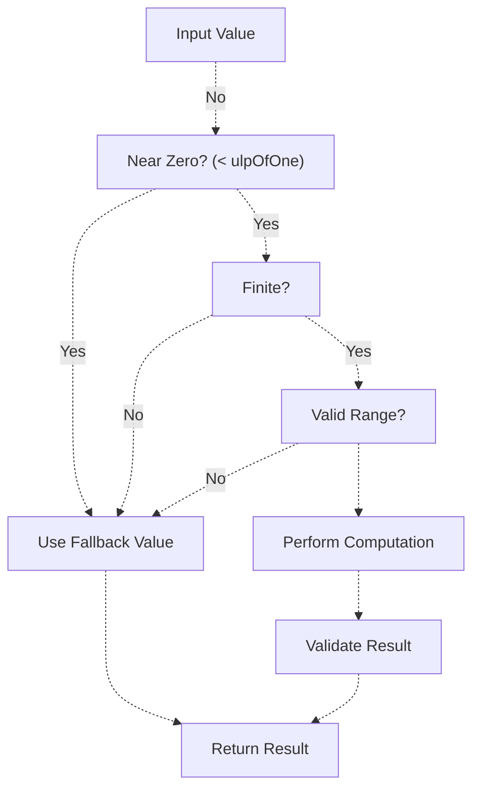

**Safety Mechanisms:**

| Mechanism | Implementation | Example |
| --- | --- | --- |
| **Zero-length check** | Compare squared length to `Float.ulpOfOne` | `safeNormalize` [line 378-379](https://github.com/ThalesMMS/MTK/blob/eda6f990/line%20378-379) |
| **Finite check** | Test `.isFinite` on all computed values | `screenSpaceScale` [line 214](https://github.com/ThalesMMS/MTK/blob/eda6f990/line%20214) |
| **Fallback values** | Provide sensible defaults for all operations | Multiple functions, e.g., [line 377-381](https://github.com/ThalesMMS/MTK/blob/eda6f990/line%20377-381) |
| **Range clamping** | Apply min/max bounds before use | `clampFloat`, `clampCameraOffset` |
| **Orthogonality enforcement** | Re-orthogonalize cross products | `patientBasis` [line 359](https://github.com/ThalesMMS/MTK/blob/eda6f990/line%20359) |

**Sources:** [Sources/MTKUI/VolumetricSceneController L377-L387](https://github.com/ThalesMMS/MTK/blob/eda6f990/Sources/MTKUI/VolumetricSceneController+Camera.swift#L377-L387)

 [Sources/MTKUI/VolumetricSceneController L199-L218](https://github.com/ThalesMMS/MTK/blob/eda6f990/Sources/MTKUI/VolumetricSceneController+Camera.swift#L199-L218)


### On this page

* [Helper Utilities](#3.6-helper-utilities)
* [Purpose and Scope](#3.6-purpose-and-scope)
* [Utility Categories](#3.6-utility-categories)
* [Type Conversion Utilities](#3.6-type-conversion-utilities)
* [SCNVector3 SIMD Initialization](#3.6-scnvector3-simd-initialization)
* [SIMD4 Component Extraction](#3.6-simd4-component-extraction)
* [SIMD and Matrix Extensions](#3.6-simd-and-matrix-extensions)
* [Transform Point Operation](#3.6-transform-point-operation)
* [Vector Math Utilities](#3.6-vector-math-utilities)
* [Safe Normalization](#3.6-safe-normalization)
* [Safe Perpendicular Vector](#3.6-safe-perpendicular-vector)
* [Float Clamping](#3.6-float-clamping)
* [Transform Construction](#3.6-transform-construction)
* [Look-At Transform Matrix](#3.6-look-at-transform-matrix)
* [Patient Coordinate Basis](#3.6-patient-coordinate-basis)
* [Euler to Quaternion Conversion](#3.6-euler-to-quaternion-conversion)
* [SceneKit Transform Helpers](#3.6-scenekit-transform-helpers)
* [Texture Basis to SceneKit Transform](#3.6-texture-basis-to-scenekit-transform)
* [Geometric Calculations](#3.6-geometric-calculations)
* [Screen Space Scale Computation](#3.6-screen-space-scale-computation)
* [Dataset Dimensions Helper](#3.6-dataset-dimensions-helper)
* [Coordinate System Utilities](#3.6-coordinate-system-utilities)
* [Geometry Construction from Dataset](#3.6-geometry-construction-from-dataset)
* [World-to-Dataset Space Conversions](#3.6-world-to-dataset-space-conversions)
* [Helper Function Usage Patterns](#3.6-helper-function-usage-patterns)
* [Error Handling and Safety](#3.6-error-handling-and-safety)
* [Numeric Stability](#3.6-numeric-stability)

Ask Devin about MTK