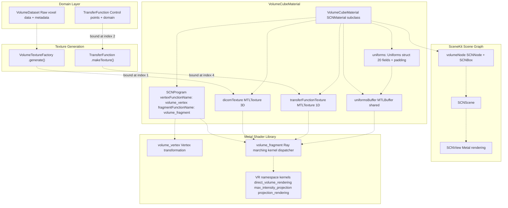
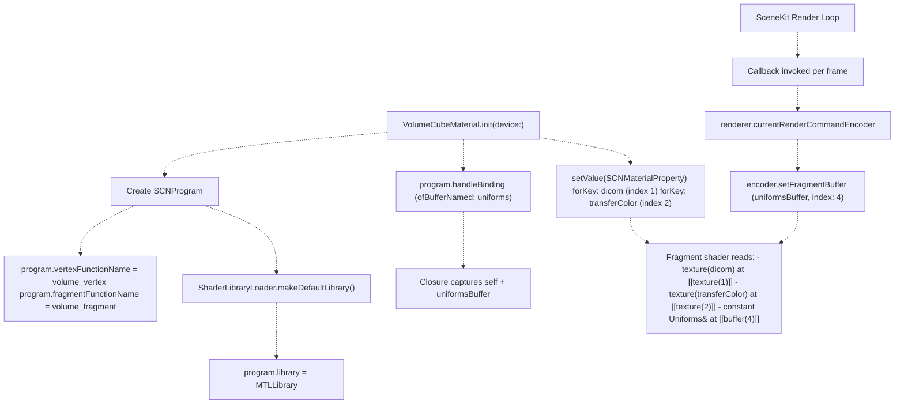
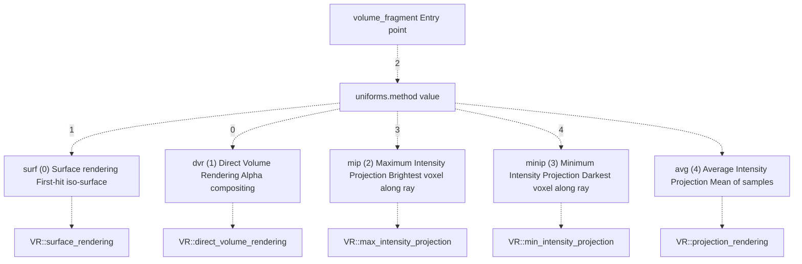
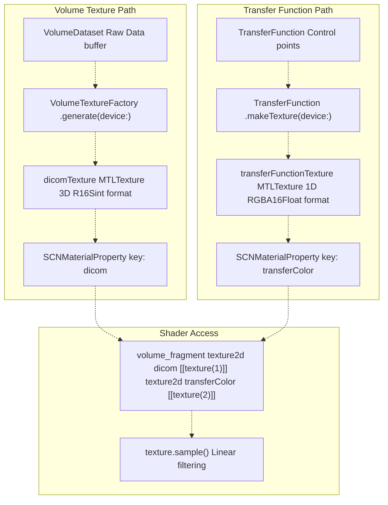
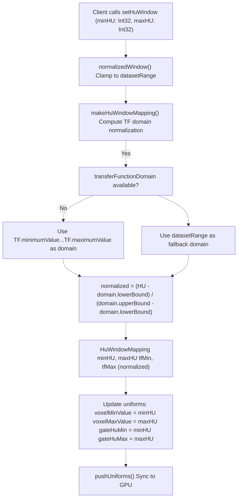
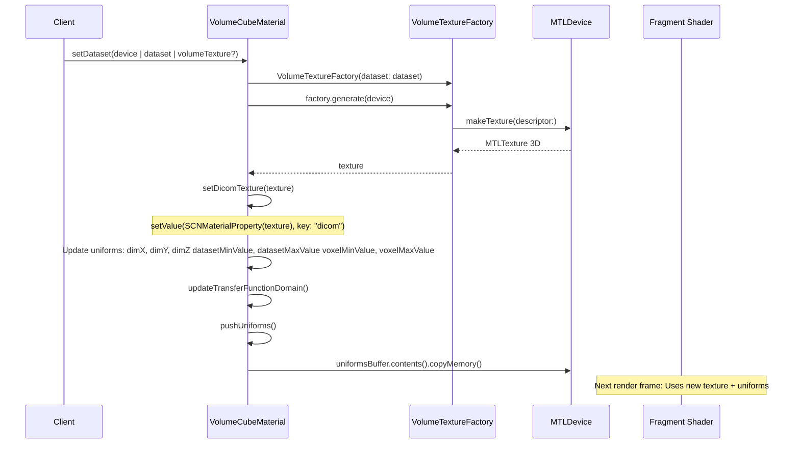
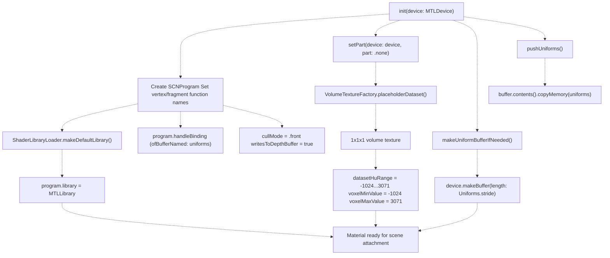

# Materials and Shaders

> **Relevant source files**
> * [Sources/MTKSceneKit/Materials/VolumeCubeMaterial.swift](https://github.com/ThalesMMS/MTK/blob/eda6f990/Sources/MTKSceneKit/Materials/VolumeCubeMaterial.swift)

This document provides an overview of the SceneKit material system used for volumetric rendering in MTK. Materials encapsulate custom Metal shaders, manage GPU resources (textures and buffers), and expose high-level controls for rendering configuration. The primary material is `VolumeCubeMaterial`, which implements direct volume rendering (DVR), maximum intensity projection (MIP), and other visualization techniques through fragment shader ray marching.

For comprehensive details on `VolumeCubeMaterial` configuration, see [VolumeCubeMaterial](4a%20VolumeCubeMaterial.md). For transfer function management, see [Transfer Functions](4b%20Transfer-Functions.md). For upstream texture generation, see [VolumeDataset and VolumeTextureFactory](5a%20VolumeDataset-and-VolumeTextureFactory.md). For the rendering backend that consumes these materials, see [SceneKit Backend](2a%20SceneKit-Backend.md).

---

## Material System Architecture

MTK's material system bridges the gap between domain-level rendering requests and low-level Metal shader execution within the SceneKit rendering pipeline. Materials are **SCNMaterial subclasses** that own custom `SCNProgram` instances, which in turn reference Metal shader functions compiled into `VolumeRendering.metallib`.

**Diagram: Material System Components and Data Flow**



**Sources:**

* [Sources/MTKSceneKit/Materials/VolumeCubeMaterial.swift L17-L175](https://github.com/ThalesMMS/MTK/blob/eda6f990/Sources/MTKSceneKit/Materials/VolumeCubeMaterial.swift#L17-L175)
* [Sources/MTKSceneKit/Materials/VolumeCubeMaterial.swift L423-L438](https://github.com/ThalesMMS/MTK/blob/eda6f990/Sources/MTKSceneKit/Materials/VolumeCubeMaterial.swift#L423-L438)

---

## SCNProgram Integration and Shader Binding

`VolumeCubeMaterial` uses `SCNProgram` to bind custom Metal shaders to SceneKit's rendering pipeline. The program specifies vertex and fragment function names that reference compiled Metal functions from `VolumeRendering.metallib`. Resource binding occurs via `handleBinding(ofBufferNamed:frequency:)` callbacks, which receive the active `MTLRenderCommandEncoder` from SceneKit's renderer.

**Diagram: SCNProgram Resource Binding Flow**



**Key Binding Mechanisms:**

1. **Shader Function Names**: [Sources/MTKSceneKit/Materials/VolumeCubeMaterial.swift L148-L149](https://github.com/ThalesMMS/MTK/blob/eda6f990/Sources/MTKSceneKit/Materials/VolumeCubeMaterial.swift#L148-L149)  assigns `volume_vertex` and `volume_fragment` as function names. SceneKit resolves these from the assigned `MTLLibrary`.
2. **Uniforms Buffer Binding**: [Sources/MTKSceneKit/Materials/VolumeCubeMaterial.swift L158-L163](https://github.com/ThalesMMS/MTK/blob/eda6f990/Sources/MTKSceneKit/Materials/VolumeCubeMaterial.swift#L158-L163)  registers a per-frame handler that binds `uniformsBuffer` to fragment shader buffer index 4. The closure captures `self` weakly to access the buffer during rendering.
3. **Texture Property Binding**: [Sources/MTKSceneKit/Materials/VolumeCubeMaterial.swift L418-L419](https://github.com/ThalesMMS/MTK/blob/eda6f990/Sources/MTKSceneKit/Materials/VolumeCubeMaterial.swift#L418-L419)  and [Sources/MTKSceneKit/Materials/VolumeCubeMaterial.swift L250-L251](https://github.com/ThalesMMS/MTK/blob/eda6f990/Sources/MTKSceneKit/Materials/VolumeCubeMaterial.swift#L250-L251)  use `setValue(_:forKey:)` to assign `MTLTexture` instances wrapped in `SCNMaterialProperty`. SceneKit automatically binds these to shader texture indices based on the property key.
4. **Library Loading**: [Sources/MTKSceneKit/Materials/VolumeCubeMaterial.swift L429-L437](https://github.com/ThalesMMS/MTK/blob/eda6f990/Sources/MTKSceneKit/Materials/VolumeCubeMaterial.swift#L429-L437)  loads `VolumeRendering.metallib` from the bundle using `ShaderLibraryLoader.makeDefaultLibrary()`. Failures are logged but do not crash initialization.

**Sources:**

* [Sources/MTKSceneKit/Materials/VolumeCubeMaterial.swift L143-L175](https://github.com/ThalesMMS/MTK/blob/eda6f990/Sources/MTKSceneKit/Materials/VolumeCubeMaterial.swift#L143-L175)
* [Sources/MTKSceneKit/Materials/VolumeCubeMaterial.swift L423-L438](https://github.com/ThalesMMS/MTK/blob/eda6f990/Sources/MTKSceneKit/Materials/VolumeCubeMaterial.swift#L423-L438)

---

## Uniforms Structure and Shader Communication

The `Uniforms` struct is a **memory-layout-compatible bridge** between Swift CPU code and Metal GPU shaders. It must match the Metal-side `Uniforms` struct definition bit-for-bit, including padding. The material copies this struct into a shared `MTLBuffer` on every state change via `pushUniforms()`.

**Diagram: Uniforms Memory Layout (152 bytes)**

```mermaid
flowchart TD

F0["isLightingOn: Int32 offset 0, size 4"]
F1["isBackwardOn: Int32 offset 4, size 4"]
F2["method: Int32 offset 8, size 4"]
F3["renderingQuality: Int32 offset 12, size 4"]
F4["voxelMinValue: Int32 offset 16, size 4"]
F5["voxelMaxValue: Int32 offset 20, size 4"]
F6["datasetMinValue: Int32 offset 24, size 4"]
F7["datasetMaxValue: Int32 offset 28, size 4"]
F8["densityFloor: Float offset 32, size 4"]
F9["densityCeil: Float offset 36, size 4"]
F10["gateHuMin: Int32 offset 40, size 4"]
F11["gateHuMax: Int32 offset 44, size 4"]
F12["useHuGate: Int32 offset 48, size 4"]
F13["dimX: Int32 offset 52, size 4"]
F14["dimY: Int32 offset 56, size 4"]
F15["dimZ: Int32 offset 60, size 4"]
F16["useTFProj: Int32 offset 64, size 4"]
F17["_pad0: Int32 offset 68, size 4"]
F18["_pad1: Int32 offset 72, size 4"]
F19["_pad2: Int32 offset 76, size 4"]
Buffer["uniformsBuffer storageModeShared 80 bytes"]
ShaderUnif["constant Uniforms& uniforms [[buffer(4)]]"]

F0 -.-> Buffer
F1 -.-> Buffer
F2 -.-> Buffer
F3 -.-> Buffer
F4 -.-> Buffer
F5 -.-> Buffer
F6 -.-> Buffer
F7 -.-> Buffer
F8 -.-> Buffer
F9 -.-> Buffer
F10 -.-> Buffer
F11 -.-> Buffer
F12 -.-> Buffer
F13 -.-> Buffer
F14 -.-> Buffer
F15 -.-> Buffer
F16 -.-> Buffer
F17 -.-> Buffer
F18 -.-> Buffer
F19 -.-> Buffer
Buffer -.-> ShaderUnif

subgraph subGraph2 ["Metal Shader"]
    ShaderUnif
end

subgraph subGraph1 ["MTLBuffer Contents"]
    Buffer
end

subgraph subGraph0 ["Swift Uniforms Struct"]
    F0
    F1
    F2
    F3
    F4
    F5
    F6
    F7
    F8
    F9
    F10
    F11
    F12
    F13
    F14
    F15
    F16
    F17
    F18
    F19
end
```



**Field Descriptions:**

| Field | Type | Purpose |
| --- | --- | --- |
| `isLightingOn` | Int32 | Flag (0/1) to enable diffuse/specular lighting in DVR |
| `isBackwardOn` | Int32 | Flag (0/1) to reverse ray marching direction |
| `method` | Int32 | Rendering method ID (0=surf, 1=dvr, 2=mip, 3=minip, 4=avg) |
| `renderingQuality` | Int32 | Number of ray marching steps (sampling resolution) |
| `voxelMinValue` | Int32 | HU window lower bound for TF lookup normalization |
| `voxelMaxValue` | Int32 | HU window upper bound for TF lookup normalization |
| `datasetMinValue` | Int32 | Dataset global minimum intensity |
| `datasetMaxValue` | Int32 | Dataset global maximum intensity |
| `densityFloor` | Float | Minimum normalized density for projection gating |
| `densityCeil` | Float | Maximum normalized density for projection gating |
| `gateHuMin` | Int32 | HU gating lower threshold (discards voxels below) |
| `gateHuMax` | Int32 | HU gating upper threshold (discards voxels above) |
| `useHuGate` | Int32 | Flag (0/1) to enable HU gating in kernels |
| `dimX`, `dimY`, `dimZ` | Int32 | Volume dimensions in voxels for gradient calculation |
| `useTFProj` | Int32 | Flag (0/1) to apply transfer function in projection rendering |
| `_pad0`, `_pad1`, `_pad2` | Int32 | Padding for 16-byte alignment (required by Metal) |

**Push Mechanism:**

The `pushUniforms()` method [Sources/MTKSceneKit/Materials/VolumeCubeMaterial.swift L396-L414](https://github.com/ThalesMMS/MTK/blob/eda6f990/Sources/MTKSceneKit/Materials/VolumeCubeMaterial.swift#L396-L414)

 copies the entire `Uniforms` struct to `uniformsBuffer` using `copyMemory(from:byteCount:)`. On macOS, if the buffer uses managed storage mode, it calls `didModifyRange()` to synchronize with GPU-visible memory. This method is invoked after every state mutation (e.g., `setMethod()`, `setHuWindow()`, `setLighting()`).

**Sources:**

* [Sources/MTKSceneKit/Materials/VolumeCubeMaterial.swift L64-L118](https://github.com/ThalesMMS/MTK/blob/eda6f990/Sources/MTKSceneKit/Materials/VolumeCubeMaterial.swift#L64-L118)
* [Sources/MTKSceneKit/Materials/VolumeCubeMaterial.swift L396-L414](https://github.com/ThalesMMS/MTK/blob/eda6f990/Sources/MTKSceneKit/Materials/VolumeCubeMaterial.swift#L396-L414)

---

## Rendering Methods

`VolumeCubeMaterial` supports five distinct rendering methods, selectable via the `method` field in `Uniforms`. Each method invokes a different Metal kernel function in the fragment shader's ray marching loop.

**Available Methods:**



**Method Enum Mapping:**

The `Method` enum [Sources/MTKSceneKit/Materials/VolumeCubeMaterial.swift L20-L38](https://github.com/ThalesMMS/MTK/blob/eda6f990/Sources/MTKSceneKit/Materials/VolumeCubeMaterial.swift#L20-L38)

 provides Swift-side type safety with an `idInt32` computed property that converts to the Metal-compatible integer:

* `.surf` → `0`: Iso-surface rendering (first-hit opacity threshold)
* `.dvr` → `1`: Traditional volumetric ray marching with opacity accumulation
* `.mip` → `2`: Projects maximum intensity encountered along each ray
* `.minip` → `3`: Projects minimum intensity (useful for highlighting dark structures)
* `.avg` → `4`: Averages all samples along the ray (slab rendering)

The `setMethod(_:)` method [Sources/MTKSceneKit/Materials/VolumeCubeMaterial.swift L202-L207](https://github.com/ThalesMMS/MTK/blob/eda6f990/Sources/MTKSceneKit/Materials/VolumeCubeMaterial.swift#L202-L207)

 updates `uniforms.method` and calls `pushUniforms()` to synchronize with the GPU.

**Sources:**

* [Sources/MTKSceneKit/Materials/VolumeCubeMaterial.swift L20-L38](https://github.com/ThalesMMS/MTK/blob/eda6f990/Sources/MTKSceneKit/Materials/VolumeCubeMaterial.swift#L20-L38)
* [Sources/MTKSceneKit/Materials/VolumeCubeMaterial.swift L202-L207](https://github.com/ThalesMMS/MTK/blob/eda6f990/Sources/MTKSceneKit/Materials/VolumeCubeMaterial.swift#L202-L207)

---

## Texture Management

Materials bind two primary textures to the fragment shader: the 3D volume texture and the 1D transfer function texture. Both are managed as `MTLTexture` instances and exposed to shaders via `SCNMaterialProperty` key-value binding.

**Diagram: Texture Lifecycle and Binding**



**Volume Texture Binding:**

The `setDicomTexture(_:)` method [Sources/MTKSceneKit/Materials/VolumeCubeMaterial.swift L416-L419](https://github.com/ThalesMMS/MTK/blob/eda6f990/Sources/MTKSceneKit/Materials/VolumeCubeMaterial.swift#L416-L419)

 assigns the 3D volume texture to the `dicom` key. SceneKit binds this to shader texture index 1. The texture is typically generated by `VolumeTextureFactory` [Sources/MTKSceneKit/Materials/VolumeCubeMaterial.swift L440-L449](https://github.com/ThalesMMS/MTK/blob/eda6f990/Sources/MTKSceneKit/Materials/VolumeCubeMaterial.swift#L440-L449)

 from a `VolumeDataset`.

**Transfer Function Texture Binding:**

The `setTransferFunctionTexture(_:)` method [Sources/MTKSceneKit/Materials/VolumeCubeMaterial.swift L249-L253](https://github.com/ThalesMMS/MTK/blob/eda6f990/Sources/MTKSceneKit/Materials/VolumeCubeMaterial.swift#L249-L253)

 assigns the 1D lookup texture to the `transferColor` key, bound to shader texture index 2. This texture maps normalized intensities `[0.0, 1.0]` to RGBA color/opacity values. It is regenerated whenever `setPreset(_:)` is called [Sources/MTKSceneKit/Materials/VolumeCubeMaterial.swift L234-L246](https://github.com/ThalesMMS/MTK/blob/eda6f990/Sources/MTKSceneKit/Materials/VolumeCubeMaterial.swift#L234-L246)

**Texture Access in Shaders:**

Fragment shaders sample the volume using `texture.sample(sampler, uvw)` where `uvw` are 3D texture coordinates computed during ray marching. Transfer function lookups normalize the sampled intensity using `(value - voxelMinValue) / (voxelMaxValue - voxelMinValue)`, then sample the 1D texture to retrieve color and opacity.

**Sources:**

* [Sources/MTKSceneKit/Materials/VolumeCubeMaterial.swift L416-L419](https://github.com/ThalesMMS/MTK/blob/eda6f990/Sources/MTKSceneKit/Materials/VolumeCubeMaterial.swift#L416-L419)
* [Sources/MTKSceneKit/Materials/VolumeCubeMaterial.swift L249-L253](https://github.com/ThalesMMS/MTK/blob/eda6f990/Sources/MTKSceneKit/Materials/VolumeCubeMaterial.swift#L249-L253)
* [Sources/MTKSceneKit/Materials/VolumeCubeMaterial.swift L440-L449](https://github.com/ThalesMMS/MTK/blob/eda6f990/Sources/MTKSceneKit/Materials/VolumeCubeMaterial.swift#L440-L449)

---

## HU Windowing System

HU (Hounsfield Unit) windowing controls which intensity range of the volume dataset is mapped to the transfer function's color/opacity domain. This is critical for medical imaging, where different tissue types have characteristic HU ranges (e.g., bone: +700 to +3000 HU, soft tissue: +40 to +80 HU).

**Windowing Calculation Flow:**



**Key Methods:**

1. **setHuWindow(minHU:maxHU:)** [Sources/MTKSceneKit/Materials/VolumeCubeMaterial.swift L306-L314](https://github.com/ThalesMMS/MTK/blob/eda6f990/Sources/MTKSceneKit/Materials/VolumeCubeMaterial.swift#L306-L314) : Public API that accepts raw HU values, computes the mapping, and applies it.
2. **makeHuWindowMapping(minHU:maxHU:datasetRange:transferDomain:)** [Sources/MTKSceneKit/Materials/VolumeCubeMaterial.swift L330-L369](https://github.com/ThalesMMS/MTK/blob/eda6f990/Sources/MTKSceneKit/Materials/VolumeCubeMaterial.swift#L330-L369) : Static method that normalizes HU values into the transfer function's `[0.0, 1.0]` domain. It clamps inputs to the dataset range, then normalizes relative to the TF domain (or dataset range if no TF is loaded).
3. **normalizedWindow(minHU:maxHU:datasetRange:)** [Sources/MTKSceneKit/Materials/VolumeCubeMaterial.swift L371-L394](https://github.com/ThalesMMS/MTK/blob/eda6f990/Sources/MTKSceneKit/Materials/VolumeCubeMaterial.swift#L371-L394) : Helper that clamps HU bounds to the dataset's valid range, handling edge cases like inverted ranges or degenerate windows.

**HuWindowMapping Struct:**

The `HuWindowMapping` struct [Sources/MTKSceneKit/Materials/VolumeCubeMaterial.swift L316-L328](https://github.com/ThalesMMS/MTK/blob/eda6f990/Sources/MTKSceneKit/Materials/VolumeCubeMaterial.swift#L316-L328)

 encapsulates the computed window:

* `minHU`, `maxHU`: Absolute HU values applied to shader uniforms
* `tfMin`, `tfMax`: Normalized `[0.0, 1.0]` values representing the TF lookup range

In the shader, voxel intensities are normalized as:

```
normalized_intensity = (voxel_HU - voxelMinValue) / (voxelMaxValue - voxelMinValue)
```

This normalized value indexes into the transfer function texture to retrieve color and opacity.

**Sources:**

* [Sources/MTKSceneKit/Materials/VolumeCubeMaterial.swift L293-L314](https://github.com/ThalesMMS/MTK/blob/eda6f990/Sources/MTKSceneKit/Materials/VolumeCubeMaterial.swift#L293-L314)
* [Sources/MTKSceneKit/Materials/VolumeCubeMaterial.swift L330-L394](https://github.com/ThalesMMS/MTK/blob/eda6f990/Sources/MTKSceneKit/Materials/VolumeCubeMaterial.swift#L330-L394)

---

## State Management and Dataset Application

The material maintains internal state that must remain synchronized with the shader uniforms and bound textures. State changes trigger `pushUniforms()` to upload the updated buffer to the GPU.

**Dataset Application Workflow:**



**Key State Properties:**

| Property | Type | Purpose |
| --- | --- | --- |
| `textureGenerator` | VolumeTextureFactory | Retains dataset and metadata for reuse |
| `dicomTexture` | MTLTexture? | Currently bound 3D volume texture |
| `transferFunctionTexture` | MTLTexture? | Currently bound 1D TF texture |
| `uniformsBuffer` | MTLBuffer? | Shared buffer for uniforms struct |
| `tf` | TransferFunction? | Current transfer function definition |
| `transferFunctionDomain` | ClosedRange? | TF domain for HU normalization |
| `datasetHuRange` | ClosedRange | Dataset global intensity bounds |
| `huWindow` | ClosedRange? | Currently applied HU window |

**Dataset Application Method:**

The `setDataset(device:dataset:volumeTexture:)` method [Sources/MTKSceneKit/Materials/VolumeCubeMaterial.swift L220-L227](https://github.com/ThalesMMS/MTK/blob/eda6f990/Sources/MTKSceneKit/Materials/VolumeCubeMaterial.swift#L220-L227)

 orchestrates the complete dataset replacement:

1. Creates a new `VolumeTextureFactory` from the dataset
2. Generates the 3D texture (or uses provided `volumeTexture` override)
3. Binds the texture via `setDicomTexture(_:)`
4. Updates dimension fields (`dimX`, `dimY`, `dimZ`)
5. Updates intensity range fields (`datasetMinValue`, `datasetMaxValue`)
6. Recalculates transfer function domain
7. Normalizes and applies current HU window to new dataset
8. Calls `pushUniforms()` to synchronize GPU state

This ensures that switching datasets maintains consistent windowing and transfer function behavior without manual reconfiguration.

**Sources:**

* [Sources/MTKSceneKit/Materials/VolumeCubeMaterial.swift L220-L227](https://github.com/ThalesMMS/MTK/blob/eda6f990/Sources/MTKSceneKit/Materials/VolumeCubeMaterial.swift#L220-L227)
* [Sources/MTKSceneKit/Materials/VolumeCubeMaterial.swift L440-L484](https://github.com/ThalesMMS/MTK/blob/eda6f990/Sources/MTKSceneKit/Materials/VolumeCubeMaterial.swift#L440-L484)
* [Sources/MTKSceneKit/Materials/VolumeCubeMaterial.swift L129-L141](https://github.com/ThalesMMS/MTK/blob/eda6f990/Sources/MTKSceneKit/Materials/VolumeCubeMaterial.swift#L129-L141)

---

## Configuration Methods Summary

`VolumeCubeMaterial` exposes numerous configuration methods that modify uniforms and trigger GPU synchronization. All methods that update rendering state internally call `pushUniforms()`.

**Primary Configuration Methods:**

| Method | Parameters | Uniforms Modified | Purpose |
| --- | --- | --- | --- |
| `setMethod(_:)` | `Method` enum | `method` | Switch rendering technique (DVR, MIP, etc.) |
| `setStep(_:)` | `Float` | `renderingQuality` | Adjust ray marching sampling density |
| `setLighting(on:)` | `Bool` | `isLightingOn` | Enable/disable shading in DVR |
| `setHuWindow(minHU:maxHU:)` | `Int32, Int32` | `voxelMinValue`, `voxelMaxValue`, `gateHuMin`, `gateHuMax` | Set intensity window for TF mapping |
| `setHuGate(enabled:)` | `Bool` | `useHuGate` | Enable/disable HU-based voxel culling |
| `setDensityGate(floor:ceil:)` | `Float, Float` | `densityFloor`, `densityCeil` | Set normalized density thresholds for projections |
| `setUseTFOnProjections(_:)` | `Bool` | `useTFProj` | Apply transfer function to projection methods |
| `setPreset(device:preset:)` | `MTLDevice, Preset` | N/A (updates TF texture) | Load built-in transfer function preset |
| `setShift(device:shift:)` | `MTLDevice, Float` | N/A (regenerates TF texture) | Shift transfer function domain |

**Preset Application:**

The `setPreset(device:preset:)` method [Sources/MTKSceneKit/Materials/VolumeCubeMaterial.swift L234-L246](https://github.com/ThalesMMS/MTK/blob/eda6f990/Sources/MTKSceneKit/Materials/VolumeCubeMaterial.swift#L234-L246)

 loads a built-in transfer function from `VolumeTransferFunctionLibrary`, generates a 1D texture, and updates `transferFunctionDomain` to reflect the preset's intensity range. This allows quick switching between optimized visualization presets (e.g., bone, soft tissue, angiography).

**Error Handling:**

Configuration methods use `logger` [Sources/MTKSceneKit/Materials/VolumeCubeMaterial.swift L130-L131](https://github.com/ThalesMMS/MTK/blob/eda6f990/Sources/MTKSceneKit/Materials/VolumeCubeMaterial.swift#L130-L131)

 to report warnings and errors (e.g., missing presets, failed texture generation) without crashing. Shader binding errors are reported via the `SCNProgramDelegate.program(_:handleError:)` callback [Sources/MTKSceneKit/Materials/VolumeCubeMaterial.swift L523-L525](https://github.com/ThalesMMS/MTK/blob/eda6f990/Sources/MTKSceneKit/Materials/VolumeCubeMaterial.swift#L523-L525)

**Sources:**

* [Sources/MTKSceneKit/Materials/VolumeCubeMaterial.swift L202-L287](https://github.com/ThalesMMS/MTK/blob/eda6f990/Sources/MTKSceneKit/Materials/VolumeCubeMaterial.swift#L202-L287)
* [Sources/MTKSceneKit/Materials/VolumeCubeMaterial.swift L523-L525](https://github.com/ThalesMMS/MTK/blob/eda6f990/Sources/MTKSceneKit/Materials/VolumeCubeMaterial.swift#L523-L525)

---

## Material Initialization and Lifecycle

`VolumeCubeMaterial` initializes with a default state that provides a functional rendering surface even before datasets are loaded. This fallback strategy prevents shader binding errors during early scene setup.

**Initialization Sequence:**



**Fallback Strategy:**

The `setPart(device:part:)` call with `.none` [Sources/MTKSceneKit/Materials/VolumeCubeMaterial.swift L172](https://github.com/ThalesMMS/MTK/blob/eda6f990/Sources/MTKSceneKit/Materials/VolumeCubeMaterial.swift#L172-L172)

 generates a placeholder 1×1×1 volume via `VolumeTextureFactory.placeholderDataset()`. This synthetic volume ensures that:

1. The `dicomTexture` binding is non-nil (prevents shader validation errors)
2. The `datasetHuRange` has a sensible default (-1024...3071 for CT)
3. Transfer function domain calculations succeed even without a loaded TF
4. Rendering does not crash if the material is attached to a node prematurely

**Uniforms Buffer Initialization:**

The `makeUniformBufferIfNeeded()` method [Sources/MTKSceneKit/Materials/VolumeCubeMaterial.swift L486-L490](https://github.com/ThalesMMS/MTK/blob/eda6f990/Sources/MTKSceneKit/Materials/VolumeCubeMaterial.swift#L486-L490)

 allocates a shared-mode `MTLBuffer` sized to `Uniforms.stride` (80 bytes with padding). This buffer is reused across all `pushUniforms()` calls, avoiding per-frame allocations.

**SCNMaterial Property Inheritance:**

`VolumeCubeMaterial` inherits from `SCNMaterial`, which provides:

* `cullMode`: Set to `.front` to render the backface (ray entry point)
* `writesToDepthBuffer`: Enabled to support depth-based occlusion
* `program`: Custom shader program overrides default SceneKit shading

**Sources:**

* [Sources/MTKSceneKit/Materials/VolumeCubeMaterial.swift L143-L175](https://github.com/ThalesMMS/MTK/blob/eda6f990/Sources/MTKSceneKit/Materials/VolumeCubeMaterial.swift#L143-L175)
* [Sources/MTKSceneKit/Materials/VolumeCubeMaterial.swift L486-L490](https://github.com/ThalesMMS/MTK/blob/eda6f990/Sources/MTKSceneKit/Materials/VolumeCubeMaterial.swift#L486-L490)

---

## Integration with VolumetricSceneController

`VolumeCubeMaterial` is instantiated and managed by `VolumetricSceneController`, which owns the material instance and forwards configuration calls from the interaction API. The controller ensures that material state remains synchronized with user inputs and reactive state publishers.

**Material Usage in Controller:**

The controller creates a `VolumeCubeMaterial` instance [Sources/MTKSceneKit/Materials/VolumeCubeMaterial.swift L143](https://github.com/ThalesMMS/MTK/blob/eda6f990/Sources/MTKSceneKit/Materials/VolumeCubeMaterial.swift#L143-L143)

 during initialization and attaches it to `volumeNode.geometry.firstMaterial`. Configuration methods like `applyDataset()`, `setTransferFunction()`, `setHuWindow()` internally call the corresponding material methods.

For detailed information on how the controller orchestrates material configuration, see [VolumetricSceneController](3%20VolumetricSceneController.md) and [Interaction API](3a%20Interaction-API.md).

**Sources:**

* [Sources/MTKSceneKit/Materials/VolumeCubeMaterial.swift L143-L175](https://github.com/ThalesMMS/MTK/blob/eda6f990/Sources/MTKSceneKit/Materials/VolumeCubeMaterial.swift#L143-L175)


### On this page

* [Materials and Shaders](4%20Materials-and-Shaders.md)
* [Material System Architecture](4%20Materials-and-Shaders.md)
* [SCNProgram Integration and Shader Binding](4%20Materials-and-Shaders.md)
* [Uniforms Structure and Shader Communication](4%20Materials-and-Shaders.md)
* [Rendering Methods](4%20Materials-and-Shaders.md)
* [Texture Management](4%20Materials-and-Shaders.md)
* [HU Windowing System](4%20Materials-and-Shaders.md)
* [State Management and Dataset Application](4%20Materials-and-Shaders.md)
* [Configuration Methods Summary](4%20Materials-and-Shaders.md)
* [Material Initialization and Lifecycle](4%20Materials-and-Shaders.md)
* [Integration with VolumetricSceneController](4%20Materials-and-Shaders.md)

Ask Devin about MTK