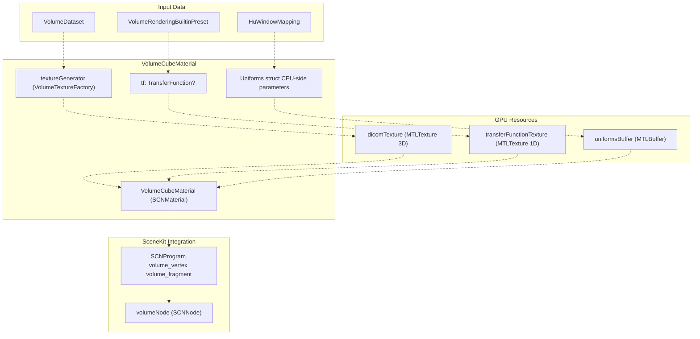
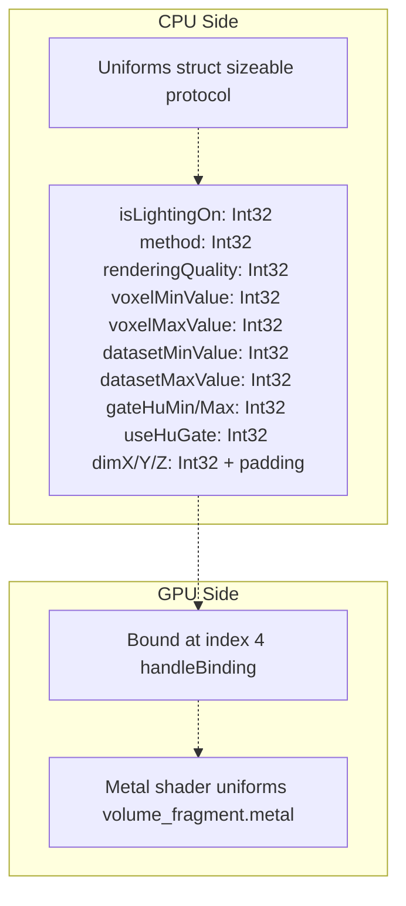
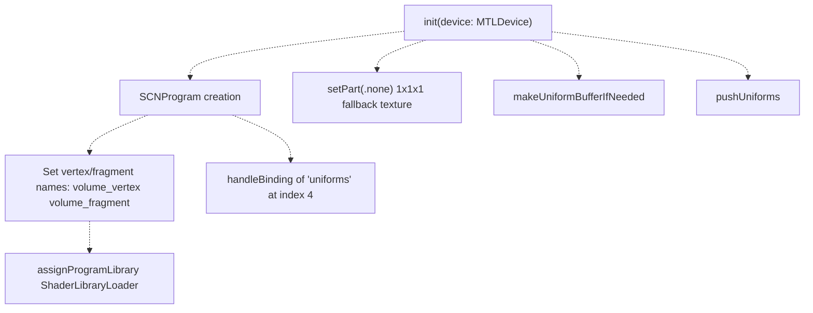
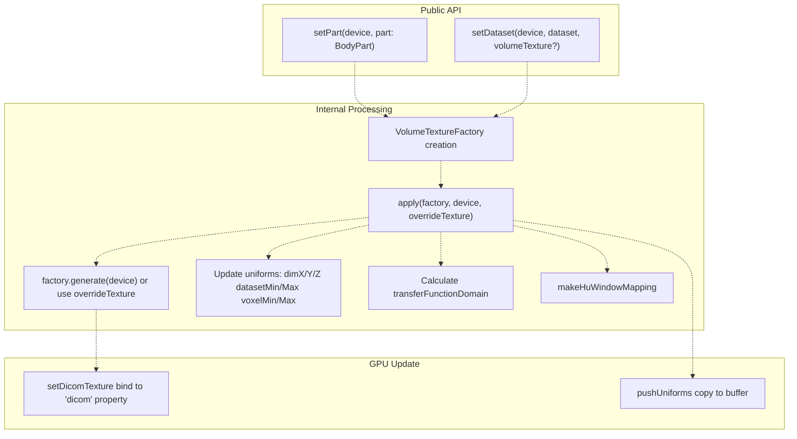
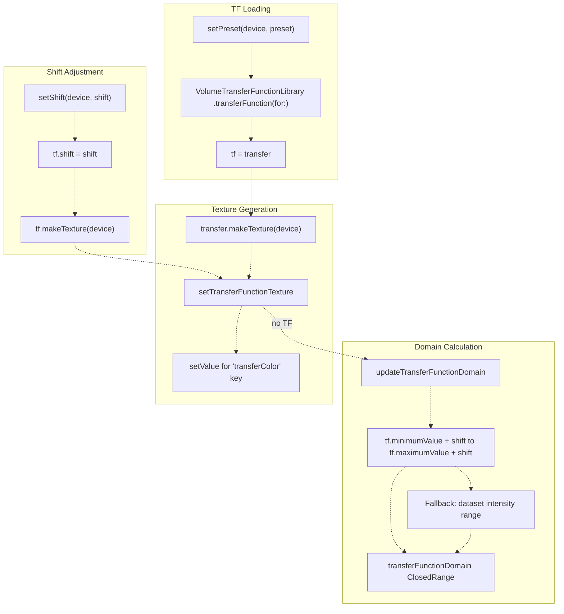
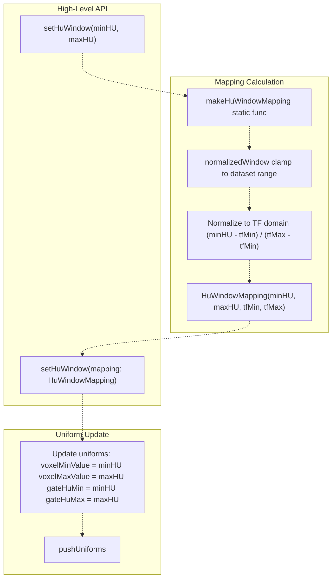
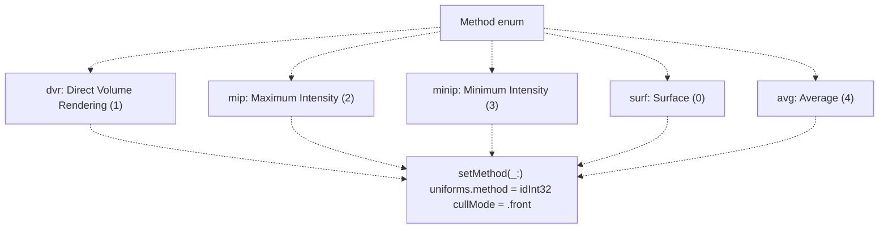
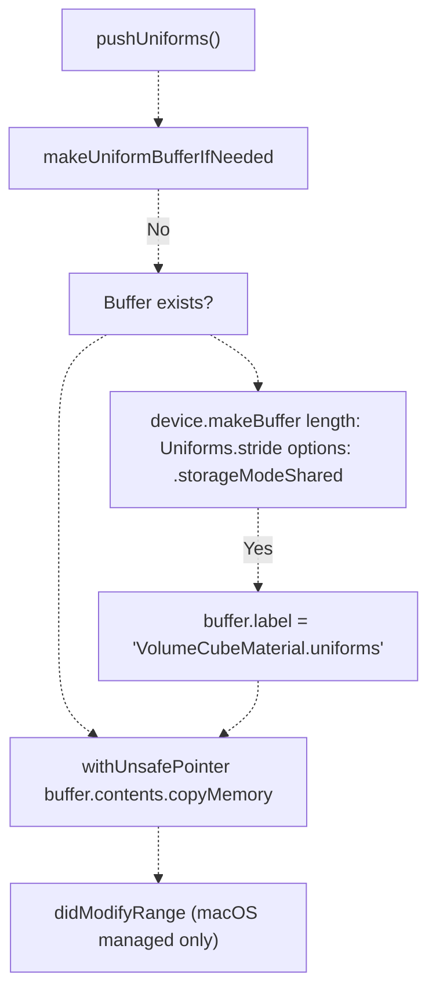
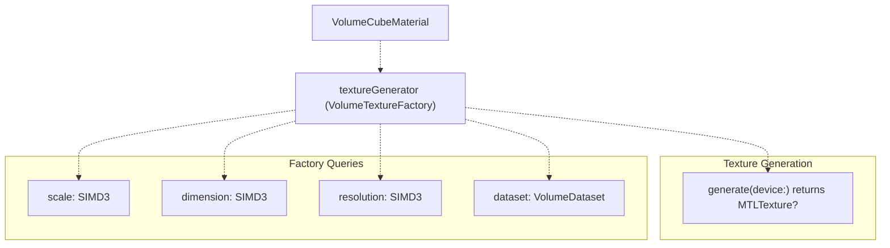

# VolumeCubeMaterial

> **Relevant source files**
> * [Sources/MTKSceneKit/Materials/VolumeCubeMaterial.swift](https://github.com/ThalesMMS/MTK/blob/eda6f990/Sources/MTKSceneKit/Materials/VolumeCubeMaterial.swift)

**Purpose**: `VolumeCubeMaterial` is a custom SceneKit material that encapsulates Metal fragment shaders for volumetric rendering. It manages the GPU resources, uniform parameters, and shader bindings required to render 3D medical volumes using ray marching techniques (DVR, MIP, MinIP, surface rendering, and averaging).

**Scope**: This page covers the material's structure, initialization, dataset binding, transfer function integration, HU windowing system, and rendering parameter management. For information about the Metal shader implementations consumed by this material, see the shader documentation. For MPR slice rendering, see [MPRPlaneMaterial](3c%20Multi-Planar-Reconstruction-%28MPR%29.md). For transfer function details, see [Transfer Functions](4b%20Transfer-Functions.md).

---

## Architecture Overview

`VolumeCubeMaterial` acts as the bridge between high-level volumetric rendering configuration and low-level Metal shader execution in the SceneKit rendering path. It maintains three critical GPU resources: the 3D volume texture, the 1D transfer function texture, and the uniform buffer.



**Flow**: Dataset is converted to 3D texture via `VolumeTextureFactory`, preset loads transfer function and generates 1D texture, HU window parameters populate uniforms struct which is copied to GPU buffer. The material binds all three resources to the Metal shader program during SceneKit rendering.

**Sources**: [Sources/MTKSceneKit/Materials/VolumeCubeMaterial.swift L1-L536](https://github.com/ThalesMMS/MTK/blob/eda6f990/Sources/MTKSceneKit/Materials/VolumeCubeMaterial.swift#L1-L536)

---

## Uniforms Structure

The `Uniforms` struct is the CPU-side representation of shader parameters, maintaining a bit-exact correspondence with the Metal shader's uniform buffer layout. Every field must align with the Metal struct to prevent binding errors.



### Field Descriptions

| Field | Type | Purpose |
| --- | --- | --- |
| `isLightingOn` | `Int32` | Flag to enable/disable diffuse/specular lighting during composition |
| `isBackwardOn` | `Int32` | Inverts ray marching direction (front-to-back vs back-to-front) |
| `method` | `Int32` | Rendering method selector (DVR=1, MIP=2, MinIP=3, Surface=0, Average=4) |
| `renderingQuality` | `Int32` | Number of ray marching steps for volume sampling |
| `voxelMinValue` / `voxelMaxValue` | `Int32` | HU intensity limits for normalizing voxels before TF lookup |
| `datasetMinValue` / `datasetMaxValue` | `Int32` | Full dataset intensity range for absolute value normalization |
| `densityFloor` / `densityCeil` | `Float` | Normalized density range for legacy projection gating |
| `gateHuMin` / `gateHuMax` | `Int32` | HU window for discarding voxels outside interval |
| `useHuGate` | `Int32` | Flag to enable HU gating in shader |
| `dimX` / `dimY` / `dimZ` | `Int32` | Volume dimensions in voxels for gradient calculation |
| `useTFProj` | `Int32` | Flag for thick slab projections to use DVR transfer function |
| `_pad0/1/2` | `Int32` | Alignment padding to match Metal struct layout |

**Sources**: [Sources/MTKSceneKit/Materials/VolumeCubeMaterial.swift L64-L118](https://github.com/ThalesMMS/MTK/blob/eda6f990/Sources/MTKSceneKit/Materials/VolumeCubeMaterial.swift#L64-L118)

---

## Initialization and Shader Binding

The material initializes by creating an `SCNProgram`, binding vertex/fragment functions, and establishing a custom buffer binding for uniforms.



The key initialization sequence:

1. **Program Setup**: Creates `SCNProgram` with vertex function `volume_vertex` and fragment function `volume_fragment`
2. **Library Loading**: Uses `ShaderLibraryLoader.makeDefaultLibrary` to load `VolumeRendering.metallib`
3. **Buffer Binding**: Establishes custom binding for `uniforms` buffer at fragment shader index 4 via `handleBinding` closure
4. **Fallback Initialization**: Calls `setPart(device:part:.none)` to create placeholder 1x1x1 texture via `VolumeTextureFactory.placeholderDataset()`
5. **Buffer Allocation**: Creates initial uniform buffer with `storageModeShared`
6. **Initial Push**: Copies initial uniforms to GPU buffer

**Critical Detail**: The `handleBinding` closure captures a weak self reference and manually calls `setFragmentBuffer` on the render command encoder during each frame. This ensures uniforms are bound at index 4, matching the Metal shader's buffer declaration.

**Sources**: [Sources/MTKSceneKit/Materials/VolumeCubeMaterial.swift L143-L175](https://github.com/ThalesMMS/MTK/blob/eda6f990/Sources/MTKSceneKit/Materials/VolumeCubeMaterial.swift#L143-L175)

 [Sources/MTKSceneKit/Materials/VolumeCubeMaterial.swift L423-L438](https://github.com/ThalesMMS/MTK/blob/eda6f990/Sources/MTKSceneKit/Materials/VolumeCubeMaterial.swift#L423-L438)

---

## Dataset Management

The material supports two dataset loading paths: built-in presets (`BodyPart`) and custom `VolumeDataset` instances. Both paths converge at the internal `apply(factory:device:overrideTexture:)` method.



### Dataset Application Flow

1. **Factory Creation**: Either `VolumeTextureFactory(part:)` for presets or `VolumeTextureFactory(dataset:)` for custom data
2. **Texture Generation**: Calls `factory.generate(device:)` unless `overrideTexture` is provided (useful when sharing texture across materials)
3. **Dimension Update**: Extracts `factory.dimension` and updates `uniforms.dimX/Y/Z`
4. **Intensity Range Sync**: Reads `factory.dataset.intensityRange` and sets `datasetMinValue/datasetMaxValue`
5. **Transfer Function Domain**: Creates float range from dataset intensity bounds for HU windowing normalization
6. **Window Mapping**: Calculates initial `HuWindowMapping` from existing window or dataset range
7. **Uniform Push**: Copies updated uniforms to GPU buffer

**Key Properties**:

* `textureGenerator`: Stores active `VolumeTextureFactory` for metadata queries
* `datasetHuRange`: Cached intensity range for validation
* `scale`: Exposed via `textureGenerator.scale` for world-space dimensions
* `datasetMeta`: Tuple of `(dimension, resolution)` for external queries

**Sources**: [Sources/MTKSceneKit/Materials/VolumeCubeMaterial.swift L211-L227](https://github.com/ThalesMMS/MTK/blob/eda6f990/Sources/MTKSceneKit/Materials/VolumeCubeMaterial.swift#L211-L227)

 [Sources/MTKSceneKit/Materials/VolumeCubeMaterial.swift L440-L484](https://github.com/ThalesMMS/MTK/blob/eda6f990/Sources/MTKSceneKit/Materials/VolumeCubeMaterial.swift#L440-L484)

---

## Transfer Function Integration

Transfer functions map voxel intensity values to RGBA colors and opacities. The material integrates with `VolumeTransferFunctionLibrary` for preset loading and `TransferFunction` for texture generation.



### Transfer Function Methods

| Method | Parameters | Purpose |
| --- | --- | --- |
| `setPreset(device:preset:)` | `VolumeRenderingBuiltinPreset` | Loads preset from library, generates texture, updates domain |
| `setTransferFunctionTexture(_:)` | `MTLTexture` | Directly assigns 1D TF texture, updates domain |
| `setShift(device:shift:)` | `Float` | Adjusts TF intensity offset, regenerates texture |
| `setUseTFOnProjections(_:)` | `Bool` | Enables TF for thick slab projections (sets `useTFProj` flag) |

### Domain Calculation Logic

The `transferFunctionDomain` property stores the effective intensity range of the transfer function, critical for HU windowing:

1. **With TF**: `(tf.minimumValue + shift) ... (tf.maximumValue + shift)`
2. **Without TF (fallback)**: Dataset intensity range converted to Float

This domain is used by `makeHuWindowMapping` to normalize HU values into the [0, 1] range for shader lookup.

**Sources**: [Sources/MTKSceneKit/Materials/VolumeCubeMaterial.swift L234-L271](https://github.com/ThalesMMS/MTK/blob/eda6f990/Sources/MTKSceneKit/Materials/VolumeCubeMaterial.swift#L234-L271)

 [Sources/MTKSceneKit/Materials/VolumeCubeMaterial.swift L493-L520](https://github.com/ThalesMMS/MTK/blob/eda6f990/Sources/MTKSceneKit/Materials/VolumeCubeMaterial.swift#L493-L520)

---

## HU Windowing System

HU windowing controls which intensity values are visible by mapping absolute Hounsfield Units to the transfer function's normalized domain. The system consists of `HuWindowMapping` calculation and uniform synchronization.



### HuWindowMapping Structure

```
public struct HuWindowMapping: Equatable {    public var minHU: Int32      // Clamped minimum HU    public var maxHU: Int32      // Clamped maximum HU    public var tfMin: Float      // Normalized TF domain [0, 1]    public var tfMax: Float      // Normalized TF domain [0, 1]}
```

### Mapping Algorithm

The `makeHuWindowMapping` static method performs a multi-stage normalization:

1. **Dataset Clamping**: `normalizedWindow` ensures minHU/maxHU fall within dataset intensity range
2. **Transfer Function Domain**: Retrieves TF domain or falls back to dataset range as floats
3. **Normalization Function**: Closure that maps HU value to [0, 1] range within TF domain
4. **Boundary Calculation**: Applies normalization to min/max HU values
5. **Struct Creation**: Returns `HuWindowMapping` with both HU and normalized values

**Edge Cases Handled**:

* Empty ranges (min == max): Expands by ±1 or uses fallback
* Inverted ranges: Swaps tfMin/tfMax to maintain min ≤ max invariant
* Int32 boundary values: Special handling for Int32.min/max to prevent overflow

### Uniform Synchronization

When `setHuWindow` is called, four uniform fields are updated:

* `voxelMinValue` / `voxelMaxValue`: Direct HU limits for shader normalization
* `gateHuMin` / `gateHuMax`: HU gating window (when `useHuGate` is enabled)

**Sources**: [Sources/MTKSceneKit/Materials/VolumeCubeMaterial.swift L293-L314](https://github.com/ThalesMMS/MTK/blob/eda6f990/Sources/MTKSceneKit/Materials/VolumeCubeMaterial.swift#L293-L314)

 [Sources/MTKSceneKit/Materials/VolumeCubeMaterial.swift L316-L394](https://github.com/ThalesMMS/MTK/blob/eda6f990/Sources/MTKSceneKit/Materials/VolumeCubeMaterial.swift#L316-L394)

---

## Rendering Parameters

The material exposes methods to control various rendering behaviors, each updating specific uniform fields and triggering a buffer push.

### Rendering Method Selection



### Parameter Control Methods

| Method | Uniform Field(s) | Default | Description |
| --- | --- | --- | --- |
| `setMethod(_:)` | `method` | `dvr` | Selects rendering kernel (surf/dvr/mip/minip/avg) |
| `setLighting(on:)` | `isLightingOn` | `1` | Toggles diffuse/specular lighting |
| `setStep(_:)` | `renderingQuality` | `512` | Sets ray marching step count |
| `setDensityGate(floor:ceil:)` | `densityFloor`, `densityCeil` | `0.02`, `1.0` | Legacy density gating for projections |
| `setHuGate(enabled:)` | `useHuGate` | `0` | Enables HU window-based voxel culling |
| `setUseTFOnProjections(_:)` | `useTFProj` | `0` | Applies TF to thick slab projections |

### Adaptive Sampling Integration

The `samplingStep` computed property exposes `renderingQuality` as a Float, allowing external systems (like adaptive sampling in `VolumetricSceneController`) to dynamically adjust quality during interaction:

```
public var samplingStep: Float { Float(uniforms.renderingQuality) }
```

**Sources**: [Sources/MTKSceneKit/Materials/VolumeCubeMaterial.swift L202-L287](https://github.com/ThalesMMS/MTK/blob/eda6f990/Sources/MTKSceneKit/Materials/VolumeCubeMaterial.swift#L202-L287)

---

## Uniform Buffer Management

The material maintains a single uniform buffer with shared storage mode, automatically allocating on first use and pushing updates via `copyMemory`.



### Buffer Lifecycle

1. **Lazy Allocation**: `makeUniformBufferIfNeeded()` creates buffer only on first push
2. **Shared Storage**: Uses `.storageModeShared` for CPU/GPU coherency without explicit sync
3. **Copy Pattern**: `withUnsafePointer` creates temporary copy, then `copyMemory` transfers to buffer
4. **Platform Handling**: On macOS with managed storage (non-shared), calls `didModifyRange` to notify driver

### Push Triggers

Every public method that modifies uniforms calls `pushUniforms()`:

* Dataset changes (`setDataset`, `setPart`)
* Transfer function updates (`setPreset`, `setTransferFunctionTexture`, `setShift`)
* HU windowing (`setHuWindow`)
* Rendering parameters (`setMethod`, `setLighting`, `setStep`, `setDensityGate`, `setHuGate`, `setUseTFOnProjections`)

**Memory Layout Validation**: The `Uniforms` struct conforms to `sizeable` protocol, ensuring `Uniforms.stride` correctly reports the byte size. Misalignment between Swift struct and Metal shader struct will cause binding errors detectable via Metal GPU Validation or frame capture.

**Sources**: [Sources/MTKSceneKit/Materials/VolumeCubeMaterial.swift L396-L414](https://github.com/ThalesMMS/MTK/blob/eda6f990/Sources/MTKSceneKit/Materials/VolumeCubeMaterial.swift#L396-L414)

 [Sources/MTKSceneKit/Materials/VolumeCubeMaterial.swift L486-L491](https://github.com/ThalesMMS/MTK/blob/eda6f990/Sources/MTKSceneKit/Materials/VolumeCubeMaterial.swift#L486-L491)

---

## Public Properties and Accessors

The material exposes read-only properties for querying current state:

| Property | Type | Purpose |
| --- | --- | --- |
| `scale` | `SIMD3<Float>` | World-space scale of volume cube (from texture factory) |
| `samplingStep` | `Float` | Current ray marching step count |
| `datasetIntensityRange` | `ClosedRange<Int32>` | Full intensity range of active dataset |
| `datasetMeta` | `(SIMD3<Int32>, SIMD3<Float>)` | Tuple of dimension and resolution |
| `currentDataset` | `VolumeDataset` | Active dataset instance |
| `tf` | `TransferFunction?` | Active transfer function (nil if not set) |
| `transferFunctionDomain` | `ClosedRange<Float>?` | Effective TF domain for HU normalization |

### Texture Accessors

```
public func currentVolumeTexture() -> (any MTLTexture)?public func currentTransferFunctionTexture() -> (any MTLTexture)?
```

These methods return the active 3D volume texture and 1D TF texture, useful for sharing resources with MPS backend or debug visualization.

### Uniform Snapshot

```
public func snapshotUniforms() -> Uniforms
```

Returns a copy of the current uniforms struct, allowing external systems to inspect rendering state without GPU buffer access.

**Sources**: [Sources/MTKSceneKit/Materials/VolumeCubeMaterial.swift L139-L200](https://github.com/ThalesMMS/MTK/blob/eda6f990/Sources/MTKSceneKit/Materials/VolumeCubeMaterial.swift#L139-L200)

---

## Integration with VolumeTextureFactory

`VolumeCubeMaterial` delegates all texture generation to `VolumeTextureFactory`, maintaining a reference via `textureGenerator` property.



### Factory Usage Pattern

1. **Creation**: Material creates `VolumeTextureFactory(part:)` or `VolumeTextureFactory(dataset:)`
2. **Generation**: Calls `factory.generate(device:)` to create 3D texture
3. **Metadata Access**: Reads `dimension`, `resolution`, `scale` from factory
4. **Dataset Reference**: Stores factory for later queries via `currentDataset`

**Texture Override**: `setDataset(device:dataset:volumeTexture:)` accepts optional `volumeTexture` parameter to bypass generation, useful when sharing a single texture across multiple materials for memory efficiency.

**Sources**: [Sources/MTKSceneKit/Materials/VolumeCubeMaterial.swift L129](https://github.com/ThalesMMS/MTK/blob/eda6f990/Sources/MTKSceneKit/Materials/VolumeCubeMaterial.swift#L129-L129)

 [Sources/MTKSceneKit/Materials/VolumeCubeMaterial.swift L440-L484](https://github.com/ThalesMMS/MTK/blob/eda6f990/Sources/MTKSceneKit/Materials/VolumeCubeMaterial.swift#L440-L484)

---

## Debugging and Error Handling

The material uses `Logger` for diagnostics and implements `SCNProgramDelegate` for shader error reporting.

### Logger Integration

```
private let logger = Logger(subsystem: "com.mtk.volumerendering",                            category: "VolumeCubeMaterial")
```

**Log Events**:

* Warning: Preset not found in library
* Error: Failed to build transfer function texture
* Error: Failed to generate 3D texture for dataset
* Error: Missing uniforms buffer during push
* Error: Unable to resolve MTLDevice for shader binding
* Fault: Failed to load VolumeRendering.metallib

### SCNProgramDelegate Implementation

```
public func program(_ program: SCNProgram, handleError error: any Error) {    logger.error("SceneKit program error: \(error.localizedDescription)")}
```

Captures shader compilation or runtime errors from SceneKit and logs them.

### Debug SPI

```
#if DEBUG@_spi(Testing) extension VolumeCubeMaterial {    public func debugVolumeTexture() -> (any MTLTexture)? {        dicomTexture    }}#endif
```

Exposes internal texture for testing without polluting public API.

**Binding Verification**: Comments at line 154-157 recommend using Metal Frame Capture or GPU Validation to verify that `uniformsKey` buffer reaches index 4 in the render command encoder if textures appear black.

**Sources**: [Sources/MTKSceneKit/Materials/VolumeCubeMaterial.swift L130-L131](https://github.com/ThalesMMS/MTK/blob/eda6f990/Sources/MTKSceneKit/Materials/VolumeCubeMaterial.swift#L130-L131)

 [Sources/MTKSceneKit/Materials/VolumeCubeMaterial.swift L154-L163](https://github.com/ThalesMMS/MTK/blob/eda6f990/Sources/MTKSceneKit/Materials/VolumeCubeMaterial.swift#L154-L163)

 [Sources/MTKSceneKit/Materials/VolumeCubeMaterial.swift L523-L526](https://github.com/ThalesMMS/MTK/blob/eda6f990/Sources/MTKSceneKit/Materials/VolumeCubeMaterial.swift#L523-L526)

 [Sources/MTKSceneKit/Materials/VolumeCubeMaterial.swift L529-L535](https://github.com/ThalesMMS/MTK/blob/eda6f990/Sources/MTKSceneKit/Materials/VolumeCubeMaterial.swift#L529-L535)


### On this page

* [VolumeCubeMaterial](#4.1-volumecubematerial)
* [Architecture Overview](#4.1-architecture-overview)
* [Uniforms Structure](#4.1-uniforms-structure)
* [Field Descriptions](#4.1-field-descriptions)
* [Initialization and Shader Binding](#4.1-initialization-and-shader-binding)
* [Dataset Management](#4.1-dataset-management)
* [Dataset Application Flow](#4.1-dataset-application-flow)
* [Transfer Function Integration](#4.1-transfer-function-integration)
* [Transfer Function Methods](#4.1-transfer-function-methods)
* [Domain Calculation Logic](#4.1-domain-calculation-logic)
* [HU Windowing System](#4.1-hu-windowing-system)
* [HuWindowMapping Structure](#4.1-huwindowmapping-structure)
* [Mapping Algorithm](#4.1-mapping-algorithm)
* [Uniform Synchronization](#4.1-uniform-synchronization)
* [Rendering Parameters](#4.1-rendering-parameters)
* [Rendering Method Selection](#4.1-rendering-method-selection)
* [Parameter Control Methods](#4.1-parameter-control-methods)
* [Adaptive Sampling Integration](#4.1-adaptive-sampling-integration)
* [Uniform Buffer Management](#4.1-uniform-buffer-management)
* [Buffer Lifecycle](#4.1-buffer-lifecycle)
* [Push Triggers](#4.1-push-triggers)
* [Public Properties and Accessors](#4.1-public-properties-and-accessors)
* [Texture Accessors](#4.1-texture-accessors)
* [Uniform Snapshot](#4.1-uniform-snapshot)
* [Integration with VolumeTextureFactory](#4.1-integration-with-volumetexturefactory)
* [Factory Usage Pattern](#4.1-factory-usage-pattern)
* [Debugging and Error Handling](#4.1-debugging-and-error-handling)
* [Logger Integration](#4.1-logger-integration)
* [SCNProgramDelegate Implementation](#4.1-scnprogramdelegate-implementation)
* [Debug SPI](#4.1-debug-spi)

Ask Devin about MTK