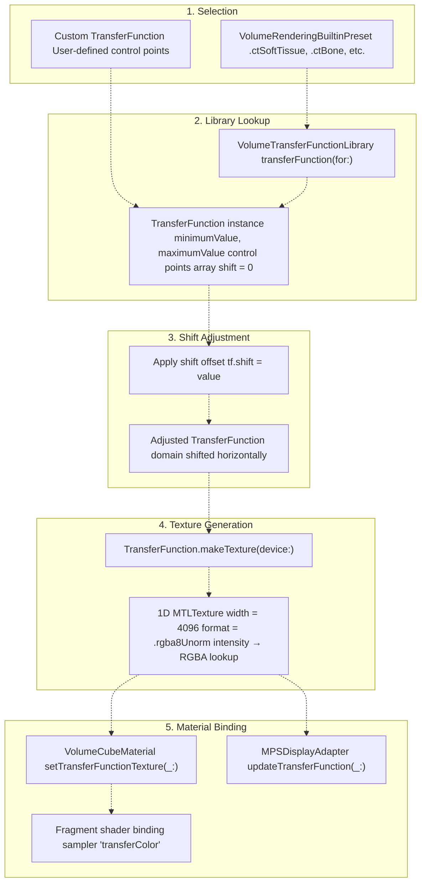
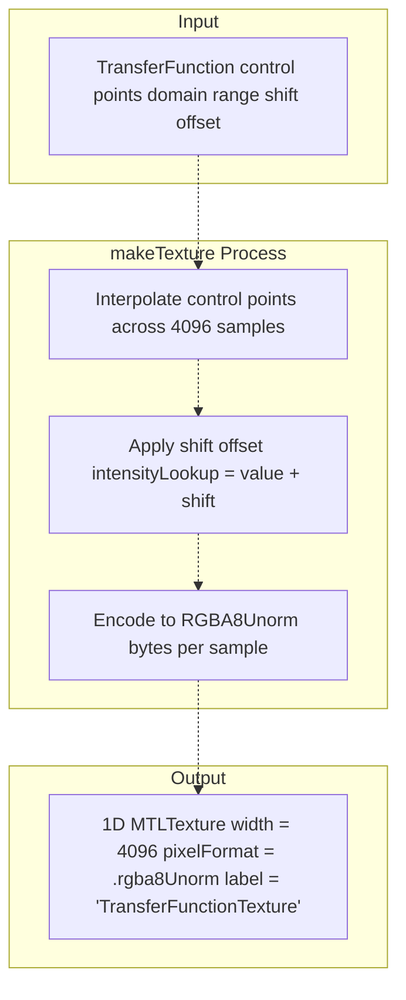
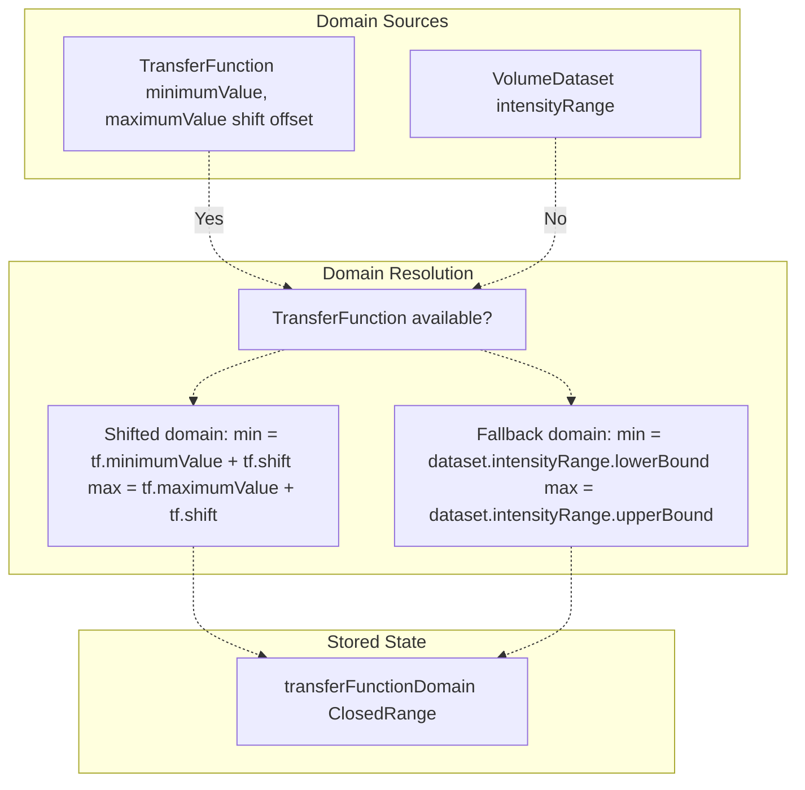
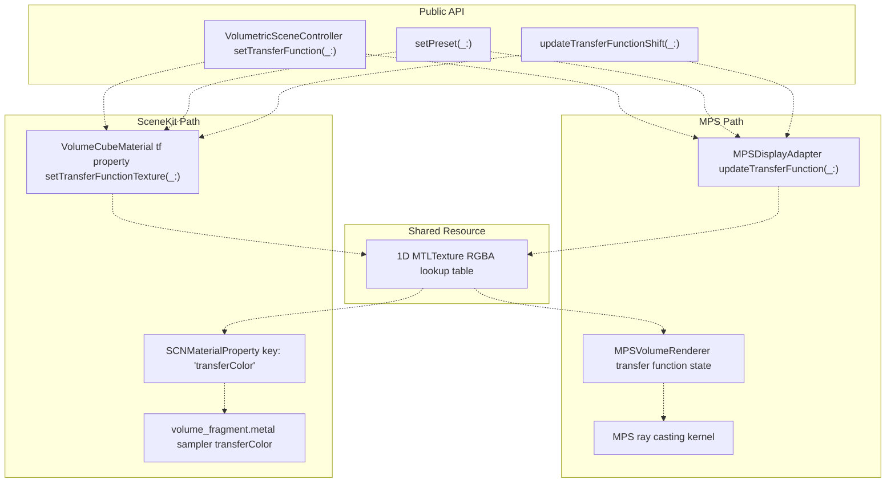
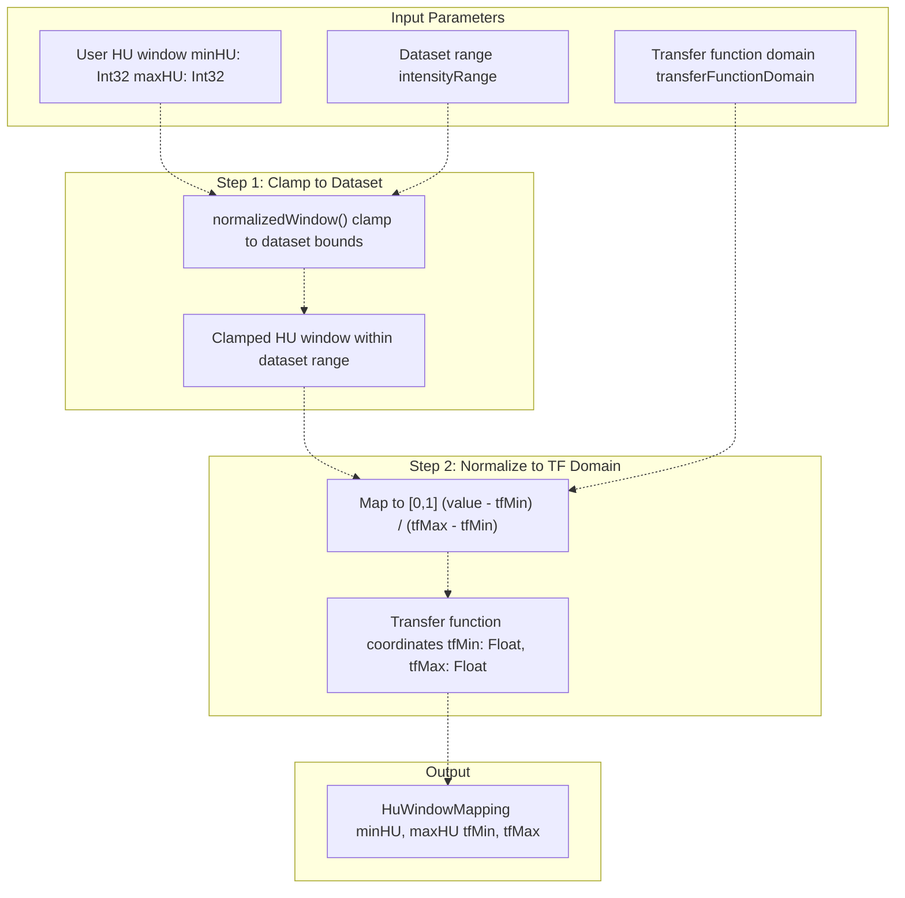

# Transfer Functions

> **Relevant source files**
> * [Sources/MTKSceneKit/Materials/VolumeCubeMaterial.swift](https://github.com/ThalesMMS/MTK/blob/eda6f990/Sources/MTKSceneKit/Materials/VolumeCubeMaterial.swift)
> * [Sources/MTKUI/VolumetricSceneController+Interaction.swift](https://github.com/ThalesMMS/MTK/blob/eda6f990/Sources/MTKUI/VolumetricSceneController+Interaction.swift)

## Purpose and Scope

Transfer functions map volumetric intensity values (typically Hounsfield Units in CT data) to RGBA color and opacity values for rendering. This page documents the transfer function system in MTK: its data structure, the preset library, 1D texture generation for GPU consumption, shift adjustments for dynamic windowing, and integration with volume materials and the MPS backend.

For information about how transfer functions are consumed by fragment shaders during ray marching, see [VolumeCubeMaterial](4a%20VolumeCubeMaterial.md). For HU windowing mechanics that normalize intensity ranges before transfer function lookup, see [VolumeCubeMaterial](4a%20VolumeCubeMaterial.md). For the complete rendering parameter flow from high-level configuration to shader execution, see Diagram 5 in the system architecture overview.

---

## Transfer Function Structure

The `TransferFunction` type represents a piecewise-linear mapping from scalar intensity to RGBA values. While the type definition is not shown in the provided files, its usage reveals the following properties:

| Property | Type | Purpose |
| --- | --- | --- |
| `shift` | `Float` | Horizontal offset applied to intensity domain before lookup |
| `minimumValue` | `Float` | Lower bound of the intensity domain covered by control points |
| `maximumValue` | `Float` | Upper bound of the intensity domain covered by control points |
| `makeTexture(device:)` | Method | Generates a 1D `MTLTexture` encoding the color/opacity mapping |

Transfer functions define **control points** that specify color and opacity at discrete intensity values. The GPU shader performs linear interpolation between these points during rendering.

**Sources:** [Sources/MTKSceneKit/Materials/VolumeCubeMaterial.swift L133](https://github.com/ThalesMMS/MTK/blob/eda6f990/Sources/MTKSceneKit/Materials/VolumeCubeMaterial.swift#L133-L133)

 [Sources/MTKSceneKit/Materials/VolumeCubeMaterial.swift L498-L507](https://github.com/ThalesMMS/MTK/blob/eda6f990/Sources/MTKSceneKit/Materials/VolumeCubeMaterial.swift#L498-L507)

---

## Transfer Function Lifecycle



**Diagram: Transfer Function Lifecycle from Preset Selection to GPU Binding**

**Sources:** [Sources/MTKSceneKit/Materials/VolumeCubeMaterial.swift L234-L246](https://github.com/ThalesMMS/MTK/blob/eda6f990/Sources/MTKSceneKit/Materials/VolumeCubeMaterial.swift#L234-L246)

 [Sources/MTKUI/VolumetricSceneController L256-L272](https://github.com/ThalesMMS/MTK/blob/eda6f990/Sources/MTKUI/VolumetricSceneController+Interaction.swift#L256-L272)

 [Sources/MTKUI/VolumetricSceneController L416-L422](https://github.com/ThalesMMS/MTK/blob/eda6f990/Sources/MTKUI/VolumetricSceneController+Interaction.swift#L416-L422)

---

## Preset Library

The `VolumeTransferFunctionLibrary` provides built-in transfer functions optimized for common medical imaging scenarios. Presets are selected using the `VolumeRenderingBuiltinPreset` enumeration.

### Preset Selection API

The public API exposes preset selection through the controller:

```
// VolumetricSceneController+Interaction.swiftpublic func setPreset(_ preset: VolumeCubeMaterial.Preset) async
```

This method performs the following operations:

1. Retrieves the `TransferFunction` from `VolumeTransferFunctionLibrary`
2. Generates a 1D Metal texture via `makeTexture(device:)`
3. Updates `volumeMaterial.tf` to store the active function
4. Propagates to MPS backend if active

**Sources:** [Sources/MTKUI/VolumetricSceneController L416-L422](https://github.com/ThalesMMS/MTK/blob/eda6f990/Sources/MTKUI/VolumetricSceneController+Interaction.swift#L416-L422)

 [Sources/MTKSceneKit/Materials/VolumeCubeMaterial.swift L233-L246](https://github.com/ThalesMMS/MTK/blob/eda6f990/Sources/MTKSceneKit/Materials/VolumeCubeMaterial.swift#L233-L246)

### Material-Level Preset Application

The `VolumeCubeMaterial` class wraps preset logic:

```
// VolumeCubeMaterial.swift:234-246public func setPreset(device: any MTLDevice, preset: Preset) {    guard let transfer = VolumeTransferFunctionLibrary.transferFunction(for: preset) else {        logger.warning("Preset \(preset.rawValue) not available in library")        return    }    tf = transfer    guard let texture = transfer.makeTexture(device: device, logger: logger) else {        logger.error("Failed to build transfer function texture for preset \(preset.rawValue)")        return    }    setTransferFunctionTexture(texture)    updateTransferFunctionDomain()}
```

**Sources:** [Sources/MTKSceneKit/Materials/VolumeCubeMaterial.swift L233-L246](https://github.com/ThalesMMS/MTK/blob/eda6f990/Sources/MTKSceneKit/Materials/VolumeCubeMaterial.swift#L233-L246)

---

## Texture Generation

Transfer functions are encoded as **1D Metal textures** for efficient GPU lookup. The fragment shader samples this texture using normalized intensity values.

### Texture Generation Flow



**Diagram: 1D Texture Generation from Transfer Function**

The texture width (typically 4096 pixels) provides sufficient resolution for smooth color gradients. Each pixel stores RGBA values where:

* **RGB channels**: Color at that intensity
* **Alpha channel**: Opacity for volume compositing

**Sources:** [Sources/MTKSceneKit/Materials/VolumeCubeMaterial.swift L264-L270](https://github.com/ThalesMMS/MTK/blob/eda6f990/Sources/MTKSceneKit/Materials/VolumeCubeMaterial.swift#L264-L270)

 [Sources/MTKUI/VolumetricSceneController L264-L266](https://github.com/ThalesMMS/MTK/blob/eda6f990/Sources/MTKUI/VolumetricSceneController+Interaction.swift#L264-L266)

### Shader Integration

The generated texture is bound to the fragment shader as a sampler:

```
// VolumeCubeMaterial.swift:249-252public func setTransferFunctionTexture(_ texture: any MTLTexture) {    transferFunctionTexture = texture    setValue(SCNMaterialProperty(contents: texture as Any), forKey: tfKey)    updateTransferFunctionDomain()}
```

The `tfKey` (value: `"transferColor"`) maps to the shader's sampler parameter. During ray marching, the shader normalizes voxel intensities and samples this texture to determine the color and opacity contribution at each step.

**Sources:** [Sources/MTKSceneKit/Materials/VolumeCubeMaterial.swift L249-L253](https://github.com/ThalesMMS/MTK/blob/eda6f990/Sources/MTKSceneKit/Materials/VolumeCubeMaterial.swift#L249-L253)

 [Sources/MTKSceneKit/Materials/VolumeCubeMaterial.swift L124](https://github.com/ThalesMMS/MTK/blob/eda6f990/Sources/MTKSceneKit/Materials/VolumeCubeMaterial.swift#L124-L124)

---

## Transfer Function Domain

The **transfer function domain** is the range of intensity values covered by the function's control points. This domain is essential for HU windowing calculations that normalize raw dataset intensities before transfer function lookup.

### Domain Calculation



**Diagram: Transfer Function Domain Resolution Logic**

**Sources:** [Sources/MTKSceneKit/Materials/VolumeCubeMaterial.swift L494-L519](https://github.com/ThalesMMS/MTK/blob/eda6f990/Sources/MTKSceneKit/Materials/VolumeCubeMaterial.swift#L494-L519)

### Domain Update Implementation

```
// VolumeCubeMaterial.swift:494-519func updateTransferFunctionDomain() {    if let tf {        let shift = tf.shift        let minValue = tf.minimumValue + shift        let maxValue = tf.maximumValue + shift        if maxValue >= minValue {            transferFunctionDomain = minValue...maxValue        } else {            transferFunctionDomain = maxValue...minValue        }    }        if transferFunctionDomain == nil {        transferFunctionDomain = ClosedRange(            uncheckedBounds: (                lower: Float(datasetHuRange.lowerBound),                upper: Float(datasetHuRange.upperBound)            )        )    }}
```

This domain is used by `makeHuWindowMapping` to normalize user-specified HU windows to the [0, 1] range expected by the shader.

**Sources:** [Sources/MTKSceneKit/Materials/VolumeCubeMaterial.swift L494-L519](https://github.com/ThalesMMS/MTK/blob/eda6f990/Sources/MTKSceneKit/Materials/VolumeCubeMaterial.swift#L494-L519)

 [Sources/MTKSceneKit/Materials/VolumeCubeMaterial.swift L330-L369](https://github.com/ThalesMMS/MTK/blob/eda6f990/Sources/MTKSceneKit/Materials/VolumeCubeMaterial.swift#L330-L369)

---

## Shift Adjustments

The **shift** property allows horizontal translation of the transfer function domain without regenerating the underlying control points. This enables dynamic windowing adjustments during interaction.

### Shift API

```
// VolumetricSceneController+Interaction.swift:394-404public func updateTransferFunctionShift(_ shift: Float) async {    guard let tf = transferFunction else { return }    var copy = tf    copy.shift = shift    guard let texture = copy.makeTexture(device: device) else { return }    volumeMaterial.setTransferFunctionTexture(texture)    transferFunction = copy    mpsDisplay?.updateTransferFunction(copy)}
```

The shift adjustment:

1. Copies the current transfer function
2. Modifies the `shift` property
3. Regenerates the 1D texture with adjusted domain
4. Updates both SceneKit and MPS backends

**Sources:** [Sources/MTKUI/VolumetricSceneController L394-L404](https://github.com/ThalesMMS/MTK/blob/eda6f990/Sources/MTKUI/VolumetricSceneController+Interaction.swift#L394-L404)

### Material-Level Shift

```
// VolumeCubeMaterial.swift:266-271public func setShift(device: any MTLDevice, shift: Float) {    tf?.shift = shift    guard let tf, let texture = tf.makeTexture(device: device) else { return }    setTransferFunctionTexture(texture)    updateTransferFunctionDomain()}
```

Shift adjustments trigger:

* **Texture regeneration**: New 1D texture with shifted lookup
* **Domain recalculation**: Updates `transferFunctionDomain` bounds
* **Shader rebinding**: New texture replaces old in material properties

**Sources:** [Sources/MTKSceneKit/Materials/VolumeCubeMaterial.swift L266-L271](https://github.com/ThalesMMS/MTK/blob/eda6f990/Sources/MTKSceneKit/Materials/VolumeCubeMaterial.swift#L266-L271)

 [Sources/MTKUI/VolumetricSceneController L424-L430](https://github.com/ThalesMMS/MTK/blob/eda6f990/Sources/MTKUI/VolumetricSceneController+Interaction.swift#L424-L430)

### Default Shift Tracking

The controller maintains a baseline shift for reset operations:

```
// VolumetricSceneController+Interaction.swift:69-70let baselineShift = transferFunction?.shift ?? volumeMaterial.tf?.shift ?? 0defaultTransferShift = baselineShift
```

This baseline is restored during `resetView()` operations.

**Sources:** [Sources/MTKUI/VolumetricSceneController L69-L70](https://github.com/ThalesMMS/MTK/blob/eda6f990/Sources/MTKUI/VolumetricSceneController+Interaction.swift#L69-L70)

 [Sources/MTKUI/VolumetricSceneController L552-L555](https://github.com/ThalesMMS/MTK/blob/eda6f990/Sources/MTKUI/VolumetricSceneController+Interaction.swift#L552-L555)

---

## Integration with Rendering Backends

Transfer functions integrate with both the SceneKit and Metal Performance Shaders rendering backends through synchronized updates.

### Dual Backend Synchronization



**Diagram: Transfer Function Synchronization Across Rendering Backends**

**Sources:** [Sources/MTKUI/VolumetricSceneController L256-L272](https://github.com/ThalesMMS/MTK/blob/eda6f990/Sources/MTKUI/VolumetricSceneController+Interaction.swift#L256-L272)

 [Sources/MTKUI/VolumetricSceneController L416-L422](https://github.com/ThalesMMS/MTK/blob/eda6f990/Sources/MTKUI/VolumetricSceneController+Interaction.swift#L416-L422)

 [Sources/MTKUI/VolumetricSceneController L394-L404](https://github.com/ThalesMMS/MTK/blob/eda6f990/Sources/MTKUI/VolumetricSceneController+Interaction.swift#L394-L404)

### Backend-Specific Updates

All transfer function mutations propagate to the active MPS backend:

| Operation | SceneKit Update | MPS Update |
| --- | --- | --- |
| `setTransferFunction` | `volumeMaterial.setTransferFunctionTexture` | `mpsDisplay?.updateTransferFunction` |
| `setPreset` | `volumeMaterial.setPreset` | `mpsDisplay?.updateTransferFunction` |
| `updateTransferFunctionShift` | `volumeMaterial.setTransferFunctionTexture` | `mpsDisplay?.updateTransferFunction` |
| `setShift` | `volumeMaterial.setShift` | `mpsDisplay?.updateTransferFunction` |

The conditional MPS updates (`mpsDisplay?.`) safely handle cases where the MPS backend is unavailable or inactive.

**Sources:** [Sources/MTKUI/VolumetricSceneController L269-L271](https://github.com/ThalesMMS/MTK/blob/eda6f990/Sources/MTKUI/VolumetricSceneController+Interaction.swift#L269-L271)

 [Sources/MTKUI/VolumetricSceneController L419-L421](https://github.com/ThalesMMS/MTK/blob/eda6f990/Sources/MTKUI/VolumetricSceneController+Interaction.swift#L419-L421)

 [Sources/MTKUI/VolumetricSceneController L401-L403](https://github.com/ThalesMMS/MTK/blob/eda6f990/Sources/MTKUI/VolumetricSceneController+Interaction.swift#L401-L403)

 [Sources/MTKUI/VolumetricSceneController L427-L429](https://github.com/ThalesMMS/MTK/blob/eda6f990/Sources/MTKUI/VolumetricSceneController+Interaction.swift#L427-L429)

---

## HU Window Mapping

Transfer functions work in concert with HU windowing to control which intensities are visible. The `HuWindowMapping` structure normalizes user-specified Hounsfield Unit ranges to the transfer function's domain.

### HU Window Mapping Structure

```
// VolumeCubeMaterial.swift:316-328public struct HuWindowMapping: Equatable {    public var minHU: Int32    public var maxHU: Int32    public var tfMin: Float    public var tfMax: Float}
```

| Field | Type | Purpose |
| --- | --- | --- |
| `minHU` | `Int32` | Lower bound of HU window (absolute value) |
| `maxHU` | `Int32` | Upper bound of HU window (absolute value) |
| `tfMin` | `Float` | Normalized position in TF domain [0, 1] for `minHU` |
| `tfMax` | `Float` | Normalized position in TF domain [0, 1] for `maxHU` |

**Sources:** [Sources/MTKSceneKit/Materials/VolumeCubeMaterial.swift L316-L328](https://github.com/ThalesMMS/MTK/blob/eda6f990/Sources/MTKSceneKit/Materials/VolumeCubeMaterial.swift#L316-L328)

### Mapping Calculation Flow



**Diagram: HU Window Mapping Calculation Process**

**Sources:** [Sources/MTKSceneKit/Materials/VolumeCubeMaterial.swift L330-L369](https://github.com/ThalesMMS/MTK/blob/eda6f990/Sources/MTKSceneKit/Materials/VolumeCubeMaterial.swift#L330-L369)

### Mapping Implementation

```
// VolumeCubeMaterial.swift:330-369public static func makeHuWindowMapping(    minHU: Int32,    maxHU: Int32,    datasetRange: ClosedRange<Int32>,    transferDomain: ClosedRange<Float>?) -> HuWindowMapping {    let resolvedWindow = normalizedWindow(        minHU: minHU,        maxHU: maxHU,        datasetRange: datasetRange    )        let domain = transferDomain ?? ClosedRange(        uncheckedBounds: (            lower: Float(datasetRange.lowerBound),            upper: Float(datasetRange.upperBound)        )    )        let lowerBound = domain.lowerBound    let upperBound = domain.upperBound    let span = upperBound - lowerBound        let normalized: (Float) -> Float = { value in        guard span.magnitude > .ulpOfOne else { return 0 }        let clamped = max(lowerBound, min(value, upperBound))        return (clamped - lowerBound) / span    }        let lower = normalized(Float(resolvedWindow.lowerBound))    let upper = normalized(Float(resolvedWindow.upperBound))        let tfMin = min(lower, upper)    let tfMax = max(lower, upper)        return HuWindowMapping(        minHU: resolvedWindow.lowerBound,        maxHU: resolvedWindow.upperBound,        tfMin: tfMin,        tfMax: tfMax    )}
```

The mapping ensures:

1. **Dataset clamping**: HU values outside dataset range are clamped
2. **Domain fallback**: If no transfer function domain exists, uses dataset range
3. **Normalized coordinates**: Output `tfMin`/`tfMax` are in [0, 1] range for shader consumption

**Sources:** [Sources/MTKSceneKit/Materials/VolumeCubeMaterial.swift L330-L369](https://github.com/ThalesMMS/MTK/blob/eda6f990/Sources/MTKSceneKit/Materials/VolumeCubeMaterial.swift#L330-L369)

---

## Uniforms and Shader Binding

Transfer function state is communicated to shaders through multiple channels:

### Transfer Function Texture Binding

The 1D texture is bound as a SceneKit material property:

```
// VolumeCubeMaterial.swift:124 (tfKey declaration)private let tfKey = "transferColor"// VolumeCubeMaterial.swift:251setValue(SCNMaterialProperty(contents: texture as Any), forKey: tfKey)
```

The shader accesses this as a sampler named `transferColor`.

**Sources:** [Sources/MTKSceneKit/Materials/VolumeCubeMaterial.swift L124](https://github.com/ThalesMMS/MTK/blob/eda6f990/Sources/MTKSceneKit/Materials/VolumeCubeMaterial.swift#L124-L124)

 [Sources/MTKSceneKit/Materials/VolumeCubeMaterial.swift L249-L252](https://github.com/ThalesMMS/MTK/blob/eda6f990/Sources/MTKSceneKit/Materials/VolumeCubeMaterial.swift#L249-L252)

### HU Window Uniforms

HU window bounds are propagated to the shader via the `Uniforms` buffer:

```
// VolumeCubeMaterial.swift:82-87public var voxelMinValue: Int32 = -1024public var voxelMaxValue: Int32 = 3071public var datasetMinValue: Int32 = -1024public var datasetMaxValue: Int32 = 3071
```

These fields allow the shader to normalize raw voxel intensities before transfer function lookup:

```
normalized = (voxelValue - voxelMinValue) / (voxelMaxValue - voxelMinValue)
rgba = sample(transferColor, normalized)
```

**Sources:** [Sources/MTKSceneKit/Materials/VolumeCubeMaterial.swift L82-L89](https://github.com/ThalesMMS/MTK/blob/eda6f990/Sources/MTKSceneKit/Materials/VolumeCubeMaterial.swift#L82-L89)

### Gating Parameters

Additional uniforms control which intensities pass through rendering:

```
// VolumeCubeMaterial.swift:96-100public var gateHuMin: Int32 = -900public var gateHuMax: Int32 = -500public var useHuGate: Int32 = 0
```

When `useHuGate` is enabled, voxels outside `[gateHuMin, gateHuMax]` are discarded during ray marching.

**Sources:** [Sources/MTKSceneKit/Materials/VolumeCubeMaterial.swift L96-L100](https://github.com/ThalesMMS/MTK/blob/eda6f990/Sources/MTKSceneKit/Materials/VolumeCubeMaterial.swift#L96-L100)

---

## Transfer Function API Surface

The following table summarizes all public methods for transfer function manipulation:

| Method | Location | Purpose |
| --- | --- | --- |
| `setTransferFunction(_:)` | VolumetricSceneController+Interaction | Apply custom transfer function |
| `setPreset(_:)` | VolumetricSceneController+Interaction | Load library preset |
| `updateTransferFunctionShift(_:)` | VolumetricSceneController+Interaction | Adjust shift offset |
| `setShift(_:)` | VolumetricSceneController+Interaction | Alternative shift API |
| `setPreset(device:preset:)` | VolumeCubeMaterial | Material-level preset loading |
| `setTransferFunctionTexture(_:)` | VolumeCubeMaterial | Direct texture binding |
| `setShift(device:shift:)` | VolumeCubeMaterial | Material-level shift adjustment |
| `setHuWindow(_:)` | VolumeCubeMaterial | Apply HU window mapping |
| `setHuWindow(minHU:maxHU:)` | VolumeCubeMaterial | Convenience HU window setter |

**Sources:** [Sources/MTKUI/VolumetricSceneController L256-L272](https://github.com/ThalesMMS/MTK/blob/eda6f990/Sources/MTKUI/VolumetricSceneController+Interaction.swift#L256-L272)

 [Sources/MTKUI/VolumetricSceneController L394-L430](https://github.com/ThalesMMS/MTK/blob/eda6f990/Sources/MTKUI/VolumetricSceneController+Interaction.swift#L394-L430)

 [Sources/MTKSceneKit/Materials/VolumeCubeMaterial.swift L233-L314](https://github.com/ThalesMMS/MTK/blob/eda6f990/Sources/MTKSceneKit/Materials/VolumeCubeMaterial.swift#L233-L314)

---

## Default Transfer Function Initialization

When a dataset is loaded without an explicit transfer function, the system applies a default preset:

```
// VolumetricSceneController+Interaction.swift:50-54if volumeMaterial.tf == nil {    // Default to a visible preset and lighting on first load.    volumeMaterial.setPreset(device: device, preset: .ctSoftTissue)    volumeMaterial.setLighting(on: true)}
```

This ensures the volume is immediately visible with reasonable settings. The baseline shift is captured for reset operations:

```
// VolumetricSceneController+Interaction.swift:69-70let baselineShift = transferFunction?.shift ?? volumeMaterial.tf?.shift ?? 0defaultTransferShift = baselineShift
```

**Sources:** [Sources/MTKUI/VolumetricSceneController L50-L54](https://github.com/ThalesMMS/MTK/blob/eda6f990/Sources/MTKUI/VolumetricSceneController+Interaction.swift#L50-L54)

 [Sources/MTKUI/VolumetricSceneController L69-L70](https://github.com/ThalesMMS/MTK/blob/eda6f990/Sources/MTKUI/VolumetricSceneController+Interaction.swift#L69-L70)


### On this page

* [Transfer Functions](#4.2-transfer-functions)
* [Purpose and Scope](#4.2-purpose-and-scope)
* [Transfer Function Structure](#4.2-transfer-function-structure)
* [Transfer Function Lifecycle](#4.2-transfer-function-lifecycle)
* [Preset Library](#4.2-preset-library)
* [Preset Selection API](#4.2-preset-selection-api)
* [Material-Level Preset Application](#4.2-material-level-preset-application)
* [Texture Generation](#4.2-texture-generation)
* [Texture Generation Flow](#4.2-texture-generation-flow)
* [Shader Integration](#4.2-shader-integration)
* [Transfer Function Domain](#4.2-transfer-function-domain)
* [Domain Calculation](#4.2-domain-calculation)
* [Domain Update Implementation](#4.2-domain-update-implementation)
* [Shift Adjustments](#4.2-shift-adjustments)
* [Shift API](#4.2-shift-api)
* [Material-Level Shift](#4.2-material-level-shift)
* [Default Shift Tracking](#4.2-default-shift-tracking)
* [Integration with Rendering Backends](#4.2-integration-with-rendering-backends)
* [Dual Backend Synchronization](#4.2-dual-backend-synchronization)
* [Backend-Specific Updates](#4.2-backend-specific-updates)
* [HU Window Mapping](#4.2-hu-window-mapping)
* [HU Window Mapping Structure](#4.2-hu-window-mapping-structure)
* [Mapping Calculation Flow](#4.2-mapping-calculation-flow)
* [Mapping Implementation](#4.2-mapping-implementation)
* [Uniforms and Shader Binding](#4.2-uniforms-and-shader-binding)
* [Transfer Function Texture Binding](#4.2-transfer-function-texture-binding)
* [HU Window Uniforms](#4.2-hu-window-uniforms)
* [Gating Parameters](#4.2-gating-parameters)
* [Transfer Function API Surface](#4.2-transfer-function-api-surface)
* [Default Transfer Function Initialization](#4.2-default-transfer-function-initialization)

Ask Devin about MTK