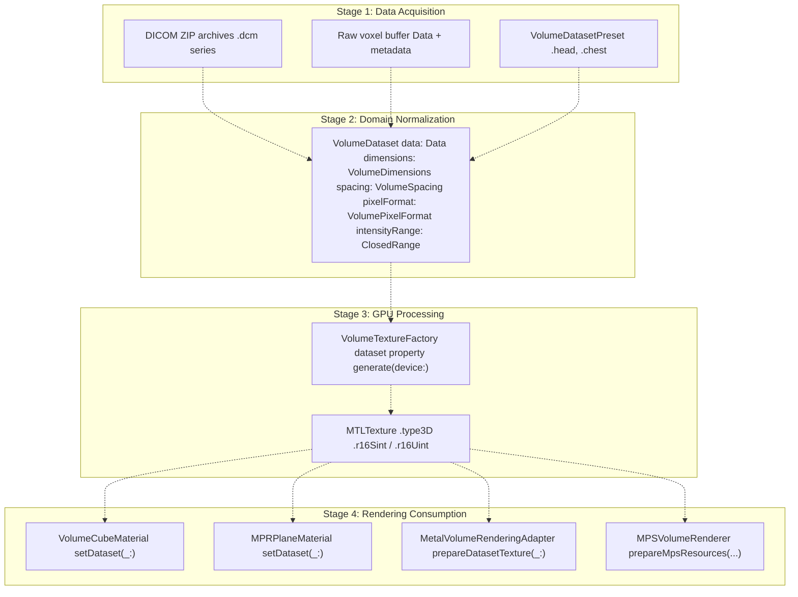
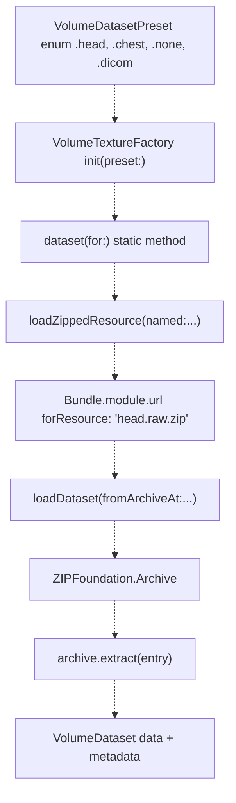
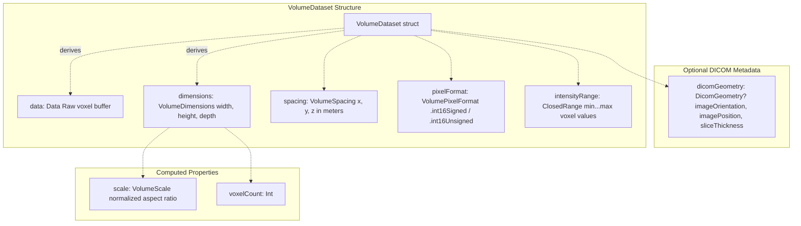
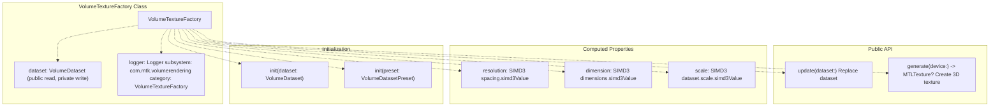
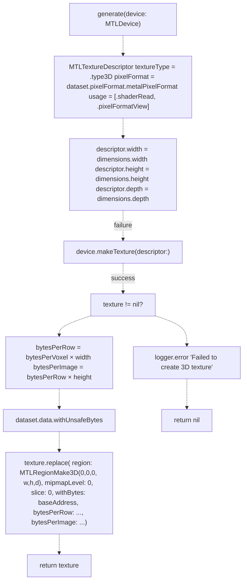
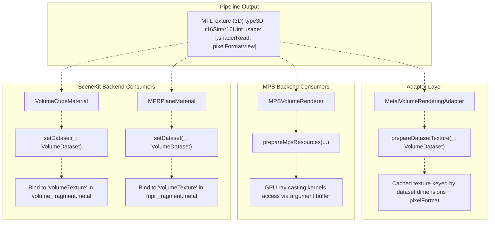

# Data Pipeline

> **Relevant source files**
> * [BACKEND_RESOLVER_USAGE.md](https://github.com/ThalesMMS/MTK/blob/eda6f990/BACKEND_RESOLVER_USAGE.md)
> * [DOCUMENTATION_STANDARD.md](https://github.com/ThalesMMS/MTK/blob/eda6f990/DOCUMENTATION_STANDARD.md)
> * [README.md](https://github.com/ThalesMMS/MTK/blob/eda6f990/README.md)
> * [SURFACE_ADAPTER_DELIVERABLES.txt](https://github.com/ThalesMMS/MTK/blob/eda6f990/SURFACE_ADAPTER_DELIVERABLES.txt)
> * [Sources/MTKCore/Metal/VolumeTextureFactory.swift](https://github.com/ThalesMMS/MTK/blob/eda6f990/Sources/MTKCore/Metal/VolumeTextureFactory.swift)

The data pipeline transforms raw volumetric data from various sources into GPU-ready Metal textures suitable for rendering. This document covers the multi-stage conversion process from input data (DICOM files, raw voxel buffers, or built-in presets) through domain model normalization to 3D texture generation and consumption by rendering components.

For information about how transfer functions are applied to volume data, see [Transfer Functions](#4.3). For details on the rendering components that consume pipeline outputs, see [Materials and Shaders](4%20Materials-and-Shaders.md). For DICOM-specific loading workflows, see [DICOM Loading](#5.3).

---

## Pipeline Overview

The data pipeline consists of four primary stages:

1. **Data Acquisition** — Load from DICOM archives, raw voxel buffers, or bundled presets
2. **Domain Normalization** — Convert to `VolumeDataset` with standardized metadata
3. **GPU Processing** — Generate 3D `MTLTexture` via `VolumeTextureFactory`
4. **Rendering Consumption** — Bind textures to materials, adapters, and MPS renderers



**Sources:** [Sources/MTKCore/Metal/VolumeTextureFactory.swift L1-L191](https://github.com/ThalesMMS/MTK/blob/eda6f990/Sources/MTKCore/Metal/VolumeTextureFactory.swift#L1-L191)

---

## Data Sources and Input Formats

The pipeline accepts volumetric data from three sources, each following a different loading path:

### Built-in Presets

`VolumeTextureFactory` supports initialization from `VolumeDatasetPreset` enum values (`.head`, `.chest`). These load pre-configured datasets from bundled ZIP archives containing raw voxel data.



The factory searches for `<name>.raw.zip` in `Bundle.module` and extracts the raw voxel buffer. If the resource is missing or extraction fails, a placeholder 1×1×1 dataset is returned.

| Preset | Dimensions | Spacing (mm) | Pixel Format | Intensity Range |
| --- | --- | --- | --- | --- |
| `.head` | 512×512×511 | 0.449×0.449×0.501 | `.int16Signed` | -1024...3071 |
| `.chest` | 512×512×179 | 0.586×0.586×2.0 | `.int16Signed` | -1024...3071 |
| `.none` / `.dicom` | 1×1×1 | 1×1×1 | `.int16Signed` | -1024...3071 |

**Sources:** [Sources/MTKCore/Metal/VolumeTextureFactory.swift L72-L104](https://github.com/ThalesMMS/MTK/blob/eda6f990/Sources/MTKCore/Metal/VolumeTextureFactory.swift#L72-L104)

 [Sources/MTKCore/Metal/VolumeTextureFactory.swift L106-L166](https://github.com/ThalesMMS/MTK/blob/eda6f990/Sources/MTKCore/Metal/VolumeTextureFactory.swift#L106-L166)

### Raw Voxel Buffers

Applications can directly construct `VolumeDataset` from a `Data` buffer containing voxel values. This path requires explicit metadata specification:

```
let voxelCount = 256 * 256 * 128let voxels = Data(repeating: 0, count: voxelCount * VolumePixelFormat.int16Signed.bytesPerVoxel)let dataset = VolumeDataset(    data: voxels,    dimensions: VolumeDimensions(width: 256, height: 256, depth: 128),    spacing: VolumeSpacing(x: 0.001, y: 0.001, z: 0.0015),    pixelFormat: .int16Signed,    intensityRange: (-1024)...3071)let factory = VolumeTextureFactory(dataset: dataset)
```

**Sources:** README.md

### DICOM Archives

DICOM volume loading is orchestrated by `DicomVolumeLoader`, which handles ZIP extraction and delegates slice parsing to an injected `DicomSeriesLoading` implementation. This path is covered in detail in [DICOM Loading](#5.3).

**Sources:** README.md

---

## VolumeDataset: The Normalized Domain Model

`VolumeDataset` is the central domain type that normalizes volumetric data regardless of input source. All pipeline paths converge at this model before GPU processing.



### Key Properties

* **`data: Data`** — Contiguous buffer of voxel intensities in row-major order (width → height → depth)
* **`dimensions: VolumeDimensions`** — Integer voxel counts along each axis
* **`spacing: VolumeSpacing`** — Physical distance between voxel centers in meters
* **`pixelFormat: VolumePixelFormat`** — Data type (`.int16Signed` maps to `MTLPixelFormat.r16Sint`, `.int16Unsigned` to `.r16Uint`)
* **`intensityRange: ClosedRange<Int32>`** — Minimum and maximum voxel intensity values (used for normalization)
* **`dicomGeometry: DicomGeometry?`** — Optional DICOM spatial metadata (patient orientation, slice positioning)

### Pixel Format Mapping

| `VolumePixelFormat` | `MTLPixelFormat` | Bytes per Voxel |
| --- | --- | --- |
| `.int16Signed` | `.r16Sint` | 2 |
| `.int16Unsigned` | `.r16Uint` | 2 |

**Sources:** [Sources/MTKCore/Metal/VolumeTextureFactory.swift L182-L190](https://github.com/ThalesMMS/MTK/blob/eda6f990/Sources/MTKCore/Metal/VolumeTextureFactory.swift#L182-L190)

The dataset model provides computed properties for derived values:

* **`scale: VolumeScale`** — Aspect ratio normalization (largest dimension = 1.0)
* **`voxelCount: Int`** — Total number of voxels (`width × height × depth`)

This separation allows upstream code to work with physical dimensions and downstream rendering code to work with normalized coordinates.

**Sources:** [Sources/MTKCore/Metal/VolumeTextureFactory.swift L30-L32](https://github.com/ThalesMMS/MTK/blob/eda6f990/Sources/MTKCore/Metal/VolumeTextureFactory.swift#L30-L32)

---

## GPU Texture Generation

### VolumeTextureFactory

`VolumeTextureFactory` converts `VolumeDataset` into 3D Metal textures suitable for shader sampling. The factory maintains a reference to the dataset and exposes convenience properties for rendering configuration.



**Sources:** [Sources/MTKCore/Metal/VolumeTextureFactory.swift L15-L36](https://github.com/ThalesMMS/MTK/blob/eda6f990/Sources/MTKCore/Metal/VolumeTextureFactory.swift#L15-L36)

### Texture Generation Process

The `generate(device:)` method performs the following operations:



**Sources:** [Sources/MTKCore/Metal/VolumeTextureFactory.swift L38-L68](https://github.com/ThalesMMS/MTK/blob/eda6f990/Sources/MTKCore/Metal/VolumeTextureFactory.swift#L38-L68)

#### Texture Configuration

| Property | Value | Purpose |
| --- | --- | --- |
| `textureType` | `.type3D` | Enable 3D texture sampling in shaders |
| `pixelFormat` | `.r16Sint` or `.r16Uint` | Single-channel signed/unsigned 16-bit integer |
| `usage` | `[.shaderRead, .pixelFormatView]` | Allow shader sampling and pixel format reinterpretation |
| `width × height × depth` | From `dataset.dimensions` | Voxel grid resolution |

The texture data is uploaded via `MTLTexture.replace(region:...)` using the raw bytes from `dataset.data`. The method computes byte strides based on pixel format:

* **`bytesPerRow`** = `pixelFormat.bytesPerVoxel × width`
* **`bytesPerImage`** = `bytesPerRow × height`

**Sources:** [Sources/MTKCore/Metal/VolumeTextureFactory.swift L39-L68](https://github.com/ThalesMMS/MTK/blob/eda6f990/Sources/MTKCore/Metal/VolumeTextureFactory.swift#L39-L68)

### Factory Usage Patterns

```sql
// Pattern 1: Direct dataset constructionlet factory = VolumeTextureFactory(dataset: myDataset)guard let texture = factory.generate(device: device) else {    // Handle texture creation failure    return}// Pattern 2: Preset initializationlet factory = VolumeTextureFactory(preset: .head)guard let texture = factory.generate(device: device) else {    // Handle missing preset resource    return}// Pattern 3: Dataset updatefactory.update(dataset: newDataset)let updatedTexture = factory.generate(device: device)
```

**Sources:** [Sources/MTKCore/Metal/VolumeTextureFactory.swift L22-L36](https://github.com/ThalesMMS/MTK/blob/eda6f990/Sources/MTKCore/Metal/VolumeTextureFactory.swift#L22-L36)

---

## Rendering Integration

Once a 3D texture is generated, it flows to multiple rendering consumers. The pipeline supports both SceneKit-based and MPS-based rendering backends.



**Sources:** [Sources/MTKCore/Metal/VolumeTextureFactory.swift L38-L68](https://github.com/ThalesMMS/MTK/blob/eda6f990/Sources/MTKCore/Metal/VolumeTextureFactory.swift#L38-L68)

### Material Binding

`VolumeCubeMaterial` and `MPRPlaneMaterial` both invoke `VolumeTextureFactory.generate(device:)` when a new dataset is applied via `setDataset(_:)`. The resulting texture is bound to SceneKit's shader parameters under the `volumeTexture` name.

**Sources:** Referenced in high-level diagrams (Diagram 3, Diagram 5)

### MPS Backend Integration

`MPSVolumeRenderer` uses the same texture for direct ray casting. The texture is packed into an argument buffer alongside transfer function textures and uniform data.

**Sources:** Referenced in high-level diagrams (Diagram 2, Diagram 3)

### Adapter Caching

`MetalVolumeRenderingAdapter` caches generated textures by dataset dimensions and pixel format to avoid redundant GPU allocations when the same dataset is reused across rendering requests.

**Sources:** Referenced in high-level diagrams (Diagram 1, Diagram 3)

---

## Error Handling and Fallbacks

The pipeline implements multiple fallback mechanisms to handle missing resources or GPU failures:

### Preset Loading Failures

When `VolumeTextureFactory(preset:)` cannot locate a bundled resource or extraction fails, it falls back to a placeholder dataset:

```
static func placeholderDataset() -> VolumeDataset {    let data = Data(count: VolumePixelFormat.int16Signed.bytesPerVoxel)    return VolumeDataset(        data: data,        dimensions: VolumeDimensions(width: 1, height: 1, depth: 1),        spacing: VolumeSpacing(x: 1, y: 1, z: 1),        pixelFormat: .int16Signed,        intensityRange: (-1024)...3071    )}
```

This ensures the factory always returns a valid `VolumeDataset`, preventing nil-related crashes downstream.

**Sources:** [Sources/MTKCore/Metal/VolumeTextureFactory.swift L95-L104](https://github.com/ThalesMMS/MTK/blob/eda6f990/Sources/MTKCore/Metal/VolumeTextureFactory.swift#L95-L104)

### Texture Generation Failures

If `MTLDevice.makeTexture(descriptor:)` returns `nil` (e.g., insufficient GPU memory), `generate(device:)` logs an error and returns `nil`. Callers must handle this case:

```
guard let texture = factory.generate(device: device) else {    logger.error("Failed to allocate 3D texture for volume rendering")    // Present fallback UI or disable volume display    return}
```

**Sources:** [Sources/MTKCore/Metal/VolumeTextureFactory.swift L47-L49](https://github.com/ThalesMMS/MTK/blob/eda6f990/Sources/MTKCore/Metal/VolumeTextureFactory.swift#L47-L49)

### Archive Extraction Failures

ZIP extraction errors during preset loading are logged with detailed context:

```
do {    for entry in archive {        _ = try archive.extract(entry) { buffer in            data.append(buffer)        }    }} catch {    resourceLogger.error("Failed to extract archive \(url.lastPathComponent): \(String(describing: error))")    return placeholderDataset()}
```

The system falls back to placeholder data rather than propagating exceptions.

**Sources:** [Sources/MTKCore/Metal/VolumeTextureFactory.swift L143-L152](https://github.com/ThalesMMS/MTK/blob/eda6f990/Sources/MTKCore/Metal/VolumeTextureFactory.swift#L143-L152)

### Logging Infrastructure

`VolumeTextureFactory` uses two loggers for diagnostic output:

| Logger | Subsystem | Category | Purpose |
| --- | --- | --- | --- |
| `logger` | `com.mtk.volumerendering` | `VolumeTextureFactory` | Instance-level operations (texture generation failures) |
| `resourceLogger` | `com.mtk.volumerendering` | `VolumeResources` | Static resource loading (preset extraction, bundle lookup) |

**Sources:** [Sources/MTKCore/Metal/VolumeTextureFactory.swift L17-L20](https://github.com/ThalesMMS/MTK/blob/eda6f990/Sources/MTKCore/Metal/VolumeTextureFactory.swift#L17-L20)

---

## Performance Considerations

### Memory Layout

Voxel data in `VolumeDataset` must be contiguous in row-major order:

```
index(x, y, z) = z × (width × height) + y × width + x
```

This layout matches Metal's 3D texture addressing, allowing direct `replace(region:...)` calls without data reorganization.

### Texture Reuse

Applications should cache `VolumeTextureFactory` instances and reuse generated textures when the same dataset is rendered multiple times. The factory's `dataset` property can be updated via `update(dataset:)`, but callers must explicitly call `generate(device:)` to create a new texture.

### GPU Memory Constraints

Large datasets (e.g., 512×512×500 at 2 bytes per voxel ≈ 256 MB) may exceed GPU memory on constrained devices. Applications should:

1. Check `MTLDevice.recommendedMaxWorkingSetSize` before allocation
2. Handle `nil` returns from `generate(device:)` gracefully
3. Consider downsampling or region-of-interest rendering for very large volumes

**Sources:** [Sources/MTKCore/Metal/VolumeTextureFactory.swift L38-L68](https://github.com/ThalesMMS/MTK/blob/eda6f990/Sources/MTKCore/Metal/VolumeTextureFactory.swift#L38-L68)

---

## Integration with Transfer Functions

Transfer functions are applied separately from texture generation. After creating a volume texture, rendering components combine it with a transfer function texture (1D color/opacity LUT) during shader execution.

The pipeline flow is:

1. `VolumeDataset` → `VolumeTextureFactory.generate(device:)` → 3D `MTLTexture`
2. `TransferFunction` → `TransferFunction.makeTexture(device:)` → 1D `MTLTexture`
3. Shaders sample both textures: `let intensity = volumeTexture.sample(...); let color = tfTexture.sample(intensity)`

For details on transfer function generation and preset management, see [Transfer Functions](#4.3).

**Sources:** Referenced in high-level diagrams (Diagram 3, Diagram 5)


### On this page

* [Data Pipeline](5%20Data-Pipeline.md)
* [Pipeline Overview](5%20Data-Pipeline.md)
* [Data Sources and Input Formats](5%20Data-Pipeline.md)
* [Built-in Presets](5%20Data-Pipeline.md)
* [Raw Voxel Buffers](5%20Data-Pipeline.md)
* [DICOM Archives](5%20Data-Pipeline.md)
* [VolumeDataset: The Normalized Domain Model](5%20Data-Pipeline.md)
* [Key Properties](5%20Data-Pipeline.md)
* [Pixel Format Mapping](5%20Data-Pipeline.md)
* [GPU Texture Generation](5%20Data-Pipeline.md)
* [VolumeTextureFactory](5%20Data-Pipeline.md)
* [Texture Generation Process](5%20Data-Pipeline.md)
* [Factory Usage Patterns](5%20Data-Pipeline.md)
* [Rendering Integration](5%20Data-Pipeline.md)
* [Material Binding](5%20Data-Pipeline.md)
* [MPS Backend Integration](5%20Data-Pipeline.md)
* [Adapter Caching](5%20Data-Pipeline.md)
* [Error Handling and Fallbacks](5%20Data-Pipeline.md)
* [Preset Loading Failures](5%20Data-Pipeline.md)
* [Texture Generation Failures](5%20Data-Pipeline.md)
* [Archive Extraction Failures](5%20Data-Pipeline.md)
* [Logging Infrastructure](5%20Data-Pipeline.md)
* [Performance Considerations](5%20Data-Pipeline.md)
* [Memory Layout](5%20Data-Pipeline.md)
* [Texture Reuse](5%20Data-Pipeline.md)
* [GPU Memory Constraints](5%20Data-Pipeline.md)
* [Integration with Transfer Functions](5%20Data-Pipeline.md)

Ask Devin about MTK