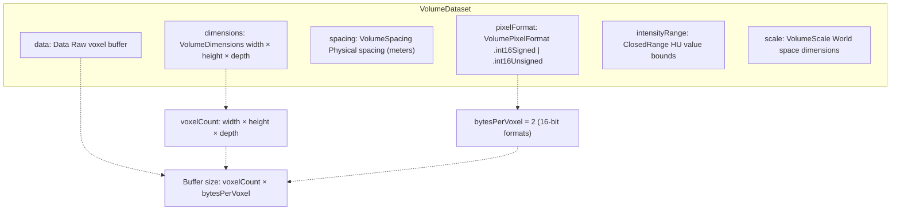
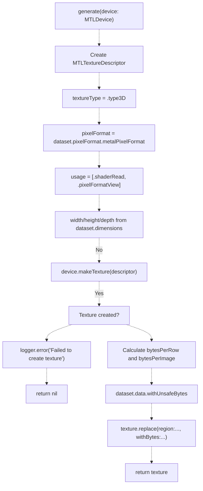
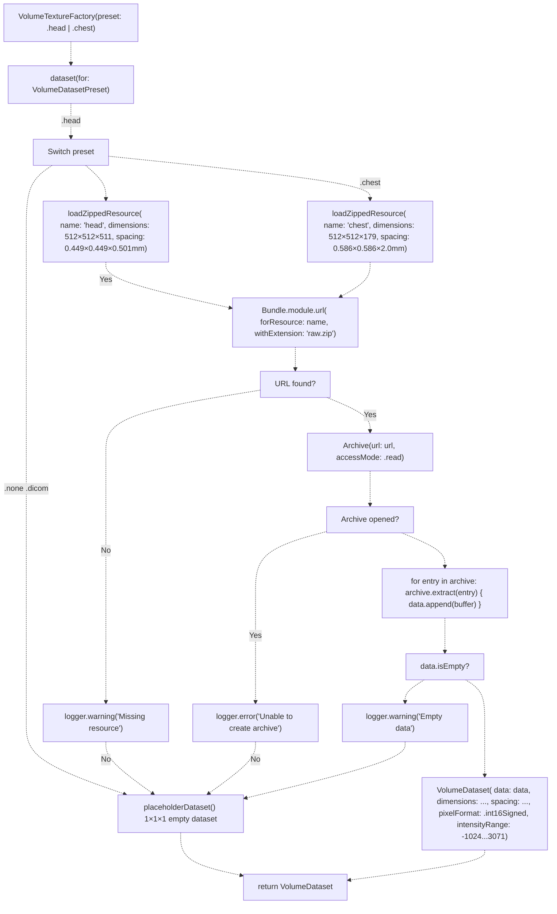
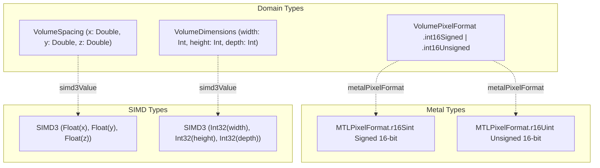

# VolumeDataset and VolumeTextureFactory

> **Relevant source files**
> * [Sources/MTKCore/Metal/VolumeTextureFactory.swift](https://github.com/ThalesMMS/MTK/blob/eda6f990/Sources/MTKCore/Metal/VolumeTextureFactory.swift)

## Purpose and Scope

This document describes the domain model for volumetric data (`VolumeDataset`) and the factory class responsible for converting it into Metal GPU textures (`VolumeTextureFactory`). These types form the foundation of the data pipeline, providing a framework-agnostic representation of 3D medical imaging volumes and the infrastructure to prepare them for GPU rendering.

**Scope:**

* Structure and properties of `VolumeDataset`
* `VolumeTextureFactory` API and texture generation process
* Built-in preset loading system (.head, .chest)
* Pixel format conversions and Metal type mappings

**Related Pages:**

* For DICOM file loading into `VolumeDataset`, see [DICOM Loading](5b%20DICOM-Loading.md)
* For how textures are bound to rendering materials, see [VolumeCubeMaterial](4a%20VolumeCubeMaterial.md)
* For argument buffer encoding of textures, see [ArgumentEncoderManager](7b%20ArgumentEncoderManager.md)

---

## VolumeDataset Structure

`VolumeDataset` is the **framework-agnostic domain type** that represents volumetric imaging data. It decouples data loading from rendering infrastructure, allowing the same dataset to be used across SceneKit, MPS, or future rendering backends.

### Core Properties

| Property | Type | Description |
| --- | --- | --- |
| `data` | `Data` | Raw voxel buffer (contiguous memory) |
| `dimensions` | `VolumeDimensions` | Volume size: `(width, height, depth)` |
| `spacing` | `VolumeSpacing` | Physical spacing: `(x, y, z)` in meters |
| `pixelFormat` | `VolumePixelFormat` | Voxel data type: `.int16Signed` or `.int16Unsigned` |
| `intensityRange` | `ClosedRange<Int32>` | Value range (e.g., HU units for CT: -1024...3071) |
| `scale` | `VolumeScale` | Physical dimensions in world space |

**Sources:** [Sources/MTKCore/Metal/VolumeTextureFactory.swift L16](https://github.com/ThalesMMS/MTK/blob/eda6f990/Sources/MTKCore/Metal/VolumeTextureFactory.swift#L16-L16)

 [Sources/MTKCore/Metal/VolumeTextureFactory.swift L97-L103](https://github.com/ThalesMMS/MTK/blob/eda6f990/Sources/MTKCore/Metal/VolumeTextureFactory.swift#L97-L103)

 [Sources/MTKCore/Metal/VolumeTextureFactory.swift L159-L165](https://github.com/ThalesMMS/MTK/blob/eda6f990/Sources/MTKCore/Metal/VolumeTextureFactory.swift#L159-L165)

### Supporting Types

#### VolumeDimensions

```javascript
struct VolumeDimensions {
    let width: Int
    let height: Int
    let depth: Int
    var voxelCount: Int { width * height * depth }
}
```

#### VolumeSpacing

```javascript
struct VolumeSpacing {
    let x: Double  // Spacing in meters
    let y: Double
    let z: Double
}
```

#### VolumePixelFormat

```typescript
enum VolumePixelFormat {
    case int16Signed    // Maps to MTLPixelFormat.r16Sint
    case int16Unsigned  // Maps to MTLPixelFormat.r16Uint
    
    var bytesPerVoxel: Int { 2 }
}
```

**Sources:** [Sources/MTKCore/Metal/VolumeTextureFactory.swift L43-L45](https://github.com/ThalesMMS/MTK/blob/eda6f990/Sources/MTKCore/Metal/VolumeTextureFactory.swift#L43-L45)

 [Sources/MTKCore/Metal/VolumeTextureFactory.swift L52](https://github.com/ThalesMMS/MTK/blob/eda6f990/Sources/MTKCore/Metal/VolumeTextureFactory.swift#L52-L52)

 [Sources/MTKCore/Metal/VolumeTextureFactory.swift L142](https://github.com/ThalesMMS/MTK/blob/eda6f990/Sources/MTKCore/Metal/VolumeTextureFactory.swift#L142-L142)

 [Sources/MTKCore/Metal/VolumeTextureFactory.swift L182-L190](https://github.com/ThalesMMS/MTK/blob/eda6f990/Sources/MTKCore/Metal/VolumeTextureFactory.swift#L182-L190)

### Data Layout

The `data` buffer follows a **Z-Y-X major order** (depth-height-width), consistent with DICOM conventions:

* Voxels are packed contiguously
* Each voxel occupies `pixelFormat.bytesPerVoxel` bytes (2 bytes for int16 formats)
* Total buffer size: `dimensions.voxelCount * pixelFormat.bytesPerVoxel`

**Diagram: VolumeDataset Structure**



**Sources:** [Sources/MTKCore/Metal/VolumeTextureFactory.swift L55-L65](https://github.com/ThalesMMS/MTK/blob/eda6f990/Sources/MTKCore/Metal/VolumeTextureFactory.swift#L55-L65)

 [Sources/MTKCore/Metal/VolumeTextureFactory.swift L142](https://github.com/ThalesMMS/MTK/blob/eda6f990/Sources/MTKCore/Metal/VolumeTextureFactory.swift#L142-L142)

---

## VolumeTextureFactory Class

`VolumeTextureFactory` is responsible for **converting `VolumeDataset` instances into 3D Metal textures** (`MTLTexture`) suitable for GPU rendering. It also provides built-in preset loading for demonstration and testing.

### Class Definition

```sql
public final class VolumeTextureFactory {    private(set) public var dataset: VolumeDataset        public init(dataset: VolumeDataset)    public convenience init(preset: VolumeDatasetPreset)        public var resolution: SIMD3<Float>  // Spacing as SIMD    public var dimension: SIMD3<Int32>   // Dimensions as SIMD    public var scale: SIMD3<Float>       // Scale as SIMD        public func update(dataset: VolumeDataset)    public func generate(device: MTLDevice) -> MTLTexture?}
```

**Sources:** [Sources/MTKCore/Metal/VolumeTextureFactory.swift L15-L68](https://github.com/ThalesMMS/MTK/blob/eda6f990/Sources/MTKCore/Metal/VolumeTextureFactory.swift#L15-L68)

### Initialization Patterns

#### Pattern 1: Direct Dataset Initialization

```
let factory = VolumeTextureFactory(dataset: myDataset)
```

#### Pattern 2: Preset Initialization

```
let factory = VolumeTextureFactory(preset: .head)
```

The preset initializer delegates to `VolumeTextureFactory.dataset(for:)` to load bundled resources.

**Sources:** [Sources/MTKCore/Metal/VolumeTextureFactory.swift L22-L28](https://github.com/ThalesMMS/MTK/blob/eda6f990/Sources/MTKCore/Metal/VolumeTextureFactory.swift#L22-L28)

### Computed Properties

The factory exposes SIMD-converted properties for GPU compatibility:

| Property | Source | Type | Purpose |
| --- | --- | --- | --- |
| `resolution` | `dataset.spacing` | `SIMD3<Float>` | Physical voxel spacing |
| `dimension` | `dataset.dimensions` | `SIMD3<Int32>` | Volume dimensions |
| `scale` | `dataset.scale` | `SIMD3<Float>` | World space size |

These properties avoid repeated conversions in rendering loops.

**Sources:** [Sources/MTKCore/Metal/VolumeTextureFactory.swift L30-L32](https://github.com/ThalesMMS/MTK/blob/eda6f990/Sources/MTKCore/Metal/VolumeTextureFactory.swift#L30-L32)

 [Sources/MTKCore/Metal/VolumeTextureFactory.swift L169-L179](https://github.com/ThalesMMS/MTK/blob/eda6f990/Sources/MTKCore/Metal/VolumeTextureFactory.swift#L169-L179)

### Dataset Updates

The `update(dataset:)` method allows replacing the dataset without recreating the factory:

```sql
factory.update(dataset: newDataset)let newTexture = factory.generate(device: device)
```

**Sources:** [Sources/MTKCore/Metal/VolumeTextureFactory.swift L34-L36](https://github.com/ThalesMMS/MTK/blob/eda6f990/Sources/MTKCore/Metal/VolumeTextureFactory.swift#L34-L36)

---

## Metal Texture Generation

The `generate(device:)` method performs the **CPU-to-GPU data transfer**, creating a 3D `MTLTexture` from the voxel buffer.

**Diagram: Texture Generation Flow**



**Sources:** [Sources/MTKCore/Metal/VolumeTextureFactory.swift L38-L68](https://github.com/ThalesMMS/MTK/blob/eda6f990/Sources/MTKCore/Metal/VolumeTextureFactory.swift#L38-L68)

### Texture Descriptor Configuration

The method configures `MTLTextureDescriptor` with the following parameters:

| Parameter | Value | Rationale |
| --- | --- | --- |
| `textureType` | `.type3D` | Volumetric data requires 3D texture |
| `pixelFormat` | `dataset.pixelFormat.metalPixelFormat` | `.r16Sint` or `.r16Uint` |
| `usage` | `[.shaderRead, .pixelFormatView]` | Readable by shaders, supports format views |
| `width` | `dataset.dimensions.width` | X-axis size |
| `height` | `dataset.dimensions.height` | Y-axis size |
| `depth` | `dataset.dimensions.depth` | Z-axis size |

**Sources:** [Sources/MTKCore/Metal/VolumeTextureFactory.swift L39-L45](https://github.com/ThalesMMS/MTK/blob/eda6f990/Sources/MTKCore/Metal/VolumeTextureFactory.swift#L39-L45)

### Data Transfer Calculation

```
let bytesPerRow = dataset.pixelFormat.bytesPerVoxel * descriptor.widthlet bytesPerImage = bytesPerRow * descriptor.height
```

* `bytesPerRow`: Bytes for one row of voxels (X-axis)
* `bytesPerImage`: Bytes for one 2D slice (XY plane)

**Sources:** [Sources/MTKCore/Metal/VolumeTextureFactory.swift L52-L53](https://github.com/ThalesMMS/MTK/blob/eda6f990/Sources/MTKCore/Metal/VolumeTextureFactory.swift#L52-L53)

### Buffer Upload

The method uses `withUnsafeBytes` for **zero-copy access** to the `Data` buffer:

```
dataset.data.withUnsafeBytes { buffer in    guard let baseAddress = buffer.baseAddress else { return }    texture.replace(        region: MTLRegionMake3D(0, 0, 0, width, height, depth),        mipmapLevel: 0,        slice: 0,        withBytes: baseAddress,        bytesPerRow: bytesPerRow,        bytesPerImage: bytesPerImage    )}
```

This uploads the entire volume in a single Metal operation.

**Sources:** [Sources/MTKCore/Metal/VolumeTextureFactory.swift L55-L65](https://github.com/ThalesMMS/MTK/blob/eda6f990/Sources/MTKCore/Metal/VolumeTextureFactory.swift#L55-L65)

### Error Handling

If texture creation fails, the method:

1. Logs an error with dimensions: `"Failed to create 3D texture (WxHxD)"`
2. Returns `nil`

Callers should check for `nil` and handle gracefully (e.g., display error UI).

**Sources:** [Sources/MTKCore/Metal/VolumeTextureFactory.swift L47-L50](https://github.com/ThalesMMS/MTK/blob/eda6f990/Sources/MTKCore/Metal/VolumeTextureFactory.swift#L47-L50)

---

## Built-in Preset Loading System

`VolumeTextureFactory` includes **two built-in medical imaging presets** for demonstration and testing purposes. These are stored as compressed `.raw.zip` files in the module bundle.

**Diagram: Preset Loading Architecture**



**Sources:** [Sources/MTKCore/Metal/VolumeTextureFactory.swift L72-L166](https://github.com/ThalesMMS/MTK/blob/eda6f990/Sources/MTKCore/Metal/VolumeTextureFactory.swift#L72-L166)

### Available Presets

#### VolumeDatasetPreset.head

* **Dimensions:** 512 × 512 × 511 voxels
* **Spacing:** 0.449 × 0.449 × 0.501 mm
* **Format:** `.int16Signed` (CT Hounsfield Units)
* **Intensity Range:** -1024 to 3071 HU
* **File:** `head.raw.zip` (bundle resource)

#### VolumeDatasetPreset.chest

* **Dimensions:** 512 × 512 × 179 voxels
* **Spacing:** 0.586 × 0.586 × 2.0 mm
* **Format:** `.int16Signed` (CT Hounsfield Units)
* **Intensity Range:** -1024 to 3071 HU
* **File:** `chest.raw.zip` (bundle resource)

**Sources:** [Sources/MTKCore/Metal/VolumeTextureFactory.swift L74-L89](https://github.com/ThalesMMS/MTK/blob/eda6f990/Sources/MTKCore/Metal/VolumeTextureFactory.swift#L74-L89)

### Preset Loading Implementation

The loading process follows this chain:

1. `dataset(for:)` switches on preset type
2. `loadZippedResource()` locates bundle resource
3. `loadDataset(fromArchiveAt:...)` extracts and constructs dataset

**Sources:** [Sources/MTKCore/Metal/VolumeTextureFactory.swift L72-L166](https://github.com/ThalesMMS/MTK/blob/eda6f990/Sources/MTKCore/Metal/VolumeTextureFactory.swift#L72-L166)

### ZIP Archive Extraction

The `loadDataset(fromArchiveAt:...)` method uses the `ZIPFoundation` framework:

```
guard let archive = try Archive(url: url, accessMode: .read) else { ... }var data = Data(capacity: dimensions.voxelCount * pixelFormat.bytesPerVoxel)for entry in archive {    _ = try archive.extract(entry) { buffer in        data.append(buffer)    }}
```

This iterates through all entries in the ZIP file, appending each to the `Data` buffer.

**Sources:** [Sources/MTKCore/Metal/VolumeTextureFactory.swift L130-L152](https://github.com/ThalesMMS/MTK/blob/eda6f990/Sources/MTKCore/Metal/VolumeTextureFactory.swift#L130-L152)

### Fallback Behavior

If any error occurs during preset loading (missing file, extraction failure, empty data), the system falls back to `placeholderDataset()`:

* **Dimensions:** 1 × 1 × 1 voxel
* **Data:** 2 bytes of zeros
* **Purpose:** Prevents crashes, allows app to continue with minimal GPU usage

**Sources:** [Sources/MTKCore/Metal/VolumeTextureFactory.swift L95-L104](https://github.com/ThalesMMS/MTK/blob/eda6f990/Sources/MTKCore/Metal/VolumeTextureFactory.swift#L95-L104)

### Logging

The factory uses two loggers:

* **Instance logger** (`category: "VolumeTextureFactory"`): Texture generation errors
* **Resource logger** (`category: "VolumeResources"`): Preset loading errors

**Sources:** [Sources/MTKCore/Metal/VolumeTextureFactory.swift L17-L20](https://github.com/ThalesMMS/MTK/blob/eda6f990/Sources/MTKCore/Metal/VolumeTextureFactory.swift#L17-L20)

---

## Pixel Format Conversions

`VolumeTextureFactory` provides **private extensions** to bridge domain types to Metal and SIMD types.

**Diagram: Format Conversion Mappings**



**Sources:** [Sources/MTKCore/Metal/VolumeTextureFactory.swift L169-L190](https://github.com/ThalesMMS/MTK/blob/eda6f990/Sources/MTKCore/Metal/VolumeTextureFactory.swift#L169-L190)

### VolumeSpacing → SIMD3

```
private extension VolumeSpacing {    var simd3Value: SIMD3<Float> {        SIMD3<Float>(Float(x), Float(y), Float(z))    }}
```

Converts `Double` spacing values to `Float` for GPU shader compatibility.

**Sources:** [Sources/MTKCore/Metal/VolumeTextureFactory.swift L169-L173](https://github.com/ThalesMMS/MTK/blob/eda6f990/Sources/MTKCore/Metal/VolumeTextureFactory.swift#L169-L173)

### VolumeDimensions → SIMD3

```
private extension VolumeDimensions {    var simd3Value: SIMD3<Int32> {        SIMD3<Int32>(Int32(width), Int32(height), Int32(depth))    }}
```

Converts `Int` dimensions to `Int32` for Metal shader uniforms.

**Sources:** [Sources/MTKCore/Metal/VolumeTextureFactory.swift L175-L179](https://github.com/ThalesMMS/MTK/blob/eda6f990/Sources/MTKCore/Metal/VolumeTextureFactory.swift#L175-L179)

### VolumePixelFormat → MTLPixelFormat

```
private extension VolumePixelFormat {    var metalPixelFormat: MTLPixelFormat {        switch self {        case .int16Signed:   return .r16Sint        case .int16Unsigned: return .r16Uint        }    }}
```

Maps domain pixel formats to Metal pixel formats:

* `.int16Signed` → `.r16Sint` (signed 16-bit red channel)
* `.int16Unsigned` → `.r16Uint` (unsigned 16-bit red channel)

Both formats use **single-channel textures** (red channel only), appropriate for grayscale volumetric data.

**Sources:** [Sources/MTKCore/Metal/VolumeTextureFactory.swift L181-L190](https://github.com/ThalesMMS/MTK/blob/eda6f990/Sources/MTKCore/Metal/VolumeTextureFactory.swift#L181-L190)

---

## Usage Patterns

### Pattern 1: Load Preset and Generate Texture

```
let factory = VolumeTextureFactory(preset: .head)guard let texture = factory.generate(device: device) else {    // Handle texture creation failure    return}// Use texture in materials or rendering
```

### Pattern 2: Load Custom Dataset

```
let customDataset = VolumeDataset(    data: voxelData,    dimensions: VolumeDimensions(width: 256, height: 256, depth: 128),    spacing: VolumeSpacing(x: 0.001, y: 0.001, z: 0.002),    pixelFormat: .int16Unsigned,    intensityRange: 0...4095)let factory = VolumeTextureFactory(dataset: customDataset)guard let texture = factory.generate(device: device) else {    // Handle failure    return}
```

### Pattern 3: Update Dataset in Existing Factory

```sql
factory.update(dataset: newDataset)if let newTexture = factory.generate(device: device) {    // Update material with new texture    material.volumeTexture = newTexture}
```

---

## Integration with Rendering Pipeline

The generated `MTLTexture` flows through the rendering system as follows:

1. **Factory Generation**: `VolumeTextureFactory.generate()` creates texture
2. **Material Binding**: Texture assigned to `VolumeCubeMaterial` or `MPRPlaneMaterial` (see [VolumeCubeMaterial](4a%20VolumeCubeMaterial.md))
3. **Argument Encoding**: Texture encoded into argument buffer slot 0 by `ArgumentEncoderManager` (see [ArgumentEncoderManager](7b%20ArgumentEncoderManager.md))
4. **Shader Access**: Compute or fragment shaders read texture via `[[texture(0)]]` attribute
5. **Rendering**: Ray marching or slice rendering samples the 3D texture

**Sources:** [Sources/MTKCore/Metal/VolumeTextureFactory.swift L38-L68](https://github.com/ThalesMMS/MTK/blob/eda6f990/Sources/MTKCore/Metal/VolumeTextureFactory.swift#L38-L68)


### On this page

* [VolumeDataset and VolumeTextureFactory](#5.1-volumedataset-and-volumetexturefactory)
* [Purpose and Scope](#5.1-purpose-and-scope)
* [VolumeDataset Structure](#5.1-volumedataset-structure)
* [Core Properties](#5.1-core-properties)
* [Supporting Types](#5.1-supporting-types)
* [Data Layout](#5.1-data-layout)
* [VolumeTextureFactory Class](#5.1-volumetexturefactory-class)
* [Class Definition](#5.1-class-definition)
* [Initialization Patterns](#5.1-initialization-patterns)
* [Computed Properties](#5.1-computed-properties)
* [Dataset Updates](#5.1-dataset-updates)
* [Metal Texture Generation](#5.1-metal-texture-generation)
* [Texture Descriptor Configuration](#5.1-texture-descriptor-configuration)
* [Data Transfer Calculation](#5.1-data-transfer-calculation)
* [Buffer Upload](#5.1-buffer-upload)
* [Error Handling](#5.1-error-handling)
* [Built-in Preset Loading System](#5.1-built-in-preset-loading-system)
* [Available Presets](#5.1-available-presets)
* [Preset Loading Implementation](#5.1-preset-loading-implementation)
* [ZIP Archive Extraction](#5.1-zip-archive-extraction)
* [Fallback Behavior](#5.1-fallback-behavior)
* [Logging](#5.1-logging)
* [Pixel Format Conversions](#5.1-pixel-format-conversions)
* [VolumeSpacing → SIMD3](#5.1-volumespacing-simd3)
* [VolumeDimensions → SIMD3](#5.1-volumedimensions-simd3)
* [VolumePixelFormat → MTLPixelFormat](#5.1-volumepixelformat-mtlpixelformat)
* [Usage Patterns](#5.1-usage-patterns)
* [Pattern 1: Load Preset and Generate Texture](#5.1-pattern-1-load-preset-and-generate-texture)
* [Pattern 2: Load Custom Dataset](#5.1-pattern-2-load-custom-dataset)
* [Pattern 3: Update Dataset in Existing Factory](#5.1-pattern-3-update-dataset-in-existing-factory)
* [Integration with Rendering Pipeline](#5.1-integration-with-rendering-pipeline)

Ask Devin about MTK