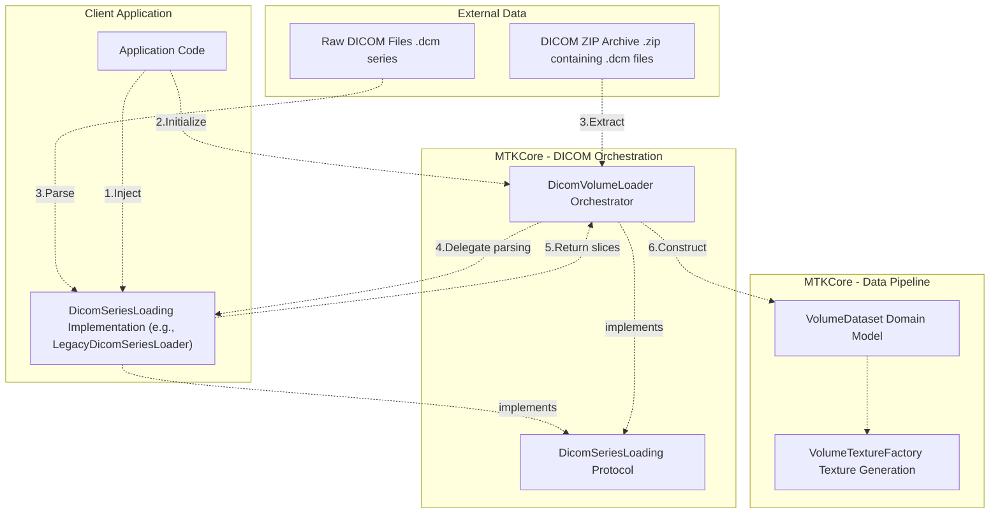
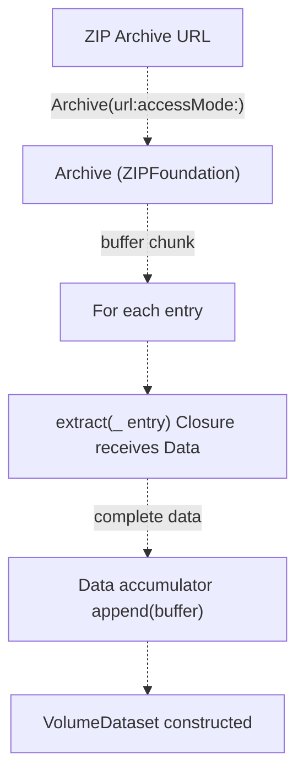
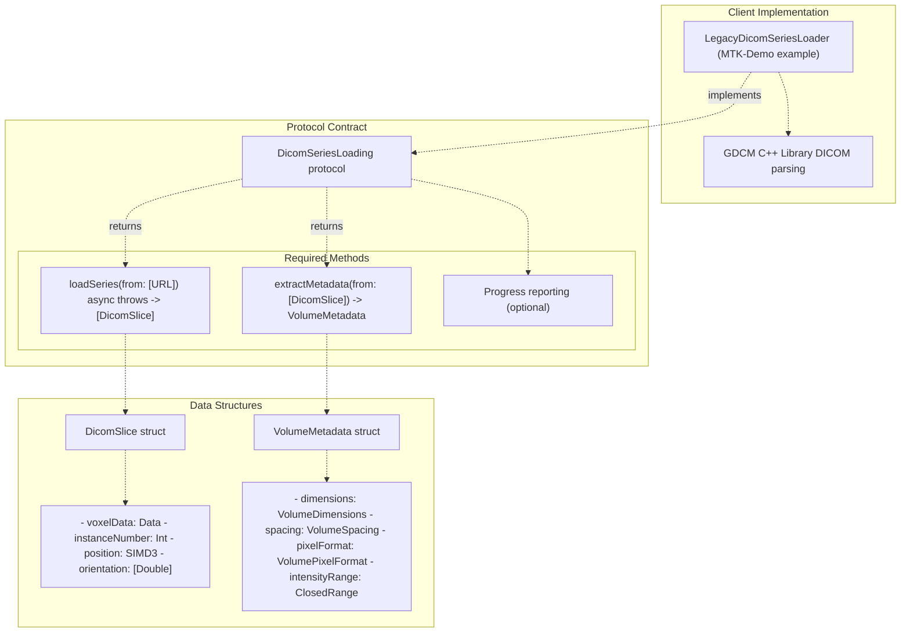
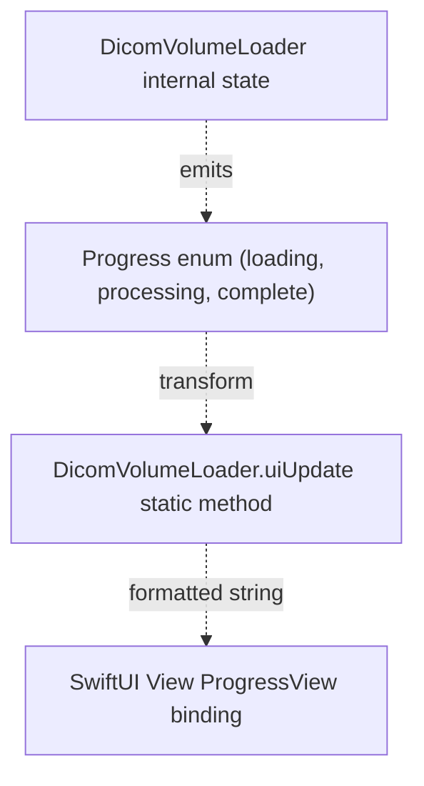
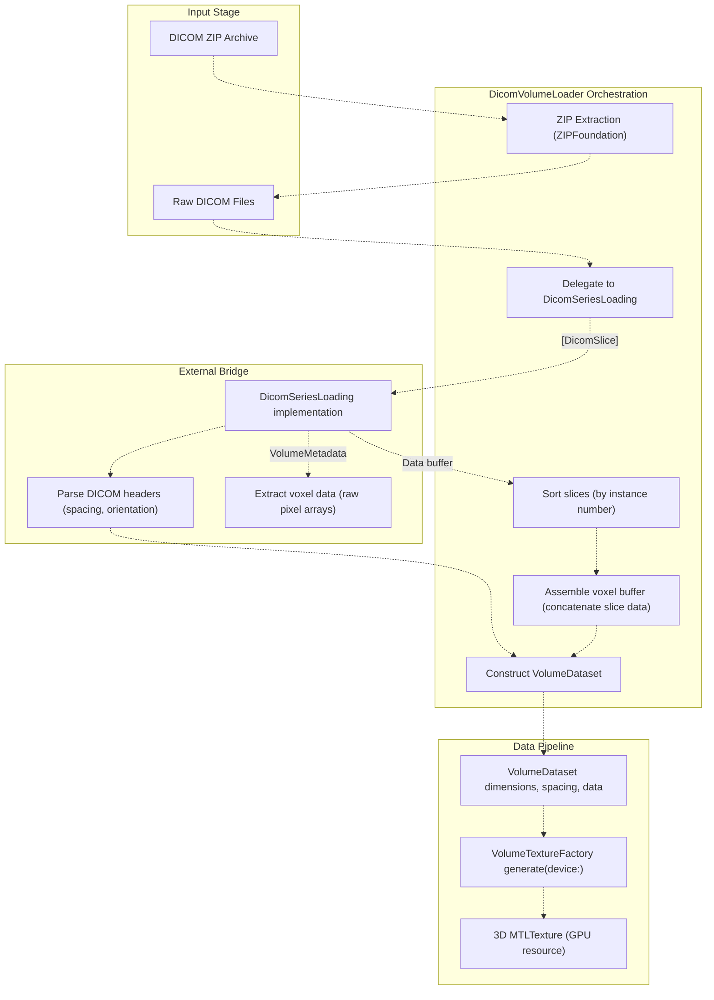
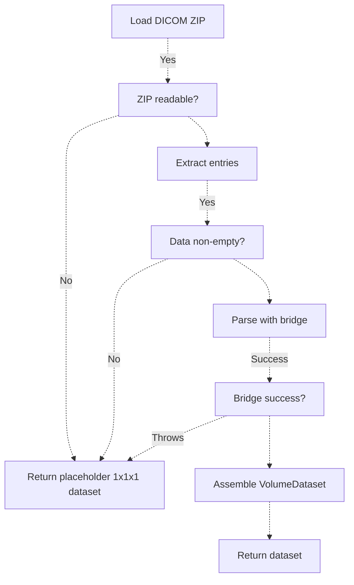

# DICOM Loading

> **Relevant source files**
> * [BACKEND_RESOLVER_USAGE.md](https://github.com/ThalesMMS/MTK/blob/eda6f990/BACKEND_RESOLVER_USAGE.md)
> * [DOCUMENTATION_STANDARD.md](https://github.com/ThalesMMS/MTK/blob/eda6f990/DOCUMENTATION_STANDARD.md)
> * [README.md](https://github.com/ThalesMMS/MTK/blob/eda6f990/README.md)
> * [SURFACE_ADAPTER_DELIVERABLES.txt](https://github.com/ThalesMMS/MTK/blob/eda6f990/SURFACE_ADAPTER_DELIVERABLES.txt)

## Purpose and Scope

The DICOM loading system enables MTK to construct `VolumeDataset` instances from medical imaging files. The architecture uses a **bridge pattern** where `DicomVolumeLoader` orchestrates ZIP extraction and dataset construction, while delegating DICOM-specific parsing to an external implementation of the `DicomSeriesLoading` protocol.

This page documents the orchestration layer, ZIP handling, and bridge contract. For information about the resulting `VolumeDataset` structure, see [VolumeDataset](5a%20VolumeDataset-and-VolumeTextureFactory.md). For texture generation from loaded datasets, see [VolumeTextureFactory](#5.2).

**Sources:** README.md

---

## Architecture Overview

The DICOM loading system separates concerns through a two-component architecture:



**Sources:** README.md

 High-Level Diagram 3

---

## Component Responsibilities

| Component | Module | Responsibility |
| --- | --- | --- |
| `DicomVolumeLoader` | MTKCore | ZIP extraction, progress tracking, dataset assembly |
| `DicomSeriesLoading` | MTKCore (protocol) | Parse DICOM files, extract voxel data and metadata |
| `LegacyDicomSeriesLoader` | MTK-Demo | GDCM-backed reference implementation (not part of MTK package) |
| `VolumeDataset` | MTKCore | Domain model for volumetric data |

**Key Design Decision:** MTK does not bundle a DICOM parser to avoid licensing constraints and binary size overhead. Clients integrate their preferred DICOM library (GDCM, dcmtk, DICOMCore) by implementing the `DicomSeriesLoading` protocol.

**Sources:** README.md

---

## ZIP Extraction Mechanism

`DicomVolumeLoader` uses the `ZIPFoundation` library to extract DICOM archives. The extraction pattern is demonstrated in `VolumeTextureFactory` for loading built-in presets:



### Implementation Pattern

The ZIP extraction follows this sequence, as shown in `VolumeTextureFactory.loadDataset(fromArchiveAt:dimensions:spacing:pixelFormat:intensity:)`:

[Sources/MTKCore/Metal/VolumeTextureFactory.swift L125-L166](https://github.com/ThalesMMS/MTK/blob/eda6f990/Sources/MTKCore/Metal/VolumeTextureFactory.swift#L125-L166)

```
// 1. Open archive with read accessguard let archive = try Archive(url: url, accessMode: .read) else {    // Handle error}// 2. Pre-allocate data buffervar data = Data(capacity: dimensions.voxelCount * pixelFormat.bytesPerVoxel)// 3. Extract all entriesfor entry in archive {    _ = try archive.extract(entry) { buffer in        data.append(buffer)    }}// 4. Validate non-empty resultif data.isEmpty {    // Handle error}// 5. Construct VolumeDatasetreturn VolumeDataset(    data: data,    dimensions: dimensions,    spacing: spacing,    pixelFormat: pixelFormat,    intensityRange: intensity)
```

### Error Handling

The system returns a placeholder dataset on failures to maintain operational continuity:

[Sources/MTKCore/Metal/VolumeTextureFactory.swift L95-L104](https://github.com/ThalesMMS/MTK/blob/eda6f990/Sources/MTKCore/Metal/VolumeTextureFactory.swift#L95-L104)

| Error Condition | Behavior |
| --- | --- |
| Archive creation fails | Log error, return 1³ placeholder |
| Entry extraction throws | Log error, return 1³ placeholder |
| Empty data after extraction | Log warning, return 1³ placeholder |
| Missing resource file | Log warning, return 1³ placeholder |

**Sources:** [Sources/MTKCore/Metal/VolumeTextureFactory.swift L125-L166](https://github.com/ThalesMMS/MTK/blob/eda6f990/Sources/MTKCore/Metal/VolumeTextureFactory.swift#L125-L166)

---

## DicomSeriesLoading Bridge Pattern

The `DicomSeriesLoading` protocol defines the contract between `DicomVolumeLoader` and external DICOM parsers:



### Protocol Requirements

While the specific protocol definition is not included in the provided files, the README indicates the bridge must:

1. **Parse DICOM files** into slice data structures
2. **Extract metadata** (dimensions, spacing, orientation, intensity range)
3. **Return voxel data** in a format compatible with `VolumeDataset`
4. **Report progress** for long-running operations (optional)

### Integration Pattern

```
// 1. Client implements DicomSeriesLoadingclass CustomDicomLoader: DicomSeriesLoading {    func loadSeries(from urls: [URL]) async throws -> [DicomSlice] {        // Use your DICOM library (GDCM, dcmtk, etc.)    }        func extractMetadata(from slices: [DicomSlice]) -> VolumeMetadata {        // Analyze slice headers for geometry    }}// 2. Initialize DicomVolumeLoader with bridgelet loader = DicomVolumeLoader(seriesLoader: CustomDicomLoader())// 3. Load DICOM archivelet dataset = try await loader.loadVolume(from: zipURL)
```

**Sources:** README.md

---

## Progress Reporting

`DicomVolumeLoader` provides progress updates that can be mapped to UI components:



### Usage Example

```
struct DicomLoadingView: View {    @State private var progressMessage = "Ready"        var body: some View {        VStack {            ProgressView(progressMessage)                .padding()                        Button("Load DICOM") {                Task {                    await loadDicomVolume()                }            }        }    }        func loadDicomVolume() async {        let loader = DicomVolumeLoader(seriesLoader: customBridge)                // Map progress updates to UI        for await progress in loader.progressStream {            progressMessage = DicomVolumeLoader.uiUpdate(from: progress)        }                do {            let dataset = try await loader.loadVolume(from: dicomZipURL)            // Apply to VolumetricSceneController        } catch {            progressMessage = "Load failed: \(error.localizedDescription)"        }    }}
```

**Sources:** README.md

---

## Dataset Construction Flow

The complete flow from DICOM files to GPU-ready textures:



### Data Transformations

| Stage | Input | Output | Responsibility |
| --- | --- | --- | --- |
| ZIP Extraction | `.zip` file | Extracted `.dcm` files | `DicomVolumeLoader` + `ZIPFoundation` |
| DICOM Parsing | `.dcm` files | `[DicomSlice]` | `DicomSeriesLoading` bridge |
| Slice Sorting | Unsorted slices | Sorted by z-position | `DicomVolumeLoader` |
| Buffer Assembly | Individual slice data | Continuous `Data` buffer | `DicomVolumeLoader` |
| Dataset Construction | Buffer + metadata | `VolumeDataset` | `DicomVolumeLoader` |
| Texture Generation | `VolumeDataset` | `MTLTexture` | `VolumeTextureFactory` |

**Sources:** [Sources/MTKCore/Metal/VolumeTextureFactory.swift L125-L166](https://github.com/ThalesMMS/MTK/blob/eda6f990/Sources/MTKCore/Metal/VolumeTextureFactory.swift#L125-L166)

 README.md

---

## Built-in Preset Loading

`VolumeTextureFactory` includes a similar ZIP extraction pattern for loading built-in volumetric presets (head, chest):

[Sources/MTKCore/Metal/VolumeTextureFactory.swift L72-L93](https://github.com/ThalesMMS/MTK/blob/eda6f990/Sources/MTKCore/Metal/VolumeTextureFactory.swift#L72-L93)

```
private static func dataset(for preset: VolumeDatasetPreset) -> VolumeDataset {    switch preset {    case .head:        return loadZippedResource(            named: "head",            dimensions: VolumeDimensions(width: 512, height: 512, depth: 511),            spacing: VolumeSpacing(x: 0.000449, y: 0.000449, z: 0.000501),            pixelFormat: .int16Signed,            intensity: (-1024)...3071        )    case .chest:        return loadZippedResource(            named: "chest",            dimensions: VolumeDimensions(width: 512, height: 512, depth: 179),            spacing: VolumeSpacing(x: 0.000586, y: 0.000586, z: 0.002),            pixelFormat: .int16Signed,            intensity: (-1024)...3071        )    case .none, .dicom:        return placeholderDataset()    }}
```

The preset loading follows the same `loadDataset(fromArchiveAt:...)` pattern shown earlier, expecting resources named `{preset}.raw.zip` in the module bundle.

**Note:** These presets are not shipped with MTK. The system gracefully falls back to a 1³ placeholder dataset when resources are missing.

**Sources:** [Sources/MTKCore/Metal/VolumeTextureFactory.swift L72-L123](https://github.com/ThalesMMS/MTK/blob/eda6f990/Sources/MTKCore/Metal/VolumeTextureFactory.swift#L72-L123)

 [README.md L34](https://github.com/ThalesMMS/MTK/blob/eda6f990/README.md#L34-L34)

---

## Integration Checklist

To integrate DICOM loading into your application:

| Step | Component | Action |
| --- | --- | --- |
| 1 | DICOM Library | Choose and integrate DICOM parser (GDCM, dcmtk, DICOMCore) |
| 2 | Bridge Implementation | Implement `DicomSeriesLoading` protocol |
| 3 | Loader Initialization | Create `DicomVolumeLoader(seriesLoader: yourBridge)` |
| 4 | Progress Binding | Map progress updates to SwiftUI with `uiUpdate(from:)` |
| 5 | Dataset Application | Pass resulting `VolumeDataset` to `VolumetricSceneController` |
| 6 | Texture Generation | Handled automatically by `VolumeTextureFactory` |

### Reference Implementation

The `LegacyDicomSeriesLoader` in the MTK-Demo repository provides a complete GDCM-backed reference implementation. While not part of the MTK package, it demonstrates:

* DICOM header parsing for geometry metadata
* Slice sorting by instance number and z-position
* Voxel data extraction and buffer assembly
* Progress reporting during multi-file operations

**Sources:** README.md

 README.md

---

## Testing Considerations

DICOM loading tests have specific fixture requirements:

| Requirement | Location | Behavior When Missing |
| --- | --- | --- |
| DICOM test files | `MTK-Demo/DICOM_Example/` | Tests skip automatically |
| ZIP archives | Bundle resources | Tests use placeholder datasets |
| GDCM library | Native bridge | Tests skip if bridge unavailable |

The testing infrastructure gracefully handles missing fixtures rather than failing tests in CI environments where DICOM samples cannot be committed.

**Sources:** README.md

 [DOCUMENTATION_STANDARD.md L26-L28](https://github.com/ThalesMMS/MTK/blob/eda6f990/DOCUMENTATION_STANDARD.md#L26-L28)

---

## Error Handling Patterns

The DICOM loading system employs defensive error handling:



This fail-safe approach ensures that rendering components receive a valid (though minimal) dataset even when DICOM loading encounters errors, preventing null pointer exceptions downstream.

**Sources:** [Sources/MTKCore/Metal/VolumeTextureFactory.swift L95-L104](https://github.com/ThalesMMS/MTK/blob/eda6f990/Sources/MTKCore/Metal/VolumeTextureFactory.swift#L95-L104)

---

## Performance Characteristics

| Operation | Typical Duration | Notes |
| --- | --- | --- |
| ZIP extraction | 100-500ms | Depends on archive size, uses ZIPFoundation streaming |
| DICOM parsing | 500ms-5s | Bridge-dependent, GDCM typically faster than dcmtk |
| Slice sorting | <50ms | In-memory sort by instance number |
| Buffer assembly | 100-200ms | Memory copy, proportional to volume size |
| Dataset construction | <10ms | Struct initialization, no heavy computation |

For typical CT series (512×512×300 slices, ~150MB), expect total load time of 1-6 seconds depending on the DICOM bridge performance.

**Sources:** README.md


### On this page

* [DICOM Loading](#5.2-dicom-loading)
* [Purpose and Scope](#5.2-purpose-and-scope)
* [Architecture Overview](#5.2-architecture-overview)
* [Component Responsibilities](#5.2-component-responsibilities)
* [ZIP Extraction Mechanism](#5.2-zip-extraction-mechanism)
* [Implementation Pattern](#5.2-implementation-pattern)
* [Error Handling](#5.2-error-handling)
* [DicomSeriesLoading Bridge Pattern](#5.2-dicomseriesloading-bridge-pattern)
* [Protocol Requirements](#5.2-protocol-requirements)
* [Integration Pattern](#5.2-integration-pattern)
* [Progress Reporting](#5.2-progress-reporting)
* [Usage Example](#5.2-usage-example)
* [Dataset Construction Flow](#5.2-dataset-construction-flow)
* [Data Transformations](#5.2-data-transformations)
* [Built-in Preset Loading](#5.2-built-in-preset-loading)
* [Integration Checklist](#5.2-integration-checklist)
* [Reference Implementation](#5.2-reference-implementation)
* [Testing Considerations](#5.2-testing-considerations)
* [Error Handling Patterns](#5.2-error-handling-patterns)
* [Performance Characteristics](#5.2-performance-characteristics)

Ask Devin about MTK