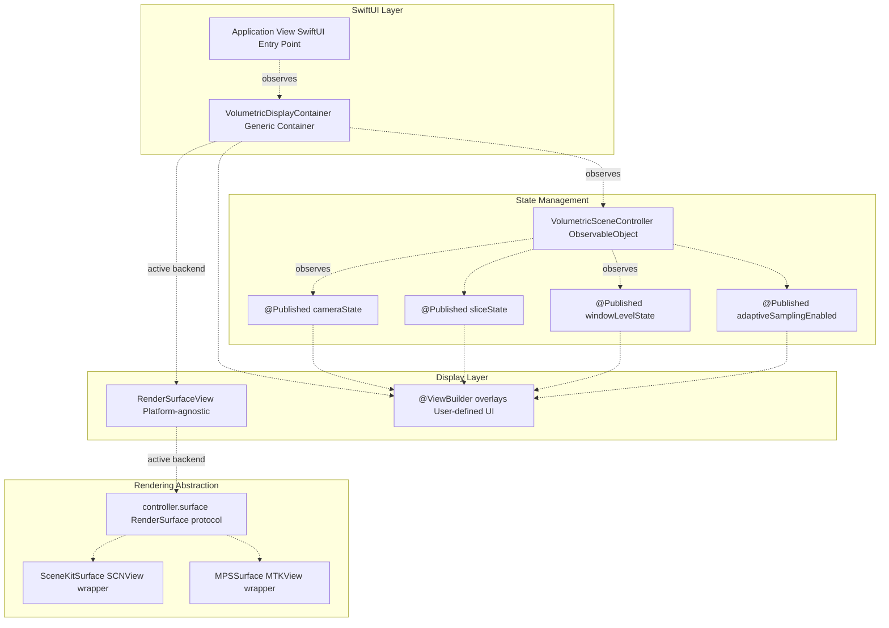
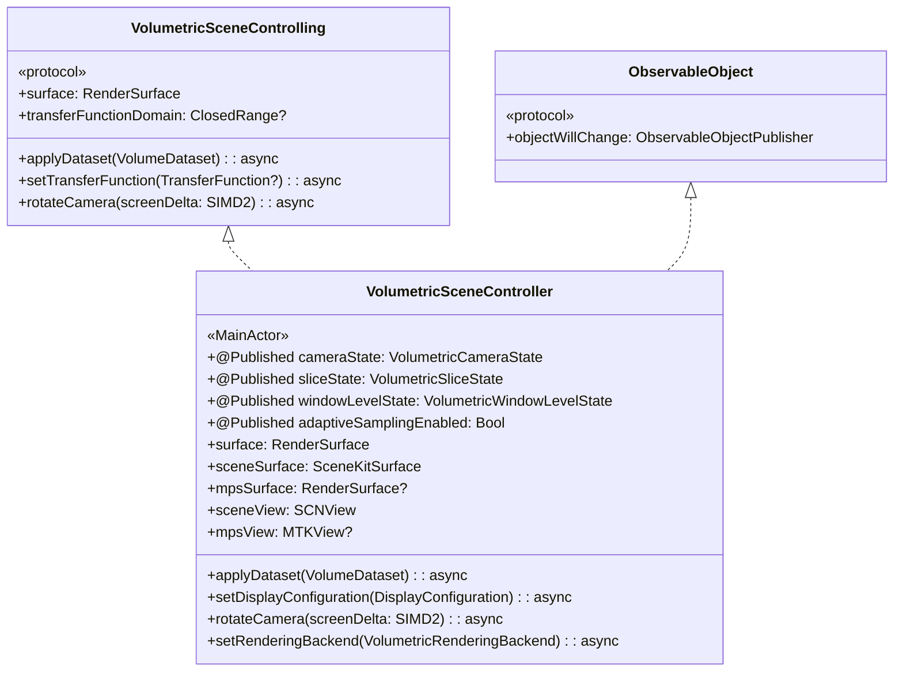
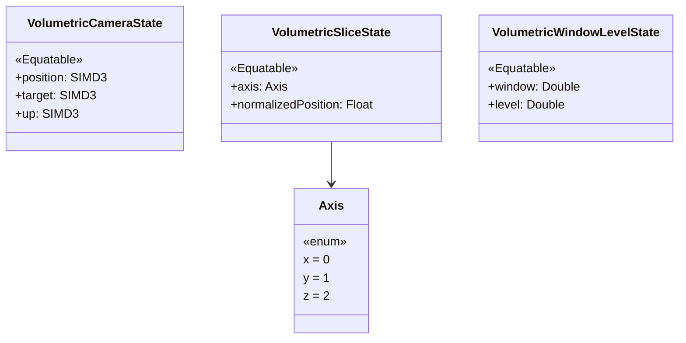
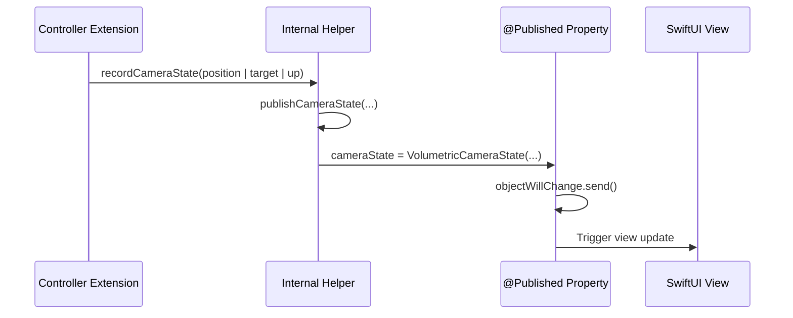
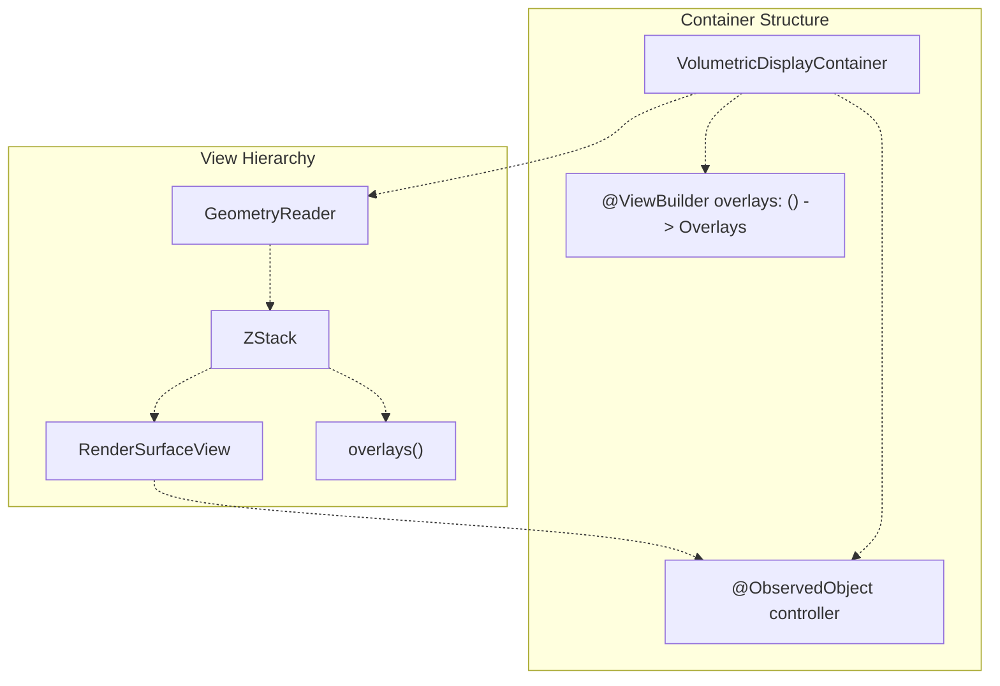
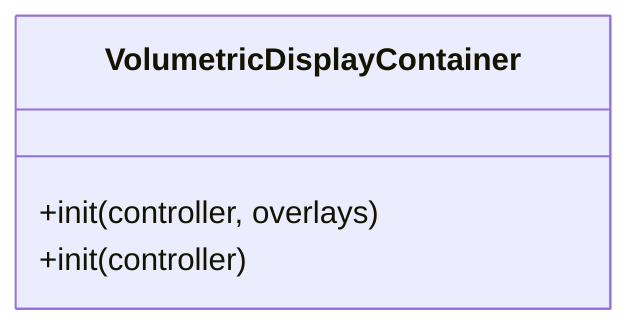
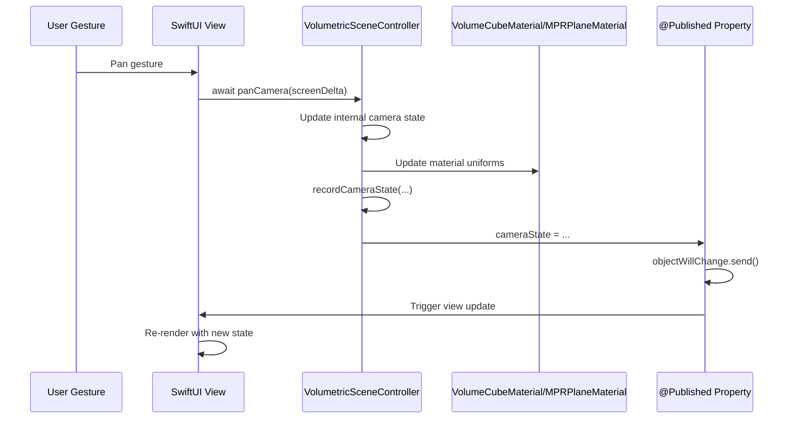
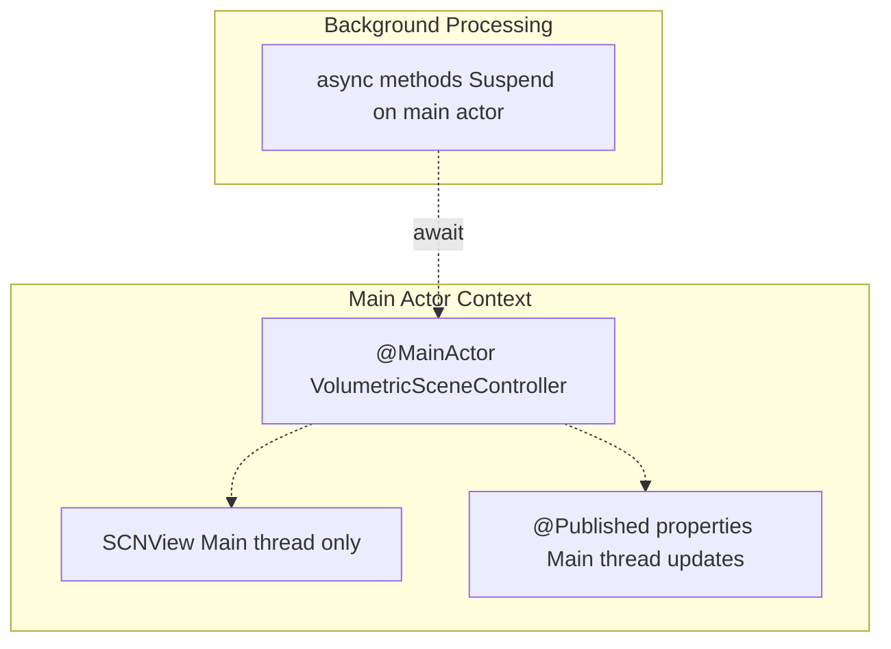

# SwiftUI Integration

> **Relevant source files**
> * [Sources/MTKUI/VolumetricDisplayContainer.swift](https://github.com/ThalesMMS/MTK/blob/eda6f990/Sources/MTKUI/VolumetricDisplayContainer.swift)
> * [Sources/MTKUI/VolumetricSceneController.swift](https://github.com/ThalesMMS/MTK/blob/eda6f990/Sources/MTKUI/VolumetricSceneController.swift)

## Purpose and Scope

This document explains how MTK integrates with SwiftUI using reactive state management patterns. It covers the `ObservableObject` architecture, published state streams, the generic display container, and the `RenderSurface` abstraction that decouples rendering from UI frameworks.

For detailed information about the underlying rendering backends, see [Rendering Architecture](2%20Rendering-Architecture.md). For the complete interaction API exposed to SwiftUI views, see [Interaction API](3a%20Interaction-API.md). For UI overlay components and gesture handling, see [UI Overlays and Gestures](6c%20UI-Overlays-and-Gestures.md).

**Sources**:

* Sources/MTKUI/VolumetricSceneController.swift:1-731
* Sources/MTKUI/VolumetricDisplayContainer.swift:1-54

---

## Reactive Architecture Overview

MTK's SwiftUI integration follows the standard `ObservableObject` pattern where `VolumetricSceneController` publishes state changes that trigger automatic view updates. The architecture separates concerns into three layers: state management, display rendering, and UI overlays.



**Sources**:

* Sources/MTKUI/VolumetricSceneController.swift:193
* Sources/MTKUI/VolumetricDisplayContainer.swift:11-33

---

## ObservableObject Conformance

`VolumetricSceneController` conforms to `ObservableObject` [Sources/MTKUI/VolumetricSceneController.swift L193](https://github.com/ThalesMMS/MTK/blob/eda6f990/Sources/MTKUI/VolumetricSceneController.swift#L193-L193)

 enabling SwiftUI views to automatically re-render when published properties change. The controller is marked `@MainActor` to ensure all UI updates occur on the main thread.



**Sources**:

* Sources/MTKUI/VolumetricSceneController.swift:147-190
* Sources/MTKUI/VolumetricSceneController.swift:193

---

## Published State Streams

The controller exposes four independent state streams that SwiftUI views observe for UI updates. Each stream represents a distinct aspect of the rendering system and updates at different frequencies.

| Property | Type | Update Frequency | Purpose |
| --- | --- | --- | --- |
| `cameraState` | `VolumetricCameraState` | ~60 FPS during interaction | Camera position, target, and up vector |
| `sliceState` | `VolumetricSliceState` | On slice navigation | MPR slice axis and normalized position |
| `windowLevelState` | `VolumetricWindowLevelState` | On contrast adjustment | HU window min/max values |
| `adaptiveSamplingEnabled` | `Bool` | On gesture start/end | Performance mode flag |

**Sources**:

* Sources/MTKUI/VolumetricSceneController.swift:277-280

### State Structure Definitions

The state structures are designed to be `Equatable` so SwiftUI can efficiently detect changes and minimize unnecessary view updates.



**Sources**:

* Sources/MTKUI/VolumetricSceneController.swift:16-49
* Sources/MTKUI/VolumetricSceneController.swift:199-203

### State Publishing Mechanism

Internal methods update the published properties, triggering `objectWillChange` notifications. These methods are marked `@inline(__always)` for performance and encapsulate validation logic (e.g., clamping normalized positions to 0...1).



**Sources**:

* Sources/MTKUI/VolumetricSceneController.swift:91-106
* Sources/MTKUI/VolumetricSceneController.swift:109-134

---

## VolumetricDisplayContainer

`VolumetricDisplayContainer` is a generic SwiftUI view that hosts the rendering surface and composable overlays. The generic type parameter `<Overlays: View>` enables compile-time verification of custom UI components.

### Generic Design



**Sources**:

* Sources/MTKUI/VolumetricDisplayContainer.swift:11-33

### View Implementation

The container uses `GeometryReader` to provide size context and `ZStack` to layer overlays above the rendering surface. Size changes are logged for debugging, with warnings for degenerate dimensions (< 1 point).

**Key Responsibilities**:

* Observe controller state via `@ObservedObject`
* Display the active render surface via `RenderSurfaceView`
* Compose custom overlays provided by the `@ViewBuilder` closure
* Monitor view geometry and log size changes
* Provide accessibility identifiers for UI testing

**Sources**:

* Sources/MTKUI/VolumetricDisplayContainer.swift:23-33
* Sources/MTKUI/VolumetricDisplayContainer.swift:42-52

### Convenience Initializer

A public extension provides a convenience initializer for cases requiring no overlays, using `EmptyView` as the generic type.



**Sources**:

* Sources/MTKUI/VolumetricDisplayContainer.swift:36-40

---

## RenderSurface Abstraction

The `RenderSurface` protocol decouples rendering from specific UI frameworks. This abstraction enables the controller to switch between SceneKit and MPS backends without affecting the SwiftUI view hierarchy.

```

```

For detailed information about the `RenderSurface` protocol and its implementations, see [RenderSurface Abstraction](2c%20RenderSurface-Abstraction.md).

**Sources**:

* Sources/MTKUI/VolumetricSceneController.swift:253-264
* Sources/MTKUI/VolumetricSceneController.swift:406

---

## Integration Pattern

### Typical Usage

A SwiftUI application integrates MTK by creating a `VolumetricSceneController` and wrapping it in `VolumetricDisplayContainer` with optional overlays.

**Pattern Structure**:

1. **Controller Initialization**: Create controller with optional device/view parameters [Sources/MTKUI/VolumetricSceneController.swift L332-L436](https://github.com/ThalesMMS/MTK/blob/eda6f990/Sources/MTKUI/VolumetricSceneController.swift#L332-L436)
2. **State Observation**: Use `@StateObject` or `@ObservedObject` to manage controller lifecycle
3. **Display Container**: Embed `VolumetricDisplayContainer` in view hierarchy
4. **Custom Overlays**: Provide `@ViewBuilder` closure for UI elements
5. **Async Interaction**: Call controller methods with `await` from gesture handlers

### State Flow Diagram



**Sources**:

* Sources/MTKUI/VolumetricSceneController.swift:117-133
* Sources/MTKUI/VolumetricDisplayContainer.swift:12

---

## Platform Abstraction

The controller provides a platform-agnostic stub implementation for non-Metal platforms, ensuring the API surface remains consistent across all targets.

### Platform Variants

| Platform | Implementation | Features |
| --- | --- | --- |
| iOS/macOS | Full `SCNView` + `MTKView` | Complete rendering backends, Metal acceleration |
| Other | `StubSurface` | No-op methods, maintains API compatibility |

**Conditional Compilation**:

* Full implementation: `#if os(iOS) || os(macOS)` [Sources/MTKUI/VolumetricSceneController.swift L70-L491](https://github.com/ThalesMMS/MTK/blob/eda6f990/Sources/MTKUI/VolumetricSceneController.swift#L70-L491)
* Stub implementation: `#else` branch [Sources/MTKUI/VolumetricSceneController.swift L492-L731](https://github.com/ThalesMMS/MTK/blob/eda6f990/Sources/MTKUI/VolumetricSceneController.swift#L492-L731)

**Sources**:

* Sources/MTKUI/VolumetricSceneController.swift:70-731

---

## Backend Selection State

The controller tracks the active rendering backend and exposes it through the `surface` property, enabling SwiftUI to display the correct view type.

```css
#mermaid-xp5bijpn68f{font-family:ui-sans-serif,-apple-system,system-ui,Segoe UI,Helvetica;font-size:16px;fill:#ccc;}@keyframes edge-animation-frame{from{stroke-dashoffset:0;}}@keyframes dash{to{stroke-dashoffset:0;}}#mermaid-xp5bijpn68f .edge-animation-slow{stroke-dasharray:9,5!important;stroke-dashoffset:900;animation:dash 50s linear infinite;stroke-linecap:round;}#mermaid-xp5bijpn68f .edge-animation-fast{stroke-dasharray:9,5!important;stroke-dashoffset:900;animation:dash 20s linear infinite;stroke-linecap:round;}#mermaid-xp5bijpn68f .error-icon{fill:#a44141;}#mermaid-xp5bijpn68f .error-text{fill:#ddd;stroke:#ddd;}#mermaid-xp5bijpn68f .edge-thickness-normal{stroke-width:1px;}#mermaid-xp5bijpn68f .edge-thickness-thick{stroke-width:3.5px;}#mermaid-xp5bijpn68f .edge-pattern-solid{stroke-dasharray:0;}#mermaid-xp5bijpn68f .edge-thickness-invisible{stroke-width:0;fill:none;}#mermaid-xp5bijpn68f .edge-pattern-dashed{stroke-dasharray:3;}#mermaid-xp5bijpn68f .edge-pattern-dotted{stroke-dasharray:2;}#mermaid-xp5bijpn68f .marker{fill:lightgrey;stroke:lightgrey;}#mermaid-xp5bijpn68f .marker.cross{stroke:lightgrey;}#mermaid-xp5bijpn68f svg{font-family:ui-sans-serif,-apple-system,system-ui,Segoe UI,Helvetica;font-size:16px;}#mermaid-xp5bijpn68f p{margin:0;}#mermaid-xp5bijpn68f defs #statediagram-barbEnd{fill:lightgrey;stroke:lightgrey;}#mermaid-xp5bijpn68f g.stateGroup text{fill:#ccc;stroke:none;font-size:10px;}#mermaid-xp5bijpn68f g.stateGroup text{fill:#ccc;stroke:none;font-size:10px;}#mermaid-xp5bijpn68f g.stateGroup .state-title{font-weight:bolder;fill:#e0dfdf;}#mermaid-xp5bijpn68f g.stateGroup rect{fill:#1f2020;stroke:#ccc;}#mermaid-xp5bijpn68f g.stateGroup line{stroke:lightgrey;stroke-width:1;}#mermaid-xp5bijpn68f .transition{stroke:lightgrey;stroke-width:1;fill:none;}#mermaid-xp5bijpn68f .stateGroup .composit{fill:#333;border-bottom:1px;}#mermaid-xp5bijpn68f .stateGroup .alt-composit{fill:#e0e0e0;border-bottom:1px;}#mermaid-xp5bijpn68f .state-note{stroke:hsl(180, 0%, 18.3529411765%);fill:hsl(180, 1.5873015873%, 28.3529411765%);}#mermaid-xp5bijpn68f .state-note text{fill:rgb(183.8476190475, 181.5523809523, 181.5523809523);stroke:none;font-size:10px;}#mermaid-xp5bijpn68f .stateLabel .box{stroke:none;stroke-width:0;fill:#1f2020;opacity:0.5;}#mermaid-xp5bijpn68f .edgeLabel .label rect{fill:#1f2020;opacity:0.5;}#mermaid-xp5bijpn68f .edgeLabel{background-color:hsl(0, 0%, 34.4117647059%);text-align:center;}#mermaid-xp5bijpn68f .edgeLabel p{background-color:hsl(0, 0%, 34.4117647059%);}#mermaid-xp5bijpn68f .edgeLabel rect{opacity:0.5;background-color:hsl(0, 0%, 34.4117647059%);fill:hsl(0, 0%, 34.4117647059%);}#mermaid-xp5bijpn68f .edgeLabel .label text{fill:#ccc;}#mermaid-xp5bijpn68f .label div .edgeLabel{color:#ccc;}#mermaid-xp5bijpn68f .stateLabel text{fill:#e0dfdf;font-size:10px;font-weight:bold;}#mermaid-xp5bijpn68f .node circle.state-start{fill:#f4f4f4;stroke:#f4f4f4;}#mermaid-xp5bijpn68f .node .fork-join{fill:#f4f4f4;stroke:#f4f4f4;}#mermaid-xp5bijpn68f .node circle.state-end{fill:#cccccc;stroke:#333;stroke-width:1.5;}#mermaid-xp5bijpn68f .end-state-inner{fill:#333;stroke-width:1.5;}#mermaid-xp5bijpn68f .node rect{fill:#1f2020;stroke:#ccc;stroke-width:1px;}#mermaid-xp5bijpn68f .node polygon{fill:#1f2020;stroke:#ccc;stroke-width:1px;}#mermaid-xp5bijpn68f #statediagram-barbEnd{fill:lightgrey;}#mermaid-xp5bijpn68f .statediagram-cluster rect{fill:#1f2020;stroke:#ccc;stroke-width:1px;}#mermaid-xp5bijpn68f .cluster-label,#mermaid-xp5bijpn68f .nodeLabel{color:#e0dfdf;}#mermaid-xp5bijpn68f .statediagram-cluster rect.outer{rx:5px;ry:5px;}#mermaid-xp5bijpn68f .statediagram-state .divider{stroke:#ccc;}#mermaid-xp5bijpn68f .statediagram-state .title-state{rx:5px;ry:5px;}#mermaid-xp5bijpn68f .statediagram-cluster.statediagram-cluster .inner{fill:#333;}#mermaid-xp5bijpn68f .statediagram-cluster.statediagram-cluster-alt .inner{fill:#555;}#mermaid-xp5bijpn68f .statediagram-cluster .inner{rx:0;ry:0;}#mermaid-xp5bijpn68f .statediagram-state rect.basic{rx:5px;ry:5px;}#mermaid-xp5bijpn68f .statediagram-state rect.divider{stroke-dasharray:10,10;fill:#555;}#mermaid-xp5bijpn68f .note-edge{stroke-dasharray:5;}#mermaid-xp5bijpn68f .statediagram-note rect{fill:hsl(180, 1.5873015873%, 28.3529411765%);stroke:hsl(180, 0%, 18.3529411765%);stroke-width:1px;rx:0;ry:0;}#mermaid-xp5bijpn68f .statediagram-note rect{fill:hsl(180, 1.5873015873%, 28.3529411765%);stroke:hsl(180, 0%, 18.3529411765%);stroke-width:1px;rx:0;ry:0;}#mermaid-xp5bijpn68f .statediagram-note text{fill:rgb(183.8476190475, 181.5523809523, 181.5523809523);}#mermaid-xp5bijpn68f .statediagram-note .nodeLabel{color:rgb(183.8476190475, 181.5523809523, 181.5523809523);}#mermaid-xp5bijpn68f .statediagram .edgeLabel{color:red;}#mermaid-xp5bijpn68f #dependencyStart,#mermaid-xp5bijpn68f #dependencyEnd{fill:lightgrey;stroke:lightgrey;stroke-width:1;}#mermaid-xp5bijpn68f .statediagramTitleText{text-anchor:middle;font-size:18px;fill:#ccc;}#mermaid-xp5bijpn68f :root{--mermaid-font-family:ui-sans-serif,-apple-system,system-ui,Segoe UI,Helvetica;}init()setRenderingBackend(.metalPerformanceShaders)setRenderingBackend(.sceneKit)SceneKitActiveactiveSurface = sceneSurfacesurface returns SceneKitSurfaceMPSActiveactiveSurface = mpsSurfacesurface returns MPSSurface
```

**Backend Enumeration**:

* `VolumetricRenderingBackend.sceneKit`: Default, always available
* `VolumetricRenderingBackend.metalPerformanceShaders`: Requires MPS device support

**Sources**:

* Sources/MTKUI/VolumetricSceneController.swift:51-63
* Sources/MTKUI/VolumetricSceneController.swift:253-264

---

## Thread Safety and Actor Isolation

All public controller methods and properties are marked `@MainActor`, guaranteeing execution on the main thread. This design ensures:

* **SwiftUI Compatibility**: Published properties trigger view updates on the main thread
* **SceneKit Safety**: `SCNView` and `SCNNode` manipulations occur on the main thread
* **Race Condition Prevention**: No concurrent access to view hierarchy or GPU resources



**Sources**:

* Sources/MTKUI/VolumetricSceneController.swift:147
* Sources/MTKUI/VolumetricSceneController.swift:193

---

## Render Mode Control

The controller supports pausing rendering for performance optimization when the view is not visible.

| Mode | Behavior | Use Case |
| --- | --- | --- |
| `.active` | Continuous 60 FPS rendering | View visible and interactive |
| `.paused` | Rendering suspended | View hidden or backgrounded |

The render mode is controlled via `setRenderMode(_:)` [Sources/MTKUI/VolumetricSceneController.swift L165](https://github.com/ThalesMMS/MTK/blob/eda6f990/Sources/MTKUI/VolumetricSceneController.swift#L165-L165)

 and affects SceneKit's continuous rendering flag.

**Sources**:

* Sources/MTKUI/VolumetricSceneController.swift:65-68
* Sources/MTKUI/VolumetricSceneController.swift:165


### On this page

* [SwiftUI Integration](6%20SwiftUI-Integration.md)
* [Purpose and Scope](6%20SwiftUI-Integration.md)
* [Reactive Architecture Overview](6%20SwiftUI-Integration.md)
* [ObservableObject Conformance](6%20SwiftUI-Integration.md)
* [Published State Streams](6%20SwiftUI-Integration.md)
* [State Structure Definitions](6%20SwiftUI-Integration.md)
* [State Publishing Mechanism](6%20SwiftUI-Integration.md)
* [VolumetricDisplayContainer](6%20SwiftUI-Integration.md)
* [Generic Design](6%20SwiftUI-Integration.md)
* [View Implementation](6%20SwiftUI-Integration.md)
* [Convenience Initializer](6%20SwiftUI-Integration.md)
* [RenderSurface Abstraction](6%20SwiftUI-Integration.md)
* [Integration Pattern](6%20SwiftUI-Integration.md)
* [Typical Usage](6%20SwiftUI-Integration.md)
* [State Flow Diagram](6%20SwiftUI-Integration.md)
* [Platform Abstraction](6%20SwiftUI-Integration.md)
* [Platform Variants](6%20SwiftUI-Integration.md)
* [Backend Selection State](6%20SwiftUI-Integration.md)
* [Thread Safety and Actor Isolation](6%20SwiftUI-Integration.md)
* [Render Mode Control](6%20SwiftUI-Integration.md)

Ask Devin about MTK