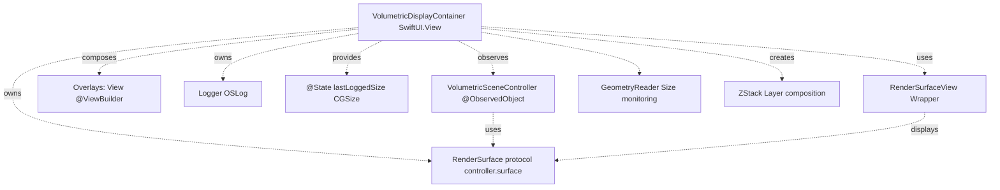
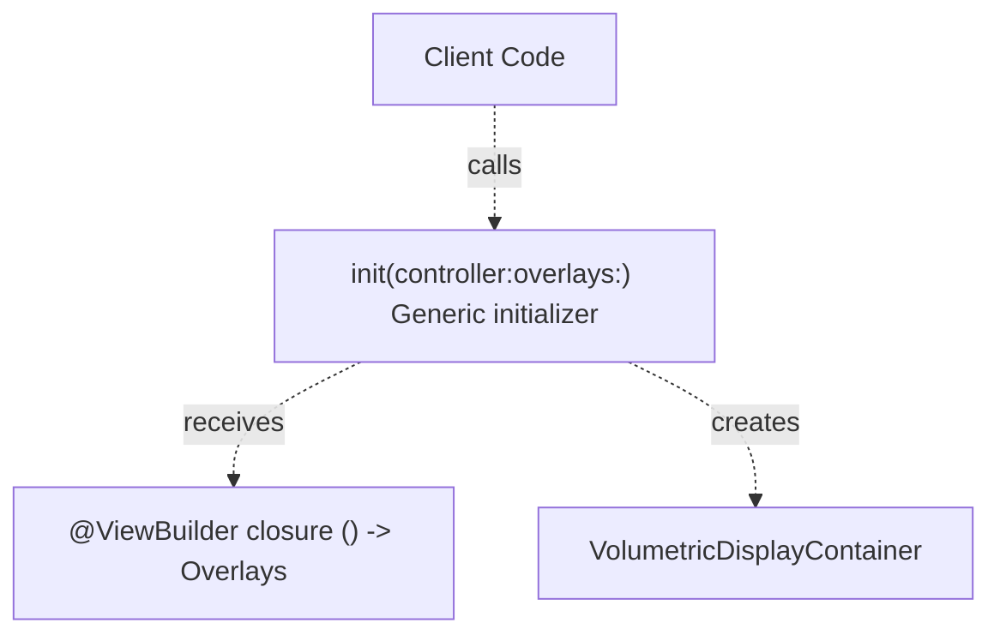
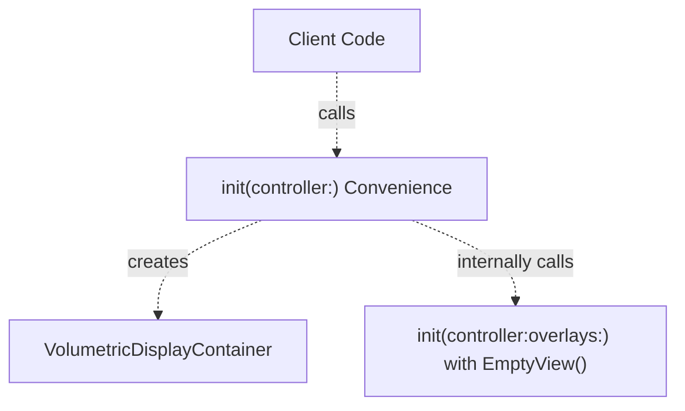
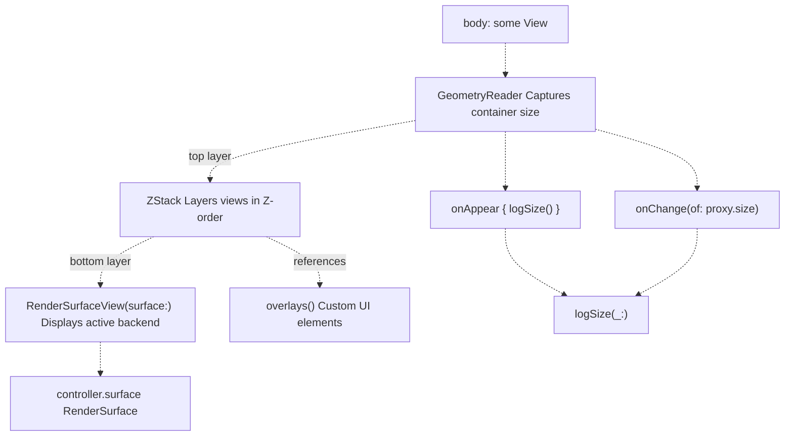
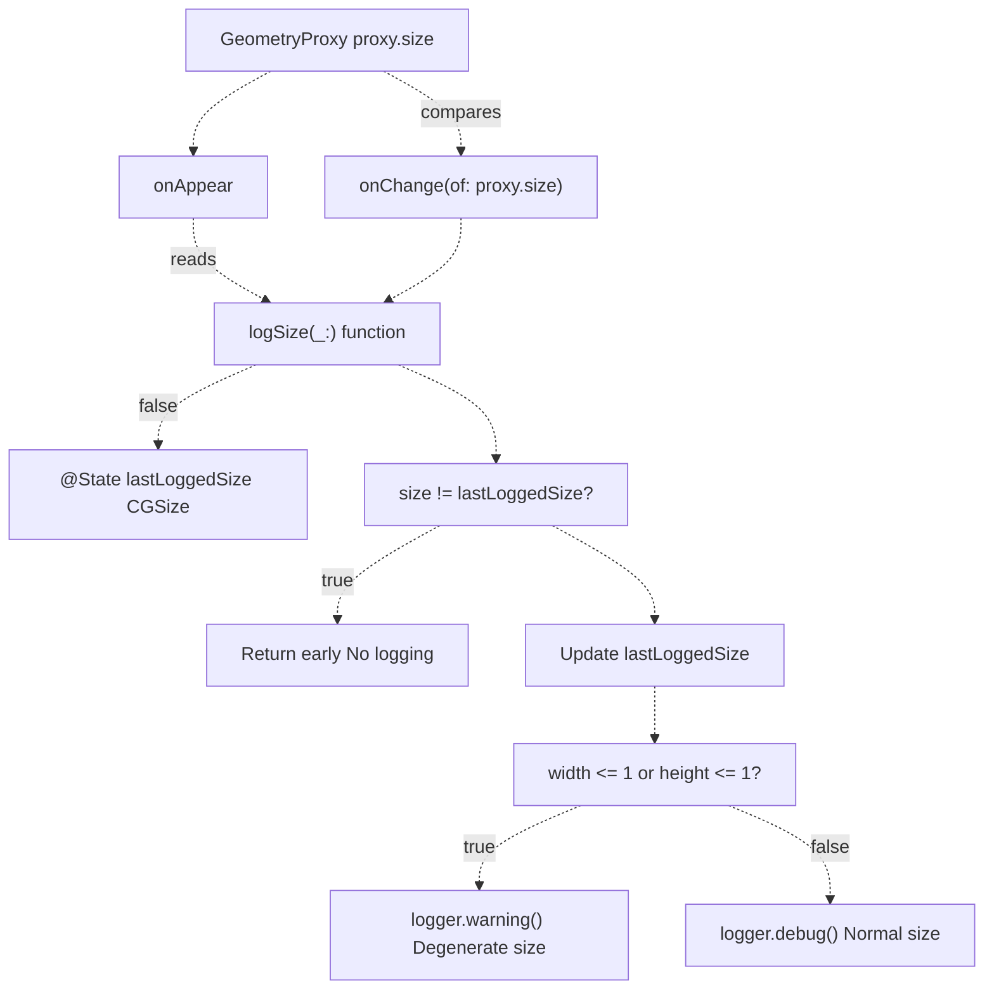
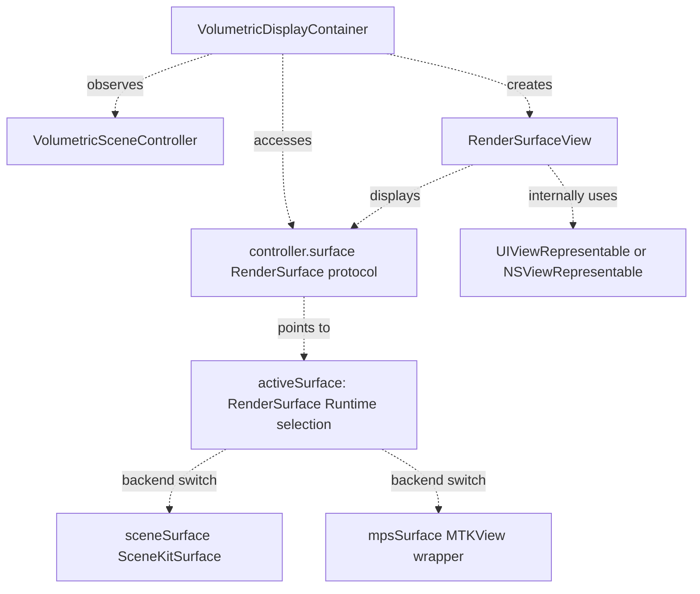
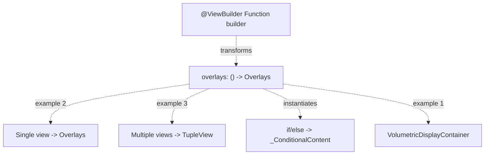
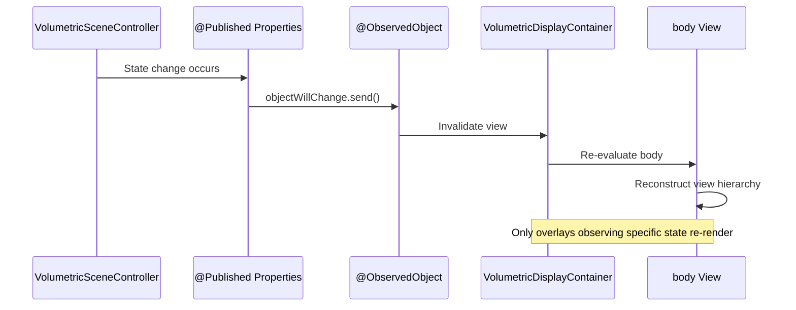
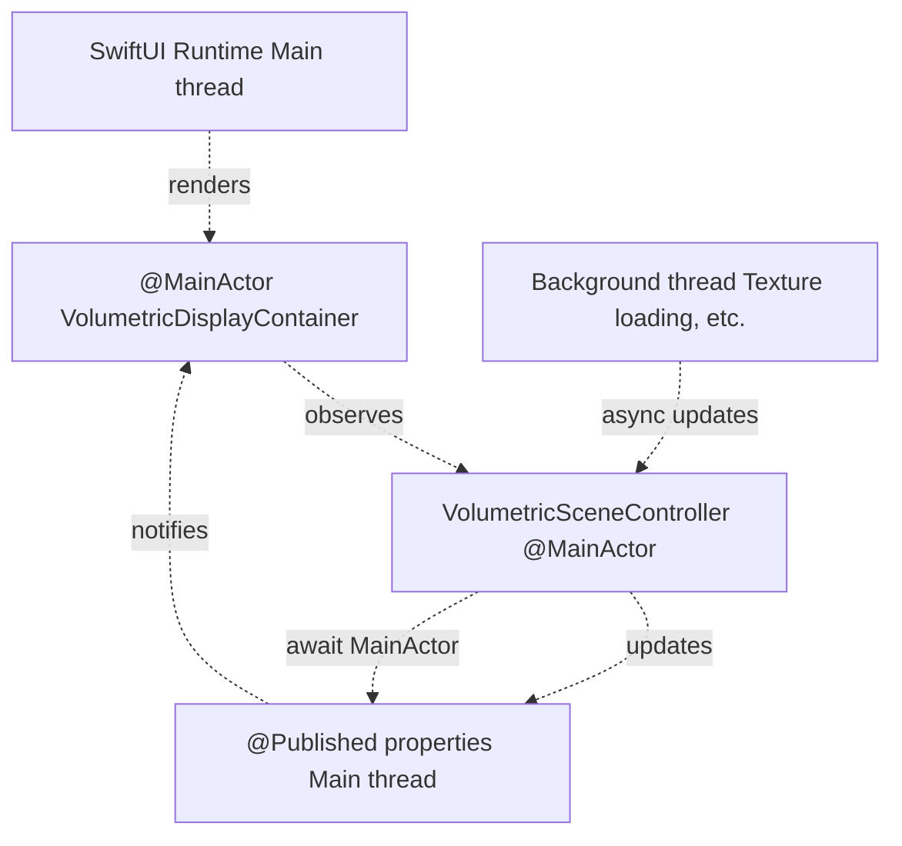

# VolumetricDisplayContainer

> **Relevant source files**
> * [Sources/MTKUI/VolumetricDisplayContainer.swift](https://github.com/ThalesMMS/MTK/blob/eda6f990/Sources/MTKUI/VolumetricDisplayContainer.swift)

**Purpose**: This document describes `VolumetricDisplayContainer`, the primary SwiftUI view component for displaying volumetric rendering surfaces with optional overlay compositions. It provides a generic container that hosts render surfaces from either backend (SceneKit or MPS) and enables composable UI overlay integration.

**Scope**: This page covers the container's generic design, view hierarchy composition, size monitoring system, and integration patterns. For the underlying render surface abstraction, see [RenderSurface Abstraction](2c%20RenderSurface-Abstraction.md). For the coordinator pattern and reactive state management, see [Coordinator Pattern & State Flow](6b%20Coordinator-Pattern-&-State-Flow.md). For specific overlay implementations, see [UI Overlays and Gestures](6c%20UI-Overlays-and-Gestures.md).

---

## Overview

`VolumetricDisplayContainer` is a generic SwiftUI view that serves as the presentation layer entry point for volumetric visualization. It abstracts the rendering backend (SceneKit or MPS) behind the `RenderSurface` protocol and provides a composable overlay system for adding UI elements above the rendered volume.

**Key characteristics:**

* **Generic over overlays**: Type parameter `<Overlays: View>` enables compile-time verified overlay composition
* **Backend-agnostic**: Displays any `RenderSurface` implementation without knowing the underlying technology
* **Reactive**: Observes `VolumetricSceneController` for automatic updates when rendering state changes
* **Size-aware**: Monitors container dimensions and logs degenerate sizes for debugging
* **Accessibility-ready**: Includes identifiers for UI testing

**Sources**: [Sources/MTKUI/VolumetricDisplayContainer.swift L1-L54](https://github.com/ThalesMMS/MTK/blob/eda6f990/Sources/MTKUI/VolumetricDisplayContainer.swift#L1-L54)

---

## Type Structure and Dependencies

The container is implemented as a generic struct with minimal dependencies, ensuring it remains a lightweight composition layer:



**Type hierarchy:**

* `VolumetricDisplayContainer<Overlays: View>`: Generic struct conforming to `View`
* **Generic constraint**: `Overlays` must conform to SwiftUI's `View` protocol
* **Attribute**: `@MainActor` ensures all operations occur on the main thread

**Sources**: [Sources/MTKUI/VolumetricDisplayContainer.swift L10-L21](https://github.com/ThalesMMS/MTK/blob/eda6f990/Sources/MTKUI/VolumetricDisplayContainer.swift#L10-L21)

---

## Initialization Patterns

The container provides two initialization patterns to accommodate different use cases:

### Full Initializer with Custom Overlays



**Parameters:**

* `controller: VolumetricSceneController` - The observed controller managing rendering state
* `overlays: @escaping () -> Overlays` - ViewBuilder closure constructing overlay hierarchy

**Usage:**

```
VolumetricDisplayContainer(controller: controller) {    VStack {        CrosshairOverlayView()        OrientationOverlayView(cameraState: controller.cameraState)    }}
```

**Sources**: [Sources/MTKUI/VolumetricDisplayContainer.swift L17-L21](https://github.com/ThalesMMS/MTK/blob/eda6f990/Sources/MTKUI/VolumetricDisplayContainer.swift#L17-L21)

### Convenience Initializer for No Overlays

For cases where no overlays are needed, a convenience initializer eliminates the need to specify `EmptyView`:



**Type inference:**

* When using this initializer, the compiler infers `Overlays = EmptyView`
* The generic type specialization occurs at compile time

**Usage:**

```
VolumetricDisplayContainer(controller: controller)
```

**Sources**: [Sources/MTKUI/VolumetricDisplayContainer.swift L36-L40](https://github.com/ThalesMMS/MTK/blob/eda6f990/Sources/MTKUI/VolumetricDisplayContainer.swift#L36-L40)

---

## View Hierarchy Composition

The container uses a carefully layered view structure to enable flexible overlay composition while monitoring size changes:



### Layer Breakdown

| Layer | Component | Purpose |
| --- | --- | --- |
| **Outer** | `GeometryReader` | Provides `GeometryProxy` with container's allocated size |
| **Middle** | `ZStack` | Composites render surface and overlays in Z-order |
| **Bottom** | `RenderSurfaceView` | Displays the volumetric render output |
| **Top** | `overlays()` | Client-provided UI elements (crosshairs, controls, etc.) |

### Key View Modifiers

**Accessibility identifier:**

```
.accessibilityIdentifier("VolumetricRenderSurface")
```

Applied to `RenderSurfaceView` for UI testing and automation.

**Size monitoring:**

```
.onAppear { logSize(proxy.size) }
.onChange(of: proxy.size) { logSize($0) }
```

Logs size on initial appearance and whenever the container is resized.

**Sources**: [Sources/MTKUI/VolumetricDisplayContainer.swift L23-L33](https://github.com/ThalesMMS/MTK/blob/eda6f990/Sources/MTKUI/VolumetricDisplayContainer.swift#L23-L33)

---

## Size Monitoring System

The container implements a size monitoring system to detect layout issues and provide debugging information:



### Size Logging Logic

**Deduplication:**

* Maintains `@State private var lastLoggedSize: CGSize` to prevent duplicate logs
* Only logs when size actually changes
* Reduces log noise during high-frequency updates

**Degenerate size detection:**

* Considers sizes with `width <= 1` or `height <= 1` as degenerate
* Logs warning for degenerate sizes: `"Volumetric container has degenerate size width=... height=..."`
* Logs debug message for normal sizes: `"Volumetric container size width=... height=..."`

**Logger configuration:**

```
private let logger = Logger(    subsystem: "com.isis.viewer",    category: "VolumetricDisplayContainer")
```

### Common Degenerate Size Scenarios

| Scenario | Width | Height | Cause |
| --- | --- | --- | --- |
| Unconstrained frame | 10 | 10 | Default preview size in Xcode canvas |
| Collapsed container | 0 or 1 | varies | Parent view has `.frame(width: 0)` |
| Hidden view | 1 | 1 | SwiftUI optimization for hidden views |
| Layout conflict | varies | 0 or 1 | Constraint conflicts in parent hierarchy |

**Sources**: [Sources/MTKUI/VolumetricDisplayContainer.swift L42-L52](https://github.com/ThalesMMS/MTK/blob/eda6f990/Sources/MTKUI/VolumetricDisplayContainer.swift#L42-L52)

---

## Integration with RenderSurface Protocol

The container displays the active render surface through the `RenderSurface` protocol abstraction:



### Backend Transparency

The container remains **completely agnostic** of which backend is active:

* It accesses `controller.surface`, which implements `RenderSurface`
* The controller internally selects between `sceneSurface` (SceneKit) and `mpsSurface` (MPS)
* Switching backends updates `controller.surface` without requiring container changes
* The container does not need to know about `SCNView`, `MTKView`, or any rendering implementation

**Advantages:**

* **Decoupling**: Container doesn't depend on SceneKit or Metal Performance Shaders
* **Testability**: Can inject mock `RenderSurface` implementations for testing
* **Future-proofing**: New backends can be added without modifying the container

For details on the `RenderSurface` abstraction, see [RenderSurface Abstraction](2c%20RenderSurface-Abstraction.md).

**Sources**: [Sources/MTKUI/VolumetricDisplayContainer.swift L26-L27](https://github.com/ThalesMMS/MTK/blob/eda6f990/Sources/MTKUI/VolumetricDisplayContainer.swift#L26-L27)

---

## Overlay Composition Patterns

The generic overlay system enables flexible UI composition while maintaining type safety:

### Pattern 1: Single Overlay

```
VolumetricDisplayContainer(controller: controller) {    CrosshairOverlayView()}// Type: VolumetricDisplayContainer<CrosshairOverlayView>
```

### Pattern 2: Stacked Overlays with VStack

```
VolumetricDisplayContainer(controller: controller) {    VStack {        OrientationOverlayView(cameraState: controller.cameraState)        Spacer()        WindowLevelControlView(windowLevelState: controller.windowLevelState)    }}// Type: VolumetricDisplayContainer<VStack<TupleView<...>>>
```

### Pattern 3: Conditional Overlays

```
VolumetricDisplayContainer(controller: controller) {    if showOverlays {        CrosshairOverlayView()    }}// Type: VolumetricDisplayContainer<_ConditionalContent<CrosshairOverlayView, EmptyView>>
```

### Pattern 4: No Overlays

```
VolumetricDisplayContainer(controller: controller)// Type: VolumetricDisplayContainer<EmptyView>
```

### Type System Interaction



**ViewBuilder transformation:**

* Single views pass through unchanged
* Multiple views are wrapped in `TupleView`
* Conditionals become `_ConditionalContent`
* Empty bodies become `EmptyView`

**Sources**: [Sources/MTKUI/VolumetricDisplayContainer.swift L15-L21](https://github.com/ThalesMMS/MTK/blob/eda6f990/Sources/MTKUI/VolumetricDisplayContainer.swift#L15-L21)

---

## Reactive Update Flow

The container automatically updates when the controller's published state changes:



### Observed Properties

The container observes the entire `VolumetricSceneController`, which publishes:

* `@Published var cameraState: CameraStateSnapshot?`
* `@Published var sliceState: SliceStateSnapshot?`
* `@Published var windowLevelState: WindowLevelSnapshot?`
* `@Published var adaptiveSamplingEnabled: Bool`

### Update Optimization

**Container-level updates:**

* The container itself only reconstructs when `controller.surface` changes (backend switch)
* Most state changes do not affect the container's structure

**Overlay-level updates:**

* Overlays that observe specific published properties update independently
* Example: `OrientationOverlayView` observing `cameraState` updates without recreating the entire container

**Best practice:**

* Pass specific published properties to overlays rather than the entire controller
* Reduces unnecessary view invalidations

**Sources**: [Sources/MTKUI/VolumetricDisplayContainer.swift L12](https://github.com/ThalesMMS/MTK/blob/eda6f990/Sources/MTKUI/VolumetricDisplayContainer.swift#L12-L12)

---

## Usage Examples

### Basic Setup

```
import SwiftUIimport MTKUIstruct VolumeViewerView: View {    @StateObject private var controller = VolumetricSceneController()        var body: some View {        VolumetricDisplayContainer(controller: controller)            .onAppear {                Task {                    // Load volume data                    await loadVolumeDataset()                }            }    }        func loadVolumeDataset() async {        // Loading logic...    }}
```

### With Custom Overlays

```
struct VolumeViewerWithOverlays: View {    @StateObject private var controller = VolumetricSceneController()        var body: some View {        VolumetricDisplayContainer(controller: controller) {            VStack {                HStack {                    Spacer()                    if let cameraState = controller.cameraState {                        OrientationOverlayView(cameraState: cameraState)                    }                }                Spacer()                CrosshairOverlayView()                Spacer()                if let windowLevelState = controller.windowLevelState {                    WindowLevelControlView(windowLevelState: windowLevelState)                }            }            .padding()        }    }}
```

### In Coordinator Pattern

```
struct VolumetricScene: View {    @StateObject private var coordinator = VolumetricSceneCoordinator()        var body: some View {        VolumetricDisplayContainer(controller: coordinator.controller) {            coordinator.defaultOverlays()        }        .gesture(            DragGesture()                .onChanged { coordinator.handleDrag($0) }        )    }}
```

**Sources**: [Sources/MTKUI/VolumetricDisplayContainer.swift L1-L54](https://github.com/ThalesMMS/MTK/blob/eda6f990/Sources/MTKUI/VolumetricDisplayContainer.swift#L1-L54)

---

## Threading and Actor Isolation

The container is annotated with `@MainActor` to ensure all UI operations occur on the main thread:



**Implications:**

* All view construction occurs on the main thread
* Controller state updates may be enqueued from background threads but are published on main thread
* Overlays constructed via ViewBuilder execute on main thread
* No manual dispatch required for UI updates

**Sources**: [Sources/MTKUI/VolumetricDisplayContainer.swift L10](https://github.com/ThalesMMS/MTK/blob/eda6f990/Sources/MTKUI/VolumetricDisplayContainer.swift#L10-L10)

---

## Design Rationale

### Generic Overlay System

**Decision**: Use `<Overlays: View>` generic parameter instead of `AnyView` type erasure.

**Rationale:**

* **Performance**: Avoids runtime type erasure overhead
* **Type safety**: Compiler verifies overlay conformance at compile time
* **Optimization**: SwiftUI can optimize generic view hierarchies more effectively
* **Code clarity**: Clear generic constraint is more explicit than type-erased `AnyView`

### GeometryReader + ZStack Pattern

**Decision**: Use `GeometryReader` wrapping `ZStack` instead of `overlay()` modifier.

**Rationale:**

* **Size access**: `GeometryReader` provides explicit size monitoring
* **Layer control**: `ZStack` gives precise control over layering order
* **Debugging**: Explicit structure makes view debugging easier
* **Flexibility**: Allows overlays to access geometry proxy if needed

### Separate Convenience Initializer

**Decision**: Provide `init(controller:)` instead of default parameter `overlays: @escaping () -> Overlays = { EmptyView() }`.

**Rationale:**

* **Type inference**: Default parameter doesn't allow compiler to infer `Overlays = EmptyView`
* **API clarity**: Explicit initializer makes no-overlay case obvious
* **Extension pattern**: SwiftUI convention is to use extensions for specialized initializers

**Sources**: [Sources/MTKUI/VolumetricDisplayContainer.swift L1-L54](https://github.com/ThalesMMS/MTK/blob/eda6f990/Sources/MTKUI/VolumetricDisplayContainer.swift#L1-L54)

---

## Related Components

| Component | Purpose | Reference |
| --- | --- | --- |
| `RenderSurfaceView` | Wraps `RenderSurface` in SwiftUI view | Section [2.3](2c%20RenderSurface-Abstraction.md) |
| `VolumetricSceneController` | Manages rendering state and backends | [VolumetricSceneController](3%20VolumetricSceneController.md) |
| `VolumetricSceneCoordinator` | SwiftUI state management wrapper | Section [6.2](6b%20Coordinator-Pattern-&-State-Flow.md) |
| `CrosshairOverlayView` | Built-in crosshair overlay | Section [6.3](6c%20UI-Overlays-and-Gestures.md) |
| `OrientationOverlayView` | Built-in orientation labels | Section [6.3](6c%20UI-Overlays-and-Gestures.md) |
| `WindowLevelControlView` | Built-in HU windowing controls | Section [6.3](6c%20UI-Overlays-and-Gestures.md) |

**Sources**: [Sources/MTKUI/VolumetricDisplayContainer.swift L1-L54](https://github.com/ThalesMMS/MTK/blob/eda6f990/Sources/MTKUI/VolumetricDisplayContainer.swift#L1-L54)


### On this page

* [VolumetricDisplayContainer](#6.1-volumetricdisplaycontainer)
* [Overview](#6.1-overview)
* [Type Structure and Dependencies](#6.1-type-structure-and-dependencies)
* [Initialization Patterns](#6.1-initialization-patterns)
* [Full Initializer with Custom Overlays](#6.1-full-initializer-with-custom-overlays)
* [Convenience Initializer for No Overlays](#6.1-convenience-initializer-for-no-overlays)
* [View Hierarchy Composition](#6.1-view-hierarchy-composition)
* [Layer Breakdown](#6.1-layer-breakdown)
* [Key View Modifiers](#6.1-key-view-modifiers)
* [Size Monitoring System](#6.1-size-monitoring-system)
* [Size Logging Logic](#6.1-size-logging-logic)
* [Common Degenerate Size Scenarios](#6.1-common-degenerate-size-scenarios)
* [Integration with RenderSurface Protocol](#6.1-integration-with-rendersurface-protocol)
* [Backend Transparency](#6.1-backend-transparency)
* [Overlay Composition Patterns](#6.1-overlay-composition-patterns)
* [Pattern 1: Single Overlay](#6.1-pattern-1-single-overlay)
* [Pattern 2: Stacked Overlays with VStack](#6.1-pattern-2-stacked-overlays-with-vstack)
* [Pattern 3: Conditional Overlays](#6.1-pattern-3-conditional-overlays)
* [Pattern 4: No Overlays](#6.1-pattern-4-no-overlays)
* [Type System Interaction](#6.1-type-system-interaction)
* [Reactive Update Flow](#6.1-reactive-update-flow)
* [Observed Properties](#6.1-observed-properties)
* [Update Optimization](#6.1-update-optimization)
* [Usage Examples](#6.1-usage-examples)
* [Basic Setup](#6.1-basic-setup)
* [With Custom Overlays](#6.1-with-custom-overlays)
* [In Coordinator Pattern](#6.1-in-coordinator-pattern)
* [Threading and Actor Isolation](#6.1-threading-and-actor-isolation)
* [Design Rationale](#6.1-design-rationale)
* [Generic Overlay System](#6.1-generic-overlay-system)
* [GeometryReader + ZStack Pattern](#6.1-geometryreader-zstack-pattern)
* [Separate Convenience Initializer](#6.1-separate-convenience-initializer)
* [Related Components](#6.1-related-components)

Ask Devin about MTK