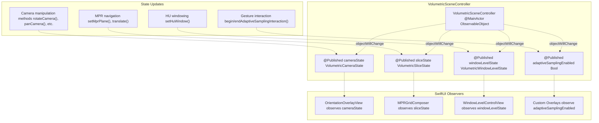
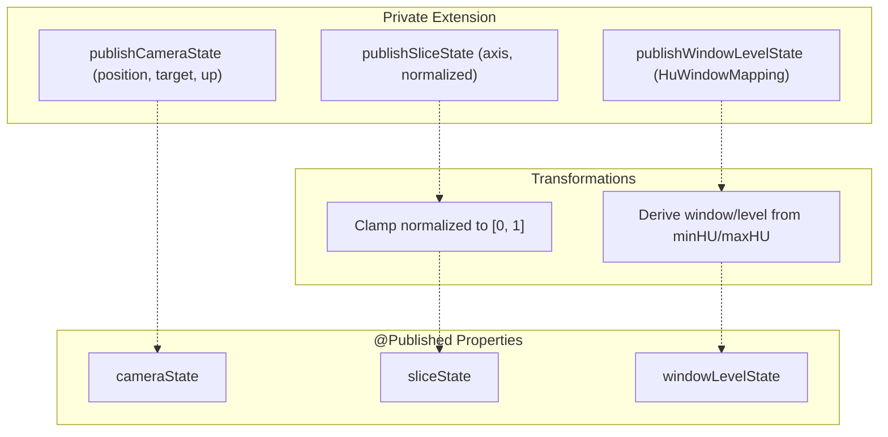
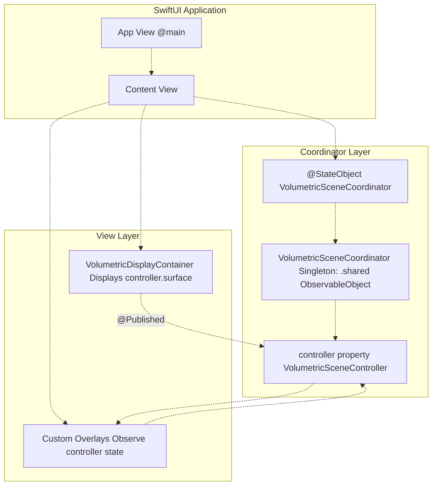
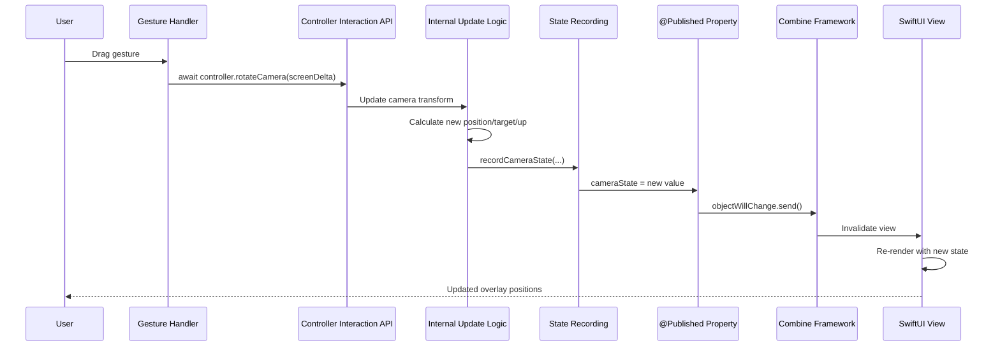
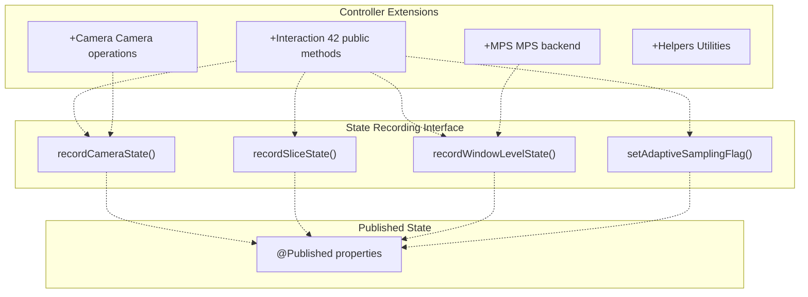

# Coordinator Pattern & State Flow

> **Relevant source files**
> * [BACKEND_RESOLVER_USAGE.md](https://github.com/ThalesMMS/MTK/blob/eda6f990/BACKEND_RESOLVER_USAGE.md)
> * [DOCUMENTATION_STANDARD.md](https://github.com/ThalesMMS/MTK/blob/eda6f990/DOCUMENTATION_STANDARD.md)
> * [README.md](https://github.com/ThalesMMS/MTK/blob/eda6f990/README.md)
> * [SURFACE_ADAPTER_DELIVERABLES.txt](https://github.com/ThalesMMS/MTK/blob/eda6f990/SURFACE_ADAPTER_DELIVERABLES.txt)
> * [Sources/MTKUI/VolumetricSceneController.swift](https://github.com/ThalesMMS/MTK/blob/eda6f990/Sources/MTKUI/VolumetricSceneController.swift)

## Purpose and Scope

This document explains how MTK implements the **Coordinator pattern** for SwiftUI integration and how **reactive state flows** from the rendering controller to UI components through Combine's `@Published` properties. It covers the state structures, the `VolumetricSceneController` as an `ObservableObject`, state recording mechanisms, and the `VolumetricSceneCoordinator` wrapper that simplifies SwiftUI integration.

For the view component that displays the render surface and overlays, see [VolumetricDisplayContainer](6a%20VolumetricDisplayContainer.md). For gesture handling and overlay components, see [UI Overlays and Gestures](6c%20UI-Overlays-and-Gestures.md). For the controller's interaction API, see [Interaction API](3a%20Interaction-API.md). For general state management concepts, see [State Management & Reactivity](3d%20State-Management-&-Reactivity.md).

---

## State Structures

MTK defines **four state structures** that represent different aspects of the volumetric scene. These structures are `Equatable` value types that can be observed by SwiftUI views for reactive updates.

### VolumetricCameraState

Represents the camera's position and orientation in 3D space.

| Property | Type | Description |
| --- | --- | --- |
| `position` | `SIMD3<Float>` | Camera position in world coordinates |
| `target` | `SIMD3<Float>` | Point the camera is looking at |
| `up` | `SIMD3<Float>` | Camera's up vector (default `(0, 1, 0)`) |

**Sources:** [Sources/MTKUI/VolumetricSceneController.swift L16-L28](https://github.com/ThalesMMS/MTK/blob/eda6f990/Sources/MTKUI/VolumetricSceneController.swift#L16-L28)

### VolumetricSliceState

Represents the current MPR slice position when in multi-planar reconstruction mode.

| Property | Type | Description |
| --- | --- | --- |
| `axis` | `VolumetricSceneController.Axis` | Slice axis (x, y, or z) |
| `normalizedPosition` | `Float` | Position along axis, clamped to [0, 1] |

**Sources:** [Sources/MTKUI/VolumetricSceneController.swift L30-L39](https://github.com/ThalesMMS/MTK/blob/eda6f990/Sources/MTKUI/VolumetricSceneController.swift#L30-L39)

### VolumetricWindowLevelState

Represents the current Hounsfield Unit (HU) windowing parameters for CT visualization.

| Property | Type | Description |
| --- | --- | --- |
| `window` | `Double` | Window width (HU range) |
| `level` | `Double` | Window center (midpoint HU value) |

The window/level values are **derived** from the material's `HuWindowMapping` (minHU/maxHU). The window is the width of the HU range, and the level is the midpoint.

**Sources:** [Sources/MTKUI/VolumetricSceneController.swift L41-L49](https://github.com/ThalesMMS/MTK/blob/eda6f990/Sources/MTKUI/VolumetricSceneController.swift#L41-L49)

### Adaptive Sampling Flag

A simple `Bool` flag indicating whether adaptive sampling is currently active during user interactions.

**Sources:** [Sources/MTKUI/VolumetricSceneController.swift L280](https://github.com/ThalesMMS/MTK/blob/eda6f990/Sources/MTKUI/VolumetricSceneController.swift#L280-L280)

---

## VolumetricSceneController as ObservableObject

`VolumetricSceneController` conforms to **`ObservableObject`**, making it compatible with SwiftUI's reactive system. It publishes **four state properties** using Combine's `@Published` property wrapper.



**Figure 1: Published Properties and SwiftUI Observation**

The `@Published` properties trigger `objectWillChange` notifications automatically when their values change, causing SwiftUI to re-evaluate any views that depend on the controller.

**Sources:** [Sources/MTKUI/VolumetricSceneController.swift L277-L280](https://github.com/ThalesMMS/MTK/blob/eda6f990/Sources/MTKUI/VolumetricSceneController.swift#L277-L280)

---

## State Recording and Publication

The controller provides **two layers** of state update methods: private publication helpers and public recording helpers. This separation maintains encapsulation while allowing extension files to update published state.

### Private Publication Helpers

These methods implement the **actual state publication logic**, including value transformations:



**Figure 2: State Publication Pipeline**

The `publishSliceState` method **clamps** the normalized position to [0, 1] using a helper function [Sources/MTKUI/VolumetricSceneController.swift L97](https://github.com/ThalesMMS/MTK/blob/eda6f990/Sources/MTKUI/VolumetricSceneController.swift#L97-L97)

The `publishWindowLevelState` method **derives** window and level from the `HuWindowMapping` structure:

* `window = maxHU - minHU`
* `level = minHU + window / 2`

**Sources:** [Sources/MTKUI/VolumetricSceneController.swift L91-L106](https://github.com/ThalesMMS/MTK/blob/eda6f990/Sources/MTKUI/VolumetricSceneController.swift#L91-L106)

### Public Recording Helpers

These methods provide a **narrow interface** for extension files to update state without exposing the `@Published` property setters directly:

| Method | Purpose |
| --- | --- |
| `setAdaptiveSamplingFlag(_:)` | Toggle adaptive sampling without exposing setter |
| `recordCameraState(position:target:up:)` | Update camera state from camera operations |
| `recordSliceState(axis:normalized:)` | Update slice state from MPR navigation |
| `recordWindowLevelState(_:)` | Update window/level from HU window changes |

These methods are marked with `@inline(__always)` for **zero-overhead abstraction**—they compile to direct property assignments while maintaining encapsulation.

**Sources:** [Sources/MTKUI/VolumetricSceneController.swift L109-L134](https://github.com/ThalesMMS/MTK/blob/eda6f990/Sources/MTKUI/VolumetricSceneController.swift#L109-L134)

---

## VolumetricSceneCoordinator Pattern

While `VolumetricSceneController` provides the core functionality, **`VolumetricSceneCoordinator`** serves as a **simplified SwiftUI wrapper** that follows the coordinator pattern common in iOS applications.



**Figure 3: Coordinator Pattern in SwiftUI**

### Key Characteristics

1. **Singleton Pattern**: The coordinator provides a `.shared` instance for convenient access
2. **@StateObject Ownership**: SwiftUI views create the coordinator as a `@StateObject`, ensuring lifecycle management
3. **Simplified API**: The coordinator exposes convenience methods that wrap controller operations
4. **State Propagation**: Changes in the controller automatically propagate to views observing the coordinator

### Typical Usage

```
struct VolumePreview: View {    @StateObject private var coordinator = VolumetricSceneCoordinator.shared        var body: some View {        VolumetricDisplayContainer(controller: coordinator.controller) {            OrientationOverlayView()            CrosshairOverlayView()        }        .task {            coordinator.apply(dataset: myDataset)            coordinator.applyHuWindow(min: -500, max: 1200)        }    }}
```

The coordinator exposes the underlying `controller` property for direct access when needed, but provides **convenience methods** for common operations like `apply(dataset:)` and `applyHuWindow(min:max:)`.

**Sources:** README.md

---

## Reactive State Flow

The following diagram illustrates the **complete state flow** from user interaction to UI update:



**Figure 4: State Flow Sequence from User Interaction to UI Update**

### State Update Flow Details

1. **User Interaction**: Gesture recognizers detect user input (drag, pinch, rotation)
2. **Async API Call**: Gesture handler calls controller method with `await` (all controller methods are `async`)
3. **Internal Processing**: Controller updates SceneKit nodes, materials, or GPU resources
4. **State Recording**: Controller calls `recordXXXState` helper to update published state
5. **Property Publication**: `@Published` wrapper triggers `objectWillChange` notification
6. **Combine Propagation**: Combine framework notifies all observers (SwiftUI views)
7. **SwiftUI Invalidation**: Views re-evaluate their `body` properties
8. **UI Update**: Updated overlays, controls, or indicators render with new state

**Sources:** [Sources/MTKUI/VolumetricSceneController.swift L109-L134](https://github.com/ThalesMMS/MTK/blob/eda6f990/Sources/MTKUI/VolumetricSceneController.swift#L109-L134)

---

## State Consistency and Thread Safety

### Main Actor Isolation

Both `VolumetricSceneController` and `VolumetricSceneCoordinator` are annotated with **`@MainActor`**, ensuring all state updates occur on the main thread. This guarantees:

* Thread-safe access to `@Published` properties
* Consistent state during SwiftUI rendering
* No race conditions between gesture handlers and rendering

**Sources:** [Sources/MTKUI/VolumetricSceneController.swift L147](https://github.com/ThalesMMS/MTK/blob/eda6f990/Sources/MTKUI/VolumetricSceneController.swift#L147-L147)

 [Sources/MTKUI/VolumetricSceneController.swift L193](https://github.com/ThalesMMS/MTK/blob/eda6f990/Sources/MTKUI/VolumetricSceneController.swift#L193-L193)

### Async/Await Pattern

All controller methods are **`async`**, allowing SwiftUI views to call them with `await` in `.task` or `.onAppear` modifiers without blocking the main thread:

```
.task {    await controller.setTransferFunction(myFunction)    await controller.setHuWindow(myWindow)}
```

This pattern ensures **smooth UI interactions** even during expensive operations like texture uploads or shader recompilation.

**Sources:** [Sources/MTKUI/VolumetricSceneController.swift L155-L190](https://github.com/ThalesMMS/MTK/blob/eda6f990/Sources/MTKUI/VolumetricSceneController.swift#L155-L190)

---

## State Observation Patterns

### Direct Controller Observation

Views can observe the controller directly as an `@ObservedObject`:

```
struct MyOverlay: View {    @ObservedObject var controller: VolumetricSceneController        var body: some View {        Text("Camera: \(controller.cameraState.position)")    }}
```

### Coordinator-Based Observation

Or observe through the coordinator as a `@StateObject`:

```
struct MyView: View {    @StateObject private var coordinator = VolumetricSceneCoordinator.shared        var body: some View {        MyOverlay(controller: coordinator.controller)    }}
```

### Granular State Observation

To avoid unnecessary view updates, observe **specific state properties**:

```
struct WindowLevelDisplay: View {    @ObservedObject var controller: VolumetricSceneController        var body: some View {        // Only updates when windowLevelState changes        Text("W: \(controller.windowLevelState.window) L: \(controller.windowLevelState.level)")    }}
```

**Sources:** [Sources/MTKUI/VolumetricSceneController.swift L277-L280](https://github.com/ThalesMMS/MTK/blob/eda6f990/Sources/MTKUI/VolumetricSceneController.swift#L277-L280)

---

## Platform-Specific Considerations

### iOS and macOS Implementations

The controller provides **full implementations** for iOS and macOS platforms with Metal and SceneKit support [Sources/MTKUI/VolumetricSceneController.swift L70-L491](https://github.com/ThalesMMS/MTK/blob/eda6f990/Sources/MTKUI/VolumetricSceneController.swift#L70-L491)

### Stub Implementation for Unsupported Platforms

For platforms without Metal/SceneKit, the controller provides a **stub implementation** that maintains the same API surface but performs no actual rendering. The stub still updates published state properties to allow UI testing [Sources/MTKUI/VolumetricSceneController.swift L492-L731](https://github.com/ThalesMMS/MTK/blob/eda6f990/Sources/MTKUI/VolumetricSceneController.swift#L492-L731)

| Feature | Full Implementation | Stub Implementation |
| --- | --- | --- |
| `@Published` state | ✓ Updates from actual rendering | ✓ Updates from stub logic |
| `surface` property | ✓ Returns `SceneKitSurface` or `MTKView` wrapper | ✓ Returns `StubSurface` |
| Async API | ✓ Performs real GPU operations | ✓ No-op or basic calculations |
| SwiftUI compatibility | ✓ Full reactive updates | ✓ Full reactive updates |

**Sources:** [Sources/MTKUI/VolumetricSceneController.swift L548-L731](https://github.com/ThalesMMS/MTK/blob/eda6f990/Sources/MTKUI/VolumetricSceneController.swift#L548-L731)

---

## State Recording from Controller Extensions

The controller uses **extension-based architecture** to organize functionality across multiple files. The state recording helpers enable these extensions to update published state:



**Figure 5: State Recording from Controller Extensions**

For example, the Camera extension updates camera state after computing new transforms:

```
// In VolumetricSceneController+Camera.swiftlet newPosition = ... // compute from transformlet newTarget = ...   // compute from transformlet newUp = ...       // compute from transformrecordCameraState(position: newPosition, target: newTarget, up: newUp)
```

**Sources:** [Sources/MTKUI/VolumetricSceneController.swift L109-L134](https://github.com/ThalesMMS/MTK/blob/eda6f990/Sources/MTKUI/VolumetricSceneController.swift#L109-L134)

---

## Integration with VolumetricDisplayContainer

The `VolumetricDisplayContainer` (see [VolumetricDisplayContainer](6a%20VolumetricDisplayContainer.md)) displays the active render surface and provides a `@ViewBuilder` slot for overlays. These overlays can observe the controller's published state:

```
VolumetricDisplayContainer(controller: coordinator.controller) {    // Observes cameraState for anatomical labels    OrientationOverlayView()        // Observes windowLevelState for slider positions    WindowLevelControlView(controller: coordinator.controller)        // Observes sliceState for slice indicators    if case .mpr = currentDisplay {        MPRSliceIndicator(controller: coordinator.controller)    }}
```

The container itself **does not observe state**—it only displays the render surface. The overlays are responsible for their own state observation.

**Sources:** README.md

 [SURFACE_ADAPTER_DELIVERABLES.txt L13-L16](https://github.com/ThalesMMS/MTK/blob/eda6f990/SURFACE_ADAPTER_DELIVERABLES.txt#L13-L16)

---

## State Flow Summary

| State Type | Source of Truth | Update Triggers | Observers |
| --- | --- | --- | --- |
| `cameraState` | SceneKit camera node | Camera manipulation methods | Orientation overlays, debug displays |
| `sliceState` | MPR plane position | MPR navigation methods | Slice indicators, MPR grids |
| `windowLevelState` | Material HU window mapping | HU windowing methods | Window/level controls, histogram displays |
| `adaptiveSamplingEnabled` | Gesture interaction flag | Begin/end interaction methods | Performance indicators, quality badges |

All state flows **unidirectionally** from the controller to SwiftUI views. Views never directly modify controller state—they call async methods on the controller, which then update state through the recording helpers.

**Sources:** [Sources/MTKUI/VolumetricSceneController.swift L277-L280](https://github.com/ThalesMMS/MTK/blob/eda6f990/Sources/MTKUI/VolumetricSceneController.swift#L277-L280)

 [Sources/MTKUI/VolumetricSceneController.swift L91-L134](https://github.com/ThalesMMS/MTK/blob/eda6f990/Sources/MTKUI/VolumetricSceneController.swift#L91-L134)


### On this page

* [Coordinator Pattern & State Flow](#6.2-coordinator-pattern-state-flow)
* [Purpose and Scope](#6.2-purpose-and-scope)
* [State Structures](#6.2-state-structures)
* [VolumetricCameraState](#6.2-volumetriccamerastate)
* [VolumetricSliceState](#6.2-volumetricslicestate)
* [VolumetricWindowLevelState](#6.2-volumetricwindowlevelstate)
* [Adaptive Sampling Flag](#6.2-adaptive-sampling-flag)
* [VolumetricSceneController as ObservableObject](#6.2-volumetricscenecontroller-as-observableobject)
* [State Recording and Publication](#6.2-state-recording-and-publication)
* [Private Publication Helpers](#6.2-private-publication-helpers)
* [Public Recording Helpers](#6.2-public-recording-helpers)
* [VolumetricSceneCoordinator Pattern](#6.2-volumetricscenecoordinator-pattern)
* [Key Characteristics](#6.2-key-characteristics)
* [Typical Usage](#6.2-typical-usage)
* [Reactive State Flow](#6.2-reactive-state-flow)
* [State Update Flow Details](#6.2-state-update-flow-details)
* [State Consistency and Thread Safety](#6.2-state-consistency-and-thread-safety)
* [Main Actor Isolation](#6.2-main-actor-isolation)
* [Async/Await Pattern](#6.2-asyncawait-pattern)
* [State Observation Patterns](#6.2-state-observation-patterns)
* [Direct Controller Observation](#6.2-direct-controller-observation)
* [Coordinator-Based Observation](#6.2-coordinator-based-observation)
* [Granular State Observation](#6.2-granular-state-observation)
* [Platform-Specific Considerations](#6.2-platform-specific-considerations)
* [iOS and macOS Implementations](#6.2-ios-and-macos-implementations)
* [Stub Implementation for Unsupported Platforms](#6.2-stub-implementation-for-unsupported-platforms)
* [State Recording from Controller Extensions](#6.2-state-recording-from-controller-extensions)
* [Integration with VolumetricDisplayContainer](#6.2-integration-with-volumetricdisplaycontainer)
* [State Flow Summary](#6.2-state-flow-summary)

Ask Devin about MTK