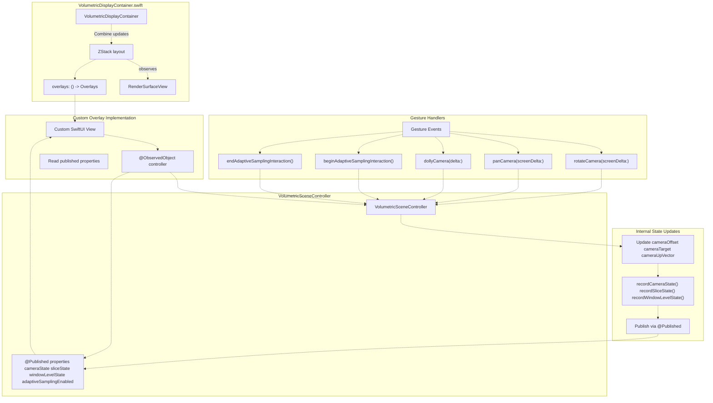
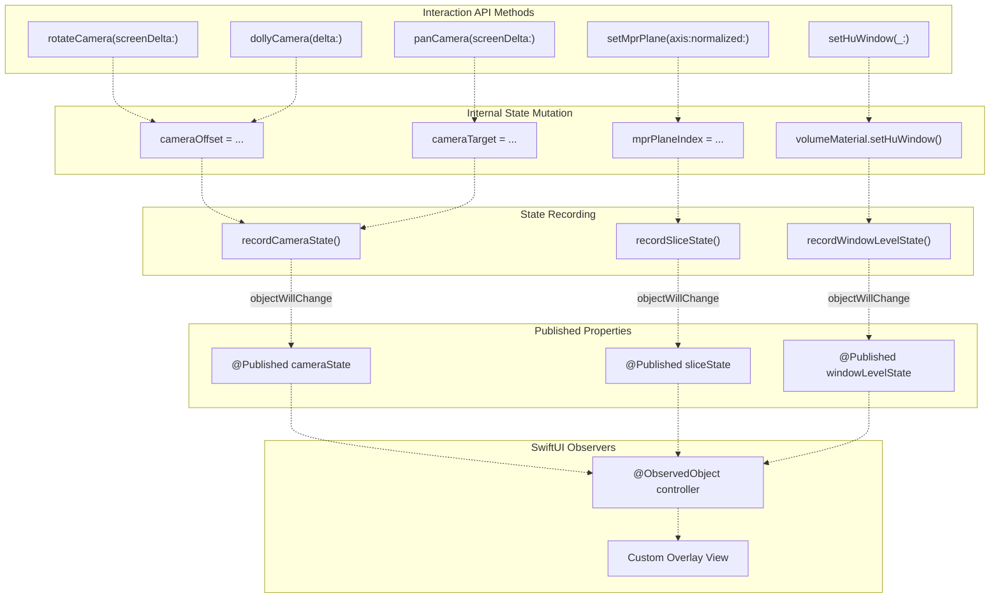
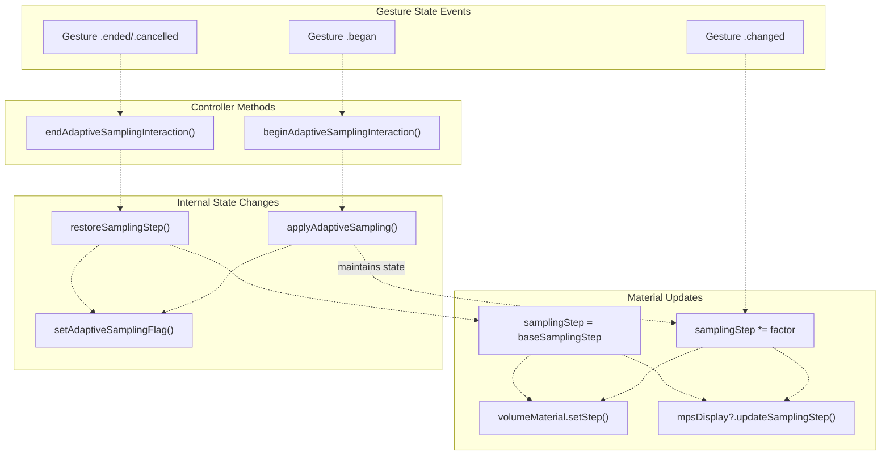
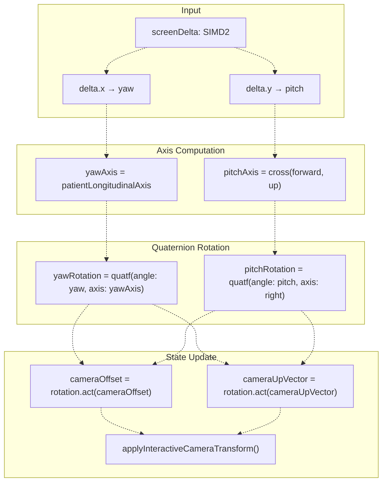
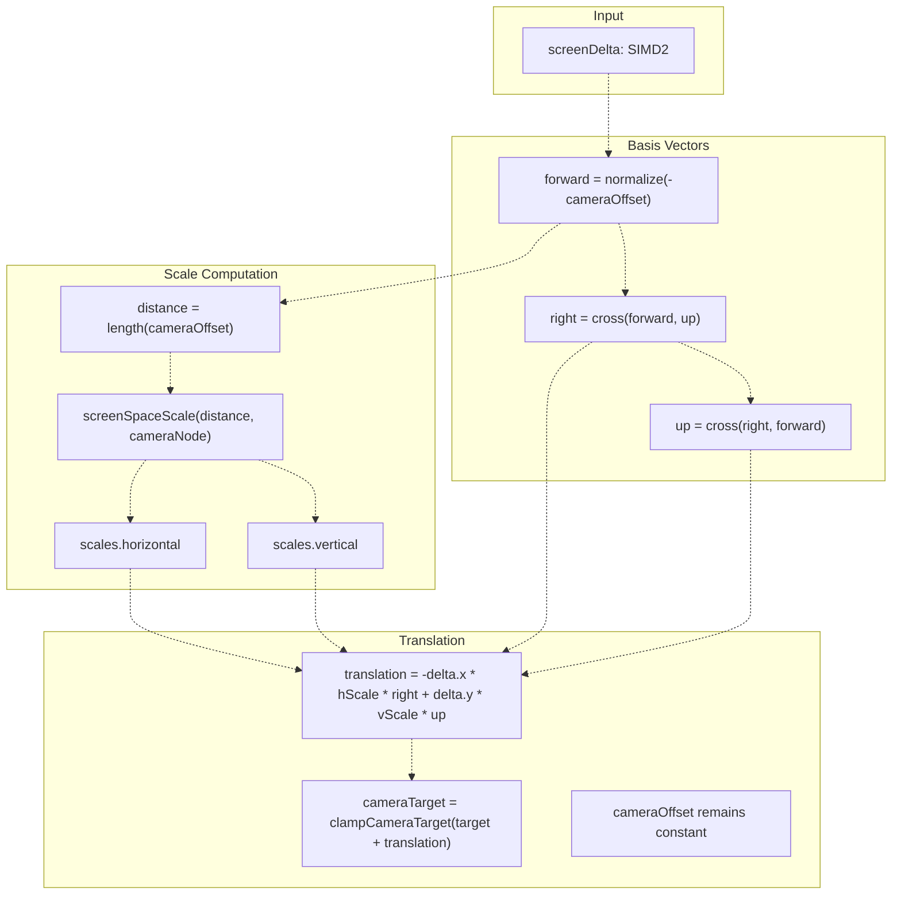
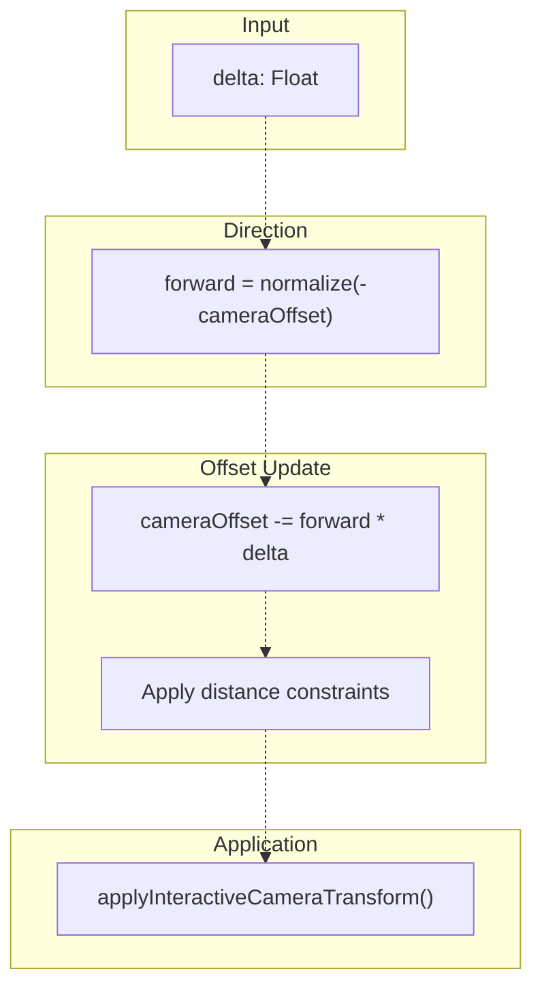

# UI Overlays and Gestures

> **Relevant source files**
> * [Sources/MTKUI/VolumetricDisplayContainer.swift](https://github.com/ThalesMMS/MTK/blob/eda6f990/Sources/MTKUI/VolumetricDisplayContainer.swift)
> * [Sources/MTKUI/VolumetricSceneController+Interaction.swift](https://github.com/ThalesMMS/MTK/blob/eda6f990/Sources/MTKUI/VolumetricSceneController+Interaction.swift)

This document describes the SwiftUI overlay components and gesture recognition system that enable interactive volumetric visualization. Overlays react to published state from `VolumetricSceneController` to display diagnostic information, manipulation controls, and multi-plane layouts. Gestures translate user input into camera transformations and adaptive sampling optimizations.

For details on the container that hosts overlays, see [VolumetricDisplayContainer](6a%20VolumetricDisplayContainer.md). For the coordinator that manages controller lifecycle and state synchronization, see [VolumetricSceneCoordinator](6b%20Coordinator-Pattern-&-State-Flow.md). For the underlying camera manipulation logic, see [Camera Management](3b%20Camera-Management.md).

---

## Architecture Overview

The overlay and gesture system follows a unidirectional data flow pattern where user interactions propagate through gesture recognizers to the controller's async API, triggering state updates that flow back to overlay views via Combine publishers.

**Overlay and Gesture Data Flow**



**Sources:** [Sources/MTKUI/VolumetricDisplayContainer.swift L11-L34](https://github.com/ThalesMMS/MTK/blob/eda6f990/Sources/MTKUI/VolumetricDisplayContainer.swift#L11-L34)

 [Sources/MTKUI/VolumetricSceneController L165-L254](https://github.com/ThalesMMS/MTK/blob/eda6f990/Sources/MTKUI/VolumetricSceneController+Interaction.swift#L165-L254)

---

## Published State System

The controller exposes four published properties that drive reactive UI updates. Overlay components observe these properties to display current rendering state without tight coupling to internal controller logic.

### State Property Reference

The controller exposes four `@Published` properties that provide reactive state updates to SwiftUI overlays. These properties represent different aspects of the volumetric rendering state.

| Property | Type | Purpose | Update Methods |
| --- | --- | --- | --- |
| `cameraState` | Camera snapshot struct | Camera position, target, up vector | `rotateCamera()`, `panCamera()`, `dollyCamera()`, `resetCamera()` |
| `sliceState` | Slice snapshot struct | MPR axis and normalized position | `setMprPlane()`, `translate()` |
| `windowLevelState` | Window/level snapshot struct | HU window width and level center | `setHuWindow()` |
| `adaptiveSamplingEnabled` | `Bool` | Adaptive sampling toggle state | `setAdaptiveSampling()`, gesture begin/end |

The state structures are lightweight snapshots designed for observation by SwiftUI views. They are updated through internal recording methods that normalize and clamp values before publication.

**Sources:** [Sources/MTKUI/VolumetricSceneController L165-L254](https://github.com/ThalesMMS/MTK/blob/eda6f990/Sources/MTKUI/VolumetricSceneController+Interaction.swift#L165-L254)

 [Sources/MTKUI/VolumetricSceneController L326-L332](https://github.com/ThalesMMS/MTK/blob/eda6f990/Sources/MTKUI/VolumetricSceneController+Interaction.swift#L326-L332)

### State Publication Flow

The controller updates published state through internal helper methods that normalize and clamp values before publication. This pattern ensures data consistency and prevents invalid state from propagating to UI components.

**State Recording and Publication Pipeline**



**Implementation Notes:**

The recording methods are called after state mutations to trigger Combine publication:

* Camera state is recorded after updating `cameraOffset`, `cameraTarget`, or `cameraUpVector` [Sources/MTKUI/VolumetricSceneController L165-L254](https://github.com/ThalesMMS/MTK/blob/eda6f990/Sources/MTKUI/VolumetricSceneController+Interaction.swift#L165-L254)
* Slice state is recorded after updating `mprPlaneIndex` and `mprNormalizedPosition` [Sources/MTKUI/VolumetricSceneController L360-L373](https://github.com/ThalesMMS/MTK/blob/eda6f990/Sources/MTKUI/VolumetricSceneController+Interaction.swift#L360-L373)
* Window state is recorded after calling `setHuWindow()` on materials [Sources/MTKUI/VolumetricSceneController L439-L446](https://github.com/ThalesMMS/MTK/blob/eda6f990/Sources/MTKUI/VolumetricSceneController+Interaction.swift#L439-L446)

The recording methods ensure normalized values (e.g., clamping slice positions to [0, 1]) before publishing to prevent invalid UI states.

**Sources:** [Sources/MTKUI/VolumetricSceneController L165-L254](https://github.com/ThalesMMS/MTK/blob/eda6f990/Sources/MTKUI/VolumetricSceneController+Interaction.swift#L165-L254)

 [Sources/MTKUI/VolumetricSceneController L360-L373](https://github.com/ThalesMMS/MTK/blob/eda6f990/Sources/MTKUI/VolumetricSceneController+Interaction.swift#L360-L373)

 [Sources/MTKUI/VolumetricSceneController L439-L446](https://github.com/ThalesMMS/MTK/blob/eda6f990/Sources/MTKUI/VolumetricSceneController+Interaction.swift#L439-L446)

---

## Overlay Component Development

MTK provides the `VolumetricDisplayContainer` as a generic container for hosting custom overlay views. The container uses a `@ViewBuilder` closure to compose overlays with the render surface.

### VolumetricDisplayContainer Structure

The container is defined as a generic SwiftUI view:

```
public struct VolumetricDisplayContainer<Overlays: View>: View
```

**Key Properties:**

* `controller: VolumetricSceneController` - Observed controller instance
* `overlays: () -> Overlays` - ViewBuilder closure for custom overlay content
* `lastLoggedSize: CGSize` - State tracking for size change logging

**Layout Implementation:**

The container uses `GeometryReader` and `ZStack` to layer overlays above the render surface:

1. `GeometryReader` provides viewport dimensions
2. `ZStack` layers views with render surface at bottom
3. `RenderSurfaceView` displays `controller.surface` (active backend)
4. Overlay content rendered on top via `overlays()` closure

**Size Monitoring:**

The container logs viewport size changes and detects degenerate dimensions:

* Warns if width or height ≤ 1 point
* Logs valid size changes for debugging

**Sources:** [Sources/MTKUI/VolumetricDisplayContainer.swift L11-L52](https://github.com/ThalesMMS/MTK/blob/eda6f990/Sources/MTKUI/VolumetricDisplayContainer.swift#L11-L52)

---

### Example Overlay Components

Applications typically implement custom overlays by observing the controller's published properties. Common overlay types include:

**Diagnostic Info Overlay:**

```
struct DiagnosticOverlay: View {    @ObservedObject var controller: VolumetricSceneController        var body: some View {        VStack(alignment: .leading) {            Text("Camera: \(format(controller.cameraState.position))")            Text("Adaptive: \(controller.adaptiveSamplingEnabled ? "ON" : "OFF")")        }    }}
```

**Window/Level Control:**

```
struct WindowLevelControl: View {    @ObservedObject var controller: VolumetricSceneController    @State private var windowWidth: Double = 1000    @State private var level: Double = 0        var body: some View {        VStack {            Slider(value: $windowWidth, in: 1...4096)                .onChange(of: windowWidth) { applyWindow() }            Slider(value: $level, in: -1024...3071)                .onChange(of: level) { applyWindow() }        }        .onReceive(controller.$windowLevelState) { state in            windowWidth = state.window            level = state.level        }    }        func applyWindow() {        Task {            await controller.setHuWindow(...)        }    }}
```

**Orientation Labels:**

```
struct OrientationLabels: View {    @ObservedObject var controller: VolumetricSceneController        var body: some View {        // Derives anatomical labels from cameraState        // Positions labels at viewport edges    }}
```

**Sources:** [Sources/MTKUI/VolumetricDisplayContainer.swift L17-L34](https://github.com/ThalesMMS/MTK/blob/eda6f990/Sources/MTKUI/VolumetricDisplayContainer.swift#L17-L34)

---

## Gesture System

Applications integrate gesture handling by calling the controller's camera manipulation methods in response to user input. The controller provides async methods that update camera state and trigger re-rendering.

### Camera Manipulation Methods

| Method | Parameters | Purpose | State Updates |
| --- | --- | --- | --- |
| `rotateCamera(screenDelta:)` | `SIMD2<Float>` | Orbit camera around target | `cameraOffset`, `cameraUpVector` |
| `panCamera(screenDelta:)` | `SIMD2<Float>` | Translate camera and target | `cameraTarget` |
| `dollyCamera(delta:)` | `Float` | Move camera toward/away from target | `cameraOffset` |
| `tiltCamera(roll:pitch:)` | `Float, Float` | Rotate camera around view axis | `cameraUpVector`, `cameraOffset` |
| `resetCamera()` | None | Restore initial camera state | All camera properties |

**Sources:** [Sources/MTKUI/VolumetricSceneController L165-L254](https://github.com/ThalesMMS/MTK/blob/eda6f990/Sources/MTKUI/VolumetricSceneController+Interaction.swift#L165-L254)

---

### Gesture-to-Method Integration Pattern

Applications attach gesture recognizers to their view hierarchy and call controller methods from gesture callbacks:

```
// iOS example with UIGestureRecognizerclass GestureHandler {    let controller: VolumetricSceneController        @objc func handlePan(_ recognizer: UIPanGestureRecognizer) {        let translation = recognizer.translation(in: recognizer.view)        let delta = SIMD2<Float>(Float(translation.x), Float(translation.y))                Task {            await controller.panCamera(screenDelta: delta)        }                recognizer.setTranslation(.zero, in: recognizer.view)    }        @objc func handlePinch(_ recognizer: UIPinchGestureRecognizer) {        let scale = Float(recognizer.scale)        let delta = (scale - 1.0) * 100.0 // Convert to distance                Task {            await controller.dollyCamera(delta: delta)        }                recognizer.scale = 1.0    }}
```

**Sources:** [Sources/MTKUI/VolumetricSceneController L165-L254](https://github.com/ThalesMMS/MTK/blob/eda6f990/Sources/MTKUI/VolumetricSceneController+Interaction.swift#L165-L254)

---

### Adaptive Sampling Integration

The controller provides methods to temporarily reduce rendering quality during interactive manipulation. Applications call these methods from gesture recognizer state callbacks to maintain responsive frame rates.

**Adaptive Sampling Methods**



**Method Signatures:**

```
// Called when gesture beginspublic func beginAdaptiveSamplingInteraction() async// Called when gesture endspublic func endAdaptiveSamplingInteraction() async
```

**Implementation Notes:**

* `beginAdaptiveSamplingInteraction()` calls internal `applyAdaptiveSampling()` to reduce sampling step
* `endAdaptiveSamplingInteraction()` calls internal `restoreSamplingStep()` to restore quality
* Both methods synchronize with SceneKit and MPS backends
* The `adaptiveSamplingEnabled` published property reflects current state

**Sources:** [Sources/MTKUI/VolumetricSceneController L326-L332](https://github.com/ThalesMMS/MTK/blob/eda6f990/Sources/MTKUI/VolumetricSceneController+Interaction.swift#L326-L332)

---

### Camera Transform Implementation

The controller transforms gesture input deltas into camera state updates using spherical coordinate math and vector operations. Each method updates internal camera state properties and applies the transform to the SceneKit camera node.

**Rotation Transform (`rotateCamera`)**



**Key Operations:**

* Yaw rotation uses `patientLongitudinalAxis` (typically superior-inferior)
* Pitch rotation uses computed right vector: `cross(forward, up)`
* Both rotations apply to `cameraOffset` (position relative to target)
* Up vector rotates to maintain proper camera orientation

**Sources:** [Sources/MTKUI/VolumetricSceneController L165-L196](https://github.com/ThalesMMS/MTK/blob/eda6f990/Sources/MTKUI/VolumetricSceneController+Interaction.swift#L165-L196)

---

**Pan Transform (`panCamera`)**



**Key Operations:**

* Translates `cameraTarget` in camera's right/up plane
* `cameraOffset` remains unchanged (camera follows target)
* Screen-space scale factors account for perspective projection
* Target clamped to prevent excessive drift from volume center

**Sources:** [Sources/MTKUI/VolumetricSceneController L226-L242](https://github.com/ThalesMMS/MTK/blob/eda6f990/Sources/MTKUI/VolumetricSceneController+Interaction.swift#L226-L242)

---

**Dolly Transform (`dollyCamera`)**



**Key Operations:**

* Moves camera along view vector (toward or away from target)
* Positive delta moves camera away, negative moves closer
* `cameraTarget` remains fixed
* Distance implicitly constrained by camera transform application

**Sources:** [Sources/MTKUI/VolumetricSceneController L244-L254](https://github.com/ThalesMMS/MTK/blob/eda6f990/Sources/MTKUI/VolumetricSceneController+Interaction.swift#L244-L254)

---

## Custom Overlay Development

Custom overlays observe the controller's published properties to display rendering state. The pattern follows SwiftUI's standard `@ObservedObject` observation model.

### Basic Diagnostic Overlay

```
struct DiagnosticOverlay: View {    @ObservedObject var controller: VolumetricSceneController        var body: some View {        VStack(alignment: .leading, spacing: 4) {            Text("Camera: \(format(controller.cameraState.position))")            Text("Target: \(format(controller.cameraState.target))")            Text("Adaptive: \(controller.adaptiveSamplingEnabled ? "ON" : "OFF")")                        if let sliceState = controller.sliceState {                Text("Slice: \(sliceState.axis) @ \(sliceState.normalizedPosition)")            }        }        .font(.system(size: 10, design: .monospaced))        .padding()        .background(Color.black.opacity(0.7))        .foregroundColor(.green)    }}
```

**Integration:**

```
VolumetricDisplayContainer(controller: coordinator.controller) {    DiagnosticOverlay(controller: coordinator.controller)}
```

**Sources:** [Sources/MTKUI/VolumetricDisplayContainer.swift L17-L21](https://github.com/ThalesMMS/MTK/blob/eda6f990/Sources/MTKUI/VolumetricDisplayContainer.swift#L17-L21)

---

### Interactive Control Pattern

Interactive overlays use two-way data flow: local state drives UI, user changes call controller methods, controller publishes updates back to UI.

```
struct WindowLevelControl: View {    @ObservedObject var controller: VolumetricSceneController    @State private var windowWidth: Double = 1000    @State private var level: Double = 0        var body: some View {        VStack(spacing: 12) {            HStack {                Text("Window:")                Slider(value: $windowWidth, in: 1...4096)                    .onChange(of: windowWidth) { _ in applyWindow() }            }                        HStack {                Text("Level:")                Slider(value: $level, in: -1024...3071)                    .onChange(of: level) { _ in applyWindow() }            }        }        .onReceive(controller.$windowLevelState) { state in            // Synchronize from controller state            windowWidth = state.window            level = state.level        }    }        private func applyWindow() {        Task {            let minHU = Int32(level - windowWidth / 2)            let maxHU = Int32(level + windowWidth / 2)            let mapping = VolumeCubeMaterial.HuWindowMapping(                minHU: minHU,                maxHU: maxHU            )            await controller.setHuWindow(mapping)        }    }}
```

**Data Flow:**

1. User drags slider → updates local `@State`
2. `onChange` triggers `applyWindow()` → calls `controller.setHuWindow()`
3. Controller updates internal state → publishes to `windowLevelState`
4. `onReceive` observes publication → synchronizes local state

This prevents feedback loops while maintaining responsive UI.

**Sources:** [Sources/MTKUI/VolumetricSceneController L439-L446](https://github.com/ThalesMMS/MTK/blob/eda6f990/Sources/MTKUI/VolumetricSceneController+Interaction.swift#L439-L446)

---

## Platform Considerations

The controller's camera manipulation API is platform-agnostic, accepting normalized screen-space deltas. Applications handle platform-specific gesture recognition and coordinate system conversion.

### iOS Gesture Integration

iOS applications use `UIGestureRecognizer` to detect touch input and convert to screen-space deltas.

**Typical Gesture Configuration:**

```
// Rotation: single-finger draglet rotationGesture = UIPanGestureRecognizer()rotationGesture.minimumNumberOfTouches = 1rotationGesture.maximumNumberOfTouches = 1// Pan: two-finger draglet panGesture = UIPanGestureRecognizer()panGesture.minimumNumberOfTouches = 2panGesture.maximumNumberOfTouches = 2// Dolly: pinch gesturelet pinchGesture = UIPinchGestureRecognizer()
```

**Coordinate Conversion:**

`UIView` coordinates have origin at top-left. Convert touch points to screen-space deltas:

```
@objc func handleRotation(_ recognizer: UIPanGestureRecognizer) {    let translation = recognizer.translation(in: recognizer.view)    let delta = SIMD2<Float>(Float(translation.x), Float(translation.y))        Task {        if recognizer.state == .began {            await controller.beginAdaptiveSamplingInteraction()        }                await controller.rotateCamera(screenDelta: delta * 0.01)                if recognizer.state == .ended || recognizer.state == .cancelled {            await controller.endAdaptiveSamplingInteraction()        }    }        recognizer.setTranslation(.zero, in: recognizer.view)}
```

**Sources:** [Sources/MTKUI/VolumetricSceneController L165-L196](https://github.com/ThalesMMS/MTK/blob/eda6f990/Sources/MTKUI/VolumetricSceneController+Interaction.swift#L165-L196)

 [Sources/MTKUI/VolumetricSceneController L326-L332](https://github.com/ThalesMMS/MTK/blob/eda6f990/Sources/MTKUI/VolumetricSceneController+Interaction.swift#L326-L332)

---

### macOS Gesture Integration

macOS applications use `NSGestureRecognizer` or track mouse events directly.

**Gesture Mapping:**

* **Click-drag:** Rotation
* **Option-drag:** Pan
* **Scroll wheel:** Dolly
* **Shift-drag:** Tilt

**NSView Coordinate System:**

`NSView` uses bottom-left origin. Invert Y coordinates if needed:

```
@objc func handleMouseDrag(_ recognizer: NSPanGestureRecognizer) {    let translation = recognizer.translation(in: recognizer.view)    var delta = SIMD2<Float>(Float(translation.x), Float(translation.y))    delta.y *= -1.0  // Invert Y for bottom-left origin        Task {        if NSEvent.modifierFlags.contains(.option) {            await controller.panCamera(screenDelta: delta)        } else {            await controller.rotateCamera(screenDelta: delta * 0.01)        }    }        recognizer.setTranslation(.zero, in: recognizer.view)}
```

**Sources:** [Sources/MTKUI/VolumetricSceneController L165-L254](https://github.com/ThalesMMS/MTK/blob/eda6f990/Sources/MTKUI/VolumetricSceneController+Interaction.swift#L165-L254)

---

## Complete Integration Example

This example demonstrates a SwiftUI application with custom overlays and gesture handling:

```
import SwiftUIimport MTKCoreimport MTKUI@mainstruct VolumeViewerApp: App {    var body: some Scene {        WindowGroup {            ContentView()        }    }}struct ContentView: View {    @StateObject private var coordinator = VolumetricSceneCoordinator.shared        var body: some View {        VolumetricDisplayContainer(controller: coordinator.controller) {            // Custom overlays            DiagnosticOverlay(controller: coordinator.controller)            WindowLevelControl(controller: coordinator.controller)        }        .task {            // Load dataset on appear            if let dataset = try? VolumeTextureFactory(preset: .head).dataset {                await coordinator.controller.applyDataset(dataset)                await coordinator.controller.setPreset(.ctSoftTissue)            }        }    }}struct DiagnosticOverlay: View {    @ObservedObject var controller: VolumetricSceneController        var body: some View {        VStack(alignment: .leading, spacing: 4) {            Text("Camera: \(format(controller.cameraState.position))")            Text("Target: \(format(controller.cameraState.target))")            Text("Adaptive: \(controller.adaptiveSamplingEnabled ? "ON" : "OFF")")        }        .font(.system(size: 10, design: .monospaced))        .padding(8)        .background(Color.black.opacity(0.7))        .foregroundColor(.green)        .frame(maxWidth: .infinity, maxHeight: .infinity, alignment: .topLeading)    }        private func format(_ v: SIMD3<Float>) -> String {        String(format: "(%.2f, %.2f, %.2f)", v.x, v.y, v.z)    }}struct WindowLevelControl: View {    @ObservedObject var controller: VolumetricSceneController    @State private var windowWidth: Double = 1000    @State private var level: Double = 0        var body: some View {        VStack(spacing: 12) {            HStack {                Text("Window:")                Slider(value: $windowWidth, in: 1...4096)                    .onChange(of: windowWidth) { _ in applyWindow() }                Text("\(Int(windowWidth))")            }                        HStack {                Text("Level:")                Slider(value: $level, in: -1024...3071)                    .onChange(of: level) { _ in applyWindow() }                Text("\(Int(level))")            }                        HStack {                Button("Soft Tissue") { applyPreset(.ctSoftTissue) }                Button("Bone") { applyPreset(.ctBone) }            }        }        .padding()        .background(Color.gray.opacity(0.2))        .cornerRadius(8)        .frame(maxWidth: .infinity, maxHeight: .infinity, alignment: .bottom)        .onReceive(controller.$windowLevelState) { state in            windowWidth = state.window            level = state.level        }    }        private func applyWindow() {        Task {            let minHU = Int32(level - windowWidth / 2)            let maxHU = Int32(level + windowWidth / 2)            let mapping = VolumeCubeMaterial.HuWindowMapping(                minHU: minHU,                maxHU: maxHU            )            await controller.setHuWindow(mapping)        }    }        private func applyPreset(_ preset: VolumeCubeMaterial.Preset) {        Task {            await controller.setPreset(preset)        }    }}
```

**Sources:** [Sources/MTKUI/VolumetricDisplayContainer.swift L11-L40](https://github.com/ThalesMMS/MTK/blob/eda6f990/Sources/MTKUI/VolumetricDisplayContainer.swift#L11-L40)

 [Sources/MTKUI/VolumetricSceneController L33-L88](https://github.com/ThalesMMS/MTK/blob/eda6f990/Sources/MTKUI/VolumetricSceneController+Interaction.swift#L33-L88)

 [Sources/MTKUI/VolumetricSceneController L416-L430](https://github.com/ThalesMMS/MTK/blob/eda6f990/Sources/MTKUI/VolumetricSceneController+Interaction.swift#L416-L430)

 [Sources/MTKUI/VolumetricSceneController L439-L446](https://github.com/ThalesMMS/MTK/blob/eda6f990/Sources/MTKUI/VolumetricSceneController+Interaction.swift#L439-L446)

---

## Performance Considerations

### Overlay Rendering Cost

Overlays render on the SwiftUI layer above the Metal rendering surface. Complex overlay hierarchies impact frame rate if they perform expensive layout or drawing operations.

**Optimization Strategies:**

* Use `.drawingGroup()` for overlays with many shapes (e.g., grid lines)
* Cache formatted strings instead of recomputing every frame
* Throttle state observations with Combine's `.throttle()` or `.debounce()` when precise synchronization is unnecessary
* Minimize `GeometryReader` usage in frequently updated views

**Example Throttled Observation:**

```
struct ThrottledDiagnosticOverlay: View {    @ObservedObject var controller: VolumetricSceneController    @State private var displayPosition: SIMD3<Float> = .zero        var body: some View {        Text("Camera: \(format(displayPosition))")            .onReceive(                controller.$cameraState                    .throttle(for: .milliseconds(100), scheduler: RunLoop.main, latest: true)            ) { state in                displayPosition = state.position            }    }}
```

**Sources:** [Sources/MTKUI/VolumetricDisplayContainer.swift L30-L31](https://github.com/ThalesMMS/MTK/blob/eda6f990/Sources/MTKUI/VolumetricDisplayContainer.swift#L30-L31)

---

### Gesture Recognizer Management

Each gesture recognizer registers for input events and performs hit testing. Minimize recognizer count and avoid overlapping gesture detection regions.

**Best Practices:**

* Attach gesture recognizers to the container view, not nested overlays
* Use gesture delegation to coordinate simultaneous recognition
* Detach recognizers when views are not visible
* Consider gesture priority to prevent conflicts

---

### Adaptive Sampling Configuration

The adaptive sampling system reduces rendering quality during interaction by multiplying the base sampling step by a configurable factor. Lower factors improve interactivity but reduce quality.

**Typical Factor Values:**

* `0.3-0.4`: Maximum interactivity, visible aliasing
* `0.5`: Balanced (default)
* `0.6-0.8`: Higher quality, potential lag on complex volumes

The factor is applied when `beginAdaptiveSamplingInteraction()` is called and restored when `endAdaptiveSamplingInteraction()` is called.

**Sources:** [Sources/MTKUI/VolumetricSceneController L326-L332](https://github.com/ThalesMMS/MTK/blob/eda6f990/Sources/MTKUI/VolumetricSceneController+Interaction.swift#L326-L332)

---

## Summary

The MTK overlay and gesture system provides:

1. **Reactive State System:** Published properties (`cameraState`, `sliceState`, `windowLevelState`, `adaptiveSamplingEnabled`) drive SwiftUI overlays
2. **Standard Components:** `CrosshairOverlayView`, `WindowLevelControlView`, `OrientationOverlayView`, `MPRGridComposer` cover common use cases
3. **Gesture Recognition:** `volumeGestures` modifier unifies rotation, pan, dolly, and tilt across iOS/macOS
4. **Adaptive Sampling:** Automatic quality reduction during gestures maintains interactivity
5. **Custom Overlay API:** `@ObservedObject` pattern enables app-specific UI extensions

The architecture decouples overlay rendering from controller internals through Combine publishers, allowing flexible UI composition without modifying core rendering logic.


### On this page

* [UI Overlays and Gestures](#6.3-ui-overlays-and-gestures)
* [Architecture Overview](#6.3-architecture-overview)
* [Published State System](#6.3-published-state-system)
* [State Property Reference](#6.3-state-property-reference)
* [State Publication Flow](#6.3-state-publication-flow)
* [Overlay Component Development](#6.3-overlay-component-development)
* [VolumetricDisplayContainer Structure](#6.3-volumetricdisplaycontainer-structure)
* [Example Overlay Components](#6.3-example-overlay-components)
* [Gesture System](#6.3-gesture-system)
* [Camera Manipulation Methods](#6.3-camera-manipulation-methods)
* [Gesture-to-Method Integration Pattern](#6.3-gesture-to-method-integration-pattern)
* [Adaptive Sampling Integration](#6.3-adaptive-sampling-integration)
* [Camera Transform Implementation](#6.3-camera-transform-implementation)
* [Custom Overlay Development](#6.3-custom-overlay-development)
* [Basic Diagnostic Overlay](#6.3-basic-diagnostic-overlay)
* [Interactive Control Pattern](#6.3-interactive-control-pattern)
* [Platform Considerations](#6.3-platform-considerations)
* [iOS Gesture Integration](#6.3-ios-gesture-integration)
* [macOS Gesture Integration](#6.3-macos-gesture-integration)
* [Complete Integration Example](#6.3-complete-integration-example)
* [Performance Considerations](#6.3-performance-considerations)
* [Overlay Rendering Cost](#6.3-overlay-rendering-cost)
* [Gesture Recognizer Management](#6.3-gesture-recognizer-management)
* [Adaptive Sampling Configuration](#6.3-adaptive-sampling-configuration)
* [Summary](#6.3-summary)

Ask Devin about MTK