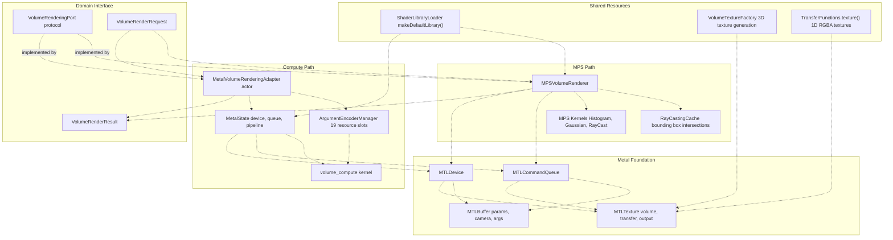
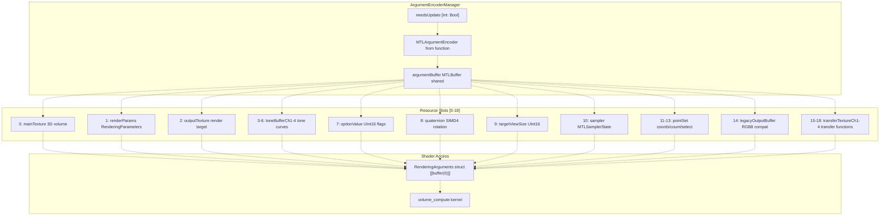
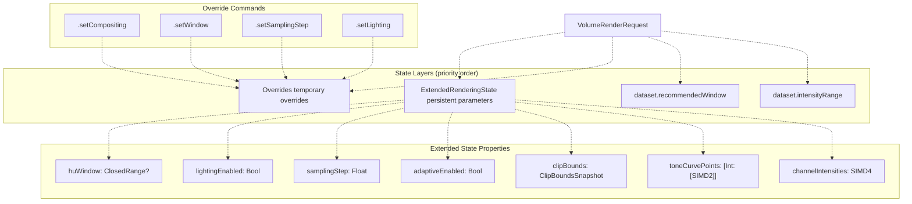
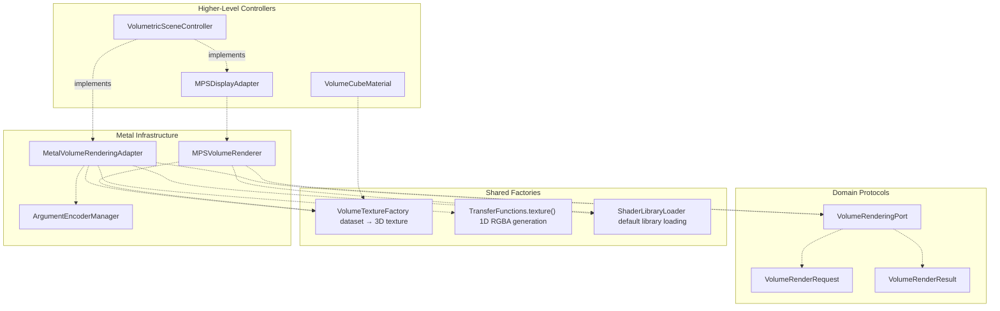

# Metal Rendering Infrastructure

> **Relevant source files**
> * [Sources/MTKCore/Adapters/MetalVolumeRenderingAdapter.swift](https://github.com/ThalesMMS/MTK/blob/eda6f990/Sources/MTKCore/Adapters/MetalVolumeRenderingAdapter.swift)
> * [Sources/MTKCore/Rendering/ArgumentEncoderManager.swift](https://github.com/ThalesMMS/MTK/blob/eda6f990/Sources/MTKCore/Rendering/ArgumentEncoderManager.swift)

## Purpose and Scope

This document provides an overview of MTK's low-level Metal rendering infrastructure, which implements GPU-accelerated volumetric visualization. The infrastructure consists of three primary components:

* **MetalVolumeRenderingAdapter** - Implements the `VolumeRenderingPort` protocol, providing compute-shader-based volume rendering with CPU fallback
* **ArgumentEncoderManager** - Manages Metal argument buffer encoding, resource binding, and dirty-state tracking across 19 shader resource slots
* **MPSVolumeRenderer** - Provides Metal Performance Shaders-accelerated rendering with histogram analysis and optimized ray casting

For detailed implementation of the adapter, see [MetalVolumeRenderingAdapter](7a%20MetalVolumeRenderingAdapter.md). For argument buffer mechanics, see [ArgumentEncoderManager](7b%20ArgumentEncoderManager.md). For MPS-specific rendering, see [MPSVolumeRenderer](7c%20MPSVolumeRenderer.md). For the rendering backend abstraction, see [VolumeRenderingPort](8a%20VolumeRenderingPort.md). For higher-level orchestration, see [Rendering Architecture](2%20Rendering-Architecture.md).

---

## System Architecture

The Metal rendering infrastructure provides two distinct GPU acceleration paths, both implementing the `VolumeRenderingPort` protocol abstraction. The system isolates Metal state management, resource caching, and command encoding from the higher-level rendering backend controllers.

**Architecture Diagram: Metal Infrastructure Components**



**Sources:** [Sources/MTKCore/Adapters/MetalVolumeRenderingAdapter.swift L41-L122](https://github.com/ThalesMMS/MTK/blob/eda6f990/Sources/MTKCore/Adapters/MetalVolumeRenderingAdapter.swift#L41-L122)

 [Sources/MTKCore/Rendering/ArgumentEncoderManager.swift L15-L136](https://github.com/ThalesMMS/MTK/blob/eda6f990/Sources/MTKCore/Rendering/ArgumentEncoderManager.swift#L15-L136)

---

## Component Overview

The Metal rendering infrastructure is organized into three specialized components, each addressing a distinct aspect of GPU-accelerated volume visualization.

### MetalVolumeRenderingAdapter

An actor-isolated implementation of `VolumeRenderingPort` providing compute-shader-based ray casting with automatic CPU fallback.

| Responsibility | Implementation |
| --- | --- |
| Protocol conformance | Implements `VolumeRenderingPort` for framework-agnostic rendering |
| State management | Maintains `ExtendedRenderingState`, `Overrides`, `RenderSnapshot` |
| Resource caching | Caches dataset textures via `DatasetIdentity`, transfer functions via `TransferCache` |
| Pipeline initialization | Lazy-loads `MetalState` with device, queue, pipeline, argument manager |
| Fallback rendering | Provides CPU-based slice rendering when GPU unavailable |

**Key entry points:** `renderImage(using:)`, `send(_:)`, `updatePreset(_:for:)`, `refreshHistogram(for:descriptor:transferFunction:)`

See [MetalVolumeRenderingAdapter](7a%20MetalVolumeRenderingAdapter.md) for detailed implementation.

**Sources:** [Sources/MTKCore/Adapters/MetalVolumeRenderingAdapter.swift L41-L283](https://github.com/ThalesMMS/MTK/blob/eda6f990/Sources/MTKCore/Adapters/MetalVolumeRenderingAdapter.swift#L41-L283)

### ArgumentEncoderManager

Manages the Metal argument buffer encoding 19 shader resource slots with automatic dirty-state tracking to minimize redundant GPU operations.

| Capability | Mechanism |
| --- | --- |
| Resource binding | Encodes textures, buffers, samplers into single `MTLBuffer` at shader index 0 |
| Dirty tracking | Compares buffer contents via `memcmp`, only re-encodes on change |
| Layout validation | Compile-time assertions verify enum matches shader struct indices |
| Output management | Creates/resizes output texture based on viewport dimensions |
| Cache invalidation | Manual `markAsNeedsUpdate(argumentIndex:)` for external cache invalidation |

**Resource slots:** 19 total (textures: 6, buffers: 12, sampler: 1)

See [ArgumentEncoderManager](7b%20ArgumentEncoderManager.md) for resource encoding mechanics.

**Sources:** [Sources/MTKCore/Rendering/ArgumentEncoderManager.swift L15-L136](https://github.com/ThalesMMS/MTK/blob/eda6f990/Sources/MTKCore/Rendering/ArgumentEncoderManager.swift#L15-L136)

### MPSVolumeRenderer

Provides Metal Performance Shaders-based volume rendering with GPU-accelerated histogram computation and optimized bounding-box ray casting.

| Feature | MPS Kernel |
| --- | --- |
| Histogram analysis | `MPSImageHistogram` for intensity distribution |
| Blur/filtering | `MPSImageGaussianBlur` for noise reduction |
| Ray casting | Custom MPS ray-casting kernel with bounding-box optimization |
| Dynamic adjustments | Histogram-driven brightness/contrast adaptation |

**Integration:** Used by `VolumetricSceneController+MPS` extension via `MPSDisplayAdapter` nested class.

See [MPSVolumeRenderer](7c%20MPSVolumeRenderer.md) for MPS-specific rendering details.

**Sources:** Referenced in system diagrams (implementation details in page 7.3)

---

## Rendering Pipelines

The infrastructure supports two distinct GPU rendering paths, each optimized for different use cases and device capabilities.

**Rendering Path Comparison**

```mermaid
flowchart TD

FallbackReq["Metal unavailable"]
FallbackCPU["makeFallbackImage() Task.detached"]
FallbackSlice["middle slice render windowing + clipping"]
FallbackCG["CGImage grayscale"]
MPSReq["VolumeRenderRequest"]
MPSRenderer["MPSVolumeRenderer"]
MPSHist["MPSImageHistogram intensity distribution"]
MPSBlur["MPSImageGaussianBlur optional filtering"]
MPSRay["MPS ray casting bounding box optimized"]
MPSOutput["MTLTexture + adjustments"]
CompReq["VolumeRenderRequest"]
CompAdapter["MetalVolumeRenderingAdapter"]
CompResolve["resolveMetalState()"]
CompState["MetalState device, queue, pipeline"]
CompEncode["encode resources ArgumentEncoderManager"]
CompDispatch["dispatchCompute() 16x16 threadgroups"]
CompKernel["volume_compute kernel ray marching"]
CompOutput["MTLTexture BGRA8 + CGImage"]

subgraph subGraph2 ["Fallback Path"]
    FallbackReq
    FallbackCPU
    FallbackSlice
    FallbackCG
    FallbackReq -.-> FallbackCPU
    FallbackCPU -.-> FallbackSlice
    FallbackSlice -.-> FallbackCG
end

subgraph subGraph1 ["MPS Path"]
    MPSReq
    MPSRenderer
    MPSHist
    MPSBlur
    MPSRay
    MPSOutput
    MPSReq -.-> MPSRenderer
    MPSRenderer -.-> MPSHist
    MPSHist -.-> MPSBlur
    MPSBlur -.-> MPSRay
    MPSRay -.-> MPSOutput
end

subgraph subGraph0 ["Compute Shader Path"]
    CompReq
    CompAdapter
    CompResolve
    CompState
    CompEncode
    CompDispatch
    CompKernel
    CompOutput
    CompReq -.-> CompAdapter
    CompAdapter -.-> CompResolve
    CompResolve -.-> CompState
    CompState -.-> CompEncode
    CompEncode -.-> CompDispatch
    CompDispatch -.-> CompKernel
    CompKernel -.-> CompOutput
end
```



### Compute Shader Pipeline

The compute shader path uses a custom `volume_compute` kernel with full control over ray marching, sampling, and compositing. Resources are bound via a single argument buffer at shader index 0, with camera uniforms at index 1.

**Characteristics:**

* Full flexibility: supports all compositing modes (DVR, MIP, MinIP, Average)
* Custom shader logic: implements adaptive sampling, jitter, early termination
* Separate camera buffer: allows camera updates without invalidating argument buffer
* 16×16 threadgroup dispatch: optimized for typical GPU architectures

**Sources:** [Sources/MTKCore/Adapters/MetalVolumeRenderingAdapter.swift L366-L419](https://github.com/ThalesMMS/MTK/blob/eda6f990/Sources/MTKCore/Adapters/MetalVolumeRenderingAdapter.swift#L366-L419)

 [Sources/MTKCore/Adapters/MetalVolumeRenderingAdapter.swift L627-L660](https://github.com/ThalesMMS/MTK/blob/eda6f990/Sources/MTKCore/Adapters/MetalVolumeRenderingAdapter.swift#L627-L660)

### MPS Accelerated Pipeline

The MPS path leverages Metal Performance Shaders for histogram analysis and optimized kernel execution. It provides histogram-driven dynamic adjustments and bounding-box ray intersection tests.

**Characteristics:**

* Hardware acceleration: MPS kernels optimized by Apple for specific GPUs
* Histogram analysis: real-time intensity distribution for adaptive contrast
* Bounding box optimization: early ray termination outside volume bounds
* Gaussian filtering: optional blur for noise reduction

**Sources:** Referenced in system diagrams (detailed in page 7.3)

### CPU Fallback Pipeline

When Metal is unavailable or rendering fails, the adapter falls back to CPU-based slice extraction. This ensures the application remains functional even on unsupported hardware.

**Fallback behavior:**

* Renders middle axial slice `(depth / 2)`
* Applies HU windowing, clipping, density gating
* Outputs 8-bit grayscale `CGImage`
* Runs in detached task with `.userInitiated` priority

**Sources:** [Sources/MTKCore/Adapters/MetalVolumeRenderingAdapter.swift L754-L830](https://github.com/ThalesMMS/MTK/blob/eda6f990/Sources/MTKCore/Adapters/MetalVolumeRenderingAdapter.swift#L754-L830)

---

## Argument Buffer System

The argument buffer system centralizes resource binding for compute shaders, encoding 19 distinct resources into a single `MTLBuffer` that the shader accesses at index 0.

**Argument Buffer Resource Layout**



### Resource Encoding

The `ArgumentEncoderManager` provides typed encoding methods with automatic dirty tracking:

| Method | Resource Type | Dirty Check |
| --- | --- | --- |
| `encodeTexture(_:argumentIndex:)` | `MTLTexture` | Flag-based |
| `encode(_:argumentIndex:capacity:)` | Generic buffer | `memcmp` content comparison |
| `encodeArray(_:argumentIndex:capacity:)` | `[SIMD3<Float>]` | Flag-based |
| `encode(_:argumentIndex:)` | `MTLBuffer` reference | Flag-based |
| `encodeSampler(filter:)` | `MTLSamplerState` | Filter comparison |
| `encodeOutputTexture(width:height:)` | Output texture | Dimension comparison |

**Dirty tracking optimization:** The manager uses `memcmp` to compare buffer contents before re-encoding, avoiding redundant GPU transfers when values haven't changed [Sources/MTKCore/Rendering/ArgumentEncoderManager.swift L200-L222](https://github.com/ThalesMMS/MTK/blob/eda6f990/Sources/MTKCore/Rendering/ArgumentEncoderManager.swift#L200-L222)

**Layout validation:** Compile-time assertions verify the `ArgumentIndex` enum matches the shader's `RenderingArguments` struct layout [Sources/MTKCore/Rendering/ArgumentEncoderManager.swift L85-L106](https://github.com/ThalesMMS/MTK/blob/eda6f990/Sources/MTKCore/Rendering/ArgumentEncoderManager.swift#L85-L106)

**Sources:** [Sources/MTKCore/Rendering/ArgumentEncoderManager.swift L40-L355](https://github.com/ThalesMMS/MTK/blob/eda6f990/Sources/MTKCore/Rendering/ArgumentEncoderManager.swift#L40-L355)

---

## Resource Management

The infrastructure implements multi-level caching to minimize redundant GPU resource allocation and data transfer. The caching strategy spans texture generation, transfer function encoding, and argument buffer synchronization.

**Resource Caching Hierarchy**

```mermaid
flowchart TD

Resource["texture/buffer/sampler"]
Check3["needsUpdate flag?"]
Memcmp["memcmp content comparison"]
MarkClean["needsUpdate = false"]
Changed["content differs?"]
Encode["argumentEncoder setTexture/setBuffer"]
TransferFn["VolumeTransferFunction"]
Check2["cached?"]
Convert["convert to TransferFunction"]
CacheTF["store in transferCache"]
Gen1D["TransferFunctions.texture() 1D RGBA"]
Dataset["VolumeDataset"]
Identity["DatasetIdentity pointer + count hash"]
Check1["cached?"]
Gen3D["VolumeTextureFactory generate() 3D texture"]
Cache3D["store in volumeTexture"]

subgraph subGraph2 ["Level 3: Argument Cache"]
    Resource
    Check3
    Memcmp
    MarkClean
    Changed
    Encode
    Resource -.->|"true"| Check3
    Check3 -.->|"false"| Memcmp
    Check3 -.->|"yes"| MarkClean
    Memcmp -.->|"no"| Changed
    Changed -.-> Encode
    Changed -.-> MarkClean
    Encode -.-> MarkClean
end

subgraph subGraph1 ["Level 2: Transfer Cache"]
    TransferFn
    Check2
    Convert
    CacheTF
    Gen1D
    TransferFn -.->|"miss"| Check2
    Check2 -.->|"hit"| Convert
    Check2 -.-> CacheTF
    Convert -.-> Gen1D
    Gen1D -.-> CacheTF
end

subgraph subGraph0 ["Level 1: Dataset Cache"]
    Dataset
    Identity
    Check1
    Gen3D
    Cache3D
    Dataset -.->|"miss"| Identity
    Identity -.->|"hit"| Check1
    Check1 -.-> Gen3D
    Check1 -.-> Cache3D
    Gen3D -.-> Cache3D
end
```



### Cache Invalidation

Caches are invalidated through different mechanisms depending on the resource type:

| Resource | Invalidation Trigger | Cache Key |
| --- | --- | --- |
| Dataset texture | `DatasetIdentity` mismatch (pointer or count change) | Pointer address + byte count |
| Transfer function | `VolumeTransferFunction` inequality | Full struct equality comparison |
| Argument buffer slot | Manual `markAsNeedsUpdate()` or `memcmp` difference | Per-index dirty flag |
| Output texture | Viewport dimension change | Width × height |
| Sampler | Filter mode change | `MTLSamplerMinMagFilter` enum |

**Dataset identity:** The `DatasetIdentity` struct captures the dataset buffer's memory address and size, providing a lightweight cache key without expensive hashing [Sources/MTKCore/Adapters/MetalVolumeRenderingAdapter.swift L78-L89](https://github.com/ThalesMMS/MTK/blob/eda6f990/Sources/MTKCore/Adapters/MetalVolumeRenderingAdapter.swift#L78-L89)

**Transfer function equality:** The adapter compares the entire `VolumeTransferFunction` struct, regenerating the 1D texture only when control points change [Sources/MTKCore/Adapters/MetalVolumeRenderingAdapter.swift L448-L467](https://github.com/ThalesMMS/MTK/blob/eda6f990/Sources/MTKCore/Adapters/MetalVolumeRenderingAdapter.swift#L448-L467)

**Argument buffer dirty tracking:** Uses `memcmp` to detect actual content changes before re-encoding buffers [Sources/MTKCore/Rendering/ArgumentEncoderManager.swift L200-L222](https://github.com/ThalesMMS/MTK/blob/eda6f990/Sources/MTKCore/Rendering/ArgumentEncoderManager.swift#L200-L222)

**Sources:** [Sources/MTKCore/Adapters/MetalVolumeRenderingAdapter.swift L78-L89](https://github.com/ThalesMMS/MTK/blob/eda6f990/Sources/MTKCore/Adapters/MetalVolumeRenderingAdapter.swift#L78-L89)

 [Sources/MTKCore/Adapters/MetalVolumeRenderingAdapter.swift L427-L523](https://github.com/ThalesMMS/MTK/blob/eda6f990/Sources/MTKCore/Adapters/MetalVolumeRenderingAdapter.swift#L427-L523)

 [Sources/MTKCore/Rendering/ArgumentEncoderManager.swift L138-L306](https://github.com/ThalesMMS/MTK/blob/eda6f990/Sources/MTKCore/Rendering/ArgumentEncoderManager.swift#L138-L306)

---

## State and Command Management

The adapter maintains rendering state through a layered override system, allowing external controllers to configure rendering without modifying domain objects.

**State Resolution Hierarchy**



### Command Interface

The `send(_:)` method applies rendering commands that update the `Overrides` struct [Sources/MTKCore/Adapters/MetalVolumeRenderingAdapter.swift L256-L282](https://github.com/ThalesMMS/MTK/blob/eda6f990/Sources/MTKCore/Adapters/MetalVolumeRenderingAdapter.swift#L256-L282)

:

| Command | Override Property | Effect |
| --- | --- | --- |
| `.setCompositing(method)` | `overrides.compositing` | Changes DVR/MIP/MinIP/Average mode |
| `.setWindow(min, max)` | `overrides.window` | Adjusts HU window range |
| `.setSamplingStep(distance)` | `overrides.samplingDistance` | Modifies ray marching step size |
| `.setLighting(enabled)` | `overrides.lightingEnabled` | Toggles shading calculations |

### State Priority

Window resolution follows this priority chain [Sources/MTKCore/Adapters/MetalVolumeRenderingAdapter.swift L154-L161](https://github.com/ThalesMMS/MTK/blob/eda6f990/Sources/MTKCore/Adapters/MetalVolumeRenderingAdapter.swift#L154-L161)

:

1. `extendedState.huWindow` (highest - controller-set persistent state)
2. `overrides.window` (command-based override)
3. `dataset.recommendedWindow` (DICOM metadata)
4. `dataset.intensityRange` (fallback - full range)

This layering allows temporary overrides without permanently modifying the dataset or losing recommended DICOM windowing.

**Sources:** [Sources/MTKCore/Adapters/MetalVolumeRenderingAdapter.swift L22-L282](https://github.com/ThalesMMS/MTK/blob/eda6f990/Sources/MTKCore/Adapters/MetalVolumeRenderingAdapter.swift#L22-L282)

---

## Integration with Higher Layers

The Metal infrastructure integrates into the broader rendering architecture through well-defined protocol boundaries and resource factories.

**Integration Points**



### VolumeRenderingPort Protocol

Both `MetalVolumeRenderingAdapter` and `MPSVolumeRenderer` conform to the `VolumeRenderingPort` protocol, providing:

* `renderImage(using:)` - Synchronous/async rendering from `VolumeRenderRequest`
* `updatePreset(_:for:)` - Preset application and validation
* `refreshHistogram(for:descriptor:transferFunction:)` - Intensity distribution calculation
* `send(_:)` - Command-based state updates

This abstraction allows controllers to switch between rendering implementations without code changes.

**Sources:** [Sources/MTKCore/Adapters/MetalVolumeRenderingAdapter.swift L41-L42](https://github.com/ThalesMMS/MTK/blob/eda6f990/Sources/MTKCore/Adapters/MetalVolumeRenderingAdapter.swift#L41-L42)

### Resource Factory Integration

The infrastructure shares texture generation utilities across rendering paths:

| Factory | Input | Output | Used By |
| --- | --- | --- | --- |
| `VolumeTextureFactory` | `VolumeDataset` | 3D `MTLTexture` | Adapter, MPS, SceneKit materials |
| `TransferFunctions.texture()` | `TransferFunction` | 1D `MTLTexture` RGBA | Adapter, SceneKit materials |
| `ShaderLibraryLoader` | `MTLDevice` | `MTLLibrary` | Adapter, MPS, materials |

These factories abstract platform-specific texture creation, handling pixel format conversions and storage mode selection.

**Sources:** [Sources/MTKCore/Adapters/MetalVolumeRenderingAdapter.swift L435-L467](https://github.com/ThalesMMS/MTK/blob/eda6f990/Sources/MTKCore/Adapters/MetalVolumeRenderingAdapter.swift#L435-L467)

### Controller Access Patterns

`VolumetricSceneController` accesses the Metal infrastructure through two paths:

1. **Direct adapter usage:** Calls `renderImage(using:)` for off-screen rendering or texture export
2. **Extended state injection:** Sets `extendedState` properties (clipping, adaptive sampling, tone curves) before rendering

The `MPSDisplayAdapter` nested class wraps `MPSVolumeRenderer`, managing MPS-specific clear colors and histogram-driven adjustments.

**Sources:** Referenced in system diagrams (detailed in page 3)

---

## Diagnostic Logging

The adapter provides optional diagnostic logging via `enableDiagnosticLogging(_:)` [Sources/MTKCore/Adapters/MetalVolumeRenderingAdapter.swift L125-L132](https://github.com/ThalesMMS/MTK/blob/eda6f990/Sources/MTKCore/Adapters/MetalVolumeRenderingAdapter.swift#L125-L132)

 When enabled, it logs:

* Render requests with viewport size, compositing, quality
* Override applications and state changes
* Metal state creation with device name
* Compute pipeline failures with fallback notifications
* View/projection matrix decomposition

The `ArgumentEncoderManager` also respects the `debugOptions.isDebugMode` flag, printing argument encoding operations to stdout for resource tracking during development.

**Debug State Summary:**

The argument manager provides `debugStateSummary()` [Sources/MTKCore/Rendering/ArgumentEncoderManager.swift L387-L415](https://github.com/ThalesMMS/MTK/blob/eda6f990/Sources/MTKCore/Rendering/ArgumentEncoderManager.swift#L387-L415)

 returning a compact state string:

```
output=1024x768 | pixelBytes=3145728 | outputTexture=1024x768 | 
sampler=sampler.linear | dirty=none
```

This summary aids in debugging resource lifecycle issues and identifying stale argument bindings.

**Sources:** [Sources/MTKCore/Adapters/MetalVolumeRenderingAdapter.swift L125-L282](https://github.com/ThalesMMS/MTK/blob/eda6f990/Sources/MTKCore/Adapters/MetalVolumeRenderingAdapter.swift#L125-L282)

 [Sources/MTKCore/Rendering/ArgumentEncoderManager.swift L145-L415](https://github.com/ThalesMMS/MTK/blob/eda6f990/Sources/MTKCore/Rendering/ArgumentEncoderManager.swift#L145-L415)


### On this page

* [Metal Rendering Infrastructure](7%20Metal-Rendering-Infrastructure.md)
* [Purpose and Scope](7%20Metal-Rendering-Infrastructure.md)
* [System Architecture](7%20Metal-Rendering-Infrastructure.md)
* [Component Overview](7%20Metal-Rendering-Infrastructure.md)
* [MetalVolumeRenderingAdapter](7%20Metal-Rendering-Infrastructure.md)
* [ArgumentEncoderManager](7%20Metal-Rendering-Infrastructure.md)
* [MPSVolumeRenderer](7%20Metal-Rendering-Infrastructure.md)
* [Rendering Pipelines](7%20Metal-Rendering-Infrastructure.md)
* [Compute Shader Pipeline](7%20Metal-Rendering-Infrastructure.md)
* [MPS Accelerated Pipeline](7%20Metal-Rendering-Infrastructure.md)
* [CPU Fallback Pipeline](7%20Metal-Rendering-Infrastructure.md)
* [Argument Buffer System](7%20Metal-Rendering-Infrastructure.md)
* [Resource Encoding](7%20Metal-Rendering-Infrastructure.md)
* [Resource Management](7%20Metal-Rendering-Infrastructure.md)
* [Cache Invalidation](7%20Metal-Rendering-Infrastructure.md)
* [State and Command Management](7%20Metal-Rendering-Infrastructure.md)
* [Command Interface](7%20Metal-Rendering-Infrastructure.md)
* [State Priority](7%20Metal-Rendering-Infrastructure.md)
* [Integration with Higher Layers](7%20Metal-Rendering-Infrastructure.md)
* [VolumeRenderingPort Protocol](7%20Metal-Rendering-Infrastructure.md)
* [Resource Factory Integration](7%20Metal-Rendering-Infrastructure.md)
* [Controller Access Patterns](7%20Metal-Rendering-Infrastructure.md)
* [Diagnostic Logging](7%20Metal-Rendering-Infrastructure.md)

Ask Devin about MTK