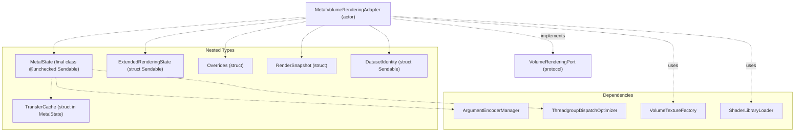
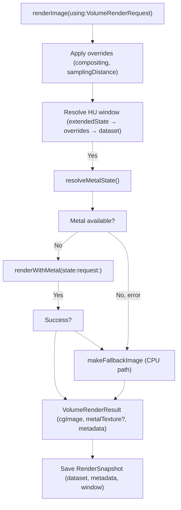
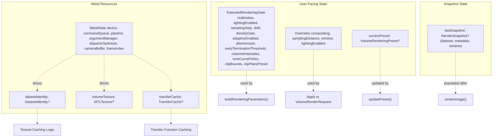
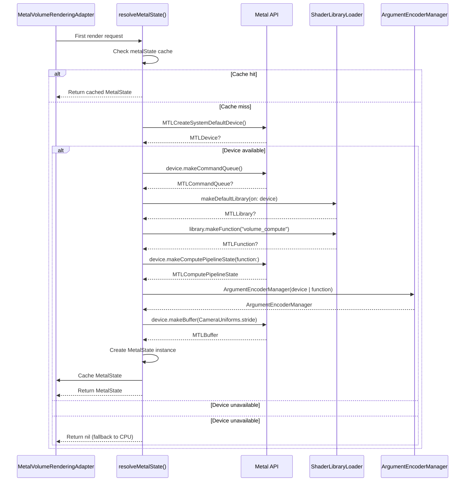
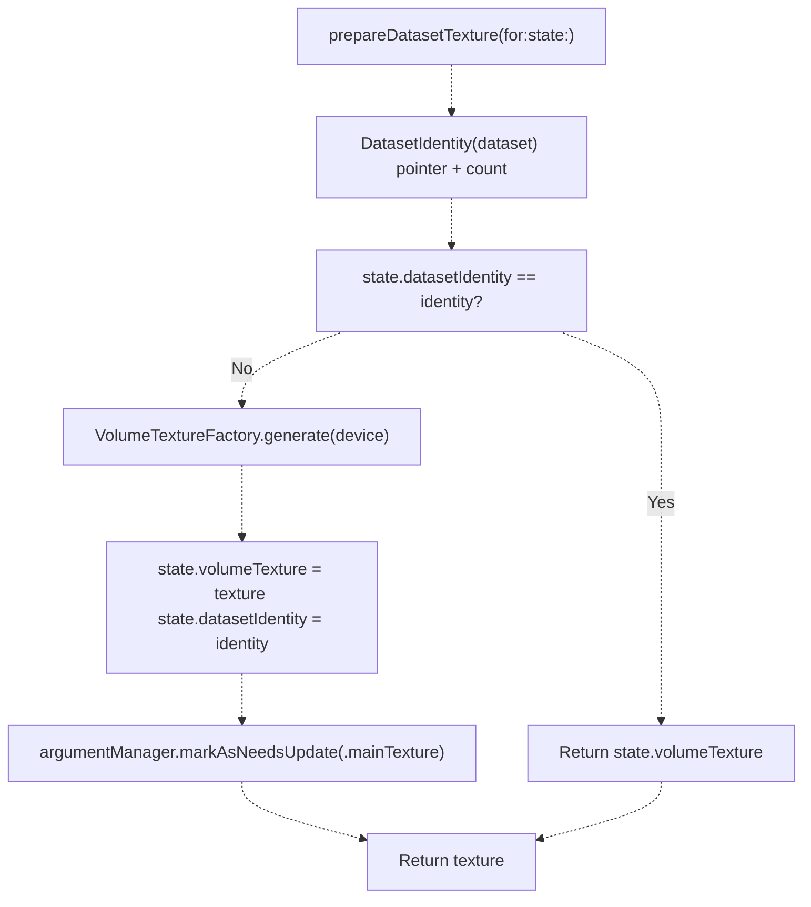
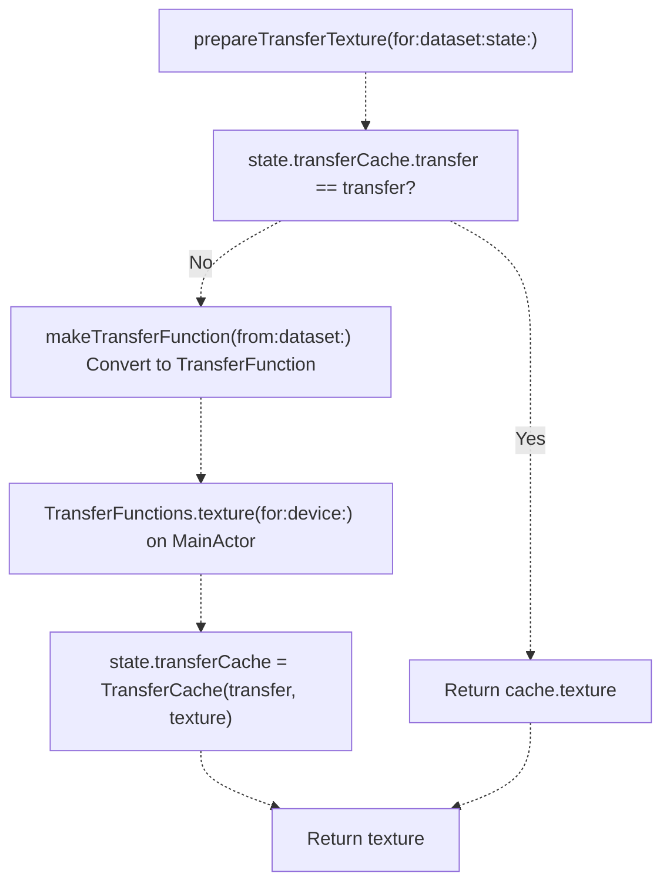
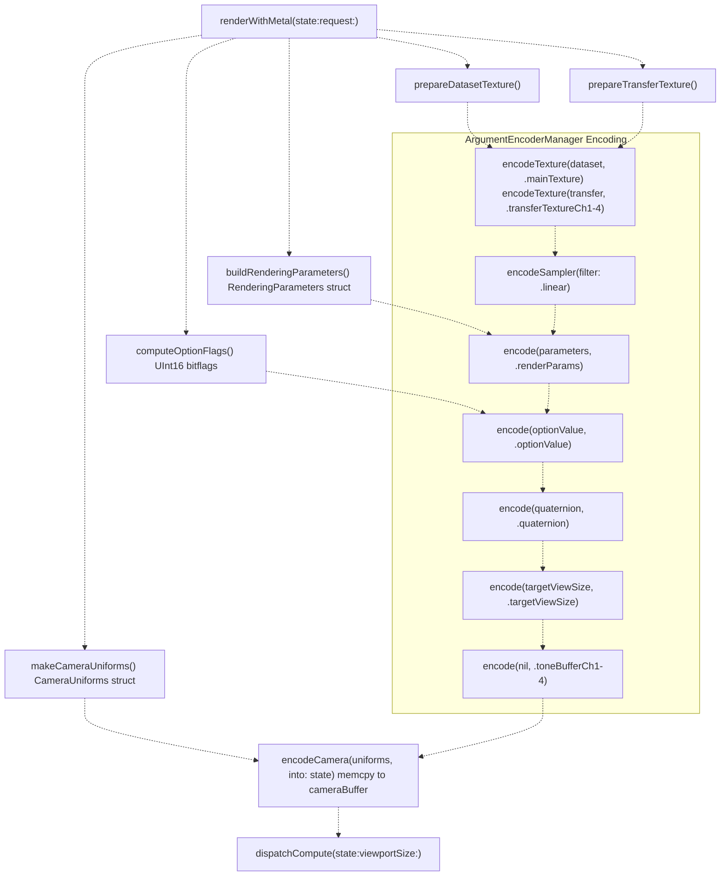
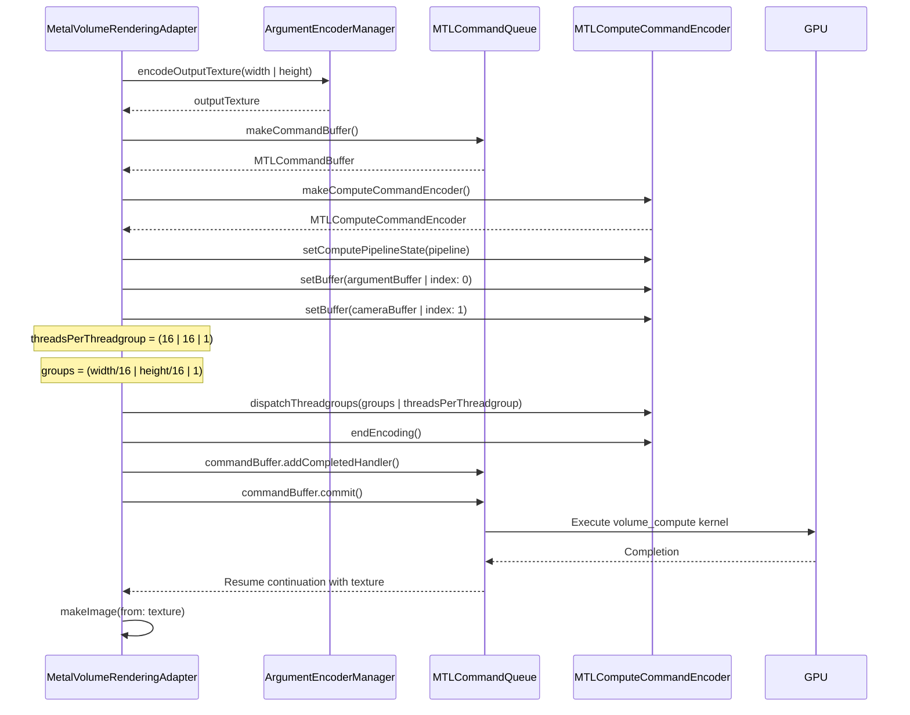

# MetalVolumeRenderingAdapter

> **Relevant source files**
> * [Sources/MTKCore/Adapters/MetalVolumeRenderingAdapter.swift](https://github.com/ThalesMMS/MTK/blob/eda6f990/Sources/MTKCore/Adapters/MetalVolumeRenderingAdapter.swift)

## Purpose and Scope

The `MetalVolumeRenderingAdapter` is the primary implementation of the `VolumeRenderingPort` protocol (see [VolumeRenderingPort](8a%20VolumeRenderingPort.md)) that provides GPU-accelerated volume rendering via Metal compute shaders. This actor-based class manages the complete Metal rendering pipeline, including device initialization, texture caching, compute shader dispatch, and CPU fallback rendering when GPU resources are unavailable.

The adapter serves as the bridge between high-level rendering requests and low-level Metal API calls. It coordinates with the `ArgumentEncoderManager` (see [ArgumentEncoderManager](7b%20ArgumentEncoderManager.md)) for buffer management and the `VolumeTextureFactory` (see [VolumeTextureFactory](5b%20DICOM-Loading.md)) for texture generation. For shader compilation and loading details, see [Shader System](7c%20MPSVolumeRenderer.md).

**Sources:** [Sources/MTKCore/Adapters/MetalVolumeRenderingAdapter.swift L1-L123](https://github.com/ThalesMMS/MTK/blob/eda6f990/Sources/MTKCore/Adapters/MetalVolumeRenderingAdapter.swift#L1-L123)

---

## Architecture Overview

The adapter follows a **lazy initialization pattern** for Metal resources and maintains separation between Metal-specific state and domain logic. As an `actor`, it guarantees thread-safe access to all rendering state.

### Type Hierarchy



**Sources:** [Sources/MTKCore/Adapters/MetalVolumeRenderingAdapter.swift L41-L121](https://github.com/ThalesMMS/MTK/blob/eda6f990/Sources/MTKCore/Adapters/MetalVolumeRenderingAdapter.swift#L41-L121)

### Key Components

| Component | Type | Purpose |
| --- | --- | --- |
| `MetalVolumeRenderingAdapter` | Actor | Main rendering coordinator, implements protocol |
| `MetalState` | Final class | Encapsulates all Metal resources (device, queue, pipeline, buffers) |
| `ExtendedRenderingState` | Struct | Domain state for rendering parameters (HU window, lighting, sampling, clipping) |
| `Overrides` | Struct | User-configurable overrides for compositing, sampling, windowing |
| `DatasetIdentity` | Struct | Pointer-based identity tracking for dataset texture caching |
| `TransferCache` | Struct | Caches transfer function and its corresponding Metal texture |

**Sources:** [Sources/MTKCore/Adapters/MetalVolumeRenderingAdapter.swift L22-L121](https://github.com/ThalesMMS/MTK/blob/eda6f990/Sources/MTKCore/Adapters/MetalVolumeRenderingAdapter.swift#L22-L121)

---

## Rendering Pathways

The adapter implements a **dual-path rendering strategy**: Metal compute shader path with automatic CPU fallback when GPU resources are unavailable.

### Rendering Decision Flow



**Sources:** [Sources/MTKCore/Adapters/MetalVolumeRenderingAdapter.swift L134-L199](https://github.com/ThalesMMS/MTK/blob/eda6f990/Sources/MTKCore/Adapters/MetalVolumeRenderingAdapter.swift#L134-L199)

### Metal Rendering Path

The Metal path performs GPU-accelerated ray casting via a compute shader named `volume_compute`. The process involves:

1. **Lazy Metal initialization** via `resolveMetalState()` [Sources/MTKCore/Adapters/MetalVolumeRenderingAdapter.swift L301-L364](https://github.com/ThalesMMS/MTK/blob/eda6f990/Sources/MTKCore/Adapters/MetalVolumeRenderingAdapter.swift#L301-L364)
2. **Texture preparation** for dataset and transfer function [Sources/MTKCore/Adapters/MetalVolumeRenderingAdapter.swift L427-L467](https://github.com/ThalesMMS/MTK/blob/eda6f990/Sources/MTKCore/Adapters/MetalVolumeRenderingAdapter.swift#L427-L467)
3. **Parameter encoding** into argument buffers [Sources/MTKCore/Adapters/MetalVolumeRenderingAdapter.swift L378-L401](https://github.com/ThalesMMS/MTK/blob/eda6f990/Sources/MTKCore/Adapters/MetalVolumeRenderingAdapter.swift#L378-L401)
4. **Compute dispatch** with threadgroup optimization [Sources/MTKCore/Adapters/MetalVolumeRenderingAdapter.swift L627-L660](https://github.com/ThalesMMS/MTK/blob/eda6f990/Sources/MTKCore/Adapters/MetalVolumeRenderingAdapter.swift#L627-L660)
5. **Image extraction** from output texture [Sources/MTKCore/Adapters/MetalVolumeRenderingAdapter.swift L676-L711](https://github.com/ThalesMMS/MTK/blob/eda6f990/Sources/MTKCore/Adapters/MetalVolumeRenderingAdapter.swift#L676-L711)

### CPU Fallback Path

When Metal is unavailable or encounters errors, the adapter falls back to a CPU-based renderer that generates a middle-slice grayscale image with basic windowing, clipping, and tone curve support. This ensures the system remains functional for testing and environments without GPU access.

**Sources:** [Sources/MTKCore/Adapters/MetalVolumeRenderingAdapter.swift L754-L830](https://github.com/ThalesMMS/MTK/blob/eda6f990/Sources/MTKCore/Adapters/MetalVolumeRenderingAdapter.swift#L754-L830)

---

## State Management

The adapter maintains multiple layers of state to support flexible rendering configuration and efficient caching.

### State Layer Architecture



**Sources:** [Sources/MTKCore/Adapters/MetalVolumeRenderingAdapter.swift L22-L76](https://github.com/ThalesMMS/MTK/blob/eda6f990/Sources/MTKCore/Adapters/MetalVolumeRenderingAdapter.swift#L22-L76)

### Extended Rendering State

The `ExtendedRenderingState` struct captures domain-level rendering parameters that are not part of the base `VolumeRenderRequest`:

| Field | Type | Purpose |
| --- | --- | --- |
| `huWindow` | `ClosedRange<Int32>?` | HU windowing override |
| `lightingEnabled` | `Bool` | Controls lighting calculations |
| `samplingStep` | `Float` | Ray marching step size |
| `shift` | `Float` | Intensity value shift |
| `densityGate` | `ClosedRange<Float>?` | Density-based voxel filtering |
| `adaptiveEnabled` | `Bool` | Adaptive sampling flag |
| `adaptiveThreshold` | `Float` | Gradient threshold for adaptive sampling |
| `jitterAmount` | `Float` | Ray jittering for anti-aliasing |
| `earlyTerminationThreshold` | `Float` | Opacity threshold for early ray termination |
| `channelIntensities` | `SIMD4<Float>` | Per-channel intensity scaling |
| `toneCurvePoints` | `[Int: [SIMD2<Float>]]` | Multi-channel tone curves |
| `toneCurveGains` | `[Int: Float]` | Per-channel gain multipliers |
| `clipBounds` | `ClipBoundsSnapshot` | Axis-aligned bounding box for clipping |
| `clipPlanePreset` | `Int` | Clip plane preset (0=none, 1=axial, 2=sagittal, 3=coronal) |
| `clipPlaneOffset` | `Float` | Clip plane offset distance |

**Sources:** [Sources/MTKCore/Adapters/MetalVolumeRenderingAdapter.swift L22-L39](https://github.com/ThalesMMS/MTK/blob/eda6f990/Sources/MTKCore/Adapters/MetalVolumeRenderingAdapter.swift#L22-L39)

### Command Processing

The adapter implements the `send(_: VolumeRenderingCommand)` method to update state based on domain commands:

* `.setCompositing`: Updates `overrides.compositing`
* `.setWindow`: Updates `overrides.window`
* `.setSamplingStep`: Updates `overrides.samplingDistance`
* `.setLighting`: Updates `overrides.lightingEnabled`

**Sources:** [Sources/MTKCore/Adapters/MetalVolumeRenderingAdapter.swift L256-L282](https://github.com/ThalesMMS/MTK/blob/eda6f990/Sources/MTKCore/Adapters/MetalVolumeRenderingAdapter.swift#L256-L282)

---

## Metal State Initialization

The adapter uses **lazy initialization** for Metal resources, deferring GPU setup until the first render request.

### Initialization Sequence



**Sources:** [Sources/MTKCore/Adapters/MetalVolumeRenderingAdapter.swift L301-L364](https://github.com/ThalesMMS/MTK/blob/eda6f990/Sources/MTKCore/Adapters/MetalVolumeRenderingAdapter.swift#L301-L364)

### MetalState Class

The `MetalState` final class encapsulates all Metal-specific resources. Marked as `@unchecked Sendable`, it assumes the actor provides sufficient isolation.

```
private final class MetalState: @unchecked Sendable {    let device: any MTLDevice    let commandQueue: any MTLCommandQueue    let pipeline: any MTLComputePipelineState    let argumentManager: ArgumentEncoderManager    let dispatchOptimizer: ThreadgroupDispatchOptimizer    let cameraBuffer: any MTLBuffer    var datasetIdentity: DatasetIdentity?    var volumeTexture: (any MTLTexture)?    var transferCache: TransferCache?    var frameIndex: UInt32 = 0}
```

**Sources:** [Sources/MTKCore/Adapters/MetalVolumeRenderingAdapter.swift L91-L121](https://github.com/ThalesMMS/MTK/blob/eda6f990/Sources/MTKCore/Adapters/MetalVolumeRenderingAdapter.swift#L91-L121)

---

## Texture Caching

The adapter implements intelligent caching for both dataset textures and transfer function textures to avoid redundant GPU uploads.

### Dataset Texture Caching



**Sources:** [Sources/MTKCore/Adapters/MetalVolumeRenderingAdapter.swift L427-L444](https://github.com/ThalesMMS/MTK/blob/eda6f990/Sources/MTKCore/Adapters/MetalVolumeRenderingAdapter.swift#L427-L444)

### DatasetIdentity

The `DatasetIdentity` struct provides pointer-based equality checking for dataset caching:

```
private struct DatasetIdentity: Equatable, Sendable {    let pointer: UInt    let count: Int        init(dataset: VolumeDataset) {        self.count = dataset.data.count        self.pointer = dataset.data.withUnsafeBytes { buffer in            guard let baseAddress = buffer.baseAddress else { return 0 }            return UInt(bitPattern: baseAddress)        }    }}
```

This approach avoids expensive data comparisons while detecting when a dataset's underlying buffer has changed.

**Sources:** [Sources/MTKCore/Adapters/MetalVolumeRenderingAdapter.swift L78-L89](https://github.com/ThalesMMS/MTK/blob/eda6f990/Sources/MTKCore/Adapters/MetalVolumeRenderingAdapter.swift#L78-L89)

### Transfer Function Caching

Transfer function textures are cached using value equality:



The `TransferCache` struct stores both the domain `VolumeTransferFunction` and its GPU `MTLTexture`:

```
struct TransferCache {    var transfer: VolumeTransferFunction    var texture: any MTLTexture}
```

**Sources:** [Sources/MTKCore/Adapters/MetalVolumeRenderingAdapter.swift L446-L467](https://github.com/ThalesMMS/MTK/blob/eda6f990/Sources/MTKCore/Adapters/MetalVolumeRenderingAdapter.swift#L446-L467)

 [Sources/MTKCore/Adapters/MetalVolumeRenderingAdapter.swift L92-L95](https://github.com/ThalesMMS/MTK/blob/eda6f990/Sources/MTKCore/Adapters/MetalVolumeRenderingAdapter.swift#L92-L95)

---

## Compute Pipeline Execution

The Metal rendering path dispatches a compute shader to perform GPU ray casting.

### Render Parameter Encoding

Before dispatch, the adapter encodes multiple parameter categories into the argument buffer:



**Sources:** [Sources/MTKCore/Adapters/MetalVolumeRenderingAdapter.swift L366-L419](https://github.com/ThalesMMS/MTK/blob/eda6f990/Sources/MTKCore/Adapters/MetalVolumeRenderingAdapter.swift#L366-L419)

### Parameter Structures

The adapter constructs two main uniform structures:

**RenderingParameters** (encapsulates VolumeUniforms and render settings):

```
var params = RenderingParameters()params.material = buildVolumeUniforms(for: request)  // VolumeUniformsparams.renderingStep = request.samplingDistanceparams.earlyTerminationThreshold = extendedState.earlyTerminationThresholdparams.adaptiveGradientThreshold = extendedState.adaptiveThresholdparams.jitterAmount = extendedState.jitterAmountparams.intensityRatio = extendedState.channelIntensitiesparams.trimXMin/Max, trimYMin/Max, trimZMin/Max = clipBoundsparams.clipPlane0, clipPlane1, clipPlane2 = clipPlanes(preset, offset)params.backgroundColor = SIMD3<Float>(repeating: 0)
```

**Sources:** [Sources/MTKCore/Adapters/MetalVolumeRenderingAdapter.swift L524-L546](https://github.com/ThalesMMS/MTK/blob/eda6f990/Sources/MTKCore/Adapters/MetalVolumeRenderingAdapter.swift#L524-L546)

**VolumeUniforms** (dataset and windowing information):

```
uniforms.voxelMinValue = window.lowerBounduniforms.voxelMaxValue = window.upperBounduniforms.datasetMinValue = dataset.intensityRange.lowerBounduniforms.datasetMaxValue = dataset.intensityRange.upperBounduniforms.dimX, dimY, dimZ = dataset.dimensionsuniforms.renderingQuality = stepsuniforms.method = [1=frontToBack, 2=MIP, 3=MinIP, 4=average]uniforms.isLightingOn = lightingEnabled ? 1 : 0uniforms.densityFloor, densityCeil = densityGateuniforms.useHuGate, gateHuMin, gateHuMax = huGate
```

**Sources:** [Sources/MTKCore/Adapters/MetalVolumeRenderingAdapter.swift L548-L597](https://github.com/ThalesMMS/MTK/blob/eda6f990/Sources/MTKCore/Adapters/MetalVolumeRenderingAdapter.swift#L548-L597)

**CameraUniforms**:

```
camera.modelMatrix = matrix_identity_float4x4camera.inverseModelMatrix = matrix_identity_float4x4camera.inverseViewProjectionMatrix = makeInverseViewProjectionMatrix()camera.cameraPositionLocal = request.camera.positioncamera.frameIndex = state.frameIndex
```

**Sources:** [Sources/MTKCore/Adapters/MetalVolumeRenderingAdapter.swift L713-L724](https://github.com/ThalesMMS/MTK/blob/eda6f990/Sources/MTKCore/Adapters/MetalVolumeRenderingAdapter.swift#L713-L724)

### Dispatch and Execution



**Sources:** [Sources/MTKCore/Adapters/MetalVolumeRenderingAdapter.swift L627-L674](https://github.com/ThalesMMS/MTK/blob/eda6f990/Sources/MTKCore/Adapters/MetalVolumeRenderingAdapter.swift#L627-L674)

The dispatch uses a fixed threadgroup size of 16×16×1 and calculates the required number of threadgroups based on viewport dimensions. The compute shader writes directly to the `outputTexture` managed by `ArgumentEncoderManager`.

**Sources:** [Sources/MTKCore/Adapters/MetalVolumeRenderingAdapter.swift L652-L657](https://github.com/ThalesMMS/MTK/blob/eda6f990/Sources/MTKCore/Adapters/MetalVolumeRenderingAdapter.swift#L652-L657)

---

## Extended Rendering Features

### Clip Plane Presets

The adapter supports anatomical clip plane presets that define oblique clipping planes:

| Preset | Name | Clip Plane |
| --- | --- | --- |
| 0 | None | No clipping |
| 1 | Axial | `(0, 0, 1, offset)` - clips along Z axis |
| 2 | Sagittal | `(1, 0, 0, offset)` - clips along X axis |
| 3 | Coronal | `(0, 1, 0, offset)` - clips along Y axis |

The `clipPlaneOffset` shifts the plane along its normal direction, enabling dynamic slicing.

**Sources:** [Sources/MTKCore/Adapters/MetalVolumeRenderingAdapter.swift L599-L611](https://github.com/ThalesMMS/MTK/blob/eda6f990/Sources/MTKCore/Adapters/MetalVolumeRenderingAdapter.swift#L599-L611)

### Adaptive Sampling

When `extendedState.adaptiveEnabled` is true, the adapter sets a bit flag in the `optionValue` parameter:

```
private func computeOptionFlags() -> UInt16 {    var value: UInt16 = 0    if extendedState.adaptiveEnabled {        value |= (1 << 2)  // Bit 2 enables adaptive sampling    }    return value}
```

The shader reads this flag to conditionally enable gradient-based adaptive sampling, reducing sample count in homogeneous regions.

**Sources:** [Sources/MTKCore/Adapters/MetalVolumeRenderingAdapter.swift L613-L619](https://github.com/ThalesMMS/MTK/blob/eda6f990/Sources/MTKCore/Adapters/MetalVolumeRenderingAdapter.swift#L613-L619)

### Tone Curve Application

The CPU fallback path demonstrates tone curve logic that can be applied per-channel:

```
normalized = Self.applyToneCurve(normalized,                                 points: state.toneCurvePoints[0] ?? [],                                 gain: state.toneCurveGains[0] ?? 1)
```

The `applyToneCurve` function performs piecewise linear interpolation across sorted control points:

**Sources:** [Sources/MTKCore/Adapters/MetalVolumeRenderingAdapter.swift L797-L798](https://github.com/ThalesMMS/MTK/blob/eda6f990/Sources/MTKCore/Adapters/MetalVolumeRenderingAdapter.swift#L797-L798)

 [Sources/MTKCore/Adapters/MetalVolumeRenderingAdapter.swift L832-L848](https://github.com/ThalesMMS/MTK/blob/eda6f990/Sources/MTKCore/Adapters/MetalVolumeRenderingAdapter.swift#L832-L848)

### Clipping Bounds

The `ClipBoundsSnapshot` in `extendedState.clipBounds` defines an axis-aligned bounding box in normalized texture coordinates (0-1):

```
params.trimXMin = clip.xMinparams.trimXMax = clip.xMaxparams.trimYMin = clip.yMinparams.trimYMax = clip.yMaxparams.trimZMin = clip.zMinparams.trimZMax = clip.zMax
```

The shader skips samples outside these bounds during ray marching.

**Sources:** [Sources/MTKCore/Adapters/MetalVolumeRenderingAdapter.swift L533-L538](https://github.com/ThalesMMS/MTK/blob/eda6f990/Sources/MTKCore/Adapters/MetalVolumeRenderingAdapter.swift#L533-L538)

---

## Histogram Generation

The adapter implements `refreshHistogram` to compute intensity histograms on the CPU:

```

```

**Sources:** [Sources/MTKCore/Adapters/MetalVolumeRenderingAdapter.swift L210-L254](https://github.com/ThalesMMS/MTK/blob/eda6f990/Sources/MTKCore/Adapters/MetalVolumeRenderingAdapter.swift#L210-L254)

The histogram generation:

1. Runs in a detached task with `.userInitiated` priority for performance
2. Uses `VolumeDataReader` to iterate efficiently over voxels
3. Bins samples according to the intensity range specified in the descriptor
4. Optionally normalizes bin counts to sum to 1.0
5. Returns a `VolumeHistogram` containing the descriptor and computed bins

**Sources:** [Sources/MTKCore/Adapters/MetalVolumeRenderingAdapter.swift L217-L251](https://github.com/ThalesMMS/MTK/blob/eda6f990/Sources/MTKCore/Adapters/MetalVolumeRenderingAdapter.swift#L217-L251)

---

## CPU Fallback Rendering

When Metal is unavailable, the adapter generates a grayscale image of the middle axial slice:

```

```

**Sources:** [Sources/MTKCore/Adapters/MetalVolumeRenderingAdapter.swift L754-L830](https://github.com/ThalesMMS/MTK/blob/eda6f990/Sources/MTKCore/Adapters/MetalVolumeRenderingAdapter.swift#L754-L830)

The fallback renderer applies:

* **HU windowing** with shift adjustment [Sources/MTKCore/Adapters/MetalVolumeRenderingAdapter.swift L778-L795](https://github.com/ThalesMMS/MTK/blob/eda6f990/Sources/MTKCore/Adapters/MetalVolumeRenderingAdapter.swift#L778-L795)
* **Clip bounds** checking (skip pixels outside) [Sources/MTKCore/Adapters/MetalVolumeRenderingAdapter.swift L783-L786](https://github.com/ThalesMMS/MTK/blob/eda6f990/Sources/MTKCore/Adapters/MetalVolumeRenderingAdapter.swift#L783-L786)
* **Density gating** (skip pixels outside intensity range) [Sources/MTKCore/Adapters/MetalVolumeRenderingAdapter.swift L788-L792](https://github.com/ThalesMMS/MTK/blob/eda6f990/Sources/MTKCore/Adapters/MetalVolumeRenderingAdapter.swift#L788-L792)
* **Tone curves** with gain [Sources/MTKCore/Adapters/MetalVolumeRenderingAdapter.swift L797-L798](https://github.com/ThalesMMS/MTK/blob/eda6f990/Sources/MTKCore/Adapters/MetalVolumeRenderingAdapter.swift#L797-L798)
* **Channel intensity** scaling [Sources/MTKCore/Adapters/MetalVolumeRenderingAdapter.swift L800-L801](https://github.com/ThalesMMS/MTK/blob/eda6f990/Sources/MTKCore/Adapters/MetalVolumeRenderingAdapter.swift#L800-L801)
* **Lighting dimming** when disabled [Sources/MTKCore/Adapters/MetalVolumeRenderingAdapter.swift L803-L805](https://github.com/ThalesMMS/MTK/blob/eda6f990/Sources/MTKCore/Adapters/MetalVolumeRenderingAdapter.swift#L803-L805)

---

## Testing Interface

The adapter exposes internal state via the `@_spi(Testing)` attribute for unit testing:

```
extension MetalVolumeRenderingAdapter {    @_spi(Testing)    public var debugOverrides: Overrides { overrides }    @_spi(Testing)    public var debugLastSnapshot: RenderSnapshot? { lastSnapshot }    @_spi(Testing)    public var debugCurrentPreset: VolumeRenderingPreset? { currentPreset }}
```

This allows test code to inspect:

* **Applied overrides** for compositing, sampling, and windowing
* **Last render snapshot** containing the dataset, metadata, and resolved window
* **Current preset** that was last applied

**Sources:** [Sources/MTKCore/Adapters/MetalVolumeRenderingAdapter.swift L287-L296](https://github.com/ThalesMMS/MTK/blob/eda6f990/Sources/MTKCore/Adapters/MetalVolumeRenderingAdapter.swift#L287-L296)

---

## Diagnostic Logging

The adapter supports verbose logging controlled by `enableDiagnosticLogging(_:)`:

```
public func enableDiagnosticLogging(_ enabled: Bool)
```

When enabled, the adapter logs:

* Render request parameters (viewport, compositing, quality) [Sources/MTKCore/Adapters/MetalVolumeRenderingAdapter.swift L135-L137](https://github.com/ThalesMMS/MTK/blob/eda6f990/Sources/MTKCore/Adapters/MetalVolumeRenderingAdapter.swift#L135-L137)
* Applied overrides [Sources/MTKCore/Adapters/MetalVolumeRenderingAdapter.swift L143-L151](https://github.com/ThalesMMS/MTK/blob/eda6f990/Sources/MTKCore/Adapters/MetalVolumeRenderingAdapter.swift#L143-L151)
* Resolved HU window [Sources/MTKCore/Adapters/MetalVolumeRenderingAdapter.swift L159-L161](https://github.com/ThalesMMS/MTK/blob/eda6f990/Sources/MTKCore/Adapters/MetalVolumeRenderingAdapter.swift#L159-L161)
* Metal device initialization [Sources/MTKCore/Adapters/MetalVolumeRenderingAdapter.swift L356-L358](https://github.com/ThalesMMS/MTK/blob/eda6f990/Sources/MTKCore/Adapters/MetalVolumeRenderingAdapter.swift#L356-L358)
* Fallback to CPU rendering with error details [Sources/MTKCore/Adapters/MetalVolumeRenderingAdapter.swift L172-L178](https://github.com/ThalesMMS/MTK/blob/eda6f990/Sources/MTKCore/Adapters/MetalVolumeRenderingAdapter.swift#L172-L178)
* View/projection matrices [Sources/MTKCore/Adapters/MetalVolumeRenderingAdapter.swift L745-L749](https://github.com/ThalesMMS/MTK/blob/eda6f990/Sources/MTKCore/Adapters/MetalVolumeRenderingAdapter.swift#L745-L749)
* Command processing [Sources/MTKCore/Adapters/MetalVolumeRenderingAdapter.swift L258-L280](https://github.com/ThalesMMS/MTK/blob/eda6f990/Sources/MTKCore/Adapters/MetalVolumeRenderingAdapter.swift#L258-L280)

This diagnostic mode is crucial for debugging rendering issues and understanding state transitions.

**Sources:** [Sources/MTKCore/Adapters/MetalVolumeRenderingAdapter.swift L125-L132](https://github.com/ThalesMMS/MTK/blob/eda6f990/Sources/MTKCore/Adapters/MetalVolumeRenderingAdapter.swift#L125-L132)

---

## Integration Points

### VolumeRenderingPort Protocol

The adapter is the primary concrete implementation of `VolumeRenderingPort`. For protocol details, see [VolumeRenderingPort](8a%20VolumeRenderingPort.md).

**Implemented methods:**

* `renderImage(using: VolumeRenderRequest) async throws -> VolumeRenderResult`
* `updatePreset(_: VolumeRenderingPreset, for: VolumeDataset) async throws -> [VolumeRenderingPreset]`
* `refreshHistogram(for: VolumeDataset, descriptor: VolumeHistogramDescriptor, transferFunction: VolumeTransferFunction) async throws -> VolumeHistogram`
* `send(_: VolumeRenderingCommand) async throws`

**Sources:** [Sources/MTKCore/Adapters/MetalVolumeRenderingAdapter.swift L41](https://github.com/ThalesMMS/MTK/blob/eda6f990/Sources/MTKCore/Adapters/MetalVolumeRenderingAdapter.swift#L41-L41)

### ArgumentEncoderManager

The adapter uses `ArgumentEncoderManager` to encode all shader parameters into an argument buffer. See [ArgumentEncoderManager](7b%20ArgumentEncoderManager.md) for buffer management details.

**Sources:** [Sources/MTKCore/Adapters/MetalVolumeRenderingAdapter.swift L100](https://github.com/ThalesMMS/MTK/blob/eda6f990/Sources/MTKCore/Adapters/MetalVolumeRenderingAdapter.swift#L100-L100)

 [Sources/MTKCore/Adapters/MetalVolumeRenderingAdapter.swift L383-L397](https://github.com/ThalesMMS/MTK/blob/eda6f990/Sources/MTKCore/Adapters/MetalVolumeRenderingAdapter.swift#L383-L397)

### VolumeTextureFactory

Dataset-to-texture conversion is delegated to `VolumeTextureFactory`. See [VolumeTextureFactory](5b%20DICOM-Loading.md) for texture generation details.

**Sources:** [Sources/MTKCore/Adapters/MetalVolumeRenderingAdapter.swift L435-L436](https://github.com/ThalesMMS/MTK/blob/eda6f990/Sources/MTKCore/Adapters/MetalVolumeRenderingAdapter.swift#L435-L436)

### ShaderLibraryLoader

Shader compilation and loading is handled by `ShaderLibraryLoader`. See [Shader System](7c%20MPSVolumeRenderer.md) for shader loading details.

**Sources:** [Sources/MTKCore/Adapters/MetalVolumeRenderingAdapter.swift L311-L325](https://github.com/ThalesMMS/MTK/blob/eda6f990/Sources/MTKCore/Adapters/MetalVolumeRenderingAdapter.swift#L311-L325)


### On this page

* [MetalVolumeRenderingAdapter](#7.1-metalvolumerenderingadapter)
* [Purpose and Scope](#7.1-purpose-and-scope)
* [Architecture Overview](#7.1-architecture-overview)
* [Type Hierarchy](#7.1-type-hierarchy)
* [Key Components](#7.1-key-components)
* [Rendering Pathways](#7.1-rendering-pathways)
* [Rendering Decision Flow](#7.1-rendering-decision-flow)
* [Metal Rendering Path](#7.1-metal-rendering-path)
* [CPU Fallback Path](#7.1-cpu-fallback-path)
* [State Management](#7.1-state-management)
* [State Layer Architecture](#7.1-state-layer-architecture)
* [Extended Rendering State](#7.1-extended-rendering-state)
* [Command Processing](#7.1-command-processing)
* [Metal State Initialization](#7.1-metal-state-initialization)
* [Initialization Sequence](#7.1-initialization-sequence)
* [MetalState Class](#7.1-metalstate-class)
* [Texture Caching](#7.1-texture-caching)
* [Dataset Texture Caching](#7.1-dataset-texture-caching)
* [DatasetIdentity](#7.1-datasetidentity)
* [Transfer Function Caching](#7.1-transfer-function-caching)
* [Compute Pipeline Execution](#7.1-compute-pipeline-execution)
* [Render Parameter Encoding](#7.1-render-parameter-encoding)
* [Parameter Structures](#7.1-parameter-structures)
* [Dispatch and Execution](#7.1-dispatch-and-execution)
* [Extended Rendering Features](#7.1-extended-rendering-features)
* [Clip Plane Presets](#7.1-clip-plane-presets)
* [Adaptive Sampling](#7.1-adaptive-sampling)
* [Tone Curve Application](#7.1-tone-curve-application)
* [Clipping Bounds](#7.1-clipping-bounds)
* [Histogram Generation](#7.1-histogram-generation)
* [CPU Fallback Rendering](#7.1-cpu-fallback-rendering)
* [Testing Interface](#7.1-testing-interface)
* [Diagnostic Logging](#7.1-diagnostic-logging)
* [Integration Points](#7.1-integration-points)
* [VolumeRenderingPort Protocol](#7.1-volumerenderingport-protocol)
* [ArgumentEncoderManager](#7.1-argumentencodermanager)
* [VolumeTextureFactory](#7.1-volumetexturefactory)
* [ShaderLibraryLoader](#7.1-shaderlibraryloader)

Ask Devin about MTK