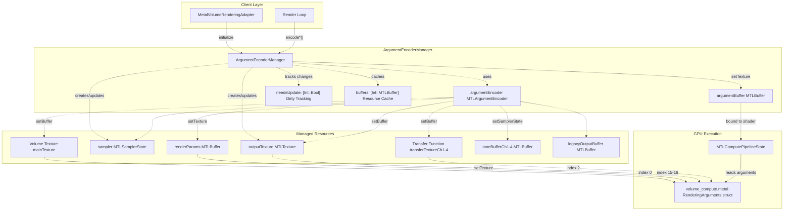
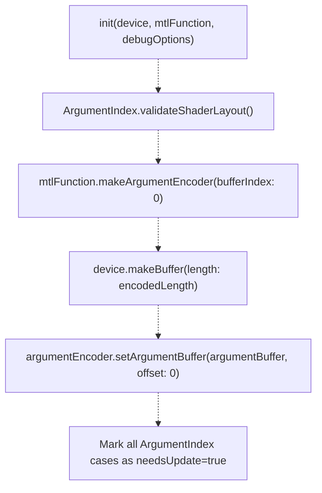
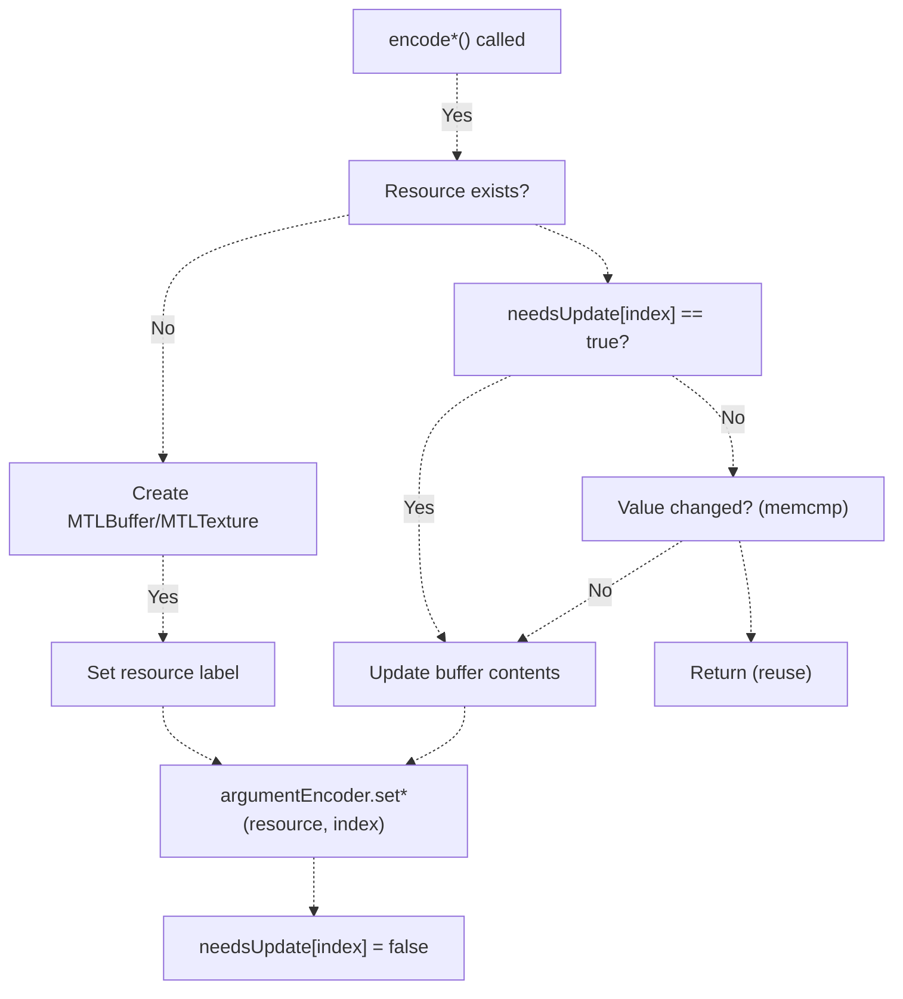
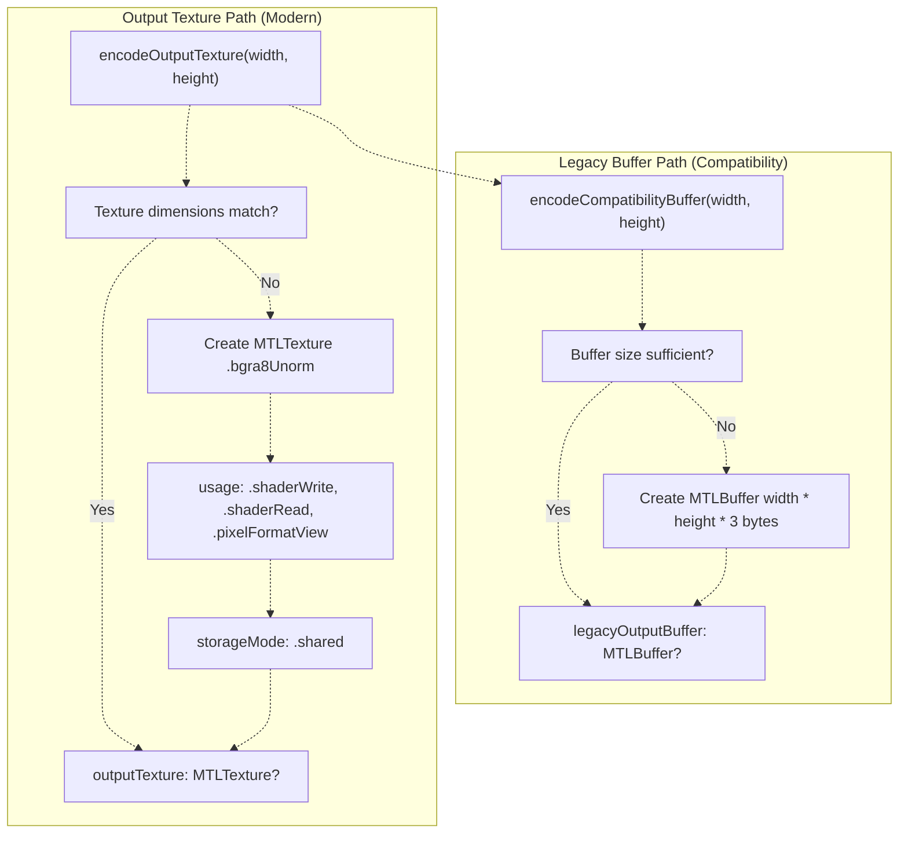
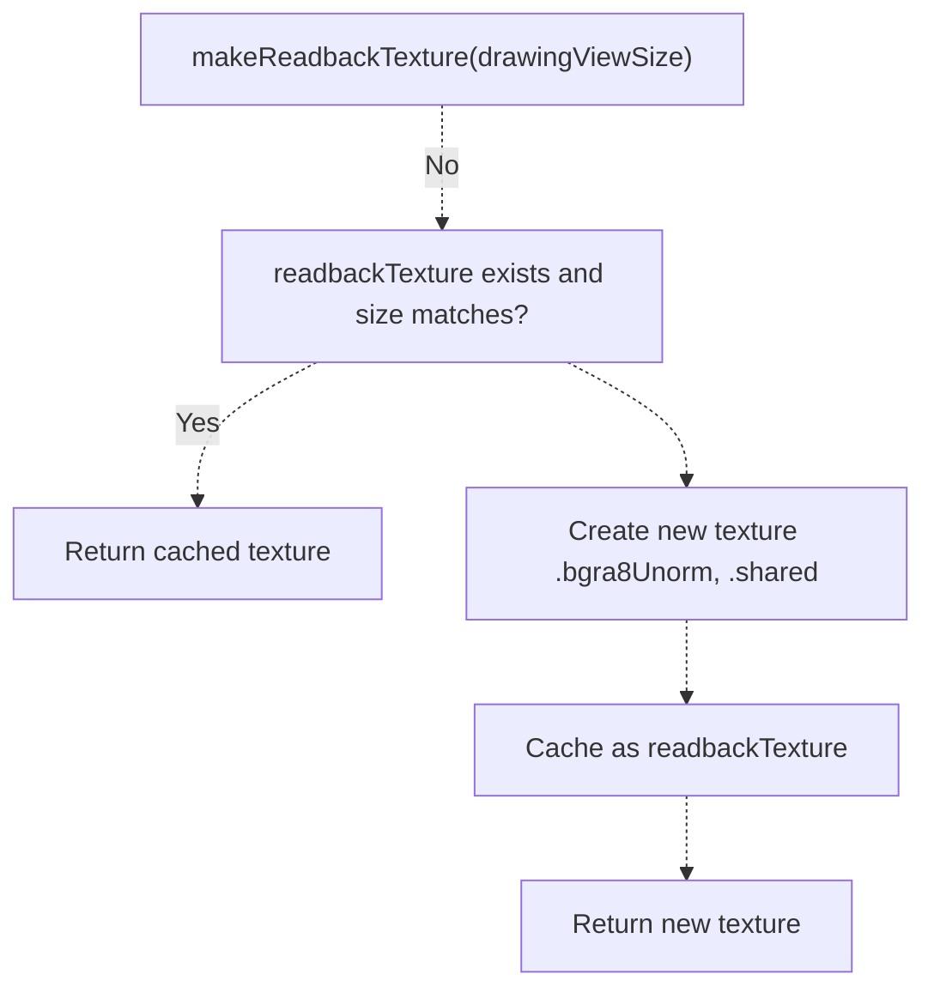
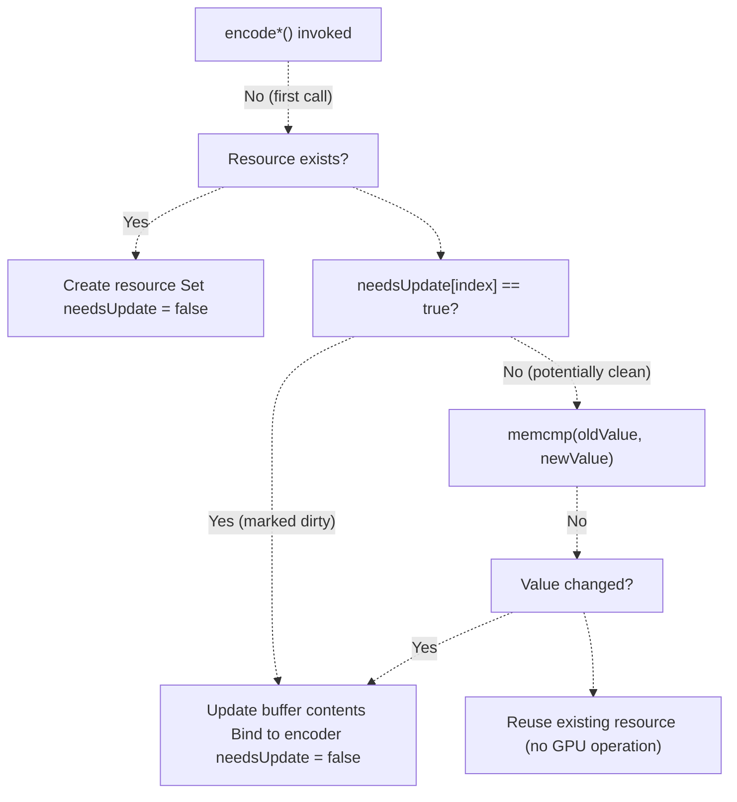
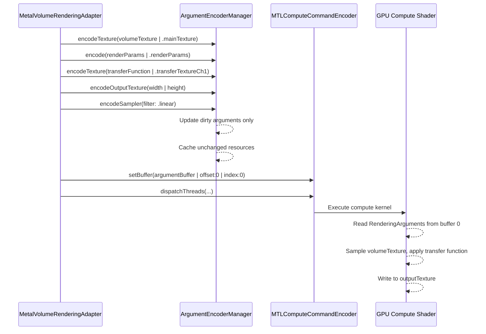

# ArgumentEncoderManager

> **Relevant source files**
> * [Sources/MTKCore/Rendering/ArgumentEncoderManager.swift](https://github.com/ThalesMMS/MTK/blob/eda6f990/Sources/MTKCore/Rendering/ArgumentEncoderManager.swift)

## Purpose and Scope

The `ArgumentEncoderManager` class provides centralized management of Metal argument buffers for GPU-based volume rendering. It encapsulates the complexity of keeping CPU-side buffer resources synchronized with shader expectations, implementing dirty tracking to avoid unnecessary GPU uploads, and managing output texture lifecycle.

This document covers the internal mechanics of argument buffer encoding and resource management. For the higher-level rendering adapter that uses this manager, see [MetalVolumeRenderingAdapter](7a%20MetalVolumeRenderingAdapter.md). For details on the shader compilation and loading system, see [Shader System](7c%20MPSVolumeRenderer.md).

**Sources:** [Sources/MTKCore/Rendering/ArgumentEncoderManager.swift L1-L417](https://github.com/ThalesMMS/MTK/blob/eda6f990/Sources/MTKCore/Rendering/ArgumentEncoderManager.swift#L1-L417)

---

## Architecture Overview

The `ArgumentEncoderManager` acts as a bridge between CPU-side rendering state and GPU shader resources. It manages a single `MTLArgumentBuffer` that holds references to all textures, buffers, and samplers required by the volume compute shader.

### Component Relationships



The manager maintains a single `MTLArgumentBuffer` that is bound to the compute shader at buffer index 0. The `MTLArgumentEncoder` provides the API to populate this argument buffer with references to GPU resources. The dirty tracking dictionary ensures that resources are only re-encoded when their values change.

**Sources:** [Sources/MTKCore/Rendering/ArgumentEncoderManager.swift L15-L136](https://github.com/ThalesMMS/MTK/blob/eda6f990/Sources/MTKCore/Rendering/ArgumentEncoderManager.swift#L15-L136)

---

## Initialization and Setup

### Constructor Parameters

The `ArgumentEncoderManager` is initialized with three key dependencies:

| Parameter | Type | Purpose |
| --- | --- | --- |
| `device` | `MTLDevice` | Metal device for creating buffers and textures |
| `mtlFunction` | `MTLFunction` | Compute kernel function used to create the argument encoder |
| `debugOptions` | `VolumeRenderingDebugOptions` | Enables verbose logging of encoding operations |

**Sources:** [Sources/MTKCore/Rendering/ArgumentEncoderManager.swift L109-L136](https://github.com/ThalesMMS/MTK/blob/eda6f990/Sources/MTKCore/Rendering/ArgumentEncoderManager.swift#L109-L136)

### Initialization Sequence



The initialization performs shader layout validation via `ArgumentIndex.validateShaderLayout()` to ensure the enum indices match the shader's `RenderingArguments` struct. It then creates the argument encoder from the compute function, allocates the argument buffer with `.cpuCacheModeWriteCombined` and `.storageModeShared` options, and marks all argument slots as needing updates.

**Sources:** [Sources/MTKCore/Rendering/ArgumentEncoderManager.swift L109-L136](https://github.com/ThalesMMS/MTK/blob/eda6f990/Sources/MTKCore/Rendering/ArgumentEncoderManager.swift#L109-L136)

---

## ArgumentIndex Enum and Shader Layout Validation

### Argument Index Mapping

The `ArgumentIndex` enum defines all 19 shader arguments with explicit integer indices that must match the Metal shader's `RenderingArguments` struct layout:

```mermaid
flowchart TD

A0["mainTexture = 0"]
A1["renderParams = 1"]
A2["outputTexture = 2"]
A3["toneBufferCh1 = 3"]
A4["toneBufferCh2 = 4"]
A5["toneBufferCh3 = 5"]
A6["toneBufferCh4 = 6"]
A7["optionValue = 7"]
A8["quaternion = 8"]
A9["targetViewSize = 9"]
A10["sampler = 10"]
A11["pointSetCountBuffer = 11"]
A12["pointSetSelectedBuffer = 12"]
A13["pointCoordsBuffer = 13"]
A14["legacyOutputBuffer = 14"]
A15["transferTextureCh1 = 15"]
A16["transferTextureCh2 = 16"]
A17["transferTextureCh3 = 17"]
A18["transferTextureCh4 = 18"]
S0["texture3d volumeTexture [[id(0)]]"]
S1["constant RenderingParameters* renderingParameters [[id(1)]]"]
S2["texture2d outputTexture [[id(2)]]"]
S3["constant float* toneBufferCh1 [[id(3)]]"]
S15["texture1d transferTextureCh1 [[id(15)]]"]

A0 -.->|"must match"| S0
A1 -.->|"must match"| S1
A2 -.->|"must match"| S2
A3 -.->|"must match"| S3
A15 -.->|"must match"| S15

subgraph subGraph1 ["RenderingArguments Struct (volume_compute.metal)"]
    S0
    S1
    S2
    S3
    S15
end

subgraph subGraph0 ["ArgumentIndex Enum (Swift)"]
    A0
    A1
    A2
    A3
    A4
    A5
    A6
    A7
    A8
    A9
    A10
    A11
    A12
    A13
    A14
    A15
    A16
    A17
    A18
end
```



### Layout Validation

The static method `ArgumentIndex.validateShaderLayout()` uses compile-time assertions to enforce index correctness:

| Validation Check | Assertion | Error Message |
| --- | --- | --- |
| Total count | `allCases.count == 19` | "RenderingArguments defines 19 resources in volume_compute.metal" |
| Index 0 | `ArgumentIndex.mainTexture.rawValue == 0` | "volume_compute.metal expects volumeTexture at index 0" |
| Index 1 | `ArgumentIndex.renderParams.rawValue == 1` | "volume_compute.metal expects RenderingParameters at index 1" |
| ... | (continues for all 19 indices) | ... |

This validation is invoked during `ArgumentEncoderManager` initialization, causing a fatal error if the Swift enum and Metal shader are out of sync. This catches layout mismatches at runtime before any rendering occurs.

**Sources:** [Sources/MTKCore/Rendering/ArgumentEncoderManager.swift L40-L107](https://github.com/ThalesMMS/MTK/blob/eda6f990/Sources/MTKCore/Rendering/ArgumentEncoderManager.swift#L40-L107)

 [Sources/MTKCore/Rendering/ArgumentEncoderManager.swift L115](https://github.com/ThalesMMS/MTK/blob/eda6f990/Sources/MTKCore/Rendering/ArgumentEncoderManager.swift#L115-L115)

---

## Resource Encoding Methods

The manager provides specialized encoding methods for different resource types, each implementing dirty tracking and lazy allocation.

### Encoding Flow



**Sources:** [Sources/MTKCore/Rendering/ArgumentEncoderManager.swift L138-L264](https://github.com/ThalesMMS/MTK/blob/eda6f990/Sources/MTKCore/Rendering/ArgumentEncoderManager.swift#L138-L264)

### Method Reference

#### encodeTexture(_:argumentIndex:)

Encodes a `MTLTexture` into the argument buffer. Only updates if `needsUpdate[index]` is true, avoiding redundant GPU bindings.

**Parameters:**

* `texture: MTLTexture` - The texture to encode
* `argumentIndex: ArgumentIndex` - Target argument slot

**Sources:** [Sources/MTKCore/Rendering/ArgumentEncoderManager.swift L138-L151](https://github.com/ThalesMMS/MTK/blob/eda6f990/Sources/MTKCore/Rendering/ArgumentEncoderManager.swift#L138-L151)

#### encode<T>(_:argumentIndex:capacity:)

Generic method for encoding value types into `MTLBuffer` resources. Performs byte-level comparison using `memcmp` to detect value changes even when dirty tracking indicates the resource is clean.

**Parameters:**

* `value: inout T` - The value to encode (passed as inout for efficiency)
* `argumentIndex: ArgumentIndex` - Target argument slot
* `capacity: Int` - Number of elements (default: 1)

**Behavior:**

1. On first call: Allocates `MTLBuffer` with `.cpuCacheModeWriteCombined` and `.storageModeShared`
2. On subsequent calls: Compares new value with existing buffer contents via `memcmp`
3. Only updates buffer if value changed or `needsUpdate[index]` is true

**Sources:** [Sources/MTKCore/Rendering/ArgumentEncoderManager.swift L180-L222](https://github.com/ThalesMMS/MTK/blob/eda6f990/Sources/MTKCore/Rendering/ArgumentEncoderManager.swift#L180-L222)

#### encodeArray(_:argumentIndex:capacity:)

Specialized method for encoding `[SIMD3<Float>]` arrays, used primarily for point set coordinates.

**Sources:** [Sources/MTKCore/Rendering/ArgumentEncoderManager.swift L224-L249](https://github.com/ThalesMMS/MTK/blob/eda6f990/Sources/MTKCore/Rendering/ArgumentEncoderManager.swift#L224-L249)

#### encode(_:argumentIndex:) (Buffer Overload)

Directly encodes an existing `MTLBuffer` into the argument buffer, used when the caller manages buffer lifecycle externally.

**Sources:** [Sources/MTKCore/Rendering/ArgumentEncoderManager.swift L251-L264](https://github.com/ThalesMMS/MTK/blob/eda6f990/Sources/MTKCore/Rendering/ArgumentEncoderManager.swift#L251-L264)

#### encodeSampler(filter:)

Creates and encodes a `MTLSamplerState` with the specified filter mode. Caches the sampler and only recreates if `filter` parameter changes.

**Configuration:**

* Address mode: `.clampToZero` on all axes
* LOD clamping: 0 to `Float.greatestFiniteMagnitude`
* Normalized coordinates: `true`
* Argument buffer support: `true`

**Sources:** [Sources/MTKCore/Rendering/ArgumentEncoderManager.swift L153-L178](https://github.com/ThalesMMS/MTK/blob/eda6f990/Sources/MTKCore/Rendering/ArgumentEncoderManager.swift#L153-L178)

 [Sources/MTKCore/Rendering/ArgumentEncoderManager.swift L371-L385](https://github.com/ThalesMMS/MTK/blob/eda6f990/Sources/MTKCore/Rendering/ArgumentEncoderManager.swift#L371-L385)

---

## Output Texture Management

### Dual Output System

The manager maintains two output mechanisms for compatibility across different rendering backends:



The modern path uses a 2D texture with `.bgra8Unorm` pixel format, which allows efficient blitting and display. The legacy buffer path provides raw RGB byte data (3 bytes per pixel) for older rendering code paths that expect buffer-based output.

**Sources:** [Sources/MTKCore/Rendering/ArgumentEncoderManager.swift L266-L328](https://github.com/ThalesMMS/MTK/blob/eda6f990/Sources/MTKCore/Rendering/ArgumentEncoderManager.swift#L266-L328)

### Texture Recreation Logic

The `encodeOutputTexture(width:height:)` method implements lazy recreation:

1. **Dimension Tracking:** Stores `currentOutputWidth`, `currentOutputHeight`, and `currentPxByteSize`
2. **Recreation Check:** Compares requested dimensions against existing texture
3. **Descriptor Configuration:** * Pixel format: `.bgra8Unorm` * Usage: `.shaderWrite | .shaderRead | .pixelFormatView` * Storage mode: `.shared` (accessible from both CPU and GPU) * Mipmapping: disabled
4. **Argument Encoding:** Updates `ArgumentIndex.outputTexture` slot when texture changes
5. **Compatibility Buffer:** Automatically calls `encodeCompatibilityBuffer` to maintain the legacy output path

**Sources:** [Sources/MTKCore/Rendering/ArgumentEncoderManager.swift L266-L306](https://github.com/ThalesMMS/MTK/blob/eda6f990/Sources/MTKCore/Rendering/ArgumentEncoderManager.swift#L266-L306)

### Readback Texture

The `makeReadbackTexture(drawingViewSize:)` method creates a cached texture for copying rendered output back to CPU memory:



**Sources:** [Sources/MTKCore/Rendering/ArgumentEncoderManager.swift L330-L348](https://github.com/ThalesMMS/MTK/blob/eda6f990/Sources/MTKCore/Rendering/ArgumentEncoderManager.swift#L330-L348)

---

## Dirty Tracking System

### State Management

The dirty tracking system minimizes GPU resource updates by maintaining per-argument dirty flags:

| Dictionary | Type | Purpose |
| --- | --- | --- |
| `needsUpdate` | `[Int: Bool]` | Per-argument dirty flags |
| `buffers` | `[Int: MTLBuffer]` | Cached buffer resources |
| `outputTexture` | `MTLTexture?` | Current output texture |
| `sampler` | `MTLSamplerState?` | Current sampler state |
| `currentSamplerFilter` | `MTLSamplerMinMagFilter` | Current filter mode for sampler comparison |

**Sources:** [Sources/MTKCore/Rendering/ArgumentEncoderManager.swift L22-L35](https://github.com/ThalesMMS/MTK/blob/eda6f990/Sources/MTKCore/Rendering/ArgumentEncoderManager.swift#L22-L35)

### Update Decision Flow



This two-level checking (dirty flag + value comparison) ensures correctness even when the dirty tracking system fails to mark a change, while still providing the performance benefit of skipping unchanged resources.

**Sources:** [Sources/MTKCore/Rendering/ArgumentEncoderManager.swift L180-L222](https://github.com/ThalesMMS/MTK/blob/eda6f990/Sources/MTKCore/Rendering/ArgumentEncoderManager.swift#L180-L222)

### Manual Dirty Marking

The `markAsNeedsUpdate(argumentIndex:)` method allows clients to explicitly flag an argument for re-encoding:

```
public func markAsNeedsUpdate(argumentIndex: ArgumentIndex) {    needsUpdate[argumentIndex.rawValue] = true    // Debug logging...}
```

This is used when external factors (e.g., texture content changes) require re-encoding without changing the resource reference.

**Sources:** [Sources/MTKCore/Rendering/ArgumentEncoderManager.swift L350-L355](https://github.com/ThalesMMS/MTK/blob/eda6f990/Sources/MTKCore/Rendering/ArgumentEncoderManager.swift#L350-L355)

---

## Debug Support

### Debug Options Integration

The manager respects `VolumeRenderingDebugOptions.isDebugMode` throughout its encoding operations, logging detailed information about resource creation, updates, and reuse:

**Sample Debug Output:**

```
arg texture index:0 (mainTexture), MTLTexture, set
arg buffer index:1 (renderParams), RenderingParameters, LayoutSize:128, size:128 created -> RenderingParameters(...)
arg texture index:2 (output texture), output texture set @ 512x512
arg buffer index:14 (output pixel buffer (compat)), compatibility buffer set @ 786432 bytes
arg sampler index:10, Optional<MTLSamplerState>, created
```

**Sources:** [Sources/MTKCore/Rendering/ArgumentEncoderManager.swift L145-L148](https://github.com/ThalesMMS/MTK/blob/eda6f990/Sources/MTKCore/Rendering/ArgumentEncoderManager.swift#L145-L148)

 [Sources/MTKCore/Rendering/ArgumentEncoderManager.swift L185-L187](https://github.com/ThalesMMS/MTK/blob/eda6f990/Sources/MTKCore/Rendering/ArgumentEncoderManager.swift#L185-L187)

 [Sources/MTKCore/Rendering/ArgumentEncoderManager.swift L300-L302](https://github.com/ThalesMMS/MTK/blob/eda6f990/Sources/MTKCore/Rendering/ArgumentEncoderManager.swift#L300-L302)

### State Inspection Methods

#### debugStateSummary() -> String

Produces a compact summary of the manager's current state:

**Format:** `output=512x512 | pixelBytes=1048576 | outputTexture=512x512 | sampler=sampler.linear | dirty=none`

**Components:**

* Output dimensions and byte size
* Output texture status
* Sampler configuration
* List of dirty arguments (or "none")

**Sources:** [Sources/MTKCore/Rendering/ArgumentEncoderManager.swift L387-L415](https://github.com/ThalesMMS/MTK/blob/eda6f990/Sources/MTKCore/Rendering/ArgumentEncoderManager.swift#L387-L415)

#### Debug Accessors (DEBUG Build Only)

The following methods provide test access to internal state:

| Method | Return Type | Purpose |
| --- | --- | --- |
| `debugNeedsUpdateState(for:)` | `Bool?` | Check if an argument is marked dirty |
| `debugBoundBuffer(for:)` | `MTLBuffer?` | Retrieve the buffer bound to an argument index |

These methods are only compiled in `DEBUG` builds and are primarily used for unit testing the dirty tracking system.

**Sources:** [Sources/MTKCore/Rendering/ArgumentEncoderManager.swift L361-L369](https://github.com/ThalesMMS/MTK/blob/eda6f990/Sources/MTKCore/Rendering/ArgumentEncoderManager.swift#L361-L369)

---

## Integration with Rendering Pipeline

### Usage Pattern in MetalVolumeRenderingAdapter



The adapter calls encoding methods for each render request, but the argument encoder manager handles the optimization of determining which resources actually need GPU updates. The final argument buffer is bound once to the compute command encoder, providing all shader arguments through a single buffer binding.

**Sources:** [Sources/MTKCore/Rendering/ArgumentEncoderManager.swift L1-L417](https://github.com/ThalesMMS/MTK/blob/eda6f990/Sources/MTKCore/Rendering/ArgumentEncoderManager.swift#L1-L417)

### Resource Lifetime

* **ArgumentEncoderManager:** Lives for the duration of the rendering session
* **argumentBuffer:** Allocated once during initialization, reused for all frames
* **Cached Buffers:** Persisted in `buffers` dictionary, recreated only on size changes
* **outputTexture:** Recreated when dimensions change
* **sampler:** Recreated when filter mode changes

This caching strategy minimizes Metal resource allocation overhead during interactive rendering.

**Sources:** [Sources/MTKCore/Rendering/ArgumentEncoderManager.swift L22-L35](https://github.com/ThalesMMS/MTK/blob/eda6f990/Sources/MTKCore/Rendering/ArgumentEncoderManager.swift#L22-L35)

---

## Summary

The `ArgumentEncoderManager` provides a robust abstraction over Metal's argument buffer system, implementing:

1. **Type-Safe Argument Indexing:** The `ArgumentIndex` enum with compile-time validation ensures Swift and Metal shader layouts remain synchronized
2. **Intelligent Dirty Tracking:** Two-level checking (dirty flags + value comparison) minimizes GPU updates while maintaining correctness
3. **Resource Caching:** Buffers, textures, and samplers are cached and recreated only when necessary
4. **Dual Output Support:** Modern texture-based output with legacy buffer fallback
5. **Debug Visibility:** Comprehensive logging and state inspection for troubleshooting encoding issues

This design centralizes the complex state management required for efficient Metal compute rendering, allowing higher-level components like `MetalVolumeRenderingAdapter` to focus on rendering logic rather than resource synchronization.

**Sources:** [Sources/MTKCore/Rendering/ArgumentEncoderManager.swift L1-L417](https://github.com/ThalesMMS/MTK/blob/eda6f990/Sources/MTKCore/Rendering/ArgumentEncoderManager.swift#L1-L417)


### On this page

* [ArgumentEncoderManager](#7.2-argumentencodermanager)
* [Purpose and Scope](#7.2-purpose-and-scope)
* [Architecture Overview](#7.2-architecture-overview)
* [Component Relationships](#7.2-component-relationships)
* [Initialization and Setup](#7.2-initialization-and-setup)
* [Constructor Parameters](#7.2-constructor-parameters)
* [Initialization Sequence](#7.2-initialization-sequence)
* [ArgumentIndex Enum and Shader Layout Validation](#7.2-argumentindex-enum-and-shader-layout-validation)
* [Argument Index Mapping](#7.2-argument-index-mapping)
* [Layout Validation](#7.2-layout-validation)
* [Resource Encoding Methods](#7.2-resource-encoding-methods)
* [Encoding Flow](#7.2-encoding-flow)
* [Method Reference](#7.2-method-reference)
* [Output Texture Management](#7.2-output-texture-management)
* [Dual Output System](#7.2-dual-output-system)
* [Texture Recreation Logic](#7.2-texture-recreation-logic)
* [Readback Texture](#7.2-readback-texture)
* [Dirty Tracking System](#7.2-dirty-tracking-system)
* [State Management](#7.2-state-management)
* [Update Decision Flow](#7.2-update-decision-flow)
* [Manual Dirty Marking](#7.2-manual-dirty-marking)
* [Debug Support](#7.2-debug-support)
* [Debug Options Integration](#7.2-debug-options-integration)
* [State Inspection Methods](#7.2-state-inspection-methods)
* [Integration with Rendering Pipeline](#7.2-integration-with-rendering-pipeline)
* [Usage Pattern in MetalVolumeRenderingAdapter](#7.2-usage-pattern-in-metalvolumerenderingadapter)
* [Resource Lifetime](#7.2-resource-lifetime)
* [Summary](#7.2-summary)

Ask Devin about MTK