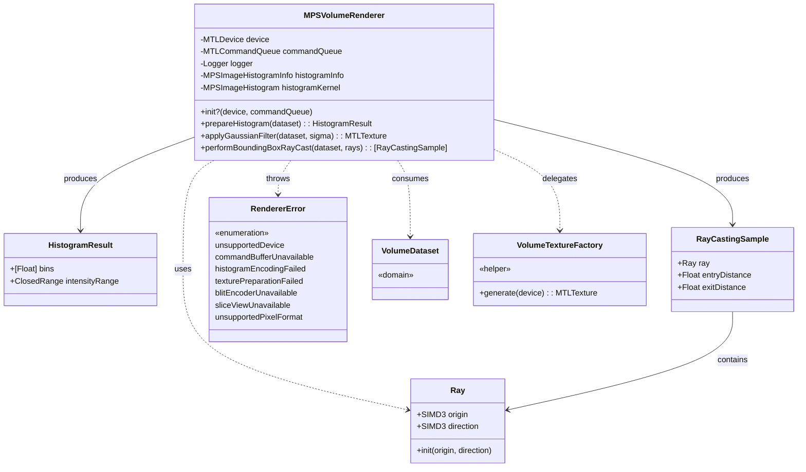
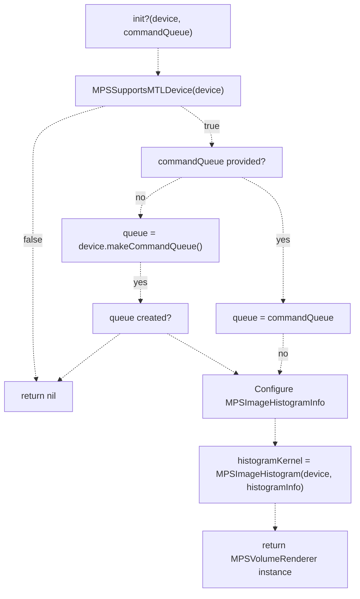
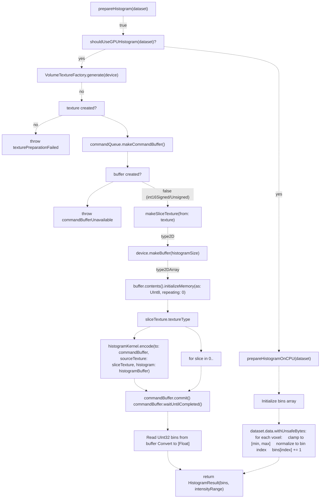
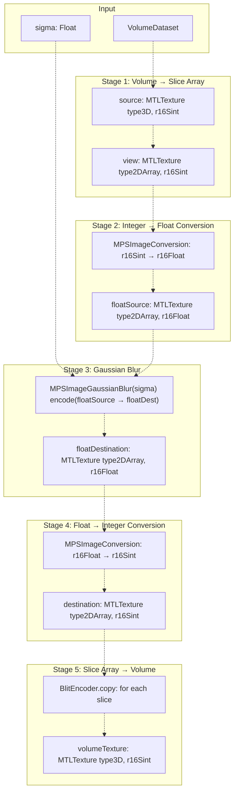
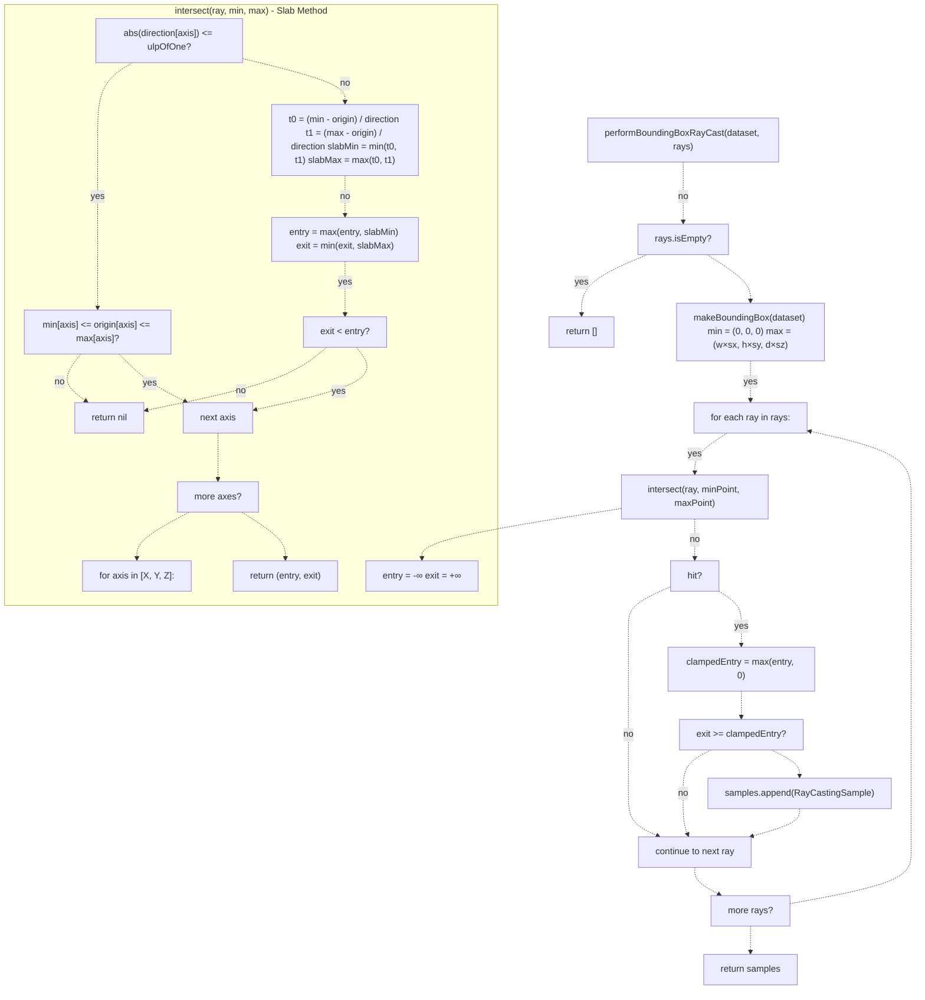
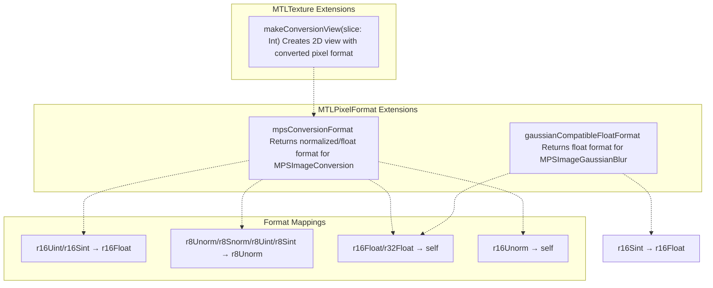
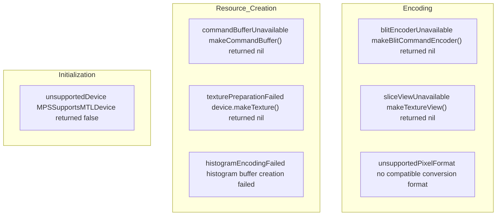
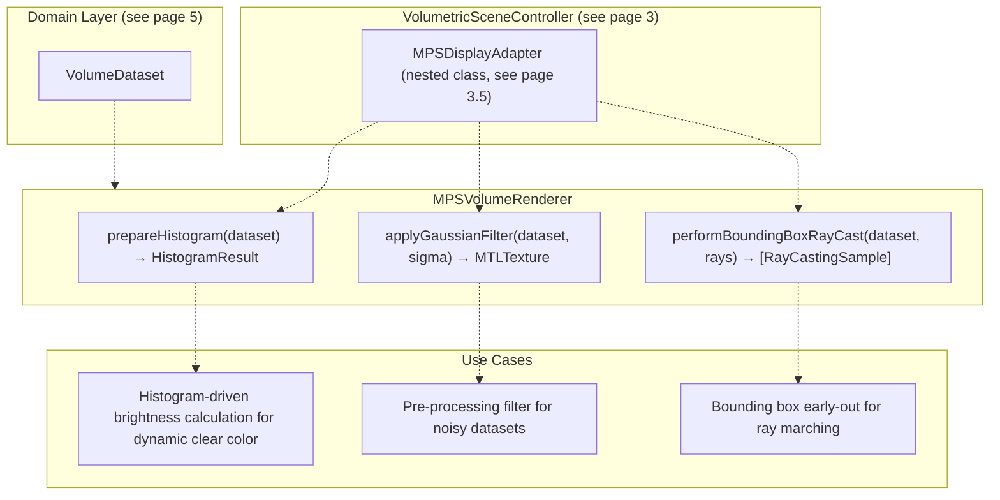

# MPSVolumeRenderer

> **Relevant source files**
> * [Sources/MTKCore/Rendering/MPSVolumeRenderer.swift](https://github.com/ThalesMMS/MTK/blob/eda6f990/Sources/MTKCore/Rendering/MPSVolumeRenderer.swift)

## Purpose and Scope

`MPSVolumeRenderer` is a GPU-accelerated utility class that provides Metal Performance Shaders-based operations for volumetric data processing. This class encapsulates three core capabilities:

1. **Histogram Computation**: Calculates intensity distribution for volumetric datasets with automatic GPU/CPU fallback
2. **Gaussian Filtering**: Applies 3D Gaussian blur using MPS kernels with multi-stage texture format conversion
3. **Bounding Box Ray Casting**: Performs axis-aligned bounding box intersection tests for ray marching optimization

This renderer operates at a **lower abstraction level** than the full MPS rendering backend described in [2.2](2b%20Metal-Performance-Shaders-Backend.md). It provides foundational GPU operations that are consumed by the `MPSDisplayAdapter` (see [3.5](3e%20MPS-Display-Adapter.md)) and other MPS-based rendering components. For the complete MPS rendering pipeline, see [7.1](7a%20MetalVolumeRenderingAdapter.md) on `MetalVolumeRenderingAdapter`.

**Sources**: [Sources/MTKCore/Rendering/MPSVolumeRenderer.swift L1-L502](https://github.com/ThalesMMS/MTK/blob/eda6f990/Sources/MTKCore/Rendering/MPSVolumeRenderer.swift#L1-L502)

---

## Class Architecture

### Core Structure

The class is conditionally compiled with `#if canImport(MetalPerformanceShaders)` and returns `nil` from its initializer if the device doesn't support MPS via `MPSSupportsMTLDevice(device)`.

**Sources**: [Sources/MTKCore/Rendering/MPSVolumeRenderer.swift L16-L79](https://github.com/ThalesMMS/MTK/blob/eda6f990/Sources/MTKCore/Rendering/MPSVolumeRenderer.swift#L16-L79)

---

## Initialization and Device Compatibility

### Initialization

The initializer performs three critical checks:

1. **Device Support**: `MPSSupportsMTLDevice(device)` validates MPS compatibility at the driver level
2. **Command Queue**: Creates a default queue if none is provided, fails initialization if creation fails
3. **Histogram Configuration**: Initializes `MPSImageHistogramInfo` with 4096 bins spanning Hounsfield Unit range [-1024, 3071]

**Sources**: [Sources/MTKCore/Rendering/MPSVolumeRenderer.swift L64-L79](https://github.com/ThalesMMS/MTK/blob/eda6f990/Sources/MTKCore/Rendering/MPSVolumeRenderer.swift#L64-L79)

---

## Histogram Computation

### Decision Flow: GPU vs CPU

### GPU Histogram Path

The GPU path leverages `MPSImageHistogram` but requires **texture type conversion**. MPS histogram kernels operate on 2D textures, but volume data is stored as 3D textures. The `makeSliceTexture` helper converts 3D volumes to 2D array textures via blit operations:

| Step | Source Type | Target Type | Operation |
| --- | --- | --- | --- |
| 1. Create Descriptor | `.type3D` | `.type2DArray` | `arrayLength = volume.depth` |
| 2. Copy Slices | 3D origin `(0,0,z)` | 2D slice `z` | Blit encoder loop |
| 3. Encode Histogram | Each 2D slice | Same buffer | Accumulate across slices |

**Sources**: [Sources/MTKCore/Rendering/MPSVolumeRenderer.swift L81-L364](https://github.com/ThalesMMS/MTK/blob/eda6f990/Sources/MTKCore/Rendering/MPSVolumeRenderer.swift#L81-L364)

### CPU Histogram Fallback

The CPU fallback is triggered for **int16 signed/unsigned formats** where GPU encoding may fail. The implementation:

1. **Dynamic Range Calculation**: Uses `dataset.intensityRange` rather than hardcoded histogram bounds
2. **Bin Mapping**: `index = (value - min) * (bins - 1) / (max - min)` with bounds checking
3. **Type Safety**: Uses `withUnsafeBytes` with format-specific `bindMemory(to:)` for int16 variants

**Sources**: [Sources/MTKCore/Rendering/MPSVolumeRenderer.swift L271-L320](https://github.com/ThalesMMS/MTK/blob/eda6f990/Sources/MTKCore/Rendering/MPSVolumeRenderer.swift#L271-L320)

---

## Gaussian Filtering Pipeline

### Multi-Stage Texture Conversion

### Pixel Format Compatibility

`MPSImageGaussianBlur` requires **float pixel formats**. The renderer implements format mapping via `gaussianCompatibleFloatFormat`:

| Input Format | Conversion Target | Notes |
| --- | --- | --- |
| `.r16Sint` | `.r16Float` | Requires explicit conversion |
| `.r16Float` | `.r16Float` | Pass-through |
| `.r32Float` | `.r32Float` | Pass-through |
| Other | `nil` | Throws `unsupportedPixelFormat` |

The `convertTexture` helper handles **slice-by-slice conversion** for 2D array textures using `MPSImageConversion` with `makeConversionView(slice:)` to create format-reinterpreted views.

**Sources**: [Sources/MTKCore/Rendering/MPSVolumeRenderer.swift L152-L500](https://github.com/ThalesMMS/MTK/blob/eda6f990/Sources/MTKCore/Rendering/MPSVolumeRenderer.swift#L152-L500)

---

## Bounding Box Ray Casting

### Ray-Box Intersection Algorithm

### Slab-Based Intersection Testing

The `intersect` method implements the **slab method** for axis-aligned bounding box (AABB) intersection:

1. **Per-Axis Slab Calculation**: For each dimension (X, Y, Z), compute entry/exit distances where the ray intersects the infinite slab defined by the min/max planes
2. **Parallel Ray Handling**: When `abs(direction[axis]) <= Float.ulpOfOne`, the ray is parallel to the slab—check if origin is within bounds
3. **Interval Accumulation**: `entry = max(entry, slabMin)` and `exit = min(exit, slabMax)` compute the intersection of all three slabs
4. **Failure Condition**: If `exit < entry` at any point, the ray misses the box

**Ray Normalization**: The `Ray.init(origin:direction:)` constructor normalizes the direction vector and falls back to `(0, 0, 1)` for degenerate inputs where `simd_normalize` produces non-finite values.

**Sources**: [Sources/MTKCore/Rendering/MPSVolumeRenderer.swift L23-L415](https://github.com/ThalesMMS/MTK/blob/eda6f990/Sources/MTKCore/Rendering/MPSVolumeRenderer.swift#L23-L415)

---

## Texture Format Management

### Format Conversion Extensions

### Conversion View Creation

The `makeConversionView(slice:)` method creates texture views suitable for `MPSImageConversion`:

| Input Type | View Type | Pixel Format | Usage |
| --- | --- | --- | --- |
| `.type2D` | `.type2D` | `mpsConversionFormat` | Direct view with format reinterpretation |
| `.type2DArray` | `.type2D` | `mpsConversionFormat` | Single slice view at `slices: slice..<(slice+1)` |

This enables **slice-by-slice processing** of 3D volumes converted to 2D arrays without copying data—only the Metal view descriptor changes.

**Sources**: [Sources/MTKCore/Rendering/MPSVolumeRenderer.swift L461-L500](https://github.com/ThalesMMS/MTK/blob/eda6f990/Sources/MTKCore/Rendering/MPSVolumeRenderer.swift#L461-L500)

---

## Error Handling

### RendererError Cases

### Error Propagation

All three public methods (`prepareHistogram`, `applyGaussianFilter`, `performBoundingBoxRayCast`) are **throwing functions** that propagate errors to callers. The bounding box ray casting method, however, **does not throw**—it silently skips rays that miss the bounding box by using optional binding: `guard let (entry, exit) = intersect(...) else { continue }`.

**Sources**: [Sources/MTKCore/Rendering/MPSVolumeRenderer.swift L47-L55](https://github.com/ThalesMMS/MTK/blob/eda6f990/Sources/MTKCore/Rendering/MPSVolumeRenderer.swift#L47-L55)

---

## Integration with MPS Backend

### Role in MPS Display Pipeline

### Histogram-Driven Brightness Calculation

The `MPSDisplayAdapter` uses `prepareHistogram` to compute dynamic clear colors based on dataset intensity distribution. The histogram bins inform adaptive brightness scaling, ensuring optimal contrast for different tissue types.

### Camera Ray Cache Integration

The `performBoundingBoxRayCast` method supports the **MPS ray casting cache** (see [9.3](9c%20MPS-Ray-Casting-Cache.md)). Camera rays are pre-filtered against the volume's bounding box, allowing the ray marching shader to skip rays that never intersect the volume, improving performance for oblique viewing angles.

**Sources**: [Sources/MTKCore/Rendering/MPSVolumeRenderer.swift L1-L502](https://github.com/ThalesMMS/MTK/blob/eda6f990/Sources/MTKCore/Rendering/MPSVolumeRenderer.swift#L1-L502)

---

## Performance Characteristics

### GPU Histogram vs CPU Fallback

| Aspect | GPU Path | CPU Path |
| --- | --- | --- |
| **Trigger** | All formats except int16 | `.int16Signed`, `.int16Unsigned` |
| **Execution** | Asynchronous via command buffer | Synchronous on calling thread |
| **Overhead** | Texture creation, blit encoding | Memory binding, iterator loops |
| **Optimal For** | Large datasets (>256³) | Small datasets, int16 formats |
| **Synchronization** | `commandBuffer.waitUntilCompleted()` | Immediate return |

### Gaussian Filter Memory Usage

The Gaussian filter pipeline creates **five intermediate textures** for a single operation:

1. **sliceTexture** (type2DArray, input format): Converted from 3D input
2. **floatSource** (type2DArray, float format): Integer→float conversion target
3. **floatDestination** (type2DArray, float format): Blur output
4. **destination** (type2DArray, input format): Float→integer conversion target
5. **volumeTexture** (type3D, input format): Final 3D output

For a 512×512×300 volume with r16Sint format, total temporary memory: **~1.5 GB**.

**Sources**: [Sources/MTKCore/Rendering/MPSVolumeRenderer.swift L81-L237](https://github.com/ThalesMMS/MTK/blob/eda6f990/Sources/MTKCore/Rendering/MPSVolumeRenderer.swift#L81-L237)

### On this page

* [MPSVolumeRenderer](#7.3-mpsvolumerenderer)
* [Purpose and Scope](#7.3-purpose-and-scope)
* [Class Architecture](#7.3-class-architecture)
* [Core Structure](#7.3-core-structure)
* [Initialization and Device Compatibility](#7.3-initialization-and-device-compatibility)
* [Initialization](#7.3-initialization)
* [Histogram Computation](#7.3-histogram-computation)
* [Decision Flow: GPU vs CPU](#7.3-decision-flow-gpu-vs-cpu)
* [GPU Histogram Path](#7.3-gpu-histogram-path)
* [CPU Histogram Fallback](#7.3-cpu-histogram-fallback)
* [Gaussian Filtering Pipeline](#7.3-gaussian-filtering-pipeline)
* [Multi-Stage Texture Conversion](#7.3-multi-stage-texture-conversion)
* [Pixel Format Compatibility](#7.3-pixel-format-compatibility)
* [Bounding Box Ray Casting](#7.3-bounding-box-ray-casting)
* [Ray-Box Intersection Algorithm](#7.3-ray-box-intersection-algorithm)
* [Slab-Based Intersection Testing](#7.3-slab-based-intersection-testing)
* [Texture Format Management](#7.3-texture-format-management)
* [Format Conversion Extensions](#7.3-format-conversion-extensions)
* [Conversion View Creation](#7.3-conversion-view-creation)
* [Error Handling](#7.3-error-handling)
* [RendererError Cases](#7.3-renderererror-cases)
* [Error Propagation](#7.3-error-propagation)
* [Integration with MPS Backend](#7.3-integration-with-mps-backend)
* [Role in MPS Display Pipeline](#7.3-role-in-mps-display-pipeline)
* [Histogram-Driven Brightness Calculation](#7.3-histogram-driven-brightness-calculation)
* [Camera Ray Cache Integration](#7.3-camera-ray-cache-integration)
* [Performance Characteristics](#7.3-performance-characteristics)
* [GPU Histogram vs CPU Fallback](#7.3-gpu-histogram-vs-cpu-fallback)
* [Gaussian Filter Memory Usage](#7.3-gaussian-filter-memory-usage)

Ask Devin about MTK