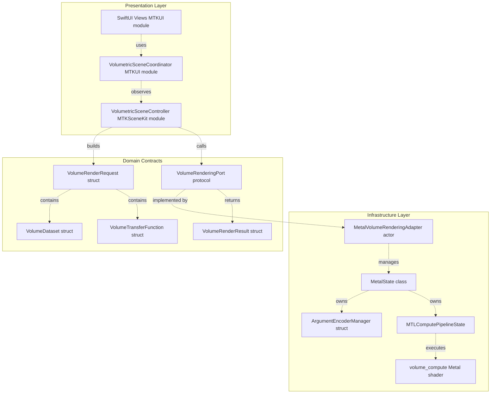
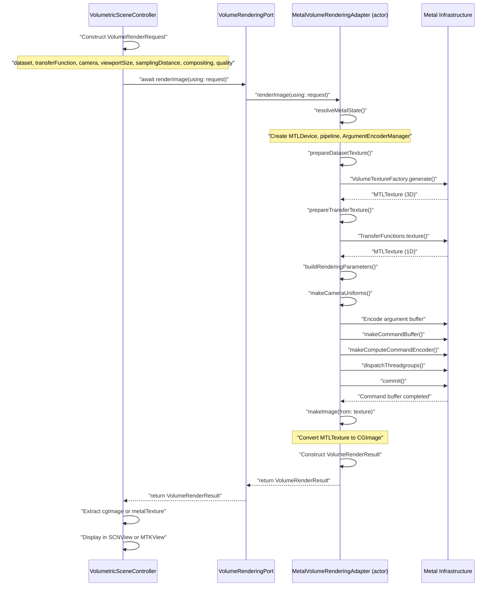

# Domain Contracts

> **Relevant source files**
> * [Sources/MTKCore/Adapters/MetalVolumeRenderingAdapter.swift](https://github.com/ThalesMMS/MTK/blob/eda6f990/Sources/MTKCore/Adapters/MetalVolumeRenderingAdapter.swift)
> * [Sources/MTKCore/Domain/VolumeRenderingPort.swift](https://github.com/ThalesMMS/MTK/blob/eda6f990/Sources/MTKCore/Domain/VolumeRenderingPort.swift)

## Purpose and Scope

Domain contracts define the framework-agnostic interfaces and types that establish the rendering API boundary in MTK. These contracts specify how presentation layers request volumetric rendering operations without coupling to Metal, SceneKit, or SwiftUI implementation details. This page documents the domain types, their relationships, and the architectural role they serve in decoupling presentation from infrastructure.

For the complete protocol specification, see [VolumeRenderingPort](8a%20VolumeRenderingPort.md). For detailed documentation of request and result structures, see [Rendering Request Model](8b%20Rendering-Request-Model.md).

## Overview

The domain layer in MTK consists of pure data structures and protocol definitions that describe rendering operations in abstract terms. No domain type imports SceneKit or depends on UI frameworks. All domain types conform to `Sendable` to enable safe concurrent access across actor boundaries.

The `VolumeRenderingPort` protocol serves as the primary abstraction, implemented by `MetalVolumeRenderingAdapter` (actor-isolated Metal backend) and potentially by mock implementations for testing. Domain contracts ensure that high-level code can request renders, update presets, and refresh histograms without knowing whether the backend uses GPU acceleration, CPU fallback, or test fixtures.

**Sources:**

* [Sources/MTKCore/Domain/VolumeRenderingPort.swift L1-L213](https://github.com/ThalesMMS/MTK/blob/eda6f990/Sources/MTKCore/Domain/VolumeRenderingPort.swift#L1-L213)
* [Sources/MTKCore/Adapters/MetalVolumeRenderingAdapter.swift L1-L41](https://github.com/ThalesMMS/MTK/blob/eda6f990/Sources/MTKCore/Adapters/MetalVolumeRenderingAdapter.swift#L1-L41)

## Core Domain Types

The domain layer defines five primary type categories:

| Category | Types | Purpose |
| --- | --- | --- |
| **Request Model** | `VolumeRenderRequest`, `VolumeRenderRequest.Camera`, `VolumeRenderRequest.Quality`, `VolumeRenderRequest.Compositing` | Encapsulate all parameters needed to render a single frame |
| **Transfer Functions** | `VolumeTransferFunction`, `VolumeTransferFunction.OpacityControlPoint`, `VolumeTransferFunction.ColourControlPoint` | Define intensity-to-color/opacity mappings |
| **Presets** | `VolumeRenderingPreset` | Package transfer functions with rendering settings for one-step configuration |
| **Histogram Analysis** | `VolumeHistogramDescriptor`, `VolumeHistogram` | Request and receive intensity distribution analysis |
| **Result Model** | `VolumeRenderResult`, `VolumeRenderResult.Metadata` | Return rendered images with metadata |
| **Commands** | `VolumeRenderingCommand` | Apply state mutations (window, lighting, compositing) |

### Domain Type Relationships

```mermaid
flowchart TD

Port["VolumeRenderingPort (protocol)"]
RenderMethod["func renderImage(using: VolumeRenderRequest) async throws -> VolumeRenderResult"]
PresetMethod["func updatePreset(_:for:) async throws -> [VolumeRenderingPreset]"]
HistogramMethod["func refreshHistogram(for:descriptor:transferFunction:) async throws -> VolumeHistogram"]
CommandMethod["func send(_: VolumeRenderingCommand) async throws"]
Request["VolumeRenderRequest Sendable, Equatable"]
Camera["VolumeRenderRequest.Camera position, target, up, fieldOfView"]
Quality["VolumeRenderRequest.Quality preview | interactive | production"]
Compositing["VolumeRenderRequest.Compositing maximumIntensity | minimumIntensity averageIntensity | frontToBack"]
TransferFunc["VolumeTransferFunction Sendable, Equatable"]
OpacityPoint["OpacityControlPoint intensity, opacity"]
ColourPoint["ColourControlPoint intensity, colour (SIMD4)"]
Preset["VolumeRenderingPreset Identifiable, Sendable"]
HistDesc["VolumeHistogramDescriptor binCount, intensityRange, normalize"]
Histogram["VolumeHistogram descriptor, bins"]
Result["VolumeRenderResult @unchecked Sendable"]
Metadata["VolumeRenderResult.Metadata viewportSize, samplingDistance compositing, quality"]
CGImage["cgImage: CGImage?"]
MetalTex["metalTexture: MTLTexture?"]
Command["VolumeRenderingCommand Sendable, Equatable"]
SetComp["setCompositing(_)"]
SetWindow["setWindow(min:max:)"]
SetSampling["setSamplingStep(_)"]
SetLighting["setLighting(_)"]

RenderMethod -.-> Request
RenderMethod -.-> Result
Request -.-> TransferFunc
PresetMethod -.-> Preset
Preset -.-> TransferFunc
HistogramMethod -.-> HistDesc
HistogramMethod -.-> Histogram
CommandMethod -.-> Command

subgraph subGraph5 ["Command Types"]
    Command
    SetComp
    SetWindow
    SetSampling
    SetLighting
    Command -.-> SetComp
    Command -.-> SetWindow
    Command -.-> SetSampling
    Command -.-> SetLighting
end

subgraph subGraph4 ["Result Types"]
    Result
    Metadata
    CGImage
    MetalTex
    Result -.-> Metadata
    Result -.-> CGImage
    Result -.-> MetalTex
end

subgraph subGraph3 ["Preset & Histogram Types"]
    Preset
    HistDesc
    Histogram
    Histogram -.-> HistDesc
end

subgraph subGraph2 ["Transfer Function Types"]
    TransferFunc
    OpacityPoint
    ColourPoint
    TransferFunc -.-> OpacityPoint
    TransferFunc -.-> ColourPoint
end

subgraph subGraph1 ["Request Types"]
    Request
    Camera
    Quality
    Compositing
    Request -.-> Camera
    Request -.-> Quality
    Request -.-> Compositing
end

subgraph subGraph0 ["VolumeRenderingPort Protocol"]
    Port
    RenderMethod
    PresetMethod
    HistogramMethod
    CommandMethod
    Port -.-> RenderMethod
    Port -.-> PresetMethod
    Port -.-> HistogramMethod
    Port -.-> CommandMethod
end
```



**Sources:**

* [Sources/MTKCore/Domain/VolumeRenderingPort.swift L19-L73](https://github.com/ThalesMMS/MTK/blob/eda6f990/Sources/MTKCore/Domain/VolumeRenderingPort.swift#L19-L73)  (VolumeRenderRequest)
* [Sources/MTKCore/Domain/VolumeRenderingPort.swift L75-L103](https://github.com/ThalesMMS/MTK/blob/eda6f990/Sources/MTKCore/Domain/VolumeRenderingPort.swift#L75-L103)  (VolumeTransferFunction)
* [Sources/MTKCore/Domain/VolumeRenderingPort.swift L105-L126](https://github.com/ThalesMMS/MTK/blob/eda6f990/Sources/MTKCore/Domain/VolumeRenderingPort.swift#L105-L126)  (VolumeRenderingPreset)
* [Sources/MTKCore/Domain/VolumeRenderingPort.swift L128-L150](https://github.com/ThalesMMS/MTK/blob/eda6f990/Sources/MTKCore/Domain/VolumeRenderingPort.swift#L128-L150)  (Histogram types)
* [Sources/MTKCore/Domain/VolumeRenderingPort.swift L152-L193](https://github.com/ThalesMMS/MTK/blob/eda6f990/Sources/MTKCore/Domain/VolumeRenderingPort.swift#L152-L193)  (VolumeRenderResult)
* [Sources/MTKCore/Domain/VolumeRenderingPort.swift L197-L212](https://github.com/ThalesMMS/MTK/blob/eda6f990/Sources/MTKCore/Domain/VolumeRenderingPort.swift#L197-L212)  (VolumeRenderingCommand and protocol)

## Architectural Role: Decoupling Presentation from Infrastructure

The domain contracts establish a clean boundary between presentation logic (UI controllers, SwiftUI views) and infrastructure (Metal rendering, compute pipelines, texture management). This separation enables several key architectural properties:



### Benefits of Domain Abstraction

1. **Framework Independence**: Presentation code references only domain types (structs, enums, protocols), not Metal types like `MTLTexture`, `MTLDevice`, or `MTLCommandBuffer`. This means UI logic can be tested on devices without GPU capability.
2. **Implementation Swapping**: The `VolumeRenderingPort` protocol allows runtime substitution of rendering backends. A test suite can inject a mock implementation that returns predefined images. A future implementation could target Vulkan or WebGPU without changing presentation code.
3. **Actor Isolation**: `MetalVolumeRenderingAdapter` is declared as an `actor`, ensuring all Metal state mutations occur serially on a dedicated execution context. Presentation code calls `await adapter.renderImage(using: request)` without managing synchronization primitives.
4. **Sendable Enforcement**: All domain types conform to `Sendable`, which the Swift compiler verifies. This prevents accidental sharing of non-thread-safe state across concurrency boundaries. The `VolumeRenderResult` uses `@unchecked Sendable` because it contains `CGImage` (not inherently sendable) but guarantees safe usage patterns.

**Sources:**

* [Sources/MTKCore/Adapters/MetalVolumeRenderingAdapter.swift L41](https://github.com/ThalesMMS/MTK/blob/eda6f990/Sources/MTKCore/Adapters/MetalVolumeRenderingAdapter.swift#L41-L41)  (actor declaration)
* [Sources/MTKCore/Domain/VolumeRenderingPort.swift L19](https://github.com/ThalesMMS/MTK/blob/eda6f990/Sources/MTKCore/Domain/VolumeRenderingPort.swift#L19-L19)  (Sendable conformance on VolumeRenderRequest)
* [Sources/MTKCore/Domain/VolumeRenderingPort.swift L195](https://github.com/ThalesMMS/MTK/blob/eda6f990/Sources/MTKCore/Domain/VolumeRenderingPort.swift#L195-L195)  (@unchecked Sendable on VolumeRenderResult)

## Request-Response Flow

The following diagram shows the typical sequence of operations when rendering a frame through domain contracts:



**Sources:**

* [Sources/MTKCore/Adapters/MetalVolumeRenderingAdapter.swift L134-L199](https://github.com/ThalesMMS/MTK/blob/eda6f990/Sources/MTKCore/Adapters/MetalVolumeRenderingAdapter.swift#L134-L199)  (renderImage implementation)
* [Sources/MTKCore/Adapters/MetalVolumeRenderingAdapter.swift L366-L419](https://github.com/ThalesMMS/MTK/blob/eda6f990/Sources/MTKCore/Adapters/MetalVolumeRenderingAdapter.swift#L366-L419)  (renderWithMetal)
* [Sources/MTKCore/Adapters/MetalVolumeRenderingAdapter.swift L301-L364](https://github.com/ThalesMMS/MTK/blob/eda6f990/Sources/MTKCore/Adapters/MetalVolumeRenderingAdapter.swift#L301-L364)  (resolveMetalState)

## Command Pattern for State Mutations

The `VolumeRenderingCommand` enum provides a discrete set of operations for modifying rendering parameters outside the request/response cycle. This pattern enables:

* **Persistent State**: Commands mutate adapter state that persists across multiple render requests.
* **Imperative Control**: UI can send `setWindow(min:max:)` once, and subsequent renders use the updated window without re-specifying it in every request.
* **Override Semantics**: Commands set "overrides" that take precedence over request parameters.

| Command | Parameters | Effect |
| --- | --- | --- |
| `setCompositing` | `Compositing` | Sets compositing method override |
| `setWindow` | `min: Int32, max: Int32` | Sets HU window override |
| `setSamplingStep` | `Float` | Sets sampling distance override |
| `setLighting` | `Bool` | Enables/disables lighting override |

The adapter stores overrides in the `Overrides` struct ([MetalVolumeRenderingAdapter.swift L55-L60](https://github.com/ThalesMMS/MTK/blob/eda6f990/MetalVolumeRenderingAdapter.swift#L55-L60)

), which is consulted during `renderImage` before using request parameters ([MetalVolumeRenderingAdapter.swift L141-L152](https://github.com/ThalesMMS/MTK/blob/eda6f990/MetalVolumeRenderingAdapter.swift#L141-L152)

).

**Sources:**

* [Sources/MTKCore/Domain/VolumeRenderingPort.swift L197-L202](https://github.com/ThalesMMS/MTK/blob/eda6f990/Sources/MTKCore/Domain/VolumeRenderingPort.swift#L197-L202)  (VolumeRenderingCommand enum)
* [Sources/MTKCore/Adapters/MetalVolumeRenderingAdapter.swift L256-L282](https://github.com/ThalesMMS/MTK/blob/eda6f990/Sources/MTKCore/Adapters/MetalVolumeRenderingAdapter.swift#L256-L282)  (send command implementation)
* [Sources/MTKCore/Adapters/MetalVolumeRenderingAdapter.swift L55-L60](https://github.com/ThalesMMS/MTK/blob/eda6f990/Sources/MTKCore/Adapters/MetalVolumeRenderingAdapter.swift#L55-L60)  (Overrides struct)

## Concurrency Model

Domain contracts are designed for Swift's structured concurrency model:

### Actor Isolation

`MetalVolumeRenderingAdapter` is an `actor`, meaning:

* All methods execute serially on the actor's isolated execution context.
* Calling code must use `await` to invoke protocol methods.
* Internal mutable state (`metalState`, `overrides`, `extendedState`) is protected from data races.

```
public actor MetalVolumeRenderingAdapter: VolumeRenderingPort {    private var metalState: MetalState?    private var overrides = Overrides()    internal var extendedState = ExtendedRenderingState()        public func renderImage(using request: VolumeRenderRequest) async throws -> VolumeRenderResult {        // Serial execution guaranteed by actor isolation    }}
```

### Sendable Propagation

All domain types are `Sendable`, which the compiler enforces:

* `VolumeRenderRequest: Sendable, Equatable` - safe to pass across actor boundaries
* `VolumeRenderResult: @unchecked Sendable` - contains CGImage, requires manual verification
* `VolumeTransferFunction: Sendable, Equatable` - immutable value type
* `VolumeRenderingPort: Sendable` - protocol requirement ensures implementations are sendable

The `@unchecked Sendable` annotation on `VolumeRenderResult` ([VolumeRenderingPort.swift L195](https://github.com/ThalesMMS/MTK/blob/eda6f990/VolumeRenderingPort.swift#L195-L195)

) bypasses compiler verification because `CGImage` is a CoreFoundation type not marked `Sendable`. The annotation asserts that usage patterns maintain thread safety despite the compiler's inability to verify it automatically.

**Sources:**

* [Sources/MTKCore/Adapters/MetalVolumeRenderingAdapter.swift L41](https://github.com/ThalesMMS/MTK/blob/eda6f990/Sources/MTKCore/Adapters/MetalVolumeRenderingAdapter.swift#L41-L41)  (actor MetalVolumeRenderingAdapter)
* [Sources/MTKCore/Domain/VolumeRenderingPort.swift L19](https://github.com/ThalesMMS/MTK/blob/eda6f990/Sources/MTKCore/Domain/VolumeRenderingPort.swift#L19-L19)  (Sendable on VolumeRenderRequest)
* [Sources/MTKCore/Domain/VolumeRenderingPort.swift L195](https://github.com/ThalesMMS/MTK/blob/eda6f990/Sources/MTKCore/Domain/VolumeRenderingPort.swift#L195-L195)  (@unchecked Sendable on VolumeRenderResult)
* [Sources/MTKCore/Domain/VolumeRenderingPort.swift L204](https://github.com/ThalesMMS/MTK/blob/eda6f990/Sources/MTKCore/Domain/VolumeRenderingPort.swift#L204-L204)  (Sendable on VolumeRenderingPort)

## Testing Surface

Domain contracts expose a testable surface through the `VolumeRenderingPort` protocol. Unit tests can instantiate a mock implementation that:

1. Returns synthetic `VolumeRenderResult` instances with predetermined images.
2. Records which requests were received to verify presentation logic.
3. Simulates error conditions (GPU unavailable, invalid parameters).
4. Executes on CPU without requiring Metal-capable hardware.

The `MetalVolumeRenderingAdapter` exposes internal state for testing via the `@_spi(Testing)` attribute:

```
extension MetalVolumeRenderingAdapter {    @_spi(Testing)    public var debugOverrides: Overrides { overrides }        @_spi(Testing)    public var debugLastSnapshot: RenderSnapshot? { lastSnapshot }        @_spi(Testing)    public var debugCurrentPreset: VolumeRenderingPreset? { currentPreset }}
```

These properties allow tests to verify that commands correctly mutate adapter state without exposing implementation details to production code.

**Sources:**

* [Sources/MTKCore/Adapters/MetalVolumeRenderingAdapter.swift L287-L296](https://github.com/ThalesMMS/MTK/blob/eda6f990/Sources/MTKCore/Adapters/MetalVolumeRenderingAdapter.swift#L287-L296)  (Testing SPI)

## Summary

Domain contracts in MTK provide a framework-agnostic rendering API that:

* **Decouples** presentation logic from Metal implementation details.
* **Enables** actor-isolated concurrency through Swift's structured concurrency.
* **Enforces** `Sendable` conformance to prevent data races at compile time.
* **Supports** implementation swapping via the `VolumeRenderingPort` protocol.
* **Exposes** a testable surface for unit testing without GPU dependency.

The primary domain types (`VolumeRenderRequest`, `VolumeRenderResult`, `VolumeTransferFunction`, `VolumeRenderingPreset`) define the rendering vocabulary. The `VolumeRenderingPort` protocol specifies the operations (render, update preset, refresh histogram, send command). The `MetalVolumeRenderingAdapter` actor provides the production implementation using Metal compute shaders.

For detailed documentation of the protocol methods, see [VolumeRenderingPort](8a%20VolumeRenderingPort.md). For the structure of request and result types, see [Rendering Request Model](8b%20Rendering-Request-Model.md).

**Sources:**

* [Sources/MTKCore/Domain/VolumeRenderingPort.swift L1-L213](https://github.com/ThalesMMS/MTK/blob/eda6f990/Sources/MTKCore/Domain/VolumeRenderingPort.swift#L1-L213)
* [Sources/MTKCore/Adapters/MetalVolumeRenderingAdapter.swift L1-L912](https://github.com/ThalesMMS/MTK/blob/eda6f990/Sources/MTKCore/Adapters/MetalVolumeRenderingAdapter.swift#L1-L912)


### On this page

* [Domain Contracts](8%20Domain-Contracts.md)
* [Purpose and Scope](8%20Domain-Contracts.md)
* [Overview](8%20Domain-Contracts.md)
* [Core Domain Types](8%20Domain-Contracts.md)
* [Domain Type Relationships](8%20Domain-Contracts.md)
* [Architectural Role: Decoupling Presentation from Infrastructure](8%20Domain-Contracts.md)
* [Benefits of Domain Abstraction](8%20Domain-Contracts.md)
* [Request-Response Flow](8%20Domain-Contracts.md)
* [Command Pattern for State Mutations](8%20Domain-Contracts.md)
* [Concurrency Model](8%20Domain-Contracts.md)
* [Actor Isolation](8%20Domain-Contracts.md)
* [Sendable Propagation](8%20Domain-Contracts.md)
* [Testing Surface](8%20Domain-Contracts.md)
* [Summary](8%20Domain-Contracts.md)

Ask Devin about MTK