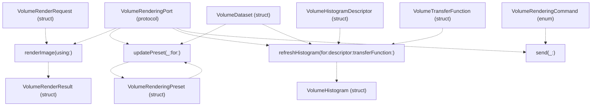
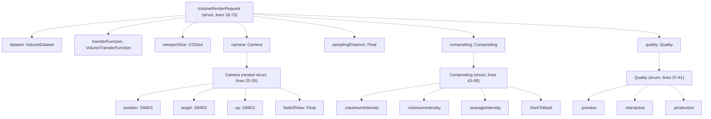
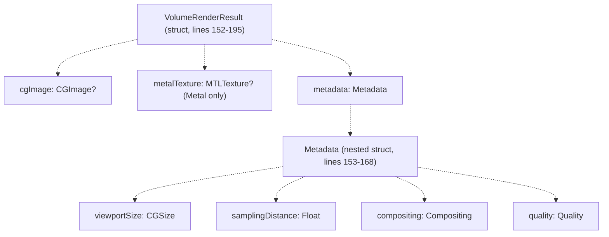
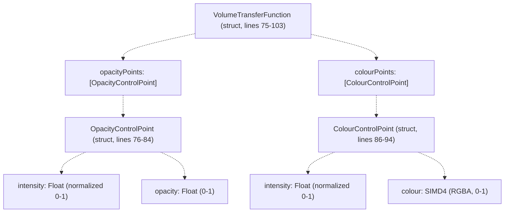
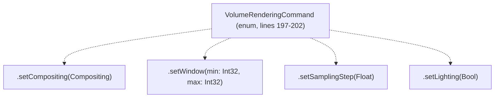
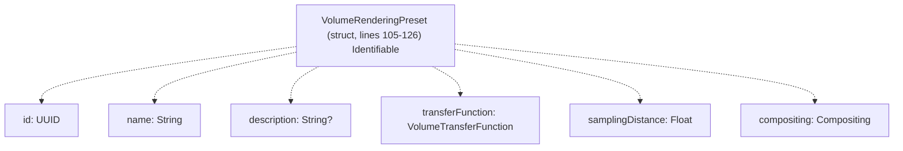
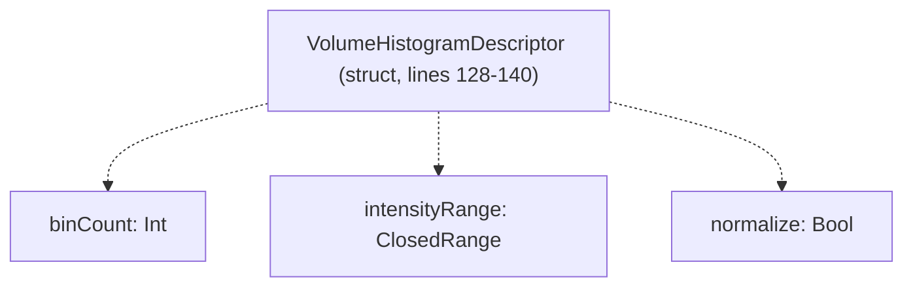
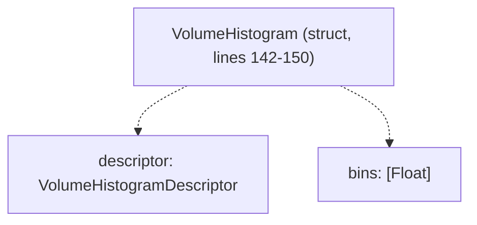

# VolumeRenderingPort

> **Relevant source files**
> * [Sources/MTKCore/Domain/VolumeRenderingPort.swift](https://github.com/ThalesMMS/MTK/blob/eda6f990/Sources/MTKCore/Domain/VolumeRenderingPort.swift)

## Purpose and Scope

`VolumeRenderingPort` is a protocol in [Sources/MTKCore/Domain/VolumeRenderingPort.swift](https://github.com/ThalesMMS/MTK/blob/eda6f990/Sources/MTKCore/Domain/VolumeRenderingPort.swift)

 that defines the domain contract for volume rendering operations. It decouples rendering infrastructure from presentation layers by using only Foundation, CoreGraphics, and SIMD types—no SceneKit or Metal types appear in the protocol interface.

The protocol declares four asynchronous methods:

* `renderImage(using:)` - Execute a complete volume render
* `updatePreset(_:for:)` - Apply a rendering preset to a dataset
* `refreshHistogram(for:descriptor:transferFunction:)` - Compute intensity histogram
* `send(_:)` - Send immediate rendering command

This page documents the protocol interface, its associated data structures, and the design principles underlying the abstraction. For the Metal-based implementation, see page 7.1. For transfer function texture generation, see page 4.2. For the `VolumeDataset` structure, see page 5.1.

**Sources:** [Sources/MTKCore/Domain/VolumeRenderingPort.swift L1-L213](https://github.com/ThalesMMS/MTK/blob/eda6f990/Sources/MTKCore/Domain/VolumeRenderingPort.swift#L1-L213)

---

## Protocol Interface

`VolumeRenderingPort` declares four methods at [Sources/MTKCore/Domain/VolumeRenderingPort.swift L204-L212](https://github.com/ThalesMMS/MTK/blob/eda6f990/Sources/MTKCore/Domain/VolumeRenderingPort.swift#L204-L212)

:

```
public protocol VolumeRenderingPort: Sendable {    func renderImage(using request: VolumeRenderRequest) async throws -> VolumeRenderResult    func updatePreset(_ preset: VolumeRenderingPreset,                      for dataset: VolumeDataset) async throws -> [VolumeRenderingPreset]    func refreshHistogram(for dataset: VolumeDataset,                          descriptor: VolumeHistogramDescriptor,                          transferFunction: VolumeTransferFunction) async throws -> VolumeHistogram    func send(_ command: VolumeRenderingCommand) async throws}
```

**Protocol Method Reference**



| Method | Return Type | Parameters |
| --- | --- | --- |
| `renderImage(using:)` | `VolumeRenderResult` | `request: VolumeRenderRequest` |
| `updatePreset(_:for:)` | `[VolumeRenderingPreset]` | `preset: VolumeRenderingPreset`, `dataset: VolumeDataset` |
| `refreshHistogram(for:descriptor:transferFunction:)` | `VolumeHistogram` | `dataset: VolumeDataset`, `descriptor: VolumeHistogramDescriptor`, `transferFunction: VolumeTransferFunction` |
| `send(_:)` | `Void` | `command: VolumeRenderingCommand` |

All methods are `async throws`. Implementations perform GPU operations on background queues and propagate errors (e.g., Metal device unavailable, texture allocation failure).

**Sources:** [Sources/MTKCore/Domain/VolumeRenderingPort.swift L204-L212](https://github.com/ThalesMMS/MTK/blob/eda6f990/Sources/MTKCore/Domain/VolumeRenderingPort.swift#L204-L212)

---

## VolumeRenderRequest Structure

`VolumeRenderRequest` is a `Sendable`, `Equatable` struct at [Sources/MTKCore/Domain/VolumeRenderingPort.swift L19-L73](https://github.com/ThalesMMS/MTK/blob/eda6f990/Sources/MTKCore/Domain/VolumeRenderingPort.swift#L19-L73)

 that packages all parameters for a single render operation.

**Structure Definition**



**Sources:** [Sources/MTKCore/Domain/VolumeRenderingPort.swift L19-L73](https://github.com/ThalesMMS/MTK/blob/eda6f990/Sources/MTKCore/Domain/VolumeRenderingPort.swift#L19-L73)

**Camera Properties** (lines 20-35)

| Property | Type | Description |
| --- | --- | --- |
| `position` | `SIMD3<Float>` | Camera position in world space |
| `target` | `SIMD3<Float>` | Look-at point in world space |
| `up` | `SIMD3<Float>` | Up vector for camera orientation |
| `fieldOfView` | `Float` | Vertical field of view in radians |

The view direction is `normalize(target - position)`. The camera uses a look-at model compatible with SceneKit's camera conventions.

**Quality Enum** (lines 37-41)

| Case | Rendering Characteristics |
| --- | --- |
| `.preview` | Low sampling rate, reduced resolution |
| `.interactive` | Balanced sampling for real-time interaction |
| `.production` | Maximum sampling, full resolution |

**Compositing Enum** (lines 43-48)

| Case | Ray Sample Accumulation Method |
| --- | --- |
| `.maximumIntensity` | Maximum Intensity Projection (MIP) |
| `.minimumIntensity` | Minimum Intensity Projection (MinIP) |
| `.averageIntensity` | Average Intensity Projection (AvgIP) |
| `.frontToBack` | Direct Volume Rendering (DVR) with opacity |

**Sources:** [Sources/MTKCore/Domain/VolumeRenderingPort.swift L20-L48](https://github.com/ThalesMMS/MTK/blob/eda6f990/Sources/MTKCore/Domain/VolumeRenderingPort.swift#L20-L48)

---

## VolumeRenderResult Structure

`VolumeRenderResult` at [Sources/MTKCore/Domain/VolumeRenderingPort.swift L152-L195](https://github.com/ThalesMMS/MTK/blob/eda6f990/Sources/MTKCore/Domain/VolumeRenderingPort.swift#L152-L195)

 wraps rendered output in two formats: `CGImage` for CPU consumption and `MTLTexture` for GPU pipelines.

**Structure Definition**



| Property | Type | Optional | Description |
| --- | --- | --- | --- |
| `cgImage` | `CGImage?` | Yes | CoreGraphics image (RGBA) |
| `metalTexture` | `MTLTexture?` | Yes | Metal texture (BGRA8Unorm), Metal platforms only |
| `metadata` | `Metadata` | No | Original request parameters |

The struct is marked `@unchecked Sendable` at line 195. `CGImage` and `MTLTexture` are reference types but immutable after construction.

**Sources:** [Sources/MTKCore/Domain/VolumeRenderingPort.swift L152-L195](https://github.com/ThalesMMS/MTK/blob/eda6f990/Sources/MTKCore/Domain/VolumeRenderingPort.swift#L152-L195)

---

## VolumeTransferFunction Structure

`VolumeTransferFunction` at [Sources/MTKCore/Domain/VolumeRenderingPort.swift L75-L103](https://github.com/ThalesMMS/MTK/blob/eda6f990/Sources/MTKCore/Domain/VolumeRenderingPort.swift#L75-L103)

 defines intensity-to-color and intensity-to-opacity mappings for volume rendering.

**Structure Definition**



**Control Point Structures**

`OpacityControlPoint` (lines 76-84):

| Property | Type | Description |
| --- | --- | --- |
| `intensity` | `Float` | Normalized intensity (0.0 to 1.0) |
| `opacity` | `Float` | Opacity value (0.0 to 1.0) |

`ColourControlPoint` (lines 86-94):

| Property | Type | Description |
| --- | --- | --- |
| `intensity` | `Float` | Normalized intensity (0.0 to 1.0) |
| `colour` | `SIMD4<Float>` | RGBA color (0.0 to 1.0 per channel) |

Control points are interpolated (typically linear) between specified intensities. Control points should be sorted by intensity, though this is not enforced by the protocol. For texture generation from transfer functions, see page 4.2.

**Sources:** [Sources/MTKCore/Domain/VolumeRenderingPort.swift L75-L103](https://github.com/ThalesMMS/MTK/blob/eda6f990/Sources/MTKCore/Domain/VolumeRenderingPort.swift#L75-L103)

---

## VolumeRenderingCommand Enum

`VolumeRenderingCommand` at [Sources/MTKCore/Domain/VolumeRenderingPort.swift L197-L202](https://github.com/ThalesMMS/MTK/blob/eda6f990/Sources/MTKCore/Domain/VolumeRenderingPort.swift#L197-L202)

 provides immediate parameter updates without full render requests.

**Enum Definition**



| Case | Parameters | Effect |
| --- | --- | --- |
| `.setCompositing` | `Compositing` | Change compositing method |
| `.setWindow` | `min: Int32`, `max: Int32` | Update HU window/level range |
| `.setSamplingStep` | `Float` | Adjust ray marching step size |
| `.setLighting` | `Bool` | Toggle shading calculations |

Commands are sent via `send(_:)` and take effect immediately without returning a result. They update internal rendering state for subsequent frames.

**Sources:** [Sources/MTKCore/Domain/VolumeRenderingPort.swift L197-L202](https://github.com/ThalesMMS/MTK/blob/eda6f990/Sources/MTKCore/Domain/VolumeRenderingPort.swift#L197-L202)

---

## VolumeRenderingPreset Structure

`VolumeRenderingPreset` at [Sources/MTKCore/Domain/VolumeRenderingPort.swift L105-L126](https://github.com/ThalesMMS/MTK/blob/eda6f990/Sources/MTKCore/Domain/VolumeRenderingPort.swift#L105-L126)

 packages a complete rendering configuration for common workflows (e.g., "CT Bone", "MRI T1").

**Structure Definition**



| Property | Type | Optional | Description |
| --- | --- | --- | --- |
| `id` | `UUID` | No | Unique identifier (default: auto-generated) |
| `name` | `String` | No | Display name |
| `description` | `String?` | Yes | Optional description |
| `transferFunction` | `VolumeTransferFunction` | No | Color/opacity mapping |
| `samplingDistance` | `Float` | No | Ray marching step size |
| `compositing` | `Compositing` | No | Accumulation method |

The struct conforms to `Identifiable` for SwiftUI compatibility. The `updatePreset(_:for:)` method applies a preset to a dataset and returns an array of presets (potentially including adjusted versions based on dataset intensity range).

**Sources:** [Sources/MTKCore/Domain/VolumeRenderingPort.swift L105-L126](https://github.com/ThalesMMS/MTK/blob/eda6f990/Sources/MTKCore/Domain/VolumeRenderingPort.swift#L105-L126)

---

## Histogram Structures

The histogram API at [Sources/MTKCore/Domain/VolumeRenderingPort.swift L128-L150](https://github.com/ThalesMMS/MTK/blob/eda6f990/Sources/MTKCore/Domain/VolumeRenderingPort.swift#L128-L150)

 analyzes voxel intensity distribution for transfer function design and HU window adjustment.

### VolumeHistogramDescriptor

Specifies histogram computation parameters (lines 128-140):



| Property | Type | Description |
| --- | --- | --- |
| `binCount` | `Int` | Number of histogram bins |
| `intensityRange` | `ClosedRange<Float>` | Intensity range to analyze |
| `normalize` | `Bool` | If `true`, normalize bin values to [0.0, 1.0] |

### VolumeHistogram

Contains computed histogram data (lines 142-150):



| Property | Type | Description |
| --- | --- | --- |
| `descriptor` | `VolumeHistogramDescriptor` | Original request parameters |
| `bins` | `[Float]` | Bin values (count or normalized), length = `binCount` |

The `bins` array contains voxel counts per intensity range. Example: `binCount = 256`, `intensityRange = -1000...3000` produces bins of width 15.625 HU each (4000 HU / 256 bins).

**Sources:** [Sources/MTKCore/Domain/VolumeRenderingPort.swift L128-L150](https://github.com/ThalesMMS/MTK/blob/eda6f990/Sources/MTKCore/Domain/VolumeRenderingPort.swift#L128-L150)

---

## Design Principles

The `VolumeRenderingPort` protocol embodies several key architectural decisions:

### 1. Framework Agnosticism

The protocol is intentionally independent of SceneKit, Metal, or SwiftUI. All types use Foundation (`CGSize`), CoreGraphics (`CGImage`), and SIMD types (`SIMD3<Float>`, `SIMD4<Float>`), ensuring compatibility with any presentation layer.

**Sources:** [Sources/MTKCore/Domain/VolumeRenderingPort.swift L1-L18](https://github.com/ThalesMMS/MTK/blob/eda6f990/Sources/MTKCore/Domain/VolumeRenderingPort.swift#L1-L18)

### 2. Value Semantics

All request and result types are `struct`s marked `Sendable`, enabling:

* Thread-safe parameter passing across actor boundaries
* Immutable snapshots of rendering state
* Value-based equality comparison for caching

The only exception is `VolumeRenderResult`, which wraps reference types (`CGImage`, `MTLTexture`) but guarantees immutability.

**Sources:** [Sources/MTKCore/Domain/VolumeRenderingPort.swift L19-L195](https://github.com/ThalesMMS/MTK/blob/eda6f990/Sources/MTKCore/Domain/VolumeRenderingPort.swift#L19-L195)

### 3. Async/Throws Interface

All protocol methods are `async throws`, allowing implementations to:

* Perform GPU operations without blocking the main thread
* Propagate Metal allocation failures or shader compilation errors
* Support cooperative cancellation via Swift structured concurrency

**Sources:** [Sources/MTKCore/Domain/VolumeRenderingPort.swift L204-L212](https://github.com/ThalesMMS/MTK/blob/eda6f990/Sources/MTKCore/Domain/VolumeRenderingPort.swift#L204-L212)

### 4. Dual Output Formats

`VolumeRenderResult` provides both `CGImage` and `MTLTexture?` outputs, supporting:

* **CGImage path:** AppKit/UIKit image views, file export, CPU-based post-processing
* **MTLTexture path:** Direct Metal rendering pipelines, texture-based effects, zero-copy compositor integration

The MPS backend (see [Metal Performance Shaders Backend](2b%20Metal-Performance-Shaders-Backend.md)) can bypass `CGImage` generation entirely when the caller only needs the Metal texture.

**Sources:** [Sources/MTKCore/Domain/VolumeRenderingPort.swift L170-L192](https://github.com/ThalesMMS/MTK/blob/eda6f990/Sources/MTKCore/Domain/VolumeRenderingPort.swift#L170-L192)

### 5. Command-Query Separation

The protocol separates:

* **Query operations:** `renderImage(using:)`, `refreshHistogram(for:descriptor:transferFunction:)` return results
* **Command operations:** `send(_:)` modifies state without returning a result
* **Hybrid operation:** `updatePreset(_:for:)` both applies a preset and returns the updated preset list

This separation enables optimizations like batching commands before the next render cycle.

**Sources:** [Sources/MTKCore/Domain/VolumeRenderingPort.swift L204-L212](https://github.com/ThalesMMS/MTK/blob/eda6f990/Sources/MTKCore/Domain/VolumeRenderingPort.swift#L204-L212)

---

## Implementation Reference

The primary implementation of `VolumeRenderingPort` is `MetalVolumeRenderingAdapter`, documented in [MetalVolumeRenderingAdapter](7a%20MetalVolumeRenderingAdapter.md). This implementation:

* Uses Metal compute shaders for ray casting
* Falls back to CPU-based rendering when Metal is unavailable
* Caches textures and buffers to minimize GPU memory allocations
* Integrates with `ArgumentEncoderManager` for efficient parameter encoding

**Sources:** [Sources/MTKCore/Domain/VolumeRenderingPort.swift L1-L213](https://github.com/ThalesMMS/MTK/blob/eda6f990/Sources/MTKCore/Domain/VolumeRenderingPort.swift#L1-L213)


### On this page

* [VolumeRenderingPort](#8.1-volumerenderingport)
* [Purpose and Scope](#8.1-purpose-and-scope)
* [Protocol Interface](#8.1-protocol-interface)
* [VolumeRenderRequest Structure](#8.1-volumerenderrequest-structure)
* [VolumeRenderResult Structure](#8.1-volumerenderresult-structure)
* [VolumeTransferFunction Structure](#8.1-volumetransferfunction-structure)
* [VolumeRenderingCommand Enum](#8.1-volumerenderingcommand-enum)
* [VolumeRenderingPreset Structure](#8.1-volumerenderingpreset-structure)
* [Histogram Structures](#8.1-histogram-structures)
* [VolumeHistogramDescriptor](#8.1-volumehistogramdescriptor)
* [VolumeHistogram](#8.1-volumehistogram)
* [Design Principles](#8.1-design-principles)
* [1. Framework Agnosticism](#8.1-1-framework-agnosticism)
* [2. Value Semantics](#8.1-2-value-semantics)
* [3. Async/Throws Interface](#8.1-3-asyncthrows-interface)
* [4. Dual Output Formats](#8.1-4-dual-output-formats)
* [5. Command-Query Separation](#8.1-5-command-query-separation)
* [Implementation Reference](#8.1-implementation-reference)

Ask Devin about MTK