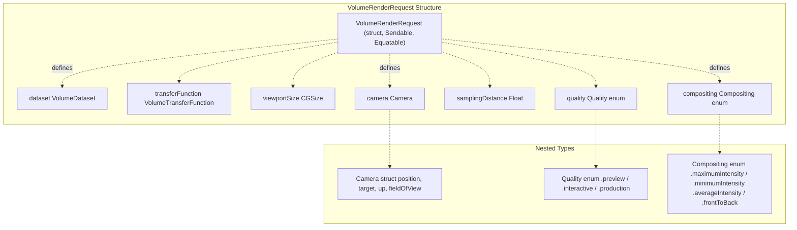
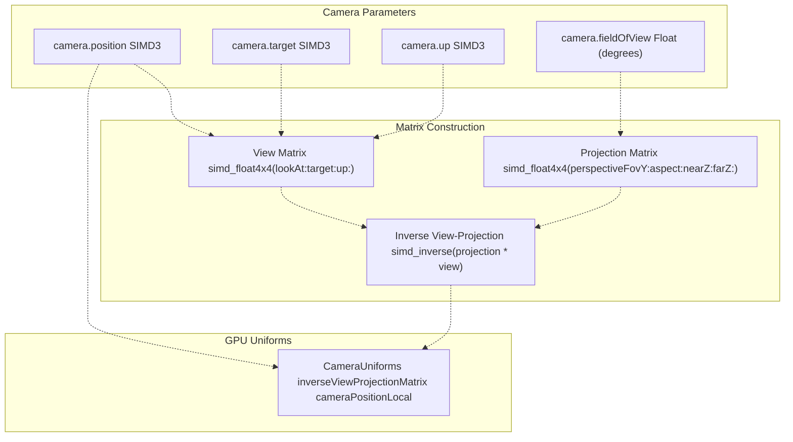
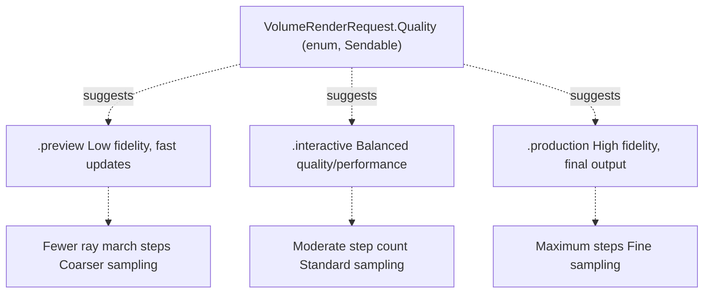
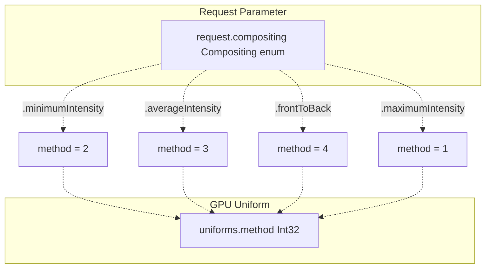
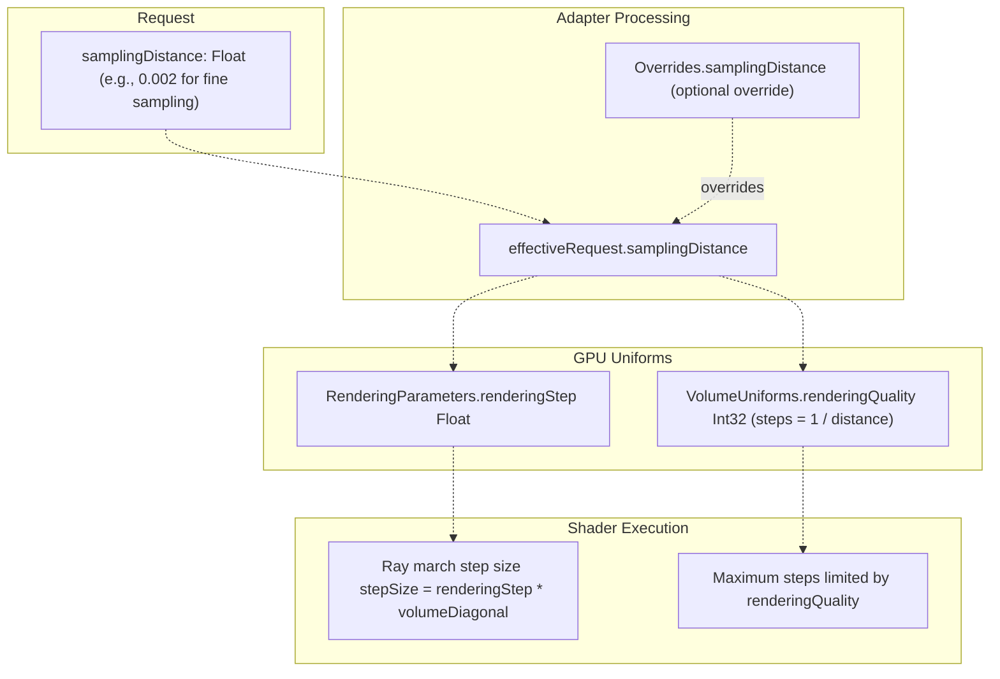
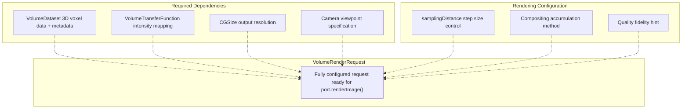
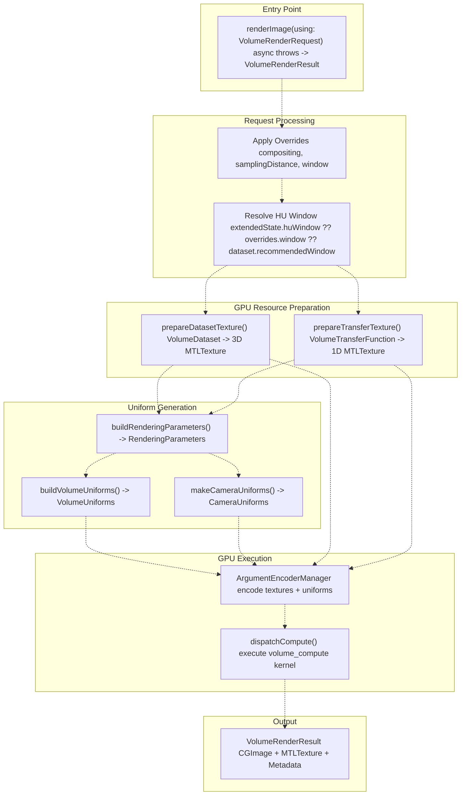
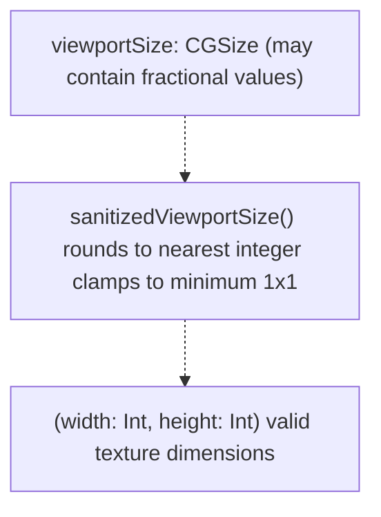
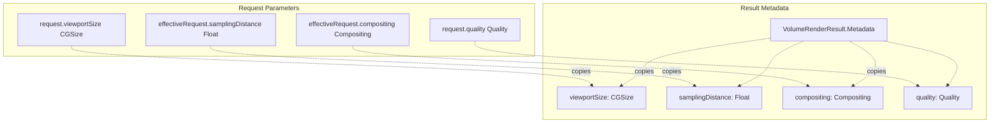

# Rendering Request Model

> **Relevant source files**
> * [Sources/MTKCore/Domain/VolumeRenderingPort.swift](https://github.com/ThalesMMS/MTK/blob/eda6f990/Sources/MTKCore/Domain/VolumeRenderingPort.swift)

## Purpose and Scope

This page documents the `VolumeRenderRequest` structure, which serves as the primary data contract for requesting volumetric rendering operations through the `VolumeRenderingPort` protocol. The request model encapsulates all parameters necessary for a single rendering pass: camera configuration, quality settings, compositing method, and sampling parameters.

For information about the protocol that consumes this request, see [VolumeRenderingPort](8a%20VolumeRenderingPort.md). For details about how requests are transformed into GPU resources, see [MetalVolumeRenderingAdapter](7a%20MetalVolumeRenderingAdapter.md).

**Sources:** [Sources/MTKCore/Domain/VolumeRenderingPort.swift L19-L73](https://github.com/ThalesMMS/MTK/blob/eda6f990/Sources/MTKCore/Domain/VolumeRenderingPort.swift#L19-L73)

---

## Request Structure Overview

The `VolumeRenderRequest` struct is a `Sendable` and `Equatable` value type that packages all rendering parameters into a single atomic unit. This design ensures thread-safe transmission across actor boundaries and enables efficient caching through value semantics.



**Sources:** [Sources/MTKCore/Domain/VolumeRenderingPort.swift L19-L73](https://github.com/ThalesMMS/MTK/blob/eda6f990/Sources/MTKCore/Domain/VolumeRenderingPort.swift#L19-L73)

---

## Camera Configuration

The `VolumeRenderRequest.Camera` nested struct defines the viewpoint for volumetric rendering using a standard look-at camera model. All spatial coordinates are specified in normalized texture space where the volume occupies the unit cube [0, 1]³.

### Camera Structure

| Property | Type | Description |
| --- | --- | --- |
| `position` | `SIMD3<Float>` | Camera eye position in texture space |
| `target` | `SIMD3<Float>` | Point the camera is looking at |
| `up` | `SIMD3<Float>` | Up vector defining camera roll |
| `fieldOfView` | `Float` | Vertical field of view in degrees |

### Camera Matrix Construction

The adapter transforms the camera specification into view and projection matrices for GPU consumption:



The view matrix is constructed using a look-at transformation [Sources/MTKCore/Adapters/MetalVolumeRenderingAdapter.swift L861-L886](https://github.com/ThalesMMS/MTK/blob/eda6f990/Sources/MTKCore/Adapters/MetalVolumeRenderingAdapter.swift#L861-L886)

 and the projection matrix uses a perspective projection [Sources/MTKCore/Adapters/MetalVolumeRenderingAdapter.swift L888-L904](https://github.com/ThalesMMS/MTK/blob/eda6f990/Sources/MTKCore/Adapters/MetalVolumeRenderingAdapter.swift#L888-L904)

 The adapter computes dynamic near/far clipping planes based on camera distance from the volume center [Sources/MTKCore/Adapters/MetalVolumeRenderingAdapter.swift L733-L742](https://github.com/ThalesMMS/MTK/blob/eda6f990/Sources/MTKCore/Adapters/MetalVolumeRenderingAdapter.swift#L733-L742)

**Sources:** [Sources/MTKCore/Domain/VolumeRenderingPort.swift L20-L35](https://github.com/ThalesMMS/MTK/blob/eda6f990/Sources/MTKCore/Domain/VolumeRenderingPort.swift#L20-L35)

 [Sources/MTKCore/Adapters/MetalVolumeRenderingAdapter.swift L713-L752](https://github.com/ThalesMMS/MTK/blob/eda6f990/Sources/MTKCore/Adapters/MetalVolumeRenderingAdapter.swift#L713-L752)

---

## Quality Levels

The `Quality` enum provides semantic quality presets that influence rendering fidelity and performance. The adapter interprets quality levels to derive appropriate sampling parameters.



### Quality Interpretation

The quality level is stored in request metadata but does not directly control rendering parameters. Instead, applications can use quality as a hint when setting `samplingDistance`. The adapter derives the `renderingQuality` uniform from `samplingDistance` [Sources/MTKCore/Adapters/MetalVolumeRenderingAdapter.swift L564-L565](https://github.com/ThalesMMS/MTK/blob/eda6f990/Sources/MTKCore/Adapters/MetalVolumeRenderingAdapter.swift#L564-L565)

:

```
steps = max(1, Int32(roundf(1.0 / max(samplingDistance, 1e-5))))
uniforms.renderingQuality = steps
```

**Sources:** [Sources/MTKCore/Domain/VolumeRenderingPort.swift L37-L41](https://github.com/ThalesMMS/MTK/blob/eda6f990/Sources/MTKCore/Domain/VolumeRenderingPort.swift#L37-L41)

 [Sources/MTKCore/Adapters/MetalVolumeRenderingAdapter.swift L564-L566](https://github.com/ThalesMMS/MTK/blob/eda6f990/Sources/MTKCore/Adapters/MetalVolumeRenderingAdapter.swift#L564-L566)

---

## Compositing Methods

The `Compositing` enum specifies how samples along a ray are accumulated into the final pixel value. This determines the visual style and diagnostic utility of the rendered volume.

### Compositing Modes

| Mode | Enum Case | Method Value | Description |
| --- | --- | --- | --- |
| **Direct Volume Rendering** | `.frontToBack` | `1` | Front-to-back alpha compositing with early ray termination |
| **Maximum Intensity Projection** | `.maximumIntensity` | `2` | Displays maximum intensity encountered along ray |
| **Minimum Intensity Projection** | `.minimumIntensity` | `3` | Displays minimum intensity encountered along ray |
| **Average Intensity Projection** | `.averageIntensity` | `4` | Displays mean intensity along ray |

### Compositing Mode Translation



The adapter translates the compositing enum to an integer method code for GPU consumption [Sources/MTKCore/Adapters/MetalVolumeRenderingAdapter.swift L567-L576](https://github.com/ThalesMMS/MTK/blob/eda6f990/Sources/MTKCore/Adapters/MetalVolumeRenderingAdapter.swift#L567-L576)

 The `.frontToBack` mode enables early ray termination when accumulated opacity exceeds a threshold [Sources/MTKCore/Adapters/MetalVolumeRenderingAdapter.swift L528](https://github.com/ThalesMMS/MTK/blob/eda6f990/Sources/MTKCore/Adapters/MetalVolumeRenderingAdapter.swift#L528-L528)

**Sources:** [Sources/MTKCore/Domain/VolumeRenderingPort.swift L43-L48](https://github.com/ThalesMMS/MTK/blob/eda6f990/Sources/MTKCore/Domain/VolumeRenderingPort.swift#L43-L48)

 [Sources/MTKCore/Adapters/MetalVolumeRenderingAdapter.swift L567-L576](https://github.com/ThalesMMS/MTK/blob/eda6f990/Sources/MTKCore/Adapters/MetalVolumeRenderingAdapter.swift#L567-L576)

---

## Sampling Distance

The `samplingDistance` property controls the step size used during ray marching, specified as a fraction of the volume diagonal. Smaller values produce higher quality at increased computational cost.

### Sampling Parameter Flow



### Typical Sampling Values

| Scenario | Sampling Distance | Computed Steps | Use Case |
| --- | --- | --- | --- |
| Preview | 0.01 | 100 | Fast navigation |
| Interactive | 0.005 | 200 | Real-time manipulation |
| High Quality | 0.002 | 500 | Final rendering |
| Production | 0.001 | 1000 | Maximum fidelity |

The adapter allows runtime override of sampling distance via the `Overrides` mechanism [Sources/MTKCore/Adapters/MetalVolumeRenderingAdapter.swift L55-L60](https://github.com/ThalesMMS/MTK/blob/eda6f990/Sources/MTKCore/Adapters/MetalVolumeRenderingAdapter.swift#L55-L60)

 enabling dynamic quality adjustment without reconstructing the request.

**Sources:** [Sources/MTKCore/Domain/VolumeRenderingPort.swift L54](https://github.com/ThalesMMS/MTK/blob/eda6f990/Sources/MTKCore/Domain/VolumeRenderingPort.swift#L54-L54)

 [Sources/MTKCore/Adapters/MetalVolumeRenderingAdapter.swift L148-L152](https://github.com/ThalesMMS/MTK/blob/eda6f990/Sources/MTKCore/Adapters/MetalVolumeRenderingAdapter.swift#L148-L152)

 [Sources/MTKCore/Adapters/MetalVolumeRenderingAdapter.swift L527](https://github.com/ThalesMMS/MTK/blob/eda6f990/Sources/MTKCore/Adapters/MetalVolumeRenderingAdapter.swift#L527-L527)

 [Sources/MTKCore/Adapters/MetalVolumeRenderingAdapter.swift L564-L565](https://github.com/ThalesMMS/MTK/blob/eda6f990/Sources/MTKCore/Adapters/MetalVolumeRenderingAdapter.swift#L564-L565)

---

## Request Construction

The `VolumeRenderRequest` initializer requires all parameters to be explicitly specified, ensuring complete configuration at construction time.

### Initialization

```
public init(dataset: VolumeDataset,            transferFunction: VolumeTransferFunction,            viewportSize: CGSize,            camera: Camera,            samplingDistance: Float,            compositing: Compositing,            quality: Quality)
```

### Parameter Dependencies



The request structure enforces immutability after construction—all properties are read-only. Applications that need to modify parameters must construct a new request instance.

**Sources:** [Sources/MTKCore/Domain/VolumeRenderingPort.swift L58-L72](https://github.com/ThalesMMS/MTK/blob/eda6f990/Sources/MTKCore/Domain/VolumeRenderingPort.swift#L58-L72)

---

## Request Consumption in Rendering Pipeline

The adapter consumes `VolumeRenderRequest` through multiple transformation stages, ultimately producing GPU uniforms and Metal textures.

### Rendering Pipeline Flow



### Key Transformation Functions

| Function | Input | Output | Purpose |
| --- | --- | --- | --- |
| `renderImage(using:)` | `VolumeRenderRequest` | `VolumeRenderResult` | Entry point, orchestrates pipeline |
| `buildRenderingParameters(for:)` | `VolumeRenderRequest` | `RenderingParameters` | Aggregate uniform struct |
| `buildVolumeUniforms(for:)` | `VolumeRenderRequest` | `VolumeUniforms` | Volume-specific uniforms |
| `makeCameraUniforms(for:)` | `VolumeRenderRequest` | `CameraUniforms` | Camera matrices |
| `prepareDatasetTexture(for:)` | `VolumeDataset` | `MTLTexture` | 3D volume texture |
| `prepareTransferTexture(for:)` | `VolumeTransferFunction` | `MTLTexture` | 1D transfer LUT |

The adapter maintains caching for dataset and transfer function textures, reusing them when the request parameters match cached identity [Sources/MTKCore/Adapters/MetalVolumeRenderingAdapter.swift L427-L444](https://github.com/ThalesMMS/MTK/blob/eda6f990/Sources/MTKCore/Adapters/MetalVolumeRenderingAdapter.swift#L427-L444)

 [Sources/MTKCore/Adapters/MetalVolumeRenderingAdapter.swift L446-L467](https://github.com/ThalesMMS/MTK/blob/eda6f990/Sources/MTKCore/Adapters/MetalVolumeRenderingAdapter.swift#L446-L467)

**Sources:** [Sources/MTKCore/Adapters/MetalVolumeRenderingAdapter.swift L134-L199](https://github.com/ThalesMMS/MTK/blob/eda6f990/Sources/MTKCore/Adapters/MetalVolumeRenderingAdapter.swift#L134-L199)

 [Sources/MTKCore/Adapters/MetalVolumeRenderingAdapter.swift L366-L419](https://github.com/ThalesMMS/MTK/blob/eda6f990/Sources/MTKCore/Adapters/MetalVolumeRenderingAdapter.swift#L366-L419)

 [Sources/MTKCore/Adapters/MetalVolumeRenderingAdapter.swift L524-L597](https://github.com/ThalesMMS/MTK/blob/eda6f990/Sources/MTKCore/Adapters/MetalVolumeRenderingAdapter.swift#L524-L597)

---

## Request Validation and Sanitization

The adapter performs defensive validation and sanitization of request parameters to prevent rendering failures.

### Viewport Sanitization



The `sanitizedViewportSize` function ensures dimensions are positive integers suitable for Metal texture allocation [Sources/MTKCore/Adapters/MetalVolumeRenderingAdapter.swift L421-L425](https://github.com/ThalesMMS/MTK/blob/eda6f990/Sources/MTKCore/Adapters/MetalVolumeRenderingAdapter.swift#L421-L425)

:

```
let width = max(1, Int(size.width.rounded(.toNearestOrEven)))let height = max(1, Int(size.height.rounded(.toNearestOrEven)))
```

### Sampling Distance Validation

The adapter guards against zero or negative sampling distances when computing step counts [Sources/MTKCore/Adapters/MetalVolumeRenderingAdapter.swift L564](https://github.com/ThalesMMS/MTK/blob/eda6f990/Sources/MTKCore/Adapters/MetalVolumeRenderingAdapter.swift#L564-L564)

:

```
let steps = max(1, Int32(roundf(1.0 / max(samplingDistance, 1e-5))))
```

### Camera Matrix Stability

When constructing view matrices, the adapter validates finite vector components and provides fallback axes if cross products fail [Sources/MTKCore/Adapters/MetalVolumeRenderingAdapter.swift L865-L872](https://github.com/ThalesMMS/MTK/blob/eda6f990/Sources/MTKCore/Adapters/MetalVolumeRenderingAdapter.swift#L865-L872)

:

```
var xAxis = simd_normalize(simd_cross(up, zAxis))if !xAxis.allFinite {    xAxis = SIMD3<Float>(1, 0, 0)}
```

This defensive approach ensures graceful degradation even when applications provide degenerate camera configurations.

**Sources:** [Sources/MTKCore/Adapters/MetalVolumeRenderingAdapter.swift L421-L425](https://github.com/ThalesMMS/MTK/blob/eda6f990/Sources/MTKCore/Adapters/MetalVolumeRenderingAdapter.swift#L421-L425)

 [Sources/MTKCore/Adapters/MetalVolumeRenderingAdapter.swift L564-L566](https://github.com/ThalesMMS/MTK/blob/eda6f990/Sources/MTKCore/Adapters/MetalVolumeRenderingAdapter.swift#L564-L566)

 [Sources/MTKCore/Adapters/MetalVolumeRenderingAdapter.swift L861-L886](https://github.com/ThalesMMS/MTK/blob/eda6f990/Sources/MTKCore/Adapters/MetalVolumeRenderingAdapter.swift#L861-L886)

---

## Metadata Propagation

The `VolumeRenderResult.Metadata` structure captures a snapshot of the effective request parameters used during rendering, enabling consumers to understand what settings produced a given output.

### Metadata Structure



The metadata reflects the *effective* parameters after override application [Sources/MTKCore/Adapters/MetalVolumeRenderingAdapter.swift L410-L415](https://github.com/ThalesMMS/MTK/blob/eda6f990/Sources/MTKCore/Adapters/MetalVolumeRenderingAdapter.swift#L410-L415)

 providing transparency about what actually rendered. This enables debugging and cache validation.

**Sources:** [Sources/MTKCore/Domain/VolumeRenderingPort.swift L152-L168](https://github.com/ThalesMMS/MTK/blob/eda6f990/Sources/MTKCore/Domain/VolumeRenderingPort.swift#L152-L168)

 [Sources/MTKCore/Adapters/MetalVolumeRenderingAdapter.swift L410-L416](https://github.com/ThalesMMS/MTK/blob/eda6f990/Sources/MTKCore/Adapters/MetalVolumeRenderingAdapter.swift#L410-L416)


### On this page

- [Rendering Request Model](#rendering-request-model)
  - [Purpose and Scope](#purpose-and-scope)
  - [Request Structure Overview](#request-structure-overview)
  - [Camera Configuration](#camera-configuration)
    - [Camera Structure](#camera-structure)
    - [Camera Matrix Construction](#camera-matrix-construction)
  - [Quality Levels](#quality-levels)
    - [Quality Interpretation](#quality-interpretation)
  - [Compositing Methods](#compositing-methods)
    - [Compositing Modes](#compositing-modes)
    - [Compositing Mode Translation](#compositing-mode-translation)
  - [Sampling Distance](#sampling-distance)
    - [Sampling Parameter Flow](#sampling-parameter-flow)
    - [Typical Sampling Values](#typical-sampling-values)
  - [Request Construction](#request-construction)
    - [Initialization](#initialization)
    - [Parameter Dependencies](#parameter-dependencies)
  - [Request Consumption in Rendering Pipeline](#request-consumption-in-rendering-pipeline)
    - [Rendering Pipeline Flow](#rendering-pipeline-flow)
    - [Key Transformation Functions](#key-transformation-functions)
  - [Request Validation and Sanitization](#request-validation-and-sanitization)
    - [Viewport Sanitization](#viewport-sanitization)
    - [Sampling Distance Validation](#sampling-distance-validation)
    - [Camera Matrix Stability](#camera-matrix-stability)
  - [Metadata Propagation](#metadata-propagation)
    - [Metadata Structure](#metadata-structure)
    - [On this page](#on-this-page)

Ask Devin about MTK