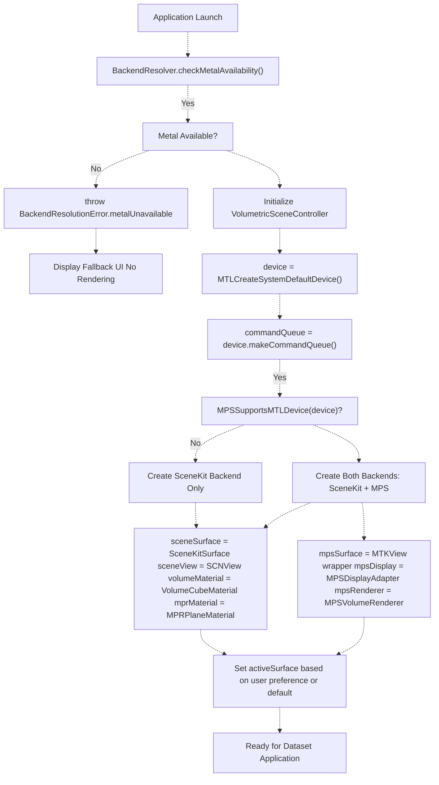
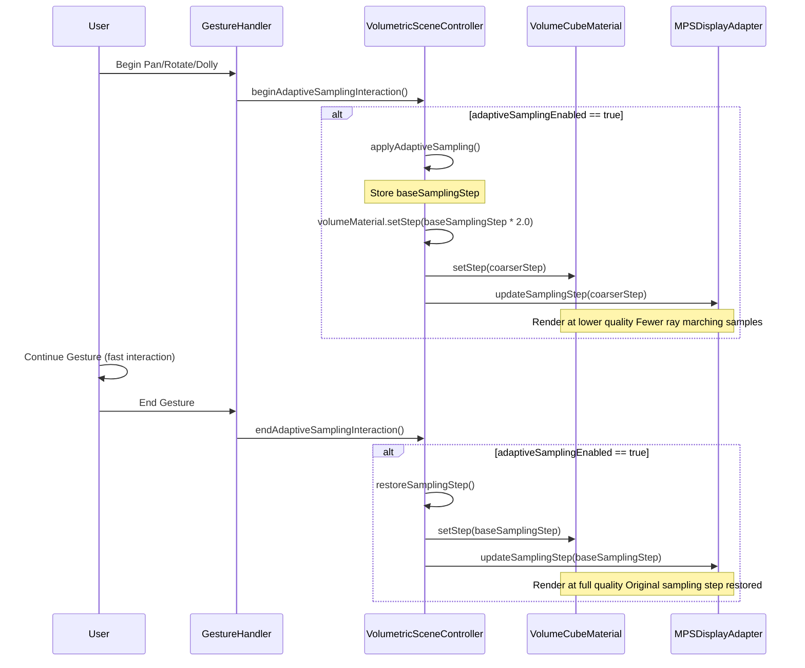
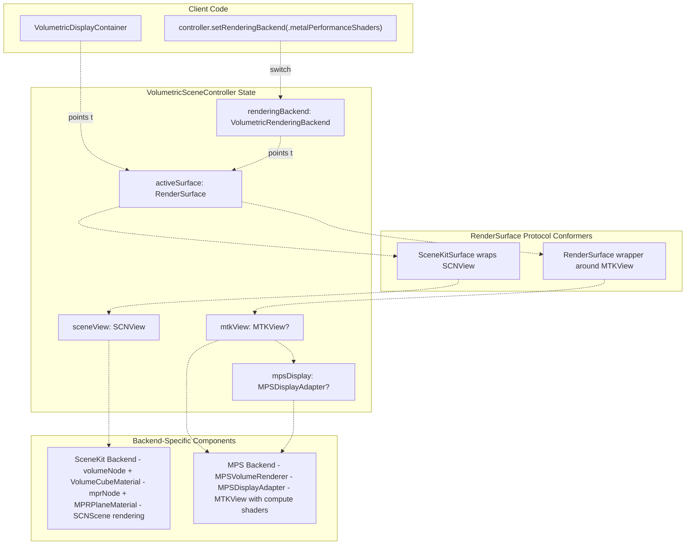
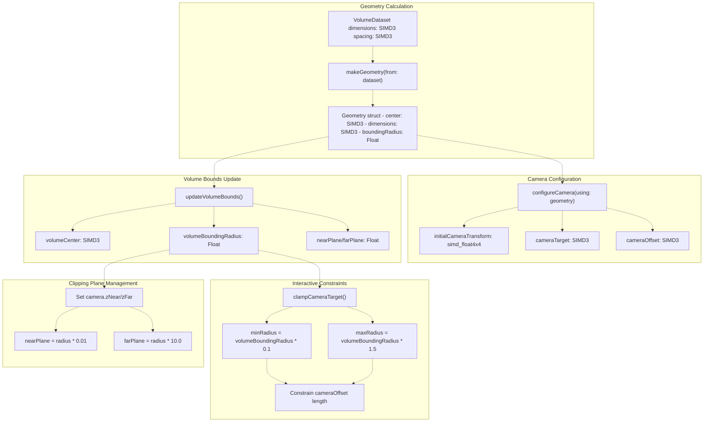
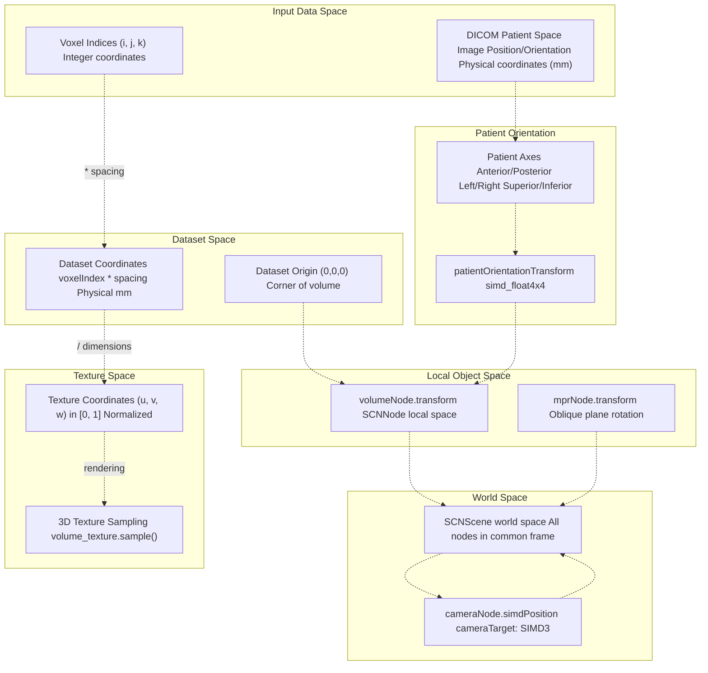

# Advanced Topics

> **Relevant source files**
> * [BACKEND_RESOLVER_USAGE.md](https://github.com/ThalesMMS/MTK/blob/eda6f990/BACKEND_RESOLVER_USAGE.md)
> * [DOCUMENTATION_STANDARD.md](https://github.com/ThalesMMS/MTK/blob/eda6f990/DOCUMENTATION_STANDARD.md)
> * [README.md](https://github.com/ThalesMMS/MTK/blob/eda6f990/README.md)
> * [SURFACE_ADAPTER_DELIVERABLES.txt](https://github.com/ThalesMMS/MTK/blob/eda6f990/SURFACE_ADAPTER_DELIVERABLES.txt)
> * [Sources/MTKUI/VolumetricSceneController+Interaction.swift](https://github.com/ThalesMMS/MTK/blob/eda6f990/Sources/MTKUI/VolumetricSceneController+Interaction.swift)

This page covers advanced architectural patterns and optimization techniques in MTK that support high-performance volumetric rendering. These topics include runtime backend selection, performance optimization strategies, GPU-accelerated ray casting, volume boundary management, and coordinate system transformations.

For basic rendering concepts, see [Rendering Architecture](2%20Rendering-Architecture.md). For the core controller API, see [VolumetricSceneController](3%20VolumetricSceneController.md). For Metal-level infrastructure, see [Metal Rendering Infrastructure](7%20Metal-Rendering-Infrastructure.md).

---

## Overview of Advanced Systems

MTK implements several sophisticated subsystems that work together to deliver smooth, high-quality volumetric rendering across different device capabilities:

| Subsystem | Purpose | Key Components |
| --- | --- | --- |
| **Backend Resolution** | Detect Metal/MPS availability before initialization | `BackendResolver`, `MetalRuntimeAvailability` |
| **Adaptive Sampling** | Reduce sampling step during interaction for performance | `adaptiveSamplingEnabled`, `beginAdaptiveSamplingInteraction()` |
| **MPS Ray Casting** | Pre-compute camera rays for GPU-accelerated rendering | `MPSVolumeRenderer`, ray casting cache |
| **Volume Bounds** | Calculate bounding geometry and clipping planes | `volumeBoundingRadius`, `updateVolumeBounds()` |
| **Coordinate Systems** | Transform between local/world/dataset/texture spaces | `simd_float4x4` transforms, patient orientation |

These systems interact at initialization, during user interaction, and at render time to ensure robust, performant visualization.

**Sources**: README.md

 [VolumetricSceneController L1-L600](https://github.com/ThalesMMS/MTK/blob/eda6f990/VolumetricSceneController+Interaction.swift#L1-L600)

---

## Backend Resolution Initialization Flow

The following diagram shows how MTK determines rendering backend availability at application launch and initializes the appropriate rendering infrastructure:



**Key Decision Points**:

1. **Metal Availability**: `BackendResolver` checks `MetalRuntimeAvailability.isAvailable()` before any Metal resource creation
2. **MPS Device Support**: `MPSSupportsMTLDevice(device)` determines if GPU supports Metal Performance Shaders
3. **Backend Selection**: If MPS is unavailable, only SceneKit backend is created; otherwise both backends are initialized and one is activated

**Error Recovery**: When Metal is unavailable, applications should catch `BackendResolutionError.metalUnavailable` and display alternative UI rather than attempting to create Metal resources.

**Sources**: [BACKEND_RESOLVER_USAGE.md L1-L57](https://github.com/ThalesMMS/MTK/blob/eda6f990/BACKEND_RESOLVER_USAGE.md#L1-L57)

 [VolumetricSceneController L463-L519](https://github.com/ThalesMMS/MTK/blob/eda6f990/VolumetricSceneController+Interaction.swift#L463-L519)

 README.md

---

## Adaptive Sampling Interaction Lifecycle

Adaptive sampling reduces rendering quality temporarily during user interaction to maintain frame rates, then restores full quality when interaction ends:



**Implementation Details**:

| Phase | Sampling Step | Frame Rate | Image Quality |
| --- | --- | --- | --- |
| **Idle** | `baseSamplingStep` (e.g., 0.001) | Standard | High |
| **Interaction** | `baseSamplingStep * 2.0` (e.g., 0.002) | Higher | Reduced |
| **Restoration** | `baseSamplingStep` | Standard | High |

**Code Flow**:

1. Gesture begins → `beginAdaptiveSamplingInteraction()` [VolumetricSceneController L326-L328](https://github.com/ThalesMMS/MTK/blob/eda6f990/VolumetricSceneController+Interaction.swift#L326-L328)
2. Controller checks `adaptiveSamplingEnabled` flag
3. If enabled, `applyAdaptiveSampling()` doubles the sampling step (fewer samples per ray = faster rendering)
4. Both `volumeMaterial` and `mpsDisplay` receive updated step value
5. Gesture ends → `endAdaptiveSamplingInteraction()` [VolumetricSceneController L330-L332](https://github.com/ThalesMMS/MTK/blob/eda6f990/VolumetricSceneController+Interaction.swift#L330-L332)
6. `restoreSamplingStep()` restores original sampling step

**Performance Impact**: Doubling the sampling step can reduce ray marching workload by ~50%, enabling smooth 60 FPS interaction even on complex volumes.

**Sources**: [VolumetricSceneController L313-L332](https://github.com/ThalesMMS/MTK/blob/eda6f990/VolumetricSceneController+Interaction.swift#L313-L332)

 [VolumetricSceneController L281-L287](https://github.com/ThalesMMS/MTK/blob/eda6f990/VolumetricSceneController+Interaction.swift#L281-L287)

---

## Backend Switching and Surface Abstraction

MTK's dual-backend architecture allows runtime switching between SceneKit and MPS rendering without recreating the view hierarchy:



**Backend Switching Logic** [VolumetricSceneController L463-L519](https://github.com/ThalesMMS/MTK/blob/eda6f990/VolumetricSceneController+Interaction.swift#L463-L519)

:

When `setRenderingBackend()` is called:

1. **No-op Check**: If requested backend equals current backend, return immediately
2. **SceneKit Request**: * Call `activateSceneKitBackend()` [VolumetricSceneController L521-L533](https://github.com/ThalesMMS/MTK/blob/eda6f990/VolumetricSceneController+Interaction.swift#L521-L533) * Show `sceneView`, hide MPS components * Set `activeSurface = sceneSurface` * Request immediate frame render
3. **MPS Request**: * Verify `MPSSupportsMTLDevice(device)` and `mpsDisplay != nil` * If MPS unavailable, fall back to SceneKit * Lazy-initialize `mpsRenderer` if needed * Hide `sceneView`, show MPS view * Set `activeSurface = mpsSurface` * Synchronize dataset/transfer function/display config to MPS backend
4. **Return**: Current active backend (which may differ from request if fallback occurred)

**Key Abstraction**: The `RenderSurface` protocol (see [RenderSurface Abstraction](2c%20RenderSurface-Abstraction.md)) allows SwiftUI views to remain unchanged during backend switches. The container simply displays whatever surface is currently active.

**Sources**: [VolumetricSceneController L463-L533](https://github.com/ThalesMMS/MTK/blob/eda6f990/VolumetricSceneController+Interaction.swift#L463-L533)

 [SURFACE_ADAPTER_DELIVERABLES.txt L1-L20](https://github.com/ThalesMMS/MTK/blob/eda6f990/SURFACE_ADAPTER_DELIVERABLES.txt#L1-L20)

---

## Volume Bounds and Camera Constraint System

Volume bounding geometry determines camera positioning, zoom limits, and clipping planes:



**Bounding Calculations**:

The volume's bounding radius is computed from dataset dimensions and physical spacing:

```
dimensions = dataset.dimensions * dataset.spacing  // Physical size in mm
boundingRadius = length(dimensions) / 2.0          // Half diagonal
```

**Camera Constraints**:

| Constraint | Formula | Purpose |
| --- | --- | --- |
| **Near Plane** | `radius * 0.01` | Prevent clipping when camera is close |
| **Far Plane** | `radius * 10.0` | Ensure entire volume is visible from all angles |
| **Min Distance** | `radius * 0.1` | Prevent camera from entering volume |
| **Max Distance** | `radius * 1.5` | Prevent excessive zoom out |
| **Target Bounds** | Clamped to volume extent | Keep focus point within volume |

**Camera Positioning Flow**:

1. Dataset applied → `makeGeometry()` calculates physical dimensions
2. `updateVolumeBounds()` sets `volumeCenter` and `volumeBoundingRadius`
3. `configureCamera()` positions camera based on patient orientation
4. Interactive methods (`rotateCamera()`, `dollyCamera()`, `panCamera()`) apply constraints via `clampCameraTarget()` and offset clamping

**Clipping Plane Purpose**: Proper near/far plane values ensure:

* No visible clipping artifacts during camera movement
* Depth buffer precision optimized for volume size
* Consistent behavior across different volume dimensions

**Sources**: [VolumetricSceneController L59-L67](https://github.com/ThalesMMS/MTK/blob/eda6f990/VolumetricSceneController+Interaction.swift#L59-L67)

 [VolumetricSceneController L145-L163](https://github.com/ThalesMMS/MTK/blob/eda6f990/VolumetricSceneController+Interaction.swift#L145-L163)

 [VolumetricSceneController L226-L242](https://github.com/ThalesMMS/MTK/blob/eda6f990/VolumetricSceneController+Interaction.swift#L226-L242)

---

## Coordinate System Transformation Pipeline

MTK uses multiple coordinate spaces for volumetric rendering. Understanding these transformations is critical for correct geometry alignment:



**Coordinate Space Definitions**:

| Space | Origin | Units | Usage |
| --- | --- | --- | --- |
| **Voxel** | (0, 0, 0) corner | Integer indices | Array indexing into volume data |
| **Dataset** | (0, 0, 0) corner | Millimeters | Physical dimensions = voxelIndex × spacing |
| **Texture** | (0, 0, 0) corner | [0, 1] normalized | GPU sampling: texCoord = datasetCoord / dimensions |
| **Local** | Node center | Scene units | SCNNode transform space (volumeNode, mprNode) |
| **World** | Scene origin | Scene units | SCNScene coordinate system, camera position |
| **Patient** | Patient anatomy | Millimeters | DICOM orientation (LPS/RAS convention) |

**Key Transformations**:

1. **Voxel → Dataset**: `datasetCoord = voxelIndex * spacing` (where spacing is mm per voxel)
2. **Dataset → Texture**: `texCoord = datasetCoord / dimensions` (normalized to [0, 1])
3. **Dataset → Local**: Apply `volumeMaterial.scale` (converts physical size to scene units)
4. **Local → World**: Apply `volumeNode.simdTransform` (includes patient orientation alignment)
5. **World → Camera**: `cameraNode.simdTransform` defines view transformation

**Patient Orientation Alignment**:

When DICOM geometry is available, `applyPatientOrientationIfNeeded()` computes a transform that aligns the volume node's local axes with anatomical directions (Anterior/Posterior, Left/Right, Superior/Inferior). This ensures consistent camera positioning and overlay labels regardless of DICOM orientation matrix.

**Ray Marching Coordinate Flow**:

1. Fragment shader receives screen position
2. Camera rays transform screen → world space
3. World → local transform via inverse node transform
4. Local → texture via scaling and normalization
5. Sample `volume_texture` at computed texture coordinates

**Sources**: [VolumetricSceneController L59-L67](https://github.com/ThalesMMS/MTK/blob/eda6f990/VolumetricSceneController+Interaction.swift#L59-L67)

 [README.md L6-L9](https://github.com/ThalesMMS/MTK/blob/eda6f990/README.md#L6-L9)

---

## Summary of Advanced Systems Integration

The advanced systems in MTK work together as follows:

1. **At Launch**: `BackendResolver` verifies Metal availability before any GPU resource creation. If Metal is unavailable, the application should display fallback UI.
2. **During Initialization**: `VolumetricSceneController` creates both SceneKit and MPS backends (if device supports MPS), but only activates one based on preference or capability.
3. **Dataset Application**: Volume bounds are calculated from physical dimensions, camera is positioned based on geometry, and coordinate transformations align patient orientation with scene coordinate system.
4. **User Interaction**: Adaptive sampling temporarily reduces quality during gestures, camera movements are constrained by volume bounds, and coordinate transformations ensure correct mapping between screen space and volume space.
5. **Backend Switching**: Runtime backend changes update `activeSurface` without recreating SwiftUI views, maintaining UI state while switching rendering paths.

These subsystems are detailed in their respective child pages:

* [Backend Resolution & Metal Detection](9a%20Backend-Resolution-&-Metal-Detection.md)
* [Adaptive Sampling](9b%20Adaptive-Sampling.md)
* [MPS Ray Casting Cache](9c%20MPS-Ray-Casting-Cache.md)
* [Volume Bounds and Clipping](9d%20Volume-Bounds-and-Clipping.md)
* [Coordinate System Transformations](9e%20Coordinate-System-Transformations.md)

**Sources**: [VolumetricSceneController L1-L600](https://github.com/ThalesMMS/MTK/blob/eda6f990/VolumetricSceneController+Interaction.swift#L1-L600)

 [BACKEND_RESOLVER_USAGE.md L1-L57](https://github.com/ThalesMMS/MTK/blob/eda6f990/BACKEND_RESOLVER_USAGE.md#L1-L57)

 README.md


### On this page

* [Advanced Topics](9%20Advanced-Topics.md)
* [Overview of Advanced Systems](9%20Advanced-Topics.md)
* [Backend Resolution Initialization Flow](9%20Advanced-Topics.md)
* [Adaptive Sampling Interaction Lifecycle](9%20Advanced-Topics.md)
* [Backend Switching and Surface Abstraction](9%20Advanced-Topics.md)
* [Volume Bounds and Camera Constraint System](9%20Advanced-Topics.md)
* [Coordinate System Transformation Pipeline](9%20Advanced-Topics.md)
* [Summary of Advanced Systems Integration](9%20Advanced-Topics.md)

Ask Devin about MTK