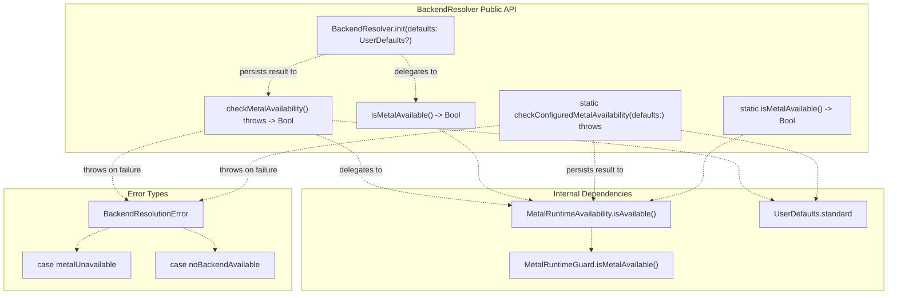
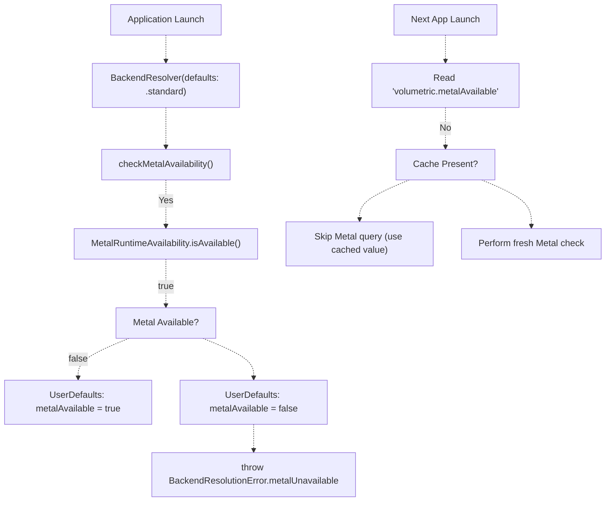
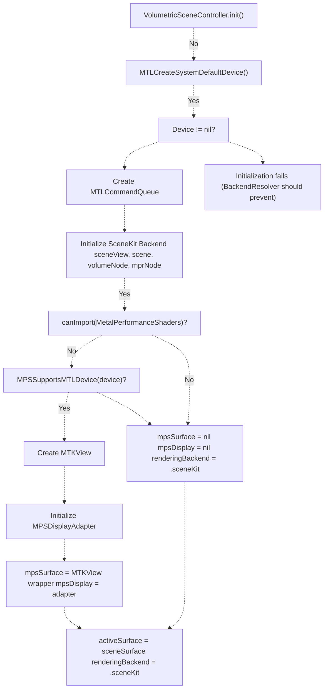
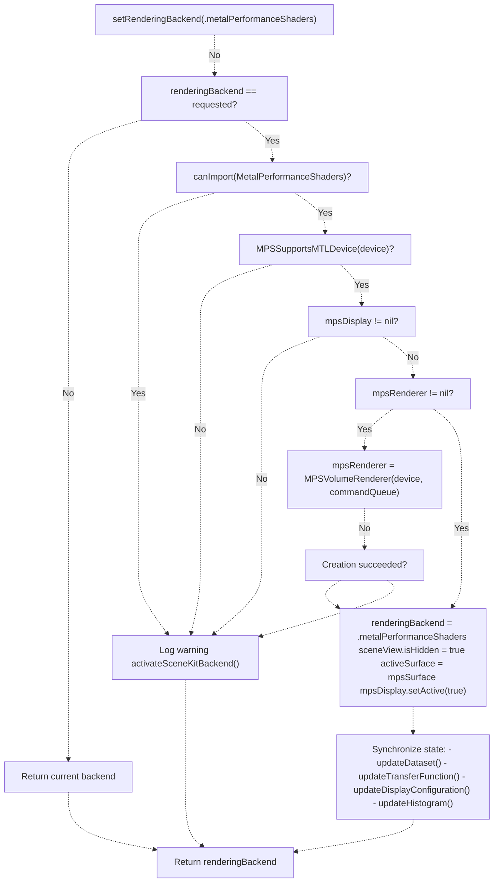
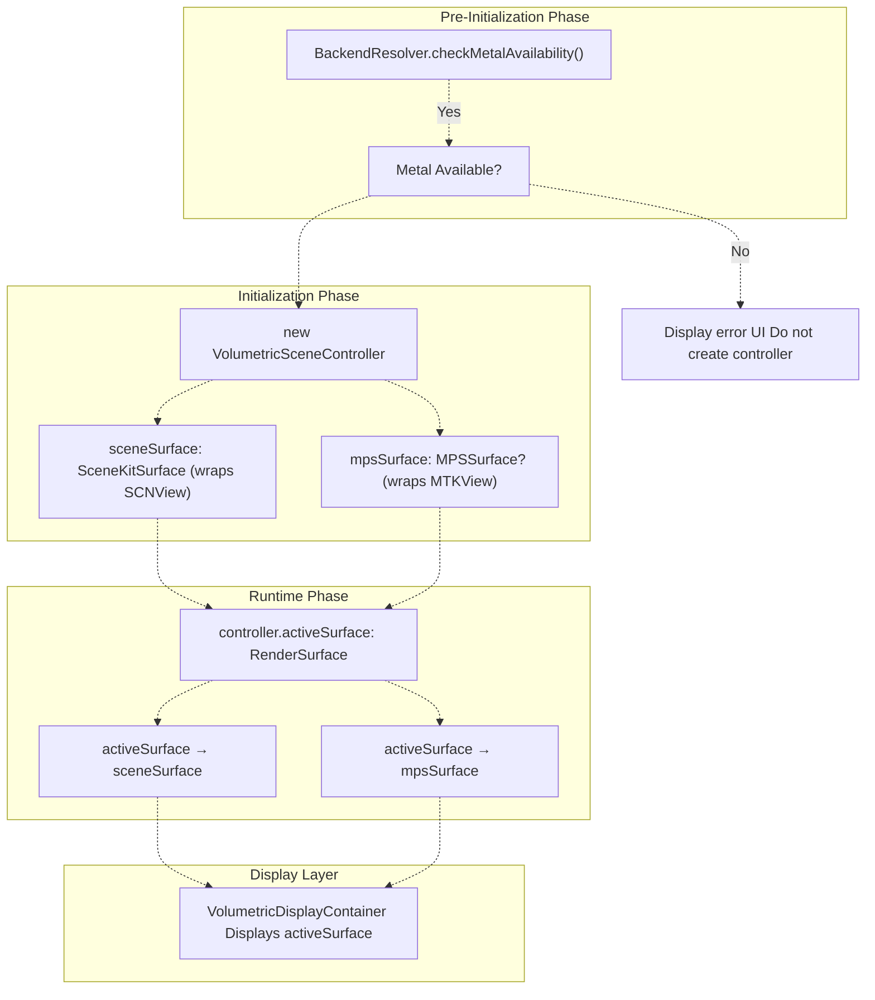

# Backend Resolution & Metal Detection

> **Relevant source files**
> * [BACKEND_RESOLVER_USAGE.md](https://github.com/ThalesMMS/MTK/blob/eda6f990/BACKEND_RESOLVER_USAGE.md)
> * [DOCUMENTATION_STANDARD.md](https://github.com/ThalesMMS/MTK/blob/eda6f990/DOCUMENTATION_STANDARD.md)
> * [README.md](https://github.com/ThalesMMS/MTK/blob/eda6f990/README.md)
> * [SURFACE_ADAPTER_DELIVERABLES.txt](https://github.com/ThalesMMS/MTK/blob/eda6f990/SURFACE_ADAPTER_DELIVERABLES.txt)
> * [Sources/MTKUI/VolumetricSceneController+Interaction.swift](https://github.com/ThalesMMS/MTK/blob/eda6f990/Sources/MTKUI/VolumetricSceneController+Interaction.swift)

## Purpose and Scope

This page documents the **Metal availability detection system** and **backend resolution logic** that determines whether MTK can use GPU-accelerated rendering on the current device. The `BackendResolver` provides early runtime checks to prevent initialization failures, while `MetalRuntimeAvailability` performs the actual Metal framework capability verification.

**Scope covered**:

* `BackendResolver` API and UserDefaults persistence
* `MetalRuntimeAvailability` and `MetalRuntimeGuard` detection mechanisms
* Integration with `VolumetricSceneController` backend switching
* Error handling and graceful degradation strategies

**Related pages**:

* For dual-backend rendering architecture and MPS vs SceneKit selection, see [Rendering Architecture](2%20Rendering-Architecture.md)
* For the RenderSurface abstraction that enables backend swapping, see [RenderSurface Abstraction](2c%20RenderSurface-Abstraction.md)
* For runtime diagnostics and profiling tools, see README.md's "Runtime checks and diagnostics" section

---

## Metal Runtime Detection Architecture

MTK employs a **two-layer detection system** to verify GPU capabilities before instantiating rendering components:

### Layer 1: MetalRuntimeGuard (Low-Level Check)

`MetalRuntimeGuard` is the **foundational Metal detector** that directly queries the Metal framework for device availability. Located in `Sources/MTKCore/Support/MetalRuntimeGuard.swift`, it provides a single boolean check:

```
MetalRuntimeGuard.isMetalAvailable() -> Bool
```

This method attempts to create an `MTLDevice` and verifies the device supports the minimum Metal feature set required by MTK's volume rendering shaders. It does **not** cache results—every call performs a fresh system query.

### Layer 2: MetalRuntimeAvailability (High-Level Facade)

`MetalRuntimeAvailability` wraps `MetalRuntimeGuard` with a **simplified public API**:

```
MetalRuntimeAvailability.isAvailable() -> Bool
```

This facade delegates to `MetalRuntimeGuard` internally but provides a consistent entry point for higher-level code. All MTK modules that need to check Metal support call this method rather than querying `MetalRuntimeGuard` directly.

**Sources**: [BACKEND_RESOLVER_USAGE.md L9-L10](https://github.com/ThalesMMS/MTK/blob/eda6f990/BACKEND_RESOLVER_USAGE.md#L9-L10)

---

## BackendResolver API

`BackendResolver` is a **lightweight orchestrator** that combines Metal detection with optional UserDefaults persistence. It exposes both throwing and non-throwing variants of the availability check.

### Structure and Methods



**Sources**: [BACKEND_RESOLVER_USAGE.md L12-L31](https://github.com/ThalesMMS/MTK/blob/eda6f990/BACKEND_RESOLVER_USAGE.md#L12-L31)

### Method Variants

| Method | Throwing | Static | Persistence | Use Case |
| --- | --- | --- | --- | --- |
| `checkMetalAvailability()` | Yes | No | Optional (if `defaults != nil`) | Initialization-time gating with error handling |
| `isMetalAvailable()` | No | No | None | Non-critical runtime checks |
| `checkConfiguredMetalAvailability(defaults:)` | Yes | Yes | Always | Convenience for standard defaults |
| `isMetalAvailable()` | No | Yes | None | Quick checks without instance creation |

**Sources**: [BACKEND_RESOLVER_USAGE.md L19-L31](https://github.com/ThalesMMS/MTK/blob/eda6f990/BACKEND_RESOLVER_USAGE.md#L19-L31)

### Error Handling

```
public enum BackendResolutionError: LocalizedError, Equatable {    case metalUnavailable    // Metal framework not supported on device    case noBackendAvailable  // Reserved for future non-Metal backends}
```

The `metalUnavailable` case is thrown when `MetalRuntimeAvailability.isAvailable()` returns `false`. The `noBackendAvailable` case is currently unused but reserved for scenarios where MTK might support alternative rendering backends (e.g., CPU-based fallback).

**Sources**: [BACKEND_RESOLVER_USAGE.md L14-L17](https://github.com/ThalesMMS/MTK/blob/eda6f990/BACKEND_RESOLVER_USAGE.md#L14-L17)

---

## UserDefaults Persistence

`BackendResolver` optionally caches Metal availability results to UserDefaults for **faster subsequent launches**. This avoids repeated Metal framework queries when the result is unlikely to change between sessions.

### Persistence Keys

```
public static let metalAvailabilityKey = "volumetric.metalAvailable"public static let preferredBackendKey = "volumetric.preferredBackend"
```

| Key | Type | Purpose | Current Usage |
| --- | --- | --- | --- |
| `metalAvailabilityKey` | `Bool` | Stores last Metal availability check result | Written by `checkMetalAvailability()` when `defaults != nil` |
| `preferredBackendKey` | `String` | User/system preference for backend selection | Reserved for future use (SceneKit vs MPS preference) |

**Sources**: [BACKEND_RESOLVER_USAGE.md L29-L30](https://github.com/ThalesMMS/MTK/blob/eda6f990/BACKEND_RESOLVER_USAGE.md#L29-L30)

### Persistence Flow



**Note**: The current implementation writes to UserDefaults but **does not read from cache** on subsequent launches. The persistence primarily serves as a debugging aid and potential optimization point for future versions.

**Sources**: [BACKEND_RESOLVER_USAGE.md L40-L46](https://github.com/ThalesMMS/MTK/blob/eda6f990/BACKEND_RESOLVER_USAGE.md#L40-L46)

---

## Integration Patterns

### Early Application Lifecycle Check

The **recommended pattern** is to check Metal availability during application initialization, before creating any Metal-dependent UI components:

```
import MTKCoreimport MTKUI@mainstruct VolumeViewerApp: App {    @State private var metalAvailable = false    @State private var showError = false        var body: some Scene {        WindowGroup {            if metalAvailable {                ContentView()            } else {                UnsupportedDeviceView()            }        }        .task {            do {                let resolver = BackendResolver(defaults: .standard)                _ = try resolver.checkMetalAvailability()                metalAvailable = true            } catch {                showError = true            }        }    }}
```

This prevents instantiation of `VolumetricSceneController` or SceneKit views on unsupported devices, avoiding runtime crashes.

**Sources**: [BACKEND_RESOLVER_USAGE.md L34-L50](https://github.com/ThalesMMS/MTK/blob/eda6f990/BACKEND_RESOLVER_USAGE.md#L34-L50)

 README.md

### Non-Throwing Conditional Rendering

For **optional features** or diagnostic tools that gracefully degrade when Metal is unavailable:

```
struct DiagnosticsView: View {    var body: some View {        if BackendResolver.isMetalAvailable() {            MetalPerformanceMonitor()        } else {            Text("GPU diagnostics unavailable on this device")        }    }}
```

The static `isMetalAvailable()` method performs the check without throwing, suitable for SwiftUI view builders.

**Sources**: [BACKEND_RESOLVER_USAGE.md L47-L50](https://github.com/ThalesMMS/MTK/blob/eda6f990/BACKEND_RESOLVER_USAGE.md#L47-L50)

---

## Backend Switching in VolumetricSceneController

`VolumetricSceneController` performs **dual-backend initialization** with runtime capability checks to determine whether MPS acceleration is available.

### Initialization Flow with Metal Detection



**Key Decision Points**:

1. **Metal Device Creation**: [VolumetricSceneController.swift L211-L220](https://github.com/ThalesMMS/MTK/blob/eda6f990/VolumetricSceneController.swift#L211-L220)  - If `MTLCreateSystemDefaultDevice()` returns `nil`, initialization fails. This should never happen if `BackendResolver` was checked first.
2. **MPS Capability Check**: [VolumetricSceneController L475](https://github.com/ThalesMMS/MTK/blob/eda6f990/VolumetricSceneController+Interaction.swift#L475-L475)  - `MPSSupportsMTLDevice(device)` verifies the GPU supports Metal Performance Shaders (requires specific GPU families).
3. **Default Backend**: SceneKit is **always the initial active backend** even when MPS is available, providing predictable startup behavior.

**Sources**: [VolumetricSceneController.swift L211-L370](https://github.com/ThalesMMS/MTK/blob/eda6f990/VolumetricSceneController.swift#L211-L370)

 [VolumetricSceneController L463-L519](https://github.com/ThalesMMS/MTK/blob/eda6f990/VolumetricSceneController+Interaction.swift#L463-L519)

### Runtime Backend Switching

The `setRenderingBackend()` method allows **dynamic backend selection** after initialization:



**Fallback Guarantees**:

* **Platform Check** [VolumetricSceneController L474](https://github.com/ThalesMMS/MTK/blob/eda6f990/VolumetricSceneController+Interaction.swift#L474-L474) : MPS imports only succeed on iOS 17+/macOS 14+ with compatible Metal frameworks.
* **Device Support** [VolumetricSceneController L475](https://github.com/ThalesMMS/MTK/blob/eda6f990/VolumetricSceneController+Interaction.swift#L475-L475) : Even with MPS imported, `MPSSupportsMTLDevice()` verifies GPU family compatibility.
* **Renderer Initialization** [VolumetricSceneController L482-L488](https://github.com/ThalesMMS/MTK/blob/eda6f990/VolumetricSceneController+Interaction.swift#L482-L488) : If `MPSVolumeRenderer` creation fails (e.g., shader compilation errors), falls back to SceneKit.
* **Graceful Degradation**: Every failure path calls `activateSceneKitBackend()` [VolumetricSceneController L521-L533](https://github.com/ThalesMMS/MTK/blob/eda6f990/VolumetricSceneController+Interaction.swift#L521-L533)  ensuring the application never enters an unrenderable state.

**Sources**: [VolumetricSceneController L463-L519](https://github.com/ThalesMMS/MTK/blob/eda6f990/VolumetricSceneController+Interaction.swift#L463-L519)

---

## Error Handling and Fallback Strategies

### Three-Tier Fallback System

MTK implements **defense-in-depth** for Metal availability issues:

| Tier | Component | Check Performed | Failure Action |
| --- | --- | --- | --- |
| **1. Pre-Initialization** | `BackendResolver` | `MetalRuntimeAvailability.isAvailable()` | Throw `BackendResolutionError.metalUnavailable`; application prevents controller creation |
| **2. Backend Selection** | `setRenderingBackend()` | `MPSSupportsMTLDevice(device)` | Log warning; fall back to SceneKit backend |
| **3. Renderer Creation** | `MPSVolumeRenderer.init()` | Shader compilation, resource allocation | Log error; fall back to SceneKit backend |

**Sources**: [VolumetricSceneController L474-L518](https://github.com/ThalesMMS/MTK/blob/eda6f990/VolumetricSceneController+Interaction.swift#L474-L518)

 [BACKEND_RESOLVER_USAGE.md L43-L45](https://github.com/ThalesMMS/MTK/blob/eda6f990/BACKEND_RESOLVER_USAGE.md#L43-L45)

### Logging and Diagnostics

Each failure point emits **structured log messages** for debugging:

```xml
// Tier 1: BackendResolver
throw BackendResolutionError.metalUnavailable
// Application-level handling required

// Tier 2: Backend Selection
logger.warning("Metal Performance Shaders backend unavailable on this device; staying on SceneKit.")
// <FileRef file-url="https://github.com/ThalesMMS/MTK/blob/eda6f990/VolumetricSceneController+Interaction.swift#L476-L477" min=476 max=477 file-path="VolumetricSceneController+Interaction.swift">Hii</FileRef>

// Tier 3: Renderer Initialization
logger.error("Failed to initialize MPS volume renderer; staying on SceneKit backend.")
// <FileRef file-url="https://github.com/ThalesMMS/MTK/blob/eda6f990/VolumetricSceneController+Interaction.swift#L483-L484" min=483 max=484 file-path="VolumetricSceneController+Interaction.swift">Hii</FileRef>
```

**Sources**: [VolumetricSceneController L476-L477](https://github.com/ThalesMMS/MTK/blob/eda6f990/VolumetricSceneController+Interaction.swift#L476-L477)

 [VolumetricSceneController L483-L484](https://github.com/ThalesMMS/MTK/blob/eda6f990/VolumetricSceneController+Interaction.swift#L483-L484)

### SceneKit as Universal Fallback

SceneKit backend **always succeeds on Metal-capable devices** because:

1. **SCNView** requires only basic Metal support, not advanced compute features
2. Custom volume rendering shaders compile to Metal 2.0 baseline
3. No dependency on Metal Performance Shaders framework
4. Continuous rendering loop provides predictable frame delivery

This makes SceneKit the **lowest common denominator** - if `BackendResolver` reports Metal availability, SceneKit rendering will function.

**Sources**: [README.md L13](https://github.com/ThalesMMS/MTK/blob/eda6f990/README.md#L13-L13)

 Diagram 2 analysis in high-level diagrams

---

## Integration with Rendering Pipeline

### Relationship to RenderSurface Abstraction

The `BackendResolver` determines **whether any rendering can occur**, while `RenderSurface` protocol determines **which view displays the rendering**:



**Key Separation**:

* `BackendResolver`: **Can we render at all?** (checks Metal framework availability)
* Backend selection: **Which rendering path should we use?** (checks MPS GPU features)
* `RenderSurface`: **How do we display the output?** (abstracts view layer)

**Sources**: [SURFACE_ADAPTER_DELIVERABLES.txt L13-L15](https://github.com/ThalesMMS/MTK/blob/eda6f990/SURFACE_ADAPTER_DELIVERABLES.txt#L13-L15)

 [VolumetricSceneController L463-L519](https://github.com/ThalesMMS/MTK/blob/eda6f990/VolumetricSceneController+Interaction.swift#L463-L519)

---

## Testing and Validation

### Automated Test Behavior

MTK's test suite handles Metal unavailability gracefully:

```
// Typical test structurefunc testVolumeRendering() throws {    guard BackendResolver.isMetalAvailable() else {        throw XCTSkip("Metal not available on test host")    }        let controller = try VolumetricSceneController()    // ... test rendering operations}
```

Tests that require Metal use `XCTSkip` to avoid spurious failures on unsupported devices (e.g., CI runners without GPU access).

**Sources**: README.md

### Manual Validation

To verify fallback behavior during development:

1. **Force MPS Unavailability**: Temporarily disable MPS import in `VolumetricSceneController+Interaction.swift`
2. **Observe Logs**: Check for "staying on SceneKit" warnings
3. **Verify UI**: Ensure rendering continues without visual artifacts
4. **Backend Switch Attempts**: Call `setRenderingBackend(.metalPerformanceShaders)` and verify it returns `.sceneKit`

**Sources**: [VolumetricSceneController L474-L518](https://github.com/ThalesMMS/MTK/blob/eda6f990/VolumetricSceneController+Interaction.swift#L474-L518)

---

## Summary

### Architectural Principles

1. **Fail Fast at Boundaries**: `BackendResolver` throws errors **before** creating expensive GPU resources
2. **Graceful Degradation**: MPS unavailability falls back to SceneKit, not application failure
3. **Single Source of Truth**: All Metal checks delegate to `MetalRuntimeAvailability.isAvailable()`
4. **Explicit Fallback Paths**: Every backend selection path includes logged fallback to SceneKit
5. **Separation of Concerns**: Metal detection (resolver) is separate from backend capabilities (MPS support) and display abstraction (RenderSurface)

### Recommended Usage Pattern

```python
// 1. Check Metal availability before UI initializationlet resolver = BackendResolver(defaults: .standard)guard (try? resolver.checkMetalAvailability()) == true else {    // Display unsupported device UI    return}// 2. Create controller (SceneKit backend will always be available)let controller = try VolumetricSceneController()// 3. Optionally attempt MPS backend (graceful fallback built-in)let activeBackend = await controller.setRenderingBackend(.metalPerformanceShaders)print("Active backend: \(activeBackend.rawValue)")// 4. Begin rendering (activeSurface points to active backend)container.display(controller.activeSurface)
```

**Sources**: [BACKEND_RESOLVER_USAGE.md L34-L56](https://github.com/ThalesMMS/MTK/blob/eda6f990/BACKEND_RESOLVER_USAGE.md#L34-L56)

 [VolumetricSceneController L463-L519](https://github.com/ThalesMMS/MTK/blob/eda6f990/VolumetricSceneController+Interaction.swift#L463-L519)


### On this page

* [Backend Resolution & Metal Detection](#9.1-backend-resolution-metal-detection)
* [Purpose and Scope](#9.1-purpose-and-scope)
* [Metal Runtime Detection Architecture](#9.1-metal-runtime-detection-architecture)
* [Layer 1: MetalRuntimeGuard (Low-Level Check)](#9.1-layer-1-metalruntimeguard-low-level-check)
* [Layer 2: MetalRuntimeAvailability (High-Level Facade)](#9.1-layer-2-metalruntimeavailability-high-level-facade)
* [BackendResolver API](#9.1-backendresolver-api)
* [Structure and Methods](#9.1-structure-and-methods)
* [Method Variants](#9.1-method-variants)
* [Error Handling](#9.1-error-handling)
* [UserDefaults Persistence](#9.1-userdefaults-persistence)
* [Persistence Keys](#9.1-persistence-keys)
* [Persistence Flow](#9.1-persistence-flow)
* [Integration Patterns](#9.1-integration-patterns)
* [Early Application Lifecycle Check](#9.1-early-application-lifecycle-check)
* [Non-Throwing Conditional Rendering](#9.1-non-throwing-conditional-rendering)
* [Backend Switching in VolumetricSceneController](#9.1-backend-switching-in-volumetricscenecontroller)
* [Initialization Flow with Metal Detection](#9.1-initialization-flow-with-metal-detection)
* [Runtime Backend Switching](#9.1-runtime-backend-switching)
* [Error Handling and Fallback Strategies](#9.1-error-handling-and-fallback-strategies)
* [Three-Tier Fallback System](#9.1-three-tier-fallback-system)
* [Logging and Diagnostics](#9.1-logging-and-diagnostics)
* [SceneKit as Universal Fallback](#9.1-scenekit-as-universal-fallback)
* [Integration with Rendering Pipeline](#9.1-integration-with-rendering-pipeline)
* [Relationship to RenderSurface Abstraction](#9.1-relationship-to-rendersurface-abstraction)
* [Testing and Validation](#9.1-testing-and-validation)
* [Automated Test Behavior](#9.1-automated-test-behavior)
* [Manual Validation](#9.1-manual-validation)
* [Summary](#9.1-summary)
* [Architectural Principles](#9.1-architectural-principles)
* [Recommended Usage Pattern](#9.1-recommended-usage-pattern)

Ask Devin about MTK