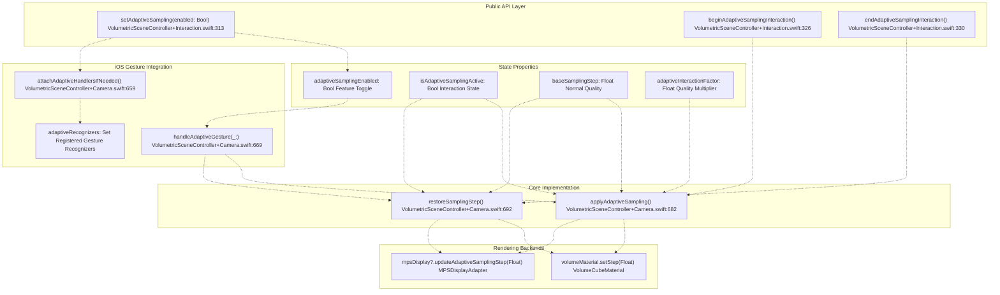
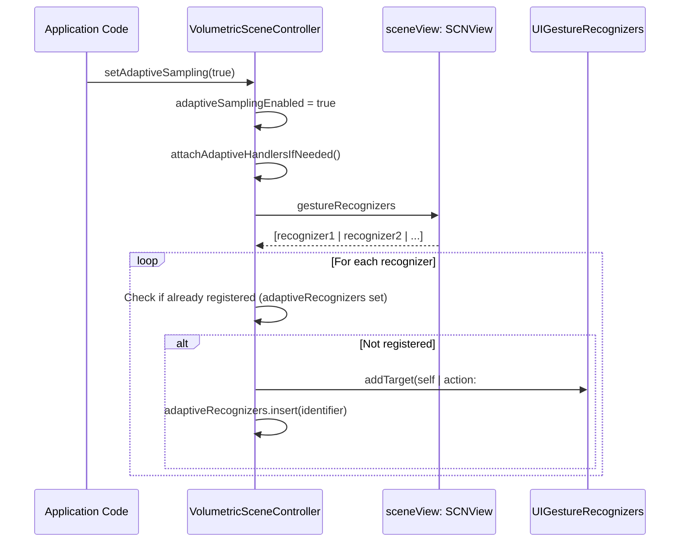
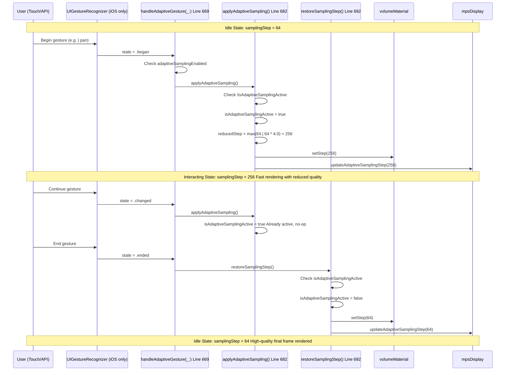
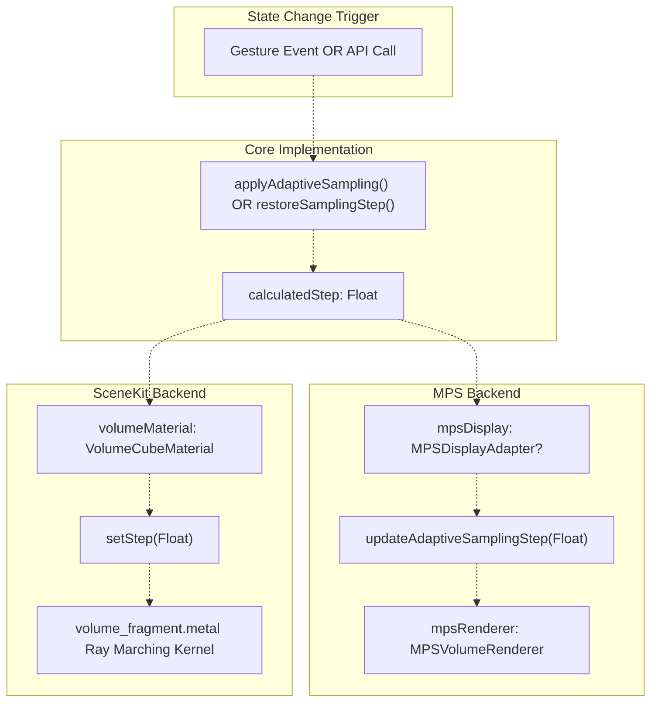
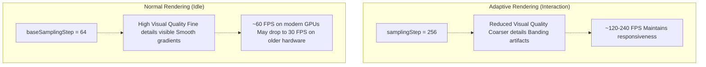

# Adaptive Sampling

> **Relevant source files**
> * [Sources/MTKUI/VolumetricSceneController+Camera.swift](https://github.com/ThalesMMS/MTK/blob/eda6f990/Sources/MTKUI/VolumetricSceneController+Camera.swift)
> * [Sources/MTKUI/VolumetricSceneController+Interaction.swift](https://github.com/ThalesMMS/MTK/blob/eda6f990/Sources/MTKUI/VolumetricSceneController+Interaction.swift)

## Purpose and Scope

This document explains the **adaptive sampling** system in MTK, which dynamically reduces rendering quality during user interactions to maintain responsive frame rates. When users manipulate the camera or volume through gestures, the system temporarily increases the sampling step size (reducing ray marching accuracy) and restores full quality when interaction completes.

For information about the base sampling step configuration, see [Interaction API](3a%20Interaction-API.md). For details on how sampling affects the ray marching algorithm, see [VolumeCubeMaterial](4a%20VolumeCubeMaterial.md).

**Sources:** [Sources/MTKUI/VolumetricSceneController L313-L333](https://github.com/ThalesMMS/MTK/blob/eda6f990/Sources/MTKUI/VolumetricSceneController+Interaction.swift#L313-L333)

 [Sources/MTKUI/VolumetricSceneController L682-L705](https://github.com/ThalesMMS/MTK/blob/eda6f990/Sources/MTKUI/VolumetricSceneController+Camera.swift#L682-L705)

---

## System Overview

Adaptive sampling addresses the **quality-performance trade-off** in volumetric ray marching. During static viewing, MTK uses a fine sampling step (default 64 voxels) for high-quality rendering. During camera rotation, panning, or other interactions, this would cause frame rate drops. The adaptive sampling system:

1. **Detects interaction start** via gesture recognizers (iOS) or explicit API calls
2. **Reduces quality** by increasing the sampling step size (e.g., 64 → 256)
3. **Maintains frame rate** by reducing GPU workload per frame
4. **Restores quality** immediately when interaction ends

This creates a **responsive interaction experience** where users see smooth motion during gestures, followed by a high-quality final frame when they release.

**Key Design Principle:** The system is **opt-in** and **stateful**. Applications must explicitly enable adaptive sampling, and the controller tracks whether an interaction is currently active to avoid redundant state changes.

**Sources:** [Sources/MTKUI/VolumetricSceneController L682-L705](https://github.com/ThalesMMS/MTK/blob/eda6f990/Sources/MTKUI/VolumetricSceneController+Camera.swift#L682-L705)

---

## Architecture Components



**Sources:** [Sources/MTKUI/VolumetricSceneController L313-L333](https://github.com/ThalesMMS/MTK/blob/eda6f990/Sources/MTKUI/VolumetricSceneController+Interaction.swift#L313-L333)

 [Sources/MTKUI/VolumetricSceneController L659-L705](https://github.com/ThalesMMS/MTK/blob/eda6f990/Sources/MTKUI/VolumetricSceneController+Camera.swift#L659-L705)

---

## State Management

The adaptive sampling system maintains **four key state properties** within `VolumetricSceneController`:

| Property | Type | Purpose | Default |
| --- | --- | --- | --- |
| `adaptiveSamplingEnabled` | `Bool` | Feature toggle; must be `true` for system to activate | `false` |
| `isAdaptiveSamplingActive` | `Bool` | Tracks whether an interaction is currently reducing quality | `false` |
| `baseSamplingStep` | `Float` | The normal sampling step size for high-quality rendering | `64` |
| `adaptiveInteractionFactor` | `Float` | Multiplier applied to sampling step during interaction | `4.0` |

### State Transitions

```css
#mermaid-ty5ijuslpvi{font-family:ui-sans-serif,-apple-system,system-ui,Segoe UI,Helvetica;font-size:16px;fill:#ccc;}@keyframes edge-animation-frame{from{stroke-dashoffset:0;}}@keyframes dash{to{stroke-dashoffset:0;}}#mermaid-ty5ijuslpvi .edge-animation-slow{stroke-dasharray:9,5!important;stroke-dashoffset:900;animation:dash 50s linear infinite;stroke-linecap:round;}#mermaid-ty5ijuslpvi .edge-animation-fast{stroke-dasharray:9,5!important;stroke-dashoffset:900;animation:dash 20s linear infinite;stroke-linecap:round;}#mermaid-ty5ijuslpvi .error-icon{fill:#a44141;}#mermaid-ty5ijuslpvi .error-text{fill:#ddd;stroke:#ddd;}#mermaid-ty5ijuslpvi .edge-thickness-normal{stroke-width:1px;}#mermaid-ty5ijuslpvi .edge-thickness-thick{stroke-width:3.5px;}#mermaid-ty5ijuslpvi .edge-pattern-solid{stroke-dasharray:0;}#mermaid-ty5ijuslpvi .edge-thickness-invisible{stroke-width:0;fill:none;}#mermaid-ty5ijuslpvi .edge-pattern-dashed{stroke-dasharray:3;}#mermaid-ty5ijuslpvi .edge-pattern-dotted{stroke-dasharray:2;}#mermaid-ty5ijuslpvi .marker{fill:lightgrey;stroke:lightgrey;}#mermaid-ty5ijuslpvi .marker.cross{stroke:lightgrey;}#mermaid-ty5ijuslpvi svg{font-family:ui-sans-serif,-apple-system,system-ui,Segoe UI,Helvetica;font-size:16px;}#mermaid-ty5ijuslpvi p{margin:0;}#mermaid-ty5ijuslpvi defs #statediagram-barbEnd{fill:lightgrey;stroke:lightgrey;}#mermaid-ty5ijuslpvi g.stateGroup text{fill:#ccc;stroke:none;font-size:10px;}#mermaid-ty5ijuslpvi g.stateGroup text{fill:#ccc;stroke:none;font-size:10px;}#mermaid-ty5ijuslpvi g.stateGroup .state-title{font-weight:bolder;fill:#e0dfdf;}#mermaid-ty5ijuslpvi g.stateGroup rect{fill:#1f2020;stroke:#ccc;}#mermaid-ty5ijuslpvi g.stateGroup line{stroke:lightgrey;stroke-width:1;}#mermaid-ty5ijuslpvi .transition{stroke:lightgrey;stroke-width:1;fill:none;}#mermaid-ty5ijuslpvi .stateGroup .composit{fill:#333;border-bottom:1px;}#mermaid-ty5ijuslpvi .stateGroup .alt-composit{fill:#e0e0e0;border-bottom:1px;}#mermaid-ty5ijuslpvi .state-note{stroke:hsl(180, 0%, 18.3529411765%);fill:hsl(180, 1.5873015873%, 28.3529411765%);}#mermaid-ty5ijuslpvi .state-note text{fill:rgb(183.8476190475, 181.5523809523, 181.5523809523);stroke:none;font-size:10px;}#mermaid-ty5ijuslpvi .stateLabel .box{stroke:none;stroke-width:0;fill:#1f2020;opacity:0.5;}#mermaid-ty5ijuslpvi .edgeLabel .label rect{fill:#1f2020;opacity:0.5;}#mermaid-ty5ijuslpvi .edgeLabel{background-color:hsl(0, 0%, 34.4117647059%);text-align:center;}#mermaid-ty5ijuslpvi .edgeLabel p{background-color:hsl(0, 0%, 34.4117647059%);}#mermaid-ty5ijuslpvi .edgeLabel rect{opacity:0.5;background-color:hsl(0, 0%, 34.4117647059%);fill:hsl(0, 0%, 34.4117647059%);}#mermaid-ty5ijuslpvi .edgeLabel .label text{fill:#ccc;}#mermaid-ty5ijuslpvi .label div .edgeLabel{color:#ccc;}#mermaid-ty5ijuslpvi .stateLabel text{fill:#e0dfdf;font-size:10px;font-weight:bold;}#mermaid-ty5ijuslpvi .node circle.state-start{fill:#f4f4f4;stroke:#f4f4f4;}#mermaid-ty5ijuslpvi .node .fork-join{fill:#f4f4f4;stroke:#f4f4f4;}#mermaid-ty5ijuslpvi .node circle.state-end{fill:#cccccc;stroke:#333;stroke-width:1.5;}#mermaid-ty5ijuslpvi .end-state-inner{fill:#333;stroke-width:1.5;}#mermaid-ty5ijuslpvi .node rect{fill:#1f2020;stroke:#ccc;stroke-width:1px;}#mermaid-ty5ijuslpvi .node polygon{fill:#1f2020;stroke:#ccc;stroke-width:1px;}#mermaid-ty5ijuslpvi #statediagram-barbEnd{fill:lightgrey;}#mermaid-ty5ijuslpvi .statediagram-cluster rect{fill:#1f2020;stroke:#ccc;stroke-width:1px;}#mermaid-ty5ijuslpvi .cluster-label,#mermaid-ty5ijuslpvi .nodeLabel{color:#e0dfdf;}#mermaid-ty5ijuslpvi .statediagram-cluster rect.outer{rx:5px;ry:5px;}#mermaid-ty5ijuslpvi .statediagram-state .divider{stroke:#ccc;}#mermaid-ty5ijuslpvi .statediagram-state .title-state{rx:5px;ry:5px;}#mermaid-ty5ijuslpvi .statediagram-cluster.statediagram-cluster .inner{fill:#333;}#mermaid-ty5ijuslpvi .statediagram-cluster.statediagram-cluster-alt .inner{fill:#555;}#mermaid-ty5ijuslpvi .statediagram-cluster .inner{rx:0;ry:0;}#mermaid-ty5ijuslpvi .statediagram-state rect.basic{rx:5px;ry:5px;}#mermaid-ty5ijuslpvi .statediagram-state rect.divider{stroke-dasharray:10,10;fill:#555;}#mermaid-ty5ijuslpvi .note-edge{stroke-dasharray:5;}#mermaid-ty5ijuslpvi .statediagram-note rect{fill:hsl(180, 1.5873015873%, 28.3529411765%);stroke:hsl(180, 0%, 18.3529411765%);stroke-width:1px;rx:0;ry:0;}#mermaid-ty5ijuslpvi .statediagram-note rect{fill:hsl(180, 1.5873015873%, 28.3529411765%);stroke:hsl(180, 0%, 18.3529411765%);stroke-width:1px;rx:0;ry:0;}#mermaid-ty5ijuslpvi .statediagram-note text{fill:rgb(183.8476190475, 181.5523809523, 181.5523809523);}#mermaid-ty5ijuslpvi .statediagram-note .nodeLabel{color:rgb(183.8476190475, 181.5523809523, 181.5523809523);}#mermaid-ty5ijuslpvi .statediagram .edgeLabel{color:red;}#mermaid-ty5ijuslpvi #dependencyStart,#mermaid-ty5ijuslpvi #dependencyEnd{fill:lightgrey;stroke:lightgrey;stroke-width:1;}#mermaid-ty5ijuslpvi .statediagramTitleText{text-anchor:middle;font-size:18px;fill:#ccc;}#mermaid-ty5ijuslpvi :root{--mermaid-font-family:ui-sans-serif,-apple-system,system-ui,Segoe UI,Helvetica;}adaptiveSamplingEnabled = falseadaptiveSamplingEnabled = truesetAdaptiveSampling(true)setAdaptiveSampling(false)Gesture.began OR beginAdaptiveSamplingInteraction()Gesture.ended/cancelled/failed OR endAdaptiveSamplingInteraction()DisabledIdleInteractingsamplingStep = baseSamplingStepNo gesture handlers attachedsamplingStep = baseSamplingStepisAdaptiveSamplingActive = falseGesture handlers active (iOS)samplingStep = baseSamplingStep * adaptiveInteractionFactorisAdaptiveSamplingActive = trueReduced quality rendering
```

The `isAdaptiveSamplingActive` flag prevents redundant state changes. For example, if multiple gesture recognizers fire simultaneously (e.g., rotation + pan), the first `.began` event activates adaptive sampling, and subsequent events become no-ops until all gestures complete.

**Sources:** [Sources/MTKUI/VolumetricSceneController L682-L705](https://github.com/ThalesMMS/MTK/blob/eda6f990/Sources/MTKUI/VolumetricSceneController+Camera.swift#L682-L705)

---

## Gesture Integration (iOS)

On iOS platforms with UIKit, the system automatically integrates with `UIGestureRecognizer` instances attached to the `SCNView`. This provides **automatic quality reduction** during touch-based interactions without requiring explicit API calls.

### Recognizer Attachment



The `attachAdaptiveHandlersIfNeeded()` method at [VolumetricSceneController L659-L667](https://github.com/ThalesMMS/MTK/blob/eda6f990/VolumetricSceneController+Camera.swift#L659-L667)

 iterates through all existing gesture recognizers and adds the controller as a target. It uses a `Set<ObjectIdentifier>` to track which recognizers have already been registered, preventing duplicate handlers.

**Key Implementation Detail:** The method uses `ObjectIdentifier` rather than storing strong references to recognizers, avoiding retain cycles and allowing recognizers to be deallocated normally.

**Sources:** [Sources/MTKUI/VolumetricSceneController L659-L679](https://github.com/ThalesMMS/MTK/blob/eda6f990/Sources/MTKUI/VolumetricSceneController+Camera.swift#L659-L679)

---

## Interaction Flow

The following sequence diagram illustrates a complete adaptive sampling cycle during user interaction:



**Sources:** [Sources/MTKUI/VolumetricSceneController L669-L705](https://github.com/ThalesMMS/MTK/blob/eda6f990/Sources/MTKUI/VolumetricSceneController+Camera.swift#L669-L705)

---

## Public API Reference

The adaptive sampling system exposes **three public methods** on `VolumetricSceneController`:

### setAdaptiveSampling(_ enabled: Bool)

**Location:** [VolumetricSceneController L313-L324](https://github.com/ThalesMMS/MTK/blob/eda6f990/VolumetricSceneController+Interaction.swift#L313-L324)

Enables or disables the adaptive sampling feature. When disabling, immediately restores base sampling quality.

```css
public func setAdaptiveSampling(_ enabled: Bool) async {    setAdaptiveSamplingFlag(enabled)    if !enabled {        restoreSamplingStep()    }    #if canImport(UIKit)    attachAdaptiveHandlersIfNeeded()    #endif    #if canImport(MetalPerformanceShaders) && canImport(MetalKit)    mpsDisplay?.updateAdaptiveSampling(enabled)    #endif}
```

**Behavior:**

* Sets the `adaptiveSamplingEnabled` flag
* If disabling (`enabled = false`), calls `restoreSamplingStep()` to ensure high quality
* On iOS, calls `attachAdaptiveHandlersIfNeeded()` to register gesture handlers
* Synchronizes state with MPS backend

**Usage Example:**

```
await controller.setAdaptiveSampling(true)  // Enable for touch interactions
```

---

### beginAdaptiveSamplingInteraction()

**Location:** [VolumetricSceneController L326-L328](https://github.com/ThalesMMS/MTK/blob/eda6f990/VolumetricSceneController+Interaction.swift#L326-L328)

Explicitly triggers adaptive sampling, reducing quality for the duration of an interaction. Typically called at the start of programmatic camera manipulation.

```
public func beginAdaptiveSamplingInteraction() async {    applyAdaptiveSampling()}
```

**Behavior:**

* Calls `applyAdaptiveSampling()` to increase sampling step
* Does nothing if adaptive sampling is already active
* Only affects rendering if `adaptiveSamplingEnabled = true`

**Usage Example:**

```
await controller.beginAdaptiveSamplingInteraction()await controller.rotateCamera(screenDelta: delta)
```

---

### endAdaptiveSamplingInteraction()

**Location:** [VolumetricSceneController L330-L332](https://github.com/ThalesMMS/MTK/blob/eda6f990/VolumetricSceneController+Interaction.swift#L330-L332)

Explicitly restores normal sampling quality after an interaction completes.

```
public func endAdaptiveSamplingInteraction() async {    restoreSamplingStep()}
```

**Behavior:**

* Calls `restoreSamplingStep()` to restore `baseSamplingStep`
* Resets `isAdaptiveSamplingActive` flag
* Synchronizes with both SceneKit and MPS backends

**Usage Example:**

```
await controller.rotateCamera(screenDelta: delta)await controller.endAdaptiveSamplingInteraction()
```

**Sources:** [Sources/MTKUI/VolumetricSceneController L313-L333](https://github.com/ThalesMMS/MTK/blob/eda6f990/Sources/MTKUI/VolumetricSceneController+Interaction.swift#L313-L333)

---

## Core Implementation

The adaptive sampling logic is implemented in two internal methods within `VolumetricSceneController+Camera.swift`:

### applyAdaptiveSampling()

**Location:** [VolumetricSceneController L682-L690](https://github.com/ThalesMMS/MTK/blob/eda6f990/VolumetricSceneController+Camera.swift#L682-L690)

Applies reduced sampling quality during interaction.

```
func applyAdaptiveSampling() {    guard adaptiveSamplingEnabled, !isAdaptiveSamplingActive else { return }    isAdaptiveSamplingActive = true    let reducedStep = max(64, baseSamplingStep * adaptiveInteractionFactor)    volumeMaterial.setStep(reducedStep)    #if canImport(MetalPerformanceShaders) && canImport(MetalKit)    mpsDisplay?.updateAdaptiveSamplingStep(reducedStep)    #endif}
```

**Algorithm:**

1. **Guard clause:** Only proceed if adaptive sampling is enabled AND not already active
2. **Set flag:** Mark interaction as active via `isAdaptiveSamplingActive = true`
3. **Calculate reduced step:** Multiply `baseSamplingStep` by `adaptiveInteractionFactor` (typically 4.0)
4. **Enforce minimum:** Ensure reduced step is at least 64 to prevent extreme quality loss
5. **Update backends:** Apply new step to both `volumeMaterial` and `mpsDisplay`

**Example Calculation:**

* `baseSamplingStep = 64`, `adaptiveInteractionFactor = 4.0`
* `reducedStep = max(64, 64 * 4.0) = 256`
* Ray marching now samples every 256 voxels instead of 64

---

### restoreSamplingStep()

**Location:** [VolumetricSceneController L692-L705](https://github.com/ThalesMMS/MTK/blob/eda6f990/VolumetricSceneController+Camera.swift#L692-L705)

Restores normal sampling quality after interaction ends.

```
func restoreSamplingStep() {    guard isAdaptiveSamplingActive else {        volumeMaterial.setStep(baseSamplingStep)        #if canImport(MetalPerformanceShaders) && canImport(MetalKit)        mpsDisplay?.updateAdaptiveSamplingStep(baseSamplingStep)        #endif        return    }    isAdaptiveSamplingActive = false    volumeMaterial.setStep(baseSamplingStep)    #if canImport(MetalPerformanceShaders) && canImport(MetalKit)    mpsDisplay?.updateAdaptiveSamplingStep(baseSamplingStep)    #endif}
```

**Algorithm:**

1. **Check active flag:** If `isAdaptiveSamplingActive = false`, force-set base step and return * This handles edge cases where adaptive sampling was disabled but step wasn't restored
2. **Reset flag:** Mark interaction as complete via `isAdaptiveSamplingActive = false`
3. **Restore quality:** Apply `baseSamplingStep` to both backends

**Idempotency:** Safe to call multiple times; redundant calls have no effect beyond ensuring correct state.

**Sources:** [Sources/MTKUI/VolumetricSceneController L682-L705](https://github.com/ThalesMMS/MTK/blob/eda6f990/Sources/MTKUI/VolumetricSceneController+Camera.swift#L682-L705)

---

## Backend Synchronization

Adaptive sampling synchronizes state across **both rendering backends** to ensure consistent behavior regardless of which backend is active:



**Synchronization Points:**

1. **`volumeMaterial.setStep(Float)`** — Updates the `step` uniform in `VolumeCubeMaterial`, which is bound to the `volume_fragment` shader's ray marching loop
2. **`mpsDisplay?.updateAdaptiveSamplingStep(Float)`** — Updates the MPS renderer's internal state, affecting the next frame generated by `MPSVolumeRenderer`

**Conditional Compilation:** The MPS synchronization calls are wrapped in `#if canImport(MetalPerformanceShaders) && canImport(MetalKit)` to ensure compilation succeeds on platforms without MPS support (e.g., macOS < 10.13).

**Null Safety:** The `mpsDisplay` property is optional (`MPSDisplayAdapter?`), so calls use optional chaining (`?.`). If the MPS backend is unavailable or not initialized, the call becomes a no-op.

**Sources:** [Sources/MTKUI/VolumetricSceneController L682-L705](https://github.com/ThalesMMS/MTK/blob/eda6f990/Sources/MTKUI/VolumetricSceneController+Camera.swift#L682-L705)

---

## Performance Characteristics

The adaptive sampling system trades **rendering accuracy for frame rate** during user interaction. Understanding this trade-off is essential for configuring optimal parameters.

### Sampling Step Impact

| Sampling Step | Ray Samples per Frame | Relative GPU Cost | Visual Quality | Frame Time (estimate) |
| --- | --- | --- | --- | --- |
| 32 (Ultra High) | 512 × 512 × 16 = 4.2M | 100% | Maximum detail | ~33ms (30 FPS) |
| 64 (High) | 512 × 512 × 8 = 2.1M | 50% | High detail | ~16ms (60 FPS) |
| 128 (Medium) | 512 × 512 × 4 = 1.0M | 25% | Moderate detail | ~8ms (120 FPS) |
| 256 (Low) | 512 × 512 × 2 = 0.5M | 12.5% | Low detail, fast | ~4ms (240 FPS) |

**Note:** Actual frame times depend on viewport resolution, dataset size, transfer function complexity, and GPU hardware. The table assumes a 512×512 viewport and linear scaling.

### Quality-Performance Trade-off



### Configuration Recommendations

**For high-end GPUs (M1/M2/M3, A15+, desktop discrete GPUs):**

* `baseSamplingStep = 32` (ultra high quality)
* `adaptiveInteractionFactor = 8.0` (256 during interaction)
* Achieves 60 FPS idle, 240+ FPS during interaction

**For mid-range GPUs (A12-A14, integrated graphics):**

* `baseSamplingStep = 64` (default)
* `adaptiveInteractionFactor = 4.0` (default)
* Achieves 30-60 FPS idle, 120 FPS during interaction

**For low-end or mobile GPUs:**

* `baseSamplingStep = 128` (prioritize frame rate)
* `adaptiveInteractionFactor = 2.0` (256 during interaction)
* Achieves 60 FPS idle, 120 FPS during interaction

**Sources:** [Sources/MTKUI/VolumetricSceneController L682-L690](https://github.com/ThalesMMS/MTK/blob/eda6f990/Sources/MTKUI/VolumetricSceneController+Camera.swift#L682-L690)

---

## Usage Patterns

### Pattern 1: Automatic iOS Gesture Integration

The simplest usage pattern for iOS applications with touch-based interaction:

```
// Enable once during setupawait volumetricController.setAdaptiveSampling(true)// Gestures automatically trigger quality reduction/restoration// User rotates volume → quality drops → user releases → quality restores
```

**Advantages:**

* Zero boilerplate
* Works with all existing gesture recognizers
* Handles multi-touch scenarios correctly

**Limitations:**

* iOS/UIKit only (requires `UIGestureRecognizer`)
* No control over when adaptive sampling triggers

---

### Pattern 2: Explicit API Control (Cross-Platform)

For programmatic camera manipulation or custom interaction handling:

```
// Begin a series of camera movementsawait volumetricController.beginAdaptiveSamplingInteraction()// Perform multiple camera adjustmentsfor delta in animationDeltas {    await volumetricController.rotateCamera(screenDelta: delta)    try? await Task.sleep(nanoseconds: 16_000_000) // ~60 FPS}// Restore quality after animation completesawait volumetricController.endAdaptiveSamplingInteraction()
```

**Advantages:**

* Cross-platform (works on macOS without UIKit)
* Explicit control over quality transitions
* Useful for scripted camera animations

**Best Practice:** Always pair `beginAdaptiveSamplingInteraction()` with `endAdaptiveSamplingInteraction()` to avoid leaving the system in a reduced-quality state.

---

### Pattern 3: Conditional Enabling

Dynamically enable/disable adaptive sampling based on hardware capabilities:

```css
// Detect device performance tierlet deviceSupportsAdaptiveSampling: Bool = {    #if os(iOS)    return ProcessInfo.processInfo.processorCount >= 4    #else    return true    #endif}()if deviceSupportsAdaptiveSampling {    await volumetricController.setAdaptiveSampling(true)}
```

**Use Case:** Disable adaptive sampling on very old devices where the quality reduction is too severe, or on high-end workstations where full quality can be maintained even during interaction.

**Sources:** [Sources/MTKUI/VolumetricSceneController L313-L333](https://github.com/ThalesMMS/MTK/blob/eda6f990/Sources/MTKUI/VolumetricSceneController+Interaction.swift#L313-L333)

---

## Implementation Notes

### Thread Safety

All adaptive sampling methods are marked `async` and execute on the **main actor** (`@MainActor`), ensuring thread-safe access to UI-bound properties like `sceneView.gestureRecognizers` and `volumeMaterial.setStep()`.

**Implication:** Calls from background threads automatically dispatch to the main thread. No explicit `DispatchQueue.main.async` wrappers are needed.

### State Persistence

Adaptive sampling state is **transient** and not persisted to `UserDefaults`. The `adaptiveSamplingEnabled` flag resets to `false` on each application launch. Applications should re-enable it during setup if desired.

### Gesture Recognizer Lifecycle

The `attachAdaptiveHandlersIfNeeded()` method uses **weak target-action patterns** implicitly through `UIGestureRecognizer.addTarget()`. When the `VolumetricSceneController` is deallocated, targets are automatically removed, preventing retain cycles.

The `adaptiveRecognizers` set uses `ObjectIdentifier`, which does not retain the recognizers. This allows gesture recognizers to be added/removed from the scene view dynamically without breaking the adaptive sampling system.

### Backend Switching

When switching rendering backends via `setRenderingBackend()`, the adaptive sampling state remains consistent:

* If an interaction is active during backend switch, both backends receive the reduced sampling step
* When the interaction ends, both backends receive the restored step
* No additional synchronization logic is needed beyond the standard `updateAdaptiveSamplingStep()` calls

**Sources:** [Sources/MTKUI/VolumetricSceneController L659-L705](https://github.com/ThalesMMS/MTK/blob/eda6f990/Sources/MTKUI/VolumetricSceneController+Camera.swift#L659-L705)

 [Sources/MTKUI/VolumetricSceneController L313-L324](https://github.com/ThalesMMS/MTK/blob/eda6f990/Sources/MTKUI/VolumetricSceneController+Interaction.swift#L313-L324)


### On this page

* [Adaptive Sampling](#9.2-adaptive-sampling)
* [Purpose and Scope](#9.2-purpose-and-scope)
* [System Overview](#9.2-system-overview)
* [Architecture Components](#9.2-architecture-components)
* [State Management](#9.2-state-management)
* [State Transitions](#9.2-state-transitions)
* [Gesture Integration (iOS)](#9.2-gesture-integration-ios)
* [Recognizer Attachment](#9.2-recognizer-attachment)
* [Interaction Flow](#9.2-interaction-flow)
* [Public API Reference](#9.2-public-api-reference)
* [setAdaptiveSampling(_ enabled: Bool)](#9.2-object-object)
* [beginAdaptiveSamplingInteraction()](#9.2-object-object-1)
* [endAdaptiveSamplingInteraction()](#9.2-object-object-2)
* [Core Implementation](#9.2-core-implementation)
* [applyAdaptiveSampling()](#9.2-object-object-3)
* [restoreSamplingStep()](#9.2-object-object-4)
* [Backend Synchronization](#9.2-backend-synchronization)
* [Performance Characteristics](#9.2-performance-characteristics)
* [Sampling Step Impact](#9.2-sampling-step-impact)
* [Quality-Performance Trade-off](#9.2-quality-performance-trade-off)
* [Configuration Recommendations](#9.2-configuration-recommendations)
* [Usage Patterns](#9.2-usage-patterns)
* [Pattern 1: Automatic iOS Gesture Integration](#9.2-pattern-1-automatic-ios-gesture-integration)
* [Pattern 2: Explicit API Control (Cross-Platform)](#9.2-pattern-2-explicit-api-control-cross-platform)
* [Pattern 3: Conditional Enabling](#9.2-pattern-3-conditional-enabling)
* [Implementation Notes](#9.2-implementation-notes)
* [Thread Safety](#9.2-thread-safety)
* [State Persistence](#9.2-state-persistence)
* [Gesture Recognizer Lifecycle](#9.2-gesture-recognizer-lifecycle)
* [Backend Switching](#9.2-backend-switching)

Ask Devin about MTK