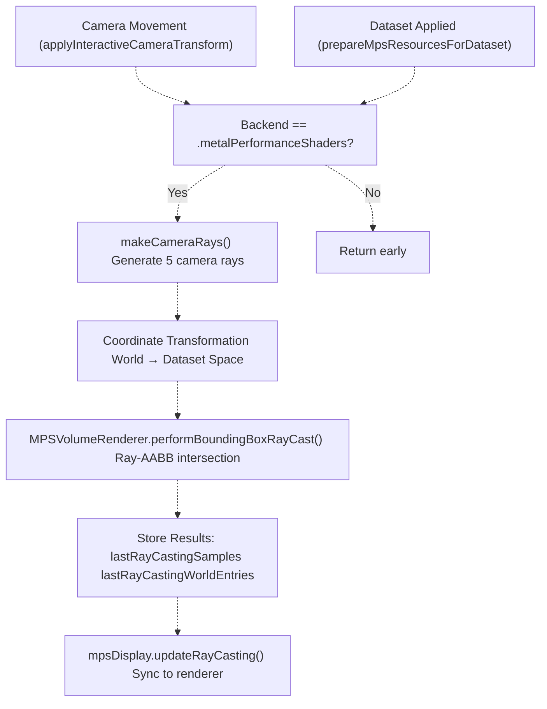
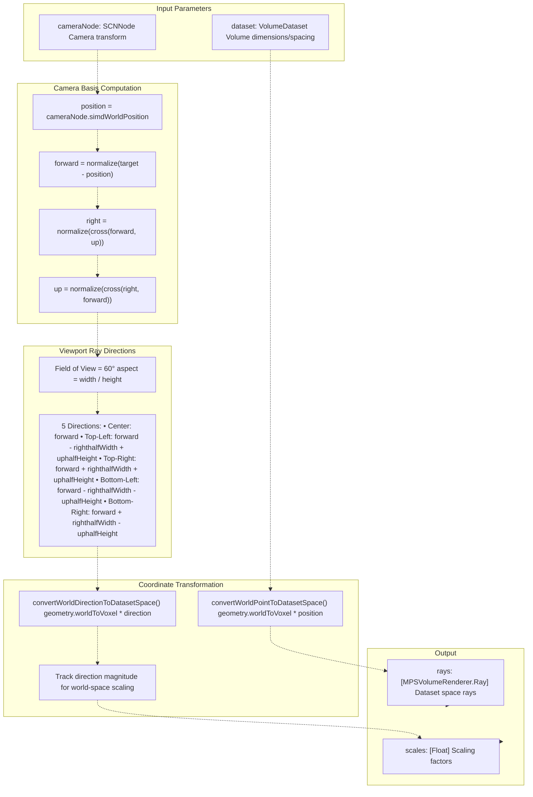
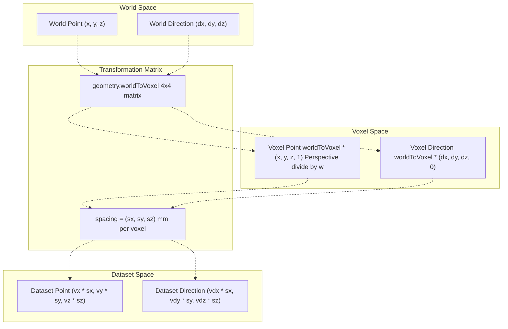
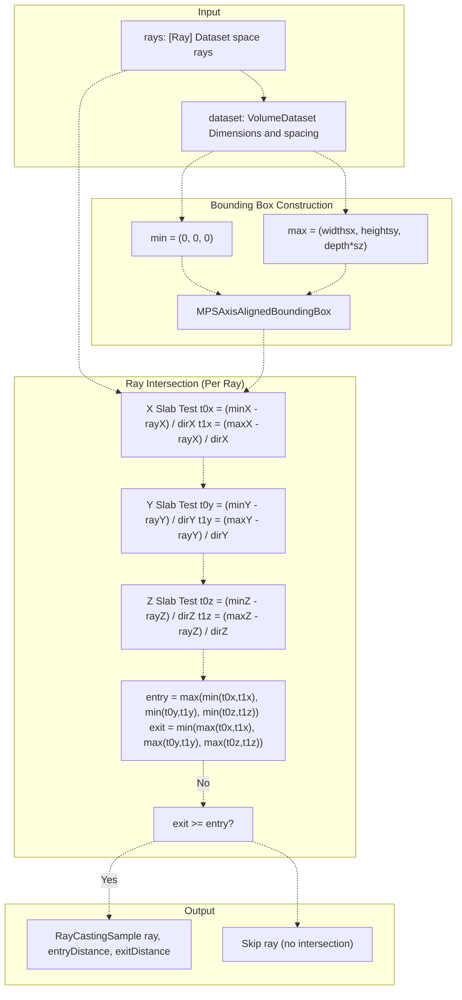

# MPS Ray Casting Cache

> **Relevant source files**
> * [Sources/MTKCore/Rendering/MPSVolumeRenderer.swift](https://github.com/ThalesMMS/MTK/blob/eda6f990/Sources/MTKCore/Rendering/MPSVolumeRenderer.swift)
> * [Sources/MTKUI/VolumetricSceneController+Camera.swift](https://github.com/ThalesMMS/MTK/blob/eda6f990/Sources/MTKUI/VolumetricSceneController+Camera.swift)

## Purpose and Scope

The MPS Ray Casting Cache is a performance optimization system that pre-computes ray-bounding box intersection data for the current camera view when using the Metal Performance Shaders rendering backend. This cache stores entry/exit distances for rays cast from the camera through the volume's bounding box, enabling the MPS renderer to skip empty space and focus GPU resources on regions containing actual volumetric data.

This page covers the cache update mechanism, camera ray generation, coordinate space transformations, and bounding box intersection tests. For information about the MPS rendering backend itself, see [Metal Performance Shaders Backend](2b%20Metal-Performance-Shaders-Backend.md). For coordinate system transformations in general, see [Coordinate System Transformations](9e%20Coordinate-System-Transformations.md).

**Sources:** [Sources/MTKUI/VolumetricSceneController L414-L525](https://github.com/ThalesMMS/MTK/blob/eda6f990/Sources/MTKUI/VolumetricSceneController+Camera.swift#L414-L525)

 [Sources/MTKCore/Rendering/MPSVolumeRenderer.swift L239-L415](https://github.com/ThalesMMS/MTK/blob/eda6f990/Sources/MTKCore/Rendering/MPSVolumeRenderer.swift#L239-L415)

---

## System Architecture

The ray casting cache operates as a just-in-time computation system that responds to camera movements and dataset changes. When the MPS backend is active, the cache generates rays from the camera through the viewport, transforms them to dataset space, performs bounding box intersection tests, and stores the results for use by the MPS renderer.



**Diagram: Cache Update Flow**

The system maintains two cached arrays:

* `lastRayCastingSamples`: Array of `RayCastingSample` containing rays with entry/exit distances in dataset space
* `lastRayCastingWorldEntries`: Array of world-space entry distances (scaled from dataset space)

**Sources:** [Sources/MTKUI/VolumetricSceneController L414-L450](https://github.com/ThalesMMS/MTK/blob/eda6f990/Sources/MTKUI/VolumetricSceneController+Camera.swift#L414-L450)

 [Sources/MTKUI/VolumetricSceneController L163-L167](https://github.com/ThalesMMS/MTK/blob/eda6f990/Sources/MTKUI/VolumetricSceneController+Camera.swift#L163-L167)

 [Sources/MTKUI/VolumetricSceneController L408-L411](https://github.com/ThalesMMS/MTK/blob/eda6f990/Sources/MTKUI/VolumetricSceneController+Camera.swift#L408-L411)

---

## Cache Update Triggers

The cache is updated in two scenarios, both conditional on the MPS backend being active:

### Trigger 1: Interactive Camera Transforms

When the user manipulates the camera through rotation, panning, or dollying, `applyInteractiveCameraTransform` updates the camera's world transform and triggers a cache refresh if the MPS backend is active:

[Sources/MTKUI/VolumetricSceneController L163-L167](https://github.com/ThalesMMS/MTK/blob/eda6f990/Sources/MTKUI/VolumetricSceneController+Camera.swift#L163-L167)

| Condition | Action |
| --- | --- |
| `renderingBackend == .metalPerformanceShaders` | Call `updateRayCastingCache(cameraNode:)` |
| SceneKit backend active | Skip cache update |

### Trigger 2: Dataset Application

When a new dataset is loaded and the MPS backend prepares its Gaussian-filtered texture, the cache is updated to reflect the new volume geometry:

[Sources/MTKUI/VolumetricSceneController L408-L411](https://github.com/ThalesMMS/MTK/blob/eda6f990/Sources/MTKUI/VolumetricSceneController+Camera.swift#L408-L411)

| Step | Operation |
| --- | --- |
| 1 | Apply Gaussian filter to dataset |
| 2 | Update volume and MPR materials with filtered texture |
| 3 | Ensure camera node exists |
| 4 | Call `updateRayCastingCache(cameraNode:)` |

**Sources:** [Sources/MTKUI/VolumetricSceneController L138-L169](https://github.com/ThalesMMS/MTK/blob/eda6f990/Sources/MTKUI/VolumetricSceneController+Camera.swift#L138-L169)

 [Sources/MTKUI/VolumetricSceneController L390-L412](https://github.com/ThalesMMS/MTK/blob/eda6f990/Sources/MTKUI/VolumetricSceneController+Camera.swift#L390-L412)

---

## Camera Ray Generation

The `makeCameraRays` function generates five rays from the camera: one through the viewport center and four through the corners. This sampling strategy provides entry point information across the entire view frustum.



**Diagram: Ray Generation Process**

### Ray Direction Computation

The function computes the half-width and half-height of the viewport in normalized camera space:

```
halfHeight = tan(fov / 2)
halfWidth = halfHeight * aspect
```

These values define the extent of the view frustum, allowing the generation of corner rays that sample the entire viewport.

**Sources:** [Sources/MTKUI/VolumetricSceneController L452-L500](https://github.com/ThalesMMS/MTK/blob/eda6f990/Sources/MTKUI/VolumetricSceneController+Camera.swift#L452-L500)

---

## Coordinate Space Transformations

The ray casting system requires transforming rays from world space (SceneKit scene coordinates) to dataset space (volumetric texture coordinates with physical spacing applied).



**Diagram: Coordinate Space Transformation Pipeline**

### Point Transformation

`convertWorldPointToDatasetSpace` transforms a 3D point from world coordinates to dataset coordinates:

[Sources/MTKUI/VolumetricSceneController L502-L512](https://github.com/ThalesMMS/MTK/blob/eda6f990/Sources/MTKUI/VolumetricSceneController+Camera.swift#L502-L512)

| Step | Operation | Homogeneous Coordinate |
| --- | --- | --- |
| 1 | Construct homogeneous point | `(x, y, z, 1)` |
| 2 | Apply world-to-voxel matrix | `voxel = worldToVoxel * world` |
| 3 | Perspective divide | `voxel / voxel.w` |
| 4 | Scale by voxel spacing | `(vx * sx, vy * sy, vz * sz)` |

### Direction Transformation

`convertWorldDirectionToDatasetSpace` transforms a direction vector (w=0 in homogeneous coordinates):

[Sources/MTKUI/VolumetricSceneController L514-L525](https://github.com/ThalesMMS/MTK/blob/eda6f990/Sources/MTKUI/VolumetricSceneController+Camera.swift#L514-L525)

| Step | Operation | Homogeneous Coordinate |
| --- | --- | --- |
| 1 | Construct homogeneous direction | `(dx, dy, dz, 0)` |
| 2 | Apply world-to-voxel matrix | `vector = worldToVoxel * direction` |
| 3 | Scale by voxel spacing | `(vx * sx, vy * sy, vz * sz)` |
| 4 | Validate finite components | Check `isFinite` on all components |

The `w=0` component ensures the transformation matrix does not apply translation to direction vectors, only rotation and scale.

**Sources:** [Sources/MTKUI/VolumetricSceneController L502-L525](https://github.com/ThalesMMS/MTK/blob/eda6f990/Sources/MTKUI/VolumetricSceneController+Camera.swift#L502-L525)

---

## Bounding Box Ray Casting

Once rays are in dataset space, `MPSVolumeRenderer.performBoundingBoxRayCast` performs axis-aligned bounding box (AABB) intersection tests to determine entry and exit distances for each ray.



**Diagram: Ray-AABB Intersection Algorithm (Slab Method)**

### Slab Method Implementation

The intersection test uses the slab method, which tests each axis independently:

[Sources/MTKCore/Rendering/MPSVolumeRenderer.swift L366-L401](https://github.com/ThalesMMS/MTK/blob/eda6f990/Sources/MTKCore/Rendering/MPSVolumeRenderer.swift#L366-L401)

For each axis (x, y, z):

1. **Parallel Ray Check**: If `|direction| ≤ ulpOfOne`, ray is parallel to the slab * If ray origin is outside slab bounds, no intersection * Otherwise, continue to next axis
2. **Compute Intersection Distances**: * `t0 = (minimum - origin) / direction` * `t1 = (maximum - origin) / direction` * `slabMin = min(t0, t1)` * `slabMax = max(t0, t1)`
3. **Update Global Bounds**: * `entry = max(entry, slabMin)` * `exit = min(exit, slabMax)`
4. **Early Exit Check**: If `exit < entry`, no intersection exists

### Bounding Box Construction

The bounding box spans from the origin to the maximum physical extent of the dataset:

[Sources/MTKCore/Rendering/MPSVolumeRenderer.swift L403-L415](https://github.com/ThalesMMS/MTK/blob/eda6f990/Sources/MTKCore/Rendering/MPSVolumeRenderer.swift#L403-L415)

```
min = (0, 0, 0)
max = (dimensions.width * spacing.x,
       dimensions.height * spacing.y,
       dimensions.depth * spacing.z)
```

**Sources:** [Sources/MTKCore/Rendering/MPSVolumeRenderer.swift L239-L260](https://github.com/ThalesMMS/MTK/blob/eda6f990/Sources/MTKCore/Rendering/MPSVolumeRenderer.swift#L239-L260)

 [Sources/MTKCore/Rendering/MPSVolumeRenderer.swift L366-L415](https://github.com/ThalesMMS/MTK/blob/eda6f990/Sources/MTKCore/Rendering/MPSVolumeRenderer.swift#L366-L415)

---

## Data Structures

### MPSVolumeRenderer.Ray

Represents a ray in 3D space with origin and normalized direction:

[Sources/MTKCore/Rendering/MPSVolumeRenderer.swift L23-L39](https://github.com/ThalesMMS/MTK/blob/eda6f990/Sources/MTKCore/Rendering/MPSVolumeRenderer.swift#L23-L39)

| Field | Type | Description |
| --- | --- | --- |
| `origin` | `SIMD3<Float>` | Ray starting point in dataset space |
| `direction` | `SIMD3<Float>` | Normalized direction vector (fallback to +Z if invalid) |

The initializer automatically normalizes the direction vector and validates the result, falling back to `(0, 0, 1)` if normalization produces non-finite components.

### MPSVolumeRenderer.RayCastingSample

Stores the result of a ray-bounding box intersection:

[Sources/MTKCore/Rendering/MPSVolumeRenderer.swift L41-L45](https://github.com/ThalesMMS/MTK/blob/eda6f990/Sources/MTKCore/Rendering/MPSVolumeRenderer.swift#L41-L45)

| Field | Type | Description |
| --- | --- | --- |
| `ray` | `Ray` | The original ray that was tested |
| `entryDistance` | `Float` | Distance from ray origin to entry point (clamped to ≥0) |
| `exitDistance` | `Float` | Distance from ray origin to exit point |

### Cache Storage Properties

The controller maintains two parallel arrays for cached ray casting results:

| Property | Type | Description |
| --- | --- | --- |
| `lastRayCastingSamples` | `[RayCastingSample]` | Intersection samples in dataset space |
| `lastRayCastingWorldEntries` | `[Float]` | Entry distances scaled back to world space |

The world-space entries are computed by dividing dataset-space entry distances by the direction scaling factors:

[Sources/MTKUI/VolumetricSceneController L434-L441](https://github.com/ThalesMMS/MTK/blob/eda6f990/Sources/MTKUI/VolumetricSceneController+Camera.swift#L434-L441)

```
worldEntry = sample.entryDistance / directionScale
```

This allows the MPS renderer to use either dataset-space or world-space distances depending on its needs.

**Sources:** [Sources/MTKCore/Rendering/MPSVolumeRenderer.swift L23-L45](https://github.com/ThalesMMS/MTK/blob/eda6f990/Sources/MTKCore/Rendering/MPSVolumeRenderer.swift#L23-L45)

 [Sources/MTKUI/VolumetricSceneController L434-L441](https://github.com/ThalesMMS/MTK/blob/eda6f990/Sources/MTKUI/VolumetricSceneController+Camera.swift#L434-L441)

---

## Integration with MPS Backend

The cached ray casting samples are propagated to the MPS display adapter to inform rendering optimizations:

[Sources/MTKUI/VolumetricSceneController L442-L444](https://github.com/ThalesMMS/MTK/blob/eda6f990/Sources/MTKUI/VolumetricSceneController+Camera.swift#L442-L444)

```
mpsDisplay?.updateRayCasting(samples: samples)
```

The `MPSDisplayAdapter` (documented in [MPS Display Adapter](3e%20MPS-Display-Adapter.md)) uses these samples to:

1. **Skip Empty Space**: Start ray marching at the entry distance rather than from the camera
2. **Optimize Sample Step**: Adjust sampling density based on entry/exit distance ranges
3. **Cull Non-Intersecting Pixels**: Avoid processing pixels whose rays miss the volume entirely

### Error Handling

If ray casting fails (e.g., due to invalid geometry or ray generation errors), the cache is cleared:

[Sources/MTKUI/VolumetricSceneController L417-L419](https://github.com/ThalesMMS/MTK/blob/eda6f990/Sources/MTKUI/VolumetricSceneController+Camera.swift#L417-L419)

 [Sources/MTKUI/VolumetricSceneController L424-L428](https://github.com/ThalesMMS/MTK/blob/eda6f990/Sources/MTKUI/VolumetricSceneController+Camera.swift#L424-L428)

 [Sources/MTKUI/VolumetricSceneController L446-L449](https://github.com/ThalesMMS/MTK/blob/eda6f990/Sources/MTKUI/VolumetricSceneController+Camera.swift#L446-L449)

| Condition | Action |
| --- | --- |
| `renderingBackend != .metalPerformanceShaders` | Return early |
| `!datasetApplied` or `dataset == nil` | Clear cache arrays |
| `rays.isEmpty` | Clear cache arrays |
| `renderer.performBoundingBoxRayCast` throws | Log error and clear cache |

This ensures the MPS renderer never operates with stale or invalid ray casting data.

**Sources:** [Sources/MTKUI/VolumetricSceneController L414-L449](https://github.com/ThalesMMS/MTK/blob/eda6f990/Sources/MTKUI/VolumetricSceneController+Camera.swift#L414-L449)

---

## Performance Characteristics

The ray casting cache provides performance benefits through:

1. **Minimal Ray Count**: Only 5 rays are tested (center + 4 corners), minimizing CPU overhead
2. **Early Space Skipping**: Entry distances allow the GPU to skip empty space in front of the volume
3. **Just-In-Time Updates**: Cache updates only when camera moves or dataset changes, not per frame
4. **Parallel Array Storage**: Separate world-space and dataset-space arrays avoid repeated conversions

### Computational Complexity

| Operation | Complexity | Notes |
| --- | --- | --- |
| Ray generation | O(1) | Fixed 5 rays |
| World-to-dataset transform | O(1) per ray | 4×4 matrix multiplication |
| Ray-AABB intersection | O(1) per ray | 3 slab tests per ray |
| Total cache update | O(1) | Bounded by constant ray count |

The cache update is effectively constant-time since the number of rays is fixed at 5, regardless of viewport size or dataset dimensions.

**Sources:** [Sources/MTKUI/VolumetricSceneController L452-L500](https://github.com/ThalesMMS/MTK/blob/eda6f990/Sources/MTKUI/VolumetricSceneController+Camera.swift#L452-L500)

 [Sources/MTKCore/Rendering/MPSVolumeRenderer.swift L239-L260](https://github.com/ThalesMMS/MTK/blob/eda6f990/Sources/MTKCore/Rendering/MPSVolumeRenderer.swift#L239-L260)


### On this page

* [MPS Ray Casting Cache](#9.3-mps-ray-casting-cache)
* [Purpose and Scope](#9.3-purpose-and-scope)
* [System Architecture](#9.3-system-architecture)
* [Cache Update Triggers](#9.3-cache-update-triggers)
* [Trigger 1: Interactive Camera Transforms](#9.3-trigger-1-interactive-camera-transforms)
* [Trigger 2: Dataset Application](#9.3-trigger-2-dataset-application)
* [Camera Ray Generation](#9.3-camera-ray-generation)
* [Ray Direction Computation](#9.3-ray-direction-computation)
* [Coordinate Space Transformations](#9.3-coordinate-space-transformations)
* [Point Transformation](#9.3-point-transformation)
* [Direction Transformation](#9.3-direction-transformation)
* [Bounding Box Ray Casting](#9.3-bounding-box-ray-casting)
* [Slab Method Implementation](#9.3-slab-method-implementation)
* [Bounding Box Construction](#9.3-bounding-box-construction)
* [Data Structures](#9.3-data-structures)
* [MPSVolumeRenderer.Ray](#9.3-mpsvolumerendererray)
* [MPSVolumeRenderer.RayCastingSample](#9.3-mpsvolumerendererraycastingsample)
* [Cache Storage Properties](#9.3-cache-storage-properties)
* [Integration with MPS Backend](#9.3-integration-with-mps-backend)
* [Error Handling](#9.3-error-handling)
* [Performance Characteristics](#9.3-performance-characteristics)
* [Computational Complexity](#9.3-computational-complexity)

Ask Devin about MTK