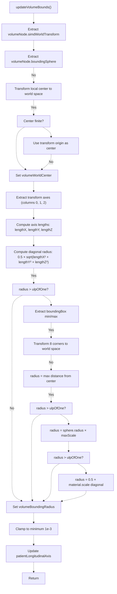
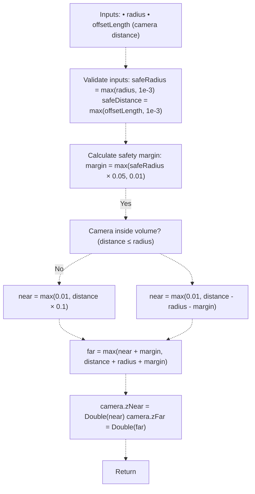
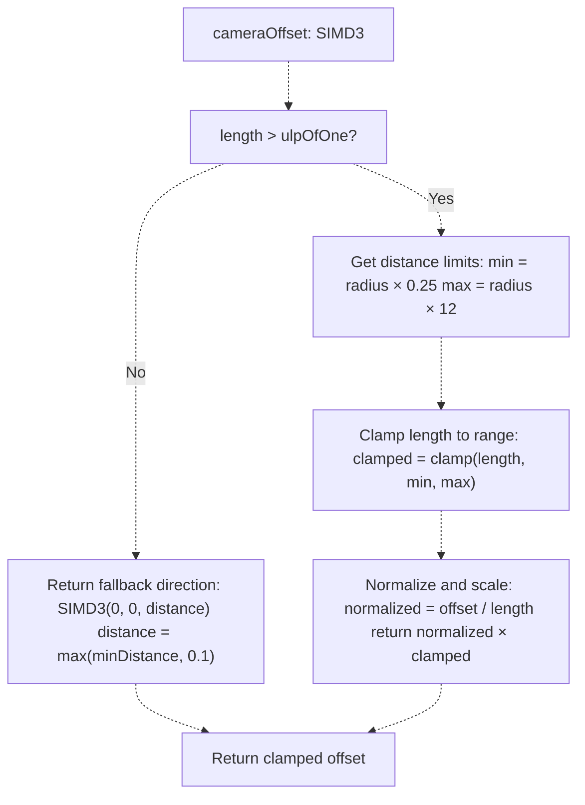
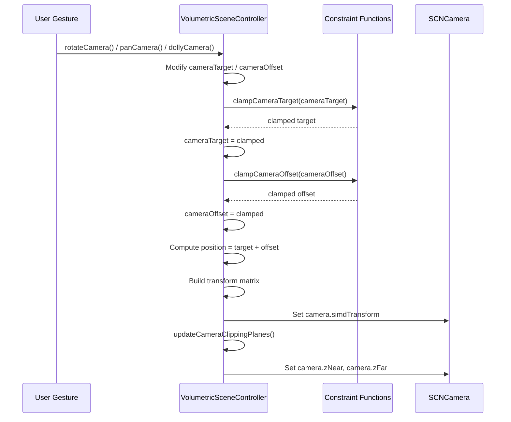
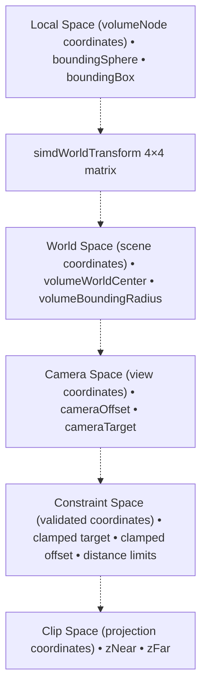

# Volume Bounds and Clipping

> **Relevant source files**
> * [Sources/MTKUI/VolumetricSceneController+Camera.swift](https://github.com/ThalesMMS/MTK/blob/eda6f990/Sources/MTKUI/VolumetricSceneController+Camera.swift)

## Purpose and Scope

This document explains how MTK calculates volumetric bounding geometry, manages camera clipping planes, and constrains camera movement to maintain valid viewing positions. These systems ensure:

1. **Bounding radius calculation** from transformed volume geometry
2. **Dynamic near/far plane adjustment** to prevent clipping artifacts
3. **Camera constraint enforcement** to keep the view centered on the volume

For camera initialization and transformation details, see [Camera Management](3b%20Camera-Management.md). For MPS-specific ray casting bounds, see [MPS Ray Casting Cache](9c%20MPS-Ray-Casting-Cache.md). For coordinate space transformations, see [Coordinate System Transformations](9e%20Coordinate-System-Transformations.md).

---

## Volume Bounding Calculations

### Overview

The `updateVolumeBounds()` function computes the **world-space center** and **bounding radius** of the volume node. This calculation supports multiple fallback strategies to handle edge cases where SceneKit's bounding primitives may be unreliable.

### Calculation Pipeline



**Sources:** [Sources/MTKUI/VolumetricSceneController L236-L315](https://github.com/ThalesMMS/MTK/blob/eda6f990/Sources/MTKUI/VolumetricSceneController+Camera.swift#L236-L315)

### Four-Stage Fallback Strategy

The implementation uses a cascading fallback approach to ensure a valid radius is always computed:

| Stage | Method | Calculation | Use Case |
| --- | --- | --- | --- |
| **1** | Diagonal from axes | `0.5 × sqrt(lengthX² + lengthY² + lengthZ²)` | Standard case with valid transforms |
| **2** | Bounding box corners | Transform 8 corners, find max distance | When diagonal method produces zero |
| **3** | Scaled sphere radius | `sphere.radius × max(lengthX, lengthY, lengthZ)` | When corner method fails |
| **4** | Material scale | `0.5 × length(volumeMaterial.scale)` | Last resort fallback |

**Sources:** [Sources/MTKUI/VolumetricSceneController L262-L314](https://github.com/ThalesMMS/MTK/blob/eda6f990/Sources/MTKUI/VolumetricSceneController+Camera.swift#L262-L314)

### World Center Calculation

```
// Extract local bounding sphere centerlet sphere = node.boundingSpherelet localCenter = SIMD4<Float>(Float(sphere.center.x),                               Float(sphere.center.y),                               Float(sphere.center.z),                               1)// Transform to world spacevar worldCenter = worldTransform * localCenter// Validate and fallback to origin if invalidif !worldCenter.x.isFinite || !worldCenter.y.isFinite || !worldCenter.z.isFinite {    worldCenter = worldTransform * SIMD4<Float>(0, 0, 0, 1)}volumeWorldCenter = SIMD3<Float>(worldCenter.x, worldCenter.y, worldCenter.z)
```

The validation check ensures that scale/rotation anomalies don't produce NaN or infinite coordinates.

**Sources:** [Sources/MTKUI/VolumetricSceneController L240-L249](https://github.com/ThalesMMS/MTK/blob/eda6f990/Sources/MTKUI/VolumetricSceneController+Camera.swift#L240-L249)

### Bounding Box Corner Transformation

When the diagonal method fails, the system transforms all 8 corners of the local bounding box to world space:

```
let corners: [SIMD4<Float>] = [    SIMD4<Float>(Float(localMin.x), Float(localMin.y), Float(localMin.z), 1),    SIMD4<Float>(Float(localMin.x), Float(localMin.y), Float(localMax.z), 1),    SIMD4<Float>(Float(localMin.x), Float(localMax.y), Float(localMin.z), 1),    SIMD4<Float>(Float(localMin.x), Float(localMax.y), Float(localMax.z), 1),    SIMD4<Float>(Float(localMax.x), Float(localMin.y), Float(localMin.z), 1),    SIMD4<Float>(Float(localMax.x), Float(localMin.y), Float(localMax.z), 1),    SIMD4<Float>(Float(localMax.x), Float(localMax.y), Float(localMin.z), 1),    SIMD4<Float>(Float(localMax.x), Float(localMax.y), Float(localMax.z), 1)]for corner in corners {    let worldCorner = worldTransform * corner    let offset = SIMD3<Float>(worldCorner.x, worldCorner.y, worldCorner.z) - volumeWorldCenter    radius = max(radius, simd_length(offset))}
```

This ensures an accurate bounding sphere even with non-uniform scaling.

**Sources:** [Sources/MTKUI/VolumetricSceneController L280-L295](https://github.com/ThalesMMS/MTK/blob/eda6f990/Sources/MTKUI/VolumetricSceneController+Camera.swift#L280-L295)

---

## Camera Clipping Plane Management

### Overview

The `updateCameraClippingPlanes()` function dynamically adjusts the camera's **near plane** (`zNear`) and **far plane** (`zFar`) based on:

1. Volume bounding radius
2. Camera distance from volume center
3. Safety margins to prevent clipping

This prevents:

* **Near clipping**: Volume geometry disappearing when camera is close
* **Far clipping**: Volume geometry disappearing when camera is far
* **Z-fighting**: Precision artifacts from overly large depth ranges

### Clipping Plane Calculation



**Sources:** [Sources/MTKUI/VolumetricSceneController L328-L345](https://github.com/ThalesMMS/MTK/blob/eda6f990/Sources/MTKUI/VolumetricSceneController+Camera.swift#L328-L345)

### Near Plane Strategy

The near plane calculation uses two different strategies depending on camera position:

**Inside Volume (distance ≤ radius)**:

```
near = max(0.01, safeDistance * 0.1)
```

Uses 10% of the camera distance to allow close inspection without front clipping.

**Outside Volume (distance > radius)**:

```
near = max(0.01, safeDistance - safeRadius - margin)
```

Positions the near plane just before the volume's front surface.

**Sources:** [Sources/MTKUI/VolumetricSceneController L334-L339](https://github.com/ThalesMMS/MTK/blob/eda6f990/Sources/MTKUI/VolumetricSceneController+Camera.swift#L334-L339)

### Far Plane Strategy

The far plane is always positioned to encompass the entire volume:

```
let far = max(near + margin, safeDistance + safeRadius + margin)
```

This ensures:

1. The far plane is **always beyond** the near plane (by at least `margin`)
2. The far plane encompasses the **farthest point** of the volume sphere
3. A safety **margin** prevents precision issues at the boundary

**Sources:** [Sources/MTKUI/VolumetricSceneController L341-L344](https://github.com/ThalesMMS/MTK/blob/eda6f990/Sources/MTKUI/VolumetricSceneController+Camera.swift#L341-L344)

### Integration Points

The clipping plane update is called from three locations:

1. **Camera initialization**: [Sources/MTKUI/VolumetricSceneController L55-L58](https://github.com/ThalesMMS/MTK/blob/eda6f990/Sources/MTKUI/VolumetricSceneController+Camera.swift#L55-L58) ``` updateCameraClippingPlanes(cameraNode.camera,                           radius: volumeBoundingRadius,                           offsetLength: simd_length(cameraOffset)) ```
2. **Camera configuration**: [Sources/MTKUI/VolumetricSceneController L88-L90](https://github.com/ThalesMMS/MTK/blob/eda6f990/Sources/MTKUI/VolumetricSceneController+Camera.swift#L88-L90) After `configureCamera(using:)` sets up the initial position.
3. **Interactive camera updates**: [Sources/MTKUI/VolumetricSceneController L160-L162](https://github.com/ThalesMMS/MTK/blob/eda6f990/Sources/MTKUI/VolumetricSceneController+Camera.swift#L160-L162) Every frame during camera manipulation to maintain valid clipping.

---

## Camera Constraint System

### Overview

The constraint system prevents invalid camera states through three mechanisms:

1. **Distance clamping**: `clampCameraOffset()` - Constrains camera-to-target distance
2. **Target clamping**: `clampCameraTarget()` - Constrains target point relative to volume
3. **Distance limits**: `makeCameraDistanceLimits()` - Defines valid distance range

### Camera Distance Constraints



**Sources:** [Sources/MTKUI/VolumetricSceneController L171-L180](https://github.com/ThalesMMS/MTK/blob/eda6f990/Sources/MTKUI/VolumetricSceneController+Camera.swift#L171-L180)

### Distance Limit Calculation

The `makeCameraDistanceLimits()` function defines valid distance bounds based on volume size:

| Limit | Formula | Purpose |
| --- | --- | --- |
| **Minimum** | `max(radius × 0.25, 0.1)` | Prevent camera from entering volume interior |
| **Maximum** | `max(radius × 12, minimum + 0.5)` | Prevent camera from being too far for effective viewing |

**Constraints**:

* Minimum distance is at least **0.1 units** to prevent degenerate camera states
* Maximum distance is at least **0.5 units above minimum** to ensure valid range
* Both limits scale proportionally with **volume size**

**Sources:** [Sources/MTKUI/VolumetricSceneController L182-L186](https://github.com/ThalesMMS/MTK/blob/eda6f990/Sources/MTKUI/VolumetricSceneController+Camera.swift#L182-L186)

### Target Position Constraints

The `clampCameraTarget()` function constrains the camera's look-at point to stay near the volume:

```
func clampCameraTarget(_ target: SIMD3<Float>) -> SIMD3<Float> {    let offset = target - volumeWorldCenter    let limit = max(volumeBoundingRadius * maximumPanDistanceMultiplier, 1.0)    let distance = simd_length(offset)    guard distance > limit else { return target }    if distance <= Float.ulpOfOne {        return volumeWorldCenter    }    return volumeWorldCenter + (offset / distance) * limit}
```

**Behavior**:

* Allows target to deviate up to `maximumPanDistanceMultiplier × radius` from volume center
* If target exceeds limit, projects it back to the **boundary sphere**
* Always returns volume center if input target is at the center (prevents division by zero)

**Sources:** [Sources/MTKUI/VolumetricSceneController L317-L326](https://github.com/ThalesMMS/MTK/blob/eda6f990/Sources/MTKUI/VolumetricSceneController+Camera.swift#L317-L326)

### Constraint Application Flow



**Sources:**

* [Sources/MTKUI/VolumetricSceneController L138-L169](https://github.com/ThalesMMS/MTK/blob/eda6f990/Sources/MTKUI/VolumetricSceneController+Camera.swift#L138-L169)  - `applyInteractiveCameraTransform()`
* [Sources/MTKUI/VolumetricSceneController L115-L136](https://github.com/ThalesMMS/MTK/blob/eda6f990/Sources/MTKUI/VolumetricSceneController+Camera.swift#L115-L136)  - `updateInteractiveCameraState()`

---

## Integration with Camera State Management

### State Recording

Camera bounds and constraints are recorded to `@Published` properties for reactive UI updates:

```
func recordCameraState(position: SIMD3<Float>,                        target: SIMD3<Float>,                        up: SIMD3<Float>) {    cameraState = CameraStateSnapshot(        position: position,        target: target,        up: up,        distance: simd_length(position - target),        bounds: CameraStateSnapshot.Bounds(            minDistance: cameraDistanceLimits.lowerBound,            maxDistance: cameraDistanceLimits.upperBound,            volumeRadius: volumeBoundingRadius,            volumeCenter: volumeWorldCenter        )    )}
```

The `CameraStateSnapshot.Bounds` struct captures the computed constraints for UI display and debugging.

**Sources:** Related to [State Management & Reactivity](3d%20State-Management-&-Reactivity.md)

### Bounds Update Triggers

The `updateVolumeBounds()` function is called at these lifecycle points:

| Trigger | Location | Purpose |
| --- | --- | --- |
| **Camera initialization** | `ensureCameraNode()` | Calculate initial bounds for new camera |
| **Dataset application** | `applyDataset()` | Recalculate when volume geometry changes |
| **Camera configuration** | `configureCamera(using:)` | Update when DICOM geometry is applied |
| **Camera restoration** | `restoreFallbackCamera()` | Refresh bounds before restoring saved camera |
| **MPR alignment** | `alignCameraToMpr()` | Recalculate before aligning to MPR plane |

**Sources:**

* [Sources/MTKUI/VolumetricSceneController L67](https://github.com/ThalesMMS/MTK/blob/eda6f990/Sources/MTKUI/VolumetricSceneController+Camera.swift#L67-L67)  - `configureCamera()` call
* [Sources/MTKUI/VolumetricSceneController L95](https://github.com/ThalesMMS/MTK/blob/eda6f990/Sources/MTKUI/VolumetricSceneController+Camera.swift#L95-L95)  - `restoreFallbackCamera()` call
* [Sources/MTKUI/VolumetricSceneController L614](https://github.com/ThalesMMS/MTK/blob/eda6f990/Sources/MTKUI/VolumetricSceneController+Camera.swift#L614-L614)  - `alignCameraToMpr()` call

---

## Implementation Details

### Numerical Stability

The implementation includes several numerical stability guarantees:

**Epsilon Thresholds**:

```
let epsilon = Float.ulpOfOne  // Smallest representable differencelet minimumRadius = 1e-3      // 0.001 units minimum bounding radiuslet minimumDistance = 0.1     // Fallback minimum camera distance
```

**Finiteness Checks**:

```
if !worldCenter.x.isFinite || !worldCenter.y.isFinite || !worldCenter.z.isFinite {    // Fallback to transform origin}
```

**Division by Zero Prevention**:

```
guard distance > Float.ulpOfOne else {    // Return volume center or fallback direction}
```

**Sources:** [Sources/MTKUI/VolumetricSceneController L246-L324](https://github.com/ThalesMMS/MTK/blob/eda6f990/Sources/MTKUI/VolumetricSceneController+Camera.swift#L246-L324)

### Performance Considerations

**Computational Complexity**:

* `updateVolumeBounds()`: **O(1)** - Fixed number of matrix multiplications and comparisons
* `updateCameraClippingPlanes()`: **O(1)** - Simple arithmetic
* `clampCameraOffset()`: **O(1)** - Vector normalization and scalar math
* `clampCameraTarget()`: **O(1)** - Vector operations

**Update Frequency**:

* Volume bounds: Updated **on dataset change** and **camera configuration** (infrequent)
* Clipping planes: Updated **every interactive frame** during camera manipulation (~60 Hz)
* Constraints: Applied **every interactive frame** during gestures (~60 Hz)

The constraint system is optimized for real-time interaction with minimal overhead.

**Sources:** [Sources/MTKUI/VolumetricSceneController L236-L345](https://github.com/ThalesMMS/MTK/blob/eda6f990/Sources/MTKUI/VolumetricSceneController+Camera.swift#L236-L345)

---

## Coordinate Space Relationships

The volume bounds system operates across multiple coordinate spaces:



**Transform Chain**:

1. **Local → World**: Applied via `volumeNode.simdWorldTransform`
2. **World → Camera**: Relative to `cameraTarget` and `cameraOffset`
3. **Camera → Constraints**: Applied via clamping functions
4. **Constraints → Clipping**: Converted to near/far plane distances

**Sources:**

* [Sources/MTKUI/VolumetricSceneController L238-L249](https://github.com/ThalesMMS/MTK/blob/eda6f990/Sources/MTKUI/VolumetricSceneController+Camera.swift#L238-L249)  - Local to world transform
* [Sources/MTKUI/VolumetricSceneController L138-L169](https://github.com/ThalesMMS/MTK/blob/eda6f990/Sources/MTKUI/VolumetricSceneController+Camera.swift#L138-L169)  - Camera state application

---

## Usage Example

```python
// 1. Volume bounds are automatically calculated when dataset is appliedcontroller.applyDataset(dataset)// 2. Camera is configured with DICOM geometryif let geometry = dataset.dicomGeometry {    controller.configureCamera(using: geometry)}// 3. During interactive manipulation, constraints are applied automaticallycontroller.rotateCamera(pitch: 0.1, yaw: 0.2)  // Internally calls clampCameraOffset()controller.panCamera(dx: 10, dy: 10)            // Internally calls clampCameraTarget()// 4. Clipping planes are updated every frame// camera.zNear and camera.zFar are automatically adjusted// 5. Access computed bounds for debugging or UIlet bounds = controller.cameraState.boundsprint("Volume radius: \(bounds.volumeRadius)")print("Distance limits: \(bounds.minDistance)...\(bounds.maxDistance)")
```

The entire system operates transparently during normal camera manipulation, ensuring valid viewing positions without manual intervention.

**Sources:** Related to [Interaction API](3a%20Interaction-API.md)


### On this page

* [Volume Bounds and Clipping](#9.4-volume-bounds-and-clipping)
* [Purpose and Scope](#9.4-purpose-and-scope)
* [Volume Bounding Calculations](#9.4-volume-bounding-calculations)
* [Overview](#9.4-overview)
* [Calculation Pipeline](#9.4-calculation-pipeline)
* [Four-Stage Fallback Strategy](#9.4-four-stage-fallback-strategy)
* [World Center Calculation](#9.4-world-center-calculation)
* [Bounding Box Corner Transformation](#9.4-bounding-box-corner-transformation)
* [Camera Clipping Plane Management](#9.4-camera-clipping-plane-management)
* [Overview](#9.4-overview-1)
* [Clipping Plane Calculation](#9.4-clipping-plane-calculation)
* [Near Plane Strategy](#9.4-near-plane-strategy)
* [Far Plane Strategy](#9.4-far-plane-strategy)
* [Integration Points](#9.4-integration-points)
* [Camera Constraint System](#9.4-camera-constraint-system)
* [Overview](#9.4-overview-2)
* [Camera Distance Constraints](#9.4-camera-distance-constraints)
* [Distance Limit Calculation](#9.4-distance-limit-calculation)
* [Target Position Constraints](#9.4-target-position-constraints)
* [Constraint Application Flow](#9.4-constraint-application-flow)
* [Integration with Camera State Management](#9.4-integration-with-camera-state-management)
* [State Recording](#9.4-state-recording)
* [Bounds Update Triggers](#9.4-bounds-update-triggers)
* [Implementation Details](#9.4-implementation-details)
* [Numerical Stability](#9.4-numerical-stability)
* [Performance Considerations](#9.4-performance-considerations)
* [Coordinate Space Relationships](#9.4-coordinate-space-relationships)
* [Usage Example](#9.4-usage-example)

Ask Devin about MTK