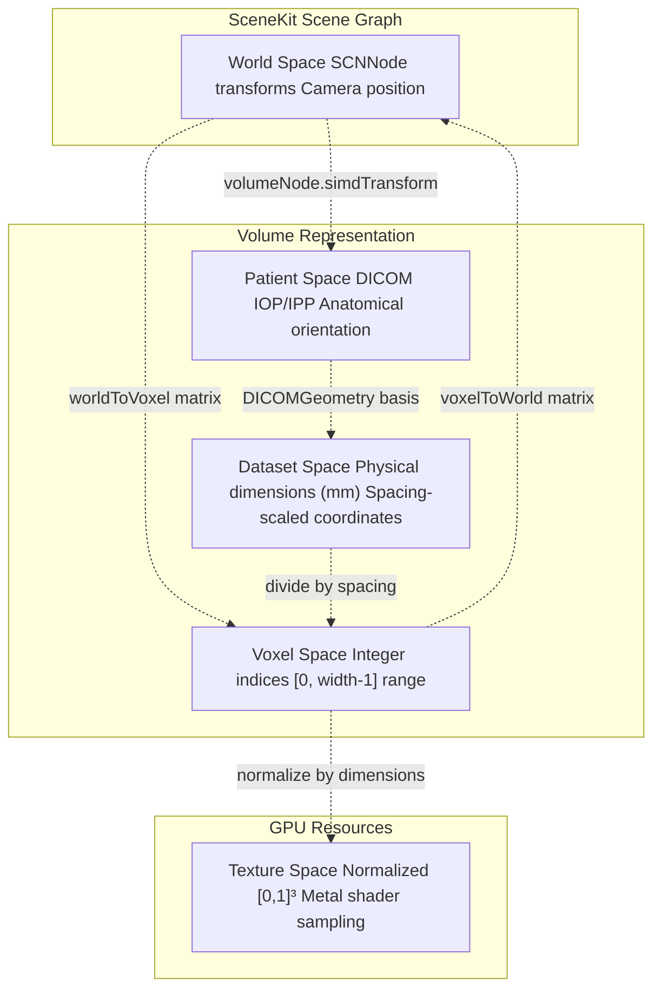
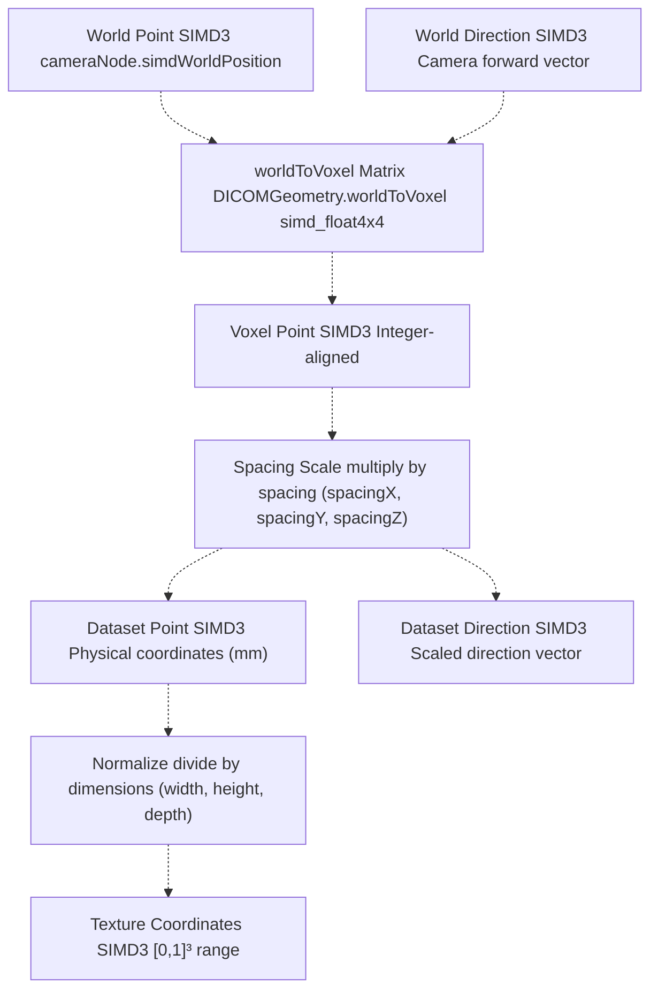
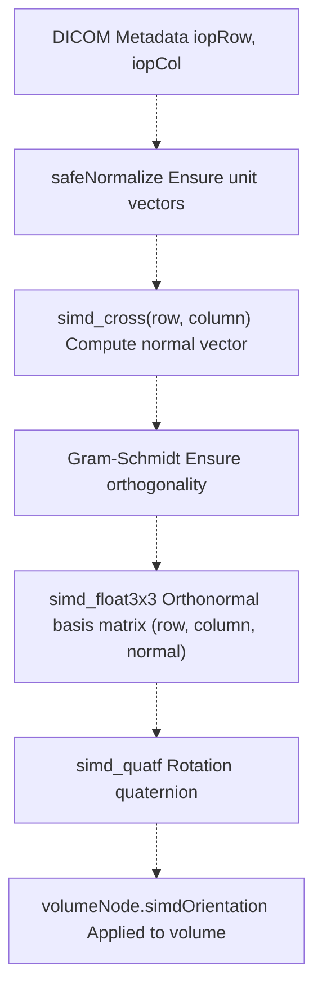
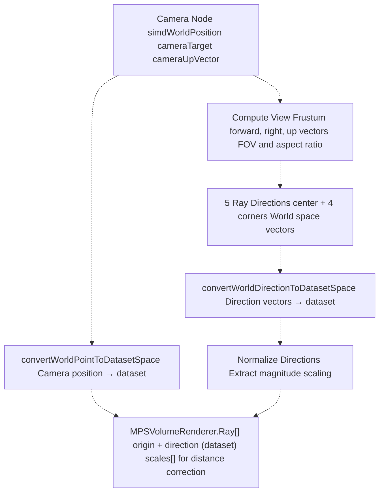
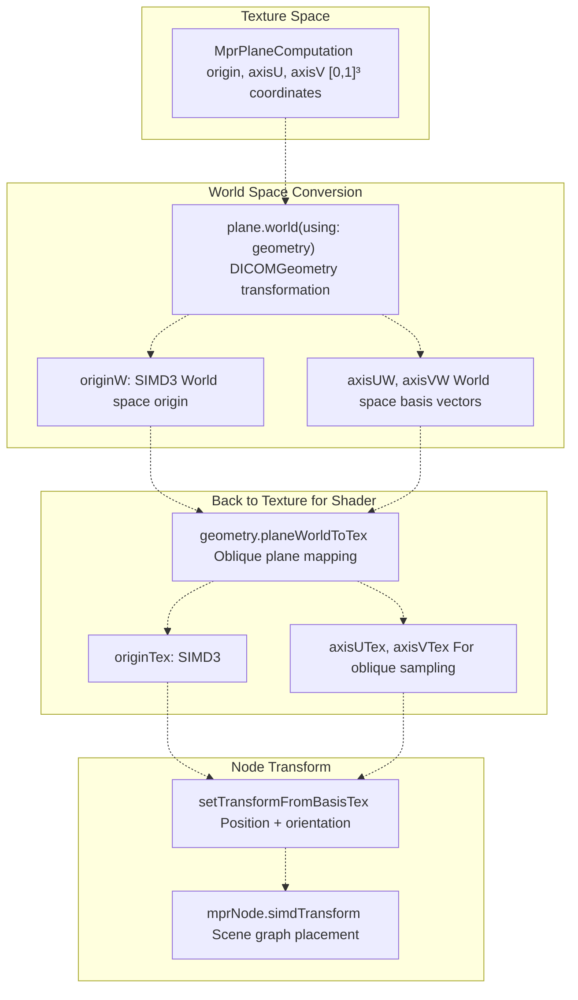

# Coordinate Systems

> **Relevant source files**
> * [Sources/MTKUI/VolumetricSceneController+Camera.swift](https://github.com/ThalesMMS/MTK/blob/eda6f990/Sources/MTKUI/VolumetricSceneController+Camera.swift)
> * [Sources/MTKUI/VolumetricSceneController+Helpers.swift](https://github.com/ThalesMMS/MTK/blob/eda6f990/Sources/MTKUI/VolumetricSceneController+Helpers.swift)

This page documents the coordinate system transformations used throughout MTK's volumetric rendering pipeline. Understanding these systems is critical for camera positioning, multi-planar reconstruction (MPR), ray casting, and DICOM patient orientation.

For volume bounds calculation and camera distance management, see [Volume Bounds and Clipping](9d%20Volume-Bounds-and-Clipping.md). For MPR plane computation details, see [Multi-Planar Reconstruction](3c%20Multi-Planar-Reconstruction-%28MPR%29.md). For camera management mechanics, see [Camera Management](3b%20Camera-Management.md).

---

## Overview

MTK employs five primary coordinate systems to bridge medical imaging data (DICOM) with GPU rendering (Metal) and scene management (SceneKit):

| Coordinate System | Unit | Range | Primary Use |
| --- | --- | --- | --- |
| **World Space** | Scene units | Unbounded | SceneKit scene graph, camera positioning, node transforms |
| **Texture Space** | Normalized | [0, 1]³ | Metal shader sampling, GPU texture coordinates |
| **Dataset Space** | Physical (mm) | Spacing-dependent | Ray casting, distance calculations, DICOM physical coordinates |
| **Voxel Space** | Integer indices | [0, width-1] × [0, height-1] × [0, depth-1] | Volume data access, MPR slice indexing |
| **Patient Space** | DICOM LPS/RAS | DICOM-defined | Patient anatomical orientation, clinical interpretation |

The system performs continuous transformations between these spaces to maintain consistency across rendering backends, camera operations, and medical imaging standards.

---

## Coordinate System Definitions

### World Space

World space is SceneKit's native coordinate system where the scene graph operates. All `SCNNode` transforms, camera positions, and lighting are expressed in world coordinates.

* **Origin**: Scene root (typically `(0, 0, 0)`)
* **Units**: Abstract scene units (typically 1 unit = 1 meter equivalent)
* **Handedness**: Right-handed (SceneKit default)
* **Primary Use**: `volumeNode.simdWorldPosition`, `cameraNode.simdWorldTransform`, `volumeWorldCenter`

### Texture Space

Texture space represents the normalized [0, 1]³ coordinate system used by Metal shaders to sample 3D textures.

* **Origin**: Front-bottom-left corner `(0, 0, 0)`
* **Bounds**: `(1, 1, 1)` at back-top-right corner
* **Mapping**: `(u, v, w)` where `u = x/width`, `v = y/height`, `w = z/depth`
* **Primary Use**: Fragment shader sampling, `texture.sample(sampler, texCoord)`

### Dataset Space

Dataset space applies physical spacing to voxel indices, representing real-world millimeter coordinates.

* **Origin**: Dataset's first voxel corner
* **Units**: Millimeters (typically)
* **Conversion**: `datasetCoord = voxelIndex * spacing`
* **Primary Use**: Ray casting (`MPSVolumeRenderer`), distance calculations, DICOM Image Position Patient (IPP)

### Voxel Space

Voxel space uses integer indices to address discrete volume elements.

* **Origin**: `(0, 0, 0)` at first voxel
* **Range**: `[0, width-1]`, `[0, height-1]`, `[0, depth-1]`
* **Indexing**: `index = z * (width * height) + y * width + x`
* **Primary Use**: MPR slice selection, direct buffer access

### Patient Space

Patient space encodes anatomical orientation following DICOM Image Orientation Patient (IOP) conventions.

* **Axes**: Typically LPS (Left-Posterior-Superior) or RAS (Right-Anterior-Superior)
* **Definition**: Specified by `iopRow` and `iopCol` vectors from DICOM metadata
* **Primary Use**: Clinical interpretation, orientation markers, anatomical alignment

**Diagram: Coordinate System Hierarchy**



Sources: [Sources/MTKUI/VolumetricSceneController L27-L35](https://github.com/ThalesMMS/MTK/blob/eda6f990/Sources/MTKUI/VolumetricSceneController+Camera.swift#L27-L35)

 [Sources/MTKUI/VolumetricSceneController L347-L361](https://github.com/ThalesMMS/MTK/blob/eda6f990/Sources/MTKUI/VolumetricSceneController+Camera.swift#L347-L361)

 [Sources/MTKUI/VolumetricSceneController L502-L525](https://github.com/ThalesMMS/MTK/blob/eda6f990/Sources/MTKUI/VolumetricSceneController+Camera.swift#L502-L525)

---

## Transformation Pipeline

### Forward Transformations: World → Dataset → Texture

The primary transformation pipeline converts world-space coordinates (e.g., camera position) into dataset space for ray casting, then into texture space for shader sampling.

**Diagram: Forward Transformation Flow**



### Key Transformation Functions

#### convertWorldPointToDatasetSpace

Converts a world-space position to dataset space using the DICOM geometry's transformation matrix.

```yaml
Input:  point (SIMD3<Float>) - world space position
        geometry (DICOMGeometry) - transformation matrices and spacing
Output: SIMD3<Float>? - dataset space position (mm), nil if invalid
```

**Implementation Flow:**

1. Extend point to homogeneous coordinates `SIMD4<Float>(x, y, z, 1)`
2. Apply `geometry.worldToVoxel` matrix multiplication
3. Perform perspective division by `w` component
4. Scale by voxel spacing: `(x * spacingX, y * spacingY, z * spacingZ)`

Sources: [Sources/MTKUI/VolumetricSceneController L502-L512](https://github.com/ThalesMMS/MTK/blob/eda6f990/Sources/MTKUI/VolumetricSceneController+Camera.swift#L502-L512)

#### convertWorldDirectionToDatasetSpace

Converts a world-space direction vector to dataset space for ray casting.

```yaml
Input:  direction (SIMD3<Float>) - world space direction (normalized)
        geometry (DICOMGeometry) - transformation matrices and spacing
Output: SIMD3<Float>? - dataset space direction, nil if invalid
```

**Key Difference from Point Conversion:**

* Uses `w = 0` for direction vectors (no translation component)
* Preserves direction magnitude after spacing scaling
* Returns nil if result contains non-finite components

Sources: [Sources/MTKUI/VolumetricSceneController L514-L525](https://github.com/ThalesMMS/MTK/blob/eda6f990/Sources/MTKUI/VolumetricSceneController+Camera.swift#L514-L525)

#### setTransformFromBasisTex

Transforms an `SCNNode` based on texture-space basis vectors, commonly used for MPR plane positioning.

```yaml
Extension: SCNNode
Input:  originTex (SIMD3<Float>) - texture space origin
        axisUTex (SIMD3<Float>) - U axis in texture space
        axisVTex (SIMD3<Float>) - V axis in texture space
Effect: Sets node's simdPosition, simdOrientation, and plane geometry
```

**Algorithm:**

1. Compute orthonormal basis using Gram-Schmidt process
2. Extract width/height from axis magnitudes
3. Calculate plane center: `origin + 0.5*U + 0.5*V - (0.5, 0.5, 0.5)`
4. Set node orientation from basis quaternion
5. Update `SCNPlane` geometry dimensions

Sources: [Sources/MTKUI/VolumetricSceneController L35-L54](https://github.com/ThalesMMS/MTK/blob/eda6f990/Sources/MTKUI/VolumetricSceneController+Helpers.swift#L35-L54)

---

## DICOM Patient Orientation Integration

### DICOMGeometry Structure

The `DICOMGeometry` structure (defined in MTKCore) encapsulates DICOM spatial metadata and provides transformation matrices.

**Key Components:**

| Field | Type | Purpose |
| --- | --- | --- |
| `iopRow` | `SIMD3<Float>` | Image Orientation Patient - row direction |
| `iopCol` | `SIMD3<Float>` | Image Orientation Patient - column direction |
| `ipp0` | `SIMD3<Float>` | Image Position Patient - origin slice |
| `spacingX/Y/Z` | `Float` | Physical spacing per voxel (mm) |
| `worldToVoxel` | `simd_float4x4` | Transformation matrix: world → voxel |
| `voxelToWorld` | `simd_float4x4` | Transformation matrix: voxel → world |

### Patient Basis Computation

The `patientBasis` function constructs an orthonormal coordinate frame from DICOM orientation vectors.

**Diagram: Patient Basis Construction**



**Implementation Details:**

1. **Normalize Input Vectors**: Use `safeNormalize` with fallbacks to prevent degenerate cases
2. **Compute Cross Product**: `normal = cross(row, column)`
3. **Handle Degeneracy**: If cross product is near-zero, use `safePerpendicular` to generate orthogonal vector
4. **Orthogonalize Column**: Recompute `column = normalize(cross(normal, row))`
5. **Construct Matrix**: Create `simd_float3x3(columns: (row, column, normal))`
6. **Convert to Quaternion**: `simd_normalize(simd_quatf(basis))`

Sources: [Sources/MTKUI/VolumetricSceneController L347-L361](https://github.com/ThalesMMS/MTK/blob/eda6f990/Sources/MTKUI/VolumetricSceneController+Camera.swift#L347-L361)

 [Sources/MTKUI/VolumetricSceneController L27-L35](https://github.com/ThalesMMS/MTK/blob/eda6f990/Sources/MTKUI/VolumetricSceneController+Camera.swift#L27-L35)

### makeGeometry Helper

The `makeGeometry` function creates a `DICOMGeometry` instance from a `VolumeDataset`, extracting orientation metadata.

```yaml
Input:  dataset (VolumeDataset)
Output: DICOMGeometry with computed transformation matrices
```

Sources: [Sources/MTKUI/VolumetricSceneController L644-L657](https://github.com/ThalesMMS/MTK/blob/eda6f990/Sources/MTKUI/VolumetricSceneController+Camera.swift#L644-L657)

---

## Camera Ray Generation for MPS Backend

The MPS rendering backend requires camera rays in dataset space for GPU ray casting. The `makeCameraRays` function performs this multi-stage transformation.

**Diagram: Camera Ray Generation Pipeline**



**Algorithm Breakdown:**

1. **Extract Camera Basis** * Forward: `normalize(target - position)` * Right: `normalize(cross(forward, up))` * Up: `normalize(cross(right, forward))`
2. **Compute Frustum Parameters** * Half-height: `tan(FOV / 2)` * Half-width: `half-height * aspect`
3. **Generate 5 Ray Directions** (world space) * Center: `forward` * Top-left: `normalize(forward - right*halfWidth + up*halfHeight)` * Top-right: `normalize(forward + right*halfWidth + up*halfHeight)` * Bottom-left: `normalize(forward - right*halfWidth - up*halfHeight)` * Bottom-right: `normalize(forward + right*halfWidth - up*halfHeight)`
4. **Transform to Dataset Space** * Origin: `convertWorldPointToDatasetSpace(cameraPosition, geometry)` * Directions: `convertWorldDirectionToDatasetSpace(direction, geometry)` for each
5. **Extract Magnitude Scales** * `scale = simd_length(datasetDirection)` before normalization * Used to convert dataset distances back to world distances

Sources: [Sources/MTKUI/VolumetricSceneController L452-L500](https://github.com/ThalesMMS/MTK/blob/eda6f990/Sources/MTKUI/VolumetricSceneController+Camera.swift#L452-L500)

---

## MPR Plane Coordinate Transformations

Multi-planar reconstruction requires transforming between texture-space plane definitions and world-space node positioning.

### Texture Space Plane Representation

MPR planes are initially computed in texture space using `MprPlaneComputation.make`:

```yaml
Input:  axis (Axis) - X, Y, or Z
        index (Int) - slice index
        dims (SIMD3<Float>) - dataset dimensions
        rotation (simd_quatf) - oblique rotation
Output: Plane with origin, axisU, axisV (texture space)
```

### World Space Conversion

When DICOM geometry is available, the texture-space plane is transformed to world coordinates:

**Diagram: MPR Plane Transformation**



**Why Two-Way Transformation?**

1. **Texture → World**: Computes correct world-space positioning for camera alignment
2. **World → Texture**: Provides oblique sampling coordinates for the fragment shader

The round-trip ensures the plane's visual position matches its sampling coordinates, critical for oblique MPR views.

Sources: [Sources/MTKUI/VolumetricSceneController L568-L607](https://github.com/ThalesMMS/MTK/blob/eda6f990/Sources/MTKUI/VolumetricSceneController+Camera.swift#L568-L607)

---

## Volume World Center and Bounds

The `updateVolumeBounds` function computes the volume's world-space center and bounding radius, essential for camera positioning.

**Algorithm:**

1. **Extract World Transform**: `volumeNode.simdWorldTransform`
2. **Transform Bounding Sphere Center**: Apply transform to local sphere center
3. **Extract Axis Vectors**: `(transform.columns.0/1/2).xyz`
4. **Compute Diagonal Radius**: `0.5 * sqrt(lengthX² + lengthY² + lengthZ²)`
5. **Fallback to Corner Transformation**: If diagonal method fails, transform all 8 bounding box corners
6. **Fallback to Scaled Sphere**: If corners fail, use `sphere.radius * maxScale`

**Coordinate System Interaction:**

* Input: `volumeNode` local bounding box/sphere
* Transform: `simdWorldTransform` matrix
* Output: `volumeWorldCenter` (world space), `volumeBoundingRadius` (world units)

Sources: [Sources/MTKUI/VolumetricSceneController L236-L315](https://github.com/ThalesMMS/MTK/blob/eda6f990/Sources/MTKUI/VolumetricSceneController+Camera.swift#L236-L315)

---

## Practical Examples

### Example 1: Camera Positioning from DICOM Geometry

When a dataset is loaded, the camera is configured using patient orientation:

```sql
1. Extract DICOM vectors: iopRow, iopCol, iopNorm (computed)
2. Compute volume world center: updateVolumeBounds()
3. Position camera: center + normal * distance
4. Create look-at transform: makeLookAtTransform(position, target: center, up: iopCol)
5. Apply to camera node: cameraNode.simdTransform = transform
```

Sources: [Sources/MTKUI/VolumetricSceneController L65-L91](https://github.com/ThalesMMS/MTK/blob/eda6f990/Sources/MTKUI/VolumetricSceneController+Camera.swift#L65-L91)

### Example 2: MPR Slice Selection

Selecting an axial slice at index 100:

```python
1. Voxel Space: index = 100 (Z axis)
2. Normalized: position = 100 / (depth - 1)
3. Texture Space: plane origin = (0.5, 0.5, position)
4. World Space: transform using DICOMGeometry
5. Node Placement: mprNode.simdTransform from basis vectors
```

Sources: [Sources/MTKUI/VolumetricSceneController L707-L720](https://github.com/ThalesMMS/MTK/blob/eda6f990/Sources/MTKUI/VolumetricSceneController+Camera.swift#L707-L720)

### Example 3: Ray Casting for MPS Renderer

Preparing rays for GPU volume rendering:

```
1. World Space: Camera at (1.5, 0.8, 2.0), looking at (0, 0, 0)
2. Generate 5 frustum rays (center + 4 corners)
3. Transform origin: convertWorldPointToDatasetSpace(cameraPos, geometry)
4. Transform directions: convertWorldDirectionToDatasetSpace(dir, geometry)
5. Dataset Space: rays ready for MPSVolumeRenderer.performBoundingBoxRayCast
6. Scale tracking: magnitude of dataset direction for distance correction
```

Sources: [Sources/MTKUI/VolumetricSceneController L414-L450](https://github.com/ThalesMMS/MTK/blob/eda6f990/Sources/MTKUI/VolumetricSceneController+Camera.swift#L414-L450)

---

## Mathematical Utilities

### Safe Normalization

The `safeNormalize` function prevents division by zero in vector normalization:

```
func safeNormalize(_ vector: SIMD3<Float>, fallback: SIMD3<Float>) -> SIMD3<Float>
```

* Checks `simd_length_squared(vector) > Float.ulpOfOne`
* Returns `vector / sqrt(lengthSquared)` if valid
* Returns `fallback` if vector is near-zero

Sources: [Sources/MTKUI/VolumetricSceneController L377-L381](https://github.com/ThalesMMS/MTK/blob/eda6f990/Sources/MTKUI/VolumetricSceneController+Camera.swift#L377-L381)

### Safe Perpendicular

The `safePerpendicular` function generates an orthogonal vector using cross product:

```
func safePerpendicular(to vector: SIMD3<Float>) -> SIMD3<Float>
```

* Selects axis: `(1,0,0)` if `abs(vector.x) < 0.9`, else `(0,1,0)`
* Computes `cross(vector, axis)`
* Returns normalized result with fallback

Sources: [Sources/MTKUI/VolumetricSceneController L383-L387](https://github.com/ThalesMMS/MTK/blob/eda6f990/Sources/MTKUI/VolumetricSceneController+Camera.swift#L383-L387)

### Look-At Transform Construction

The `makeLookAtTransform` function creates a view transformation matrix:

```
func makeLookAtTransform(position: SIMD3<Float>,                          target: SIMD3<Float>,                          up: SIMD3<Float>) -> simd_float4x4
```

**Construction Steps:**

1. Forward: `normalize(target - position)`
2. Right: `normalize(cross(up, forward))`
3. Corrected Up: `normalize(cross(forward, right))`
4. Rotation Matrix: `(right, correctedUp, -forward)`
5. 4×4 Transform: Rotation + translation

Sources: [Sources/MTKUI/VolumetricSceneController L363-L375](https://github.com/ThalesMMS/MTK/blob/eda6f990/Sources/MTKUI/VolumetricSceneController+Camera.swift#L363-L375)

---

## Coordinate System Summary Table

| Transformation | Function | Input Space | Output Space | Key Parameters |
| --- | --- | --- | --- | --- |
| World → Voxel | `geometry.worldToVoxel` matrix | World | Voxel | DICOMGeometry |
| Voxel → Dataset | Multiply by spacing | Voxel | Dataset (mm) | spacingX/Y/Z |
| World → Dataset | `convertWorldPointToDatasetSpace` | World | Dataset | DICOMGeometry |
| Texture → World | `plane.world(using:)` | Texture [0,1] | World | DICOMGeometry |
| World → Texture | `geometry.planeWorldToTex` | World | Texture [0,1] | DICOMGeometry |
| Patient → World | `volumeNode.simdOrientation` | Patient (DICOM) | World | patientBasis matrix |
| Voxel → Texture | Divide by dimensions | Voxel index | Texture [0,1] | width/height/depth |

All transformations use SIMD types (`SIMD3<Float>`, `simd_float4x4`) for efficient computation and Metal shader compatibility.

---

Sources: [Sources/MTKUI/VolumetricSceneController L1-L723](https://github.com/ThalesMMS/MTK/blob/eda6f990/Sources/MTKUI/VolumetricSceneController+Camera.swift#L1-L723)

 [Sources/MTKUI/VolumetricSceneController L1-L61](https://github.com/ThalesMMS/MTK/blob/eda6f990/Sources/MTKUI/VolumetricSceneController+Helpers.swift#L1-L61)


### On this page

* [Coordinate Systems](#9.5-coordinate-systems)
* [Overview](#9.5-overview)
* [Coordinate System Definitions](#9.5-coordinate-system-definitions)
* [World Space](#9.5-world-space)
* [Texture Space](#9.5-texture-space)
* [Dataset Space](#9.5-dataset-space)
* [Voxel Space](#9.5-voxel-space)
* [Patient Space](#9.5-patient-space)
* [Transformation Pipeline](#9.5-transformation-pipeline)
* [Forward Transformations: World → Dataset → Texture](#9.5-forward-transformations-world-dataset-texture)
* [Key Transformation Functions](#9.5-key-transformation-functions)
* [DICOM Patient Orientation Integration](#9.5-dicom-patient-orientation-integration)
* [DICOMGeometry Structure](#9.5-dicomgeometry-structure)
* [Patient Basis Computation](#9.5-patient-basis-computation)
* [makeGeometry Helper](#9.5-makegeometry-helper)
* [Camera Ray Generation for MPS Backend](#9.5-camera-ray-generation-for-mps-backend)
* [MPR Plane Coordinate Transformations](#9.5-mpr-plane-coordinate-transformations)
* [Texture Space Plane Representation](#9.5-texture-space-plane-representation)
* [World Space Conversion](#9.5-world-space-conversion)
* [Volume World Center and Bounds](#9.5-volume-world-center-and-bounds)
* [Practical Examples](#9.5-practical-examples)
* [Example 1: Camera Positioning from DICOM Geometry](#9.5-example-1-camera-positioning-from-dicom-geometry)
* [Example 2: MPR Slice Selection](#9.5-example-2-mpr-slice-selection)
* [Example 3: Ray Casting for MPS Renderer](#9.5-example-3-ray-casting-for-mps-renderer)
* [Mathematical Utilities](#9.5-mathematical-utilities)
* [Safe Normalization](#9.5-safe-normalization)
* [Safe Perpendicular](#9.5-safe-perpendicular)
* [Look-At Transform Construction](#9.5-look-at-transform-construction)
* [Coordinate System Summary Table](#9.5-coordinate-system-summary-table)

Ask Devin about MTK